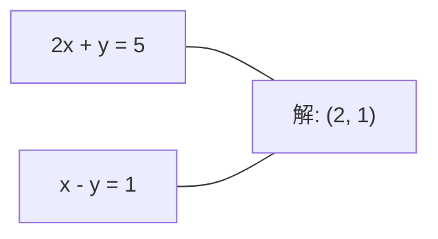
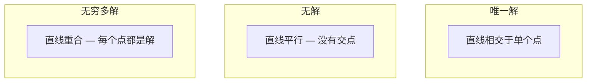

# Linear Systems

> 求解 Ax = b 是数学中最古老的问题之一，而它至今仍在运行你的 Neural Network。

**Type:** Build
**Language:** Python
**前置要求：** Phase 1，Lessons 01 (Linear Algebra Intuition)，02 (Vectors & Matrices)，03 (Matrix Transformations)
**Time:** ~120 minutes

## 学习目标
- 使用带 partial pivoting 和 back substitution 的 Gaussian elimination 求解 Ax = b
- 使用 LU、QR 和 Cholesky decompositions 分解 Matrix，并解释每种方法适用的场景
- 推导 least squares 的 normal equations，并将其与 linear regression 和 ridge regression 联系起来
- 使用 condition number 诊断 ill-conditioned systems，并应用 regularization 使其稳定

## 问题
每次训练 linear regression 时，你都在求解一个 linear system。每次计算 least-squares fit 时，你都在求解一个 linear system。每次 Neural Network layer 计算 `y = Wx + b` 时，它都在评估 linear system 的一侧。加入 regularization 时，你在修改这个 system。使用 Gaussian processes 时，你在分解一个 Matrix。为 Mahalanobis distance 求 covariance matrix 的 inverse 时，你在求解一个 linear system。

方程 Ax = b 无处不在。A 是已知系数构成的 Matrix。b 是已知输出构成的 Vector。x 是你想找到的未知量 Vector。在线性回归中，A 是你的 data matrix，b 是你的 target vector，x 是 weight vector。整个模型可以归结为：找到 x，使 Ax 尽可能接近 b。

本课将从零构建求解这个方程的所有主要方法。你会理解为什么有些方法速度快而另一些方法更稳定，为什么有些方法只适用于 square systems 而另一些能处理 overdetermined systems，以及为什么 Matrix 的 condition number 决定了你的答案是否还有意义。

## 概念
### Ax = b 在几何上意味着什么

一个 linear equations system 具有几何解释。每个 equation 定义一个 hyperplane。解就是所有 hyperplanes 相交的点（或点集）。

```
2x + y = 5          2D 中的两条直线。
x - y  = 1          它们相交于 x=2, y=1。
```



可能出现三种情况：



在 Matrix 形式中，"one solution" 意味着 A is invertible。"No solution" 意味着 system is inconsistent。"Infinite solutions" 意味着 A has a null space。大多数 ML 问题都属于“没有精确解”的类别，因为你的 equations（data points）比 unknowns（parameters）更多。这正是 least squares 发挥作用的地方。

### column picture vs row picture

有两种方式理解 Ax = b。

**Row picture.** A 的每一行定义一个 equation。每个 equation 是一个 hyperplane。解就是它们全部相交的位置。

**Column picture.** A 的每一列都是一个 Vector。问题变成：A 的 columns 的什么 linear combination 能产生 b？

```
A = | 2  1 |    b = | 5 |
    | 1 -1 |        | 1 |

Row picture: 同时求解 2x + y = 5 和 x - y = 1。

Column picture: 找到 x1, x2，使得：
  x1 * [2, 1] + x2 * [1, -1] = [5, 1]
  2 * [2, 1] + 1 * [1, -1] = [4+1, 2-1] = [5, 1]   check.
```

Column picture 更根本。如果 b 位于 A 的 column space 中，system 就有解。如果 b 不在其中，你就找到 column space 中离它最近的点。这个最近点就是 least-squares solution。

### Gaussian elimination

Gaussian elimination 将 Ax = b 转换为 upper triangular system Ux = c，然后用 back substitution 求解。这是最直接的方法。

算法：

```
1. 对每一列 k（pivot column）：
   a. 在第 k 行及其下方，找到 column k 中最大的 entry（partial pivoting）。
   b. 将该行与第 k 行交换。
   c. 对 k 下方的每一行 i：
      - 计算 multiplier m = A[i][k] / A[k][k]
      - 从第 i 行中减去 m 倍的第 k 行。
2. Back substitute：从最后一个 equation 向上求解。
```

示例：

```
Original:
| 2  1  1 | 8 |       R2 = R2 - (2)R1     | 2  1   1 |  8 |
| 4  3  3 |20 |  -->  R3 = R3 - (1)R1 --> | 0  1   1 |  4 |
| 2  3  1 |12 |                            | 0  2   0 |  4 |

                       R3 = R3 - (2)R2     | 2  1   1 |  8 |
                                       --> | 0  1   1 |  4 |
                                           | 0  0  -2 | -4 |

Back substitute:
  -2 * x3 = -4    -->  x3 = 2
  x2 + 2  = 4     -->  x2 = 2
  2*x1 + 2 + 2 = 8 --> x1 = 2
```

Gaussian elimination 的计算成本为 O(n^3)。对于 1000x1000 system，这大约是十亿次 floating-point operations。它很快，但如果你需要用相同的 A 求解多个 system，还可以做得更好。

### Partial pivoting：为什么重要

没有 pivoting，Gaussian elimination 可能失败或产生垃圾结果。如果 pivot element 为零，你会除以零。如果它很小，你会放大 rounding errors。

```
Bad pivot:                       With partial pivoting:
| 0.001  1 | 1.001 |            先交换行：
| 1      1 | 2     |            | 1      1 | 2     |
                                 | 0.001  1 | 1.001 |
m = 1/0.001 = 1000              m = 0.001/1 = 0.001
R2 = R2 - 1000*R1               R2 = R2 - 0.001*R1
| 0.001  1     | 1.001   |      | 1      1     | 2     |
| 0     -999   | -999.0  |      | 0      0.999 | 0.999 |

x2 = 1.000（正确）              x2 = 1.000（正确）
x1 = (1.001 - 1)/0.001          x1 = (2 - 1)/1 = 1.000（正确）
   = 0.001/0.001 = 1.000        稳定，因为 multiplier 很小。
```

在精度有限的 floating-point arithmetic 中，未 pivot 的版本可能丢失 significant digits。Partial pivoting 总是选择可用的最大 pivot，以最小化 error amplification。

### LU decomposition

LU decomposition 将 A 分解为 lower triangular matrix L 和 upper triangular matrix U：A = LU。L Matrix 存储 Gaussian elimination 中的 multipliers。U Matrix 是 elimination 的结果。

```
A = L @ U

| 2  1  1 |   | 1  0  0 |   | 2  1   1 |
| 4  3  3 | = | 2  1  0 | @ | 0  1   1 |
| 2  3  1 |   | 1  2  1 |   | 0  0  -2 |
```

为什么要 factor 而不是直接 eliminate？因为一旦有了 L 和 U，针对任意新的 b 求解 Ax = b 只需要 O(n^2)：

```
Ax = b
LUx = b
令 y = Ux:
  Ly = b    (forward substitution, O(n^2))
  Ux = y    (back substitution, O(n^2))
```

O(n^3) 的成本只在 factorization 时支付一次。之后每次 solve 都是 O(n^2)。如果你需要用相同的 A、不同的 b vectors 求解 1000 个 systems，LU 会让总工作量节省约 1000/3 倍。

使用 partial pivoting 时，你得到 PA = LU，其中 P 是记录 row swaps 的 permutation matrix。

### QR decomposition

QR decomposition 将 A 分解为 orthogonal matrix Q 和 upper triangular matrix R：A = QR。

Orthogonal matrix 具有 Q^T Q = I 的性质。它的 columns 是 orthonormal vectors。乘以 Q 会保持 lengths 和 angles。

```
A = Q @ R

Q has orthonormal columns: Q^T Q = I
R is upper triangular

To solve Ax = b:
  QRx = b
  Rx = Q^T b    (只需乘以 Q^T，不需要 inversion)
  Back substitute to get x.
```

在求解 least-squares problems 时，QR 比 LU 在 numerical stability 上更好。Gram-Schmidt process 逐列构建 Q：

```
Given columns a1, a2, ... of A:

q1 = a1 / ||a1||

q2 = a2 - (a2 . q1) * q1        (减去到 q1 上的 projection)
q2 = q2 / ||q2||                (normalize)

q3 = a3 - (a3 . q1) * q1 - (a3 . q2) * q2
q3 = q3 / ||q3||

R[i][j] = qi . aj    for i <= j
```

每一步都会移除沿所有先前 q vectors 的 component，只留下新的 orthogonal direction。

### Cholesky decomposition

当 A 是 symmetric（A = A^T）且 positive definite（所有 eigenvalues 都为正）时，你可以将其分解为 A = L L^T，其中 L 是 lower triangular。这就是 Cholesky decomposition。

```
A = L @ L^T

| 4  2 |   | 2  0 |   | 2  1 |
| 2  5 | = | 1  2 | @ | 0  2 |

L[i][i] = sqrt(A[i][i] - sum(L[i][k]^2 for k < i))
L[i][j] = (A[i][j] - sum(L[i][k]*L[j][k] for k < j)) / L[j][j]    for i > j
```

Cholesky 比 LU 快两倍，并且只需要一半的存储空间。它只适用于 symmetric positive definite matrices，但这类 Matrix 经常出现：

- Covariance matrices 是 symmetric positive semi-definite（通过 regularization 可变为 positive definite）。
- Gaussian processes 中的 kernel matrix 是 symmetric positive definite。
- Convex function 在 minimum 处的 Hessian 是 symmetric positive definite。
- A^T A 总是 symmetric positive semi-definite。

在 Gaussian processes 中，你用 Cholesky 分解 kernel matrix K，然后求解 K alpha = y 来得到 predictive mean。Cholesky factor 还会给出 marginal likelihood 的 log-determinant：log det(K) = 2 * sum(log(diag(L)))。

### Least squares：当 Ax = b 没有精确解时

如果 A 是 m x n 且 m > n（equations 多于 unknowns），system 就是 overdetermined。此时没有精确解。你改为最小化 squared error：

```
minimize ||Ax - b||^2

这是 squared residuals 的总和：
  sum((A[i,:] @ x - b[i])^2 for i in range(m))
```

Minimizer 满足 normal equations：

```
A^T A x = A^T b
```

推导：展开 ||Ax - b||^2 = (Ax - b)^T (Ax - b) = x^T A^T A x - 2 x^T A^T b + b^T b。对 x 求 Gradient，并令其为零：2 A^T A x - 2 A^T b = 0。

```
Original system (overdetermined, 4 equations, 2 unknowns):
| 1  1 |         | 3 |
| 1  2 | x     = | 5 |       没有精确的 x 能满足全部 4 个 equations。
| 1  3 |         | 6 |
| 1  4 |         | 8 |

Normal equations:
A^T A = | 4  10 |    A^T b = | 22 |
        | 10 30 |            | 63 |

Solve: x = [1.5, 1.7]

这就是 linear regression。x[0] 是 intercept，x[1] 是 slope。
```

### Normal equations = linear regression

这种联系是精确的。在 linear regression 中，data matrix X 每一行对应一个 sample，每一列对应一个 feature。target vector y 每个 entry 对应一个 sample。weight vector w 满足：

```
X^T X w = X^T y
w = (X^T X)^(-1) X^T y
```

这是 linear regression 的 closed-form solution。每次调用 `sklearn.linear_model.LinearRegression.fit()` 都会计算这个结果（或通过 QR 或 SVD 计算等价结果）。

向 Matrix 添加 regularization term lambda * I，你就得到 ridge regression：

```
(X^T X + lambda * I) w = X^T y
w = (X^T X + lambda * I)^(-1) X^T y
```

Regularization 会让 Matrix 的 conditioning 更好（更容易准确求 inverse），并通过将 weights 向零收缩来防止 overfitting。当 lambda > 0 时，Matrix X^T X + lambda * I 总是 symmetric positive definite，因此可以用 Cholesky 求解。

### Pseudoinverse (Moore-Penrose)

Pseudoinverse A+ 将 matrix inversion 推广到 non-square 和 singular matrices。对于任意 Matrix A：

```
x = A+ b

where A+ = V Sigma+ U^T    (computed via SVD)
```

Sigma+ 通过对每个非零 singular value 取 reciprocal 并转置结果构成。如果 A = U Sigma V^T，那么 A+ = V Sigma+ U^T。

```
A = U Sigma V^T        (SVD)

Sigma = | 5  0 |       Sigma+ = | 1/5  0  0 |
        | 0  2 |                | 0  1/2  0 |
        | 0  0 |

A+ = V Sigma+ U^T
```

Pseudoinverse 给出 minimum-norm least-squares solution。如果 system 有：
- 唯一解：A+ b 给出该解。
- 无解：A+ b 给出 least-squares solution。
- 无穷多解：A+ b 给出 ||x|| 最小的那个解。

NumPy 的 `np.linalg.lstsq` 和 `np.linalg.pinv` 内部都使用 SVD。

### Condition number

Condition number 衡量 solution 对 input 的微小变化有多敏感。对于 Matrix A，condition number 是：

```
kappa(A) = ||A|| * ||A^(-1)|| = sigma_max / sigma_min
```

其中 sigma_max 和 sigma_min 分别是最大和最小 singular values。

```
Well-conditioned (kappa ~ 1):        Ill-conditioned (kappa ~ 10^15):
b 中的小变化 -->                    b 中的小变化 -->
x 中的小变化                         x 中的巨大变化

| 2  0 |   kappa = 2/1 = 2          | 1   1          |   kappa ~ 10^15
| 0  1 |   safe to solve            | 1   1+10^(-15) |   solution is garbage
```

经验法则：
- kappa < 100：安全，solution 准确。
- kappa ~ 10^k：你大约会从 floating-point arithmetic 中损失 k 位精度。
- kappa ~ 10^16（对于 float64）：solution 没有意义。Matrix 实际上是 singular。

在 ML 中，ill-conditioning 发生在 features 几乎 collinear 时。Regularization（添加 lambda * I）会将 condition number 从 sigma_max / sigma_min 改善为 (sigma_max + lambda) / (sigma_min + lambda)。

### Iterative methods：conjugate gradient

对于非常大的 sparse systems（数百万 unknowns），LU 或 Cholesky 这样的 direct methods 成本过高。Iterative methods 会通过多次迭代改进一个 guess 来近似 solution。

Conjugate gradient (CG) 在 A 是 symmetric positive definite 时求解 Ax = b。它在 exact arithmetic 中最多 n 次迭代找到精确解，但如果 A 的 eigenvalues 聚集，通常会更快收敛。

```
Algorithm sketch:
  x0 = initial guess (often zero)
  r0 = b - A x0           (residual)
  p0 = r0                 (search direction)

  For k = 0, 1, 2, ...:
    alpha = (rk . rk) / (pk . A pk)
    x_{k+1} = xk + alpha * pk
    r_{k+1} = rk - alpha * A pk
    beta = (r_{k+1} . r_{k+1}) / (rk . rk)
    p_{k+1} = r_{k+1} + beta * pk
    if ||r_{k+1}|| < tolerance: stop
```

CG 用于：
- Large-scale optimization（Newton-CG method）
- 求解 PDE discretizations
- Kernel methods，其中 kernel matrix 太大无法 factor
- 作为其他 iterative solvers 的 preconditioning

Convergence rate 取决于 condition number。Conditioning 更好的 systems 收敛更快，这也是 regularization 有帮助的另一个原因。

### The full picture：何时使用哪种方法

| Method | Requirements | Cost | Use case |
|--------|-------------|------|----------|
| Gaussian elimination | Square, nonsingular A | O(n^3) | 对 square system 的一次性求解 |
| LU decomposition | Square, nonsingular A | O(n^3) factor + O(n^2) solve | 使用相同 A 的多次求解 |
| QR decomposition | Any A (m >= n) | O(mn^2) | Least squares，numerically stable |
| Cholesky | Symmetric positive definite A | O(n^3/3) | Covariance matrices，Gaussian processes，ridge regression |
| Normal equations | Overdetermined (m > n) | O(mn^2 + n^3) | Linear regression（小 n） |
| SVD / pseudoinverse | Any A | O(mn^2) | Rank-deficient systems，minimum-norm solutions |
| Conjugate gradient | Symmetric positive definite, sparse A | O(n * k * nnz) | Large sparse systems，k = iterations |

### Connection to ML

本课中的每种方法都会出现在生产级 ML 中：

**Linear regression.** Closed-form solution 求解 normal equations X^T X w = X^T y。这可以通过 Cholesky（如果 n 很小）、QR（如果 numerical stability 很重要）或 SVD（如果 Matrix 可能 rank-deficient）完成。

**Ridge regression.** 向 X^T X 添加 lambda * I。Regularized system (X^T X + lambda * I) w = X^T y 总是可以通过 Cholesky 求解，因为当 lambda > 0 时，X^T X + lambda * I 是 symmetric positive definite。

**Gaussian processes.** Predictive mean 需要求解 K alpha = y，其中 K 是 kernel matrix。对 K 做 Cholesky factorization 是标准方法。Log marginal likelihood 使用 log det(K) = 2 sum(log(diag(L)))。

**Neural network initialization.** Orthogonal initialization 使用 QR decomposition 创建 columns 为 orthonormal 的 weight matrices。这可以防止 deep networks 中的 signal collapse。

**Preconditioning.** Large-scale optimizers 使用 incomplete Cholesky 或 incomplete LU 作为 conjugate gradient solvers 的 preconditioners。

**Feature engineering.** X^T X 的 condition number 告诉你 features 是否 collinear。如果 kappa 很大，删除 features 或添加 regularization。


```figure
linear-system-conditioning
```

## 构建它
### 步骤 1： Gaussian elimination with partial pivoting

```python
import numpy as np

def gaussian_elimination(A, b):
    n = len(b)
    Ab = np.hstack([A.astype(float), b.reshape(-1, 1).astype(float)])

    for k in range(n):
        max_row = k + np.argmax(np.abs(Ab[k:, k]))
        Ab[[k, max_row]] = Ab[[max_row, k]]

        if abs(Ab[k, k]) < 1e-12:
            raise ValueError(f"Matrix is singular or nearly singular at pivot {k}")

        for i in range(k + 1, n):
            m = Ab[i, k] / Ab[k, k]
            Ab[i, k:] -= m * Ab[k, k:]

    x = np.zeros(n)
    for i in range(n - 1, -1, -1):
        x[i] = (Ab[i, -1] - Ab[i, i+1:n] @ x[i+1:n]) / Ab[i, i]

    return x
```

### 步骤 2： LU decomposition

```python
def lu_decompose(A):
    n = A.shape[0]
    L = np.eye(n)
    U = A.astype(float).copy()
    P = np.eye(n)

    for k in range(n):
        max_row = k + np.argmax(np.abs(U[k:, k]))
        if max_row != k:
            U[[k, max_row]] = U[[max_row, k]]
            P[[k, max_row]] = P[[max_row, k]]
            if k > 0:
                L[[k, max_row], :k] = L[[max_row, k], :k]

        for i in range(k + 1, n):
            L[i, k] = U[i, k] / U[k, k]
            U[i, k:] -= L[i, k] * U[k, k:]

    return P, L, U

def lu_solve(P, L, U, b):
    n = len(b)
    Pb = P @ b.astype(float)

    y = np.zeros(n)
    for i in range(n):
        y[i] = Pb[i] - L[i, :i] @ y[:i]

    x = np.zeros(n)
    for i in range(n - 1, -1, -1):
        x[i] = (y[i] - U[i, i+1:] @ x[i+1:]) / U[i, i]

    return x
```

### 步骤 3： Cholesky decomposition

```python
def cholesky(A):
    n = A.shape[0]
    L = np.zeros_like(A, dtype=float)

    for i in range(n):
        for j in range(i + 1):
            s = A[i, j] - L[i, :j] @ L[j, :j]
            if i == j:
                if s <= 0:
                    raise ValueError("Matrix is not positive definite")
                L[i, j] = np.sqrt(s)
            else:
                L[i, j] = s / L[j, j]

    return L
```

### 步骤 4： Least squares via normal equations

```python
def least_squares_normal(A, b):
    AtA = A.T @ A
    Atb = A.T @ b
    return gaussian_elimination(AtA, Atb)

def ridge_regression(A, b, lam):
    n = A.shape[1]
    AtA = A.T @ A + lam * np.eye(n)
    Atb = A.T @ b
    L = cholesky(AtA)
    y = np.zeros(n)
    for i in range(n):
        y[i] = (Atb[i] - L[i, :i] @ y[:i]) / L[i, i]
    x = np.zeros(n)
    for i in range(n - 1, -1, -1):
        x[i] = (y[i] - L.T[i, i+1:] @ x[i+1:]) / L.T[i, i]
    return x
```

### 步骤 5： Condition number

```python
def condition_number(A):
    U, S, Vt = np.linalg.svd(A)
    return S[0] / S[-1]
```

## 使用它
将这些部分组合起来，在真实数据上进行 linear regression 和 ridge regression：

```python
np.random.seed(42)
X_raw = np.random.randn(100, 3)
w_true = np.array([2.0, -1.0, 0.5])
y = X_raw @ w_true + np.random.randn(100) * 0.1

X = np.column_stack([np.ones(100), X_raw])

w_ols = least_squares_normal(X, y)
print(f"OLS weights (ours):    {w_ols}")

w_np = np.linalg.lstsq(X, y, rcond=None)[0]
print(f"OLS weights (numpy):   {w_np}")
print(f"Max difference: {np.max(np.abs(w_ols - w_np)):.2e}")

w_ridge = ridge_regression(X, y, lam=1.0)
print(f"Ridge weights (ours):  {w_ridge}")

from sklearn.linear_model import Ridge
ridge_sk = Ridge(alpha=1.0, fit_intercept=False)
ridge_sk.fit(X, y)
print(f"Ridge weights (sklearn): {ridge_sk.coef_}")
```

## 交付它
本课产出：
- `code/linear_systems.py`，包含从零实现的 Gaussian elimination、LU decomposition、Cholesky decomposition、least squares 和 ridge regression
- 一个可运行的演示，展示 normal equations 和 sklearn 的 LinearRegression 产生相同的 weights

## 练习
1. 使用你的 Gaussian elimination、你的 LU solver 和 `np.linalg.solve` 求解 system `[[1,2,3],[4,5,6],[7,8,10]] x = [6, 15, 27]`。验证三者在 floating-point tolerance 内给出相同答案。

2. 生成一个 50x5 random matrix X 和 target y = X @ w_true + noise。分别使用 normal equations、QR（通过 `np.linalg.qr`）、SVD（通过 `np.linalg.svd`）和 `np.linalg.lstsq` 求解 w。比较四个 solutions。测量 X^T X 的 condition number，并解释它如何影响你信任哪种方法。

3. 通过让两列几乎相同来创建一个 nearly singular matrix（例如，column 2 = column 1 + 1e-10 * noise）。计算它的 condition number。分别在有 regularization 和无 regularization 的情况下求解 Ax = b（添加 0.01 * I）。比较 solutions 和 residuals。解释为什么 regularization 有帮助。

4. 为一个 100x100 random symmetric positive definite matrix 实现 conjugate gradient algorithm。统计它收敛到 tolerance 1e-8 需要多少次 iterations。与 n iterations 的理论最大值进行比较。

5. 在大小为 10、50、200、500 的 symmetric positive definite matrices 上，对你的 Cholesky solver、你的 LU solver 和 `np.linalg.solve` 计时。绘制结果。验证 Cholesky 大约比 LU 快 2 倍。

## 关键术语
| Term | What people say | What it actually means |
|------|----------------|----------------------|
| Linear system | "Solve for x" | 一组 linear equations Ax = b。找到 x 意味着找到在 transformation A 下产生 output b 的 input。 |
| Gaussian elimination | "Row reduce" | 使用 row operations 系统性地将 diagonal 下方的 entries 置零，产生可通过 back substitution 求解的 upper triangular system。O(n^3)。 |
| Partial pivoting | "Swap rows for stability" | 在 column k 中进行 elimination 前，将该 column 中 absolute value 最大的行交换到 pivot 位置。防止除以很小的数。 |
| LU decomposition | "Factor into triangles" | 写成 A = LU，其中 L 是 lower triangular（存储 multipliers），U 是 upper triangular（eliminated matrix）。将 O(n^3) 成本摊销到多次求解中。 |
| QR decomposition | "Orthogonal factorization" | 写成 A = QR，其中 Q 的 columns 是 orthonormal，R 是 upper triangular。对于 least squares，比 LU 更稳定。 |
| Cholesky decomposition | "Square root of a matrix" | 对 symmetric positive definite A，写成 A = LL^T。成本是 LU 的一半。用于 covariance matrices、kernel matrices 和 ridge regression。 |
| Least squares | "Best fit when exact is impossible" | 当 system overdetermined（equations 多于 unknowns）时，最小化 squared residuals 的总和 ||Ax - b||^2。 |
| Normal equations | "The calculus shortcut" | A^T A x = A^T b。将 ||Ax - b||^2 的 Gradient 设为零。这就是 linear regression 的 closed-form solution。 |
| Pseudoinverse | "Inversion for non-square matrices" | A+ = V Sigma+ U^T via SVD。对于任意 Matrix，无论 square 或 rectangular、singular 与否，给出 minimum-norm least-squares solution。 |
| Condition number | "How trustworthy is this answer" | kappa = sigma_max / sigma_min。衡量对 input perturbations 的敏感性。大约损失 log10(kappa) 位精度。 |
| Ridge regression | "Regularized least squares" | 求解 (X^T X + lambda I) w = X^T y。添加 lambda I 改善 conditioning，并将 weights 向零收缩。防止 overfitting。 |
| Conjugate gradient | "Iterative Ax=b for big matrices" | 用于 symmetric positive definite systems 的 iterative solver。最多 n 步收敛。适合 factorization 成本过高的大型 sparse systems。 |
| Overdetermined system | "More data than parameters" | 在 m-by-n system 中 m > n。不存在精确解。Least squares 找到最佳近似。这就是每个 regression problem。 |
| Back substitution | "Solve from the bottom up" | 给定 upper triangular system，先求解最后一个 equation，然后向后 substitute。O(n^2)。 |
| Forward substitution | "Solve from the top down" | 给定 lower triangular system，先求解第一个 equation，然后向前 substitute。O(n^2)。用于 LU solves 中的 L step。 |

## 延伸阅读
- [MIT 18.06: Linear Algebra](https://ocw.mit.edu/courses/18-06-linear-algebra-spring-2010/) (Gilbert Strang) -- 关于 linear systems 和 matrix factorizations 的权威课程
- [Numerical Linear Algebra](https://people.maths.ox.ac.uk/trefethen/text.html) (Trefethen & Bau) -- 理解 numerical stability、conditioning 以及 algorithms 为什么失败的标准参考
- [Matrix Computations](https://www.cs.cornell.edu/cv/GolubVanLoan4/golubandvanloan.htm) (Golub & Van Loan) -- 涵盖各类 matrix algorithms 的百科式参考
- [3Blue1Brown: Inverse Matrices](https://www.3blue1brown.com/lessons/inverse-matrices) -- 对求解 Ax = b 几何意义的可视化直觉
