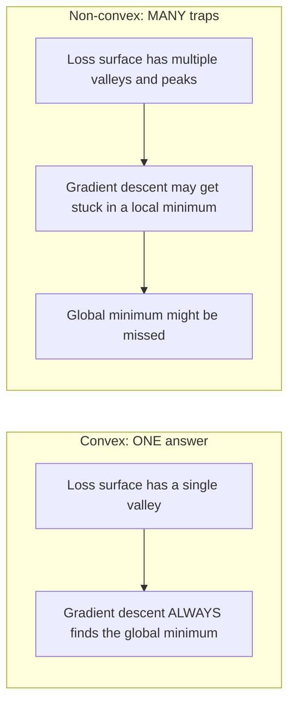
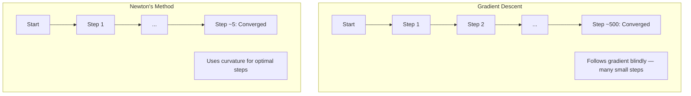
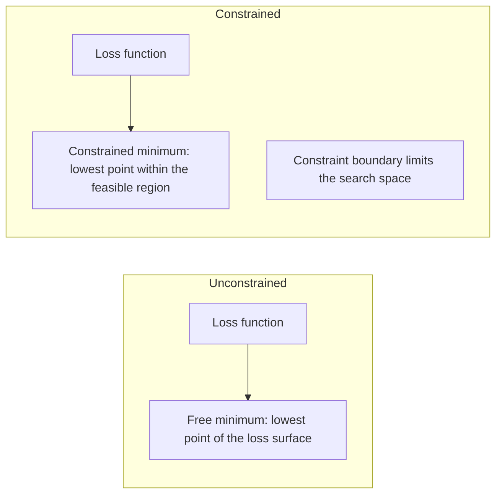
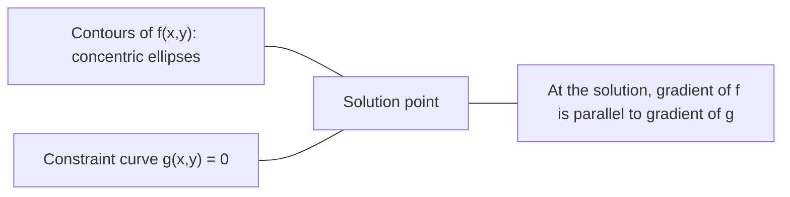

# 凸优化

> 凸问题只有一个谷底。Neural Network 有数百万个。理解这种差异很重要。

**类型：** 构建
**语言：** Python
**前置要求：** Phase 1, Lessons 04（Calculus for ML）、08（Optimization）
**时间：** 约 90 分钟

## 学习目标

- 使用定义、二阶导数和 Hessian 判据测试一个函数是否为凸函数
- 实现 Newton's method，并将其二次收敛速度与 Gradient Descent 进行比较
- 使用 Lagrange multipliers 求解带约束的优化问题，并解释 KKT conditions
- 解释为什么 Neural Network Loss landscape 是非凸的，但 SGD 仍能找到好的解

## 问题

Lesson 08 教过你 Gradient Descent、momentum 和 Adam。这些 Optimizer 可以在任何表面上向下移动。但它们没有保证。Gradient Descent 在非凸 landscape 上可能落入糟糕的局部最小值，卡在 saddle point，或者永远振荡。你仍然使用它，是因为 Neural Network 是非凸的，而且没有替代方案。

但 ML 中的许多问题是凸的。Linear regression、logistic regression、SVMs、LASSO、ridge regression。对于这些问题，有更强的工具：带有数学保证的优化。凸问题只有一个谷底。任何向下走的算法都会到达全局最小值。不需要重新启动。不需要学习率调度。不需要祈祷。

理解凸性有三点价值。第一，它告诉你问题什么时候是简单的（凸），什么时候是困难的（非凸）。第二，它为凸问题提供更快的工具，比如 Newton's method。第三，它解释了 ML 中反复出现的概念：regularization 作为约束、SVMs 中的 duality，以及为什么 Deep Learning 在违反凸性所提供的一切良好性质时仍能工作。

## 概念

### 凸集

如果对于集合 S 中任意两个点，它们之间的线段也完全位于 S 中，则集合 S 是凸集。

| 凸集 | 非凸 |
|---|---|
| **矩形**：内部任意两点都可以用一条仍在内部的线段连接 | **星形/月牙形**：两个内部点之间的线段可能穿过集合外部 |
| **三角形**：对所有内部点都满足相同性质 | **甜甜圈/环形**：中间的孔意味着某些线段会离开集合 |
| 任意两点之间的线段都留在集合内 | 某些点对之间的线段会离开集合 |

形式化测试：对于 S 中任意点 x、y，以及任意 t in [0, 1]，点 tx + (1-t)y 也在 S 中。

凸集示例：
- 一条直线、一个平面、整个 R^n
- 一个球（圆、球体、超球）
- 一个半空间：{x : a^T x <= b}
- 任意数量凸集的交集

非凸集示例：
- 一个甜甜圈（环形）
- 两个不相交圆的并集
- 任何带有“凹陷”或“孔洞”的集合

### 凸函数

如果函数 f 的定义域是凸集，并且对于其定义域中的任意两点 x、y，以及任意 t in [0, 1]：

```
f(tx + (1-t)y) <= t*f(x) + (1-t)*f(y)
```

几何上看：图像上任意两点之间的线段位于图像之上或图像上。

| 属性 | 凸函数 | 非凸函数 |
|---|---|---|
| **线段测试** | 图像上任意两点之间的线段位于曲线**之上或之上** | 图像上某些点之间的线段会下探到曲线**之下** |
| **形状** | 单个向上弯曲的碗/谷底 | 多个峰和谷，曲率混合 |
| **局部最小值** | 每个局部最小值都是全局最小值 | 可能存在多个高度不同的局部最小值 |

常见凸函数：
- f(x) = x^2（抛物线）
- f(x) = |x|（绝对值）
- f(x) = e^x（指数）
- f(x) = max(0, x)（ReLU，尽管是分段线性的）
- f(x) = -log(x) for x > 0（负对数）
- 任意线性函数 f(x) = a^T x + b（既凸又凹）

### 测试凸性

三个实用测试，从最容易到最严谨。

**测试 1：二阶导数测试（1D）。** 如果对所有 x 都有 f''(x) >= 0，则 f 是凸函数。

- f(x) = x^2：f''(x) = 2 >= 0。凸。
- f(x) = x^3：f''(x) = 6x。x < 0 时为负。非凸。
- f(x) = e^x：f''(x) = e^x > 0。凸。

**测试 2：Hessian 测试（多变量）。** 如果 Hessian Matrix H(x) 对所有 x 都是 positive semidefinite，则 f 是凸函数。Hessian 是二阶偏导数组成的 Matrix。

**测试 3：定义测试。** 直接检查不等式 f(tx + (1-t)y) <= t*f(x) + (1-t)*f(y)。适用于导数难以计算的函数。

### 为什么凸性重要

凸优化的核心定理：

**对于凸函数，每个局部最小值都是全局最小值。**

这意味着 Gradient Descent 不会被困住。任何向下的路径都会通向同一个答案。该算法被保证会收敛到最优解。



结果：
- 不需要随机重启
- 不需要复杂的学习率调度
- 可以证明收敛性（速率取决于函数性质）
- 解是唯一的（除平坦区域外）

### ML 中的凸与非凸

| 问题 | 凸？ | 原因 |
|---------|---------|-----|
| Linear regression (MSE) | 是 | Loss 关于权重是二次的 |
| Logistic regression | 是 | Log-loss 关于权重是凸的 |
| SVM (hinge loss) | 是 | 线性函数的最大值 |
| LASSO (L1 regression) | 是 | 凸函数之和是凸的 |
| Ridge regression (L2) | 是 | 二次 + 二次 = 凸 |
| Neural Network（任意 Loss） | 否 | 非线性 activations 会产生非凸 landscape |
| k-means clustering | 否 | 离散分配步骤 |
| Matrix factorization | 否 | 未知量的乘积 |

带有凸 Loss 的线性模型是凸的。一旦加入带有非线性 activations 的隐藏层，凸性就会被破坏。

### Hessian Matrix

函数 f: R^n -> R 的 Hessian H 是由二阶偏导数组成的 n x n Matrix。

```
H[i][j] = d^2 f / (dx_i dx_j)
```

对于 f(x, y) = x^2 + 3xy + y^2：

```
df/dx = 2x + 3y       d^2f/dx^2 = 2      d^2f/dxdy = 3
df/dy = 3x + 2y       d^2f/dydx = 3      d^2f/dy^2 = 2

H = [ 2  3 ]
    [ 3  2 ]
```

Hessian 告诉你曲率信息：
- Eigenvalues 全为正：函数在每个方向上都向上弯曲（在该点凸）
- Eigenvalues 全为负：在每个方向上都向下弯曲（凹，局部最大值）
- 符号混合：saddle point（某些方向向上弯曲，另一些方向向下弯曲）
- 零 eigenvalue：该方向上是平坦的（退化）

对于凸性，Hessian 必须在所有位置都是 positive semidefinite（所有 eigenvalues >= 0），而不仅仅是在某一个点。

### Newton's method

Gradient Descent 使用一阶信息（Gradient）。Newton's method 使用二阶信息（Hessian）。它在当前点拟合一个二次近似，然后直接跳到该二次函数的最小值。

```
Update rule:
  x_new = x - H^(-1) * gradient

Compare to gradient descent:
  x_new = x - lr * gradient
```

Newton's method 用逆 Hessian 替代标量学习率。这会根据局部曲率自动调整步长和方向。



优点：
- 接近最小值时二次收敛（每一步误差平方级下降）
- 不需要调学习率
- 尺度不变（无论你如何参数化问题都能工作）

缺点：
- 计算 Hessian 需要 O(n^2) 内存，求逆需要 O(n^3)
- 对于有 100 万权重的 Neural Network，这意味着 10^12 个条目和 10^18 次操作
- 对 Deep Learning 不实用

### 约束优化

无约束优化：在所有 x 上最小化 f(x)。
约束优化：在约束条件下最小化 f(x)。

现实问题有约束。你想最小化成本，但预算有限。你想最小化误差，但模型复杂度受限。



### Lagrange multipliers

Lagrange multipliers 方法把约束问题转换为无约束问题。

问题：在 g(x) = 0 的约束下最小化 f(x)。

解法：引入一个新变量（Lagrange multiplier lambda），并求解无约束问题：

```
L(x, lambda) = f(x) + lambda * g(x)
```

在解处，L 的 Gradient 为零：

```
dL/dx = df/dx + lambda * dg/dx = 0
dL/dlambda = g(x) = 0
```

几何直觉：在约束最小值处，f 的 Gradient 必须与约束 g 的 Gradient 平行。如果它们不平行，你就可以沿约束曲面移动，并进一步降低 f。



示例：在 x + y = 1 的约束下最小化 f(x,y) = x^2 + y^2。

```
L = x^2 + y^2 + lambda(x + y - 1)

dL/dx = 2x + lambda = 0  =>  x = -lambda/2
dL/dy = 2y + lambda = 0  =>  y = -lambda/2
dL/dlambda = x + y - 1 = 0

From first two: x = y
Substituting: 2x = 1, so x = y = 0.5, lambda = -1
```

直线 x + y = 1 上距离原点最近的点是 (0.5, 0.5)。

### KKT conditions

Karush-Kuhn-Tucker conditions 将 Lagrange multipliers 扩展到不等式约束。

问题：在 g_i(x) <= 0，i = 1, ..., m 的约束下最小化 f(x)。

KKT conditions（最优性的必要条件）：

```
1. Stationarity:    df/dx + sum(lambda_i * dg_i/dx) = 0
2. Primal feasibility:  g_i(x) <= 0  for all i
3. Dual feasibility:    lambda_i >= 0  for all i
4. Complementary slackness:  lambda_i * g_i(x) = 0  for all i
```

Complementary slackness 是关键洞见：约束要么是 active 的（g_i = 0，解位于边界上），要么 multiplier 为零（该约束不起作用）。不影响解的约束有 lambda = 0。

KKT conditions 是 SVMs 的核心。support vectors 是约束 active 的数据点（lambda > 0）。所有其他数据点的 lambda = 0，不影响 decision boundary。

### Regularization 作为约束优化

L1 和 L2 regularization 不是随意的技巧。它们是伪装成无约束形式的约束优化问题。

**L2 regularization (Ridge)：**

```
minimize  Loss(w)  subject to  ||w||^2 <= t

Equivalent unconstrained form:
minimize  Loss(w) + lambda * ||w||^2
```

约束 ||w||^2 <= t 定义了一个球（2D 中是圆，3D 中是球面）。解位于 Loss 等高线首次接触这个球的位置。

**L1 regularization (LASSO)：**

```
minimize  Loss(w)  subject to  ||w||_1 <= t

Equivalent unconstrained form:
minimize  Loss(w) + lambda * ||w||_1
```

约束 ||w||_1 <= t 定义了一个菱形（2D 中旋转的正方形）。

| 属性 | L2 约束（圆） | L1 约束（菱形） |
|---|---|---|
| **约束形状** | 圆（更高维中是球面） | 菱形（2D 中旋转的正方形） |
| **Loss 等高线接触的位置** | 光滑边界：圆上的任意点 | 角点：与某个轴对齐 |
| **解的行为** | 权重较小但非零 | 某些权重恰好为零（稀疏） |
| **结果** | 权重收缩 | 特征选择 |

这解释了为什么 L1 会产生稀疏模型（特征选择），而 L2 只是缩小权重。菱形有与坐标轴对齐的角点。Loss 等高线更可能接触角点，从而将一个或多个权重恰好设为零。

### Duality

每个约束优化问题（primal）都有一个伴随问题（dual）。对于凸问题，primal 和 dual 具有相同的最优值。这就是 strong duality。

Lagrangian dual function：

```
Primal: minimize f(x) subject to g(x) <= 0
Lagrangian: L(x, lambda) = f(x) + lambda * g(x)
Dual function: d(lambda) = min_x L(x, lambda)
Dual problem: maximize d(lambda) subject to lambda >= 0
```

为什么 duality 重要：
- dual problem 有时比 primal 更容易求解
- SVMs 以 dual form 求解，其中问题依赖数据点之间的 dot products（从而启用 kernel trick）
- dual 提供 primal optimum 的下界，可用于检查解的质量

具体到 SVMs：

```
Primal: find w, b that maximize the margin 2/||w|| subject to
        y_i(w^T x_i + b) >= 1 for all i

Dual:   maximize sum(alpha_i) - 0.5 * sum_ij(alpha_i * alpha_j * y_i * y_j * x_i^T x_j)
        subject to alpha_i >= 0 and sum(alpha_i * y_i) = 0

The dual only involves dot products x_i^T x_j.
Replace x_i^T x_j with K(x_i, x_j) to get the kernel trick.
```

### 为什么 Deep Learning 尽管非凸仍能工作

Neural Network Loss Function 极其非凸。按照每一种经典标准，优化它们都应该失败。然而 stochastic Gradient Descent 能可靠地找到好的解。几个因素解释了这一点。

**大多数局部最小值已经足够好。** 在高维空间中，随机 critical points（Gradient 为零的位置）压倒性地是 saddle points，而不是局部最小值。少数存在的局部最小值通常具有接近全局最小值的 Loss 值。当参数空间有数百万维时，陷入糟糕局部最小值的概率极低。

**真正的障碍是 saddle points，而不是局部最小值。** 在一个有 n 个参数的函数中，saddle point 同时具有正曲率和负曲率方向。对于高维中的随机 critical point，所有 n 个 eigenvalues 都为正（局部最小值）的概率大约是 2^(-n)。几乎所有 critical points 都是 saddle points。SGD 的噪声帮助逃离它们。

**Overparameterization 会平滑 landscape。** 参数数量多于训练样本的网络具有更平滑、更连通的 Loss surfaces。更宽的网络有更少的糟糕局部最小值。这违反直觉，但与经验结果一致。

**Loss landscape 结构：**

| 属性 | 低维空间 | 高维空间 |
|---|---|---|
| **Landscape** | 许多孤立的峰和谷 | 平滑连通的谷 |
| **最小值** | 许多孤立局部最小值 | 很少有糟糕局部最小值；大多数接近最优 |
| **导航** | 难以找到全局最小值 | 许多路径通向好的解 |
| **Critical points** | 局部最小值和 saddle points 混合 | 压倒性地是 saddle points，而非局部最小值 |

**随机噪声充当隐式 regularization。** Mini-batch SGD 引入噪声，防止落入 sharp minima。Sharp minima 容易过拟合；flat minima 泛化更好。噪声会把优化偏向 Loss landscape 的平坦区域。

### 实践中的二阶方法

纯 Newton's method 对大模型不实用。几种近似方法让二阶信息变得可用。

**L-BFGS (Limited-memory BFGS)：** 使用最近 m 个 Gradient 差分近似逆 Hessian。需要 O(mn) 内存，而不是 O(n^2)。适用于最多约 10,000 个参数的问题。用于经典 ML（logistic regression、CRFs），但不用于 Deep Learning。

**Natural gradient：** 使用 Fisher information matrix（log-likelihood 的期望 Hessian）而不是标准 Hessian。这会考虑概率分布的几何结构。K-FAC (Kronecker-Factored Approximate Curvature) 将 Fisher Matrix 近似为 Kronecker product，使其对 Neural Network 可行。

**Hessian-free optimization：** 使用 conjugate gradient 求解 Hx = g，而不显式形成 H。只需要 Hessian-vector products，这可以通过 automatic differentiation 在 O(n) 时间内计算。

**Diagonal approximations：** Adam 的 second moment 是 Hessian 对角线的对角近似。AdaHessian 通过 Hutchinson's estimator 使用实际 Hessian diagonal elements 扩展了这一点。

| 方法 | 内存 | 每步成本 | 何时使用 |
|--------|--------|--------------|-------------|
| Gradient Descent | O(n) | O(n) | Baseline，大模型 |
| Newton's method | O(n^2) | O(n^3) | 小型凸问题 |
| L-BFGS | O(mn) | O(mn) | 中型凸问题 |
| Adam | O(n) | O(n) | Deep Learning 默认选择 |
| K-FAC | O(n) | 每层 O(n) | 研究、大 batch training |


```figure
convex-vs-nonconvex
```

## 构建它

### 步骤 1：凸性检查器

构建一个函数，通过采样点并检查定义来经验性测试凸性。

```python
import random
import math

def check_convexity(f, dim, bounds=(-5, 5), samples=1000):
    violations = 0
    for _ in range(samples):
        x = [random.uniform(*bounds) for _ in range(dim)]
        y = [random.uniform(*bounds) for _ in range(dim)]
        t = random.uniform(0, 1)
        mid = [t * xi + (1 - t) * yi for xi, yi in zip(x, y)]
        lhs = f(mid)
        rhs = t * f(x) + (1 - t) * f(y)
        if lhs > rhs + 1e-10:
            violations += 1
    return violations == 0, violations
```

### 步骤 2：用于 2D 的 Newton's method

使用显式 Hessian 实现 Newton's method。将收敛速度与 Gradient Descent 比较。

```python
def newtons_method(f, grad_f, hessian_f, x0, steps=50, tol=1e-12):
    x = list(x0)
    history = [x[:]]
    for _ in range(steps):
        g = grad_f(x)
        H = hessian_f(x)
        det = H[0][0] * H[1][1] - H[0][1] * H[1][0]
        if abs(det) < 1e-15:
            break
        H_inv = [
            [H[1][1] / det, -H[0][1] / det],
            [-H[1][0] / det, H[0][0] / det],
        ]
        dx = [
            H_inv[0][0] * g[0] + H_inv[0][1] * g[1],
            H_inv[1][0] * g[0] + H_inv[1][1] * g[1],
        ]
        x = [x[0] - dx[0], x[1] - dx[1]]
        history.append(x[:])
        if sum(gi ** 2 for gi in g) < tol:
            break
    return history
```

### 步骤 3：Lagrange multiplier 求解器

通过在 Lagrangian 上执行 Gradient Descent 来求解约束优化。

```python
def lagrange_solve(f_grad, g_val, g_grad, x0, lr=0.01,
                   lr_lambda=0.01, steps=5000):
    x = list(x0)
    lam = 0.0
    history = []
    for _ in range(steps):
        fg = f_grad(x)
        gv = g_val(x)
        gg = g_grad(x)
        x = [
            xi - lr * (fgi + lam * ggi)
            for xi, fgi, ggi in zip(x, fg, gg)
        ]
        lam = lam + lr_lambda * gv
        history.append((x[:], lam, gv))
    return history
```

### 步骤 4：比较一阶与二阶

在同一个二次函数上运行 Gradient Descent 和 Newton's method。统计收敛所需步数。

```python
def quadratic(x):
    return 5 * x[0] ** 2 + x[1] ** 2

def quadratic_grad(x):
    return [10 * x[0], 2 * x[1]]

def quadratic_hessian(x):
    return [[10, 0], [0, 2]]
```

Newton's method 会在 1 步内收敛（它对二次函数是精确的）。Gradient Descent 会需要数百步，因为 Hessian 的 eigenvalues 相差 5 倍，形成了一个拉长的谷。

## 使用它

在选择 ML 模型和 solver 时，凸性分析可以直接应用。

对于凸问题（logistic regression、SVMs、LASSO）：
- 使用专用 solver（liblinear、CVXPY、scipy.optimize.minimize with method='L-BFGS-B'）
- 预期得到唯一的全局解
- 二阶方法实用且快速

对于非凸问题（Neural Network）：
- 使用一阶方法（SGD、Adam）
- 接受解依赖初始化和随机性
- 使用 overparameterization、噪声和学习率调度作为隐式 regularization
- 不要浪费时间寻找全局最小值。一个好的局部最小值已经足够。

```python
from scipy.optimize import minimize

result = minimize(
    fun=lambda w: sum((y - X @ w) ** 2) + 0.1 * sum(w ** 2),
    x0=np.zeros(d),
    method='L-BFGS-B',
    jac=lambda w: -2 * X.T @ (y - X @ w) + 0.2 * w,
)
```

对于 SVMs，dual formulation 让你可以使用 kernel trick：

```python
from sklearn.svm import SVC

svm = SVC(kernel='rbf', C=1.0)
svm.fit(X_train, y_train)
print(f"Support vectors: {svm.n_support_}")
```

## 练习

1. **凸性画廊。** 使用检查器测试这些函数的凸性：f(x) = x^4、f(x) = sin(x)、f(x,y) = x^2 + y^2、f(x,y) = x*y、f(x) = max(x, 0)。解释为什么每个结果是合理的。

2. **Newton vs Gradient Descent 竞赛。** 从起点 (10, 10) 出发，在 f(x,y) = 50*x^2 + y^2 上运行两种方法。每种方法需要多少步才能达到 loss < 1e-10？当 condition number（最大 Hessian eigenvalue 与最小 Hessian eigenvalue 的比值）增加时，Gradient Descent 会发生什么？

3. **Lagrange multiplier 几何。** 在约束 x + 2y = 4 下最小化 f(x,y) = (x-3)^2 + (y-3)^2。通过检查解处 f 的 Gradient 与 g 的 Gradient 平行来验证解。

4. **Regularization 约束。** 实现 L1-constrained optimization：在 |x| + |y| <= 1 的约束下最小化 (x-3)^2 + (y-2)^2。展示解有一个坐标等于零（由菱形约束产生的稀疏性）。

5. **Hessian eigenvalue 分析。** 计算 Rosenbrock function 在 (1,1) 和 (-1,1) 处的 Hessian。计算两个点处的 eigenvalues。Eigenvalues 告诉你最小值附近与远离最小值处的曲率有什么不同？

## 关键术语

| 术语 | 含义 |
|------|---------------|
| 凸集 | 集合中任意两点之间的线段仍留在集合内部的集合 |
| 凸函数 | 图像上任意两点之间的线段位于图像之上或图像上的函数。等价地，Hessian 在所有位置都是 positive semidefinite |
| 局部最小值 | 比所有邻近点都低的点。对于凸函数，每个局部最小值都是全局最小值 |
| 全局最小值 | 函数在其整个定义域上的最低点 |
| Hessian Matrix | 所有二阶偏导数组成的 Matrix。编码曲率信息 |
| Positive semidefinite | Eigenvalues 全部非负的 Matrix。是“二阶导数 >= 0”的多维类比 |
| Condition number | Hessian 的最大 eigenvalue 与最小 eigenvalue 的比值。高 condition number 意味着拉长的谷和缓慢的 Gradient Descent |
| Newton's method | 使用逆 Hessian 确定步进方向和大小的二阶 Optimizer。接近最小值时二次收敛 |
| Lagrange multiplier | 为了将约束优化问题转换为无约束问题而引入的变量 |
| KKT conditions | 不等式约束下最优性的必要条件。推广了 Lagrange multipliers |
| Complementary slackness | 在解处，约束要么是 active 的，要么其 multiplier 为零。二者不会同时非零 |
| Duality | 每个约束问题都有一个伴随的 dual problem。对于凸问题，二者具有相同的最优值 |
| Strong duality | Primal 和 dual 的最优值相等。对满足 Slater's condition 的凸问题成立 |
| L-BFGS | 近似二阶方法，存储最近 m 个 Gradient 差分，而不是完整 Hessian |
| Saddle point | Gradient 为零，但在某些方向上是最小值、在另一些方向上是最大值的点 |
| Overparameterization | 使用比训练样本更多的参数。会平滑 Loss landscape 并减少糟糕局部最小值 |

## 延伸阅读

- [Boyd & Vandenberghe: Convex Optimization](https://web.stanford.edu/~boyd/cvxbook/) - 标准教材，在线免费提供
- [Bottou, Curtis, Nocedal: Optimization Methods for Large-Scale Machine Learning (2018)](https://arxiv.org/abs/1606.04838) - 连接凸优化理论与 Deep Learning 实践
- [Choromanska et al.: The Loss Surfaces of Multilayer Networks (2015)](https://arxiv.org/abs/1412.0233) - 为什么非凸 Neural Network landscapes 并不像看起来那么糟
- [Nocedal & Wright: Numerical Optimization](https://link.springer.com/book/10.1007/978-0-387-40065-5) - Newton's method、L-BFGS 和约束优化的综合参考
