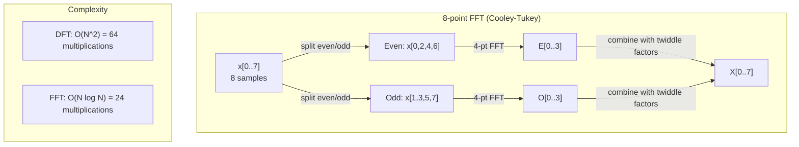
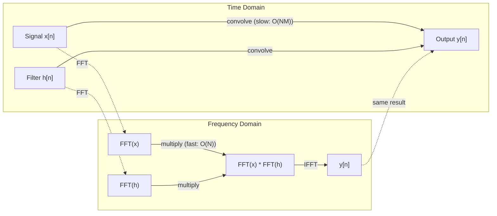

# Fourier Transform

> 每个 signal 都是 sine waves 的叠加。Fourier transform 会告诉你是哪一些。

**Type:** Build
**Language:** Python
**Prerequisites:** Phase 1, Lessons 01-04, 19 (complex numbers)
**Time:** ~90 分钟

## 学习目标
- 从零实现 DFT，并用 O(N log N) 的 Cooley-Tukey FFT 验证它
- 理解 frequency coefficients：从 signal 中提取 amplitude、phase 和 power spectrum
- 应用 convolution theorem，通过 FFT multiplication 执行 convolution
- 将 Fourier frequency decomposition 与 transformer positional encodings 和 CNN convolution layers 联系起来

## 问题
一段音频录音是随时间变化的一系列压力测量值。股价是按天排列的一系列数值。图像是空间中 pixel intensities 的网格。这些都是 time domain（或 space domain）中的数据。你看到的是某个 index 上不断变化的值。

但许多 pattern 在 time domain 中是不可见的。这个 audio signal 是 pure tone 还是 chord？这个股价是否存在 weekly cycle？这张图像是否有 repeating texture？这些问题关注的是 frequency content，而 time domain 会隐藏它。

Fourier transform 会把数据从 time domain 转换到 frequency domain。它接收一个 signal，并将其分解为不同 frequencies 的 sine waves。每个 sine wave 都有一个 amplitude（强度）和一个 phase（起始位置）。Fourier transform 会同时告诉你这两者。

这对 ML 很重要，因为 frequency-domain thinking 随处可见。Convolutional neural networks 执行 convolution，而 convolution 在 frequency domain 中就是 multiplication。Transformer positional encodings 使用 frequency decomposition 来表示位置。Audio models（speech recognition、music generation）处理 spectrograms，也就是声音的 frequency representations。Time series models 会寻找 periodic patterns。理解 Fourier transform，会让你具备处理这些问题所需的 vocabulary。

## 概念
### The DFT definition

给定 N 个 samples x[0], x[1], ..., x[N-1]，Discrete Fourier Transform 会生成 N 个 frequency coefficients X[0], X[1], ..., X[N-1]：

```
X[k] = sum_{n=0}^{N-1} x[n] * e^(-2*pi*i*k*n/N)

for k = 0, 1, ..., N-1
```

每个 X[k] 都是 complex number。它的 magnitude |X[k]| 表示 frequency k 的 amplitude。它的 phase angle(X[k]) 表示该 frequency 的 phase offset。

关键洞见：`e^(-2*pi*i*k*n/N)` 是一个以 frequency k 旋转的 phasor。DFT 计算的是 signal 与 N 个等间隔 frequencies 中每一个的 correlation。如果 signal 在 frequency k 上包含 energy，correlation 就很大。否则，它接近零。

### 每个系数的含义

**X[0]: DC component。** 这是所有 samples 的总和，与 mean 成比例。它表示 signal 的 constant（zero-frequency）offset。

```
X[0] = sum_{n=0}^{N-1} x[n] * e^0 = sum of all samples
```

**X[k] for 1 <= k <= N/2: positive frequencies。** X[k] 表示每 N 个 samples 中 k 个 cycles 的 frequency。k 越大，frequency 越高（oscillation 越快）。

**X[N/2]: Nyquist frequency。** 这是 N 个 samples 能表示的最高 frequency。超过这个 frequency，就会出现 aliasing，也就是 high frequencies 伪装成 low ones。

**X[k] for N/2 < k < N: negative frequencies。** 对于 real-valued signals，X[N-k] = conj(X[k])。negative frequencies 是 positive ones 的镜像。这就是为什么有用信息位于前 N/2 + 1 个 coefficients 中。

### Inverse DFT

Inverse DFT 会从 frequency coefficients 重建原始 signal：

```
x[n] = (1/N) * sum_{k=0}^{N-1} X[k] * e^(2*pi*i*k*n/N)

for n = 0, 1, ..., N-1
```

它与 forward DFT 的唯一区别是：exponent 中的符号为正（不是负），并且有一个 1/N normalization factor。

Inverse DFT 是 perfect reconstruction。不会丢失任何信息。你可以从 time domain 到 frequency domain，再返回来，而不产生任何误差。DFT 是一种 change of basis，也就是用不同的 coordinate system 重新表达同一份信息。

### The FFT: making it fast

如上定义的 DFT 是 O(N^2)：对 N 个 output coefficients 中的每一个，都要对 N 个 input samples 求和。当 N = 1 million 时，这就是 10^12 次 operations。

Fast Fourier Transform (FFT) 会以 O(N log N) 计算同样的结果。当 N = 1 million 时，这大约是 2000 万次 operations，而不是一万亿次。这让 frequency analysis 变得可行。

Cooley-Tukey algorithm（最常见的 FFT）使用 divide and conquer：

1. 将 signal 拆分为 even-indexed 和 odd-indexed samples。
2. 递归计算每一半的 DFT。
3. 使用 "twiddle factors" e^(-2*pi*i*k/N) 合并两个 half-size DFTs。

```
X[k] = E[k] + e^(-2*pi*i*k/N) * O[k]          for k = 0, ..., N/2 - 1
X[k + N/2] = E[k] - e^(-2*pi*i*k/N) * O[k]    for k = 0, ..., N/2 - 1

where E = DFT of even-indexed samples
      O = DFT of odd-indexed samples
```

这种 symmetry 意味着递归的每一层执行 O(N) work，并且有 log2(N) 层。总计：O(N log N)。



FFT 要求 signal length 是 2 的幂。在实践中，signals 通常会 zero-pad 到下一个 2 的幂。

### Spectral analysis

**power spectrum** 是 |X[k]|^2，也就是每个 frequency coefficient 的 squared magnitude。它显示每个 frequency 上有多少 energy。

**phase spectrum** 是 angle(X[k])，也就是每个 frequency 的 phase offset。对于大多数 analysis tasks，你关心的是 power spectrum，并会忽略 phase。

```
Power at frequency k:  P[k] = |X[k]|^2 = X[k].real^2 + X[k].imag^2
Phase at frequency k:  phi[k] = atan2(X[k].imag, X[k].real)
```

### Frequency resolution

DFT 的 frequency resolution 取决于 samples 数量 N 和 sampling rate fs。

```
Frequency of bin k:      f_k = k * fs / N
Frequency resolution:    delta_f = fs / N
Maximum frequency:       f_max = fs / 2  (Nyquist)
```

要分辨两个非常接近的 frequencies，你需要更多 samples。要捕获 high frequencies，你需要更高的 sampling rate。

### The convolution theorem

这是 signal processing 中最重要的结果之一，并且与 CNNs 直接相关。

**time domain 中的 convolution 等于 frequency domain 中的 pointwise multiplication。**

```
x * h = IFFT(FFT(x) . FFT(h))

where * is convolution and . is element-wise multiplication
```

为什么这很重要：

- 两个长度为 N 和 M 的 signals 直接 convolution 需要 O(N*M) operations。
- 基于 FFT 的 convolution 需要 O(N log N)：transform 两者、multiply、transform back。
- 对于 large kernels，FFT convolution 会快得多。
- 这正是具有 large receptive fields 的 convolutional layers 中发生的事情。

注意：DFT 计算的是 circular convolution（signal 会 wrap around）。对于 linear convolution（无 wraparound），请在计算前将两个 signals zero-pad 到长度 N + M - 1。



### Windowing

DFT 假设 signal 是 periodic 的，也就是把 N 个 samples 视为一个无限重复 signal 的一个周期。如果 signal 的起点和终点不是同一个值，就会在边界产生 discontinuity，并表现为虚假的 high-frequency content。这称为 spectral leakage。

Windowing 会在计算 DFT 前将 signal 两端 taper 到零，从而减少 leakage。

常见 windows：

| Window | Shape | Main lobe width | Side lobe level | Use case |
|--------|-------|----------------|-----------------|----------|
| Rectangular | 平坦（无 window） | 最窄 | 最高 (-13 dB) | 当 signal 在 N 个 samples 中正好 periodic 时 |
| Hann | Raised cosine | 中等 | 低 (-31 dB) | 通用 spectral analysis |
| Hamming | Modified cosine | 中等 | 更低 (-42 dB) | Audio processing、speech analysis |
| Blackman | Triple cosine | 宽 | 非常低 (-58 dB) | 当 side lobe suppression 至关重要时 |

```
Hann window:    w[n] = 0.5 * (1 - cos(2*pi*n / (N-1)))
Hamming window: w[n] = 0.54 - 0.46 * cos(2*pi*n / (N-1))
```

在 DFT 之前，将 window 与 signal 做 element-wise multiplication 来应用 window：`X = DFT(x * w)`。

### DFT properties

| Property | Time Domain | Frequency Domain |
|----------|-------------|-----------------|
| Linearity | a*x + b*y | a*X + b*Y |
| Time shift | x[n - k] | X[f] * e^(-2*pi*i*f*k/N) |
| Frequency shift | x[n] * e^(2*pi*i*f0*n/N) | X[f - f0] |
| Convolution | x * h | X * H (pointwise) |
| Multiplication | x * h (pointwise) | X * H (circular convolution, scaled by 1/N) |
| Parseval's theorem | sum \|x[n]\|^2 | (1/N) * sum \|X[k]\|^2 |
| Conjugate symmetry (real input) | x[n] real | X[k] = conj(X[N-k]) |

Parseval's theorem 表示总 energy 在两个 domains 中相同。Energy 在 transform 过程中守恒。

### 与 positional encodings 的联系

原始 Transformer 使用 sinusoidal positional encodings：

```
PE(pos, 2i)   = sin(pos / 10000^(2i/d_model))
PE(pos, 2i+1) = cos(pos / 10000^(2i/d_model))
```

每一对 dimensions (2i, 2i+1) 都以不同 frequency oscillate。frequencies 从高（dimension 0,1）到低（最后的 dimensions）按 geometric spacing 排列。这让每个 position 在所有 frequency bands 上都有唯一 pattern，类似于 Fourier coefficients 如何唯一识别一个 signal。

它提供的关键 properties：

- **Uniqueness:** 任意两个 positions 都不会有相同 encoding。
- **Bounded values:** sin 和 cos 始终在 [-1, 1] 内。
- **Relative position:** position p+k 的 encoding 可以表示为 position p 处 encoding 的 linear function。model 可以学习关注 relative positions。

### Connection to CNNs

Convolution layer 通过在 signal 或 image 上滑动一个 learned filter（kernel），将其应用到 input。数学上，这就是 convolution operation。

根据 convolution theorem，这等价于：
1. 对 input 执行 FFT
2. 对 kernel 执行 FFT
3. 在 frequency domain 中 multiply
4. 对结果执行 IFFT

标准 CNN 实现使用 direct convolution（对小型 3x3 kernels 更快）。但对于 large kernels 或 global convolution，基于 FFT 的方法会显著更快。一些 architectures（例如 FNet）完全用 FFT 替代 attention，在 O(N log N) 而非 O(N^2) complexity 下取得有竞争力的 accuracy。

### Spectrograms 和 Short-Time Fourier Transform

单次 FFT 会给出整个 signal 的 frequency content，但无法告诉你这些 frequencies 何时出现。chirp（frequency 随时间增加的 signal）和 chord（所有 frequencies 同时存在）可能具有相同的 magnitude spectrum。

Short-Time Fourier Transform (STFT) 通过在 signal 的 overlapping windows 上计算 FFT 来解决这个问题。结果是 spectrogram：一种 2D representation，其中一个 axis 是 time，另一个 axis 是 frequency。每个点的 intensity 表示该 time 上该 frequency 的 energy。

```
STFT procedure:
1. Choose a window size (e.g., 1024 samples)
2. Choose a hop size (e.g., 256 samples -- 75% overlap)
3. For each window position:
   a. Extract the windowed segment
   b. Apply a Hann/Hamming window
   c. Compute FFT
   d. Store the magnitude spectrum as one column of the spectrogram
```

Spectrograms 是 audio ML models 的标准 input representation。Speech recognition models（Whisper、DeepSpeech）处理 mel-spectrograms，也就是将 frequencies 映射到 mel scale 的 spectrograms，这更符合人类 pitch perception。

### Aliasing

如果 signal 包含高于 fs/2（Nyquist frequency）的 frequencies，以 rate fs sampling 会产生 aliased copies。一个以 100 Hz sampling 的 90 Hz signal 看起来与 10 Hz signal 完全相同。仅凭 samples 无法区分它们。

```
Example:
  True signal: 90 Hz sine wave
  Sampling rate: 100 Hz
  Apparent frequency: 100 - 90 = 10 Hz

  The samples from the 90 Hz signal at 100 Hz sampling rate
  are identical to the samples from a 10 Hz signal.
  No amount of math can recover the original 90 Hz.
```

这就是为什么 analog-to-digital converters 会包含 anti-aliasing filters，在 sampling 前移除高于 Nyquist 的 frequencies。在 ML 中，当没有适当 low-pass filtering 就对 feature maps downsampling 时，会出现 aliasing；一些 architectures 使用 anti-aliased pooling layers 来处理这个问题。

### Zero-padding 不会提高分辨率

一个常见误解是：在 FFT 前对 signal 进行 zero-padding 会提升 frequency resolution。它不会。Zero-padding 只是在现有 frequency bins 之间插值，让 spectrum 看起来更平滑。但它无法揭示原始 samples 中不存在的 frequency detail。

真正的 frequency resolution 只取决于 observation time T = N / fs。要分辨相差 delta_f 的两个 frequencies，你至少需要 T = 1 / delta_f 秒的数据。无论做多少 zero-padding，都无法改变这个 fundamental limit。


```figure
fourier-synthesis
```

## 构建它
### 步骤 1： DFT from scratch

O(N^2) DFT 直接来自定义。

```python
import math

class Complex:
    ...

def dft(x):
    N = len(x)
    result = []
    for k in range(N):
        total = Complex(0, 0)
        for n in range(N):
            angle = -2 * math.pi * k * n / N
            w = Complex(math.cos(angle), math.sin(angle))
            xn = x[n] if isinstance(x[n], Complex) else Complex(x[n])
            total = total + xn * w
        result.append(total)
    return result
```

### 步骤 2： Inverse DFT

结构相同，exponent 为正，并除以 N。

```python
def idft(X):
    N = len(X)
    result = []
    for n in range(N):
        total = Complex(0, 0)
        for k in range(N):
            angle = 2 * math.pi * k * n / N
            w = Complex(math.cos(angle), math.sin(angle))
            total = total + X[k] * w
        result.append(Complex(total.real / N, total.imag / N))
    return result
```

### 步骤 3： FFT (Cooley-Tukey)

Recursive FFT 要求长度为 2 的幂。拆分为 even 和 odd，递归，然后用 twiddle factors 合并。

```python
def fft(x):
    N = len(x)
    if N <= 1:
        return [x[0] if isinstance(x[0], Complex) else Complex(x[0])]
    if N % 2 != 0:
        return dft(x)

    even = fft([x[i] for i in range(0, N, 2)])
    odd = fft([x[i] for i in range(1, N, 2)])

    result = [Complex(0)] * N
    for k in range(N // 2):
        angle = -2 * math.pi * k / N
        twiddle = Complex(math.cos(angle), math.sin(angle))
        t = twiddle * odd[k]
        result[k] = even[k] + t
        result[k + N // 2] = even[k] - t
    return result
```

### 步骤 4： Spectral analysis helpers

```python
def power_spectrum(X):
    return [xk.real ** 2 + xk.imag ** 2 for xk in X]

def convolve_fft(x, h):
    N = len(x) + len(h) - 1
    padded_N = 1
    while padded_N < N:
        padded_N *= 2

    x_padded = x + [0.0] * (padded_N - len(x))
    h_padded = h + [0.0] * (padded_N - len(h))

    X = fft(x_padded)
    H = fft(h_padded)

    Y = [xk * hk for xk, hk in zip(X, H)]

    y = idft(Y)
    return [y[n].real for n in range(N)]
```

## 使用它
在真实工作中，使用 numpy 的 FFT，它由高度优化的 C libraries 支持。

```python
import numpy as np

signal = np.sin(2 * np.pi * 5 * np.arange(256) / 256)
spectrum = np.fft.fft(signal)
freqs = np.fft.fftfreq(256, d=1/256)

power = np.abs(spectrum) ** 2

positive_freqs = freqs[:len(freqs)//2]
positive_power = power[:len(power)//2]
```

对于 windowing 和更高级的 spectral analysis：

```python
from scipy.signal import windows, stft

window = windows.hann(256)
windowed = signal * window
spectrum = np.fft.fft(windowed)
```

对于 convolution：

```python
from scipy.signal import fftconvolve

result = fftconvolve(signal, kernel, mode='full')
```

对于 spectrograms：

```python
from scipy.signal import stft

frequencies, times, Zxx = stft(signal, fs=sample_rate, nperseg=256)
spectrogram = np.abs(Zxx) ** 2
```

spectrogram Matrix 的 shape 是 (n_frequencies, n_time_frames)。每一列都是一个 time window 上的 power spectrum。这就是 audio ML models 作为 input 消费的内容。

## 交付它
运行 `code/fourier.py` 生成 `outputs/prompt-spectral-analyzer.md`。

## 练习
1. **Pure tone identification。** 创建一个 signal，其中包含一个未知 frequency（1 到 50 Hz 之间）的单个 sine wave，以 128 Hz sampling 1 秒。使用你的 DFT 识别 frequency。验证答案是否匹配。现在加入 standard deviation 为 0.5 的 Gaussian noise，并重复。noise 如何影响 spectrum？

2. **FFT vs DFT verification。** 生成一个长度为 64 的 random signal。同时计算 DFT（O(N^2)）和 FFT。验证所有 coefficients 在 1e-10 以内匹配。在长度为 256、512、1024 和 2048 的 signals 上分别计时两个 functions。绘制 DFT time 与 FFT time 的 ratio。

3. **Convolution theorem proof by example。** 创建 signal x = [1, 2, 3, 4, 0, 0, 0, 0] 和 filter h = [1, 1, 1, 0, 0, 0, 0, 0]。直接计算它们的 circular convolution（nested loop）。然后通过 FFT 计算（transform、multiply、inverse transform）。验证结果匹配。现在通过适当 zero-padding 执行 linear convolution。

4. **Windowing effects。** 创建一个 signal，它是 10 Hz 和 12 Hz（非常接近）两个 sine waves 的和。以 128 Hz sampling 1 秒。分别在无 window、Hann window 和 Hamming window 下计算 power spectrum。哪个 window 最容易区分两个 peaks？为什么？

5. **Positional encoding analysis。** 为 d_model = 128 和 max_pos = 512 生成 sinusoidal positional encodings。对每一对 positions (p1, p2)，计算它们 encodings 的 dot product。说明 dot product 只依赖于 |p1 - p2|，而不依赖 absolute positions。随着 distance 增加，dot product 会发生什么？

## 关键术语
| Term | What it means |
|------|---------------|
| DFT (Discrete Fourier Transform) | 将 N 个 time-domain samples 转换为 N 个 frequency-domain coefficients。每个 coefficient 都是与该 frequency 上 complex sinusoid 的 correlation |
| FFT (Fast Fourier Transform) | 用于计算 DFT 的 O(N log N) algorithm。Cooley-Tukey algorithm 递归拆分 even/odd indices |
| Inverse DFT | 从 frequency coefficients 重建 time-domain signal。公式与 DFT 相同，但 exponent sign 相反，并带有 1/N scaling |
| Frequency bin | DFT output 中的每个 index k 表示 frequency k*fs/N Hz。"bin" 是离散的 frequency slot |
| DC component | X[0]，zero-frequency coefficient。与 signal mean 成比例 |
| Nyquist frequency | fs/2，在 sampling rate fs 下可表示的最大 frequency。高于它的 frequencies 会 alias |
| Power spectrum | \|X[k]\|^2，每个 frequency coefficient 的 squared magnitude。显示 energy 在 frequencies 上的分布 |
| Phase spectrum | angle(X[k])，每个 frequency component 的 phase offset。在 analysis 中通常会忽略 |
| Spectral leakage | 将 non-periodic signal 当作 periodic 处理导致的虚假 frequency content。可通过 windowing 减少 |
| Window function | 在 DFT 前应用的 tapering function（Hann、Hamming、Blackman），用于减少 spectral leakage |
| Twiddle factor | FFT butterfly computation 中用于合并 sub-DFTs 的 complex exponential e^(-2*pi*i*k/N) |
| Convolution theorem | time domain 中的 convolution 等于 frequency domain 中的 pointwise multiplication。它是 signal processing 和 CNNs 的基础 |
| Circular convolution | signal 会 wrap around 的 convolution。这是 DFT 自然计算的内容 |
| Linear convolution | 没有 wraparound 的标准 convolution。通过在 DFT 前 zero-padding 实现 |
| Parseval's theorem | 总 energy 在 Fourier transform 中保持不变。sum \|x[n]\|^2 = (1/N) sum \|X[k]\|^2 |
| Aliasing | 当 sampling rate 不足时，高于 Nyquist 的 frequencies 表现为较低 frequencies |

## 延伸阅读
- [Cooley & Tukey: An Algorithm for the Machine Calculation of Complex Fourier Series (1965)](https://www.ams.org/journals/mcom/1965-19-090/S0025-5718-1965-0178586-1/) - 改变 computing 的原始 FFT 论文
- [3Blue1Brown: But what is the Fourier Transform?](https://www.youtube.com/watch?v=spUNpyF58BY) - 关于 Fourier transforms 的最佳可视化入门
- [Lee-Thorp et al.: FNet: Mixing Tokens with Fourier Transforms (2021)](https://arxiv.org/abs/2105.03824) - 在 transformers 中用 FFT 替代 self-attention
- [Smith: The Scientist and Engineer's Guide to Digital Signal Processing](http://www.dspguide.com/) - 免费在线教材，深入覆盖 FFT、windowing 和 spectral analysis
- [Vaswani et al.: Attention Is All You Need (2017)](https://arxiv.org/abs/1706.03762) - 从 Fourier frequency decomposition 派生出的 sinusoidal positional encodings
- [Radford et al.: Whisper (2022)](https://arxiv.org/abs/2212.04356) - 使用 mel-spectrograms 作为 input representation 的 speech recognition
