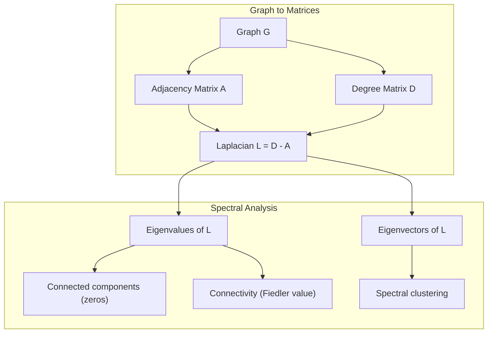
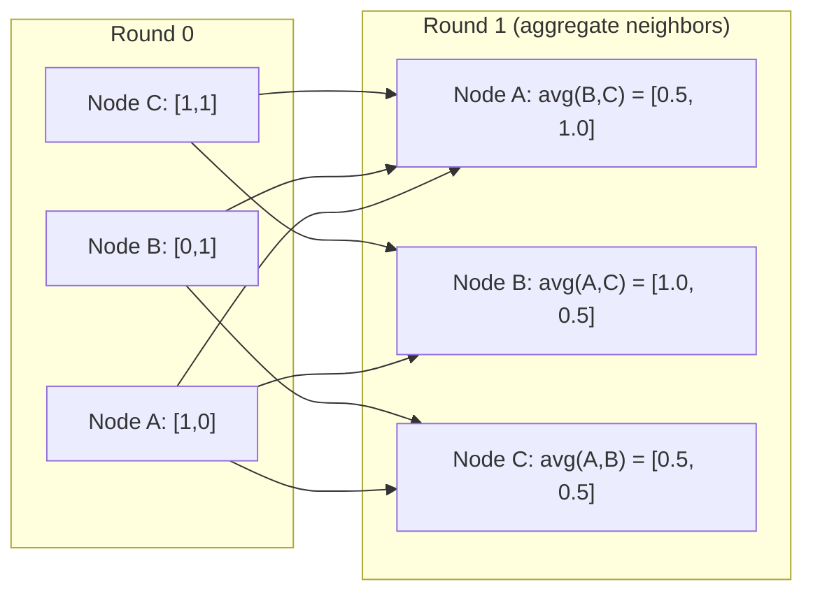

# 面向 Machine Learning 的 Graph Theory

> Graph 是关系的数据结构。如果你的数据包含连接，你就需要 graph theory。

**Type:** Build
**Language:** Python
**Prerequisites:** Phase 1, Lessons 01-03（linear algebra, matrices）
**Time:** ~90 分钟

## 学习目标
- 构建一个 graph class，包含 adjacency matrix/list 表示，并实现 BFS 和 DFS 遍历
- 计算 graph Laplacian，并使用其 eigenvalues 检测 connected components 和对 nodes 聚类
- 将一轮 GNN 风格的 message passing 实现为 normalized adjacency matrix multiplication
- 使用 Fiedler vector 应用 spectral clustering 来划分 graph

## 问题
Social networks、molecules、knowledge bases、citation networks、road maps 都是 graphs。传统 ML 将数据视为扁平表格。每一行都是独立的。每个 feature 是一列。但当连接结构很重要时，表格就失效了。

考虑一个 social network。你想预测某个用户会购买什么产品。他们的购买历史很重要。但他们朋友的购买历史更重要。连接本身承载了信号。

或者考虑一个 molecule。你想预测它是否会与某个 protein 结合。Atoms 很重要，但真正重要的是 atoms 如何彼此成键。结构就是数据。

Graph Neural Networks (GNNs) 是 Deep Learning 中增长最快的领域。它们驱动 drug discovery、social recommendation、fraud detection 和 knowledge graph reasoning。每个 GNN 都建立在同一个基础之上：基础 graph theory。

你需要四样东西：
1. 一种将 graphs 表示为 matrices 的方式（这样你就可以对它们做乘法）
2. 用于探索 graph structure 的 traversal algorithms
3. Laplacian，这是 spectral graph theory 中最重要的 matrix
4. Message passing，这是让 GNNs 工作的操作

## 概念
### Graphs: Nodes and Edges

一个 graph G = (V, E) 由 vertices (nodes) V 和 edges E 组成。每条 edge 连接两个 nodes。

**Directed vs undirected。** 在 undirected graph 中，edge (u, v) 表示 u 连接到 v，并且 v 也连接到 u。在 directed graph (digraph) 中，edge (u, v) 表示 u 指向 v，但反向不一定成立。

**Weighted vs unweighted。** 在 unweighted graph 中，edges 要么存在，要么不存在。在 weighted graph 中，每条 edge 都有一个数值 weight，比如 distance、cost 或 strength。

| Graph type | Example |
|-----------|---------|
| Undirected, unweighted | Facebook friendship network |
| Directed, unweighted | Twitter follow network |
| Undirected, weighted | Road map（distances） |
| Directed, weighted | Web page links（PageRank scores） |

### The Adjacency Matrix

adjacency matrix A 是核心表示。对于一个包含 n 个 nodes 的 graph：

```
A[i][j] = 1    if there is an edge from node i to node j
A[i][j] = 0    otherwise
```

对于 undirected graphs，A 是 symmetric：A[i][j] = A[j][i]。对于 weighted graphs，A[i][j] = edge (i, j) 的 weight。

**示例：一个 triangle：**

```
Nodes: 0, 1, 2
Edges: (0,1), (1,2), (0,2)

A = [[0, 1, 1],
     [1, 0, 1],
     [1, 1, 0]]
```

adjacency matrix 是每个 GNN 的输入。A 上的 Matrix operations 对应 graph 上的操作。

### Degree

node 的 degree 是连接到它的 edges 数量。对于 directed graphs，你有 in-degree（进入的 edges）和 out-degree（出去的 edges）。

degree matrix D 是 diagonal：

```
D[i][i] = degree of node i
D[i][j] = 0    for i != j
```

对于 triangle 示例：D = diag(2, 2, 2)，因为每个 node 都连接到另外两个 nodes。

Degree 告诉你 node 的重要性。High degree = hub node。一个 network 的 degree distribution 揭示了它的结构。Social networks 遵循 power laws（少量 hubs，许多 leaf nodes）。Random graphs 具有 Poisson-distributed degrees。

### BFS and DFS

两个基础 graph traversal algorithms。你两个都需要。

**Breadth-First Search (BFS)：** 先探索所有 neighbors，再探索 neighbors 的 neighbors。使用 queue (FIFO)。

```
BFS from node 0:
  Visit 0
  Queue: [1, 2]        (neighbors of 0)
  Visit 1
  Queue: [2, 3]        (add neighbors of 1)
  Visit 2
  Queue: [3]           (neighbors of 2 already visited)
  Visit 3
  Queue: []            (done)
```

BFS 在 unweighted graphs 中找到 shortest paths。从起点到任意 node 的 distance 等于该 node 第一次被发现时所在的 BFS level。这就是为什么 BFS 会被用于 social networks 中的 hop-count distances。

**Depth-First Search (DFS)：** 在回溯之前尽可能深入。使用 stack (LIFO) 或 recursion。

```
DFS from node 0:
  Visit 0
  Stack: [1, 2]        (neighbors of 0)
  Visit 2               (pop from stack)
  Stack: [1, 3]         (add neighbors of 2)
  Visit 3               (pop from stack)
  Stack: [1]
  Visit 1               (pop from stack)
  Stack: []             (done)
```

DFS 可用于：
- 查找 connected components（从未访问的 nodes 运行 DFS）
- Cycle detection（DFS tree 中的 back edges）
- Topological sorting（反向 DFS finish order）

| Algorithm | Data structure | Finds | Use case |
|-----------|---------------|-------|----------|
| BFS | Queue | Shortest paths | Social network distance, knowledge graph traversal |
| DFS | Stack | Components, cycles | Connectivity, topological sort |

### The Graph Laplacian

L = D - A。spectral graph theory 中最重要的 matrix。

对于 triangle：

```
D = [[2, 0, 0],    A = [[0, 1, 1],    L = [[2, -1, -1],
     [0, 2, 0],         [1, 0, 1],         [-1, 2, -1],
     [0, 0, 2]]         [1, 1, 0]]         [-1, -1,  2]]
```

Laplacian 具有非常重要的性质：

1. **L 是 positive semi-definite。** 所有 eigenvalues 都 >= 0。

2. **zero eigenvalues 的数量等于 connected components 的数量。** 一个 connected graph 恰好有一个 zero eigenvalue。一个有 3 个 disconnected components 的 graph 有三个 zero eigenvalues。

3. **最小的 non-zero eigenvalue（Fiedler value）衡量 connectivity。** 较大的 Fiedler value 表示 graph 连接良好。较小的 Fiedler value 表示 graph 有一个薄弱点，也就是 bottleneck。

4. **Fiedler value 的 eigenvector（Fiedler vector）揭示最佳切分。** 值为正的 nodes 进入一组，值为负的 nodes 进入另一组。这就是 spectral clustering。



### Spectral Properties

adjacency matrix 和 Laplacian 的 eigenvalues 可以在不做任何 traversal 的情况下揭示 structural properties。

**Spectral clustering** 的工作方式如下：
1. 计算 Laplacian L
2. 找到 L 的 k 个最小 eigenvectors（跳过第一个；对于 connected graphs，它是全 1）
3. 将这些 eigenvectors 用作每个 node 的新坐标
4. 在这些坐标上运行 k-means

为什么这有效？L 的 eigenvectors 编码了 graph 上最“平滑”的函数。连接良好的 nodes 会得到相似的 eigenvector values。被 bottleneck 分隔的 nodes 会得到不同的值。eigenvectors 会自然地分离 clusters。

**Random walk connection。** normalized Laplacian 与 graph 上的 random walks 有关。random walk 的 stationary distribution 与 node degree 成比例。mixing time（walk 收敛得有多快）取决于 spectral gap。

### Message Passing

这是 Graph Neural Networks 的核心操作。每个 node 从其 neighbors 收集 messages，聚合它们，然后更新自己的 state。

```
h_v^(k+1) = UPDATE(h_v^(k), AGGREGATE({h_u^(k) : u in neighbors(v)}))
```

在最简单的形式中，AGGREGATE = mean，UPDATE = linear transform + activation：

```
h_v^(k+1) = sigma(W * mean({h_u^(k) : u in neighbors(v)}))
```

这其实是伪装成另一种形式的 matrix multiplication。如果 H 是所有 node features 的 matrix，A 是 adjacency matrix：

```
H^(k+1) = sigma(A_norm * H^(k) * W)
```

其中 A_norm 是 normalized adjacency matrix（每一行求和为 1）。

一轮 message passing 让每个 node “看到”它的 immediate neighbors。两轮让它看到 neighbors of neighbors。K 轮让每个 node 获得来自其 K-hop neighborhood 的信息。



### 概念与 ML 应用

| Concept | ML Application |
|---------|---------------|
| Adjacency matrix | GNN input representation |
| Graph Laplacian | Spectral clustering, community detection |
| BFS/DFS | Knowledge graph traversal, path finding |
| Degree distribution | Node importance, feature engineering |
| Message passing | GNN layers (GCN, GAT, GraphSAGE) |
| Eigenvalues of L | Community detection, graph partitioning |
| Spectral clustering | Unsupervised node grouping |
| PageRank | Node importance, web search |


```figure
graph-degree-distribution
```

## 构建它
### 步骤 1：从零实现 Graph 类

```python
class Graph:
    def __init__(self, n_nodes, directed=False):
        self.n = n_nodes
        self.directed = directed
        self.adj = {i: {} for i in range(n_nodes)}

    def add_edge(self, u, v, weight=1.0):
        self.adj[u][v] = weight
        if not self.directed:
            self.adj[v][u] = weight

    def neighbors(self, node):
        return list(self.adj[node].keys())

    def degree(self, node):
        return len(self.adj[node])

    def adjacency_matrix(self):
        import numpy as np
        A = np.zeros((self.n, self.n))
        for u in range(self.n):
            for v, w in self.adj[u].items():
                A[u][v] = w
        return A

    def degree_matrix(self):
        import numpy as np
        D = np.zeros((self.n, self.n))
        for i in range(self.n):
            D[i][i] = self.degree(i)
        return D

    def laplacian(self):
        return self.degree_matrix() - self.adjacency_matrix()
```

adjacency list（`self.adj`）可以高效存储 neighbors。adjacency matrix 转换使用 numpy，因为所有 spectral operations 都需要它。

### 步骤 2： BFS and DFS

```python
from collections import deque

def bfs(graph, start):
    visited = set()
    order = []
    distances = {}
    queue = deque([(start, 0)])
    visited.add(start)
    while queue:
        node, dist = queue.popleft()
        order.append(node)
        distances[node] = dist
        for neighbor in graph.neighbors(node):
            if neighbor not in visited:
                visited.add(neighbor)
                queue.append((neighbor, dist + 1))
    return order, distances


def dfs(graph, start):
    visited = set()
    order = []
    stack = [start]
    while stack:
        node = stack.pop()
        if node in visited:
            continue
        visited.add(node)
        order.append(node)
        for neighbor in reversed(graph.neighbors(node)):
            if neighbor not in visited:
                stack.append(neighbor)
    return order
```

BFS 使用 deque（double-ended queue）以实现 O(1) popleft。DFS 使用 list 作为 stack。两者都会恰好访问每个 node 一次，时间复杂度为 O(V + E)。

### 步骤 3：Connected components 和 Laplacian eigenvalues

```python
def connected_components(graph):
    visited = set()
    components = []
    for node in range(graph.n):
        if node not in visited:
            order, _ = bfs(graph, node)
            visited.update(order)
            components.append(order)
    return components


def laplacian_eigenvalues(graph):
    import numpy as np
    L = graph.laplacian()
    eigenvalues = np.linalg.eigvalsh(L)
    return eigenvalues
```

`eigvalsh` 用于 symmetric matrices，而 Laplacian 对 undirected graphs 始终是 symmetric。它会按升序返回 eigenvalues。统计 zeros 就可以找到 connected components 的数量。

### 步骤 4: Spectral clustering

```python
def spectral_clustering(graph, k=2):
    import numpy as np
    L = graph.laplacian()
    eigenvalues, eigenvectors = np.linalg.eigh(L)
    features = eigenvectors[:, 1:k+1]

    labels = np.zeros(graph.n, dtype=int)
    for i in range(graph.n):
        if features[i, 0] >= 0:
            labels[i] = 0
        else:
            labels[i] = 1
    return labels
```

对于 k=2，Fiedler vector 的符号会将 graph 分成两个 clusters。对于 k>2，你会在前 k 个 eigenvectors（排除 trivial all-ones eigenvector）上运行 k-means。

### 步骤 5： Message passing

```python
def message_passing(graph, features, weight_matrix):
    import numpy as np
    A = graph.adjacency_matrix()
    row_sums = A.sum(axis=1, keepdims=True)
    row_sums[row_sums == 0] = 1
    A_norm = A / row_sums
    aggregated = A_norm @ features
    output = aggregated @ weight_matrix
    return output
```

这是一轮 GNN message passing。每个 node 的新 features 是其 neighbors 的 features 的 weighted average，再经过 weight matrix 转换。堆叠多轮可以将信息传播得更远。

## 使用它
使用 networkx 和 numpy，相同操作都是 one-liners：

```python
import networkx as nx
import numpy as np

G = nx.karate_club_graph()

A = nx.adjacency_matrix(G).toarray()
L = nx.laplacian_matrix(G).toarray()

eigenvalues = np.linalg.eigvalsh(L.astype(float))
print(f"Smallest eigenvalues: {eigenvalues[:5]}")
print(f"Connected components: {nx.number_connected_components(G)}")

communities = nx.community.greedy_modularity_communities(G)
print(f"Communities found: {len(communities)}")

pr = nx.pagerank(G)
top_nodes = sorted(pr.items(), key=lambda x: x[1], reverse=True)[:5]
print(f"Top 5 PageRank nodes: {top_nodes}")
```

networkx 可以借助优化的 C backends 处理任意规模的 graphs。在 production 中使用它。使用你从零实现的版本来理解它在做什么。

### numpy spectral analysis

```python
import numpy as np

A = np.array([
    [0, 1, 1, 0, 0],
    [1, 0, 1, 0, 0],
    [1, 1, 0, 1, 0],
    [0, 0, 1, 0, 1],
    [0, 0, 0, 1, 0]
])

D = np.diag(A.sum(axis=1))
L = D - A

eigenvalues, eigenvectors = np.linalg.eigh(L)
print(f"Eigenvalues: {np.round(eigenvalues, 4)}")
print(f"Fiedler value: {eigenvalues[1]:.4f}")
print(f"Fiedler vector: {np.round(eigenvectors[:, 1], 4)}")

fiedler = eigenvectors[:, 1]
group_a = np.where(fiedler >= 0)[0]
group_b = np.where(fiedler < 0)[0]
print(f"Cluster A: {group_a}")
print(f"Cluster B: {group_b}")
```

Fiedler vector 承担了主要工作。正值条目位于一个 cluster，负值条目位于另一个 cluster。不需要 iterative optimization，只需要一次 eigendecomposition。

## 交付它
本课产出：
- `outputs/skill-graph-analysis.md`：用于分析 graph-structured data 的 skill reference

## Connections

| Concept | Where it shows up |
|---------|------------------|
| Adjacency matrix | GCN, GAT, GraphSAGE input |
| Laplacian | Spectral clustering, ChebNet filters |
| BFS | Knowledge graph traversal, shortest path queries |
| Message passing | Every GNN layer, neural message passing |
| Spectral gap | Graph connectivity, mixing time of random walks |
| Degree distribution | Power-law networks, node feature engineering |
| Connected components | Preprocessing, handling disconnected graphs |
| PageRank | Node importance ranking, attention initialization |

GNNs 值得特别说明。GCN（Kipf & Welling, 2017）中的 graph convolution operation 使用添加了 self-loops 的 adjacency matrix，A_hat = A + I：

```text
H^(l+1) = sigma(D_hat^(-1/2) * A_hat * D_hat^(-1/2) * H^(l) * W^(l))
```

其中 A_hat = A + I（adjacency 加 self-loops），D_hat 是 A_hat 的 degree matrix。self-loops 确保每个 node 在 aggregation 期间包含自身 features。这正是带有 symmetric normalization 的 message passing。D_hat^(-1/2) * A_hat * D_hat^(-1/2) 是 normalized adjacency matrix。Laplacian 出现在这里，是因为这种 normalization 与 L_sym = I - D^(-1/2) * A * D^(-1/2) 相关。理解 Laplacian，就意味着理解 GCNs 为什么有效。

## 练习
1. **从零实现 PageRank。** 从 uniform scores 开始。每一步：score(v) = (1-d)/n + d * sum(score(u)/out_degree(u))，其中 u 是所有指向 v 的 nodes。使用 d=0.85。运行直到收敛（change < 1e-6）。在一个小型 web graph 上测试。

2. **使用 spectral clustering 查找 communities。** 创建一个包含两个明显分离 clusters 的 graph（例如，两个 cliques 通过一条 edge 连接）。运行 spectral clustering，并验证它能找到正确切分。当你添加更多 cross-cluster edges 时会发生什么？

3. **为 weighted graphs 中的 shortest paths 实现 Dijkstra's algorithm。** 在具有 uniform weights 的同一个 graph 上，将结果与 BFS 比较。

4. **构建一个 2-layer message passing network。** 使用不同的 weight matrices 应用两次 message passing。展示经过 2 轮后，每个 node 都拥有来自其 2-hop neighborhood 的信息。

5. **分析一个真实世界 graph。** 使用 Karate Club graph（34 nodes, 78 edges）。计算 degree distribution、Laplacian eigenvalues 和 spectral clustering。将 spectral clustering 结果与已知 ground truth split 比较。

## 关键术语
| Term | What people say | What it actually means |
|------|----------------|----------------------|
| Graph | “Nodes and edges” | 一种数学结构 G=(V,E)，用于编码 pairwise relationships |
| Adjacency matrix | “The connection table” | 一个 n x n matrix，其中如果 nodes i 和 j 相连，则 A[i][j] = 1 |
| Degree | “一个 node 有多 connected” | 接触某个 node 的 edges 数量 |
| Laplacian | “D minus A” | L = D - A，其 eigenvalues 会揭示 graph structure 的 matrix |
| Fiedler value | “The algebraic connectivity” | L 的最小 non-zero eigenvalue，用于衡量 graph 连接得有多好 |
| BFS | “Level-by-level search” | 在深入之前先访问所有 neighbors 的 traversal，可找到 shortest paths |
| DFS | “Go deep first” | 在回溯之前沿一条 path 走到末端的 traversal |
| Message passing | “Nodes talk to neighbors” | 每个 node 从其 neighbors 聚合信息，这是 GNNs 的核心 |
| Spectral clustering | “Cluster by eigenvectors” | 使用 graph 的 Laplacian 的 eigenvectors 来划分 graph |
| Connected component | “A separate piece” | 一个 maximal subgraph，其中每个 node 都能到达其他每个 node |

## 延伸阅读
- **Kipf & Welling (2017)**：“Semi-Supervised Classification with Graph Convolutional Networks。”开启现代 GNNs 的论文。展示了 spectral graph convolutions 如何简化为 message passing。
- **Spielman (2012)**：“Spectral Graph Theory” lecture notes。关于 Laplacians、spectral gaps 和 graph partitioning 的权威入门。
- **Hamilton (2020)**：“Graph Representation Learning。”一本从基础到应用覆盖 GNNs 的书。
- **Bronstein et al. (2021)**：“Geometric Deep Learning: Grids, Groups, Graphs, Geodesics, and Gauges。”统一框架论文。
- **Veličković et al. (2018)**：“Graph Attention Networks。”用 attention mechanisms 扩展 message passing。
