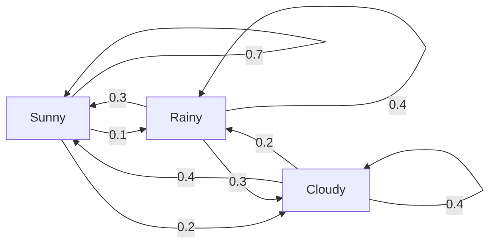
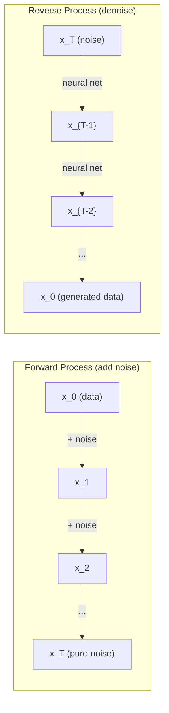

# Stochastic Processes

> 具有结构的随机性。random walks、Markov chains 和 diffusion models 背后的数学。

**Type:** Learn
**Language:** Python
**Prerequisites:** Phase 1, Lessons 06-07（probability, Bayes）
**Time:** ~75 分钟

## 学习目标
- 模拟 1D 和 2D random walks，并验证位移的 sqrt(n) 缩放规律
- 构建 Markov chain 模拟器，并通过 eigendecomposition 计算其 stationary distribution
- 实现 Metropolis-Hastings MCMC 和 Langevin dynamics，用于从目标分布采样
- 将 forward diffusion process 与 Brownian motion 联系起来，并解释 reverse process 如何生成数据

## 问题
许多 AI 系统都涉及随时间演化的随机性。不是静态随机性，而是结构化、序列化的随机性，其中每一步都依赖之前发生的内容。

Language models 一次生成一个 tokens。每个 token 都依赖前面的 context。模型输出一个 probability distribution，从中采样，然后继续。这就是一个 stochastic process。

Diffusion models 逐步向图像添加噪声，直到它变成纯静态噪声。然后它们反转这个过程，逐步 denoising，直到出现一张新图像。forward process 是一个 Markov chain。reverse process 是一个反向运行的 learned Markov chain。

Reinforcement learning agents 在环境中采取 actions。每个 action 都以某种概率导致一个新 state。agent 在一个随机世界中遵循随机 policy。整体就是一个 Markov decision process。

MCMC sampling 是 Bayesian inference 的支柱，它构造一个 Markov chain，其 stationary distribution 就是你想要采样的 posterior。

所有这些都建立在四个基础思想之上：
1. Random walks —— 最简单的 stochastic process
2. Markov chains —— 带有 transition matrix 的结构化随机性
3. Langevin dynamics —— 带噪声的 Gradient Descent
4. Metropolis-Hastings —— 从任意分布采样

## 概念
### Random Walks

从位置 0 开始。每一步，抛一枚公平硬币。正面：向右移动（+1）。反面：向左移动（-1）。

经过 n 步后，你的位置是 n 个随机 +/-1 值的总和。期望位置是 0（这个 walk 是 unbiased 的）。但距离原点的期望距离按 sqrt(n) 增长。

这有点反直觉。这个 walk 是公平的，两个方向都没有 drift。但随着时间推移，它会离起点越来越远。n 步后的 standard deviation 是 sqrt(n)。

```
Step 0:  Position = 0
Step 1:  Position = +1 or -1
Step 2:  Position = +2, 0, or -2
...
Step 100: Expected distance from origin ~ 10 (sqrt(100))
Step 10000: Expected distance from origin ~ 100 (sqrt(10000))
```

**在 2D 中**，walk 以相等概率向上、向下、向左或向右移动。距离原点同样遵循 sqrt(n) 缩放规律。路径会描绘出类似 fractal 的模式。

**为什么是 sqrt(n)？** 每一步都以相等概率为 +1 或 -1。n 步后，位置 S_n = X_1 + X_2 + ... + X_n，其中每个 X_i 都是 +/-1。每一步的 variance 是 1，并且各步相互独立，所以 Var(S_n) = n。Standard deviation = sqrt(n)。根据 central limit theorem，S_n / sqrt(n) 收敛到 standard normal distribution。

这种 sqrt(n) 缩放在 ML 中随处可见。SGD 噪声按 1/sqrt(batch_size) 缩放。Embedding 维度按 sqrt(d) 缩放。平方根是独立随机加和的标志。

**与 Brownian motion 的联系。** 取一个 step size 为 1/sqrt(n)、每单位时间 n 步的 random walk。当 n 趋近无穷时，这个 walk 会收敛到 Brownian motion B(t) —— 一个 continuous-time process，其中 B(t) 服从均值为 0、variance 为 t 的 normal distribution。

Brownian motion 是 diffusion 的数学基础。它刻画流体中粒子的随机抖动、股票价格的波动，以及关键地，diffusion models 中的噪声过程。

**Gambler's ruin。** 一个 random walker 从位置 k 开始，在 0 和 N 处有 absorbing barriers。到达 N 早于到达 0 的概率是多少？对于公平 walk：P(reach N) = k/N。这非常简单而优雅。它连接到 martingales 理论 —— 公平 random walk 是一个 martingale（expected future value = current value）。

### Markov Chains

Markov chain 是一个系统，它按照固定概率在 states 之间转换。关键性质是：下一个 state 只依赖当前 state，而不依赖历史。

```
P(X_{t+1} = j | X_t = i, X_{t-1} = ...) = P(X_{t+1} = j | X_t = i)
```

这就是 Markov property。它意味着你可以用一个 transition matrix P 描述整个 dynamics：

```
P[i][j] = probability of going from state i to state j
```

P 的每一行求和为 1（你必须去往某个地方）。

**示例 —— Weather：**

```
States: Sunny (0), Rainy (1), Cloudy (2)

P = [[0.7, 0.1, 0.2],    (if sunny: 70% sunny, 10% rainy, 20% cloudy)
     [0.3, 0.4, 0.3],    (if rainy: 30% sunny, 40% rainy, 30% cloudy)
     [0.4, 0.2, 0.4]]    (if cloudy: 40% sunny, 20% rainy, 40% cloudy)
```

从任意 state 开始。经过多次 transitions 后，states 的分布会收敛到 stationary distribution pi，其中 pi * P = pi。这是 P 的 eigenvalue 为 1 的 left eigenvector。

对于 weather chain，stationary distribution 可能是 [0.53, 0.18, 0.29] —— 长期来看，无论起始 state 是什么，53% 的时间都是 sunny。



**计算 stationary distribution。** 有两种方法：

1. **Power method**：将任意初始分布反复乘以 P。经过足够多 iterations 后，它会收敛。
2. **Eigenvalue method**：找到 P 的 eigenvalue 为 1 的 left eigenvector。这等价于 P^T 的 eigenvalue 为 1 的 eigenvector。

两种方法都要求 chain 满足收敛条件。

**收敛条件。** 如果一个 Markov chain 满足以下条件，它会收敛到唯一的 stationary distribution：
- **Irreducible**：每个 state 都可以从任意其他 state 到达
- **Aperiodic**：chain 不会以固定周期循环

你在 ML 中遇到的大多数 chains 都满足这两个条件。

**Absorbing states。** 如果一旦进入某个 state 就永远不会离开（P[i][i] = 1），这个 state 就是 absorbing 的。Absorbing Markov chains 可用于建模带有 terminal states 的过程 —— 一个结束的游戏、一个 churn 的客户、一个命中 end-of-text token 的 token sequence。

**Mixing time。** 需要多少步，chain 才会“接近”stationary distribution？形式化地说，就是 total variation distance 与 stationarity 的距离降到某个阈值以下所需的步数。Fast mixing = 需要的步数少。P 的 spectral gap（1 减去第二大 eigenvalue）控制 mixing time。gap 越大，mixing 越快。

### 与 Language Models 的联系

Language model 中的 token generation 近似是一个 Markov process。给定当前 context，模型输出 next token 上的分布。Temperature 控制 sharpness：

```
P(token_i) = exp(logit_i / temperature) / sum(exp(logit_j / temperature))
```

- Temperature = 1.0：标准分布
- Temperature < 1.0：更尖锐（更 deterministic）
- Temperature > 1.0：更平坦（更 random）
- Temperature -> 0：argmax（greedy）

Top-k sampling 截断到概率最高的 k 个 tokens。Top-p（nucleus）sampling 截断到 cumulative probability 超过 p 的最小 token 集合。两者都会修改 Markov transition probabilities。

### Brownian Motion

random walk 的 continuous-time limit。位置 B(t) 有三个性质：
1. B(0) = 0
2. B(t) - B(s) 服从均值为 0、variance 为 t - s 的 normal distribution（对 t > s）
3. 不重叠区间上的 increments 相互独立

Brownian motion 是连续的，但处处不可微 —— 它在每个尺度上都在抖动。其路径在平面中的 fractal dimension 为 2。

在离散模拟中，你可以这样近似 Brownian motion：

```
B(t + dt) = B(t) + sqrt(dt) * z,    where z ~ N(0, 1)
```

sqrt(dt) 缩放很重要。它来自应用于 random walks 的 central limit theorem。

### Langevin Dynamics

Gradient Descent 寻找函数的最小值。Langevin dynamics 寻找与 exp(-U(x)/T) 成正比的 probability distribution，其中 U 是 energy function，T 是 temperature。

```
x_{t+1} = x_t - dt * gradient(U(x_t)) + sqrt(2 * T * dt) * z_t
```

有两种力作用在 particle 上：
1. **Gradient force**（-dt * gradient(U)）：推向低 energy（类似 Gradient Descent）
2. **Random force**（sqrt(2*T*dt) * z）：推向随机方向（exploration）

当 temperature T = 0 时，这就是纯 Gradient Descent。高 temperature 下，它几乎是 random walk。在合适的 temperature 下，particle 会探索 energy landscape，并在 low-energy regions 中停留更久。

**与 diffusion models 的联系。** Diffusion model 的 forward process 是：

```
x_t = sqrt(alpha_t) * x_{t-1} + sqrt(1 - alpha_t) * noise
```

这是一个逐渐将 data 与 noise 混合的 Markov chain。经过足够多 steps 后，x_T 就是纯 Gaussian noise。

reverse process —— 从 noise 回到 data —— 也是一个 Markov chain，但它的 transition probabilities 由 Neural Network 学习得到。网络学习预测每一步加入的 noise，然后将其减去。



### MCMC: Markov Chain Monte Carlo

有时你需要从一个可以求值（允许差一个常数）但无法直接采样的分布 p(x) 中采样。Bayesian posteriors 是经典例子 —— 你知道 likelihood 乘以 prior，但 normalizing constant 难以处理。

**Metropolis-Hastings** 构造一个 stationary distribution 为 p(x) 的 Markov chain：

1. 从某个位置 x 开始
2. 从 proposal distribution Q(x'|x) 提议一个新位置 x'
3. 计算 acceptance ratio：a = p(x') * Q(x|x') / (p(x) * Q(x'|x))
4. 以概率 min(1, a) 接受 x'。否则留在 x。
5. 重复。

如果 Q 是 symmetric 的（例如 Q(x'|x) = Q(x|x') = N(x, sigma^2)），ratio 可简化为 a = p(x') / p(x)。你只需要概率的 ratio —— normalizing constant 会相互抵消。

在温和条件下，这个 chain 保证收敛到 p(x)。但如果 proposal 太小（random walk）或太大（高 rejection），收敛可能很慢。调节 proposal 是 MCMC 的艺术。

**为什么它有效。** acceptance ratio 确保 detailed balance：位于 x 并移动到 x' 的概率，等于位于 x' 并移动到 x 的概率。Detailed balance 意味着 p(x) 是该 chain 的 stationary distribution。因此经过足够多 steps 后，samples 来自 p(x)。

**实践注意事项：**
- **Burn-in**：丢弃前 N 个 samples。chain 需要时间从起点到达 stationary distribution。
- **Thinning**：每隔 k 个 sample 保留一个，以减少 autocorrelation。
- **Multiple chains**：从不同起点运行多个 chains。如果它们收敛到同一分布，就有收敛的证据。
- **Acceptance rate**：对于 d 维 Gaussian proposals，最佳 acceptance rate 大约是 23%（Roberts & Rosenthal, 2001）。太高意味着 chain 几乎不移动。太低意味着它几乎全部 reject。

### Stochastic Processes in AI

| Process | AI Application |
|---------|---------------|
| Random walk | RL 中的 exploration、Node2Vec embeddings |
| Markov chain | Text generation、MCMC sampling |
| Brownian motion | Diffusion models（forward process） |
| Langevin dynamics | Score-based generative models、SGLD |
| Markov decision process | Reinforcement learning |
| Metropolis-Hastings | Bayesian inference、posterior sampling |


```figure
random-walk-diffusion
```

## 构建它
### 步骤 1： Random walk simulator

```python
import numpy as np

def random_walk_1d(n_steps, seed=None):
    rng = np.random.RandomState(seed)
    steps = rng.choice([-1, 1], size=n_steps)
    positions = np.concatenate([[0], np.cumsum(steps)])
    return positions


def random_walk_2d(n_steps, seed=None):
    rng = np.random.RandomState(seed)
    directions = rng.choice(4, size=n_steps)
    dx = np.zeros(n_steps)
    dy = np.zeros(n_steps)
    dx[directions == 0] = 1   # right
    dx[directions == 1] = -1  # left
    dy[directions == 2] = 1   # up
    dy[directions == 3] = -1  # down
    x = np.concatenate([[0], np.cumsum(dx)])
    y = np.concatenate([[0], np.cumsum(dy)])
    return x, y
```

1D walk 存储 cumulative sums。每一步是 +1 或 -1。经过 n 步后，位置就是总和。variance 随 n 线性增长，因此 standard deviation 按 sqrt(n) 增长。

### 步骤 2： Markov chain

```python
class MarkovChain:
    def __init__(self, transition_matrix, state_names=None):
        self.P = np.array(transition_matrix, dtype=float)
        self.n_states = len(self.P)
        self.state_names = state_names or [str(i) for i in range(self.n_states)]

    def step(self, current_state, rng=None):
        if rng is None:
            rng = np.random.RandomState()
        probs = self.P[current_state]
        return rng.choice(self.n_states, p=probs)

    def simulate(self, start_state, n_steps, seed=None):
        rng = np.random.RandomState(seed)
        states = [start_state]
        current = start_state
        for _ in range(n_steps):
            current = self.step(current, rng)
            states.append(current)
        return states

    def stationary_distribution(self):
        eigenvalues, eigenvectors = np.linalg.eig(self.P.T)
        idx = np.argmin(np.abs(eigenvalues - 1.0))
        stationary = np.real(eigenvectors[:, idx])
        stationary = stationary / stationary.sum()
        return np.abs(stationary)
```

stationary distribution 是 P 的 eigenvalue 为 1 的 left eigenvector。我们通过计算 P^T 的 eigenvectors 来找到它（转置会把 left eigenvectors 变成 right eigenvectors）。

### 步骤 3： Langevin dynamics

```python
def langevin_dynamics(grad_U, x0, dt, temperature, n_steps, seed=None):
    rng = np.random.RandomState(seed)
    x = np.array(x0, dtype=float)
    trajectory = [x.copy()]
    for _ in range(n_steps):
        noise = rng.randn(*x.shape)
        x = x - dt * grad_U(x) + np.sqrt(2 * temperature * dt) * noise
        trajectory.append(x.copy())
    return np.array(trajectory)
```

Gradient 将 x 推向低 energy。noise 防止它陷入局部停滞。在 equilibrium 时，samples 的分布与 exp(-U(x)/temperature) 成正比。

### 步骤 4： Metropolis-Hastings

```python
def metropolis_hastings(target_log_prob, proposal_std, x0, n_samples, seed=None):
    rng = np.random.RandomState(seed)
    x = np.array(x0, dtype=float)
    samples = [x.copy()]
    accepted = 0
    for _ in range(n_samples - 1):
        x_proposed = x + rng.randn(*x.shape) * proposal_std
        log_ratio = target_log_prob(x_proposed) - target_log_prob(x)
        if np.log(rng.rand()) < log_ratio:
            x = x_proposed
            accepted += 1
        samples.append(x.copy())
    acceptance_rate = accepted / (n_samples - 1)
    return np.array(samples), acceptance_rate
```

该算法提议一个新点，检查它是否具有更高概率（或以与 ratio 成正比的概率接受），然后重复。为了获得良好的 mixing，acceptance rate 应该在大约 23-50% 之间。

## 使用它
实践中，你会使用成熟库来实现这些算法。但理解机制对于 debugging 和 tuning 很重要。

```python
import numpy as np

rng = np.random.RandomState(42)
walk = np.cumsum(rng.choice([-1, 1], size=10000))
print(f"Final position: {walk[-1]}")
print(f"Expected distance: {np.sqrt(10000):.1f}")
print(f"Actual distance: {abs(walk[-1])}")
```

### 用于 transition matrices 的 numpy

```python
import numpy as np

P = np.array([[0.7, 0.1, 0.2],
              [0.3, 0.4, 0.3],
              [0.4, 0.2, 0.4]])

distribution = np.array([1.0, 0.0, 0.0])
for _ in range(100):
    distribution = distribution @ P

print(f"Stationary distribution: {np.round(distribution, 4)}")
```

将初始分布反复乘以 P。经过足够多 iterations 后，它会收敛到 stationary distribution，无论你从哪里开始。这就是寻找 dominant left eigenvector 的 power method。

### 与真实框架的连接

- **PyTorch diffusion：** Hugging Face `diffusers` 中的 `DDPMScheduler` 实现了 forward 和 reverse Markov chains
- **NumPyro / PyMC：** 使用 MCMC（NUTS sampler，它是对 Metropolis-Hastings 的改进）进行 Bayesian inference
- **Gymnasium (RL)：** environment step function 定义了一个 Markov decision process

### 验证 Markov chain convergence

```python
import numpy as np

P = np.array([[0.9, 0.1], [0.3, 0.7]])

eigenvalues = np.linalg.eigvals(P)
spectral_gap = 1 - sorted(np.abs(eigenvalues))[-2]
print(f"Eigenvalues: {eigenvalues}")
print(f"Spectral gap: {spectral_gap:.4f}")
print(f"Approximate mixing time: {1/spectral_gap:.1f} steps")
```

spectral gap 告诉你 chain 忘记其 initial state 的速度。gap 为 0.2 意味着大约 5 步即可 mix。gap 为 0.01 意味着大约 100 步。运行长 simulation 之前务必检查这一点 —— mixing 很慢的 chain 会浪费 compute。

## 交付它
本课产出：
- `outputs/prompt-stochastic-process-advisor.md` —— 一个 prompt，用于帮助识别给定问题适用哪种 stochastic process framework

## Connections

| Concept | Where it shows up |
|---------|------------------|
| Random walk | Node2Vec graph embeddings、RL 中的 exploration |
| Markov chain | LLMs 中的 Token generation、MCMC sampling |
| Brownian motion | DDPM 中的 forward diffusion process、SDE-based models |
| Langevin dynamics | Score-based generative models、stochastic gradient Langevin dynamics (SGLD) |
| Stationary distribution | MCMC convergence target、PageRank |
| Metropolis-Hastings | Bayesian posterior sampling、simulated annealing |
| Temperature | LLM sampling、RL 中的 Boltzmann exploration、simulated annealing |
| Mixing time | MCMC 的 convergence speed、spectral gap analysis |
| Absorbing state | End-of-sequence token、RL 中的 terminal states |
| Detailed balance | MCMC samplers 的 correctness guarantee |

Diffusion models 值得特别关注。DDPM（Ho et al., 2020）定义了一个 forward Markov chain：

```
q(x_t | x_{t-1}) = N(x_t; sqrt(1-beta_t) * x_{t-1}, beta_t * I)
```

其中 beta_t 是一个 noise schedule。经过 T 步后，x_T 近似为 N(0, I)。reverse process 由一个预测 noise 的 Neural Network 参数化：

```
p_theta(x_{t-1} | x_t) = N(x_{t-1}; mu_theta(x_t, t), sigma_t^2 * I)
```

generation 的每一步都是 learned Markov chain 中的一步。理解 Markov chains，就意味着理解 diffusion models 如何以及为什么能够生成数据。

SGLD（Stochastic Gradient Langevin Dynamics）将 mini-batch Gradient Descent 与 Langevin noise 结合起来。你不计算完整 Gradient，而是使用 stochastic estimate 并添加 calibrated noise。随着 learning rate 衰减，SGLD 会从 optimization 过渡到 sampling —— 你几乎免费得到近似 Bayesian posterior samples。这是从 Neural Network 获得 uncertainty estimates 的最简单方式之一。

贯穿这些联系的关键洞见是：stochastic processes 不只是理论工具。它们是现代 AI 系统内部的计算机制。当你调节 LLM 的 temperature 时，你是在调整一个 Markov chain。当你训练 diffusion model 时，你是在学习反转一个类似 Brownian motion 的过程。当你运行 Bayesian inference 时，你是在构造一个收敛到 posterior 的 chain。

## 练习
1. **模拟 1000 条 10000 步的 random walks。** 绘制 final positions 的分布。验证它近似为 mean 0、standard deviation sqrt(10000) = 100 的 Gaussian。

2. **使用 Markov chain 构建 text generator。** 在一个小 corpus 上训练：对每个 word，统计到下一个 word 的 transitions。构建 transition matrix。通过从 chain 中采样生成新句子。

3. **使用 Metropolis-Hastings 实现 simulated annealing。** 从高 temperature 开始（几乎接受所有内容），然后逐渐降温（只接受改进）。用它寻找具有许多 local minima 的函数最小值。

4. **比较不同 temperatures 下的 Langevin dynamics。** 从 double-well potential U(x) = (x^2 - 1)^2 中采样。低 temperature 时，samples 聚集在一个 well 中。高 temperature 时，它们分布到两个 well。找到 chain 在 wells 之间 mix 的 critical temperature。

5. **实现 forward diffusion process。** 从一个 1D signal（例如 sine wave）开始。使用 linear noise schedule，在 100 步中逐渐添加 noise。展示 signal 如何退化为 pure noise。然后实现一个简单的 denoiser 来反转该过程（即使是一个仅减去 estimated noise 的 naive 版本也可以）。

## 关键术语
| Term | What people say | What it actually means |
|------|----------------|----------------------|
| Random walk | “抛硬币式移动” | 一个 position 在每一步按随机 increments 改变的过程 |
| Markov property | “无记忆性” | future 只依赖当前 state，而不依赖 history |
| Transition matrix | “概率表” | P[i][j] = 从 state i 移动到 state j 的概率 |
| Stationary distribution | “长期平均” | 满足 pi*P = pi 的分布 pi —— chain 的 equilibrium |
| Brownian motion | “随机抖动” | random walk 的 continuous-time limit，B(t) ~ N(0, t) |
| Langevin dynamics | “带噪声的 Gradient Descent” | 结合 deterministic Gradient 与 random perturbation 的 update rule |
| MCMC | “向目标行走” | 构造一个 stationary distribution 为你想要的分布的 Markov chain |
| Metropolis-Hastings | “提议并接受/拒绝” | 使用 acceptance ratios 来确保收敛的 MCMC algorithm |
| Temperature | “随机性旋钮” | 控制 exploration 与 exploitation 之间权衡的参数 |
| Diffusion process | “噪声进，噪声出” | Forward：逐渐添加 noise。Reverse：逐渐移除 noise。生成 data。 |

## 延伸阅读
- **Ho, Jain, Abbeel (2020)** —— “Denoising Diffusion Probabilistic Models.” 开启 diffusion model 革命的 DDPM 论文。清晰推导了 forward 和 reverse Markov chains。
- **Song & Ermon (2019)** —— “Generative Modeling by Estimating Gradients of the Data Distribution.” 使用 Langevin dynamics 进行 sampling 的 score-based 方法。
- **Roberts & Rosenthal (2004)** —— “General state space Markov chains and MCMC algorithms.” 关于 MCMC 何时以及为什么有效的理论。
- **Norris (1997)** —— “Markov Chains.” 标准教材。涵盖 convergence、stationary distributions 和 hitting times。
- **Welling & Teh (2011)** —— “Bayesian Learning via Stochastic Gradient Langevin Dynamics.” 将 SGD 与 Langevin dynamics 结合，用于可扩展 Bayesian inference。
