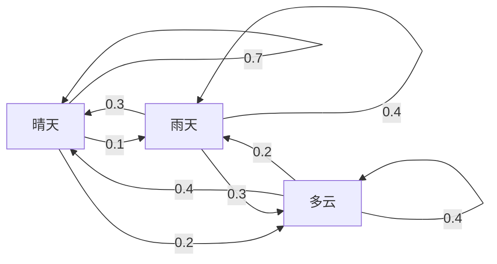
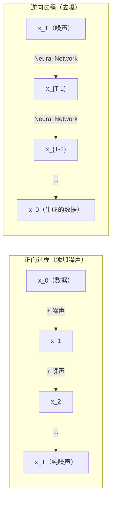

# Stochastic Process

> 具有结构的随机性。Random Walk、Markov Chain 和 Diffusion Model 背后的数学原理。

**Type:** Learn
**Language:** Python
**Prerequisites:** Phase 1，第 06-07 课（Probability、Bayes）
**Time:** 约 75 分钟

## 学习目标

- 模拟 1D 和 2D Random Walk，并验证位移的 sqrt(n) 缩放规律
- 构建 Markov Chain 模拟器，并通过 Eigen Decomposition 计算其 Stationary Distribution
- 实现用于从目标 Probability Distribution 采样的 Metropolis-Hastings MCMC 和 Langevin Dynamics
- 将正向 Diffusion Process 与 Brownian Motion 联系起来，并解释逆向过程如何生成数据

## 问题

许多 AI 系统都涉及随时间演化的随机性。它不是静态随机性，而是有结构的序列随机性，其中每一步都依赖此前发生的事情。

语言模型逐个生成 Token。每个 Token 都依赖之前的 Context。Model 输出一个 Probability Distribution，从中采样，然后继续。这就是一种 Stochastic Process。

Diffusion Model 逐步向图像添加噪声，直至图像变成纯噪点。然后逆转这一过程，逐步去噪，直到生成一幅新图像。正向过程是 Markov Chain。逆向过程则是一个反向运行、通过学习得到的 Markov Chain。

Reinforcement Learning Agent 在环境中采取行动。每个行动都会以一定 Probability 产生一个新状态。Agent 在随机世界中遵循随机策略。整个系统就是 Markov Decision Process。

MCMC 采样是 Bayesian Inference 的支柱，它会构造一个 Markov Chain，而该链的 Stationary Distribution 正是你希望从中采样的 Posterior。

这些方法都建立在四个基础概念之上：

1. Random Walk——最简单的 Stochastic Process
2. Markov Chain——由 Transition Matrix 描述的结构化随机性
3. Langevin Dynamics——带噪声的 Gradient Descent
4. Metropolis-Hastings——从任意 Probability Distribution 中采样

## 概念

### Random Walk

从位置 0 开始。每一步都抛一枚公平硬币。正面：向右移动（+1）。反面：向左移动（-1）。

经过 n 步后，你的位置就是 n 个随机 +/-1 值之和。期望位置是 0（Random Walk 没有偏向）。但到原点的期望距离会按 sqrt(n) 增长。

这有些反直觉。Random Walk 是公平的，任一方向都不存在漂移。但随着时间推移，它会离起点越来越远。经过 n 步后的 Standard Deviation 是 sqrt(n)。

```text
第 0 步：位置 = 0
第 1 步：位置 = +1 或 -1
第 2 步：位置 = +2、0 或 -2
...
第 100 步：到原点的期望距离约为 10（sqrt(100)）
第 10000 步：到原点的期望距离约为 100（sqrt(10000)）
```

**在 2D 中**，每一步以相同 Probability 向上、下、左或右移动。到原点的距离同样遵循 sqrt(n) 缩放规律。它的路径会呈现类似分形的图案。

**为什么是 sqrt(n)？** 每一步都以相同 Probability 取 +1 或 -1。经过 n 步后，位置 S_n = X_1 + X_2 + ... + X_n，其中每个 X_i 都是 +/-1。每一步的 Variance 是 1，并且各步相互独立，因此 Var(S_n) = n。Standard Deviation = sqrt(n)。根据 Central Limit Theorem，S_n / sqrt(n) 会收敛到 Standard Normal Distribution。

这种 sqrt(n) 缩放规律在 ML 中随处可见。SGD 噪声按 1/sqrt(batch_size) 缩放。Embedding 维度按 sqrt(d) 缩放。平方根是独立随机量相加的标志。

**与 Brownian Motion 的联系。** 考虑步长为 1/sqrt(n)、每单位时间执行 n 步的 Random Walk。当 n 趋于无穷大时，该 Random Walk 收敛到 Brownian Motion B(t)，这是一种连续时间过程，其中 B(t) 服从均值为 0、Variance 为 t 的 Normal Distribution。

Brownian Motion 是 Diffusion 的数学基础。它描述流体中粒子的随机抖动、股票价格的波动，以及至关重要的 Diffusion Model 中的噪声过程。

**Gambler's Ruin。** 一个 Random Walker 从位置 k 开始，在 0 和 N 处设置吸收边界。在到达 0 之前先到达 N 的 Probability 是多少？对于公平的 Random Walk：P(到达 N) = k/N。这个结果出乎意料地简单而优雅。它与 Martingale 理论相关：公平 Random Walk 是一个 Martingale（未来值的 Expectation = 当前值）。

### Markov Chain

Markov Chain 是一个根据固定 Probability 在状态之间转移的系统。其关键性质是：下一个状态只依赖当前状态，不依赖历史。

```text
P(X_{t+1} = j | X_t = i, X_{t-1} = ...) = P(X_{t+1} = j | X_t = i)
```

这就是 Markov Property。它意味着可以使用一个 Transition Matrix P 描述完整的动态过程：

```text
P[i][j] = 从状态 i 转移到状态 j 的 Probability
```

P 的每一行之和都是 1（系统必须转移到某个状态）。

**示例——天气：**

```text
状态：晴天（0）、雨天（1）、多云（2）

P = [[0.7, 0.1, 0.2],    （如果是晴天：70% 晴天、10% 雨天、20% 多云）
     [0.3, 0.4, 0.3],    （如果是雨天：30% 晴天、40% 雨天、30% 多云）
     [0.4, 0.2, 0.4]]    （如果是多云：40% 晴天、20% 雨天、40% 多云）
```

从任意状态开始。经过多次转移后，状态的 Probability Distribution 会收敛到 Stationary Distribution pi，其中 pi * P = pi。它是 P 对应 Eigenvalue 1 的左 Eigenvector。

对于这个天气链，Stationary Distribution 是 [0.55, 0.18, 0.27]。长期来看，无论从哪个状态开始，55% 的时间都是晴天。



**计算 Stationary Distribution。** 有两种方法：

1. **Power Method**：反复将任意初始 Probability Distribution 乘以 P。经过足够多次迭代后，它会收敛。
2. **Eigenvalue Method**：找出 P 对应 Eigenvalue 1 的左 Eigenvector。它就是 P^T 对应 Eigenvalue 1 的 Eigenvector。

两种方法都要求该链满足收敛条件。

**收敛条件。** 如果 Markov Chain 满足以下条件，它会收敛到唯一的 Stationary Distribution：

- **Irreducible**：每个状态都可以从其他任何状态到达
- **Aperiodic**：该链不会按固定周期循环

ML 中遇到的大多数链都同时满足这两个条件。

**Absorbing State。** 如果进入某个状态后永远不会离开（P[i][i] = 1），该状态就是 Absorbing State。吸收 Markov Chain 可以描述包含终止状态的过程，例如结束的游戏、流失的客户，或者到达 end-of-text Token 的 Token 序列。

**Mixing Time。** 该链需要多少步才能“接近”Stationary Distribution？形式上，它是与 Stationary Distribution 之间的 Total Variation Distance 降至某个阈值以下所需的步数。快速混合意味着只需要很少的步骤。P 的 Spectral Gap（1 减去第二大 Eigenvalue）决定 Mixing Time。间隙越大，混合越快。

### 与语言模型的联系

语言模型中的 Token 生成近似于 Markov Process。给定当前 Context，Model 会输出下一个 Token 的 Probability Distribution。Temperature 控制其尖锐程度：

```text
P(token_i) = exp(logit_i / temperature) / sum(exp(logit_j / temperature))
```

- Temperature = 1.0：标准 Probability Distribution
- Temperature < 1.0：更尖锐（更具确定性）
- Temperature > 1.0：更平坦（更随机）
- Temperature -> 0：argmax（贪心选择）

Top-k Sampling 会将候选截断为 Probability 最高的 k 个 Token。Top-p（Nucleus）Sampling 会将候选截断为累计 Probability 超过 p 的最小 Token 集合。两者都会修改 Markov Transition Probability。

### Brownian Motion

它是 Random Walk 的连续时间极限。位置 B(t) 具有三个性质：

1. B(0) = 0
2. B(t) - B(s) 服从均值为 0、Variance 为 t - s 的 Normal Distribution（t > s）
3. 不重叠时间区间上的增量相互独立

Brownian Motion 连续但处处不可微，它在每种尺度上都会抖动。其路径在平面中的分形维数为 2。

在离散模拟中，可以通过以下方式近似 Brownian Motion：

```text
B(t + dt) = B(t) + sqrt(dt) * z,    其中 z ~ N(0, 1)
```

sqrt(dt) 缩放非常重要。它源自应用于 Random Walk 的 Central Limit Theorem。

### Langevin Dynamics

Gradient Descent 用于寻找函数的最小值。Langevin Dynamics 用于寻找与 exp(-U(x)/T) 成正比的 Probability Distribution，其中 U 是 Energy Function，T 是 Temperature。

```text
x_{t+1} = x_t - dt * gradient(U(x_t)) + sqrt(2 * T * dt) * z_t
```

粒子受到两种力的作用：

1. **Gradient Force**（-dt * gradient(U)）：将粒子推向低能量区域，类似 Gradient Descent
2. **Random Force**（sqrt(2*T*dt) * z）：将粒子推向随机方向，用于探索

当 Temperature T = 0 时，这就是纯 Gradient Descent。在高 Temperature 下，它几乎就是 Random Walk。在适当的 Temperature 下，粒子会探索整个 Energy Landscape，并在低能量区域停留更长时间。

**与 Diffusion Model 的联系。** Diffusion Model 的正向过程是：

```text
x_t = sqrt(alpha_t) * x_{t-1} + sqrt(1 - alpha_t) * noise
```

这是一个逐渐将数据与噪声混合的 Markov Chain。经过足够多的步骤后，x_T 会变成纯 Gaussian Noise。

从噪声返回数据的逆向过程也是 Markov Chain，但其 Transition Probability 由 Neural Network 学习。该网络学习预测每一步加入的噪声，然后将其减去。



### MCMC：Markov Chain Monte Carlo

有时，你需要从一个可以求值（允许相差一个常数）、但无法直接采样的 Probability Distribution p(x) 中采样。Bayesian Posterior 就是典型示例：你知道 Likelihood 与 Prior 的乘积，但无法处理归一化常数。

**Metropolis-Hastings** 会构造一个 Stationary Distribution 为 p(x) 的 Markov Chain：

1. 从某个位置 x 开始
2. 从 Proposal Distribution Q(x'|x) 中提出一个新位置 x'
3. 计算接受比率：a = p(x') * Q(x|x') / (p(x) * Q(x'|x))
4. 以 min(1, a) 的 Probability 接受 x'，否则停留在 x
5. 重复以上步骤

如果 Q 是对称的（例如 Q(x'|x) = Q(x|x') = N(x, sigma^2)），比率可简化为 a = p(x') / p(x)。你只需要 Probability 的比率，因为归一化常数会相互抵消。

在较宽松的条件下，可以保证该链收敛到 p(x)。但如果 Proposal 太小（形成 Random Walk）或太大（拒绝率过高），收敛可能很慢。调整 Proposal 是运用 MCMC 的艺术所在。

**为什么它有效。** 接受比率可以确保 Detailed Balance：位于 x 并移动到 x' 的 Probability，等于位于 x' 并移动到 x 的 Probability。Detailed Balance 意味着 p(x) 是该链的 Stationary Distribution。因此经过足够多的步骤后，样本就来自 p(x)。

**实践注意事项：**

- **Burn-in**：丢弃前 N 个样本。该链需要时间从起点到达 Stationary Distribution。
- **Thinning**：每隔 k 个样本保留一个，以降低 Autocorrelation。
- **Multiple Chains**：从不同起点运行多条链。如果它们收敛到相同的 Probability Distribution，就获得了收敛证据。
- **Acceptance Rate**：对于 d 维空间中的 Gaussian Proposal，最佳接受率约为 23%（Roberts & Rosenthal，2001）。接受率过高意味着链几乎不移动。接受率过低意味着它拒绝几乎所有 Proposal。

### AI 中的 Stochastic Process

| Process | AI 应用 |
|---------|---------------|
| Random Walk | RL 中的探索、Node2Vec Embedding |
| Markov Chain | 文本生成、MCMC 采样 |
| Brownian Motion | Diffusion Model（正向过程） |
| Langevin Dynamics | Score-based Generative Model、SGLD |
| Markov Decision Process | Reinforcement Learning |
| Metropolis-Hastings | Bayesian Inference、Posterior 采样 |

```figure
random-walk-diffusion
```

## 动手构建

### 第 1 步：Random Walk 模拟器

```python
import numpy as np

def random_walk_1d(n_steps, seed=None):
    rng = np.random.RandomState(seed)
    steps = rng.choice([-1, 1], size=n_steps)
    positions = np.concatenate([[0], np.cumsum(steps)])
    return positions


def random_walk_2d(n_steps, seed=None):
    rng = np.random.RandomState(seed)
    directions = rng.choice(4, size=n_steps)
    dx = np.zeros(n_steps)
    dy = np.zeros(n_steps)
    dx[directions == 0] = 1   # 向右
    dx[directions == 1] = -1  # 向左
    dy[directions == 2] = 1   # 向上
    dy[directions == 3] = -1  # 向下
    x = np.concatenate([[0], np.cumsum(dx)])
    y = np.concatenate([[0], np.cumsum(dy)])
    return x, y
```

1D Random Walk 存储 Cumulative Sum。每一步都是 +1 或 -1。经过 n 步后，位置就是各步之和。Variance 随 n 线性增长，因此 Standard Deviation 按 sqrt(n) 增长。

### 第 2 步：Markov Chain

```python
class MarkovChain:
    def __init__(self, transition_matrix, state_names=None):
        self.P = np.array(transition_matrix, dtype=float)
        self.n_states = len(self.P)
        self.state_names = state_names or [str(i) for i in range(self.n_states)]

    def step(self, current_state, rng=None):
        if rng is None:
            rng = np.random.RandomState()
        probs = self.P[current_state]
        return rng.choice(self.n_states, p=probs)

    def simulate(self, start_state, n_steps, seed=None):
        rng = np.random.RandomState(seed)
        states = [start_state]
        current = start_state
        for _ in range(n_steps):
            current = self.step(current, rng)
            states.append(current)
        return states

    def stationary_distribution(self):
        eigenvalues, eigenvectors = np.linalg.eig(self.P.T)
        idx = np.argmin(np.abs(eigenvalues - 1.0))
        stationary = np.real(eigenvectors[:, idx])
        stationary = stationary / stationary.sum()
        return np.abs(stationary)
```

Stationary Distribution 是 P 对应 Eigenvalue 1 的左 Eigenvector。我们通过计算 P^T 的 Eigenvector 找到它，因为转置会将左 Eigenvector 转换为右 Eigenvector。

### 第 3 步：Langevin Dynamics

```python
def langevin_dynamics(grad_U, x0, dt, temperature, n_steps, seed=None):
    rng = np.random.RandomState(seed)
    x = np.array(x0, dtype=float)
    trajectory = [x.copy()]
    for _ in range(n_steps):
        noise = rng.randn(*x.shape)
        x = x - dt * grad_U(x) + np.sqrt(2 * temperature * dt) * noise
        trajectory.append(x.copy())
    return np.array(trajectory)
```

Gradient 将 x 推向低能量区域。噪声可以防止它陷入局部区域。在 Equilibrium 状态下，样本的 Probability Distribution 与 exp(-U(x)/temperature) 成正比。

### 第 4 步：Metropolis-Hastings

```python
def metropolis_hastings(target_log_prob, proposal_std, x0, n_samples, seed=None):
    rng = np.random.RandomState(seed)
    x = np.array(x0, dtype=float)
    samples = [x.copy()]
    accepted = 0
    for _ in range(n_samples - 1):
        x_proposed = x + rng.randn(*x.shape) * proposal_std
        log_ratio = target_log_prob(x_proposed) - target_log_prob(x)
        if np.log(rng.rand()) < log_ratio:
            x = x_proposed
            accepted += 1
        samples.append(x.copy())
    acceptance_rate = accepted / (n_samples - 1)
    return np.array(samples), acceptance_rate
```

该算法提出一个新点，检查它是否具有更高的 Probability（或者以与比率成正比的 Probability 接受它），然后重复。为了获得良好的混合效果，接受率应在 23-50% 左右。

## 实际使用

在实践中，你会使用成熟的库来运行这些算法。但理解其工作机制对于调试和调优非常重要。

```python
import numpy as np

rng = np.random.RandomState(42)
walk = np.cumsum(rng.choice([-1, 1], size=10000))
print(f"最终位置：{walk[-1]}")
print(f"期望距离：{np.sqrt(10000):.1f}")
print(f"实际距离：{abs(walk[-1])}")
```

### 使用 numpy 处理 Transition Matrix

```python
import numpy as np

P = np.array([[0.7, 0.1, 0.2],
              [0.3, 0.4, 0.3],
              [0.4, 0.2, 0.4]])

distribution = np.array([1.0, 0.0, 0.0])
for _ in range(100):
    distribution = distribution @ P

print(f"Stationary Distribution：{np.round(distribution, 4)}")
```

反复将初始 Probability Distribution 乘以 P。经过足够多次迭代后，无论从哪里开始，它都会收敛到 Stationary Distribution。这就是寻找主左 Eigenvector 的 Power Method。

### 与真实框架的联系

- **PyTorch Diffusion：** Hugging Face `diffusers` 中的 `DDPMScheduler` 实现正向和逆向 Markov Chain
- **NumPyro / PyMC：** 使用 MCMC（NUTS Sampler，它改进了 Metropolis-Hastings）进行 Bayesian Inference
- **Gymnasium（RL）：** 环境的 step 函数定义一个 Markov Decision Process

### 验证 Markov Chain 收敛性

```python
import numpy as np

P = np.array([[0.9, 0.1], [0.3, 0.7]])

eigenvalues = np.linalg.eigvals(P)
spectral_gap = 1 - sorted(np.abs(eigenvalues))[-2]
print(f"Eigenvalue：{eigenvalues}")
print(f"Spectral Gap：{spectral_gap:.4f}")
print(f"近似 Mixing Time：{1/spectral_gap:.1f} 步")
```

Spectral Gap 表示该链忘记初始状态的速度。间隙为 0.2 意味着大约需要 5 步完成混合。间隙为 0.01 则意味着大约需要 100 步。在运行长时间模拟前务必检查它，因为混合缓慢的链会浪费计算资源。

## 交付成果

本课会产出：

- `outputs/prompt-stochastic-process-advisor.md`——一个用于帮助判断给定问题适合使用哪种 Stochastic Process 框架的 Prompt

## 知识联系

| 概念 | 出现位置 |
|---------|------------------|
| Random Walk | Node2Vec 图 Embedding、RL 中的探索 |
| Markov Chain | LLM 中的 Token 生成、MCMC 采样 |
| Brownian Motion | DDPM 的正向 Diffusion Process、基于 SDE 的 Model |
| Langevin Dynamics | Score-based Generative Model、Stochastic Gradient Langevin Dynamics（SGLD） |
| Stationary Distribution | MCMC 收敛目标、PageRank |
| Metropolis-Hastings | Bayesian Posterior 采样、Simulated Annealing |
| Temperature | LLM 采样、RL 中的 Boltzmann Exploration、Simulated Annealing |
| Mixing Time | MCMC 的收敛速度、Spectral Gap 分析 |
| Absorbing State | End-of-sequence Token、RL 中的终止状态 |
| Detailed Balance | MCMC Sampler 的正确性保证 |

Diffusion Model 值得特别关注。DDPM（Ho 等，2020）定义了一个正向 Markov Chain：

```text
q(x_t | x_{t-1}) = N(x_t; sqrt(1-beta_t) * x_{t-1}, beta_t * I)
```

其中 beta_t 是 Noise Schedule。经过 T 步后，x_T 近似为 N(0, I)。逆向过程由一个用于预测噪声的 Neural Network 参数化：

```text
p_theta(x_{t-1} | x_t) = N(x_{t-1}; mu_theta(x_t, t), sigma_t^2 * I)
```

生成过程中的每一步，都是学习得到的 Markov Chain 中的一步。理解 Markov Chain，就意味着理解 Diffusion Model 如何以及为何能够生成数据。

SGLD（Stochastic Gradient Langevin Dynamics）将 Mini-batch Gradient Descent 与 Langevin Noise 相结合。它不计算完整 Gradient，而是使用随机估计并添加经过校准的噪声。随着 Learning Rate 衰减，SGLD 会从 Optimization 转向采样，从而直接获得近似的 Bayesian Posterior 样本。这是从 Neural Network 获取不确定性估计的最简单方法之一。

贯穿所有这些联系的关键洞见是：Stochastic Process 不只是理论工具。它们是现代 AI 系统内部的计算机制。当你调整 LLM 的 Temperature 时，你是在调整 Markov Chain。当你 Training Diffusion Model 时，你是在学习逆转一个类似 Brownian Motion 的过程。当你运行 Bayesian Inference 时，你是在构造一条收敛到 Posterior 的链。

## 练习

1. **模拟 1000 次、每次 10000 步的 Random Walk。** 绘制最终位置的 Probability Distribution。验证它近似为均值 0、Standard Deviation sqrt(10000) = 100 的 Gaussian Distribution。

2. **使用 Markov Chain 构建文本生成器。** 在一个小型语料库上进行 Training：针对每个单词，统计其到下一个单词的转移次数。构建 Transition Matrix。通过从该链采样来生成新句子。

3. **使用 Metropolis-Hastings 实现 Simulated Annealing。** 从高 Temperature 开始（几乎接受所有 Proposal），然后逐渐降温（只接受改进）。用它寻找一个具有多个局部最小值的函数的最小值。

4. **比较不同 Temperature 下的 Langevin Dynamics。** 从双阱 Potential U(x) = (x^2 - 1)^2 中采样。在低 Temperature 下，样本聚集在一个势阱中。在高 Temperature 下，样本会分布到两个势阱。找出该链能够在两个势阱之间混合的临界 Temperature。

5. **实现正向 Diffusion Process。** 从一个 1D 信号开始（例如正弦波）。使用线性 Noise Schedule，在 100 步中逐渐添加噪声。展示信号如何退化为纯噪声。然后实现一个简单的 Denoiser 来逆转这一过程，即使只是直接减去估计噪声的朴素实现也可以。

## 关键术语

| 术语 | 人们常说的解释 | 实际含义 |
|------|----------------|----------------------|
| Random Walk | “抛硬币式移动” | 位置在每一步都按随机增量变化的过程 |
| Markov Property | “无记忆” | 未来只依赖当前状态，不依赖历史 |
| Transition Matrix | “Probability 表” | P[i][j] = 从状态 i 移动到状态 j 的 Probability |
| Stationary Distribution | “长期平均值” | 满足 pi*P = pi 的 Probability Distribution，即该链的 Equilibrium |
| Brownian Motion | “随机抖动” | Random Walk 的连续时间极限，B(t) ~ N(0, t) |
| Langevin Dynamics | “带噪声的 Gradient Descent” | 结合确定性 Gradient 和随机扰动的更新规则 |
| MCMC | “向目标行进” | 构造一个 Stationary Distribution 为目标 Probability Distribution 的 Markov Chain |
| Metropolis-Hastings | “提出并接受或拒绝” | 使用接受比率确保收敛的 MCMC 算法 |
| Temperature | “随机性旋钮” | 控制探索与利用之间权衡的参数 |
| Diffusion Process | “噪声进，噪声出” | 正向过程：逐渐添加噪声。逆向过程：逐渐去除噪声，从而生成数据。 |

## 延伸阅读

- **Ho、Jain、Abbeel（2020）**——“Denoising Diffusion Probabilistic Models。”这篇 DDPM 论文开启了 Diffusion Model 革命，清晰推导了正向和逆向 Markov Chain。
- **Song & Ermon（2019）**——“Generative Modeling by Estimating Gradients of the Data Distribution。”一种使用 Langevin Dynamics 进行采样的 Score-based 方法。
- **Roberts & Rosenthal（2004）**——“General state space Markov chains and MCMC algorithms。”解释 MCMC 何时以及为何有效的理论。
- **Norris（1997）**——“Markov Chains。”标准教材，涵盖收敛、Stationary Distribution 和 Hitting Time。
- **Welling & Teh（2011）**——“Bayesian Learning via Stochastic Gradient Langevin Dynamics。”将 SGD 与 Langevin Dynamics 结合，用于可扩展的 Bayesian Inference。
