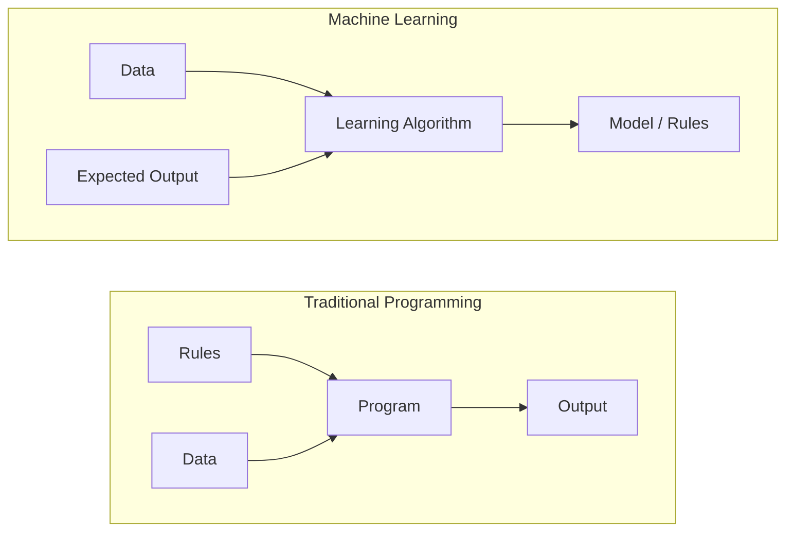
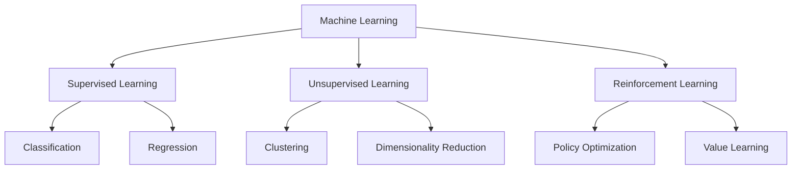
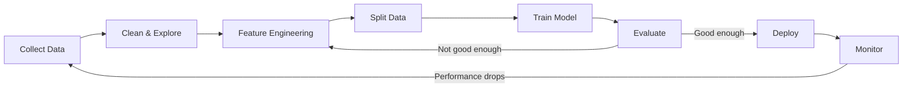
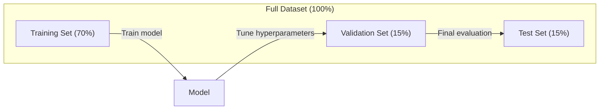
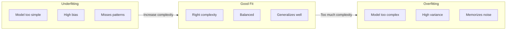
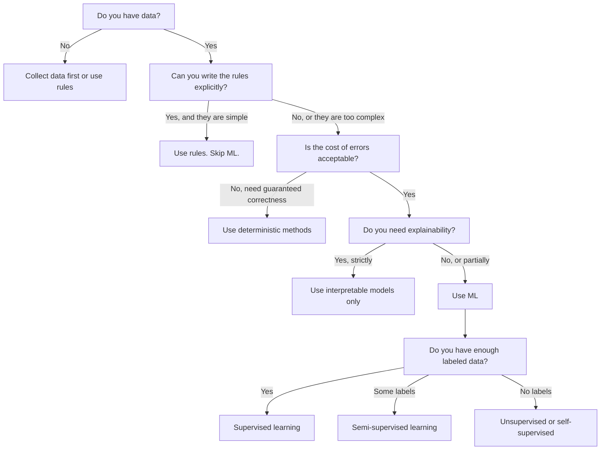

# 什么是 Machine Learning

> Machine Learning 是教会计算机在数据中寻找模式，而不是手写规则。

**类型：** 学习
**语言：** Python
**先修要求：** Phase 1 (Math Foundations)
**时间：** 约 45 分钟

## 学习目标

- 解释 supervised、unsupervised 和 reinforcement learning 的区别，并判断给定问题适用哪一种类型
- 从零实现 nearest centroid classifier，并用 random baseline 对其进行评估
- 区分 Classification 和 Regression 任务，并为每种任务选择合适的 Loss Function
- 评估给定业务问题是否适合使用 ML，还是更适合用确定性规则解决

## 问题

你想构建一个垃圾邮件过滤器。传统做法是：坐下来写几百条规则。“如果邮件包含 'FREE MONEY'，标记为垃圾邮件。如果它有超过 3 个感叹号，标记为垃圾邮件。”你花了几周写规则。然后垃圾邮件发送者改变措辞。你的规则失效了。你再写更多规则。这个循环永无止境。

Machine Learning 改变了这个方式。你不再写规则，而是给计算机数千封带标签的邮件（“spam” 或 “not spam”），让它自己找出规则。计算机会发现你从未想到过的模式。当垃圾邮件发送者改变策略时，你用新数据重新训练，而不是重写代码。

这种从“编写规则”到“从数据中学习”的转变，是 Machine Learning 的核心。每个推荐引擎、语音助手、自动驾驶汽车和语言模型都以这种方式工作。

## 概念

### 从数据中学习，而不是从规则中学习

传统编程和 Machine Learning 以相反的方向解决问题。



传统编程：你编写规则。程序把规则应用到数据上并产生输出。

Machine Learning：你提供数据和期望输出。算法发现规则。

训练得到的 “model” 本身就是规则，以数字形式编码（weights、parameters）。它从见过的样本中 generalize，从而对从未见过的数据做出预测。

### Machine Learning 的三种类型



**Supervised Learning**：你有 input-output pair。model 学习把输入映射到输出。
- “这里有 10,000 张标注为猫或狗的照片。学会区分它们。”
- “这里有房屋特征和价格。学会预测价格。”

**Unsupervised Learning**：你只有输入。没有 label。model 自己寻找结构。
- “这里有 10,000 条客户购买历史。找出自然分组。”
- “这里有 1,000 维的数据点。在保留结构的同时降到 2 维。”

**Reinforcement Learning**：agent 在环境中采取动作，并获得 reward 或 penalty。它学习一种 strategy（policy），以最大化总 reward。
- “玩这个游戏。赢了 +1，输了 -1。找出策略。”
- “控制这个机器人手臂。拿起物体 +1，每浪费一秒 -0.01。”

你在实践中构建的大多数内容都会使用 Supervised Learning。Unsupervised Learning 常用于预处理和探索。Reinforcement Learning 支撑游戏 AI、机器人技术，以及语言模型中的 RLHF。

### 超越三大类型

上面的三类很清晰，但真实世界的 ML 经常会模糊边界。

**Semi-supervised learning** 使用一小部分 labeled data 和大量 unlabeled data。你可能有 100 张带标签的医学图像和 100,000 张未标注图像。技术包括：

- **Label propagation：** 构建一个连接相似数据点的 graph。label 通过 graph 从 labeled node 传播到 unlabeled neighbor。
- **Pseudo-labeling：** 在 labeled data 上训练 model，用它预测 unlabeled data 的 label，然后在全部数据上重新训练。model 会 bootstrap 自己的训练集。
- **Consistency regularization：** 对于一个输入和它的轻微扰动版本，model 应该给出相同预测。即使没有 label，这也能工作。

**Self-supervised learning** 从数据本身创建 supervision。完全不需要人工 label。model 根据数据结构创建自己的预测任务。

- **Masked language modeling (BERT)：** 隐藏句子中 15% 的词，训练 model 预测缺失的词。“label” 来自原始文本。
- **Contrastive learning (SimCLR)：** 取一张图像，创建两个增强版本。训练 model 识别它们来自同一张图像，同时将它们与其他图像的增强版本区分开。
- **Next-token prediction (GPT)：** 给定前面的所有词，预测下一个词。每个文本文档都会成为一个训练样本。

这些并不是独立于三大类型之外的类别。它们是结合 supervised 和 unsupervised 思路的策略。Self-supervised learning 在技术上属于 supervised（model 在预测某个东西），但 label 是自动生成的，不是人类标注的。

### Classification vs Regression

这是两个主要的 Supervised Learning 任务。

| 方面 | Classification | Regression |
|--------|---------------|------------|
| 输出 | 离散类别 | 连续数值 |
| 示例 | “这封邮件是垃圾邮件吗？” | “房价会是多少？” |
| 输出空间 | {cat, dog, bird} | 任意实数 |
| Loss Function | Cross-entropy, accuracy | Mean squared error, MAE |
| 决策 | 类别之间的边界 | 拟合数据的曲线 |

Classification 回答“属于哪个类别？”Regression 回答“多少？”

有些问题可以用两种方式表达。预测股票上涨还是下跌是 Classification。预测精确价格是 Regression。

### ML 工作流

每个 Machine Learning 项目都遵循同一条 pipeline，无论使用什么算法。



**Collect Data**：收集原始数据。更多数据几乎总是更好，但质量比数量更重要。

**Clean & Explore**：处理缺失值、删除重复项、可视化分布、发现异常。这个步骤通常会占项目总时间的 60-80%。

**Feature Engineering**：把原始数据转换成 model 可使用的 feature。把日期转换为星期几。归一化数值列。编码 categorical variable。好的 feature 比花哨的算法更重要。

**Split Data**：划分为 training、validation 和 test set。model 在 training data 上训练，你在 validation data 上调 hyperparameter，并在 test data 上报告最终 performance。

**Train Model**：把 training data 输入算法。算法调整内部 parameter，以最小化 Loss Function。

**Evaluate**：在 validation/test data 上衡量 performance。如果 performance 不可接受，就回去尝试不同的 feature、算法或 hyperparameter。

**Deploy**：把 model 放入生产环境，让它对新数据进行预测。

**Monitor**：持续跟踪 performance。数据分布会变化（data drift），model 会退化。当 performance 下降时，重新训练。

### Training、Validation 和 Test 划分

这是初学者最容易弄错的关键概念。你必须在训练期间从未见过的数据上评估 model。否则你衡量的是记忆，而不是学习。



| 划分 | 目的 | 使用时机 | 典型大小 |
|-------|---------|-----------|-------------|
| Training | model 从这些数据中学习 | 训练期间 | 60-80% |
| Validation | 调整 hyperparameter、比较 model | 每次训练运行之后 | 10-20% |
| Test | 最终无偏 performance 估计 | 只在最后使用一次 | 10-20% |

test set 是神圣的。你只能看它一次。如果你不断根据 test performance 调整 model，你实际上是在 test set 上训练，你报告的数字也就没有意义。

对于小数据集，使用 k-fold cross-validation：把数据分成 k 份，在 k-1 份上训练，在剩余 1 份上验证，轮换进行，并对结果取平均。

### Overfitting vs Underfitting



**Underfitting**：model 太简单，无法捕捉数据中的模式。就像用一条直线去拟合弯曲关系。training error 高。test error 也高。

**Overfitting**：model 太复杂，记住了 training data，包括其中的 noise。就像一条穿过每个训练点的弯曲曲线，但在新数据上失败。training error 低。test error 高。

**Good fit**：model 捕捉真实模式，而不记忆 noise。training error 和 test error 都相对较低。

Overfitting 的迹象：
- Training accuracy 远高于 validation accuracy
- model 在 training data 上表现良好，但在新数据上表现很差
- 增加更多 training data 会提升 performance（model 原本是在记忆，而不是学习）

修复 overfitting：
- 获取更多 training data
- 降低 model complexity（更少 parameter、更简单 architecture）
- Regularization（对较大的 weight 添加惩罚）
- Dropout（训练期间随机将 neuron 置零）
- Early stopping（当 validation error 开始上升时停止训练）

修复 underfitting：
- 使用更复杂的 model
- 添加更多 feature
- 降低 regularization
- 训练更久

### Bias-Variance Tradeoff

这是 overfitting 和 underfitting 背后的数学框架。

**Bias**：来自 model 错误假设的 error。当真实关系是非线性时，linear model 会有 high bias。high bias 会导致 underfitting。

**Variance**：来自 training data 中微小波动敏感性的 error。high variance 的 model 在不同数据子集上训练时，会给出非常不同的预测。high variance 会导致 overfitting。

| Model complexity | Bias | Variance | 结果 |
|-----------------|------|----------|--------|
| 过低（用 linear model 拟合弯曲数据） | High | Low | Underfitting |
| 刚好合适 | Medium | Medium | 良好的 generalization |
| 过高（用 degree-20 polynomial 拟合 10 个点） | Low | High | Overfitting |

总 error = Bias^2 + Variance + 不可约 noise

你无法降低 irreducible noise（它是数据本身的随机性）。你要找到让 bias^2 + variance 最小的最佳点。

### No Free Lunch Theorem

不存在一个对所有问题都最优的单一算法。在某一类问题上表现良好的算法，在另一类问题上可能表现很差。这就是为什么 data scientist 会尝试多个算法并比较结果。

实践中，选择取决于：
- 你有多少数据
- 有多少 feature
- 关系是 linear 还是 nonlinear
- 是否需要 interpretability
- 你能负担多少计算资源

### 什么时候不要使用 Machine Learning

ML 很强大，但并不总是正确工具。在使用 model 之前，先问问自己是否真的需要它。

**不要在以下情况下使用 ML：**

- **规则简单且定义明确。** 税费计算、排序算法、单位转换。如果你能用几个 if-statement 写出逻辑，model 只会增加复杂度，而没有收益。
- **你没有数据或数据很少。** ML 需要从样本中学习。只有 10 个数据点时，无法训练出有意义的东西。先收集数据。
- **错误成本是灾难性的，并且你需要保证正确性。** 医疗剂量计算、核反应堆控制、密码学验证。ML model 是概率性的。它们有时会错。如果“有时会错”不可接受，就使用确定性方法。
- **lookup table 或 heuristic 可以解决问题。** 如果一个简单 threshold 或 table 覆盖了 99% 的情况，添加 ML 会增加维护成本，却没有有意义的改进。
- **你无法解释决策，而 explainability 又是必需的。** 受监管行业（借贷、保险、刑事司法）有时要求每个决策都能被完整解释。有些 ML model 是 interpretable 的（linear regression、小型 decision tree）。大多数不是。
- **问题变化得比你重新训练还快。** 如果规则每天变化，而重新训练需要一周，model 就总是过时的。

使用这个决策 flowchart：



```figure
f3-learning-boundary
```

## 构建它

`code/ml_intro.py` 中的代码从零实现了一个 nearest centroid classifier，这是最简单的 ML 算法。它展示了核心思想：从数据中学习，然后对新数据进行预测。

### 步骤 1：从零实现 Nearest Centroid Classifier

nearest centroid classifier 会计算 training data 中每个 class 的中心（mean）。预测时，它会把每个新点分配给距离最近的中心所属的 class。

```python
class NearestCentroid:
    def fit(self, X, y):
        self.classes = np.unique(y)
        self.centroids = np.array([
            X[y == c].mean(axis=0) for c in self.classes
        ])

    def predict(self, X):
        distances = np.array([
            np.sqrt(((X - c) ** 2).sum(axis=1))
            for c in self.centroids
        ])
        return self.classes[distances.argmin(axis=0)]
```

这就是整个算法。Fit 计算两个 mean。Predict 计算 distance。没有 Gradient Descent，没有 iteration，没有 hyperparameter。

### 步骤 2：在 Synthetic Data 上训练

我们生成一个 2D classification dataset，其中两个 class 有轻微重叠。centroid classifier 会在 class center 之间画出一条 linear decision boundary。

```python
rng = np.random.RandomState(42)
X_class0 = rng.randn(100, 2) + np.array([1.0, 1.0])
X_class1 = rng.randn(100, 2) + np.array([-1.0, -1.0])
X = np.vstack([X_class0, X_class1])
y = np.array([0] * 100 + [1] * 100)
```

### 步骤 3：与 Baseline 比较

每个 ML model 都应该与一个 trivial baseline 比较。这里的 baseline 会随机预测一个 class。如果你的 ML model 不能超过随机猜测，那就说明有问题。

```python
baseline_preds = rng.choice([0, 1], size=len(y_test))
baseline_acc = np.mean(baseline_preds == y_test)
```

在这个干净的数据集上，centroid classifier 应该能达到约 90%+ accuracy。random baseline 大约是 50%。

### 为什么这很重要

nearest centroid classifier 极其简单。它没有 hyperparameter，没有 iteration，没有 Gradient Descent。但它捕捉了基本的 ML 模式：

1. 从 training data 中**学习**一种表示（centroids）
2. 使用该表示对新数据进行**预测**（nearest distance）
3. 与 baseline 进行**评估**（随机猜测）

每个 ML 算法，从 logistic regression 到 transformers，都遵循同样的三步模式。表示会变得更复杂，但工作流保持不变。

### 步骤 4：Centroid Classifier 做不到什么

nearest centroid classifier 假设每个 class 都形成一个单一 blob。它画出的是 linear decision boundary。它在以下情况下会失败：

- class 有多个 cluster（例如数字 “1” 可以用几种不同方式书写）
- decision boundary 是 nonlinear（例如一个 class 包围另一个 class）
- feature 的 scale 差异很大（distance 被最大 scale 的 feature 主导）

这些限制引出了你将学习的其他所有算法。K-nearest neighbors 可以处理多个 cluster。Decision tree 可以处理 nonlinear boundary。Feature scaling 可以修复 scale 问题。每一课都建立在上一课的限制之上。

## 使用它

sklearn 提供 `NearestCentroid` 和 synthetic data generator：

```python
from sklearn.neighbors import NearestCentroid
from sklearn.datasets import make_classification
from sklearn.model_selection import train_test_split

X, y = make_classification(
    n_samples=500, n_features=2, n_redundant=0,
    n_clusters_per_class=1, random_state=42
)
X_train, X_test, y_train, y_test = train_test_split(X, y, test_size=0.3)

clf = NearestCentroid()
clf.fit(X_train, y_train)
print(f"Accuracy: {clf.score(X_test, y_test):.3f}")
```

## 交付它

本课会生成 `outputs/prompt-ml-problem-framer.md`，这是一个 prompt，可以把模糊的业务问题转换成具体的 ML 任务。给它一个问题描述（“we want to reduce churn” 或 “predict demand for next quarter”），它会识别 learning type，定义 prediction target，列出 candidate feature，选择 success metric，建立 baseline，并标记 data leakage 或 class imbalance 等陷阱。在任何 ML 项目开始时使用它，以避免构建错误的东西。

## 关键术语

| 术语 | 人们常说 | 实际含义 |
|------|----------------|----------------------|
| Model | “The AI” | 一个带有可学习 parameter 的数学函数，用于把输入映射到输出 |
| Training | “Teaching the AI” | 运行 optimization algorithm 来调整 model parameter，使预测匹配已知输出 |
| Feature | “An input column” | 数据中可测量的属性，model 用它进行预测 |
| Label | “The answer” | training example 的已知输出，用于计算 error signal |
| Hyperparameter | “A setting you tweak” | 训练前设置的 parameter，用于控制学习过程（learning rate、layer 数量） |
| Loss Function | “How wrong the model is” | 衡量预测输出与实际输出之间差距的函数，训练会尝试将其最小化 |
| Overfitting | “It memorized the test” | model 学到了 training-specific noise，而不是通用模式，因此在新数据上失败 |
| Underfitting | “It didn't learn anything” | model 太简单，无法捕捉数据中的真实模式 |
| Generalization | “It works on new data” | model 对未训练过的数据做出准确预测的能力 |
| Cross-validation | “Testing on different chunks” | 反复把数据拆分为 train/test fold 并对结果取平均，从而得到更稳健的 performance 估计 |
| Regularization | “Keeping weights small” | 向 Loss Function 添加 penalty term，以抑制过于复杂的 model |
| Data drift | “The world changed” | 传入数据的统计分布随时间发生变化，导致 model performance 下降 |

## 练习

1. 选择任意 dataset（例如 Iris、Titanic）。按 70/15/15 拆分为 train/validation/test。解释为什么不应该在 test set 上调整 hyperparameter。
2. 列出三个真实世界问题。对每个问题，判断它是 Classification、Regression 还是 Clustering，以及它是 supervised 还是 unsupervised。
3. 一个 model 在 training data 上达到 99% accuracy，但在 test data 上只有 60%。诊断问题，并列出你会尝试的三种修复方法。

## 延伸阅读

- [An Introduction to Statistical Learning](https://www.statlearning.com/) - 免费教材，覆盖所有经典 ML 方法，并配有实践示例
- [Google's Machine Learning Crash Course](https://developers.google.com/machine-learning/crash-course) - 对 ML 概念的简明可视化介绍
- [Scikit-learn User Guide](https://scikit-learn.org/stable/user_guide.html) - 在 Python 中实现 ML 的实用参考
