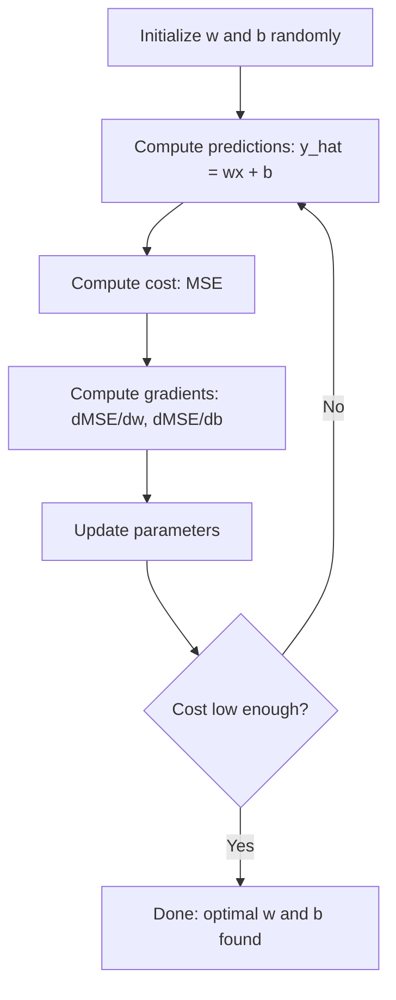

# Linear Regression

> Linear regression 会在你的数据中画出最佳直线。它是 machine learning 的 “hello world”。

**Type:** Build
**Languages:** Python
**Prerequisites:** Phase 1 (Linear Algebra, Calculus, Optimization), Phase 2 Lesson 1
**Time:** ~90 minutes

## 学习目标

- 推导 mean squared error 的 Gradient Descent 更新规则，并从零实现 linear regression
- 从计算复杂度和适用场景角度比较 Gradient Descent 与 normal equation
- 构建带 feature standardization 的 multiple linear regression model，并解释学到的 weights
- 解释 Ridge regression (L2 regularization) 如何通过惩罚较大的 weights 来防止 overfitting

## 问题

你有一组数据：房屋面积及其成交价格。你想根据新房子的面积预测价格。你可以在 scatter plot 上凭眼睛估计，但你需要一个公式。你需要一条最贴合数据的直线，这样就能输入任意面积并得到价格预测。

Linear regression 会给你这条线。更重要的是，它引入了完整的 ML training loop：定义 model、定义 cost function、优化 parameters。每个 ML algorithm 都遵循同样的模式。在最简单的案例中掌握它，你就会在各处识别出这个模式。

这不只适用于简单问题。Linear regression 在 production systems 中用于 demand forecasting、A/B test analysis、financial modeling，并且是每个 regression task 的 baseline。

## 概念

### Model

Linear regression 假设 input (x) 与 output (y) 之间存在线性关系：

```
y = wx + b
```

- `w` (weight/slope)：当 x 增加 1 时，y 改变多少
- `b` (bias/intercept)：当 x = 0 时，y 的值

对于多个 inputs (features)，它扩展为：

```
y = w1*x1 + w2*x2 + ... + wn*xn + b
```

或写成 Vector 形式：`y = w^T * x + b`

目标：找到 w 和 b 的值，使预测的 y 在所有 training examples 上尽可能接近真实的 y。

### Cost Function (Mean Squared Error)

如何衡量“尽可能接近”？你需要一个单一数字来表示预测有多错。最常见的选择是 Mean Squared Error (MSE)：

```
MSE = (1/n) * sum((y_predicted - y_actual)^2)
```

为什么要平方？有两个原因。第一，它对大误差的惩罚高于小误差（误差 10 比误差 1 糟糕 100 倍，而不是 10 倍）。第二，平方函数处处平滑且可微，这让优化变得直接。

Cost function 会形成一个曲面。对于单个 weight w 和 bias b，MSE 曲面看起来像一个碗（凸抛物面）。碗底就是 MSE 最小的位置。Training 就是找到这个底部。

### Gradient Descent

Gradient Descent 通过不断向下迈步来找到碗底。



Gradients 会告诉你两件事：每个 parameter 应该朝哪个方向移动，以及移动多少。

对于 y_hat = wx + b 的 MSE：

```
dMSE/dw = (2/n) * sum((y_hat - y) * x)
dMSE/db = (2/n) * sum(y_hat - y)
```

更新规则：

```
w = w - learning_rate * dMSE/dw
b = b - learning_rate * dMSE/db
```

learning rate 控制步长。太大：会越过最小值并发散。太小：training 会耗时很久。典型起始值：0.01、0.001 或 0.0001。

### Normal Equation（闭式解）

专门对于 linear regression，有一个直接公式可以在没有任何迭代的情况下给出最优 weights：

```
w = (X^T * X)^(-1) * X^T * y
```

它通过求逆 Matrix，一步解出 w。它非常适合小数据集。对于大数据集（数百万行或数千个 features），更推荐 Gradient Descent，因为 Matrix inversion 在 feature 数量上的复杂度是 O(n^3)。

### Multiple Linear Regression

对于多个 features，model 变为：

```
y = w1*x1 + w2*x2 + ... + wn*xn + b
```

一切工作方式相同：MSE 是 cost function，Gradient Descent 同时更新所有 weights。唯一的区别是你拟合的是一个 hyperplane，而不是一条线。

Feature scaling 在这里很重要。如果一个 feature 的范围是 0 到 1，另一个是 0 到 1,000,000，Gradient Descent 会很难收敛，因为 cost surface 会变得拉长。Training 之前要 standardize features（减去 mean，除以 standard deviation）。

### Polynomial Regression

如果关系不是线性的怎么办？你仍然可以通过创建 polynomial features 来使用 linear regression：

```
y = w1*x + w2*x^2 + w3*x^3 + b
```

这仍然是 “linear” regression，因为 model 对 weights (w1, w2, w3) 是线性的。你只是使用了 x 的 nonlinear features。

更高阶的 polynomials 可以拟合更复杂的曲线，但也有 overfitting 风险。degree-10 polynomial 会穿过 10 点数据集中的每一个点，但在新数据上预测很差。

### R-Squared Score

MSE 告诉你错得有多离谱，但这个数字取决于 y 的尺度。R-squared (R^2) 提供了一个不依赖尺度的衡量指标：

```
R^2 = 1 - (sum of squared residuals) / (sum of squared deviations from mean)
    = 1 - SS_res / SS_tot
```

- R^2 = 1.0：完美预测
- R^2 = 0.0：model 并不比每次都预测 mean 更好
- R^2 < 0.0：model 比预测 mean 更差

### Regularization 预览 (Ridge Regression)

当你有很多 features 时，model 可能会通过分配较大的 weights 来 overfit。Ridge regression (L2 regularization) 会加入一个惩罚项：

```
Cost = MSE + lambda * sum(w_i^2)
```

惩罚项会抑制较大的 weights。hyperparameter lambda 控制权衡：lambda 越高，weights 越小，regularization 越强。后续课程会深入讲解这一点。现在只需要知道它存在，以及它为什么有帮助。

## 构建

### 步骤 1：生成示例数据

```python
import random
import math

random.seed(42)

TRUE_W = 3.0
TRUE_B = 7.0
N_SAMPLES = 100

X = [random.uniform(0, 10) for _ in range(N_SAMPLES)]
y = [TRUE_W * x + TRUE_B + random.gauss(0, 2.0) for x in X]

print(f"Generated {N_SAMPLES} samples")
print(f"True relationship: y = {TRUE_W}x + {TRUE_B} (+ noise)")
print(f"First 5 points: {[(round(X[i], 2), round(y[i], 2)) for i in range(5)]}")
```

### 步骤 2：使用 Gradient Descent 从零实现 linear regression

```python
class LinearRegression:
    def __init__(self, learning_rate=0.01):
        self.w = 0.0
        self.b = 0.0
        self.lr = learning_rate
        self.cost_history = []

    def predict(self, X):
        return [self.w * x + self.b for x in X]

    def compute_cost(self, X, y):
        predictions = self.predict(X)
        n = len(y)
        cost = sum((pred - actual) ** 2 for pred, actual in zip(predictions, y)) / n
        return cost

    def compute_gradients(self, X, y):
        predictions = self.predict(X)
        n = len(y)
        dw = (2 / n) * sum((pred - actual) * x for pred, actual, x in zip(predictions, y, X))
        db = (2 / n) * sum(pred - actual for pred, actual in zip(predictions, y))
        return dw, db

    def fit(self, X, y, epochs=1000, print_every=200):
        for epoch in range(epochs):
            dw, db = self.compute_gradients(X, y)
            self.w -= self.lr * dw
            self.b -= self.lr * db
            cost = self.compute_cost(X, y)
            self.cost_history.append(cost)
            if epoch % print_every == 0:
                print(f"  Epoch {epoch:4d} | Cost: {cost:.4f} | w: {self.w:.4f} | b: {self.b:.4f}")
        return self

    def r_squared(self, X, y):
        predictions = self.predict(X)
        y_mean = sum(y) / len(y)
        ss_res = sum((actual - pred) ** 2 for actual, pred in zip(y, predictions))
        ss_tot = sum((actual - y_mean) ** 2 for actual in y)
        return 1 - (ss_res / ss_tot)


print("=== Training Linear Regression (Gradient Descent) ===")
model = LinearRegression(learning_rate=0.005)
model.fit(X, y, epochs=1000, print_every=200)
print(f"\nLearned: y = {model.w:.4f}x + {model.b:.4f}")
print(f"True:    y = {TRUE_W}x + {TRUE_B}")
print(f"R-squared: {model.r_squared(X, y):.4f}")
```

### 步骤 3：Normal equation（闭式解）

```python
class LinearRegressionNormal:
    def __init__(self):
        self.w = 0.0
        self.b = 0.0

    def fit(self, X, y):
        n = len(X)
        x_mean = sum(X) / n
        y_mean = sum(y) / n
        numerator = sum((X[i] - x_mean) * (y[i] - y_mean) for i in range(n))
        denominator = sum((X[i] - x_mean) ** 2 for i in range(n))
        self.w = numerator / denominator
        self.b = y_mean - self.w * x_mean
        return self

    def predict(self, X):
        return [self.w * x + self.b for x in X]

    def r_squared(self, X, y):
        predictions = self.predict(X)
        y_mean = sum(y) / len(y)
        ss_res = sum((actual - pred) ** 2 for actual, pred in zip(y, predictions))
        ss_tot = sum((actual - y_mean) ** 2 for actual in y)
        return 1 - (ss_res / ss_tot)


print("\n=== Normal Equation (Closed-Form) ===")
model_normal = LinearRegressionNormal()
model_normal.fit(X, y)
print(f"Learned: y = {model_normal.w:.4f}x + {model_normal.b:.4f}")
print(f"R-squared: {model_normal.r_squared(X, y):.4f}")
```

### 步骤 4：Multiple linear regression

```python
class MultipleLinearRegression:
    def __init__(self, n_features, learning_rate=0.01):
        self.weights = [0.0] * n_features
        self.bias = 0.0
        self.lr = learning_rate
        self.cost_history = []

    def predict_single(self, x):
        return sum(w * xi for w, xi in zip(self.weights, x)) + self.bias

    def predict(self, X):
        return [self.predict_single(x) for x in X]

    def compute_cost(self, X, y):
        predictions = self.predict(X)
        n = len(y)
        return sum((pred - actual) ** 2 for pred, actual in zip(predictions, y)) / n

    def fit(self, X, y, epochs=1000, print_every=200):
        n = len(y)
        n_features = len(X[0])
        for epoch in range(epochs):
            predictions = self.predict(X)
            errors = [pred - actual for pred, actual in zip(predictions, y)]
            for j in range(n_features):
                grad = (2 / n) * sum(errors[i] * X[i][j] for i in range(n))
                self.weights[j] -= self.lr * grad
            grad_b = (2 / n) * sum(errors)
            self.bias -= self.lr * grad_b
            cost = self.compute_cost(X, y)
            self.cost_history.append(cost)
            if epoch % print_every == 0:
                print(f"  Epoch {epoch:4d} | Cost: {cost:.4f}")
        return self

    def r_squared(self, X, y):
        predictions = self.predict(X)
        y_mean = sum(y) / len(y)
        ss_res = sum((actual - pred) ** 2 for actual, pred in zip(y, predictions))
        ss_tot = sum((actual - y_mean) ** 2 for actual in y)
        return 1 - (ss_res / ss_tot)


random.seed(42)
N = 100
X_multi = []
y_multi = []
for _ in range(N):
    size = random.uniform(500, 3000)
    bedrooms = random.randint(1, 5)
    age = random.uniform(0, 50)
    price = 50 * size + 10000 * bedrooms - 1000 * age + 50000 + random.gauss(0, 20000)
    X_multi.append([size, bedrooms, age])
    y_multi.append(price)


def standardize(X):
    n_features = len(X[0])
    means = [sum(X[i][j] for i in range(len(X))) / len(X) for j in range(n_features)]
    stds = []
    for j in range(n_features):
        variance = sum((X[i][j] - means[j]) ** 2 for i in range(len(X))) / len(X)
        stds.append(variance ** 0.5)
    X_scaled = []
    for i in range(len(X)):
        row = [(X[i][j] - means[j]) / stds[j] if stds[j] > 0 else 0 for j in range(n_features)]
        X_scaled.append(row)
    return X_scaled, means, stds


y_mean_val = sum(y_multi) / len(y_multi)
y_std_val = (sum((yi - y_mean_val) ** 2 for yi in y_multi) / len(y_multi)) ** 0.5
y_scaled = [(yi - y_mean_val) / y_std_val for yi in y_multi]

X_scaled, x_means, x_stds = standardize(X_multi)

print("\n=== Multiple Linear Regression (3 features) ===")
print("Features: house size, bedrooms, age")
multi_model = MultipleLinearRegression(n_features=3, learning_rate=0.01)
multi_model.fit(X_scaled, y_scaled, epochs=1000, print_every=200)

print(f"\nWeights (standardized): {[round(w, 4) for w in multi_model.weights]}")
print(f"Bias (standardized): {multi_model.bias:.4f}")
print(f"R-squared: {multi_model.r_squared(X_scaled, y_scaled):.4f}")
```

### 步骤 5：Polynomial regression

```python
class PolynomialRegression:
    def __init__(self, degree, learning_rate=0.01):
        self.degree = degree
        self.weights = [0.0] * degree
        self.bias = 0.0
        self.lr = learning_rate

    def make_features(self, X):
        return [[x ** (d + 1) for d in range(self.degree)] for x in X]

    def predict(self, X):
        features = self.make_features(X)
        return [sum(w * f for w, f in zip(self.weights, row)) + self.bias for row in features]

    def fit(self, X, y, epochs=1000, print_every=200):
        features = self.make_features(X)
        n = len(y)
        for epoch in range(epochs):
            predictions = [sum(w * f for w, f in zip(self.weights, row)) + self.bias for row in features]
            errors = [pred - actual for pred, actual in zip(predictions, y)]
            for j in range(self.degree):
                grad = (2 / n) * sum(errors[i] * features[i][j] for i in range(n))
                self.weights[j] -= self.lr * grad
            grad_b = (2 / n) * sum(errors)
            self.bias -= self.lr * grad_b
            if epoch % print_every == 0:
                cost = sum(e ** 2 for e in errors) / n
                print(f"  Epoch {epoch:4d} | Cost: {cost:.6f}")
        return self

    def r_squared(self, X, y):
        predictions = self.predict(X)
        y_mean = sum(y) / len(y)
        ss_res = sum((actual - pred) ** 2 for actual, pred in zip(y, predictions))
        ss_tot = sum((actual - y_mean) ** 2 for actual in y)
        return 1 - (ss_res / ss_tot)


random.seed(42)
X_poly = [x / 10.0 for x in range(0, 50)]
y_poly = [0.5 * x ** 2 - 2 * x + 3 + random.gauss(0, 1.0) for x in X_poly]

x_max = max(abs(x) for x in X_poly)
X_poly_norm = [x / x_max for x in X_poly]
y_poly_mean = sum(y_poly) / len(y_poly)
y_poly_std = (sum((yi - y_poly_mean) ** 2 for yi in y_poly) / len(y_poly)) ** 0.5
y_poly_norm = [(yi - y_poly_mean) / y_poly_std for yi in y_poly]

print("\n=== Polynomial Regression (degree 2 vs degree 5) ===")
print("True relationship: y = 0.5x^2 - 2x + 3")

print("\nDegree 2:")
poly2 = PolynomialRegression(degree=2, learning_rate=0.1)
poly2.fit(X_poly_norm, y_poly_norm, epochs=2000, print_every=500)
print(f"  R-squared: {poly2.r_squared(X_poly_norm, y_poly_norm):.4f}")

print("\nDegree 5:")
poly5 = PolynomialRegression(degree=5, learning_rate=0.1)
poly5.fit(X_poly_norm, y_poly_norm, epochs=2000, print_every=500)
print(f"  R-squared: {poly5.r_squared(X_poly_norm, y_poly_norm):.4f}")

print("\nDegree 2 fits the true curve well. Degree 5 fits training data slightly better")
print("but risks overfitting on new data.")
```

### 步骤 6：Ridge regression (L2 regularization)

```python
class RidgeRegression:
    def __init__(self, n_features, learning_rate=0.01, alpha=1.0):
        self.weights = [0.0] * n_features
        self.bias = 0.0
        self.lr = learning_rate
        self.alpha = alpha

    def predict_single(self, x):
        return sum(w * xi for w, xi in zip(self.weights, x)) + self.bias

    def predict(self, X):
        return [self.predict_single(x) for x in X]

    def fit(self, X, y, epochs=1000, print_every=200):
        n = len(y)
        n_features = len(X[0])
        for epoch in range(epochs):
            predictions = self.predict(X)
            errors = [pred - actual for pred, actual in zip(predictions, y)]
            mse = sum(e ** 2 for e in errors) / n
            reg_term = self.alpha * sum(w ** 2 for w in self.weights)
            cost = mse + reg_term
            for j in range(n_features):
                grad = (2 / n) * sum(errors[i] * X[i][j] for i in range(n))
                grad += 2 * self.alpha * self.weights[j]
                self.weights[j] -= self.lr * grad
            grad_b = (2 / n) * sum(errors)
            self.bias -= self.lr * grad_b
            if epoch % print_every == 0:
                print(f"  Epoch {epoch:4d} | Cost: {cost:.4f} | L2 penalty: {reg_term:.4f}")
        return self


print("\n=== Ridge Regression (L2 Regularization) ===")
print("Same data as multiple regression, with alpha=0.1")
ridge = RidgeRegression(n_features=3, learning_rate=0.01, alpha=0.1)
ridge.fit(X_scaled, y_scaled, epochs=1000, print_every=200)
print(f"\nRidge weights: {[round(w, 4) for w in ridge.weights]}")
print(f"Plain weights: {[round(w, 4) for w in multi_model.weights]}")
print("Ridge weights are smaller (shrunk toward zero) due to the L2 penalty.")
```


```figure
linear-regression-fit
```

## 使用它

现在用 scikit-learn 做同样的事，这才是你在 production 中实际会使用的方式。

```python
from sklearn.linear_model import LinearRegression as SklearnLR
from sklearn.linear_model import Ridge
from sklearn.preprocessing import PolynomialFeatures, StandardScaler
from sklearn.model_selection import train_test_split
from sklearn.metrics import mean_squared_error, r2_score
import numpy as np

np.random.seed(42)
X_sk = np.random.uniform(0, 10, (100, 1))
y_sk = 3.0 * X_sk.squeeze() + 7.0 + np.random.normal(0, 2.0, 100)

X_train, X_test, y_train, y_test = train_test_split(X_sk, y_sk, test_size=0.2, random_state=42)

lr = SklearnLR()
lr.fit(X_train, y_train)
y_pred = lr.predict(X_test)

print("=== Scikit-learn Linear Regression ===")
print(f"Coefficient (w): {lr.coef_[0]:.4f}")
print(f"Intercept (b): {lr.intercept_:.4f}")
print(f"R-squared (test): {r2_score(y_test, y_pred):.4f}")
print(f"MSE (test): {mean_squared_error(y_test, y_pred):.4f}")

poly = PolynomialFeatures(degree=2, include_bias=False)
X_poly_sk = poly.fit_transform(X_train)
X_poly_test = poly.transform(X_test)

lr_poly = SklearnLR()
lr_poly.fit(X_poly_sk, y_train)
print(f"\nPolynomial degree 2 R-squared: {r2_score(y_test, lr_poly.predict(X_poly_test)):.4f}")

scaler = StandardScaler()
X_train_scaled = scaler.fit_transform(X_train)
X_test_scaled = scaler.transform(X_test)

ridge = Ridge(alpha=1.0)
ridge.fit(X_train_scaled, y_train)
print(f"Ridge R-squared: {r2_score(y_test, ridge.predict(X_test_scaled)):.4f}")
print(f"Ridge coefficient: {ridge.coef_[0]:.4f}")
```

你的 from-scratch 实现和 scikit-learn 会产生相同结果。区别在于：scikit-learn 会处理 edge cases、数值稳定性和性能优化。production 中使用库。from-scratch 版本用于理解背后发生了什么。

## 交付

本课会产出：
- `outputs/skill-regression.md` - 一个 skill，用于根据问题选择合适的 regression 方法

## 练习

1. 实现 batch gradient descent、stochastic gradient descent (SGD) 和 mini-batch gradient descent。在同一数据集上比较收敛速度。哪个收敛最快？哪个 cost curve 最平滑？
2. 从 cubic function (y = ax^3 + bx^2 + cx + d + noise) 生成数据。拟合 degree 1、3 和 10 的 polynomials。比较 training R^2 和 test R^2。到哪个 degree 时 overfitting 变得明显？
3. 实现 Lasso regression（L1 regularization：penalty = alpha * sum(|w_i|)）。在多 feature 房价数据上 training。比较哪些 weights 会变为零，以及与 Ridge 的区别。为什么 L1 会产生 sparse solutions，而 L2 不会？

## 关键术语

| Term | 人们常说 | 实际含义 |
|------|----------------|----------------------|
| Linear regression | “在数据中画一条线” | 找到 weight w 和 bias b，使 wx+b 与真实 y 值之间的平方差之和最小 |
| Cost function | “model 有多差” | 一个将 model parameters 映射为单一数字的函数，用于衡量 prediction error，并由 optimization 最小化 |
| Mean squared error | “平方误差的平均值” | (1/n) * (predicted - actual)^2 的求和，对大误差施加不成比例的惩罚 |
| Gradient descent | “往下坡走” | 使用偏导数，沿着降低 cost function 的方向迭代调整 parameters |
| Learning rate | “步长” | 控制每一步 Gradient Descent 中 parameters 改变量的标量 |
| Normal equation | “直接求解” | 闭式解 w = (X^T X)^-1 X^T y，无需迭代即可得到最优 weights |
| R-squared | “拟合有多好” | model 所解释的 y 方差比例，范围从负无穷到 1.0 |
| Feature scaling | “让 features 可比较” | 将 features 转换到相近范围（例如 zero mean、unit variance），使 Gradient Descent 更快收敛 |
| Regularization | “惩罚复杂度” | 向 cost function 添加一个会缩小 weights 的项，以防止 overfitting |
| Ridge regression | “L2 regularization” | 向 MSE 添加 lambda * sum(w_i^2) 惩罚项的 linear regression |
| Polynomial regression | “用线性数学拟合曲线” | 对 polynomial features (x, x^2, x^3, ...) 做 linear regression，对 weights 仍然是线性的 |
| Overfitting | “记住 training data” | 使用过于复杂的 model，以至于拟合了 training data 中的噪声，并在新数据上失效 |

## 延伸阅读

- [An Introduction to Statistical Learning (ISLR)](https://www.statlearning.com/) -- 免费 PDF，第 3 章和第 6 章涵盖 linear regression 与 regularization，并包含实用的 R 示例
- [The Elements of Statistical Learning (ESL)](https://hastie.su.domains/ElemStatLearn/) -- 免费 PDF，是 ISLR 更偏数学的配套读物，对 ridge 和 lasso 有更深入的处理
- [Stanford CS229 Lecture Notes on Linear Regression](https://cs229.stanford.edu/main_notes.pdf) -- Andrew Ng 的笔记，从第一性原理推导 normal equation 和 Gradient Descent
- [scikit-learn LinearRegression documentation](https://scikit-learn.org/stable/modules/linear_model.html) -- LinearRegression、Ridge、Lasso 和 ElasticNet 的实用参考，包含代码示例
