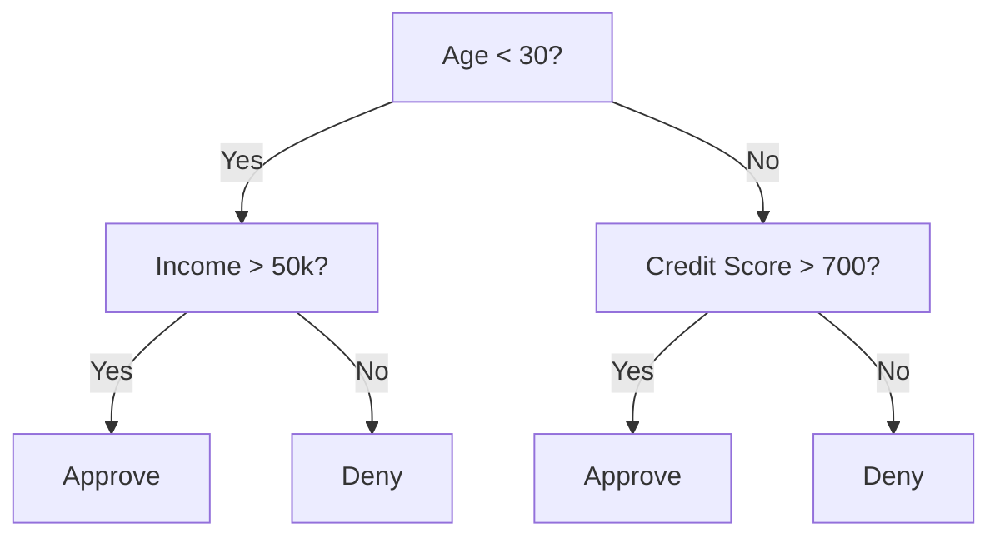
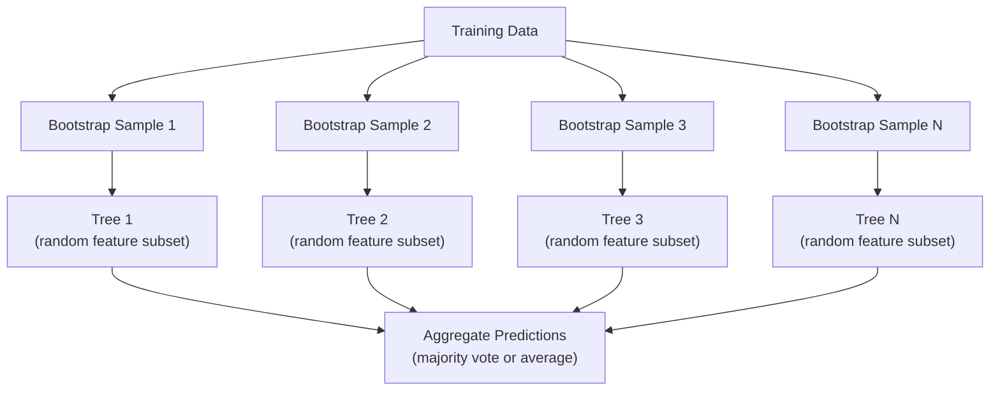

# Decision Trees 与 Random Forests

> Decision tree 只是一个流程图。但由许多 tree 组成的 forest，是 ML 中最强大的工具之一。

**类型：** Build
**语言：** Python
**先修要求：** Phase 1（Lessons 09 Information Theory, 06 Probability）
**时间：** 约 90 分钟

## 学习目标

- 实现 Gini impurity、entropy 和 information gain 计算，以找到最优的 decision tree split
- 从零构建一个 decision tree classifier，并加入 pre-pruning 控制（max depth、min samples）
- 使用 bootstrap sampling 和 feature randomization 构建 random forest，并解释它为什么能降低 variance
- 比较 MDI feature importance 与 permutation importance，并识别 MDI 何时存在 bias

## 问题

你有 tabular data。行是样本，列是 feature，还有一个你想预测的 target column。你可以直接上一个 Neural Network。但对于 tabular data，tree-based models（decision trees、random forests、gradient boosted trees）持续优于 Deep Learning。结构化数据上的 Kaggle 竞赛由 XGBoost 和 LightGBM 主导，而不是 Transformer。

为什么？Tree 无需 preprocessing 就能处理混合 feature 类型（numeric 和 categorical）。它们无需 feature engineering 就能处理 nonlinear relationships。它们具备 interpretability：你可以查看 tree，准确看到某个 prediction 是如何产生的。而 random forests 会对许多 trees 求平均，对中等规模 dataset 上的 overfitting 具有很强的抵抗力。

本课会使用 recursive splitting 从零构建 decision trees，然后在其上构建 random forest。你将实现 split criteria 背后的数学（Gini impurity、entropy、information gain），并理解为什么一组 weak learners 的 ensemble 会变成 strong learner。

## 核心概念

### Decision tree 做什么

Decision tree 通过提出一系列 yes/no 问题，把 feature space 划分为矩形区域。



每个 internal node 都会用一个 threshold 测试某个 feature。每个 leaf node 做出 prediction。要 classify 一个新的 data point，你从 root 开始，沿着 branches 前进，直到到达一个 leaf。

Tree 通过 top-down 方式构建：在每个 node，选择最能分离数据的 feature 和 threshold。“最优”由 split criterion 定义。

### Split criteria：衡量 impurity

在每个 node，我们有一组 samples。我们希望对它们进行 split，使生成的 child nodes 尽可能“pure”，也就是每个 child 主要包含一个 class。

**Gini impurity** 衡量的是：如果按照该 node 的 class distribution 给一个随机选择的 sample 贴 label，它被 misclassified 的概率。

```
Gini(S) = 1 - sum(p_k^2)

where p_k is the proportion of class k in set S.
```

对于 pure node（全部属于同一个 class），Gini = 0。对于 50/50 classes 的 binary split，Gini = 0.5。越低越好。

```
Example: 6 cats, 4 dogs

Gini = 1 - (0.6^2 + 0.4^2) = 1 - (0.36 + 0.16) = 0.48
```

**Entropy** 衡量 node 中的信息量（混乱程度）。Phase 1 Lesson 09 已覆盖。

```
Entropy(S) = -sum(p_k * log2(p_k))
```

对于 pure node，entropy = 0。对于 50/50 binary split，entropy = 1.0。越低越好。

```
Example: 6 cats, 4 dogs

Entropy = -(0.6 * log2(0.6) + 0.4 * log2(0.4))
        = -(0.6 * -0.737 + 0.4 * -1.322)
        = 0.442 + 0.529
        = 0.971 bits
```

**Information gain** 是 split 之后 impurity（entropy 或 Gini）的降低量。

```
IG(S, feature, threshold) = Impurity(S) - weighted_avg(Impurity(S_left), Impurity(S_right))

where the weights are the proportions of samples in each child.
```

每个 node 上的 greedy algorithm：尝试每个 feature 和每个可能的 threshold。选择使 information gain 最大的 `(feature, threshold)` 组合。

### Splitting 如何工作

对于当前 node 上包含 n 个 features、m 个 samples 的 dataset：

1. 对每个 feature j（j = 1 到 n）：
   - 按 feature j 对 samples 排序
   - 将相邻不同取值之间的每个 midpoint 作为 threshold 尝试
   - 计算每个 threshold 的 information gain
2. 选择 information gain 最高的 feature 和 threshold
3. 将数据 split 为 left（feature <= threshold）和 right（feature > threshold）
4. 对每个 child 递归执行

这种 greedy 方法不保证得到全局最优 tree。寻找最优 tree 是 NP-hard。但 greedy splitting 在实践中效果很好。

### 停止条件

如果没有停止条件，tree 会一直生长，直到每个 leaf 都是 pure（每个 leaf 一个 sample）。这会完美记住 training data，并且泛化极差。

**Pre-pruning** 会在 tree 完全长成之前停止：
- Maximum depth：当 tree 达到设定 depth 时停止 splitting
- Minimum samples per leaf：如果某个 node 的 samples 少于 k，则停止
- Minimum information gain：如果最佳 split 对 impurity 的改善小于某个 threshold，则停止
- Maximum leaf nodes：限制 leaves 的总数

**Post-pruning** 先生成完整 tree，然后再向回修剪：
- Cost-complexity pruning（scikit-learn 使用）：加入一个与 leaves 数量成正比的 penalty。增大 penalty 可得到更小的 trees
- Reduced error pruning：如果移除一个 subtree 不会增加 validation error，就移除它

Pre-pruning 更简单也更快。Post-pruning 通常能产生更好的 trees，因为它不会过早停止那些后续可能带来有用 split 的分支。

### 用于 Regression 的 decision trees

对于 Regression，leaf prediction 是该 leaf 中 target values 的均值。Split criterion 也会变化：

**Variance reduction** 替代 information gain：

```
VR(S, feature, threshold) = Var(S) - weighted_avg(Var(S_left), Var(S_right))
```

选择使 variance 降低最多的 split。Tree 会把 input space 划分为多个区域，并在每个区域中预测一个常数（均值）。

### Random forests：ensemble 的力量

单棵 decision tree 具有高 variance。数据中的微小变化可能产生完全不同的 trees。Random forests 通过对许多 trees 求平均来解决这个问题。



两种 randomness 让 trees 具有多样性：

**Bagging（bootstrap aggregating）：** 每棵 tree 都在一个 bootstrap sample 上训练，也就是从 training data 中进行有放回随机抽样得到的样本。每个 bootstrap 中大约会出现原始 samples 的 63%（其余是 out-of-bag samples，可用于 validation）。

**Feature randomization：** 在每次 split 时，只考虑一个随机 feature subset。对于 Classification，默认是 sqrt(n_features)。对于 Regression，是 n_features/3。这会防止所有 trees 都在同一个 dominant feature 上 split。

关键洞见：对许多 decorrelated trees 求平均，可以在不增加 bias 的情况下降低 variance。每棵单独的 tree 可能表现一般，但 ensemble 很强。

### Feature importance

Random forests 天然提供 feature importance scores。最常见的方法：

**Mean Decrease in Impurity (MDI)：** 对每个 feature，汇总所有 trees 中所有使用该 feature 的 nodes 带来的 impurity reduction 总量。在更早 splits 中带来更大 impurity reduction 的 features 更重要。

```
importance(feature_j) = sum over all nodes where feature_j is used:
    (n_samples_at_node / n_total_samples) * impurity_decrease
```

这种方法很快（训练期间即可计算），但会偏向 high-cardinality features 以及具有许多可能 split points 的 features。

**Permutation importance** 是另一种方法：打乱某个 feature 的 values，并衡量 model accuracy 下降了多少。它更可靠，但更慢。

### Tree 何时胜过 Neural Network

Trees 和 forests 在 tabular data 上通常胜过 Neural Networks。原因有几个：

| Factor | Trees | Neural networks |
|--------|-------|----------------|
| Mixed types (numeric + categorical) | 原生支持 | 需要 encoding |
| Small datasets (< 10k rows) | 表现良好 | 容易 overfit |
| Feature interactions | 通过 splitting 找到 | 需要 architecture design |
| Interpretability | 完全透明 | Black box |
| Training time | 分钟级 | 小时级 |
| Hyperparameter sensitivity | 低 | 高 |

当数据具有 spatial 或 sequential structure（images、text、audio）时，Neural Networks 更强。对于扁平 feature tables，trees 是默认选择。


```figure
decision-tree-depth
```

## 构建它

### 步骤 1：Gini impurity 和 entropy

从零构建这两种 split criteria，并验证它们对哪些 splits 是好 splits 的判断一致。

```python
import math

def gini_impurity(labels):
    n = len(labels)
    if n == 0:
        return 0.0
    counts = {}
    for label in labels:
        counts[label] = counts.get(label, 0) + 1
    return 1.0 - sum((c / n) ** 2 for c in counts.values())

def entropy(labels):
    n = len(labels)
    if n == 0:
        return 0.0
    counts = {}
    for label in labels:
        counts[label] = counts.get(label, 0) + 1
    return -sum(
        (c / n) * math.log2(c / n) for c in counts.values() if c > 0
    )
```

### 步骤 2：找到最佳 split

尝试每个 feature 和每个 threshold。返回 information gain 最高的那个。

```python
def information_gain(parent_labels, left_labels, right_labels, criterion="gini"):
    measure = gini_impurity if criterion == "gini" else entropy
    n = len(parent_labels)
    n_left = len(left_labels)
    n_right = len(right_labels)
    if n_left == 0 or n_right == 0:
        return 0.0
    parent_impurity = measure(parent_labels)
    child_impurity = (
        (n_left / n) * measure(left_labels) +
        (n_right / n) * measure(right_labels)
    )
    return parent_impurity - child_impurity
```

### 步骤 3：构建 DecisionTree class

Recursive splitting、prediction 和 feature importance tracking。

```python
class DecisionTree:
    def __init__(self, max_depth=None, min_samples_split=2,
                 min_samples_leaf=1, criterion="gini",
                 max_features=None):
        self.max_depth = max_depth
        self.min_samples_split = min_samples_split
        self.min_samples_leaf = min_samples_leaf
        self.criterion = criterion
        self.max_features = max_features
        self.tree = None
        self.feature_importances_ = None

    def fit(self, X, y):
        self.n_features = len(X[0])
        self.feature_importances_ = [0.0] * self.n_features
        self.n_samples = len(X)
        self.tree = self._build(X, y, depth=0)
        total = sum(self.feature_importances_)
        if total > 0:
            self.feature_importances_ = [
                fi / total for fi in self.feature_importances_
            ]

    def predict(self, X):
        return [self._predict_one(x, self.tree) for x in X]
```

### 步骤 4：构建 RandomForest class

Bootstrap sampling、feature randomization 和 majority voting。

```python
class RandomForest:
    def __init__(self, n_trees=100, max_depth=None,
                 min_samples_split=2, max_features="sqrt",
                 criterion="gini"):
        self.n_trees = n_trees
        self.max_depth = max_depth
        self.min_samples_split = min_samples_split
        self.max_features = max_features
        self.criterion = criterion
        self.trees = []

    def fit(self, X, y):
        n = len(X)
        for _ in range(self.n_trees):
            indices = [random.randint(0, n - 1) for _ in range(n)]
            X_boot = [X[i] for i in indices]
            y_boot = [y[i] for i in indices]
            tree = DecisionTree(
                max_depth=self.max_depth,
                min_samples_split=self.min_samples_split,
                max_features=self.max_features,
                criterion=self.criterion,
            )
            tree.fit(X_boot, y_boot)
            self.trees.append(tree)

    def predict(self, X):
        all_preds = [tree.predict(X) for tree in self.trees]
        predictions = []
        for i in range(len(X)):
            votes = {}
            for preds in all_preds:
                v = preds[i]
                votes[v] = votes.get(v, 0) + 1
            predictions.append(max(votes, key=votes.get))
        return predictions
```

完整实现及所有 helper methods 见 `code/trees.py`。

## 使用它

使用 scikit-learn，训练 random forest 只需三行：

```python
from sklearn.ensemble import RandomForestClassifier
from sklearn.datasets import load_iris
from sklearn.model_selection import train_test_split

X, y = load_iris(return_X_y=True)
X_train, X_test, y_train, y_test = train_test_split(X, y, random_state=42)

rf = RandomForestClassifier(n_estimators=100, random_state=42)
rf.fit(X_train, y_train)
print(f"Accuracy: {rf.score(X_test, y_test):.4f}")
print(f"Feature importances: {rf.feature_importances_}")
```

在实践中，gradient boosted trees（XGBoost、LightGBM、CatBoost）通常比 random forests 更强，因为它们按顺序构建 trees，每棵 tree 都在纠正前面 trees 的 errors。但 random forests 更不容易配置出错，并且几乎不需要 hyperparameter tuning。

## 交付它

本课会产出 `outputs/prompt-tree-interpreter.md`，这是一个用于为业务相关方解释 decision tree splits 的 prompt。向它输入已训练 tree 的结构（depth、features、split thresholds、accuracy），它会把 model 翻译成通俗规则，对 feature importance 排序，标记 overfitting 或 leakage，并推荐下一步行动。任何时候只要你需要向不读代码的人解释 tree-based model，都可以使用它。

## 练习

1. 在一个包含 3 个 classes 的 2D dataset 上训练单棵 decision tree。手动追踪 splits，并画出矩形 decision boundaries。比较 max_depth=2 与 max_depth=10 时的 boundaries。

2. 为 regression trees 实现 variance reduction splitting。为 200 个点生成 y = sin(x) + noise，并拟合你的 regression tree。将 tree 的 piecewise-constant predictions 与真实曲线一起绘图。

3. 构建包含 1、5、10、50 和 200 棵 trees 的 random forest。绘制 training accuracy 和 test accuracy 随 trees 数量变化的曲线。观察 test accuracy 会达到平台期，但不会下降（forests 抵抗 overfitting）。

4. 在 5 个不同 datasets 上比较 Gini impurity 与 entropy 作为 split criteria 的表现。衡量 accuracy 和 tree depth。多数情况下，它们会产生几乎相同的结果。解释原因。

5. 实现 permutation importance。在一个 dataset 上将它与 MDI importance 比较，其中一个 feature 是 random noise，但具有 high cardinality。MDI 会把 noise feature 排得很高。Permutation importance 不会。

## 关键术语

| Term | 人们常说 | 实际含义 |
|------|----------------|----------------------|
| Decision tree | “用于 predictions 的流程图” | 一种通过学习一系列 if/else splits，将 feature space 划分为矩形区域的 model |
| Gini impurity | “node 有多混杂” | 在某个 node 上 misclassify 一个 random sample 的概率。0 = pure，0.5 = binary 情况下的最大 impurity |
| Entropy | “node 中的混乱程度” | node 上的信息量。0 = pure，1.0 = binary 情况下的最大 uncertainty。来自 information theory |
| Information gain | “split 有多好” | split 后 impurity 的降低量。用于选择 splits 的 greedy criterion |
| Pre-pruning | “提前停止 tree” | 通过设置 max depth、min samples 或 min gain thresholds，提前停止 tree growth |
| Post-pruning | “事后修剪 tree” | 先生成完整 tree，再移除不会提升 validation performance 的 subtrees |
| Bagging | “在随机 subsets 上训练” | Bootstrap aggregating。在不同的有放回 random sample 上训练每个 model |
| Random forest | “一堆 trees” | Decision trees 的 ensemble，每棵 tree 都在 bootstrap sample 上训练，并在每次 split 使用 random feature subsets |
| Feature importance (MDI) | “哪些 features 重要” | 每个 feature 贡献的总 impurity decrease，在所有 trees 和 nodes 上求和 |
| Permutation importance | “打乱后检查” | 随机打乱某个 feature 的 values 时 accuracy 的下降量。对于 noisy features，比 MDI 更可靠 |
| Variance reduction | “info gain 的 regression 版本” | Information gain 的 regression tree 对应形式。选择使 target variance 降低最多的 split |
| Bootstrap sample | “带重复的 random sample” | 从原始 dataset 中有放回抽取得到的 random sample。大小相同，但包含 duplicates |

## 延伸阅读

- [Breiman: Random Forests (2001)](https://link.springer.com/article/10.1023/A:1010933404324) - 原始 random forest 论文
- [Grinsztajn et al.: Why do tree-based models still outperform deep learning on tabular data? (2022)](https://arxiv.org/abs/2207.08815) - 关于 trees vs Neural Networks 在 tabular tasks 上表现的严谨比较
- [scikit-learn Decision Trees documentation](https://scikit-learn.org/stable/modules/tree.html) - 带 visualization tools 的实践指南
- [XGBoost: A Scalable Tree Boosting System (Chen & Guestrin, 2016)](https://arxiv.org/abs/1603.02754) - 主导 Kaggle 的 gradient boosting 论文
