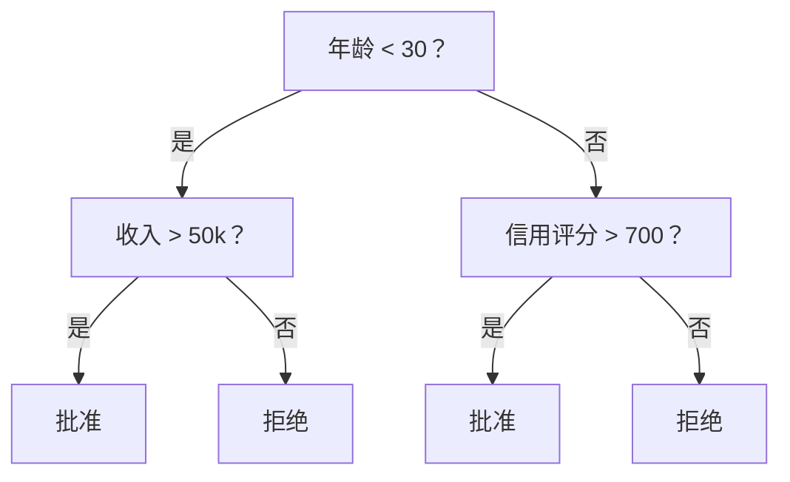
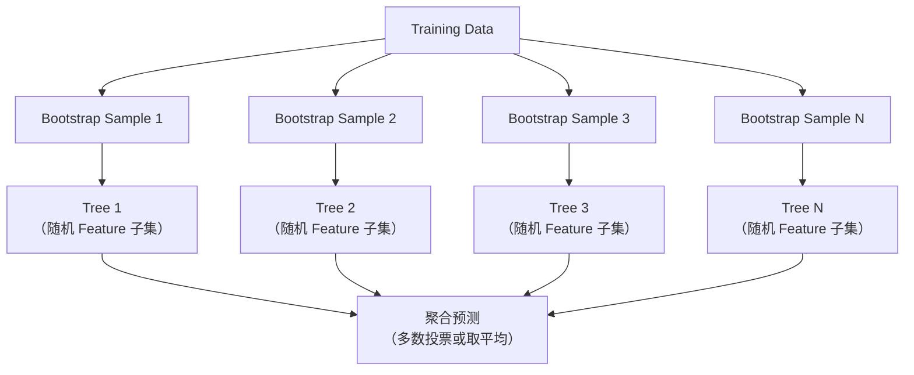

# Decision Tree 与 Random Forest

> Decision Tree 本质上就是流程图。但由众多 Decision Tree 组成的 Random Forest，是 ML 中最强大的工具之一。

**Type:** Build
**Language:** Python
**Prerequisites:** Phase 1（Lesson 09 Information Theory、06 Probability）
**Time:** ~90 分钟

## 学习目标

- 实现 Gini impurity、entropy 和 information gain 计算，以找到最优的 Decision Tree split
- 从零构建带有 pre-pruning 控制（最大深度、最少样本数）的 Decision Tree classifier
- 使用 bootstrap sampling 和 Feature randomization 构建 Random Forest，并解释它为何能降低 Variance
- 比较 MDI Feature importance 与 permutation importance，并识别 MDI 何时会产生偏差

## 问题

你有一份表格数据。行是样本，列是 Feature，还有一个你希望预测的目标列。你可以直接使用 Neural Network。但对于表格数据，基于 tree 的 Model（Decision Tree、Random Forest、gradient boosted tree）通常优于 Deep Learning。在结构化数据的 Kaggle 竞赛中，占据主导地位的是 XGBoost 和 LightGBM，而不是 Transformer。

为什么？Tree 无需预处理即可处理混合 Feature 类型（数值型和类别型）。它们无需 Feature engineering 就能处理非线性关系。它们具有可解释性：你可以查看 tree，准确了解某项预测为何产生。而 Random Forest 会对多棵 tree 的结果取平均，因此在中等规模的 Dataset 上具有很强的抗 overfitting 能力。

本课将先使用递归 split 从零构建 Decision Tree，然后在此基础上构建 Random Forest。你将实现 split criteria 背后的数学原理（Gini impurity、entropy、information gain），并理解由 weak learner 组成的 ensemble 为何能够成为 strong learner。

## 概念

### Decision Tree 的作用

Decision Tree 通过提出一系列是/否问题，将 Feature space 划分为多个矩形区域。



每个内部 node 都会将一个 Feature 与某个 threshold 进行比较。每个 leaf node 都会给出预测。要对新的数据点进行 Classification，可以从 root 开始沿着 branch 前进，直到到达 leaf。

Tree 采用自顶向下的方式构建：在每个 node 选择最能分离数据的 Feature 和 threshold。“最优”由 split criterion 定义。

### Split criteria：衡量 impurity

在每个 node，我们都有一组样本。我们希望对它们进行 split，使得到的 child node 尽可能“纯”，也就是每个 child 主要只包含一个 class。

**Gini impurity** 衡量这样一种 Probability：随机选择一个样本，并按照该 node 的 class distribution 为其分配 Label 时，这个样本会被错误分类。

```text
Gini(S) = 1 - sum(p_k^2)

其中 p_k 是集合 S 中 class k 的比例。
```

对于 pure node（全部属于同一个 class），Gini = 0。对于 class 比例为 50/50 的 binary split，Gini = 0.5。越低越好。

```text
示例：6 只猫，4 只狗

Gini = 1 - (0.6^2 + 0.4^2) = 1 - (0.36 + 0.16) = 0.48
```

**Entropy** 衡量一个 node 中的信息量（混乱程度）。Phase 1 Lesson 09 已介绍这一概念。

```text
Entropy(S) = -sum(p_k * log2(p_k))
```

对于 pure node，entropy = 0。对于 50/50 的 binary split，entropy = 1.0。越低越好。

```text
示例：6 只猫，4 只狗

Entropy = -(0.6 * log2(0.6) + 0.4 * log2(0.4))
        = -(0.6 * -0.737 + 0.4 * -1.322)
        = 0.442 + 0.529
        = 0.971 bits
```

**Information gain** 是 split 后 impurity（entropy 或 Gini）的减少量。

```text
IG(S, feature, threshold) = Impurity(S) - weighted_avg(Impurity(S_left), Impurity(S_right))

其中权重是每个 child 中样本数量所占的比例。
```

每个 node 上的 greedy algorithm 如下：尝试每个 Feature 和每个可能的 threshold，选择使 information gain 最大的 (feature, threshold) 组合。

### Split 的工作方式

对于当前 node 上包含 n 个 Feature 和 m 个样本的 Dataset：

1. 对每个 Feature j（j = 1 到 n）：
   - 按 Feature j 对样本排序
   - 将相邻且不同的值之间的每个中点作为 threshold 进行尝试
   - 计算每个 threshold 的 information gain
2. 选择 information gain 最高的 Feature 和 threshold
3. 将数据 split 为左侧（feature <= threshold）和右侧（feature > threshold）
4. 对每个 child 递归执行上述过程

这种 greedy 方法无法保证得到全局最优的 tree。寻找最优 tree 是 NP-hard 问题。但在实践中，greedy splitting 的效果很好。

### 停止条件

如果没有停止条件，tree 会一直生长，直到每个 leaf 都是纯的（每个 leaf 只有一个样本）。这会完美记住 Training data，但泛化表现会非常差。

**Pre-pruning** 会在 tree 完全生长之前将其停止：
- 最大深度：tree 达到指定深度时停止 split
- 每个 leaf 的最少样本数：node 中的样本少于 k 个时停止
- 最小 information gain：最佳 split 对 impurity 的改善低于某个 threshold 时停止
- 最大 leaf node 数量：限制 leaf 总数

**Post-pruning** 会先让完整的 tree 生长出来，再进行裁剪：
- Cost-complexity pruning（scikit-learn 使用的方法）：添加与 leaf 数量成正比的惩罚项。增大惩罚即可得到更小的 tree
- Reduced error pruning：如果移除 subtree 不会增加 validation error，就将其移除

Pre-pruning 更简单、更快。Post-pruning 通常能生成更好的 tree，因为它不会过早停止那些可能进一步产生有效 split 的分支。

### 用于 Regression 的 Decision Tree

对于 Regression，leaf 的预测值是该 leaf 中目标值的均值。Split criterion 也会发生变化：

**Variance reduction** 会取代 information gain：

```text
VR(S, feature, threshold) = Var(S) - weighted_avg(Var(S_left), Var(S_right))
```

选择能够最大幅度降低 Variance 的 split。Tree 会将 input space 划分为多个区域，并在每个区域中预测一个常量（均值）。

### Random Forest：ensemble 的力量

单棵 Decision Tree 具有高 Variance。数据中的细微变化都可能产生完全不同的 tree。Random Forest 通过对多棵 tree 取平均来解决这个问题。



两种随机性来源让这些 tree 具有多样性：

**Bagging（bootstrap aggregating）：** 每棵 tree 都在 bootstrap sample 上进行 Training。Bootstrap sample 是从 Training data 中进行有放回随机抽样得到的样本。每个 bootstrap 中大约会出现原始样本的 63%（其余为 out-of-bag sample，可用于 validation）。

**Feature randomization：** 每次 split 时，只考虑随机选取的 Feature 子集。对于 Classification，默认值是 sqrt(n_features)。对于 Regression，默认值是 n_features/3。这可以防止所有 tree 都在同一个主导 Feature 上进行 split。

关键洞见是：对许多不相关的 tree 取平均，可以在不增加 bias 的情况下降低 Variance。每棵 tree 单独来看可能表现一般，但 ensemble 很强大。

### Feature importance

Random Forest 可以自然地提供 Feature importance 分数。最常见的方法是：

**Mean Decrease in Impurity（MDI）：** 对于每个 Feature，将所有 tree 中使用该 Feature 的所有 node 上的 impurity 总减少量相加。在较早的 split 中产生更大 impurity reduction 的 Feature 更重要。

```text
importance(feature_j) = 对所有使用 feature_j 的 node 求和：
    (n_samples_at_node / n_total_samples) * impurity_decrease
```

这种方法速度很快（在 Training 期间计算），但会偏向 high-cardinality Feature，以及拥有许多潜在 split point 的 Feature。

**Permutation importance** 是另一种方法：打乱一个 Feature 的值，然后衡量 Model accuracy 下降了多少。它更可靠，但速度更慢。

### Tree 何时优于 Neural Network

在表格数据上，Tree 和 Random Forest 通常优于 Neural Network。原因包括：

| 因素 | Tree | Neural Network |
|--------|-------|----------------|
| 混合类型（数值型 + 类别型） | 原生支持 | 需要编码 |
| 小型 Dataset（< 10k 行） | 表现良好 | 容易 overfit |
| Feature interaction | 通过 split 发现 | 需要设计 architecture |
| 可解释性 | 完全透明 | Black box |
| Training 时间 | 数分钟 | 数小时 |
| 对 Hyperparameter 的敏感度 | 低 | 高 |

当数据具有空间或序列结构（图像、文本、音频）时，Neural Network 更有优势。对于由多个 Feature 组成的扁平表格，tree 是默认选择。

```figure
decision-tree-depth
```

## 动手构建

### 第 1 步：Gini impurity 与 entropy

从零构建这两种 split criterion，并验证它们对于哪些 split 较优能得出一致结论。

```python
import math

def gini_impurity(labels):
    n = len(labels)
    if n == 0:
        return 0.0
    counts = {}
    for label in labels:
        counts[label] = counts.get(label, 0) + 1
    return 1.0 - sum((c / n) ** 2 for c in counts.values())

def entropy(labels):
    n = len(labels)
    if n == 0:
        return 0.0
    counts = {}
    for label in labels:
        counts[label] = counts.get(label, 0) + 1
    return -sum(
        (c / n) * math.log2(c / n) for c in counts.values() if c > 0
    )
```

### 第 2 步：寻找最佳 split

尝试每个 Feature 和每个 threshold，返回 information gain 最高的组合。

```python
def information_gain(parent_labels, left_labels, right_labels, criterion="gini"):
    measure = gini_impurity if criterion == "gini" else entropy
    n = len(parent_labels)
    n_left = len(left_labels)
    n_right = len(right_labels)
    if n_left == 0 or n_right == 0:
        return 0.0
    parent_impurity = measure(parent_labels)
    child_impurity = (
        (n_left / n) * measure(left_labels) +
        (n_right / n) * measure(right_labels)
    )
    return parent_impurity - child_impurity
```

### 第 3 步：构建 DecisionTree class

实现递归 split、预测和 Feature importance 跟踪。`_build` 是 tree 的核心：当 node 已经纯净或达到 pre-pruning 限制时停止；否则，它会采用最佳 split，并对两个 child 递归执行相同过程。

```python
import random

class DecisionTree:
    def __init__(self, max_depth=None, min_samples_split=2,
                 min_samples_leaf=1, criterion="gini",
                 max_features=None):
        self.max_depth = max_depth
        self.min_samples_split = min_samples_split
        self.min_samples_leaf = min_samples_leaf
        self.criterion = criterion
        self.max_features = max_features
        self.tree = None
        self.feature_importances_ = None

    def fit(self, X, y):
        self.n_features = len(X[0])
        self.feature_importances_ = [0.0] * self.n_features
        self.n_samples = len(X)
        self.tree = self._build(X, y, depth=0)
        total = sum(self.feature_importances_)
        if total > 0:
            self.feature_importances_ = [
                fi / total for fi in self.feature_importances_
            ]

    def predict(self, X):
        return [self._predict_one(x, self.tree) for x in X]

    def _build(self, X, y, depth):
        if len(set(y)) == 1:
            return {"leaf": True, "value": y[0]}

        if self.max_depth is not None and depth >= self.max_depth:
            return self._make_leaf(y)

        if len(y) < self.min_samples_split:
            return self._make_leaf(y)

        best_feature, best_threshold, best_gain = self._best_split(X, y)

        if best_feature is None or best_gain <= 0:
            return self._make_leaf(y)

        left_X, left_y, right_X, right_y = self._split_data(
            X, y, best_feature, best_threshold
        )

        if len(left_y) < self.min_samples_leaf or len(right_y) < self.min_samples_leaf:
            return self._make_leaf(y)

        weight = len(y) / self.n_samples
        self.feature_importances_[best_feature] += weight * best_gain

        return {
            "leaf": False,
            "feature": best_feature,
            "threshold": best_threshold,
            "left": self._build(left_X, left_y, depth + 1),
            "right": self._build(right_X, right_y, depth + 1),
        }

    def _make_leaf(self, y):
        counts = {}
        for label in y:
            counts[label] = counts.get(label, 0) + 1
        return {"leaf": True, "value": max(counts, key=counts.get)}

    def _best_split(self, X, y):
        best_feature = None
        best_threshold = None
        best_gain = -1.0

        if self.max_features == "sqrt":
            k = max(1, int(math.sqrt(self.n_features)))
            feature_indices = random.sample(range(self.n_features), k)
        elif isinstance(self.max_features, int):
            if self.max_features < 1:
                raise ValueError("max_features must be at least 1 when given as an integer")
            k = min(self.max_features, self.n_features)
            feature_indices = random.sample(range(self.n_features), k)
        else:
            feature_indices = list(range(self.n_features))

        for feature_idx in feature_indices:
            values = sorted(set(X[i][feature_idx] for i in range(len(X))))
            if len(values) <= 1:
                continue

            for i in range(len(values) - 1):
                threshold = (values[i] + values[i + 1]) / 2.0
                left_y = [y[j] for j in range(len(X)) if X[j][feature_idx] <= threshold]
                right_y = [y[j] for j in range(len(X)) if X[j][feature_idx] > threshold]

                if len(left_y) < self.min_samples_leaf or len(right_y) < self.min_samples_leaf:
                    continue

                gain = information_gain(y, left_y, right_y, self.criterion)
                if gain > best_gain:
                    best_gain = gain
                    best_feature = feature_idx
                    best_threshold = threshold

        return best_feature, best_threshold, best_gain

    def _split_data(self, X, y, feature, threshold):
        left_X, left_y, right_X, right_y = [], [], [], []
        for i in range(len(X)):
            if X[i][feature] <= threshold:
                left_X.append(X[i])
                left_y.append(y[i])
            else:
                right_X.append(X[i])
                right_y.append(y[i])
        return left_X, left_y, right_X, right_y

    def _predict_one(self, x, node):
        if node["leaf"]:
            return node["value"]
        if x[node["feature"]] <= node["threshold"]:
            return self._predict_one(x, node["left"])
        return self._predict_one(x, node["right"])
```

### 第 4 步：构建 RandomForest class

实现 bootstrap sampling、Feature randomization 和多数投票。

```python
class RandomForest:
    def __init__(self, n_trees=100, max_depth=None,
                 min_samples_split=2, max_features="sqrt",
                 criterion="gini"):
        self.n_trees = n_trees
        self.max_depth = max_depth
        self.min_samples_split = min_samples_split
        self.max_features = max_features
        self.criterion = criterion
        self.trees = []

    def fit(self, X, y):
        n = len(X)
        for _ in range(self.n_trees):
            indices = [random.randint(0, n - 1) for _ in range(n)]
            X_boot = [X[i] for i in indices]
            y_boot = [y[i] for i in indices]
            tree = DecisionTree(
                max_depth=self.max_depth,
                min_samples_split=self.min_samples_split,
                max_features=self.max_features,
                criterion=self.criterion,
            )
            tree.fit(X_boot, y_boot)
            self.trees.append(tree)

    def predict(self, X):
        all_preds = [tree.predict(X) for tree in self.trees]
        predictions = []
        for i in range(len(X)):
            votes = {}
            for preds in all_preds:
                v = preds[i]
                votes[v] = votes.get(v, 0) + 1
            predictions.append(max(votes, key=votes.get))
        return predictions
```

完整实现及所有 helper method 请参阅 `code/trees.py`。

## 实际使用

使用 scikit-learn 时，只需三行即可 Training Random Forest：

```python
from sklearn.ensemble import RandomForestClassifier
from sklearn.datasets import load_iris
from sklearn.model_selection import train_test_split

X, y = load_iris(return_X_y=True)
X_train, X_test, y_train, y_test = train_test_split(X, y, random_state=42)

rf = RandomForestClassifier(n_estimators=100, random_state=42)
rf.fit(X_train, y_train)
print(f"Accuracy: {rf.score(X_test, y_test):.4f}")
print(f"Feature importances: {rf.feature_importances_}")
```

在实践中，gradient boosted tree（XGBoost、LightGBM、CatBoost）通常比 Random Forest 更强，因为它们按顺序构建 tree，每棵 tree 都会修正前一棵 tree 的错误。但 Random Forest 更不容易因配置不当而出错，而且几乎不需要调整 Hyperparameter。

## 交付成果

本课会生成 `outputs/prompt-tree-interpreter.md`，这是一个为业务相关方解释 Decision Tree split 的 Prompt。向它提供已完成 Training 的 tree 结构（深度、Feature、split threshold、accuracy），它就会将 Model 转换为通俗规则、对 Feature importance 进行排序、标记 overfitting 或 leakage，并建议后续步骤。当你需要向不阅读代码的人解释基于 tree 的 Model 时，可以使用它。

## 练习

1. 在包含 3 个 class 的二维 Dataset 上 Training 单棵 Decision Tree。手动跟踪 split，并绘制矩形 decision boundary。比较 max_depth=2 和 max_depth=10 时的边界。

2. 为 Regression tree 实现 variance reduction split。为 200 个点生成 y = sin(x) + noise，并拟合你的 Regression tree。绘制 tree 的 piecewise-constant 预测，并与真实曲线比较。

3. 分别使用 1、5、10、50 和 200 棵 tree 构建 Random Forest。绘制 Training accuracy 和 test accuracy 随 tree 数量变化的曲线。观察 test accuracy 会趋于平稳，但不会下降（Random Forest 能抵抗 overfitting）。

4. 在 5 个不同的 Dataset 上比较 Gini impurity 与 entropy 作为 split criterion 时的表现。衡量 accuracy 和 tree depth。在大多数情况下，它们会产生几乎相同的结果。解释原因。

5. 实现 permutation importance。在一个 Dataset 上将其与 MDI importance 进行比较：其中一个 Feature 是随机噪声，但具有 high cardinality。MDI 会将这个噪声 Feature 排在较高位置，而 permutation importance 不会。

## 关键术语

| 术语 | 人们通常怎么说 | 实际含义 |
|------|----------------|----------------------|
| Decision Tree | “用于预测的流程图” | 通过学习一系列 if/else split，将 Feature space 划分为矩形区域的 Model |
| Gini impurity | “node 的混合程度” | 在一个 node 上错误分类随机样本的 Probability。0 = 纯，0.5 = binary 情况下的最大 impurity |
| Entropy | “node 中的混乱程度” | Node 中的信息量。0 = 纯，1.0 = binary 情况下的最大不确定性。源自 Information Theory |
| Information gain | “split 有多好” | Split 后 impurity 的减少量。它是选择 split 时使用的 greedy criterion |
| Pre-pruning | “提前停止 tree” | 通过设置最大深度、最少样本数或最小 gain threshold，提前停止 tree 生长 |
| Post-pruning | “之后再裁剪 tree” | 先生成完整的 tree，再移除无法改善 validation performance 的 subtree |
| Bagging | “在随机子集上进行 Training” | Bootstrap aggregating。在通过有放回抽样得到的不同随机样本上 Training 每个 Model |
| Random Forest | “一组 tree” | Decision Tree 的 ensemble；每棵 tree 都在 bootstrap sample 上进行 Training，并在每次 split 时使用随机 Feature 子集 |
| Feature importance（MDI） | “哪些 Feature 重要” | 每个 Feature 贡献的 impurity 总减少量，在所有 tree 和 node 上求和 |
| Permutation importance | “打乱后检查” | 随机打乱某个 Feature 的值后产生的 accuracy 降幅。对于噪声 Feature，它比 MDI 更可靠 |
| Variance reduction | “Information gain 的 Regression 版本” | Regression tree 中与 information gain 对应的指标。选择能够最大幅度降低目标 Variance 的 split |
| Bootstrap sample | “包含重复项的随机样本” | 从原始 Dataset 中进行有放回抽样得到的随机样本。大小相同，但包含重复项 |

## 延伸阅读

- [Breiman：Random Forests（2001）](https://link.springer.com/article/10.1023/A:1010933404324) - 最初的 Random Forest 论文
- [Grinsztajn 等：Why do tree-based models still outperform deep learning on tabular data?（2022）](https://arxiv.org/abs/2207.08815) - 对表格任务中 tree 与 Neural Network 的严谨比较
- [scikit-learn Decision Trees 文档](https://scikit-learn.org/stable/modules/tree.html) - 包含可视化工具的实践指南
- [XGBoost：A Scalable Tree Boosting System（Chen & Guestrin，2016）](https://arxiv.org/abs/1603.02754) - 在 Kaggle 中占据主导地位的 gradient boosting 论文
