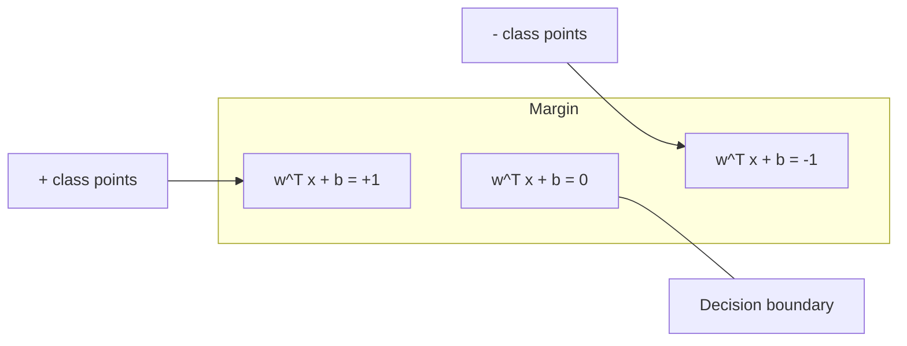
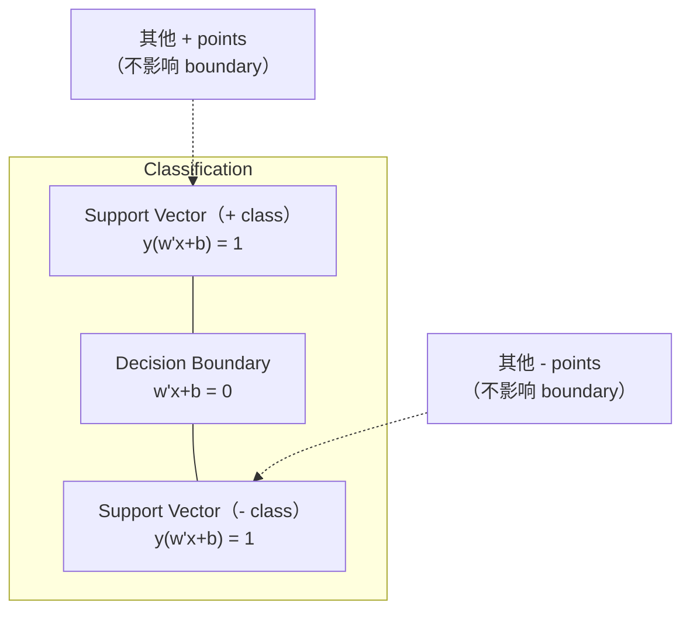
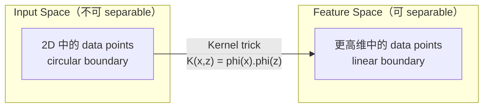

# Support Vector Machines

> 在两个类别之间找到最宽的街道。这就是全部思想。

**Type:** Build
**Language:** Python
**先修要求：** Phase 1（Lessons 08 Optimization, 14 Norms and Distances, 18 Convex Optimization）
**Time:** ~90 分钟

## 学习目标
- 使用 hinge loss 和 primal formulation 上的 gradient descent，从零实现一个 linear SVM
- 解释 maximum margin principle，并从训练好的模型中识别 support vectors
- 比较 linear、polynomial 和 RBF kernels，并解释 kernel trick 如何避免显式的高维映射
- 评估由 C parameter 控制的 margin width 与 classification errors 之间的权衡

## 问题
你有两类数据点，需要画一条直线（或 hyperplane）将它们分开。可能有无限多条线都能做到。你应该选择哪一条？

选择 margin 最大的那一条。margin 是 decision boundary 与两侧最近数据点之间的距离。更宽的 margin 意味着 classifier 更有信心，并且能更好地 generalize 到未见数据。

这个直觉引出了 Support Vector Machines，它是 ML 中数学上最优雅的算法之一。SVMs 在 Deep Learning 之前曾是主导性的 classification 方法，并且在小数据集、高维数据，以及需要有原则、充分理解、具备理论保证的模型的问题中，仍然是最佳选择。

SVMs 直接连接到 Phase 1：optimization 是 convex 的（Lesson 18），margin 用 norms 来度量（Lesson 14），而 kernel trick 利用 dot products，在不真正计算高维空间的情况下处理 nonlinear boundaries。

## 概念
### 最大间隔 classifier

给定 labels y_i in {-1, +1} 和 feature vectors x_i 的 linearly separable data，我们希望找到一个 hyperplane w^T x + b = 0 来分离类别。

点 x_i 到 hyperplane 的距离是：

```
distance = |w^T x_i + b| / ||w||
```

对于正确分类的点：y_i * (w^T x_i + b) > 0。margin 是从 hyperplane 到任一侧最近点距离的两倍。



optimization problem：

```
maximize    2 / ||w||     (margin width)
subject to  y_i * (w^T x_i + b) >= 1  for all i
```

等价地（minimizing ||w||^2 更容易 optimize）：

```
minimize    (1/2) ||w||^2
subject to  y_i * (w^T x_i + b) >= 1  for all i
```

这是一个 convex quadratic program。它有唯一的 global solution。正好位于 margin boundaries 上的数据点（其中 y_i * (w^T x_i + b) = 1）就是 support vectors。它们是唯一决定 decision boundary 的点。移动或删除任何 non-support-vector point，boundary 都不会改变。

### Support vectors：关键的少数点



大多数 training points 都无关紧要。只有 support vectors 重要。这就是为什么 SVMs 在 prediction time 具有 memory-efficient：你只需要存储 support vectors，而不是整个 training set。

support vectors 的数量也给出了 generalization error 的界。相对于 dataset size，support vectors 越少，generalization 越好。

### Soft margin: 使用 C parameter 处理噪声

真实数据很少是完全 separable 的。有些点可能在 boundary 的错误一侧，或者位于 margin 内部。soft margin formulation 通过引入 slack variables 来允许 violations。

```
minimize    (1/2) ||w||^2 + C * sum(xi_i)
subject to  y_i * (w^T x_i + b) >= 1 - xi_i
            xi_i >= 0  for all i
```

slack variable xi_i 衡量点 i 违反 margin 的程度。C 控制这种 trade-off：

| C value | Behavior |
|---------|----------|
| Large C | 对 violations 施加重罚。margin 窄，misclassifications 更少。Overfits |
| Small C | 允许更多 violations。margin 宽，misclassifications 更多。Underfits |

C 是 regularization strength 的倒数。Large C = 更少 regularization。Small C = 更多 regularization。

### Hinge loss：SVM 的 Loss Function

soft margin SVM 可以重写为 unconstrained optimization：

```
minimize    (1/2) ||w||^2 + C * sum(max(0, 1 - y_i * (w^T x_i + b)))
```

项 max(0, 1 - y_i * f(x_i)) 就是 hinge loss。当点被正确分类且位于 margin 之外时，它为零。当点位于 margin 内部或被 misclassified 时，它是线性的。

```
单个点的 Hinge loss：

loss
  |
  | \
  |  \
  |   \
  |    \
  |     \_______________
  |
  +-----|-----|-------->  y * f(x)
       0     1

当 y*f(x) >= 1 时为 zero loss（正确分类，位于 margin 外）。
当 y*f(x) < 1 时为 linear penalty。
```

与 logistic loss（logistic regression）比较：

```
Hinge:     max(0, 1 - y*f(x))          在 margin 处 hard cutoff
Logistic:  log(1 + exp(-y*f(x)))        平滑，永远不会精确为零
```

Hinge loss 产生 sparse solutions（只有 support vectors 有非零贡献）。Logistic loss 使用所有 data points。这使 SVMs 在 prediction time 更 memory-efficient。

### 用 gradient descent 训练 linear SVM

你可以使用 hinge loss 加 L2 regularization 上的 gradient descent 来训练 linear SVM，而不需要求解 constrained QP：

```
L(w, b) = (lambda/2) * ||w||^2 + (1/n) * sum(max(0, 1 - y_i * (w^T x_i + b)))

关于 w 的 Gradient：
  If y_i * (w^T x_i + b) >= 1:  dL/dw = lambda * w
  If y_i * (w^T x_i + b) < 1:   dL/dw = lambda * w - y_i * x_i

关于 b 的 Gradient：
  If y_i * (w^T x_i + b) >= 1:  dL/db = 0
  If y_i * (w^T x_i + b) < 1:   dL/db = -y_i
```

这称为 primal formulation。它每个 epoch 的运行时间为 O(n * d)，其中 n 是 samples 的数量，d 是 features 的数量。对于大规模、sparse、高维数据（text classification），这很快。

### dual formulation 和 kernel trick

SVM problem 的 Lagrangian dual（来自 Phase 1 Lesson 18，KKT conditions）是：

```
maximize    sum(alpha_i) - (1/2) * sum_ij(alpha_i * alpha_j * y_i * y_j * (x_i . x_j))
subject to  0 <= alpha_i <= C
            sum(alpha_i * y_i) = 0
```

dual 只涉及数据点之间的 dot products x_i . x_j。这是关键洞见。用 kernel function K(x_i, x_j) 替换每一个 dot product，SVM 就能学习 nonlinear boundaries，而不需要显式计算 transformation。

```
Linear kernel:      K(x, z) = x . z
Polynomial kernel:  K(x, z) = (x . z + c)^d
RBF (Gaussian):     K(x, z) = exp(-gamma * ||x - z||^2)
```

RBF kernel 将数据映射到 infinite-dimensional space。input space 中接近的点，其 kernel value 接近 1。相距很远的点，其 kernel value 接近 0。它可以学习任意 smooth decision boundary。



kernel trick 在不进入高维空间的情况下，计算高维空间中的 dot product。对于 D 维中 degree d 的 polynomial kernel，显式 feature space 有 O(D^d) 维。但 K(x, z) 可以在 O(D) 时间内计算。

### SVM for regression (SVR)

Support Vector Regression 会围绕数据拟合一个宽度为 epsilon 的 tube。tube 内的点具有 zero loss。tube 外的点会被线性惩罚。

```
minimize    (1/2) ||w||^2 + C * sum(xi_i + xi_i*)
subject to  y_i - (w^T x_i + b) <= epsilon + xi_i
            (w^T x_i + b) - y_i <= epsilon + xi_i*
            xi_i, xi_i* >= 0
```

epsilon parameter 控制 tube width。tube 越宽 = support vectors 越少 = fit 更平滑。tube 越窄 = support vectors 越多 = fit 更紧。

### 为什么 SVMs 输给了 Deep Learning（以及它们什么时候仍然胜出）

SVMs 从 1990 年代末到 2010 年代初主导了 ML。Deep Learning 出于几个原因超过了它们：

| Factor | SVMs | Deep learning |
|--------|------|---------------|
| Feature engineering | 需要它 | 学习 features |
| Scalability | kernel 为 O(n^2) 到 O(n^3) | 使用 SGD 时每个 epoch 为 O(n) |
| Image/text/audio | 需要 handcrafted features | 从 raw data 学习 |
| Large datasets (>100k) | 慢 | 扩展良好 |
| GPU acceleration | 收益有限 | 巨大加速 |

SVMs 在这些场景中仍然胜出：
- Small datasets（数百到低数千 samples）
- 高维 sparse data（带 TF-IDF features 的文本）
- 当你需要数学保证（margin bounds）
- 当 training time 必须最小化（linear SVM 非常快）
- 具有清晰 margin structure 的 binary classification
- Anomaly detection（one-class SVM）

## 构建它
### 步骤 1： Hinge loss and gradient

基础。计算一个 batch 的 hinge loss 及其 gradient。

```python
def hinge_loss(X, y, w, b):
    n = len(X)
    total_loss = 0.0
    for i in range(n):
        margin = y[i] * (dot(w, X[i]) + b)
        total_loss += max(0.0, 1.0 - margin)
    return total_loss / n
```

### 步骤 2： Linear SVM via gradient descent

通过最小化 regularized hinge loss 来训练。不需要 QP solver。

```python
class LinearSVM:
    def __init__(self, lr=0.001, lambda_param=0.01, n_epochs=1000):
        self.lr = lr
        self.lambda_param = lambda_param
        self.n_epochs = n_epochs
        self.w = None
        self.b = 0.0

    def fit(self, X, y):
        n_features = len(X[0])
        self.w = [0.0] * n_features
        self.b = 0.0

        for epoch in range(self.n_epochs):
            for i in range(len(X)):
                margin = y[i] * (dot(self.w, X[i]) + self.b)
                if margin >= 1:
                    self.w = [wj - self.lr * self.lambda_param * wj
                              for wj in self.w]
                else:
                    self.w = [wj - self.lr * (self.lambda_param * wj - y[i] * X[i][j])
                              for j, wj in enumerate(self.w)]
                    self.b -= self.lr * (-y[i])

    def predict(self, X):
        return [1 if dot(self.w, x) + self.b >= 0 else -1 for x in X]
```

### 步骤 3： Kernel functions

实现 linear、polynomial 和 RBF kernels。

```python
def linear_kernel(x, z):
    return dot(x, z)

def polynomial_kernel(x, z, degree=3, c=1.0):
    return (dot(x, z) + c) ** degree

def rbf_kernel(x, z, gamma=0.5):
    diff = [xi - zi for xi, zi in zip(x, z)]
    return math.exp(-gamma * dot(diff, diff))
```

### 步骤 4： Margin and support vector identification

训练后，识别哪些点是 support vectors，并计算 margin width。

```python
def find_support_vectors(X, y, w, b, tol=1e-3):
    support_vectors = []
    for i in range(len(X)):
        margin = y[i] * (dot(w, X[i]) + b)
        if abs(margin - 1.0) < tol:
            support_vectors.append(i)
    return support_vectors
```

完整实现和所有 demos 见 `code/svm.py`。

## 使用它
使用 scikit-learn：

```python
from sklearn.svm import SVC, LinearSVC, SVR
from sklearn.preprocessing import StandardScaler
from sklearn.pipeline import Pipeline

clf = Pipeline([
    ("scaler", StandardScaler()),
    ("svm", SVC(kernel="rbf", C=1.0, gamma="scale")),
])
clf.fit(X_train, y_train)
print(f"Accuracy: {clf.score(X_test, y_test):.4f}")
print(f"Support vectors: {clf['svm'].n_support_}")
```

重要：训练 SVM 之前始终要 scale 你的 features。SVMs 对 feature magnitudes 敏感，因为 margin 取决于 ||w||，而未 scale 的 features 会扭曲几何结构。

对于大数据集，使用 `LinearSVC`（primal formulation，每个 epoch 为 O(n)）而不是 `SVC`（dual formulation，O(n^2) 到 O(n^3)）：

```python
from sklearn.svm import LinearSVC

clf = Pipeline([
    ("scaler", StandardScaler()),
    ("svm", LinearSVC(C=1.0, max_iter=10000)),
])
```

## 练习
1. 生成一个 2D linearly separable dataset。训练你的 LinearSVM，并识别 support vectors。验证 support vectors 是最接近 decision boundary 的点。

2. 在一个 noisy dataset 上将 C 从 0.001 变化到 1000。为每个 C value 绘制 decision boundary。观察从 wide margin（underfitting）到 narrow margin（overfitting）的过渡。

3. 创建一个 class boundaries 为 circular（非 linear）的 dataset。展示 linear SVM 会失败。计算 RBF kernel matrix，并展示类别在 kernel-induced feature space 中变得 separable。

4. 在同一个 dataset 上比较 hinge loss 与 logistic loss。训练一个 linear SVM 和 logistic regression。统计有多少 training points 会贡献到每个模型的 decision boundary（support vectors vs all points）。

5. 实现 SVR（epsilon-insensitive loss）。将它拟合到 y = sin(x) + noise。绘制 predictions 周围的 epsilon tube，并突出显示 support vectors（tube 外的点）。

## 关键术语
| Term | What it actually means |
|------|----------------------|
| Support vectors | 最接近 decision boundary 的 training points。唯一决定 hyperplane 的点 |
| Margin | decision boundary 与最近 support vectors 之间的距离。SVMs 会最大化它 |
| Hinge loss | max(0, 1 - y*f(x))。正确分类且位于 margin 外时为零。否则为 linear penalty |
| C parameter | margin width 与 classification errors 之间的 trade-off。Large C = narrow margin，small C = wide margin |
| Soft margin | 通过 slack variables 允许 margin violations 的 SVM formulation。处理 non-separable data |
| Kernel trick | 在不显式映射到高维 feature space 的情况下，计算该空间中的 dot products |
| Linear kernel | K(x, z) = x . z。等价于标准 dot product。用于 linearly separable data |
| RBF kernel | K(x, z) = exp(-gamma * \|\|x-z\|\|^2)。映射到 infinite dimensions。学习任意 smooth boundary |
| Polynomial kernel | K(x, z) = (x . z + c)^d。映射到 polynomial combinations 的 feature space |
| Dual formulation | SVM problem 的重写形式，只依赖数据点之间的 dot products。支持 kernels |
| SVR | Support Vector Regression。围绕数据拟合 epsilon-tube。tube 内的点具有 zero loss |
| Slack variables | xi_i：衡量一个点违反 margin 的程度。正确分类且位于 margin 外的点为零 |
| Maximum margin | 选择能够最大化到每个类别最近点距离的 hyperplane 的原则 |

## 延伸阅读
- [Vapnik: The Nature of Statistical Learning Theory (1995)](https://link.springer.com/book/10.1007/978-1-4757-3264-1) - 关于 SVMs 和 statistical learning 的奠基文本
- [Cortes & Vapnik: Support-vector networks (1995)](https://link.springer.com/article/10.1007/BF00994018) - 原始 SVM paper
- [Platt: Sequential Minimal Optimization (1998)](https://www.microsoft.com/en-us/research/publication/sequential-minimal-optimization-a-fast-algorithm-for-training-support-vector-machines/) - 让 SVM training 变得实用的 SMO algorithm
- [scikit-learn SVM documentation](https://scikit-learn.org/stable/modules/svm.html) - 包含 implementation details 的实践指南
- [LIBSVM: A Library for Support Vector Machines](https://www.csie.ntu.edu.tw/~cjlin/libsvm/) - 大多数 SVM implementations 背后的 C++ library
