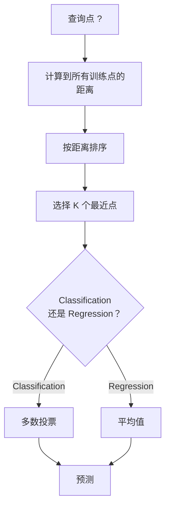
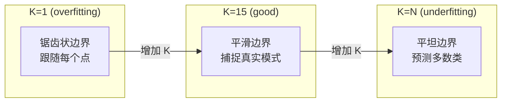
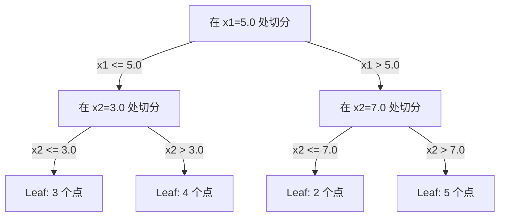

# K-Nearest Neighbors 与 Distances

> 存储一切。通过查看你的邻居来预测。这是最简单且真正有效的算法。

**Type:** Build
**Language:** Python
**前置要求：** Phase 1（Lesson 14 Norms and Distances）
**Time:** ~90 分钟

## 学习目标
- 从零实现 KNN Classification 和 Regression，支持可配置的 K 和距离加权投票
- 比较 L1、L2、cosine 和 Minkowski 距离度量，并为给定数据类型选择合适的度量
- 解释维度灾难，并演示为什么 KNN 在高维空间中会退化
- 构建 KD-tree 以实现高效的 nearest neighbor search，并分析它何时优于 brute-force

## 问题
你有一个数据集。一个新的数据点到来。你需要对它进行 Classification 或预测它的值。与其从数据中学习参数（例如 linear regression 或 SVMs），你只需找到距离新点最近的 K 个训练点，并让它们投票。

这就是 K-nearest neighbors。它没有训练阶段。没有需要学习的参数。没有需要最小化的 Loss Function。你存储整个训练集，并在预测时计算距离。

它听起来简单到不像能工作。但 KNN 在许多问题上出人意料地有竞争力，尤其是在中小型数据集上。深入理解它会揭示一些基础概念：距离度量的选择（连接到 Phase 1 Lesson 14）、维度灾难，以及 lazy learning 与 eager learning 的区别。

KNN 也以不同名称出现在现代 AI 的各个地方。Vector databases 会在 Embeddings 上执行 KNN search。Retrieval-augmented generation (RAG) 会寻找 K 个最近的文档片段。推荐系统会寻找相似用户或物品。算法是同一个。不同的是规模和数据结构。

## 概念
### How KNN works

给定一个带标签点的数据集和一个新的查询点：

1. 计算查询点到数据集中每个点的距离
2. 按距离排序
3. 取最近的 K 个点
4. 对于 Classification：在 K 个 neighbors 中进行多数投票
5. 对于 Regression：对 K 个 neighbors 的值取平均（或加权平均）



这就是完整算法。没有拟合。没有 Gradient Descent。没有 epochs。

### Choosing K

K 是唯一的 hyperparameter。它控制 bias-variance trade-off：

| K | 行为 |
|---|----------|
| K = 1 | 决策边界跟随每一个点。训练误差为零。高方差。Overfits |
| Small K (3-5) | 对局部结构敏感。可以捕捉复杂边界 |
| Large K | 边界更平滑。对噪声更稳健。可能 underfit |
| K = N | 对每个点都预测多数类。最大 bias |

常见起点是对包含 N 个点的数据集使用 K = sqrt(N)。二分类时使用奇数 K，以避免平票。



### Distance metrics

距离函数定义了什么叫“近”。不同度量会产生不同的 neighbors、不同的预测。

**L2 (Euclidean)** 是默认选择。直线距离。

```
d(a, b) = sqrt(sum((a_i - b_i)^2))
```

对特征尺度敏感。使用 L2 和 KNN 前，始终要标准化特征。

**L1 (Manhattan)** 对绝对差求和。比 L2 更能抵抗 outliers，因为它不会对差值平方。

```
d(a, b) = sum(|a_i - b_i|)
```

**Cosine distance** 衡量 Vectors 之间的角度，忽略大小。对于文本和 Embedding 数据至关重要。

```
d(a, b) = 1 - (a . b) / (||a|| * ||b||)
```

**Minkowski** 使用参数 p 泛化 L1 和 L2。

```
d(a, b) = (sum(|a_i - b_i|^p))^(1/p)

p=1: Manhattan
p=2: Euclidean
p->inf: Chebyshev (max absolute difference)
```

使用哪种度量取决于数据：

| 数据类型 | 最佳度量 | 原因 |
|-----------|------------|-----|
| 数值特征，尺度相近 | L2 (Euclidean) | 默认选择，适用于空间数据 |
| 数值特征，存在 outliers | L1 (Manhattan) | 稳健，不会放大大差异 |
| Text embeddings | Cosine | 大小是噪声，方向是含义 |
| 高维稀疏 | Cosine 或 L1 | L2 受维度灾难影响严重 |
| 混合类型 | Custom distance | 按特征类型组合度量 |

### Weighted KNN

标准 KNN 对所有 K 个 neighbors 赋予相同权重。但距离 0.1 的 neighbor 应该比距离 5.0 的 neighbor 更重要。

**Distance-weighted KNN** 按距离的倒数为每个 neighbor 加权：

```
weight_i = 1 / (distance_i + epsilon)

For classification: weighted vote
For regression:     weighted average = sum(w_i * y_i) / sum(w_i)
```

当查询点与训练点完全匹配时，epsilon 可以防止除以零。

Weighted KNN 对 K 的选择不那么敏感，因为远处的 neighbors 无论如何贡献都很小。

### 维度灾难

KNN 性能会在高维中退化。这不是一个模糊的担忧，而是一个数学事实。

**问题 1：距离会收敛。** 随着维度增加，最大距离与最小距离的比值会趋近于 1。所有点都变得与查询点一样“远”。

```
In d dimensions, for random uniform points:

d=2:    max_dist / min_dist = varies widely
d=100:  max_dist / min_dist ~ 1.01
d=1000: max_dist / min_dist ~ 1.001

When all distances are nearly equal, "nearest" is meaningless.
```

**问题 2：体积会爆炸。** 为了在数据的固定比例内捕捉 K 个 neighbors，你需要扩大搜索半径，使其覆盖特征空间中大得多的一部分。在高维中，“neighborhood” 会涵盖空间的大部分。

**问题 3：角落占主导。** 在 d 维单位超立方体中，大部分体积集中在角落附近，而不是中心。随着 d 增长，内切于立方体的球体所包含的体积分数会趋近于零。

实际后果：KNN 在大约 20-50 个特征以内表现良好。超过这个范围后，你需要在应用 KNN 前进行 dimensionality reduction（PCA、UMAP、t-SNE），或者使用能利用数据内在低维结构的 tree-based search structures。

### KD-trees：快速 nearest neighbor 搜索

Brute-force KNN 会计算查询点到每个训练点的距离。每次查询的复杂度是 O(n * d)。对于大型数据集，这太慢了。

KD-tree 会沿特征轴递归划分空间。在每一层，它沿某个维度按中位数进行切分。



为了寻找 nearest neighbor，先遍历树到包含查询点的 leaf，然后回溯，并且只在相邻分区可能包含更近点时才检查它们。

平均查询时间：低维时为 O(log n)。但 KD-trees 在高维（d > 20）会退化为 O(n)，因为回溯能排除的分支越来越少。

### Ball trees: 更适合中等维度

Ball trees 将数据划分为嵌套的超球体，而不是轴对齐的盒子。每个节点定义一个 ball（中心 + 半径），包含该子树中的所有点。

相对 KD-trees 的优势：
- 在中等维度中表现更好（最高约 ~50）
- 能处理非轴对齐结构
- 更紧的边界体积意味着搜索时可以剪枝更多分支

KD-trees 和 ball trees 都是精确算法。对于真正大规模搜索（数百万个点、数百维），会改用 approximate nearest neighbor 方法（HNSW、IVF、product quantization）。这些内容在 Phase 1 Lesson 14 中介绍。

### Lazy learning vs eager learning

KNN 是 lazy learner：训练时不做工作，所有工作都在预测时完成。大多数其他算法（linear regression、SVMs、Neural Networks）是 eager learners：它们在训练时进行大量计算来构建紧凑模型，然后预测很快。

| 方面 | Lazy (KNN) | Eager (SVM, neural net) |
|--------|------------|------------------------|
| 训练时间 | O(1)，只存储数据 | O(n * epochs) |
| 预测时间 | 每次查询 O(n * d) | O(d) 或 O(parameters) |
| 预测时内存 | 存储整个训练集 | 只存储模型参数 |
| 适应新数据 | 立即添加点 | 重新训练模型 |
| 决策边界 | 隐式，在运行时计算 | 显式，训练后固定 |

Lazy learning 适合以下场景：
- 数据集频繁变化（无需重新训练即可添加/删除点）
- 只需要很少查询的预测
- 你希望训练时间为零
- 数据集足够小，brute-force search 很快

### KNN for regression

KNN Regression 不做多数投票，而是对 K 个 neighbors 的目标值取平均。

```
prediction = (1/K) * sum(y_i for i in K nearest neighbors)

Or with distance weighting:
prediction = sum(w_i * y_i) / sum(w_i)
where w_i = 1 / distance_i
```

KNN Regression 产生分段常数预测（使用加权时为分段平滑）。它无法外推到训练数据范围之外。如果训练目标全都在 0 到 100 之间，KNN 永远不会预测 200。

## 构建它
### 步骤 1： Distance functions

实现 L1、L2、cosine 和 Minkowski 距离。这些内容直接连接到 Phase 1 Lesson 14。

```python
import math

def l2_distance(a, b):
    return math.sqrt(sum((ai - bi) ** 2 for ai, bi in zip(a, b)))

def l1_distance(a, b):
    return sum(abs(ai - bi) for ai, bi in zip(a, b))

def cosine_distance(a, b):
    dot_val = sum(ai * bi for ai, bi in zip(a, b))
    norm_a = math.sqrt(sum(ai ** 2 for ai in a))
    norm_b = math.sqrt(sum(bi ** 2 for bi in b))
    if norm_a == 0 or norm_b == 0:
        return 1.0
    return 1.0 - dot_val / (norm_a * norm_b)

def minkowski_distance(a, b, p=2):
    if p == float('inf'):
        return max(abs(ai - bi) for ai, bi in zip(a, b))
    return sum(abs(ai - bi) ** p for ai, bi in zip(a, b)) ** (1 / p)
```

### 步骤 2： KNN classifier and regressor

构建完整的 KNN，支持可配置的 K、距离度量以及可选的距离加权。

```python
class KNN:
    def __init__(self, k=5, distance_fn=l2_distance, weighted=False,
                 task="classification"):
        self.k = k
        self.distance_fn = distance_fn
        self.weighted = weighted
        self.task = task
        self.X_train = None
        self.y_train = None

    def fit(self, X, y):
        self.X_train = X
        self.y_train = y

    def predict(self, X):
        return [self._predict_one(x) for x in X]
```

### 步骤 3： KD-tree for efficient search

从零构建 KD-tree，按每个维度的中位数递归切分。

```python
class KDTree:
    def __init__(self, X, indices=None, depth=0):
        # Recursively partition the data
        self.axis = depth % len(X[0])
        # Split on median of the current axis
        ...

    def query(self, point, k=1):
        # Traverse to leaf, then backtrack
        ...
```

完整实现见 `code/knn.py`，其中包含所有辅助方法和 demos。

### 步骤 4： Feature scaling

KNN 需要 feature scaling，因为距离对特征大小敏感。取值范围从 0 到 1000 的特征会压倒取值范围从 0 到 1 的特征。

```python
def standardize(X):
    n = len(X)
    d = len(X[0])
    means = [sum(X[i][j] for i in range(n)) / n for j in range(d)]
    stds = [
        max(1e-10, (sum((X[i][j] - means[j]) ** 2 for i in range(n)) / n) ** 0.5)
        for j in range(d)
    ]
    return [[((X[i][j] - means[j]) / stds[j]) for j in range(d)] for i in range(n)], means, stds
```

## 使用它
使用 scikit-learn：

```python
from sklearn.neighbors import KNeighborsClassifier
from sklearn.preprocessing import StandardScaler
from sklearn.pipeline import Pipeline

clf = Pipeline([
    ("scaler", StandardScaler()),
    ("knn", KNeighborsClassifier(n_neighbors=5, metric="euclidean")),
])
clf.fit(X_train, y_train)
print(f"Accuracy: {clf.score(X_test, y_test):.4f}")
```

当数据集足够大且维度足够低时，Scikit-learn 会自动使用 KD-trees 或 ball trees。对于高维数据，它会回退到 brute force。你可以通过 `algorithm` 参数控制这一点。

对于大规模 nearest neighbor search（数百万个 Vectors），使用 FAISS、Annoy 或 Vector database：

```python
import faiss

index = faiss.IndexFlatL2(dimension)
index.add(embeddings)
distances, indices = index.search(query_vectors, k=5)
```

## 练习
1. 在一个包含 3 个类别的 2D 数据集上实现 KNN Classification。绘制 K=1、K=5、K=15 和 K=N 的决策边界。观察从 overfitting 到 underfitting 的转变。

2. 在 2、5、10、50、100 和 500 维中生成 1000 个随机点。对每个维度，计算最大 pairwise distance 与最小 pairwise distance 的比值。绘制该比值随维度变化的图，以可视化维度灾难。

3. 在文本 Classification 问题上比较 KNN 的 L1、L2 和 cosine distance（使用 TF-IDF Vectors）。哪种度量给出最佳 accuracy？为什么 cosine 往往在文本上胜出？

4. 实现 KD-tree，并在 2D、10D 和 50D 中，分别针对 1k、10k 和 100k 点的数据集测量查询时间与 brute force 的对比。在哪个维度 KD-tree 不再比 brute force 更快？

5. 为 y = sin(x) + noise 构建一个 weighted KNN regressor。将它与 K=3、10、30 的 unweighted KNN 比较。展示加权会产生更平滑的预测，尤其是在 K 较大时。

## 关键术语
| 术语 | 它实际意味着什么 |
|------|----------------------|
| K-nearest neighbors | 一种非参数算法，通过寻找距离查询点最近的 K 个训练点来预测 |
| Lazy learning | 训练时不进行计算。所有工作都发生在预测时。KNN 是典型例子 |
| Eager learning | 训练时进行大量计算以构建紧凑模型。大多数 ML 算法都是 eager |
| Curse of dimensionality | 在高维中，距离会收敛，neighborhoods 会扩展到覆盖空间的大部分，使 KNN 失效 |
| KD-tree | 沿特征轴递归划分空间的二叉树。在低维中查询为 O(log n) |
| Ball tree | 嵌套超球体构成的树。在中等维度（最高约 ~50）中比 KD-trees 表现更好 |
| Weighted KNN | neighbors 按距离倒数加权。更近的 neighbors 对预测影响更大 |
| Feature scaling | 将特征归一化到可比较范围。KNN 等基于距离的方法需要它 |
| Majority vote | 通过统计 K 个 neighbors 中哪个类别最常见来进行 Classification |
| Brute force search | 计算到每个训练点的距离。每次查询 O(n*d)。精确但在大 n 时很慢 |
| Approximate nearest neighbor | 能比精确搜索快得多地找到近似最近点的算法（HNSW、LSH、IVF） |
| Voronoi diagram | 一种空间划分，其中每个区域包含所有比任何其他训练点都更接近某个训练点的点。K=1 KNN 会产生 Voronoi 边界 |

## 延伸阅读
- [Cover & Hart: Nearest Neighbor Pattern Classification (1967)](https://ieeexplore.ieee.org/document/1053964) - 奠基性的 KNN 论文，证明其 error rate 至多为 Bayes optimal 的两倍
- [Friedman, Bentley, Finkel: An Algorithm for Finding Best Matches in Logarithmic Expected Time (1977)](https://dl.acm.org/doi/10.1145/355744.355745) - 原始 KD-tree 论文
- [Beyer et al.: When Is "Nearest Neighbor" Meaningful? (1999)](https://link.springer.com/chapter/10.1007/3-540-49257-7_15) - nearest neighbor 维度灾难的形式化分析
- [scikit-learn Nearest Neighbors documentation](https://scikit-learn.org/stable/modules/neighbors.html) - 包含算法选择的实践指南
- [FAISS: A Library for Efficient Similarity Search](https://github.com/facebookresearch/faiss) - Meta 用于十亿级 approximate nearest neighbor search 的库
