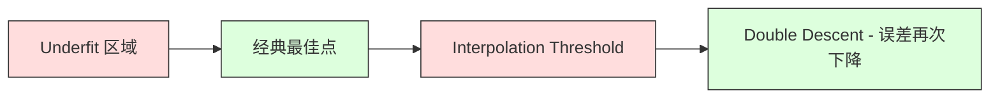
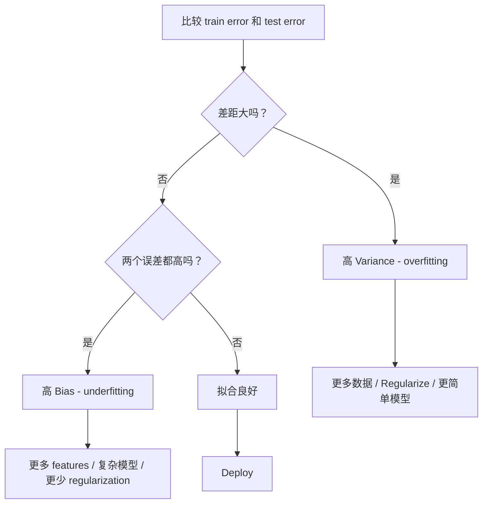
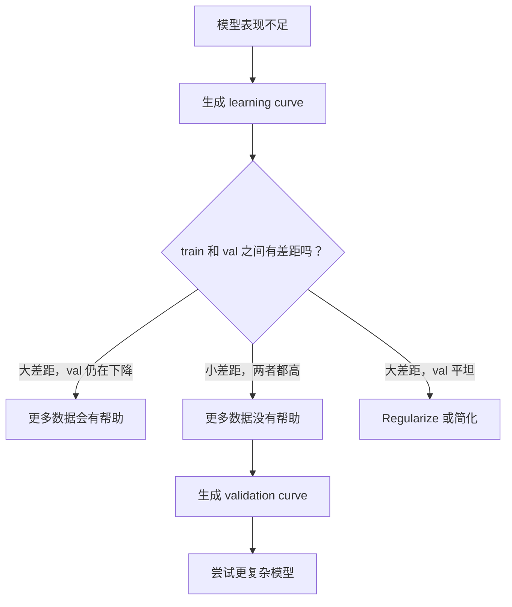

# Bias-Variance Tradeoff

> 每一种模型误差都来自三个来源之一：Bias、Variance 或噪声。你只能控制前两者。

**Type:** Learn
**Language:** Python
**Prerequisites:** Phase 2, Lessons 01-09（ML 基础、Regression、Classification、评估）
**Time:** ~75 分钟

## 学习目标
- 推导期望预测误差的 Bias-Variance 分解，并解释不可约噪声的作用
- 使用训练误差和测试误差模式诊断模型是否存在高 Bias 或高 Variance
- 解释 Regularization 技术（L1、L2、dropout、early stopping）如何用 Bias 换取 Variance
- 实现实验，可视化不同复杂度模型上的 Bias-Variance Tradeoff

## 问题
你训练了一个模型。它在测试数据上有一定误差。这个误差来自哪里？

如果你的模型过于简单（例如在弯曲数据集上使用 linear regression），它会持续错过真实模式。这就是 Bias。如果你的模型过于复杂（例如在 15 个数据点上使用 degree-20 polynomial），它会完美拟合训练数据，但在新数据上给出剧烈变化的预测。这就是 Variance。

对于固定的模型容量，你无法同时最小化两者。降低 Bias，Variance 就会上升。降低 Variance，Bias 就会上升。理解这个 tradeoff 是 Machine Learning 中最有用的诊断技能。它会告诉你应该让模型更复杂还是更简单，应该获取更多数据还是工程化更好的 features，应该加强还是减弱 Regularization。

## 概念
### Bias: 系统性误差

Bias 衡量的是模型平均预测与真实值之间的偏离程度。如果你在来自同一分布的许多不同训练集上训练同一个模型，并对预测取平均，Bias 就是这个平均值与真实值之间的差距。

高 Bias 意味着模型过于僵硬，无法捕捉真实模式。用一条直线去拟合抛物线，无论给它多少数据，它都会错过曲线。这就是 underfitting。

```
高 Bias（underfitting）：
  模型总是预测大致相同的错误结果。
  训练误差：高
  测试误差：高
  二者差距：小
```

### Variance: 对训练数据的敏感性

Variance 衡量的是当你在不同数据子集上训练时，预测会变化多少。如果训练集的微小变化导致模型发生很大变化，Variance 就很高。

高 Variance 意味着模型在拟合训练数据中的噪声，而不是底层信号。degree-20 polynomial 会穿过每一个训练点，但在它们之间剧烈振荡。这就是 overfitting。

```
高 Variance（overfitting）：
  模型完美拟合训练数据，但在新数据上失败。
  训练误差：低
  测试误差：高
  二者差距：大
```

### The Decomposition

对于任意点 x，平方损失下的期望预测误差可以精确分解为：

```
Expected Error = Bias^2 + Variance + Irreducible Noise

where:
  Bias^2   = (E[f_hat(x)] - f(x))^2
  Variance = E[(f_hat(x) - E[f_hat(x)])^2]
  Noise    = E[(y - f(x))^2]             (sigma^2)
```

- `f(x)` 是真实函数
- `f_hat(x)` 是模型预测
- `E[...]` 是对不同训练集的期望
- `y` 是观测到的 label（真实函数加噪声）

噪声项是不可约的。在有噪声数据上，没有模型能比 sigma^2 做得更好。你的任务是在 bias^2 和 variance 之间找到正确平衡。

### Model Complexity vs Error


经典的 U 形曲线：

| Complexity | Bias | Variance | Total Error |
|-----------|------|----------|-------------|
| 过低 | 高 | 低 | 高（underfitting） |
| 刚刚好 | 中等 | 中等 | 最低 |
| 过高 | 低 | 高 | 高（overfitting） |

### 作为 Bias-Variance 控制的 Regularization

Regularization 会有意增加 Bias 来降低 Variance。它约束模型，使其无法追逐噪声。

- **L2 (Ridge):** 将所有权重向零收缩。保留所有 features，但降低它们的影响。
- **L1 (Lasso):** 将某些权重精确推到零。执行 feature selection。
- **Dropout:** 在训练期间随机禁用 neurons。迫使形成冗余 representations。
- **Early stopping:** 在模型完全拟合训练数据之前停止训练。

Regularization 强度（lambda、dropout rate、epoch 数）会直接控制你在 Bias-Variance 曲线上的位置。更多 Regularization 意味着更多 Bias、更少 Variance。

### Double Descent: 现代视角

经典理论认为：超过最佳点后，更多复杂度总是有害。但 2019 年以来的研究显示了意外现象。如果你继续将模型容量增加到远超 interpolation threshold（模型有足够参数可以完美拟合训练数据的位置），测试误差可能会再次下降。



这种 "double descent" 现象解释了为什么大规模 overparameterized Neural Networks（参数数量远多于训练样本）仍然能很好地 generalize。经典 Bias-Variance Tradeoff 并没有错，但对于现代 regime 来说并不完整。

关于 double descent 的关键观察：
- 它会出现在 linear models、decision trees 和 neural networks 中
- 在 interpolation 区域，更多数据实际上可能有害（sample-wise double descent）
- 更多训练 epochs 也可能导致它（epoch-wise double descent）
- Regularization 会平滑峰值，但不会消除它

为什么会发生这种情况？在 interpolation threshold，模型刚好有足够容量拟合所有训练点。它被迫进入一个非常具体的解，这个解穿过每个点，数据中的微小扰动会导致拟合发生巨大变化。这里就是 Variance 达到峰值的位置。超过这个 threshold 后，模型有许多可以完美拟合数据的可能解。学习算法（例如带有 implicit regularization 的 gradient descent）倾向于从中选择最简单的一个。这种偏向简单解的 implicit bias，正是 overparameterized models 能够 generalize 的原因。

| Regime | Parameters vs Samples | Behavior |
|--------|----------------------|----------|
| Underparameterized | p << n | 经典 tradeoff 适用 |
| Interpolation threshold | p ~ n | Variance 达到峰值，测试误差激增 |
| Overparameterized | p >> n | Implicit regularization 开始起作用，测试误差下降 |

从实践角度看：如果你使用 Neural Networks 或大型 tree ensembles，不要停在 interpolation threshold。要么远低于它（配合 explicit regularization），要么远高于它。最糟的位置就是正好在 threshold 上。

### Diagnosing Your Model



| Symptom | Diagnosis | Fix |
|---------|-----------|-----|
| 高 train error，高 test error | Bias | 更多 features、复杂模型、更少 regularization |
| 低 train error，高 test error | Variance | 更多数据、regularization、更简单模型、dropout |
| 低 train error，低 test error | 拟合良好 | Ship it |
| Train error 下降，test error 上升 | Overfitting 正在发生 | Early stopping |

### Practical Strategies

**当 Bias 是问题时：**
- 添加 polynomial 或 interaction features
- 使用更灵活的模型（例如用 tree ensemble 代替 linear）
- 降低 regularization strength
- 训练更久（如果尚未收敛）

**当 Variance 是问题时：**
- 获取更多训练数据
- 使用 bagging（random forests）
- 增加 regularization（更高 lambda、更多 dropout）
- Feature selection（移除噪声 features）
- 使用 cross-validation 尽早发现它

### Ensemble Methods 和方差降低

Ensemble methods 是对抗 Variance 最实用的工具。

**Bagging (Bootstrap Aggregating)** 会在训练数据的不同 bootstrap samples 上训练多个模型，然后对预测取平均。每个单独模型都有高 Variance，但平均值的 Variance 要低得多。Random forests 是将 bagging 应用于 decision trees。

它在数学上有效的原因是：如果你平均 N 个独立预测，每个预测的 variance 都是 sigma^2，那么平均值的 variance 是 sigma^2 / N。这些模型并不真正独立（它们都看到相似的数据），因此降低幅度小于 1/N，但仍然相当可观。

**Boosting** 通过按顺序构建模型来降低 Bias，其中每个新模型都关注当前 ensemble 的错误。Gradient boosting 和 AdaBoost 是主要例子。如果添加太多模型，Boosting 可能 overfit，因此你需要 early stopping 或 regularization。

| Method | Primary Effect | Bias Change | Variance Change |
|--------|---------------|-------------|-----------------|
| Bagging | 降低 Variance | 不变 | 降低 |
| Boosting | 降低 Bias | 降低 | 可能增加 |
| Stacking | 同时降低两者 | 取决于 meta-learner | 取决于 base models |
| Dropout | Implicit bagging | 略微增加 | 降低 |

**实践规则：** 如果你的 base model 有高 Variance（deep trees、high-degree polynomials），使用 bagging。如果你的 base model 有高 Bias（shallow stumps、simple linear models），使用 boosting。

### Learning Curves

Learning curves 将训练误差和验证误差绘制为训练集大小的函数。它们是你拥有的最实用诊断工具。不同于单次 train/test 比较，learning curves 会展示模型轨迹，并告诉你更多数据是否有帮助。


如何解读它们：

| Scenario | Training Error | Validation Error | Gap | What It Means | What to Do |
|----------|---------------|-----------------|-----|---------------|------------|
| 高 Bias | 高 | 高 | 小 | 模型无法捕捉模式 | 更多 features、复杂模型、更少 regularization |
| 高 Variance | 低 | 高 | 大 | 模型记忆训练数据 | 更多数据、regularization、更简单模型 |
| 拟合良好 | 中等 | 中等 | 小 | 模型 generalizes well | Ship it |
| 高 Variance，正在改善 | 低 | 随更多数据下降 | 缩小 | 数据可以修复的 Variance 问题 | 收集更多数据 |
| 高 Bias，平坦 | 高 | 高且平坦 | 小且平坦 | 更多数据没有帮助 | 改变 model architecture |

关键洞察：如果两条曲线都已 plateau，差距很小但两个误差都高，更多数据没有用。你需要更好的模型。如果差距很大且仍在缩小，更多数据会有帮助。

### 如何生成 Learning Curves

有两种方法：

**Approach 1: 改变训练集大小，固定模型。** 保持模型和 hyperparameters 不变。在越来越大的训练数据子集上训练。测量每个大小下的训练误差和验证误差。这是标准 learning curve。

**Approach 2: 改变模型复杂度，固定数据。** 保持数据不变。扫描一个复杂度参数（polynomial degree、tree depth、layers 数量）。测量每个复杂度下的训练误差和验证误差。这是 validation curve，会直接展示 Bias-Variance Tradeoff。

这两种方法相互补充。第一种告诉你更多数据是否有帮助。第二种告诉你不同模型是否有帮助。在决定下一步之前，两者都应该运行。




```figure
bias-variance
```

## 构建它
`code/bias_variance.py` 中的代码会运行完整的 Bias-Variance 分解实验。下面是逐步方法。

### 步骤 1： 从已知函数生成合成数据

我们使用带 Gaussian noise 的 `f(x) = sin(1.5x) + 0.5x`。知道真实函数让我们可以计算精确的 Bias 和 Variance。

```python
def true_function(x):
    return np.sin(1.5 * x) + 0.5 * x

def generate_data(n_samples=30, noise_std=0.5, x_range=(-3, 3), seed=None):
    rng = np.random.RandomState(seed)
    x = rng.uniform(x_range[0], x_range[1], n_samples)
    y = true_function(x) + rng.normal(0, noise_std, n_samples)
    return x, y
```

### 步骤 2: Bootstrap Sampling 和 Polynomial Fitting

对于每个 polynomial degree，我们抽取许多 bootstrap training sets，拟合 polynomial，并在固定 test grid 上记录预测。这会为每个测试点提供一个预测分布。

```python
def fit_polynomial(x_train, y_train, degree, lam=0.0):
    X = np.column_stack([x_train ** d for d in range(degree + 1)])
    if lam > 0:
        penalty = lam * np.eye(X.shape[1])
        penalty[0, 0] = 0
        w = np.linalg.solve(X.T @ X + penalty, X.T @ y_train)
    else:
        w = np.linalg.lstsq(X, y_train, rcond=None)[0]
    return w
```

我们在 200 个不同的 bootstrap samples 上拟合。每个 bootstrap sample 都从同一个底层分布中抽取，但包含不同的点。

### 步骤 3： Computing Bias^2, Variance Decomposition

有了每个测试点上的 200 组预测，我们可以直接根据定义计算分解：

```python
mean_pred = predictions.mean(axis=0)
bias_sq = np.mean((mean_pred - y_true) ** 2)
variance = np.mean(predictions.var(axis=0))
total_error = np.mean(np.mean((predictions - y_true) ** 2, axis=1))
```

- `mean_pred` 是从 bootstrap samples 估计出的 E[f_hat(x)]
- `bias_sq` 是平均预测与真实值之间差距的平方
- `variance` 是跨 bootstrap samples 的预测平均离散程度
- `total_error` 应该近似等于 bias^2 + variance + noise

### 步骤 4： Learning Curves

Learning curves 在保持模型复杂度固定的同时扫描训练集大小。它们显示你的模型是 data-limited 还是 capacity-limited。

```python
def demo_learning_curves():
    sizes = [10, 15, 20, 30, 50, 75, 100, 150, 200, 300]
    degree = 5

    for n in sizes:
        train_errors = []
        test_errors = []
        for seed in range(50):
            x_train, y_train = generate_data(n_samples=n, seed=seed * 100)
            w = fit_polynomial(x_train, y_train, degree)
            train_pred = predict_polynomial(x_train, w)
            train_mse = np.mean((train_pred - y_train) ** 2)
            test_pred = predict_polynomial(x_test, w)
            test_mse = np.mean((test_pred - y_test) ** 2)
            train_errors.append(train_mse)
            test_errors.append(test_mse)
        # 对多次运行取平均，得到 learning curve 上的点
```

对于高 Variance 模型（小数据上的 degree 5），你会看到：
- 训练误差一开始很低，随着更多数据让记忆变难而上升
- 测试误差一开始很高，随着模型获得更多信号而下降
- 差距随着更多数据而缩小

对于高 Bias 模型（degree 1），两个误差会快速收敛到同一个高值，更多数据没有帮助。

### 第 5 步：Regularization Sweep

代码还包含 `demo_regularization_sweep()`，它固定一个 high-degree polynomial（degree 15），并将 Ridge regularization strength 从 0.001 扫描到 100。这从另一个角度展示 Bias-Variance Tradeoff：我们不是改变模型复杂度，而是改变约束强度。

```python
def demo_regularization_sweep():
    alphas = [0.001, 0.005, 0.01, 0.05, 0.1, 0.5, 1.0, 5.0, 10.0, 50.0, 100.0]
    for alpha in alphas:
        results = bias_variance_decomposition([15], lam=alpha)
        r = results[15]
        print(f"alpha={alpha:.3f}  bias={r['bias_sq']:.4f}  var={r['variance']:.4f}")
```

在低 alpha 下，degree-15 polynomial 几乎不受约束。Variance 占主导，因为模型会追逐每个 bootstrap sample 中的噪声。在高 alpha 下，惩罚强到让模型实际上变成接近常数的函数。Bias 占主导。最优 alpha 位于这两个极端之间。

这与改变 polynomial degree 得到的是同一条 U 曲线，只不过这里用连续旋钮而不是离散选项来控制。实践中，Regularization 是控制该 tradeoff 的首选方式，因为它允许细粒度控制，而无需改变 feature set。

## 使用它
sklearn 提供 `learning_curve` 和 `validation_curve`，可以自动化这些诊断，而不需要编写 bootstrap loops。

### Validation Curve：扫描 Model Complexity

```python
from sklearn.model_selection import validation_curve
from sklearn.pipeline import make_pipeline
from sklearn.preprocessing import PolynomialFeatures
from sklearn.linear_model import Ridge

degrees = list(range(1, 16))
train_scores_all = []
val_scores_all = []

for d in degrees:
    pipe = make_pipeline(PolynomialFeatures(d), Ridge(alpha=0.01))
    train_scores, val_scores = validation_curve(
        pipe, X, y, param_name="polynomialfeatures__degree",
        param_range=[d], cv=5, scoring="neg_mean_squared_error"
    )
    train_scores_all.append(-train_scores.mean())
    val_scores_all.append(-val_scores.mean())
```

这会直接给你 Bias-Variance Tradeoff 曲线。当 validation score 相对 train score 最差时，Variance 占主导。当两者都差时，Bias 占主导。

### Learning Curve：扫描 Training Set Size

```python
from sklearn.model_selection import learning_curve

pipe = make_pipeline(PolynomialFeatures(5), Ridge(alpha=0.01))
train_sizes, train_scores, val_scores = learning_curve(
    pipe, X, y, train_sizes=np.linspace(0.1, 1.0, 10),
    cv=5, scoring="neg_mean_squared_error"
)
train_mse = -train_scores.mean(axis=1)
val_mse = -val_scores.mean(axis=1)
```

将 `train_mse` 和 `val_mse` 相对于 `train_sizes` 绘制出来。曲线形状会告诉你关于模型的一切。

### 使用 Regularization 扫描的 Cross-Validation

```python
from sklearn.model_selection import cross_val_score

alphas = [0.001, 0.01, 0.1, 1.0, 10.0, 100.0]
for alpha in alphas:
    pipe = make_pipeline(PolynomialFeatures(10), Ridge(alpha=alpha))
    scores = cross_val_score(pipe, X, y, cv=5, scoring="neg_mean_squared_error")
    print(f"alpha={alpha:>7.3f}  MSE={-scores.mean():.4f} +/- {scores.std():.4f}")
```

这会为固定模型复杂度扫描 regularization strength。你会看到同样的 Bias-Variance Tradeoff：低 alpha 意味着高 Variance，高 alpha 意味着高 Bias。

### 整合起来：完整的诊断 Workflow

实践中，你会按顺序运行这些诊断：

1. 训练你的模型。计算 train 和 test error。
2. 如果两者都高：你有 Bias 问题。跳到步骤 4。
3. 如果 train 低但 test 高：你有 Variance 问题。生成 learning curve，看看更多数据是否有帮助。如果没有，就 regularize。
4. 生成 validation curve，扫描你的主要复杂度参数。找到最佳点。
5. 在最佳点处，生成 learning curve。如果差距仍然很大，你需要更多数据或 regularization。
6. 使用 `cross_val_score` 尝试不同 alpha 值的 Ridge/Lasso。选择 cross-validated error 最低的 alpha。

对于大多数 tabular datasets，这需要 10-15 分钟计算时间，却能节省数小时猜测。

## 交付它
本课产出：`outputs/prompt-model-diagnostics.md`

## 练习
1. 使用 `noise_std=0`（无噪声）运行分解。不可约误差项会发生什么？最优复杂度会改变吗？

2. 将训练集大小从 30 增加到 300。这会如何影响 Variance component？最优 polynomial degree 是否会移动？

3. 向实验添加 L2 regularization（Ridge regression）。对于固定的 high-degree polynomial（degree 15），将 lambda 从 0 扫描到 100。绘制 bias^2 和 variance 随 lambda 变化的函数图。

4. 将真实函数从 polynomial 修改为 `sin(x)`。Bias-Variance 分解会如何变化？是否仍然有清晰的最优 degree？

5. 实现一个简单的 bootstrap aggregating（bagging）wrapper：在 bootstrap samples 上训练 10 个模型并平均预测。展示这会降低 Variance，且几乎不增加 Bias。

## 关键术语
| Term | What people say | What it actually means |
|------|----------------|----------------------|
| Bias | “模型太简单” | 来自错误假设的系统性误差。平均模型预测与真实值之间的差距。 |
| Variance | “模型在 overfitting” | 来自对训练数据敏感性的误差。预测在不同训练集之间变化的程度。 |
| Irreducible error | “数据中的噪声” | 来自真实数据生成过程中的随机性的误差。没有模型能消除它。 |
| Underfitting | “学得不够” | 模型有高 Bias。即使在训练数据上也会错过真实模式。 |
| Overfitting | “记住了数据” | 模型有高 Variance。它拟合了训练数据中无法 generalize 的噪声。 |
| Regularization | “约束模型” | 添加惩罚来降低模型复杂度，用 Bias 换取更低 Variance。 |
| Double descent | “更多参数可能有帮助” | 当模型容量远超 interpolation threshold 时，测试误差会再次下降。 |
| Model complexity | “模型有多灵活” | 模型拟合任意模式的容量。由 architecture、features 或 regularization 控制。 |

## 延伸阅读
- [Hastie, Tibshirani, Friedman: Elements of Statistical Learning, Ch. 7](https://hastie.su.domains/ElemStatLearn/) -- Bias-Variance 分解的权威论述
- [Belkin et al., Reconciling modern machine learning practice and the bias-variance trade-off (2019)](https://arxiv.org/abs/1812.11118) -- double descent 论文
- [Nakkiran et al., Deep Double Descent (2019)](https://arxiv.org/abs/1912.02292) -- epoch-wise 和 sample-wise double descent
- [Scott Fortmann-Roe: Understanding the Bias-Variance Tradeoff](http://scott.fortmann-roe.com/docs/BiasVariance.html) -- 清晰的可视化解释
