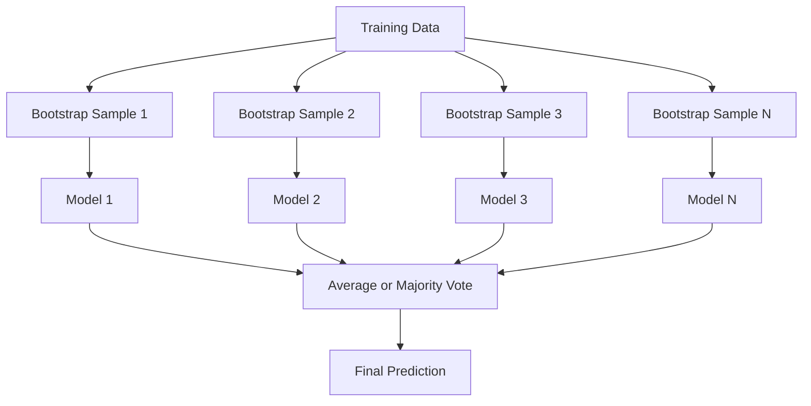
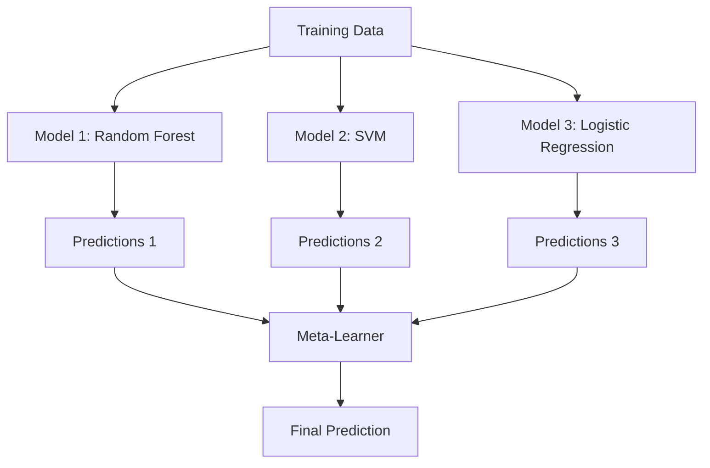

# Ensemble Methods

> 一组 weak learners，如果正确组合，就会成为一个 strong learner。这不是比喻。这是一个定理。

**Type:** Build
**Language:** Python
**Prerequisites:** Phase 2, Lesson 10 (Bias-Variance Tradeoff)
**Time:** ~120 分钟

## 学习目标

- 从零实现 AdaBoost 和 gradient boosting，并解释 boosting 如何按顺序降低 bias
- 构建一个 bagging ensemble，并演示对去相关模型求平均如何在不增加 bias 的情况下降低 variance
- 从每种方法针对的 error component 角度比较 bagging、boosting 和 stacking
- 评估 ensemble diversity，并解释为什么随着更多独立 weak learners 的加入，majority voting accuracy 会提升

## 问题

单个 decision tree 训练速度快且易于解释，但会 overfit。单个 linear model 在复杂边界上会 underfit。你可以花几天时间设计完美的模型架构。或者，你可以组合一批不完美的模型，得到一个比它们中任何单个模型都更好的结果。

Ensemble methods 正是这样做的。它们是在 tabular data 上赢得 Kaggle 比赛最可靠的技术，支撑着大多数生产 ML 系统，并且生动展示了 bias-variance tradeoff 的实际作用。Bagging 降低 variance。Boosting 降低 bias。Stacking 学习在哪些输入上应该信任哪些模型。

## 概念

### 为什么 Ensembles 有效

假设你有 N 个独立 classifiers，每个的 accuracy 都是 p > 0.5。majority vote 的 accuracy 为：

```
P(majority correct) = sum over k > N/2 of C(N,k) * p^k * (1-p)^(N-k)
```

对于 21 个 accuracy 均为 60% 的 classifiers，majority vote accuracy 大约是 74%。如果有 101 个 classifiers，会提升到 84%。当模型犯不同错误时，错误会相互抵消。

关键要求是 **diversity**。如果所有模型都犯同样的错误，组合它们没有任何帮助。Ensembles 有效，是因为它们通过以下方式产生 diverse models：

- 不同的训练子集（bagging）
- 不同的 feature subsets（random forests）
- 顺序式 error correction（boosting）
- 不同的模型家族（stacking）

### Bagging (Bootstrap Aggregating)

Bagging 通过在训练数据的不同 bootstrap sample 上训练每个模型来创造 diversity。



bootstrap sample 是从原始数据中有放回抽样得到的，大小与原始数据相同。每个 bootstrap 中大约会出现 63.2% 的 unique samples。剩下的 36.8%（out-of-bag samples）提供了一个免费的 validation set。

Bagging 在几乎不增加 bias 的情况下降低 variance。每棵单独的 tree 都会 overfit 到自己的 bootstrap sample，但每棵 tree 的 overfitting 不同，因此求平均会抵消 noise。

**Random Forests** 是带有额外机制的 bagging：在每次 split 时，只考虑随机 feature subset。这会迫使 trees 之间产生更多 diversity。典型的候选 feature 数量是 Classification 中的 `sqrt(n_features)`，以及 Regression 中的 `n_features / 3`。

### Boosting（顺序式 Error Correction）

Boosting 按顺序训练模型。每个新模型都关注之前模型预测错误的 examples。


Boosting 降低 bias。每个新模型都会纠正当前 ensemble 的系统性错误。最终 prediction 是所有模型的 weighted sum，其中表现更好的模型会获得更高权重。

权衡在于：如果运行太多轮，boosting 可能会 overfit，因为它会不断拟合更难的 examples，而其中有些可能只是 noise。

### AdaBoost

AdaBoost (Adaptive Boosting) 是第一个实用的 boosting algorithm。它可以与任何 base learner 配合使用，通常使用 decision stumps（depth-1 trees）。

算法：

```
1. Initialize sample weights: w_i = 1/N for all i

2. For t = 1 to T:
   a. Train weak learner h_t on weighted data
   b. Compute weighted error:
      err_t = sum(w_i * I(h_t(x_i) != y_i)) / sum(w_i)
   c. Compute model weight:
      alpha_t = 0.5 * ln((1 - err_t) / err_t)
   d. Update sample weights:
      w_i = w_i * exp(-alpha_t * y_i * h_t(x_i))
   e. Normalize weights to sum to 1

3. Final prediction: H(x) = sign(sum(alpha_t * h_t(x)))
```

error 更低的模型会获得更高的 alpha。被误分类的 samples 会获得更高 weights，让下一个模型重点关注它们。

### Gradient Boosting

Gradient boosting 将 boosting 泛化到任意 Loss Function。它不是重新加权 samples，而是让每个新模型去拟合当前 ensemble 的 residuals（Loss 的 negative Gradient）。

```
1. Initialize: F_0(x) = argmin_c sum(L(y_i, c))

2. For t = 1 to T:
   a. Compute pseudo-residuals:
      r_i = -dL(y_i, F_{t-1}(x_i)) / dF_{t-1}(x_i)
   b. Fit a tree h_t to the residuals r_i
   c. Find optimal step size:
      gamma_t = argmin_gamma sum(L(y_i, F_{t-1}(x_i) + gamma * h_t(x_i)))
   d. Update:
      F_t(x) = F_{t-1}(x) + learning_rate * gamma_t * h_t(x)

3. Final prediction: F_T(x)
```

对于 squared error loss，pseudo-residuals 就是实际 residuals：`r_i = y_i - F_{t-1}(x_i)`。每棵 tree 实际上都在拟合前一个 ensemble 的错误。

learning rate（shrinkage）控制每棵 tree 的贡献程度。更小的 learning rates 需要更多 trees，但泛化效果更好。典型取值：0.01 到 0.3。

### XGBoost：为什么它主导 Tabular Data

XGBoost (eXtreme Gradient Boosting) 是加入工程优化的 gradient boosting，使其快速、准确，并且不容易 overfit：

- **Regularized objective:** 对 leaf weights 施加 L1 和 L2 penalties，防止单棵 tree 过度自信
- **Second-order approximation:** 同时使用 Loss 的一阶和二阶 derivatives，从而做出更好的 split decisions
- **Sparsity-aware splits:** 通过在每次 split 时学习 missing data 的最佳方向，原生处理 missing values
- **Column subsampling:** 像 random forests 一样，在每次 split 时采样 features 以增加 diversity
- **Weighted quantile sketch:** 在 distributed data 上高效寻找 continuous features 的 split points
- **Cache-aware block structure:** 针对 CPU cache lines 优化的 memory layout

对于 tabular data，XGBoost（以及它的后继者 LightGBM）持续优于 Neural Network。这在短期内不会改变。如果你的数据可以放进由 rows 和 columns 组成的表中，请从 gradient boosting 开始。

### Stacking (Meta-Learning)

Stacking 将多个 base models 的 predictions 作为 meta-learner 的 features。



meta-learner 会学习对于哪些输入应该信任哪个 base model。如果 random forest 在某些区域表现更好，而 SVM 在其他区域表现更好，meta-learner 就会学习相应地进行路由。

为了避免 data leakage，base model predictions 必须通过 training set 上的 cross-validation 生成。绝不能在同一批数据上既训练 base models，又生成 meta-features。

### Voting

最简单的 ensemble。直接组合 predictions。

- **Hard voting:** 对 class labels 进行 majority vote。
- **Soft voting:** 对 predicted probabilities 求平均，选择 average probability 最高的 class。通常更好，因为它利用了 confidence information。

```figure
f3-ensemble-average
```

## 构建它

### 步骤 1： Decision Stump（Base Learner）

`code/ensembles.py` 中的代码从零实现了一切。我们从 decision stump 开始：一棵只有一个 split 的 tree。

```python
class DecisionStump:
    def __init__(self):
        self.feature_idx = None
        self.threshold = None
        self.polarity = 1
        self.alpha = None

    def fit(self, X, y, weights):
        n_samples, n_features = X.shape
        best_error = float("inf")

        for f in range(n_features):
            thresholds = np.unique(X[:, f])
            for thresh in thresholds:
                for polarity in [1, -1]:
                    pred = np.ones(n_samples)
                    pred[polarity * X[:, f] < polarity * thresh] = -1
                    error = np.sum(weights[pred != y])
                    if error < best_error:
                        best_error = error
                        self.feature_idx = f
                        self.threshold = thresh
                        self.polarity = polarity

    def predict(self, X):
        n = X.shape[0]
        pred = np.ones(n)
        idx = self.polarity * X[:, self.feature_idx] < self.polarity * self.threshold
        pred[idx] = -1
        return pred
```

### 步骤 2： 从零实现 AdaBoost

```python
class AdaBoostScratch:
    def __init__(self, n_estimators=50):
        self.n_estimators = n_estimators
        self.stumps = []
        self.alphas = []

    def fit(self, X, y):
        n = X.shape[0]
        weights = np.full(n, 1 / n)

        for _ in range(self.n_estimators):
            stump = DecisionStump()
            stump.fit(X, y, weights)
            pred = stump.predict(X)

            err = np.sum(weights[pred != y])
            err = np.clip(err, 1e-10, 1 - 1e-10)

            alpha = 0.5 * np.log((1 - err) / err)
            weights *= np.exp(-alpha * y * pred)
            weights /= weights.sum()

            stump.alpha = alpha
            self.stumps.append(stump)
            self.alphas.append(alpha)

    def predict(self, X):
        total = sum(a * s.predict(X) for a, s in zip(self.alphas, self.stumps))
        return np.sign(total)
```

### 步骤 3： 从零实现 Gradient Boosting

```python
class GradientBoostingScratch:
    def __init__(self, n_estimators=100, learning_rate=0.1, max_depth=3):
        self.n_estimators = n_estimators
        self.lr = learning_rate
        self.max_depth = max_depth
        self.trees = []
        self.initial_pred = None

    def fit(self, X, y):
        self.initial_pred = np.mean(y)
        current_pred = np.full(len(y), self.initial_pred)

        for _ in range(self.n_estimators):
            residuals = y - current_pred
            tree = SimpleRegressionTree(max_depth=self.max_depth)
            tree.fit(X, residuals)
            update = tree.predict(X)
            current_pred += self.lr * update
            self.trees.append(tree)

    def predict(self, X):
        pred = np.full(X.shape[0], self.initial_pred)
        for tree in self.trees:
            pred += self.lr * tree.predict(X)
        return pred
```

### 步骤 4： 与 sklearn 比较

代码会验证我们的 from-scratch implementations 是否能产生与 sklearn 的 `AdaBoostClassifier` 和 `GradientBoostingClassifier` 相近的 accuracy，并将所有方法并排比较。

## 使用它

### 何时使用每种方法

| Method | Reduces | Best for | Watch out for |
|--------|---------|----------|---------------|
| Bagging / Random Forest | Variance | noisy data、features 很多 | 对 bias 没有帮助 |
| AdaBoost | Bias | clean data、简单 base learners | 对 outliers 和 noise 敏感 |
| Gradient Boosting | Bias | tabular data、比赛 | 训练慢，不调参容易 overfit |
| XGBoost / LightGBM | Both | 生产环境 tabular ML | hyperparameters 很多 |
| Stacking | Both | 争取最后 1-2% accuracy | 复杂，存在 meta-learner overfitting 风险 |
| Voting | Variance | 快速组合 diverse models | 只有在模型足够 diverse 时才有帮助 |

### Tabular Data 的 Production Stack

对于大多数 tabular prediction problems，建议按以下顺序尝试：

1. 使用默认参数的 **LightGBM 或 XGBoost**
2. 调优 n_estimators、learning_rate、max_depth、min_child_weight
3. 如果需要最后 0.5% 的提升，构建一个包含 3-5 个 diverse models 的 stacking ensemble
4. 全程使用 cross-validation

尽管研究仍在持续，Neural Network 在 tabular data 上几乎总是比 gradient boosting 差。TabNet、NODE 以及类似架构偶尔能接近，但很少能超过调优良好的 XGBoost。

## 交付它

本课会产出 `outputs/prompt-ensemble-selector.md` -- 一个帮助你为给定 dataset 选择合适 ensemble method 的 prompt。描述你的数据（size、feature types、noise level、class balance）以及你正在解决的问题。该 prompt 会引导你完成一个 decision checklist，推荐一种方法，建议起始 hyperparameters，并提醒该方法常见错误。还会产出 `outputs/skill-ensemble-builder.md`，其中包含完整的选择指南。

## 练习

1. 修改 AdaBoost 实现，跟踪每一轮之后的 training accuracy。绘制 accuracy vs. number of estimators。它什么时候收敛？

2. 通过向 regression tree 添加 random feature subsampling，从零实现一个 random forest。使用 `max_features=sqrt(n_features)` 训练 100 棵 trees 并对 predictions 求平均。将 variance reduction 与单棵 tree 比较。

3. 在 gradient boosting 实现中添加 early stopping：每一轮之后跟踪 validation loss，如果连续 10 轮没有提升则停止。它实际需要多少棵 trees？

4. 构建一个包含三个 base models（logistic regression、decision tree、k-nearest neighbors）和一个 logistic regression meta-learner 的 stacking ensemble。使用 5-fold cross-validation 生成 meta-features。与每个 base model 单独使用时比较。

5. 在同一个 dataset 上使用默认参数运行 XGBoost。将它的 accuracy 与你的 from-scratch gradient boosting 比较。统计两者耗时。速度差距有多大？

## 关键术语

| Term | 常见说法 | 实际含义 |
|------|----------------|----------------------|
| Bagging | “在 random subsets 上训练” | Bootstrap aggregating：在 bootstrap samples 上训练模型，对 predictions 求平均以降低 variance |
| Boosting | “关注 hard examples” | 按顺序训练模型，每个模型纠正当前 ensemble 的错误，以降低 bias |
| AdaBoost | “重新加权数据” | 通过 sample weight updates 实现 boosting；misclassified points 会在下一个 learner 中获得更高 weight |
| Gradient boosting | “拟合 residuals” | 通过让每个新模型拟合 Loss Function 的 negative Gradient 来实现 boosting |
| XGBoost | “Kaggle 武器” | 带有 regularization、second-order optimization 和系统级加速技巧的 gradient boosting |
| Stacking | “模型叠在模型上” | 将 base models 的 predictions 作为 meta-learner 的 input features |
| Random forest | “许多 randomized trees” | 使用 decision trees 的 bagging，并在每次 split 时加入 random feature subsampling 以增加 diversity |
| Ensemble diversity | “犯不同错误” | 模型的错误必须不相关，ensemble 才能优于单个模型 |
| Out-of-bag error | “免费 validation” | 不在某次 bootstrap draw 中的 samples（约 36.8%）可作为 validation set，无需单独 holdout |

## 延伸阅读

- [Schapire & Freund: Boosting: Foundations and Algorithms](https://mitpress.mit.edu/9780262526036/) -- AdaBoost 创建者所著的书
- [Friedman: Greedy Function Approximation: A Gradient Boosting Machine (2001)](https://statweb.stanford.edu/~jhf/ftp/trebst.pdf) -- 原始 gradient boosting 论文
- [Chen & Guestrin: XGBoost (2016)](https://arxiv.org/abs/1603.02754) -- XGBoost 论文
- [Wolpert: Stacked Generalization (1992)](https://www.sciencedirect.com/science/article/abs/pii/S0893608005800231) -- 原始 stacking 论文
- [scikit-learn Ensemble Methods](https://scikit-learn.org/stable/modules/ensemble.html) -- 实用参考
