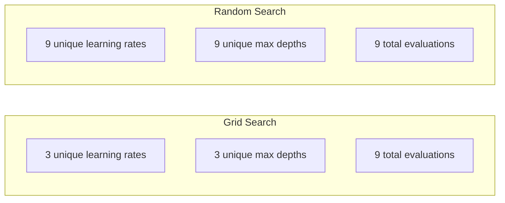
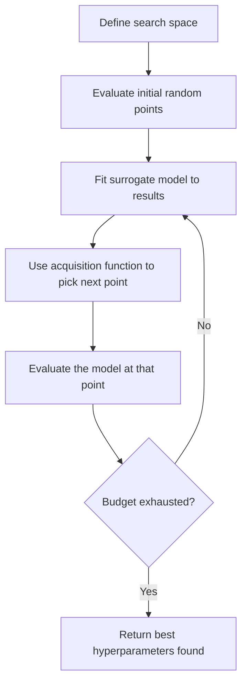
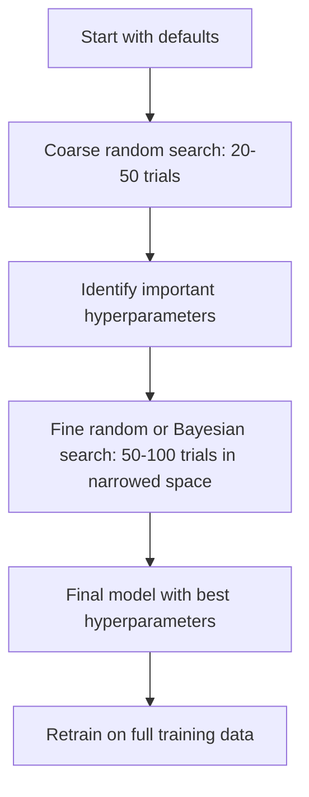
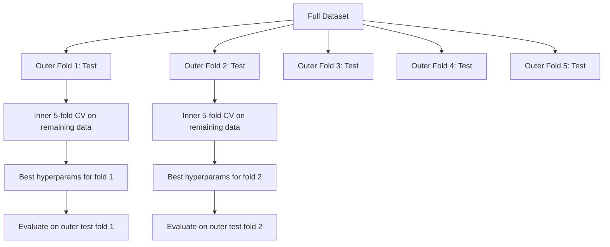

# Hyperparameter Tuning

> Hyperparameters 是训练开始前你要调节的旋钮。调得好不好，决定了模型是平庸还是出色。

**Type:** Build
**Language:** Python
**Prerequisites:** Phase 2, Lesson 11 (Ensemble Methods)
**Time:** ~90 分钟

## 学习目标
- 从零实现 grid search、random search 和 Bayesian optimization，并比较它们的采样效率
- 解释为什么当大多数 hyperparameters 的有效维度较低时，random search 会优于 grid search
- 使用 surrogate model 和 acquisition function 构建 Bayesian optimization 循环来指导搜索
- 设计一种 hyperparameter tuning 策略，通过合适的 cross-validation 避免对 validation set 过拟合

## 问题
你的 gradient boosting 模型有 learning rate、number of trees、max depth、min samples per leaf、subsample ratio 和 column sample ratio。也就是六个 hyperparameters。如果每个都有 5 个合理取值，那么 grid 就有 5^6 = 15,625 种组合。每次训练需要 10 秒。全部尝试一遍需要 43 小时的计算时间。

Grid search 是最直观的方法，也是规模变大后最差的方法。Random search 用更少的计算量能做得更好。Bayesian optimization 通过从过去的评估中学习，效果还会更好。知道该使用哪种策略，以及哪些 hyperparameters 真正重要，可以省下数天浪费的 GPU 时间。

## 概念
### Parameters vs Hyperparameters

Parameters 是在训练过程中学习得到的（weights、biases、split thresholds）。Hyperparameters 是训练开始前设置的，用来控制学习如何发生。

| Hyperparameter | 控制什么 | 典型范围 |
|---------------|-----------------|---------------|
| Learning rate | 每次更新的步长 | 0.001 到 1.0 |
| Number of trees/epochs | 训练时长 | 10 到 10,000 |
| Max depth | 模型复杂度 | 1 到 30 |
| Regularization (lambda) | 防止过拟合 | 0.0001 到 100 |
| Batch size | Gradient 估计噪声 | 16 到 512 |
| Dropout rate | 被丢弃的 neurons 比例 | 0.0 到 0.5 |

### Grid Search

Grid search 会评估指定取值的每一种组合。它是穷举式的，也容易理解，但会随着 hyperparameters 数量呈指数级增长。

```
Grid for 2 hyperparameters:

  learning_rate: [0.01, 0.1, 1.0]
  max_depth:     [3, 5, 7]

  Evaluations: 3 x 3 = 9 combinations

  (0.01, 3)  (0.01, 5)  (0.01, 7)
  (0.1,  3)  (0.1,  5)  (0.1,  7)
  (1.0,  3)  (1.0,  5)  (1.0,  7)
```

Grid search 有一个根本缺陷：如果一个 hyperparameter 很重要，而另一个不重要，大多数评估都会被浪费。9 次评估里，重要参数只有 3 个唯一取值。

### Random Search

Random search 不是从 grid 中取值，而是从分布中采样 hyperparameters。在同样 9 次评估的预算下，每个 hyperparameter 都能得到 9 个唯一取值。



为什么 random 会胜过 grid（Bergstra & Bengio, 2012）：

- 大多数 hyperparameters 的有效维度很低。对于给定问题，6 个 hyperparameters 中通常只有 1-2 个真正重要。
- Grid search 会把评估浪费在不重要的维度上。
- 在相同预算下，random search 会更密集地覆盖重要维度。
- 在 60 次 random trials 下，如果 search space 中存在最优点，你有 95% 的概率找到一个距离最优点 5% 以内的点。

### Bayesian Optimization

Random search 会忽略结果。它不会学习到较高的 learning rates 会导致 divergence，也不会学习到 depth 3 一直优于 depth 10。Bayesian optimization 使用过去的评估结果来决定下一步搜索哪里。



两个关键组件：

**Surrogate model:** 一个评估成本低的模型（通常是 Gaussian process），用于近似昂贵的 objective function。它会在 search space 的任意点给出预测值和不确定性估计。

**Acquisition function:** 通过平衡 exploitation（在已知好点附近搜索）和 exploration（在不确定性高的区域搜索），决定下一步评估哪里。常见选择包括：

- **Expected Improvement (EI):** 我们预计这个点相对当前最优值能提升多少？
- **Upper Confidence Bound (UCB):** 预测值加上不确定性的某个倍数。更高的 UCB 表示这个点有潜力，或者还没有充分探索。
- **Probability of Improvement (PI):** 这个点超过当前最优值的概率是多少？

Bayesian optimization 通常能用比 random search 少 2-5 倍的评估次数找到更好的 hyperparameters。与训练真实模型相比，拟合 surrogate model 的开销可以忽略不计。

### Early Stopping

不是每次训练都需要跑完。如果某个配置在 10 个 epochs 后明显很差，就停止它并继续下一个。这就是 hyperparameter search 语境下的 early stopping。

策略：
- **Patience-based:** 如果 validation loss 连续 N 个 epochs 没有提升，就停止
- **Median pruning:** 如果某个 trial 的中间结果比同一步骤已完成 trials 的中位数更差，就停止
- **Hyperband:** 给许多配置分配较小预算，然后逐步增加最佳配置的预算

Hyperband 尤其有效。它先用 1 个 epoch 启动 81 个配置，保留前三分之一，给它们 3 个 epochs，再保留前三分之一，依此类推。相比用完整预算评估所有配置，这能快 10-50 倍找到好的配置。

### Learning Rate Schedulers

Learning rate 几乎总是最重要的 hyperparameter。与其保持固定，不如用 schedulers 在训练过程中调整它。

| Scheduler | Formula | 何时使用 |
|-----------|---------|-------------|
| Step decay | 每 N 个 epochs 乘以 0.1 | 经典 CNN 训练 |
| Cosine annealing | lr * 0.5 * (1 + cos(pi * t / T)) | 现代默认选择 |
| Warmup + decay | 先线性增加，再 cosine decay | Transformers |
| One-cycle | 在一个 cycle 内先增加再减少 | 快速收敛 |
| Reduce on plateau | 指标停滞时按因子降低 | 稳妥默认选择 |

### Hyperparameter Importance

并非所有 hyperparameters 都同等重要。关于 random forests（Probst et al., 2019）和 gradient boosting 的研究显示出一致模式：

**高重要性：**
- Learning rate（始终优先调）
- Number of estimators / epochs（使用 early stopping，而不是调它）
- Regularization strength

**中等重要性：**
- Max depth / number of layers
- Min samples per leaf / weight decay
- Subsample ratio

**低重要性：**
- Max features（对于 random forests）
- 具体 activation function 的选择
- Batch size（在合理范围内）

先调重要的，其余保留默认值。

### Practical Strategy



具体工作流：

1. **从库的默认值开始。** 它们由经验丰富的实践者选择，通常已经达到 80% 的效果。
2. **粗粒度 random search。** 使用宽范围，20-50 次 trials。用 early stopping 快速终止差的 runs。
3. **分析结果。** 哪些 hyperparameters 与性能相关？缩小 search space。
4. **精细搜索。** 在缩小后的空间中使用 Bayesian optimization 或聚焦的 random search。50-100 次 trials。
5. **使用找到的最佳 hyperparameters 在全部训练数据上重新训练。**

### Cross-Validation 集成

在单个 validation split 上调 hyperparameters 有风险。最佳 hyperparameters 可能过拟合到特定 validation fold。Nested cross-validation 通过使用两层循环解决这个问题：

- **Outer loop**（评估）：将数据拆分为 train+val 和 test。报告无偏性能。
- **Inner loop**（调优）：将 train+val 拆分为 train 和 val。寻找最佳 hyperparameters。



每个 outer fold 都会独立找到自己的最佳 hyperparameters。Outer scores 是 generalization performance 的无偏估计。

使用 sklearn：

```python
from sklearn.model_selection import cross_val_score, GridSearchCV
from sklearn.ensemble import GradientBoostingRegressor

inner_cv = GridSearchCV(
    GradientBoostingRegressor(),
    param_grid={
        "learning_rate": [0.01, 0.05, 0.1],
        "max_depth": [2, 3, 5],
        "n_estimators": [50, 100, 200],
    },
    cv=5,
    scoring="neg_mean_squared_error",
)

outer_scores = cross_val_score(
    inner_cv, X, y, cv=5, scoring="neg_mean_squared_error"
)

print(f"Nested CV MSE: {-outer_scores.mean():.4f} +/- {outer_scores.std():.4f}")
```

这很昂贵（5 个 outer folds x 5 个 inner folds x 27 个 grid points = 675 次 model fits），但它能给出可信的性能估计。当你在论文中报告最终结果，或决策风险较高时使用它。

### Practical Tips

**从 learning rate 开始。** 对 gradient-based 方法来说，它始终是最重要的 hyperparameter。糟糕的 learning rate 会让其他所有设置都失去意义。先把其他 hyperparameters 固定为默认值，并扫描 learning rate。

**对 learning rate 和 regularization 使用 log-uniform distributions。** 0.001 和 0.01 的差异，与 0.1 和 1.0 的差异同样重要。线性搜索会把预算浪费在较大的一端。

**使用 early stopping，而不是调 n_estimators。** 对 boosting 和 neural networks 来说，把 n_estimators 或 epochs 设得较高，让 early stopping 决定何时停止。这会从搜索中移除一个 hyperparameter。

**预算分配。** 将 60% 的调优预算花在最重要的前 2 个 hyperparameters 上。剩余 40% 用于其他所有参数。前 2 个解释了大部分性能变化。

**尺度很重要。** 永远不要在 log scale 上搜索 batch size（16、32、64 就可以）。始终在 log scale 上搜索 learning rate。让搜索分布匹配 hyperparameter 影响模型的方式。

| Model Type | Top Hyperparameters | Recommended Search | Budget |
|-----------|--------------------|--------------------|--------|
| Random Forest | n_estimators, max_depth, min_samples_leaf | Random search，50 次 trials | 低（训练快） |
| Gradient Boosting | learning_rate, n_estimators, max_depth | Bayesian，100 次 trials + early stopping | 中 |
| Neural Network | learning_rate, weight_decay, batch_size | Bayesian 或 random，100+ 次 trials | 高（训练慢） |
| SVM | C, gamma (RBF kernel) | 在 log scale 上 grid，25-50 次 trials | 低（2 个参数） |
| Lasso/Ridge | alpha | 在 log scale 上 1D search，20 次 trials | 很低 |
| XGBoost | learning_rate, max_depth, subsample, colsample | Bayesian，100-200 次 trials + early stopping | 中 |

**拿不准时：** 使用 random search，trials 数量至少为 hyperparameters 数量的 2 倍（例如，6 个 hyperparameters = 至少 12 次 trials）。你会惊讶地发现，50 次 trials 的 random search 经常能击败精心设计的 grid search。


```figure
k-fold-cv
```

## 构建它
### 步骤 1：从零实现 Grid Search

`code/tuning.py` 中的代码从零实现了 grid search、random search 和一个简单的 Bayesian optimizer。

```python
def grid_search(model_fn, param_grid, X_train, y_train, X_val, y_val):
    keys = list(param_grid.keys())
    values = list(param_grid.values())
    best_score = -float("inf")
    best_params = None
    n_evals = 0

    for combo in itertools.product(*values):
        params = dict(zip(keys, combo))
        model = model_fn(**params)
        model.fit(X_train, y_train)
        score = evaluate(model, X_val, y_val)
        n_evals += 1

        if score > best_score:
            best_score = score
            best_params = params

    return best_params, best_score, n_evals
```

### 步骤 2： 从零实现 Random Search

```python
def random_search(model_fn, param_distributions, X_train, y_train,
                  X_val, y_val, n_iter=50, seed=42):
    rng = np.random.RandomState(seed)
    best_score = -float("inf")
    best_params = None

    for _ in range(n_iter):
        params = {k: sample(v, rng) for k, v in param_distributions.items()}
        model = model_fn(**params)
        model.fit(X_train, y_train)
        score = evaluate(model, X_val, y_val)

        if score > best_score:
            best_score = score
            best_params = params

    return best_params, best_score, n_iter
```

### 步骤 3：Bayesian Optimization（简化版）

核心思想：将 Gaussian process 拟合到已观测的（hyperparameter, score）配对上，然后用 acquisition function 决定下一步看哪里。

```python
class SimpleBayesianOptimizer:
    def __init__(self, search_space, n_initial=5):
        self.search_space = search_space
        self.n_initial = n_initial
        self.X_observed = []
        self.y_observed = []

    def _kernel(self, x1, x2, length_scale=1.0):
        dists = np.sum((x1[:, None, :] - x2[None, :, :]) ** 2, axis=2)
        return np.exp(-0.5 * dists / length_scale ** 2)

    def _fit_gp(self, X_new):
        X_obs = np.array(self.X_observed)
        y_obs = np.array(self.y_observed)
        y_mean = y_obs.mean()
        y_centered = y_obs - y_mean

        K = self._kernel(X_obs, X_obs) + 1e-4 * np.eye(len(X_obs))
        K_star = self._kernel(X_new, X_obs)

        L = np.linalg.cholesky(K)
        alpha = np.linalg.solve(L.T, np.linalg.solve(L, y_centered))
        mu = K_star @ alpha + y_mean

        v = np.linalg.solve(L, K_star.T)
        var = 1.0 - np.sum(v ** 2, axis=0)
        var = np.maximum(var, 1e-6)

        return mu, var

    def _expected_improvement(self, mu, var, best_y):
        sigma = np.sqrt(var)
        z = (mu - best_y) / (sigma + 1e-10)
        ei = sigma * (z * norm_cdf(z) + norm_pdf(z))
        return ei

    def suggest(self):
        if len(self.X_observed) < self.n_initial:
            return sample_random(self.search_space)

        candidates = [sample_random(self.search_space) for _ in range(500)]
        X_cand = np.array([to_vector(c) for c in candidates])
        mu, var = self._fit_gp(X_cand)
        ei = self._expected_improvement(mu, var, max(self.y_observed))
        return candidates[np.argmax(ei)]

    def observe(self, params, score):
        self.X_observed.append(to_vector(params))
        self.y_observed.append(score)
```

GP surrogate 在每个候选点给出两样东西：预测分数（mu）和不确定性（var）。Expected Improvement 会平衡二者：它偏好模型预测高分的点，或者不确定性高的点。早期大多数点都有较高不确定性，因此 optimizer 会进行探索。后期则会聚焦到最有希望的区域。

### 步骤 4: 比较所有方法

在同一个 synthetic objective 上运行三种方法并比较。这个比较使用了一个简化 wrapper，直接用 objective function 调用每个 optimizer（没有模型训练），因此 API 与上面的 model-based 实现不同：

```python
def synthetic_objective(params):
    lr = params["learning_rate"]
    depth = params["max_depth"]
    return -(np.log10(lr) + 2) ** 2 - (depth - 4) ** 2 + 10

param_grid = {
    "learning_rate": [0.001, 0.01, 0.1, 1.0],
    "max_depth": [2, 3, 4, 5, 6, 7, 8],
}

grid_best = None
grid_score = -float("inf")
grid_history = []
for combo in itertools.product(*param_grid.values()):
    params = dict(zip(param_grid.keys(), combo))
    score = synthetic_objective(params)
    grid_history.append((params, score))
    if score > grid_score:
        grid_score = score
        grid_best = params

param_dist = {
    "learning_rate": ("log_float", 0.001, 1.0),
    "max_depth": ("int", 2, 8),
}

rand_best = None
rand_score = -float("inf")
rand_history = []
rng = np.random.RandomState(42)
for _ in range(28):
    params = {k: sample(v, rng) for k, v in param_dist.items()}
    score = synthetic_objective(params)
    rand_history.append((params, score))
    if score > rand_score:
        rand_score = score
        rand_best = params

optimizer = SimpleBayesianOptimizer(param_dist, n_initial=5)
bayes_history = []
for _ in range(28):
    params = optimizer.suggest()
    score = synthetic_objective(params)
    optimizer.observe(params, score)
    bayes_history.append((params, score))
bayes_score = max(s for _, s in bayes_history)

print(f"{'Method':<20} {'Best Score':>12} {'Evaluations':>12}")
print("-" * 50)
print(f"{'Grid Search':<20} {grid_score:>12.4f} {len(grid_history):>12}")
print(f"{'Random Search':<20} {rand_score:>12.4f} {len(rand_history):>12}")
print(f"{'Bayesian Opt':<20} {bayes_score:>12.4f} {len(bayes_history):>12}")
```

在相同预算下，Bayesian optimization 通常能最快找到最佳分数，因为它不会把评估浪费在明显糟糕的区域。Random search 覆盖的范围比 grid search 更广。Grid search 只在 hyperparameters 很少且你负担得起穷举时才会胜出。

## 使用它
### Optuna in Practice

Optuna 是严肃 hyperparameter tuning 的推荐库。它开箱即支持 pruning、distributed search 和 visualization。

```python
import optuna

def objective(trial):
    lr = trial.suggest_float("learning_rate", 1e-4, 1e-1, log=True)
    n_est = trial.suggest_int("n_estimators", 50, 500)
    max_depth = trial.suggest_int("max_depth", 2, 10)

    model = GradientBoostingRegressor(
        learning_rate=lr,
        n_estimators=n_est,
        max_depth=max_depth,
    )
    model.fit(X_train, y_train)
    return mean_squared_error(y_val, model.predict(X_val))

study = optuna.create_study(direction="minimize")
study.optimize(objective, n_trials=100)

print(f"Best params: {study.best_params}")
print(f"Best MSE: {study.best_value:.4f}")
```

Optuna 的关键特性：
- `suggest_float(..., log=True)` 用于最适合在 log scale 上搜索的参数（learning rate、regularization）
- `suggest_int` 用于整数参数
- `suggest_categorical` 用于离散选择
- 内置 MedianPruner，用于对糟糕 trials 进行 early stopping
- `study.trials_dataframe()` 用于分析

### Optuna with Pruning

Pruning 会提前停止没有希望的 trials，从而节省大量计算。模式如下：

```python
import optuna
from sklearn.model_selection import cross_val_score

def objective(trial):
    params = {
        "learning_rate": trial.suggest_float("lr", 1e-4, 0.5, log=True),
        "max_depth": trial.suggest_int("max_depth", 2, 10),
        "n_estimators": trial.suggest_int("n_estimators", 50, 500),
        "subsample": trial.suggest_float("subsample", 0.5, 1.0),
    }

    model = GradientBoostingRegressor(**params)
    scores = cross_val_score(model, X_train, y_train, cv=3,
                             scoring="neg_mean_squared_error")
    mean_score = -scores.mean()

    trial.report(mean_score, step=0)
    if trial.should_prune():
        raise optuna.TrialPruned()

    return mean_score

pruner = optuna.pruners.MedianPruner(n_startup_trials=10, n_warmup_steps=5)
study = optuna.create_study(direction="minimize", pruner=pruner)
study.optimize(objective, n_trials=200)
```

`MedianPruner` 会在某个 trial 的中间值比同一步骤所有已完成 trials 的中位数更差时停止它。Pruning 需要调用 `trial.report()` 报告中间指标，并调用 `trial.should_prune()` 检查该 trial 是否应该停止。`n_startup_trials=10` 确保至少有 10 个 trials 完整完成后，pruning 才会启动。这通常能节省 40-60% 的总计算量。

### sklearn's Built-in Tuners

对于快速实验，sklearn 提供了 `GridSearchCV`、`RandomizedSearchCV` 和 `HalvingRandomSearchCV`：

```python
from sklearn.model_selection import RandomizedSearchCV
from scipy.stats import loguniform, randint

param_dist = {
    "learning_rate": loguniform(1e-4, 0.5),
    "max_depth": randint(2, 10),
    "n_estimators": randint(50, 500),
}

search = RandomizedSearchCV(
    GradientBoostingRegressor(),
    param_dist,
    n_iter=100,
    cv=5,
    scoring="neg_mean_squared_error",
    random_state=42,
    n_jobs=-1,
)
search.fit(X_train, y_train)
print(f"Best params: {search.best_params_}")
print(f"Best CV MSE: {-search.best_score_:.4f}")
```

对 learning rate 和 regularization 使用 scipy 的 `loguniform`。对整数 hyperparameters 使用 `randint`。`n_jobs=-1` 标志会在所有 CPU cores 上并行。

### Hyperparameter Tuning 中的常见错误

**通过 preprocessing 产生 data leakage。** 如果你在 cross-validation 前先在完整 dataset 上 fit 一个 scaler，validation fold 的信息就会泄漏到训练中。始终把 preprocessing 放进 `Pipeline`，这样它只会在 training fold 上 fit。

**对 validation set 过拟合。** 运行数千次 trials 实际上等于在 validation set 上训练。最终性能估计应使用 nested cross-validation，或者留出一个在调优期间从不触碰的独立 test set。

**搜索范围太窄。** 如果你的最佳值位于 search space 的边界，说明搜索范围不够宽。最优值可能在范围之外。始终检查最佳参数是否落在边缘。

**忽略交互效应。** 在 boosting 中，learning rate 和 number of estimators 有强交互。较低的 learning rate 需要更多 estimators。独立调它们会比一起调效果更差。

**没有对 iterative models 使用 early stopping。** 对 gradient boosting 和 neural networks，将 n_estimators 或 epochs 设置为较高值并使用 early stopping。这严格优于把迭代次数作为 hyperparameter 来调。

## 练习
1. 用相同总预算运行 grid search 和 random search（例如 50 次评估）。比较找到的最佳分数。用不同 seeds 运行实验 10 次。Random search 赢了多少次？

2. 从零实现 Hyperband。从 81 个配置开始，每个训练 1 个 epoch。每轮保留前 1/3，并将它们的预算增加到 3 倍。将总计算量（所有 configs 的 epochs 总和）与用完整预算运行 81 个 configs 进行比较。

3. 给 Lesson 11 中的 gradient boosting 实现添加一个 learning rate scheduler（cosine annealing）。与固定 learning rate 相比，它有帮助吗？

4. 使用 Optuna 在真实 dataset（例如 sklearn 的 breast cancer dataset）上调 RandomForestClassifier。使用 `optuna.visualization.plot_param_importances(study)` 查看哪些 hyperparameters 最重要。它是否匹配本课中的重要性排序？

5. 实现一个简单的 acquisition function（Expected Improvement），并演示 exploration vs exploitation。绘制 surrogate model 的均值和不确定性，并展示 EI 选择下一步评估的位置。

## 关键术语
| Term | 人们通常说 | 实际含义 |
|------|----------------|----------------------|
| Hyperparameter | “你选择的一个设置” | 训练前设置的值，用来控制学习过程，不是从数据中学习得到的 |
| Grid search | “尝试每一种组合” | 在指定 parameter grid 上进行穷举搜索。成本呈指数级增长。 |
| Random search | “就是随机采样” | 从分布中采样 hyperparameters。比 grid search 更好地覆盖重要维度。 |
| Bayesian optimization | “智能搜索” | 使用 objective 的 surrogate model 来决定下一步评估哪里，平衡 exploration 和 exploitation |
| Surrogate model | “一个便宜的近似” | 一个模型（通常是 Gaussian process），根据已观测评估来近似昂贵的 objective function |
| Acquisition function | “下一步看哪里” | 通过平衡 expected improvement 和不确定性，为候选点打分。EI 和 UCB 是常见选择。 |
| Early stopping | “停止浪费时间” | 当 validation performance 停止提升时，提前终止训练 |
| Hyperband | “配置的锦标赛分组” | 自适应资源分配：用小预算启动许多 configs，保留最好的并增加它们的预算 |
| Learning rate scheduler | “训练期间改变 lr” | 一个函数，用于在训练过程中调整 learning rate，以获得更好的收敛 |

## 延伸阅读
- [Bergstra & Bengio: Random Search for Hyper-Parameter Optimization (2012)](https://jmlr.org/papers/v13/bergstra12a.html) -- 证明 random 胜过 grid 的论文
- [Snoek et al., Practical Bayesian Optimization of Machine Learning Algorithms (2012)](https://arxiv.org/abs/1206.2944) -- 用于 ML 的 Bayesian optimization
- [Li et al., Hyperband: A Novel Bandit-Based Approach (2018)](https://jmlr.org/papers/v18/16-558.html) -- Hyperband 论文
- [Optuna: A Next-generation Hyperparameter Optimization Framework](https://arxiv.org/abs/1907.10902) -- Optuna 论文
- [Probst et al., Tunability: Importance of Hyperparameters (2019)](https://jmlr.org/papers/v20/18-444.html) -- 哪些 hyperparameters 重要
