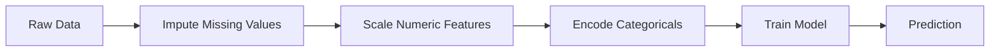
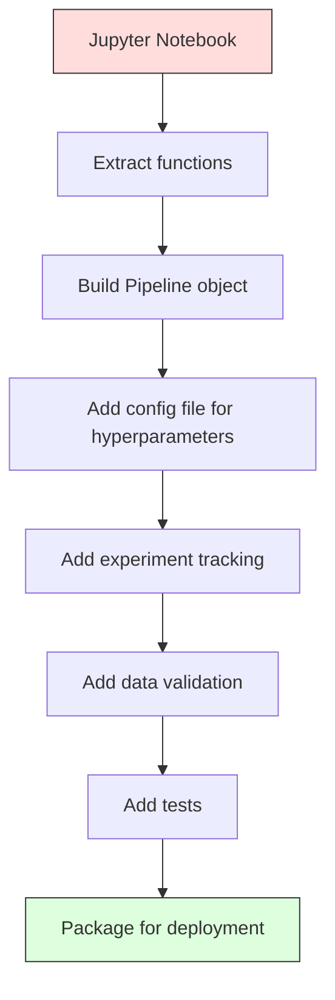

# ML Pipelines

> 模型不是产品。Pipeline 才是。Pipeline 覆盖从 raw data 到 deployed prediction 的全部过程，并且每一步都必须可复现。

**Type:** Build
**Language:** Python
**Prerequisites:** Phase 2, Lesson 12 (Hyperparameter Tuning)
**Time:** ~120 minutes

## 学习目标
- 从零构建一个 ML Pipeline，将 imputation、scaling、encoding 和 model training 串联成一个可复现的单一对象
- 识别 data leakage 场景，并解释 Pipeline 如何通过只在 training data 上拟合 transformers 来防止泄漏
- 构建一个 ColumnTransformer，对 numeric 和 categorical features 应用不同的 preprocessing
- 实现 Pipeline serialization，并证明同一个已拟合的 Pipeline 在 training 和 production 中会产生一致结果

## 问题
你有一个 notebook：它加载数据，用 median 填充 missing values，缩放 features，训练模型，并打印 accuracy。它能运行。于是你上线了它。

一个月后，有人重新训练模型，却得到了不同结果。median 是在包含 test data 的完整 dataset 上计算的（data leakage）。scaling 参数没有保存，所以 inference 使用了不同的统计量。feature engineering 代码在 training 和 serving 之间被复制粘贴，两个副本逐渐产生差异。某个 categorical column 在 production 中出现了 encoder 从未见过的新值。

这些并不是假设情况。它们是 ML 系统在 production 中失败的最常见原因。Pipeline 通过把每个 transformation step 打包成一个单一、有序、可复现的对象来解决这些问题。

## 概念
### What a Pipeline Is

Pipeline 是一组有序的数据 transformations，后面接一个模型。每一步都以前一步的输出作为输入。整个 Pipeline 只在 training data 上拟合一次。在 inference 时，同一个已拟合的 Pipeline 会转换 new data 并产生 predictions。



Pipeline 保证：
- Transformations 只在 training data 上拟合（无泄漏）
- Inference 时应用完全相同的 transformations
- 整个对象可以被 serialized，并作为一个 artifact 部署
- Cross-validation 会在每个 fold 内应用 Pipeline，防止细微的泄漏

### 数据泄漏：沉默的杀手

Data leakage 发生在 test set 或 future data 中的信息污染 training 的时候。Pipeline 可以防止最常见的泄漏形式。

**Leaky（错误）：**
```python
X = df.drop("target", axis=1)
y = df["target"]

scaler = StandardScaler()
X_scaled = scaler.fit_transform(X)

X_train, X_test = X_scaled[:800], X_scaled[800:]
y_train, y_test = y[:800], y[800:]
```

scaler 看到了 test data。mean 和 standard deviation 包含了 test samples。这会夸大 accuracy 估计。

**Correct：**
```python
X_train, X_test = X[:800], X[800:]

scaler = StandardScaler()
X_train_scaled = scaler.fit_transform(X_train)
X_test_scaled = scaler.transform(X_test)
```

使用 Pipeline 时，你不需要专门思考这个问题。Pipeline 会自动处理。

### sklearn Pipeline

sklearn 的 `Pipeline` 会串联 transformers 和一个 estimator。它暴露 `.fit()`、`.predict()` 和 `.score()`，按顺序应用所有步骤。

```python
from sklearn.pipeline import Pipeline
from sklearn.preprocessing import StandardScaler
from sklearn.linear_model import LogisticRegression

pipe = Pipeline([
    ("scaler", StandardScaler()),
    ("model", LogisticRegression()),
])

pipe.fit(X_train, y_train)
predictions = pipe.predict(X_test)
```

当你调用 `pipe.fit(X_train, y_train)` 时：
1. Scaler 在 X_train 上调用 `fit_transform`
2. Model 在 scaled X_train 上调用 `fit`

当你调用 `pipe.predict(X_test)` 时：
1. Scaler 在 X_test 上调用 `transform`（不是 fit_transform）
2. Model 在 scaled X_test 上调用 `predict`

scaler 在 fitting 过程中永远不会看到 test data。这就是核心目的。

### ColumnTransformer：不同列使用不同 Pipelines

真实 dataset 同时包含 numeric 和 categorical columns，它们需要不同的 preprocessing。`ColumnTransformer` 负责处理这种情况。

```python
from sklearn.compose import ColumnTransformer
from sklearn.preprocessing import StandardScaler, OneHotEncoder
from sklearn.impute import SimpleImputer

numeric_pipe = Pipeline([
    ("impute", SimpleImputer(strategy="median")),
    ("scale", StandardScaler()),
])

categorical_pipe = Pipeline([
    ("impute", SimpleImputer(strategy="most_frequent")),
    ("encode", OneHotEncoder(handle_unknown="ignore")),
])

preprocessor = ColumnTransformer([
    ("num", numeric_pipe, ["age", "income", "score"]),
    ("cat", categorical_pipe, ["city", "gender", "plan"]),
])

full_pipeline = Pipeline([
    ("preprocess", preprocessor),
    ("model", GradientBoostingClassifier()),
])
```

OneHotEncoder 中的 `handle_unknown="ignore"` 对 production 至关重要。当出现新 category（例如模型从未见过的城市）时，它会产生一个全零 Vector，而不是直接崩溃。

### Experiment Tracking

Pipeline 让 training 可复现，但你还需要追踪 experiments 之间发生了什么：使用了哪些 hyperparameters、哪个 dataset version、metrics 是什么、运行的是哪份代码。

**MLflow** 是最常见的 open-source 解决方案：

```python
import mlflow

with mlflow.start_run():
    mlflow.log_param("max_depth", 5)
    mlflow.log_param("n_estimators", 100)
    mlflow.log_param("learning_rate", 0.1)

    pipe.fit(X_train, y_train)
    accuracy = pipe.score(X_test, y_test)

    mlflow.log_metric("accuracy", accuracy)
    mlflow.sklearn.log_model(pipe, "model")
```

每次 run 都会记录 parameters、metrics、artifacts 和完整模型。你可以比较 runs，复现任意 experiment，并部署任意 model version。

**Weights & Biases (wandb)** 提供相同功能，并带有 hosted dashboard：

```python
import wandb

wandb.init(project="my-pipeline")
wandb.config.update({"max_depth": 5, "n_estimators": 100})

pipe.fit(X_train, y_train)
accuracy = pipe.score(X_test, y_test)

wandb.log({"accuracy": accuracy})
```

### Model Versioning

完成 experiment tracking 后，你需要管理 model versions。哪个模型在 production？哪个在 staging？上周用的是哪个？

MLflow 的 Model Registry 提供：
- **Version tracking:** 每个保存的模型都会获得一个 version number
- **Stage transitions:** "Staging"、"Production"、"Archived"
- **Approval workflow:** 模型必须被明确 promoted 到 production
- **Rollback:** 立即切回之前的 version

### Data Versioning with DVC

代码用 git 做 versioning。数据也应该被 versioned，但 git 无法处理大文件。DVC (Data Version Control) 解决了这个问题。

```
dvc init
dvc add data/training.csv
git add data/training.csv.dvc data/.gitignore
git commit -m "Track training data"
dvc push
```

DVC 会把实际数据存储在 remote storage（S3、GCS、Azure）中，并在 git 中保留一个很小的 `.dvc` 文件来记录 hash。当你 checkout 某个 git commit 时，`dvc checkout` 会恢复当时使用的精确数据。

这意味着每个 git commit 都同时固定了代码和数据。实现完整可复现。

### Reproducible Experiments

一个可复现的 experiment 需要四件事：

1. **Fixed random seeds:** 为 numpy、random 和 framework（torch、sklearn）设置 seeds
2. **Pinned dependencies:** 使用带精确版本的 requirements.txt 或 poetry.lock
3. **Versioned data:** 使用 DVC 或类似工具
4. **Config files:** 所有 hyperparameters 都放在 config 中，而不是 hardcoded

```python
import numpy as np
import random

def set_seed(seed=42):
    random.seed(seed)
    np.random.seed(seed)
    try:
        import torch
        torch.manual_seed(seed)
        torch.cuda.manual_seed_all(seed)
        torch.backends.cudnn.deterministic = True
    except ImportError:
        pass
```

### 从 Notebook 到 Production Pipeline



典型演进过程：

1. **Notebook exploration:** 快速 experiments、visualizations、feature ideas
2. **Extract functions:** 将 preprocessing、feature engineering、evaluation 移入 modules
3. **Build Pipeline:** 将 transformations 串联成 sklearn Pipeline 或 custom class
4. **Config management:** 将所有 hyperparameters 移入 YAML/JSON config
5. **Experiment tracking:** 添加 MLflow 或 wandb logging
6. **Data validation:** 在 training 前检查 schema、distributions 和 missing value patterns
7. **Tests:** 为 transformers 编写 unit tests，为完整 Pipeline 编写 integration tests
8. **Deployment:** Serialize Pipeline，用 API（FastAPI、Flask）封装，并 containerize

### Common Pipeline Mistakes

| Mistake | Why it is bad | Fix |
|---------|-------------|-----|
| 在 splitting 前对完整数据 fitting | Data leakage | 使用带 cross_val_score 的 Pipeline |
| 在 Pipeline 外做 feature engineering | Train 与 serve 时 transforms 不一致 | 把所有 transforms 放入 Pipeline |
| 不处理 unknown categories | Production 中出现新值会崩溃 | OneHotEncoder(handle_unknown="ignore") |
| Hardcoded column names | schema 变化时会出错 | 从 config 使用 column name lists |
| 没有 data validation | bad data 会导致悄无声息的错误 predictions | 在 prediction 前添加 schema checks |
| Training/serving skew | 模型在 prod 中看到不同 features | training 和 serving 共用一个 Pipeline 对象 |

```figure
f3-pipeline-flow
```

## 构建它
`code/pipeline.py` 中的代码从零构建了一个完整 ML Pipeline：

### 步骤 1： Custom Transformer

```python
class CustomTransformer:
    def __init__(self):
        self.means = None
        self.stds = None

    def fit(self, X):
        self.means = np.mean(X, axis=0)
        self.stds = np.std(X, axis=0)
        self.stds[self.stds == 0] = 1.0
        return self

    def transform(self, X):
        return (X - self.means) / self.stds

    def fit_transform(self, X):
        return self.fit(X).transform(X)
```

### 步骤 2：从零构建 Pipeline

```python
class PipelineFromScratch:
    def __init__(self, steps):
        self.steps = steps

    def fit(self, X, y=None):
        X_current = X.copy()
        for name, step in self.steps[:-1]:
            X_current = step.fit_transform(X_current)
        name, model = self.steps[-1]
        model.fit(X_current, y)
        return self

    def predict(self, X):
        X_current = X.copy()
        for name, step in self.steps[:-1]:
            X_current = step.transform(X_current)
        name, model = self.steps[-1]
        return model.predict(X_current)
```

### 步骤 3: 使用 Pipeline 进行 Cross-Validation

代码演示了使用 Pipeline 的 cross-validation 如何防止 data leakage：scaler 会分别在每个 fold 的 training data 上 fit。

### 第 4 步：使用 sklearn 的完整 Production Pipeline

一个完整 Pipeline，包含 `ColumnTransformer`、多条 preprocessing paths 和一个模型，并使用正确的 cross-validation 与 experiment logging 进行训练。

## 交付它
本课产出：
- `outputs/prompt-ml-pipeline.md` -- 用于构建和调试 ML Pipelines 的 skill
- `code/pipeline.py` -- 一个完整 Pipeline，从 scratch 实现到 sklearn 版本

## 练习
1. 构建一个 Pipeline，处理包含 3 个 numeric columns 和 2 个 categorical columns 的 dataset。使用 `ColumnTransformer` 对 numerics 应用 median imputation + scaling，对 categoricals 应用 most-frequent imputation + one-hot encoding。使用 5-fold cross-validation 进行训练。

2. 故意引入 data leakage：在 splitting 前对完整 dataset fit scaler。比较 cross-validation score（leaky）和 Pipeline cross-validation score（clean）。差异有多大？

3. 使用 `joblib.dump` serialize 你的 Pipeline。在单独脚本中加载它并运行 predictions。验证 predictions 完全一致。

4. 向 Pipeline 添加一个 custom transformer，为两个最重要的 numeric columns 创建 polynomial features（degree 2）。它应该放在 Pipeline 的哪个位置？

5. 为 Pipeline 设置 MLflow tracking。使用不同 hyperparameters 运行 5 次 experiments。使用 MLflow UI（`mlflow ui`）比较 runs，并选择最佳模型。

## 关键术语
| Term | What people say | What it actually means |
|------|----------------|----------------------|
| Pipeline | "Chain of transforms + model" | 一组有序的已拟合 transformers 和一个模型，作为一个整体应用以防止泄漏 |
| Data leakage | "Test info leaked into training" | 使用 training set 之外的信息构建模型，从而夸大 performance estimates |
| ColumnTransformer | "Different preprocessing per column" | 对不同列子集应用不同 Pipelines，并合并结果 |
| Experiment tracking | "Logging your runs" | 为每次 training run 记录 parameters、metrics、artifacts 和 code versions |
| MLflow | "Track and deploy models" | 用于 experiment tracking、model registry 和 deployment 的 open-source platform |
| DVC | "Git for data" | 面向 large data files 的 version control system，在 git 中存储 hashes，在 remote storage 中存储数据 |
| Model registry | "Model version catalog" | 使用 stage labels（staging、production、archived）追踪 model versions 的系统 |
| Training/serving skew | "It worked in the notebook" | Training 与 inference 期间数据处理方式存在差异，导致 silent errors |
| Reproducibility | "Same code, same result" | 使用相同代码、数据和配置获得完全相同结果的能力 |

## 延伸阅读
- [scikit-learn Pipeline docs](https://scikit-learn.org/stable/modules/compose.html) -- 官方 Pipeline reference
- [MLflow documentation](https://mlflow.org/docs/latest/index.html) -- experiment tracking 和 model registry
- [DVC documentation](https://dvc.org/doc) -- data versioning
- [Sculley et al., Hidden Technical Debt in Machine Learning Systems (2015)](https://papers.nips.cc/paper/2015/hash/86df7dcfd896fcaf2674f757a2463eba-Abstract.html) -- 关于 ML systems complexity 的开创性论文
- [Google ML Best Practices: Rules of ML](https://developers.google.com/machine-learning/guides/rules-of-ml) -- 实用的 production ML 建议
