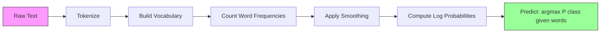

# Naive Bayes

> “naive” 假设是错误的，但它依然有效。这正是它的美妙之处。

**Type:** Build
**Language:** Python
**先修要求：** Phase 2, Lessons 01-07（Classification, Bayes' theorem）
**Time:** ~75 分钟

## 学习目标
- 从零实现带 Laplace smoothing 的 Multinomial Naive Bayes，用于文本 classification
- 解释为什么 naive independence assumption 在数学上是错误的，但在实践中仍能产生正确的类别排序
- 比较 Multinomial、Bernoulli 和 Gaussian Naive Bayes 变体，并为给定特征类型选择合适的版本
- 在高维稀疏数据上将 Naive Bayes 与 logistic regression 进行评估对比，并解释其中发挥作用的 bias-variance tradeoff

## 问题
你需要对文本做 classification。把邮件分为 spam 或 not-spam。把客户评论分为 positive 或 negative。把支持工单分到不同类别。你有成千上万个特征（每个词一个），但训练数据有限。

大多数 classifier 在这里都会吃不消。Logistic regression 需要足够多的样本，才能可靠地估计成千上万个权重。Decision trees 一次只按一个词做 split，并且会严重 overfit。10,000 维空间里的 KNN 没有意义，因为每个点到其他所有点的距离都差不多。

Naive Bayes 能处理这种情况。它做了一个数学上错误的假设（给定类别后，每个特征都与其他所有特征独立），但在文本 classification 上仍然能超过那些“更聪明”的模型，尤其是在训练集较小时。它只需单次遍历数据即可完成训练。它可以扩展到数百万个特征。它会产生概率估计（不过由于 independence assumption，这些概率通常校准得并不好）。

理解为什么一个错误假设能带来好的预测，会让你学到 machine learning 的一个根本事实：最好的模型不是最“正确”的模型，而是对你的数据拥有最佳 bias-variance tradeoff 的模型。

## 概念
### Bayes' Theorem（快速回顾）

Bayes' theorem 会反转条件概率：

```
P(class | features) = P(features | class) * P(class) / P(features)
```

我们想要 `P(class | features)`，也就是给定文档中的词后，该文档属于某个类别的概率。我们可以从以下几项计算它：
- `P(features | class)`：在该类别文档中看到这些词的 likelihood
- `P(class)`：类别的 prior probability（总体上 spam 有多常见？）
- `P(features)`：evidence，对所有类别都相同，因此比较类别时可以忽略

`P(class | features)` 最高的类别获胜。

### Naive Independence Assumption

精确计算 `P(features | class)` 需要估计所有特征联合出现的 joint probability。对于包含 10,000 个词的 vocabulary，你需要估计 2^10,000 种可能组合上的分布。不可能。

naive assumption 是：给定类别后，每个特征都是 conditionally independent 的。

```
P(w1, w2, ..., wn | class) = P(w1 | class) * P(w2 | class) * ... * P(wn | class)
```

你不再估计一个不可能的 joint distribution，而是估计 n 个简单的逐特征分布。每个分布只需要一个计数。

这个假设显然是错的。任何文档中的 "machine" 和 "learning" 都不是独立的。但 classifier 不需要正确的概率估计。它需要正确的排序，也就是哪个类别的概率最高。independence assumption 会引入系统性误差，但这些误差会以类似方式影响所有类别，所以排序仍然保持正确。

### Why It Still Works

三个原因：

1. **排序优先于校准。** Classification 只需要排名最高的类别正确。即使 P(spam) = 0.99999，而真实概率是 0.7，classifier 仍然会正确选择 spam。我们不需要正确的概率。我们需要正确的胜出类别。

2. **高 bias，低 variance。** independence assumption 是一个强 prior。它强力约束模型，从而防止 overfitting。在训练数据有限时，一个略微错误但稳定的模型，会胜过一个理论上正确但极不稳定的模型。这就是 bias-variance tradeoff 在发挥作用。

3. **特征冗余会相互抵消。** 相关特征提供的是冗余 evidence。classifier 会重复计算这些 evidence，但它也会为正确类别重复计算。如果 "machine" 和 "learning" 总是一起出现，它们都会为 "tech" 类别提供 evidence。NB 会把它们算两次，但它是为正确类别算了两次。

第四个实践原因：Naive Bayes 极快。训练只是单次遍历数据并统计频率。预测是一次 Matrix multiplication。你可以在几秒钟内用一百万篇文档完成训练。这种速度意味着你可以更快迭代、尝试更多特征集，并运行比慢速模型更多的实验。

### The Math Step by Step

让我们跟踪一个具体例子。假设我们有两个类别：spam 和 not-spam。我们的 vocabulary 有三个词："free"、"money"、"meeting"。

训练数据：
- Spam 邮件提到 "free" 80 次、"money" 60 次、"meeting" 10 次（总计 150 个词）
- Not-spam 邮件提到 "free" 5 次、"money" 10 次、"meeting" 100 次（总计 115 个词）
- 40% 的邮件是 spam，60% 是 not-spam

使用 Laplace smoothing（alpha=1）：

```
P(free | spam)    = (80 + 1) / (150 + 3) = 81/153 = 0.529
P(money | spam)   = (60 + 1) / (150 + 3) = 61/153 = 0.399
P(meeting | spam) = (10 + 1) / (150 + 3) = 11/153 = 0.072

P(free | not-spam)    = (5 + 1) / (115 + 3) = 6/118 = 0.051
P(money | not-spam)   = (10 + 1) / (115 + 3) = 11/118 = 0.093
P(meeting | not-spam) = (100 + 1) / (115 + 3) = 101/118 = 0.856
```

新邮件包含："free"（2 次）、"money"（1 次）、"meeting"（0 次）。

```
log P(spam | email) = log(0.4) + 2*log(0.529) + 1*log(0.399) + 0*log(0.072)
                    = -0.916 + 2*(-0.637) + (-0.919) + 0
                    = -3.109

log P(not-spam | email) = log(0.6) + 2*log(0.051) + 1*log(0.093) + 0*log(0.856)
                        = -0.511 + 2*(-2.976) + (-2.375) + 0
                        = -8.838
```

Spam 以很大优势胜出。"free" 出现两次是支持 spam 的强 evidence。注意，"meeting" 未出现时，对两个 log sum 的贡献都是零（0 * log(P)）——在 Multinomial NB 中，缺失词没有影响。显式建模词缺失的是 Bernoulli NB。

### Three Variants

Naive Bayes 有三种形式。每一种都用不同方式建模 `P(feature | class)`。

#### Multinomial Naive Bayes

将每个特征建模为计数。最适合特征为词频或 TF-IDF 值的文本数据。

```
P(word_i | class) = (count of word_i in class + alpha) / (total words in class + alpha * vocab_size)
```

`alpha` 是 Laplace smoothing（下文解释）。这个变体是文本 classification 的主力。

#### Gaussian Naive Bayes

将每个特征建模为正态分布。最适合连续特征。

```
P(x_i | class) = (1 / sqrt(2 * pi * var)) * exp(-(x_i - mean)^2 / (2 * var))
```

每个类别都会为每个特征拥有自己的均值和方差。当特征在每个类别内部确实服从钟形曲线时，这种方法效果很好。

#### Bernoulli Naive Bayes

将每个特征建模为二值变量（出现或未出现）。最适合短文本或二值特征 Vector。

```
P(word_i | class) = (docs in class containing word_i + alpha) / (total docs in class + 2 * alpha)
```

不同于 Multinomial，Bernoulli 会显式惩罚某个词的缺失。如果 "free" 通常出现在 spam 中，但这封邮件里没有，Bernoulli 会把它计为反对 spam 的 evidence。

### When to Use Each Variant

| Variant | Feature Type | Best For | Example |
|---------|-------------|----------|---------|
| Multinomial | 计数或频率 | 文本 classification、bag-of-words | Email spam、topic classification |
| Gaussian | 连续值 | 具有近似正态特征的表格数据 | Iris classification、传感器数据 |
| Bernoulli | 二值（0/1） | 短文本、二值特征 Vector | SMS spam、presence/absence features |

### Laplace Smoothing

如果测试数据中出现了某个词，但它在训练数据的某个特定类别中从未出现过，会发生什么？

没有 smoothing：`P(word | class) = 0/N = 0`。一个零乘进整个乘积后，会使 `P(class | features) = 0`，无论其他 evidence 有多强。单个未见过的词会摧毁整个预测，不管有多少其他 evidence 支持它。

Laplace smoothing 会给每个特征计数加上一个小计数 `alpha`（通常为 1）：

```
P(word_i | class) = (count(word_i, class) + alpha) / (total_words_in_class + alpha * vocab_size)
```

当 alpha=1 时，每个词至少都有一个很小的概率。测试邮件中出现 "discombobulate" 不再会让 spam 概率归零。smoothing 有一个 Bayesian 解释：它等价于在词分布上放置一个均匀 Dirichlet prior。

更高的 alpha 意味着更强的 smoothing（分布更均匀）。更低的 alpha 意味着模型更信任数据。Alpha 是需要调优的 hyperparameter。

alpha 的影响：

| Alpha | Effect | When to use |
|-------|--------|-------------|
| 0.001 | 几乎没有 smoothing，信任数据 | 非常大的训练集，预计不会有未见特征 |
| 0.1 | 轻度 smoothing | 大型训练集 |
| 1.0 | 标准 Laplace smoothing | 默认起点 |
| 10.0 | 重度 smoothing，会压平分布 | 非常小的训练集，预计有许多未见特征 |

### Log-Space Computation

将数百个概率相乘（每个都小于 1）会导致 floating-point underflow。即使真实值是一个非常小的正数，乘积在浮点数中也会变成零。

解决方案：在 log space 中工作。不要相乘概率，而是相加它们的对数：

```
log P(class | x1, x2, ..., xn) = log P(class) + sum_i log P(xi | class)
```

这会把预测变成 dot product：

```
log_scores = X @ log_feature_probs.T + log_class_priors
prediction = argmax(log_scores)
```

Matrix multiplication。这就是 Naive Bayes 预测如此之快的原因——它与单层线性模型是同一种运算。

### Naive Bayes vs Logistic Regression

两者都是用于文本的线性 classifier。区别在于它们建模的对象。

| Aspect | Naive Bayes | Logistic Regression |
|--------|------------|-------------------|
| Type | Generative（建模 P(X\|Y)） | Discriminative（建模 P(Y\|X)） |
| Training | 统计频率 | 优化 Loss Function |
| Small data | 更好（强 prior 有帮助） | 更差（不足以估计权重） |
| Large data | 更差（错误假设会拖累） | 更好（更灵活的边界） |
| Features | 假设独立 | 能处理相关性 |
| Speed | 单次遍历，非常快 | 迭代优化 |
| Calibration | 概率较差 | 概率更好 |

经验法则：从 Naive Bayes 开始。如果你有足够数据，并且 NB 进入平台期，就切换到 logistic regression。

### Classification Pipeline



实践中，我们在 log space 中工作，以避免 floating-point underflow。我们不再相乘许多小概率，而是相加它们的对数：

```
log P(class | features) = log P(class) + sum_i log P(feature_i | class)
```

## 构建它
`code/naive_bayes.py` 中的代码从零实现了 MultinomialNB 和 GaussianNB。

### MultinomialNB

从零实现：

1. **fit(X, y)**：对每个类别，统计每个特征的频率。加入 Laplace smoothing。计算 log probabilities。存储 class priors（类别频率的 log）。

2. **predict_log_proba(X)**：对每个样本，计算所有类别的 log P(class) + sum of log P(feature_i | class)。这是一次 Matrix multiplication：X @ log_probs.T + log_priors。

3. **predict(X)**：返回 log probability 最高的类别。

```python
class MultinomialNB:
    def __init__(self, alpha=1.0):
        self.alpha = alpha

    def fit(self, X, y):
        classes = np.unique(y)
        n_classes = len(classes)
        n_features = X.shape[1]

        self.classes_ = classes
        self.class_log_prior_ = np.zeros(n_classes)
        self.feature_log_prob_ = np.zeros((n_classes, n_features))

        for i, c in enumerate(classes):
            X_c = X[y == c]
            self.class_log_prior_[i] = np.log(X_c.shape[0] / X.shape[0])
            counts = X_c.sum(axis=0) + self.alpha
            self.feature_log_prob_[i] = np.log(counts / counts.sum())

        return self
```

关键洞察：拟合之后，预测只是 Matrix multiplication 加上 bias。这就是 Naive Bayes 如此之快的原因。

### GaussianNB

对于连续特征，我们为每个类别的每个特征估计均值和方差：

```python
class GaussianNB:
    def __init__(self):
        pass

    def fit(self, X, y):
        classes = np.unique(y)
        self.classes_ = classes
        self.means_ = np.zeros((len(classes), X.shape[1]))
        self.vars_ = np.zeros((len(classes), X.shape[1]))
        self.priors_ = np.zeros(len(classes))

        for i, c in enumerate(classes):
            X_c = X[y == c]
            self.means_[i] = X_c.mean(axis=0)
            self.vars_[i] = X_c.var(axis=0) + 1e-9
            self.priors_[i] = X_c.shape[0] / X.shape[0]

        return self
```

预测会对每个特征使用 Gaussian PDF，并跨特征相乘（在 log space 中相加）。

### Demo: Text Classification

代码会生成 synthetic bag-of-words 数据，模拟两个类别（tech articles 与 sports articles）。每个类别都有不同的词频分布。MultinomialNB 使用词计数对它们进行 classification。

synthetic data 的工作方式如下：我们创建 200 个“词”（特征列）。Words 0-39 在 tech articles 中频率高、在 sports 中频率低。Words 80-119 在 sports 中频率高、在 tech 中频率低。Words 40-79 在两者中都是中等频率。这会创建一个现实场景：有些词是强类别指示器，另一些词是噪声。

### Demo: Continuous Features

代码会生成类似 Iris 的数据（3 个类别、4 个特征、Gaussian clusters）。GaussianNB 使用每个类别的均值和方差进行 classification。每个类别都有不同的中心（mean vector）和不同的离散程度（variance），模拟现实数据中各类别测量值系统性不同的情况。

代码还演示了：
- **Smoothing comparison：** 使用不同 alpha 值训练 MultinomialNB，展示 smoothing 强度对准确率的影响。
- **Training size experiment：** 随着训练数据从 20 个样本增长到 1600 个样本，NB 准确率如何提升。即使样本很少，NB 也能达到不错的准确率——这是它的主要优势。
- **Confusion matrix：** 每个类别的 precision、recall 和 F1 score，用于展示 NB 在哪里犯错。

### Prediction Speed

Naive Bayes 预测是一次 Matrix multiplication。对于 n 个样本、d 个特征、k 个类别：
- MultinomialNB：一次 Matrix multiply (n x d) @ (d x k) = O(n * d * k)
- GaussianNB：n * k 次 Gaussian PDF 求值，每次覆盖 d 个特征 = O(n * d * k)

两者在每个维度上都是线性的。将其与 KNN（需要计算到所有训练点的距离）或带 RBF kernel 的 SVM（需要对所有 support vectors 做 kernel evaluation）相比，NB 在预测时快几个数量级。

## 使用它
使用 sklearn 时，这两个变体都是一行式用法：

```python
from sklearn.naive_bayes import GaussianNB, MultinomialNB

gnb = GaussianNB()
gnb.fit(X_train, y_train)
print(f"GaussianNB accuracy: {gnb.score(X_test, y_test):.3f}")

mnb = MultinomialNB(alpha=1.0)
mnb.fit(X_train_counts, y_train)
print(f"MultinomialNB accuracy: {mnb.score(X_test_counts, y_test):.3f}")
```

用 sklearn 做文本 classification：

```python
from sklearn.feature_extraction.text import CountVectorizer
from sklearn.naive_bayes import MultinomialNB
from sklearn.pipeline import Pipeline

text_clf = Pipeline([
    ("vectorizer", CountVectorizer()),
    ("classifier", MultinomialNB(alpha=1.0)),
])

text_clf.fit(train_texts, train_labels)
accuracy = text_clf.score(test_texts, test_labels)
```

`naive_bayes.py` 中的代码会在相同数据上将从零实现与 sklearn 进行比较，以验证正确性。

### TF-IDF with Naive Bayes

原始词计数会让每次出现的每个词拥有相同权重。但像 "the" 和 "is" 这样的常见词会频繁出现在每个类别中——它们不携带信息。TF-IDF（Term Frequency - Inverse Document Frequency）会降低常见词权重，并提升稀有且有区分度的词的权重。

```python
from sklearn.feature_extraction.text import TfidfVectorizer
from sklearn.naive_bayes import MultinomialNB
from sklearn.pipeline import Pipeline

text_clf = Pipeline([
    ("tfidf", TfidfVectorizer()),
    ("classifier", MultinomialNB(alpha=0.1)),
])
```

TF-IDF 值是非负的，因此可以和 MultinomialNB 一起使用。TF-IDF + MultinomialNB 的组合是文本 classification 中最强的 baseline 之一。在训练样本少于 10,000 的数据集上，它经常击败更复杂的模型。

### 用于短文本的 BernoulliNB

对于短文本（tweets、SMS、chat messages），BernoulliNB 可能优于 MultinomialNB。短文本的词计数很低，因此 MultinomialNB 依赖的频率信息噪声较大。BernoulliNB 只关注出现或缺失，这在短文本中更可靠。

```python
from sklearn.naive_bayes import BernoulliNB
from sklearn.feature_extraction.text import CountVectorizer

text_clf = Pipeline([
    ("vectorizer", CountVectorizer(binary=True)),
    ("classifier", BernoulliNB(alpha=1.0)),
])
```

CountVectorizer 中的 `binary=True` 标志会将所有计数转换为 0/1。没有它，BernoulliNB 仍能运行，但它看到的是并非为其设计的计数。

### Calibrating NB Probabilities

NB 概率校准很差。当 NB 说 P(spam) = 0.95 时，真实概率可能是 0.7。如果你需要可靠的概率估计（例如，用于设置阈值或与其他模型组合），请使用 sklearn 的 CalibratedClassifierCV：

```python
from sklearn.calibration import CalibratedClassifierCV

calibrated_nb = CalibratedClassifierCV(MultinomialNB(), cv=5, method="sigmoid")
calibrated_nb.fit(X_train, y_train)
proba = calibrated_nb.predict_proba(X_test)
```

这会通过 cross-validation，在 NB 的原始分数之上拟合一个 logistic regression。得到的概率会更接近真实类别频率。

### Common Gotchas

1. **负特征值。** MultinomialNB 要求特征非负。如果你有负值（例如某些设置下的 TF-IDF，或标准化后的特征），请改用 GaussianNB，或者把特征平移为正值。

2. **零方差特征。** GaussianNB 会除以方差。如果某个类别的某个特征方差为零（所有值都相同），概率计算会出问题。代码会给所有方差加上一个很小的 smoothing 项（1e-9）来防止这种情况。

3. **类别不平衡。** 如果 99% 的邮件是 not-spam，prior P(not-spam) = 0.99 会非常强，以至于压过 likelihood evidence。你可以手动设置 class priors，或使用 sklearn 中的 class_prior 参数。

4. **特征缩放。** MultinomialNB 不需要 scaling（它处理计数）。GaussianNB 也不需要 scaling（它估计逐特征统计量）。这是它相对于 logistic regression 和 SVM 的优势，后两者对特征尺度敏感。

## 交付它
本课会产出：
- `outputs/skill-naive-bayes-chooser.md`：一个用于选择正确 NB 变体的 decision skill
- `code/naive_bayes.py`：从零实现的 MultinomialNB 和 GaussianNB，并包含 sklearn 对比

### When Naive Bayes Fails

当 independence assumption 导致错误排序（而不仅是错误概率）时，NB 会失败。这会发生在以下情况：

1. **强特征交互。** 如果类别取决于两个特征的组合，而不取决于任意单独一个特征（类似 XOR 的模式），NB 会完全错过。每个单独特征都不提供 evidence，而 NB 无法以非线性方式组合它们。

2. **高度相关且 evidence 相反的特征。** 如果特征 A 指向 "spam"，特征 B 指向 "not-spam"，但 A 和 B 完全相关（现实中它们总是一致），NB 会看到实际上不存在的冲突 evidence。

3. **非常大的训练集。** 当数据足够多时，像 logistic regression 这样的 discriminative models 会学到真实 decision boundary，并超过 NB。曾经在小数据上有帮助的 independence assumption，现在会限制模型。

实践中，对于文本 classification，这些 failure modes 并不常见。文本特征数量很多、单个特征较弱，而 independence assumption 的误差往往会相互抵消。对于只有少量强相关特征的表格数据，请优先考虑 logistic regression 或 tree-based models。

## 练习
1. **Smoothing experiment。** 在文本数据上使用 alpha 值 0.01、0.1、1.0、10.0 和 100.0 训练 MultinomialNB。绘制 accuracy vs alpha。性能在哪里达到峰值？为什么非常高的 alpha 会伤害性能？

2. **Feature independence test。** 取一个真实文本数据集。选择两个显然相关的词（"machine" 和 "learning"）。计算 P(word1 | class) * P(word2 | class)，并与 P(word1 AND word2 | class) 比较。independence assumption 错得有多严重？它会影响 classification accuracy 吗？

3. **Bernoulli implementation。** 扩展代码，添加一个 BernoulliNB class。将 bag-of-words 转换为二值（present/absent），并在文本数据上与 MultinomialNB 比较 accuracy。什么时候 Bernoulli 会赢？

4. **NB vs Logistic Regression。** 在文本数据上训练两者。从 100 个训练样本开始，逐步增加到 10,000。绘制两者的 accuracy vs training set size。Logistic Regression 在什么时候超过 Naive Bayes？

5. **Spam filter。** 构建一个完整的 spam classifier：tokenize 原始邮件文本、构建 vocabulary、创建 bag-of-words features、训练 MultinomialNB，并用 precision 和 recall 评估（不只是 accuracy——为什么？）。

## 关键术语
| Term | What people say | What it actually means |
|------|----------------|----------------------|
| Naive Bayes | “简单的概率 classifier” | 一个使用 Bayes' theorem，并假设给定类别后特征 conditionally independent 的 classifier |
| Conditional independence | “特征彼此不影响” | P(A, B \| C) = P(A \| C) * P(B \| C)——一旦知道 C，知道 B 不会告诉你关于 A 的任何新信息 |
| Laplace smoothing | “Add-one smoothing” | 给每个特征添加一个小计数，防止零概率主导预测 |
| Prior | “看到数据之前你相信什么” | P(class)——观察任何特征之前，每个类别的概率 |
| Likelihood | “数据拟合得有多好” | P(features \| class)——如果类别已知，观察到这些特征的概率 |
| Posterior | “看到数据之后你相信什么” | P(class \| features)——观察到特征后，类别的更新概率 |
| Generative model | “建模数据如何生成” | 学习 P(X \| Y) 和 P(Y)，然后使用 Bayes' theorem 得到 P(Y \| X) 的模型 |
| Discriminative model | “建模 decision boundary” | 不建模 X 如何生成，而是直接学习 P(Y \| X) 的模型 |
| Log probability | “避免 underflow” | 使用 log P 而不是 P，防止许多小数相乘后在浮点数中变成零 |

## 延伸阅读
- [scikit-learn Naive Bayes docs](https://scikit-learn.org/stable/modules/naive_bayes.html) —— 三种变体及其数学细节
- [McCallum and Nigam, A Comparison of Event Models for Naive Bayes Text Classification (1998)](https://www.cs.cmu.edu/~knigam/papers/multinomial-aaaiws98.pdf) —— 文本中 Multinomial 与 Bernoulli 的经典比较
- [Rennie et al., Tackling the Poor Assumptions of Naive Bayes Text Classifiers (2003)](https://people.csail.mit.edu/jrennie/papers/icml03-nb.pdf) —— 针对文本 NB 的改进
- [Ng and Jordan, On Discriminative vs. Generative Classifiers (2001)](https://ai.stanford.edu/~ang/papers/nips01-discriminativegenerative.pdf) —— 证明 NB 在数据较少时比 LR 收敛更快
