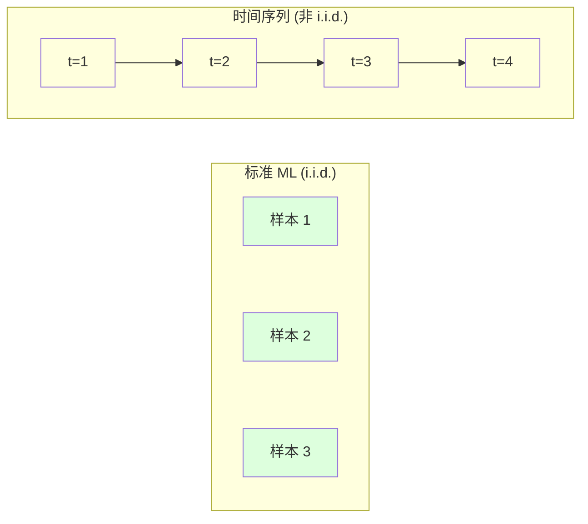
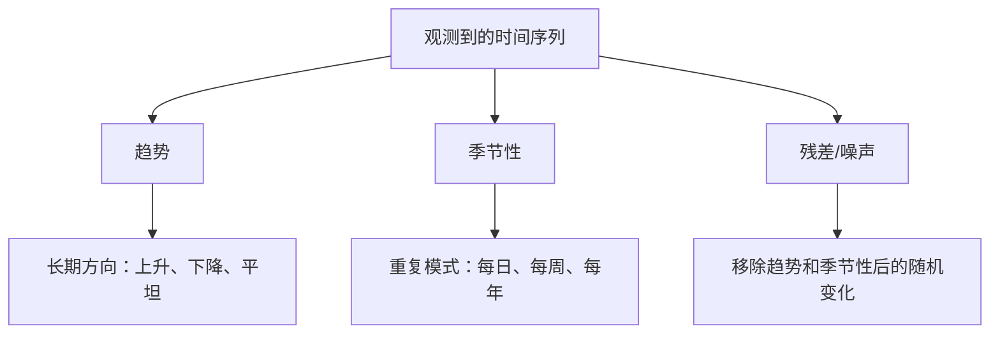
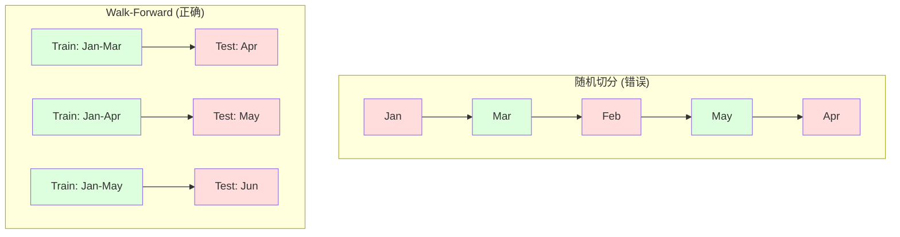

# 时间序列基础

> 过去的表现确实可以预测未来结果 -- 前提是你先检查平稳性。

**Type:** Build
**Language:** Python
**Prerequisites:** Phase 2, Lessons 01-09
**Time:** ~90 分钟

## 学习目标

- 将时间序列分解为趋势、季节性和残差组件，并检验平稳性
- 实现滞后特征和滚动统计量，把时间序列转换为监督学习问题
- 构建 walk-forward validation 框架，防止未来数据泄漏到训练中
- 解释为什么随机 train/test split 对时间序列无效，并展示它与正确时间切分之间的性能差距

## 问题

你有按时间排序的数据。每日销售额、每小时温度、每分钟 CPU 使用率、每周股票价格。你想预测下一个值、下一周、下一个季度。

你拿出标准 ML 工具箱：随机 train/test split、cross-validation、输入 feature matrix、输出 prediction。每一步都是错的。

时间序列会打破标准 ML 依赖的假设。样本并不独立 -- 今天的温度依赖昨天的温度。随机切分会把未来信息泄漏到过去。在 backtest 中看起来很好的特征，到了生产环境会失败，因为它们依赖会随时间漂移的模式。

一个用随机 cross-validation 得到 95% accuracy 的模型，用正确的基于时间的评估可能只有 55%。这个差异不是技术细节。它是纸面上能用的模型和生产中能用的模型之间的差异。

本课覆盖基础内容：时间数据有何不同，如何诚实地评估模型，以及如何把时间序列转换为标准 ML 模型可以使用的特征。

## 概念

### 时间序列有何不同

标准 ML 假设 i.i.d. -- 独立同分布。每个样本都从同一个分布中抽取，并且独立于其他样本。时间序列同时违反这两点：

- **不独立。** 今天的股票价格依赖昨天的价格。本周销售额与上周相关。
- **不同分布。** 分布会随时间漂移。12 月的销售额看起来不同于 3 月。

这些违反并不轻微。它们会改变你构建特征的方式、评估模型的方式，以及哪些算法可用。



在标准 ML 中，样本可以互换。打乱它们不会改变任何东西。在时间序列中，顺序就是一切。打乱会破坏信号。

### 时间序列的组成部分

每个时间序列都是以下内容的组合：



- **趋势**：长期方向。收入每年增长 10%。全球温度上升。
- **季节性**：固定间隔上的重复模式。零售销售在 12 月激增。空调使用量在 7 月达到峰值。
- **残差**：移除趋势和季节性后剩下的部分。如果残差看起来像白噪声，说明分解捕获了信号。

### 平稳性

如果一个时间序列的统计属性（均值、方差、自相关）不随时间变化，它就是平稳的。大多数预测方法都假设平稳性。

**为什么重要：** 非平稳序列的均值会漂移。在 1 月数据上训练的模型，学到的均值会不同于 2 月呈现的均值。它会系统性地出错。

**如何检查：** 在窗口上计算 rolling mean 和 rolling standard deviation。如果它们漂移，序列就是非平稳的。

**如何修复：** 差分。不要建模原始值，而是建模连续值之间的变化：

```
diff[t] = value[t] - value[t-1]
```

如果一次差分不能让序列平稳，就再应用一次（二阶差分）。大多数真实世界序列最多需要两次。

**示例：**

原始序列：[100, 102, 106, 112, 120]
一阶差分：  [2, 4, 6, 8]（仍在向上趋势）
二阶差分：  [2, 2, 2]（常数 -- 平稳）

原始序列有二次趋势。一阶差分把它变成线性趋势。二阶差分让它变平。在实践中，你很少需要超过两次差分。

**形式化检验：** Augmented Dickey-Fuller (ADF) test 是平稳性的标准统计检验。原假设是“序列是非平稳的”。低于 0.05 的 p-value 表示你可以拒绝原假设并得出平稳结论。我们不从零实现 ADF（它需要渐近分布表），但代码中的 rolling statistics 方法提供了实用的可视化检查。

### 自相关

自相关衡量时间 t 的值与时间 t-k（过去 k 步）的值之间的相关程度。autocorrelation function (ACF) 会绘制每个 lag k 的这种相关性。

**ACF 告诉你：**
- 序列能记住多远。如果 ACF 在 lag 5 后降到零，则 5 步以前的值无关紧要。
- 是否存在季节性。如果 ACF 在 lag 12（月度数据）出现尖峰，则存在年度季节性。
- 要创建多少滞后特征。使用直到 ACF 变得可忽略为止的 lag。

**PACF (Partial Autocorrelation Function)** 会移除间接相关。如果今天与 3 天前相关，只是因为二者都与昨天相关，那么 lag 3 的 PACF 会是零，而 lag 3 的 ACF 不会是零。

### 滞后特征：把时间序列转换为监督学习

标准 ML 模型需要 feature matrix X 和 target y。时间序列只给你一列值。桥梁就是滞后特征。

取序列 [10, 12, 14, 13, 15]，创建 lag-1 和 lag-2 特征：

| lag_2 | lag_1 | target |
|-------|-------|--------|
| 10    | 12    | 14     |
| 12    | 14    | 13     |
| 14    | 13    | 15     |

现在你有了一个标准 Regression 问题。任何 ML 模型（linear regression、random forest、gradient boosting）都可以从这些 lag 预测 target。

你可以工程化的其他特征：
- **Rolling statistics:** 最近 k 个值的 mean、std、min、max
- **Calendar features:** 星期几、月份、is_holiday、is_weekend
- **Differenced values:** 相比上一步的变化
- **Expanding statistics:** 累计 mean、累计 sum
- **Ratio features:** 当前值 / rolling mean（偏离近期平均值多远）
- **Interaction features:** lag_1 * day_of_week（工作日对动量的影响）

**多少个 lag？** 使用 autocorrelation function。如果 ACF 到 lag 10 都显著，就至少使用 10 个 lag。如果存在周季节性，包含 lag 7（也可能包含 14）。更多 lag 会给模型更多历史信息，但也会增加需要拟合的特征数量，从而提高 overfitting 风险。

**target 对齐陷阱。** 创建滞后特征时，target 必须是时间 t 的值，并且所有特征都必须使用时间 t-1 或更早的值。如果你不小心把时间 t 的值作为特征包含进去，你就拥有了一个完美预测器 -- 以及一个完全无用的模型。这是时间序列特征工程中最常见的 bug。

### Walk-Forward Validation

这是本课最重要的概念。标准 k-fold cross-validation 会随机把样本分配到 train 和 test。对时间序列来说，这会泄漏未来信息。



Walk-forward validation：
1. 在截至时间 t 的数据上训练
2. 预测时间 t+1（或用于多步预测的 t+1 到 t+k）
3. 将窗口向前滑动
4. 重复

每个 test fold 只包含所有训练数据之后的数据。没有未来泄漏。这会给你一个诚实估计，说明模型部署后会如何表现。

**Expanding window** 使用所有历史数据进行训练（窗口增长）。**Sliding window** 使用固定大小的训练窗口（窗口滑动）。当你相信更旧的数据仍然相关时，使用 expanding。当世界在变化且旧数据有害时，使用 sliding。

### ARIMA 直觉

ARIMA 是经典的时间序列模型。它有三个组件：

- **AR (Autoregressive):** 从过去值进行预测。AR(p) 使用最近 p 个值。
- **I (Integrated):** 通过差分实现平稳性。I(d) 应用 d 次差分。
- **MA (Moving Average):** 从过去预测误差进行预测。MA(q) 使用最近 q 个误差。

ARIMA(p, d, q) 组合了三者。你基于 ACF/PACF 分析或自动搜索（auto-ARIMA）选择 p、d、q。

我们不会从零实现 ARIMA -- 它需要数值优化，超出了本课范围。关键洞察是理解每个组件的作用，这样你就能解释 ARIMA 结果，并知道何时使用它。

### 何时使用什么

| Approach | Best For | Handles Seasonality | Handles External Features |
|----------|---------|-------------------|------------------------|
| 滞后特征 + ML | 有很多外部特征的表格数据 | 通过 calendar features | 是 |
| ARIMA | 单个单变量序列、短期 | SARIMA 变体 | 否（ARIMAX 支持有限） |
| Exponential smoothing | 简单趋势 + 季节性 | 是（Holt-Winters） | 否 |
| Prophet | 业务预测、节假日 | 是（Fourier terms） | 有限 |
| Neural networks (LSTM, Transformer) | 长序列、多序列 | 学习得到 | 是 |

对于大多数实际问题，滞后特征 + gradient boosting 是最强的起点。它天然支持外部特征，不要求平稳性，并且容易 debug。

### 预测 Horizon 和策略

单步预测会预测未来一个时间步。多步预测会预测多个时间步。有三种策略：

**Recursive (iterated):** 预测下一步，把预测结果作为下一步的输入。简单，但误差会累积 -- 每个预测都使用上一个预测，因此错误会复合。

**Direct:** 为每个 horizon 训练单独的模型。Model-1 预测 t+1，Model-5 预测 t+5。没有误差累积，但每个模型的训练样本更少，而且它们不共享信息。

**Multi-output:** 训练一个同时输出所有 horizon 的模型。跨 horizon 共享信息，但需要支持多输出的模型（或自定义 Loss Function）。

对于大多数实际问题，短 horizon（1-5 步）从 recursive 开始，较长 horizon 用 direct。

### 时间序列中的常见错误

| Mistake | Why it happens | How to fix |
|---------|---------------|-----------|
| 随机 train/test split | 来自标准 ML 的习惯 | 使用 walk-forward 或 temporal split |
| 使用未来特征 | 误把时间 t 的特征包含进去 | 审计每个特征的时间对齐 |
| 对季节性 overfitting | 模型记住了日历模式 | 在 test set 中留出一个完整季节周期 |
| 忽略尺度变化 | 收入翻倍但模式保持 | 建模百分比变化而非绝对值 |
| 过多滞后特征 | “更多历史更好” | 使用 ACF 确定相关 lag |
| 不做差分 | “模型会自己搞定” | 树模型能处理趋势；线性模型需要平稳性 |

```figure
f3-series-decompose
```

## 构建它

`code/time_series.py` 中的代码从零实现了核心构建块。

### 滞后特征创建器

```python
def make_lag_features(series, n_lags):
    n = len(series)
    X = np.full((n, n_lags), np.nan)
    for lag in range(1, n_lags + 1):
        X[lag:, lag - 1] = series[:-lag]
    valid = ~np.isnan(X).any(axis=1)
    return X[valid], series[valid]
```

这会把 1D 序列转换为 feature matrix，其中每一行都以最近 `n_lags` 个值作为特征，并以当前值作为 target。

### Walk-Forward Cross-Validation

```python
def walk_forward_split(n_samples, n_splits=5, min_train=50):
    assert min_train < n_samples, "min_train must be less than n_samples"
    step = max(1, (n_samples - min_train) // n_splits)
    for i in range(n_splits):
        train_end = min_train + i * step
        test_end = min(train_end + step, n_samples)
        if train_end >= n_samples:
            break
        yield slice(0, train_end), slice(train_end, test_end)
```

每次切分都确保训练数据严格早于测试数据。训练窗口会随每个 fold 扩大。

### 简单 Autoregressive 模型

纯 AR 模型就是滞后特征上的 linear regression：

```python
class SimpleAR:
    def __init__(self, n_lags=5):
        self.n_lags = n_lags
        self.weights = None
        self.bias = None

    def fit(self, series):
        X, y = make_lag_features(series, self.n_lags)
        # Solve via normal equations
        X_b = np.column_stack([np.ones(len(X)), X])
        theta = np.linalg.lstsq(X_b, y, rcond=None)[0]
        self.bias = theta[0]
        self.weights = theta[1:]
        return self
```

这在概念上与 Lesson 02 中的 linear regression 完全相同，只是应用在同一变量的时间滞后版本上。

### 平稳性检查

代码计算 rolling statistics，用于可视化和数值化评估平稳性：

```python
def check_stationarity(series, window=50):
    rolling_mean = np.array([
        series[max(0, i - window):i].mean()
        for i in range(1, len(series) + 1)
    ])
    rolling_std = np.array([
        series[max(0, i - window):i].std()
        for i in range(1, len(series) + 1)
    ])
    return rolling_mean, rolling_std
```

如果 rolling mean 漂移或 rolling std 变化，序列就是非平稳的。应用差分后再检查一次。

代码还会通过比较序列前半段和后半段来检查平稳性。如果均值差异超过半个标准差，或方差比超过 2x，序列会被标记为非平稳。

### 自相关

```python
def autocorrelation(series, max_lag=20):
    n = len(series)
    mean = series.mean()
    var = series.var()
    acf = np.zeros(max_lag + 1)
    for k in range(max_lag + 1):
        cov = np.mean((series[:n-k] - mean) * (series[k:] - mean))
        acf[k] = cov / var if var > 0 else 0
    return acf
```

## 使用它

使用 sklearn 时，你可以直接把滞后特征交给任何 regressor：

```python
from sklearn.linear_model import Ridge
from sklearn.ensemble import GradientBoostingRegressor

X, y = make_lag_features(series, n_lags=10)

for train_idx, test_idx in walk_forward_split(len(X)):
    model = Ridge(alpha=1.0)
    model.fit(X[train_idx], y[train_idx])
    predictions = model.predict(X[test_idx])
```

对于 ARIMA，使用 statsmodels：

```python
from statsmodels.tsa.arima.model import ARIMA

model = ARIMA(train_series, order=(5, 1, 2))
fitted = model.fit()
forecast = fitted.forecast(steps=30)
```

`time_series.py` 中的代码演示了两种方法，并使用 walk-forward validation 进行比较。

### sklearn TimeSeriesSplit

sklearn 提供了实现 walk-forward validation 的 `TimeSeriesSplit`：

```python
from sklearn.model_selection import TimeSeriesSplit

tscv = TimeSeriesSplit(n_splits=5)
for train_index, test_index in tscv.split(X):
    X_train, X_test = X[train_index], X[test_index]
    y_train, y_test = y[train_index], y[test_index]
    model.fit(X_train, y_train)
    score = model.score(X_test, y_test)
```

这等价于我们从零实现的 `walk_forward_split`，但集成到了 sklearn 的 cross-validation 框架中。你可以将它与 `cross_val_score` 一起使用：

```python
from sklearn.model_selection import cross_val_score

scores = cross_val_score(model, X, y, cv=TimeSeriesSplit(n_splits=5))
print(f"Mean score: {scores.mean():.4f} +/- {scores.std():.4f}")
```

### 评估指标

时间序列预测使用 Regression 指标，但带有时间感知的上下文：

- **MAE (Mean Absolute Error):** |y_true - y_pred| 的平均值。容易用原始单位解释。“平均而言，预测偏差为 3.2 度。”
- **RMSE (Root Mean Squared Error):** mean squared error 的平方根。相比 MAE，它对大误差惩罚更重。当大错误比很多小错误更糟时使用。
- **MAPE (Mean Absolute Percentage Error):** |error / true_value| * 100 的平均值。与尺度无关，适合比较不同序列。但当 true values 为零时未定义。
- **Naive baseline comparison:** 始终与简单 baseline 比较。seasonal naive baseline 会预测上一周期的值（昨天、上周）。如果你的模型无法击败 naive，就说明有问题。

### Rolling Features

代码演示了向滞后特征添加 rolling statistics（7 天和 14 天窗口上的 mean、std、min、max）。这些特征会给模型提供近期趋势和波动性信息，而这些信息仅靠滞后特征无法捕获。

例如，如果 rolling mean 在上升，说明存在向上趋势。如果 rolling std 在增加，说明波动性在增长。这些正是 tree-based models 可以学习、但线性模型无法学习的模式。

## 交付它

本课产出：
- `outputs/prompt-time-series-advisor.md` -- 一个用于界定时间序列问题的 prompt
- `code/time_series.py` -- 滞后特征、walk-forward validation、AR 模型、平稳性检查

### 你必须击败的 Baseline

在构建任何模型之前，先建立 baseline：

1. **Last value (persistence).** 预测明天会和今天一样。对很多序列来说，这出人意料地难以击败。
2. **Seasonal naive.** 预测今天会和上周同一天（或去年同一天）一样。如果你的模型无法击败它，就说明它没有学到季节性之外的任何有用模式。
3. **Moving average.** 预测最近 k 个值的平均值。能平滑噪声，但无法捕获突变。

如果你的高级 ML 模型输给了 seasonal naive baseline，你就有 bug。最常见的是：特征中的未来泄漏、错误的评估方法，或序列本身确实是随机且不可预测的。

### 实用建议

1. **从绘图开始。** 在任何建模之前，先绘制原始序列。寻找趋势、季节性、outlier、structural break（行为中的突然变化）。30 秒的可视化检查通常比一小时自动分析告诉你更多。

2. **先差分，再建模。** 如果序列有明显趋势，在创建滞后特征之前先做差分。Tree-based models 可以处理趋势，但线性模型不能，而且差分通常不会有坏处。

3. **至少留出一个完整季节周期。** 如果有周季节性，test set 至少需要完整一周。如果是月度季节性，至少需要完整一个月。否则你无法评估模型是否捕获了季节性模式。

4. **在生产中监控。** 随着世界变化，时间序列模型会随时间退化。以滚动方式跟踪预测误差。当误差开始增加时，用近期数据重新训练模型。

5. **警惕 regime changes。** 在疫情前数据上训练的模型无法预测疫情后行为。把已知 regime changes 的指示器作为特征加入，或使用会遗忘旧数据的 sliding window。

6. **对偏斜序列做 log-transform。** 收入、价格和计数通常右偏。取 log 可以稳定方差，并把乘法模式变成加法模式，从而让线性模型能够处理。在 log 空间预测，再取指数回到原始单位。

## 练习

1. **平稳性实验。** 生成一个带线性趋势的序列。用 rolling statistics 检查平稳性。应用一阶差分。再次检查。对于二次趋势，需要多少轮差分？

2. **Lag 选择。** 在季节性序列（period=7）上计算 ACF。哪些 lag 的自相关最高？只使用这些 lag（而非连续 lag）创建滞后特征。与使用 lag 1 到 7 相比，accuracy 是否提升？

3. **Walk-forward vs random split。** 在滞后特征上训练 Ridge regression。用随机 80/20 split 和 walk-forward validation 评估。随机切分高估了多少性能？

4. **特征工程。** 向滞后特征添加 rolling mean (window=7)、rolling std (window=7) 和 day-of-week features。使用 walk-forward validation 比较添加这些额外特征前后的 accuracy。

5. **多步预测。** 修改 AR 模型，让它预测未来 5 步而不是 1 步。比较两种策略：(a) 预测一步，把预测作为下一步的输入（recursive），以及 (b) 为每个 horizon 训练单独模型（direct）。哪个更准确？

## 关键术语

| Term | What people say | What it actually means |
|------|----------------|----------------------|
| Stationarity | “统计量不随时间变化” | 均值、方差和自相关结构随时间保持不变的序列 |
| Differencing | “连续值相减” | 计算 y[t] - y[t-1] 来移除趋势并实现平稳性 |
| Autocorrelation (ACF) | “一个序列与自身的相关程度” | 时间序列与自身滞后副本之间的相关性，作为 lag 的函数 |
| Partial autocorrelation (PACF) | “只有直接相关” | 移除所有更短 lag 的影响后，lag k 上的自相关 |
| Lag features | “把过去值作为输入” | 使用 y[t-1]、y[t-2]、...、y[t-k] 作为特征来预测 y[t] |
| Walk-forward validation | “尊重时间顺序的 cross-validation” | 训练数据在时间上始终先于测试数据的评估方式 |
| ARIMA | “经典时间序列模型” | AutoRegressive Integrated Moving Average：组合过去值（AR）、差分（I）和过去误差（MA） |
| Seasonality | “重复的日历模式” | 与日历周期（每日、每周、每年）相关的、规则且可预测的时间序列周期 |
| Trend | “长期方向” | 序列水平随时间持续上升或下降 |
| Expanding window | “使用所有历史” | 训练集随每个 fold 增长的 walk-forward validation |
| Sliding window | “固定大小的历史” | 训练集是向前滑动的固定长度窗口的 walk-forward validation |

## 延伸阅读

- [Hyndman and Athanasopoulos, Forecasting: Principles and Practice (3rd ed.)](https://otexts.com/fpp3/) -- 最好的免费时间序列预测教材
- [scikit-learn Time Series Split](https://scikit-learn.org/stable/modules/generated/sklearn.model_selection.TimeSeriesSplit.html) -- sklearn 的 walk-forward splitter
- [statsmodels ARIMA docs](https://www.statsmodels.org/stable/generated/statsmodels.tsa.arima.model.ARIMA.html) -- 带 diagnostics 的 ARIMA 实现
- [Makridakis et al., The M5 Competition (2022)](https://www.sciencedirect.com/science/article/pii/S0169207021001874) -- 展示 ML 方法与统计方法的大规模预测竞赛
