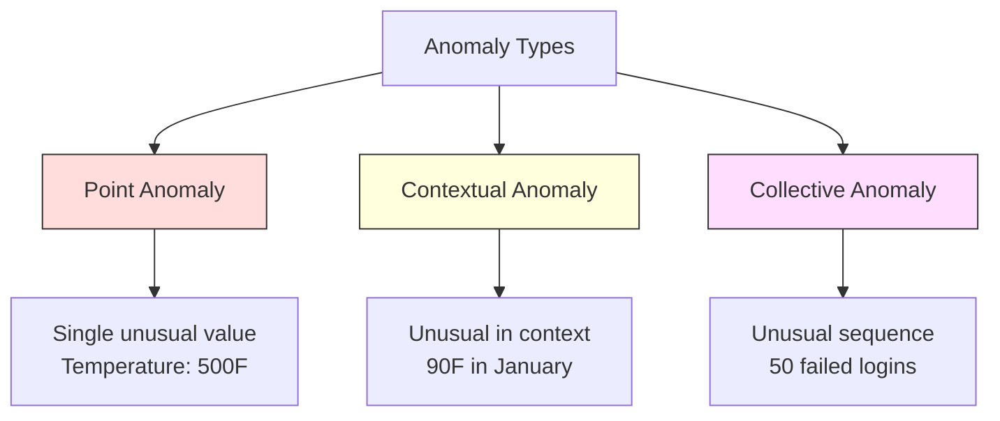
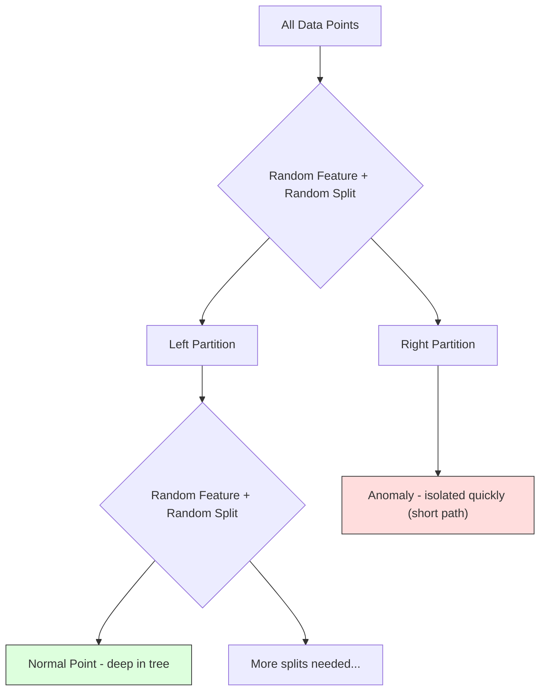
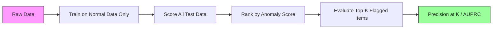

# Anomaly Detection

> Normal 很容易定义。Abnormal 就是任何不符合它的东西。

**Type:** Build
**Language:** Python
**Prerequisites:** Phase 2, Lessons 01-09
**Time:** ~75 minutes

## 学习目标

- 从零实现 Z-score、IQR 和 Isolation Forest Anomaly Detection 方法
- 区分 point、contextual 和 collective anomalies，并为每一种选择合适的检测方法
- 解释为什么 Anomaly Detection 被表述为对 normal data 建模，而不是对 anomalies 做 Classification
- 比较 unsupervised Anomaly Detection 与 supervised Classification，并评估 novel anomaly 覆盖范围与 precision 之间的权衡

## 问题

一张信用卡在下午 2 点于 New York 被使用，随后在下午 2:05 于 Tokyo 被使用。一个工厂传感器读数为 150 度，而正常范围是 80-120。一个服务器每秒发送 50,000 个请求，而日均值是 200。

这些都是 anomalies。找到它们很重要。欺诈会造成数十亿美元损失。设备故障会造成停机时间。网络入侵会造成数据损失。

挑战在于：你很少拥有带标签的 anomaly 示例。欺诈只占交易的 0.1%。设备故障一年只发生几次。你无法训练标准 classifier，因为 "anomaly" 类中几乎没有可学习的内容。即使你有一些标签，你见过的 anomalies 也不是未来会遇到的全部类型。明天的欺诈方案会不同于今天的方案。

Anomaly Detection 反转了问题。不要学习什么是 abnormal，而是学习什么是 normal。任何偏离 normal 的东西都是可疑的。这种方式不需要标签，能够适应新类型的 anomalies，并可扩展到海量数据集。

## 概念

### Anomalies 的类型

并非所有 anomalies 都相同：

- **Point anomalies.** 单个数据点无论上下文如何都很异常。500 度的温度读数。一个通常消费 $50 的账户发生 $50,000 的交易。
- **Contextual anomalies.** 某个数据点在给定上下文下异常。90 度在夏天是 normal，在冬天就是 anomalous。同一个值，不同上下文。
- **Collective anomalies.** 一组数据点作为整体是异常的，即使每个单独的数据点可能都是 normal。五次登录失败是 normal。连续五十次就是 brute-force attack。

大多数方法检测 point anomalies。Contextual anomalies 需要时间或位置特征。Collective anomalies 需要 sequence-aware 方法。



### Unsupervised 表述

在标准 Classification 中，你拥有两个类别的标签。在 Anomaly Detection 中，通常会遇到以下三种情况之一：

1. **Fully unsupervised.** 完全没有标签。你在所有数据上拟合 detector，并希望 anomalies 足够稀少，不会污染 "normal" model。
2. **Semi-supervised.** 你拥有一个只包含 normal data 的干净数据集。你在这个干净集合上拟合，然后对其他所有数据打分。如果可行，这是最强的设置。
3. **Weakly supervised.** 你有少量带标签的 anomalies。将它们用于评估，而不是训练。先进行 unsupervised 训练，然后在带标签子集上衡量 precision/recall。

关键洞见：Anomaly Detection 与 Classification 有本质区别。你是在对 normal data 的分布建模，而不是学习两个类别之间的 decision boundary。

### Supervised vs Unsupervised：权衡

如果你确实有带标签的 anomalies，应该把它们用于训练（supervised Classification），还是只用于评估（unsupervised detection）？

**Supervised（当作 Classification 处理）：**
- 能捕捉你以前见过的确切 anomaly 类型
- 对已知 anomaly 类型有更高 precision
- 会完全漏掉 novel anomaly 类型
- 当新 anomaly 类型出现时需要重新训练
- 需要足够多的 anomaly 示例（通常太少）

**Unsupervised（对 normal 建模，标记偏离项）：**
- 能捕捉任何偏离 normal 的情况，包括 novel 类型
- 不需要带标签的 anomalies
- false positive rate 更高（并非所有 unusual 都是坏事）
- 对 distribution shift 更 robust

实践中，最好的系统会结合两者：用 unsupervised detection 获得广覆盖，用 supervised models 处理已知的高优先级 anomaly 类型，并让人工审查模糊案例。

### Z-Score 方法

最简单的方法。计算每个 feature 的 mean 和 standard deviation。标记任何距离 mean 超过 k 个 standard deviations 的点。

```text
z_score = (x - mean) / std
anomaly if |z_score| > threshold
```

默认 threshold 是 3.0（对于 Gaussian distribution，99.7% 的 normal data 落在 3 个 standard deviations 范围内）。

**优点：** 简单。快速。可解释（"这个值距离 normal 有 4.5 个 standard deviations"）。

**缺点：** 假设数据服从 normal distribution。对训练数据中的 outliers 敏感（outliers 会移动 mean 并增大 std，使它们更难被检测出来）。在 multimodal distributions 上失效。

**适用场景：** 数据大致呈钟形分布的单 feature 监控。服务器响应时间、制造公差、具有稳定 baseline 的传感器读数。

**失效场景：** 多 cluster 数据（两个办公室位置有不同 baseline 温度）、skewed data（交易金额中 $1000 很少见但并非 anomalous）、训练集中包含 outliers 的数据。

### IQR 方法

比 Z-score 更 robust。使用 interquartile range，而不是 mean 和 standard deviation。

```
Q1 = 25th percentile
Q3 = 75th percentile
IQR = Q3 - Q1
lower_bound = Q1 - factor * IQR
upper_bound = Q3 + factor * IQR
anomaly if x < lower_bound or x > upper_bound
```

默认 factor 是 1.5。

**优点：** 对 outliers robust（percentiles 不受极端值影响）。适用于 skewed distributions。没有 normality assumption。

**缺点：** 仅适用于 univariate（逐 feature 独立应用）。无法检测只有在 features 一起考虑时才异常的 anomalies（某个点在每个 feature 上单独看可能都是 normal，但在 joint space 中是 anomalous）。

**实践说明：** IQR 中的 1.5 factor 对应 box plot 中的 whiskers。落在 whiskers 外的点是潜在 outliers。使用 3.0 而不是 1.5 会让 detector 更保守（标记更少，false positives 更少）。正确的 factor 取决于你对 false alarms 的容忍度。

### Isolation Forest

关键洞见：anomalies 数量少且与众不同。在对数据进行 random partitioning 时，anomalies 更容易被隔离出来，它们只需要更少的 random splits 就能与其余数据分开。



**工作方式：**
1. 构建许多 random trees（一个 isolation forest）
2. 在每个 node，随机选择一个 feature，并在该 feature 的 min 和 max 之间随机选择一个 split value
3. 持续 split，直到每个点都被隔离（位于自己的 leaf）
4. Anomalies 在所有 trees 上具有更短的 average path lengths

**为什么有效：** Normal points 位于 dense regions。需要许多 random splits 才能将一个点从其邻居中隔离出来。Anomalies 位于 sparse regions。一两次 random splits 就足以隔离它们。

Anomaly score 基于所有 trees 的 average path length，并用 random binary search tree 的 expected path length 进行 normalization：

```
score(x) = 2^(-average_path_length(x) / c(n))
```

其中 `c(n)` 是 n 个 samples 的 expected path length。Score 接近 1 表示 anomaly。Score 接近 0.5 表示 normal。Score 接近 0 表示非常 normal（位于 dense clusters 深处）。

**优点：** 没有 distribution assumptions。适用于 high dimensions。扩展性好（由于每棵 tree 使用 subsample，所以相对于 sample size 是 sublinear）。处理 mixed feature types。

**缺点：** 难以处理 dense regions 中的 anomalies（masking effect）。当许多 features irrelevant 时，random splitting 效果较差。

**关键 hyperparameters：**
- `n_estimators`: trees 数量。100 通常足够。更多 trees 会带来更稳定的 scores，但计算更慢。
- `max_samples`: 每棵 tree 的 samples 数量。原始论文默认值为 256。较小的值会让单棵 tree 不那么准确，但会提高多样性。Subsampling 正是 Isolation Forest 快速的原因，每棵 tree 只看到数据的一小部分。
- `contamination`: 预期 anomalies 比例。只用于设置 threshold。不影响 scores 本身。

### Local Outlier Factor (LOF)

LOF 将某个点周围的 local density 与其 neighbors 周围的 density 进行比较。一个位于 sparse region、但被 dense regions 包围的点是 anomalous。

**工作方式：**
1. 对每个点，找到它的 k nearest neighbors
2. 计算 local reachability density（邻域有多密）
3. 比较每个点的 density 与其 neighbors 的 densities
4. 如果某个点的 density 明显低于其 neighbors，它就是 outlier

**LOF score：**
- LOF 接近 1.0 表示 density 与 neighbors 相似（normal）
- LOF 大于 1.0 表示 density 低于 neighbors（可能 anomalous）
- LOF 远大于 1.0（例如 2.0+）表示 density 显著更低（很可能是 anomaly）

"local" 部分至关重要。考虑一个有两个 clusters 的数据集：一个包含 1000 个点的 dense cluster，另一个包含 50 个点的 sparse cluster。Sparse cluster 边缘的一个点并非全局 unusual，它有 50 个 neighbors。但如果它的直接 neighbors 比它更 dense，那么它在局部就是 unusual。LOF 捕捉到了 global methods 会漏掉的这种细微差别。

**优点：** 检测 local anomalies（在其邻域中异常的点，即使它们不是全局异常）。适用于不同 densities 的 clusters。

**缺点：** 在大型数据集上慢（naive implementation 为 O(n^2)）。对 k 的选择敏感。在 very high dimensions 中效果不好（curse of dimensionality 会影响 distance calculations）。

### 对比

| Method | Assumptions | Speed | Handles High Dims | Detects Local Anomalies |
|--------|------------|-------|-------------------|------------------------|
| Z-score | Normal distribution | 非常快 | 是（逐 feature） | 否 |
| IQR | 无（逐 feature） | 非常快 | 是（逐 feature） | 否 |
| Isolation Forest | 无 | 快 | 是 | 部分 |
| LOF | Distance 有意义 | 慢 | 较差 | 是 |

### 评估挑战

评估 anomaly detectors 比评估 classifiers 更难：

- **Extreme class imbalance.** 如果 anomalies 占 0.1%，对所有内容都预测 "normal" 会得到 99.9% accuracy。Accuracy 没有用。
- **AUROC 具有误导性。** 在严重 imbalance 下，即使 model 在实际 thresholds 下漏掉大多数 anomalies，AUROC 也可能看起来不错。
- **更好的 metrics：** Precision@k（top k 被标记项中有多少是真 anomalies）、AUPRC（precision-recall curve 下的面积），以及在固定 false positive rate 下的 recall。



### Anomaly Detection Pipeline

实践中，Anomaly Detection 遵循以下 workflow：

1. **收集 baseline data.** 理想情况下，选择一个你知道没有（或几乎没有）anomalies 的时期。
2. **Feature engineering.** 原始 features 加上 derived features（rolling statistics、time features、ratios）。
3. **训练 detector.** 在 baseline data 上拟合。Model 学习 "normal" 的样子。
4. **对新数据打分.** 每个新 observation 都会获得一个 anomaly score。
5. **Threshold selection.** 选择 score cutoff。这是业务决策：更高 threshold 意味着 false alarms 更少，但 missed anomalies 更多。
6. **Alert and investigate.** 被标记的点进入人工审查或自动响应。
7. **Feedback collection.** 记录被标记项是真 anomalies 还是 false alarms。使用这些数据评估 detector，并随着时间调整 threshold。

Pipeline 永远不是 "done"。Data distributions 会漂移，新的 anomaly 类型会出现，thresholds 也需要调整。把 Anomaly Detection 当作一个持续运行的系统，而不是一次性 model。

```figure
f3-anomaly-fence
```

## 构建它

`code/anomaly_detection.py` 中的代码从零实现了 Z-score、IQR 和 Isolation Forest。

### Z-Score Detector

```python
def zscore_detect(X, threshold=3.0):
    mean = X.mean(axis=0)
    std = X.std(axis=0)
    std[std == 0] = 1.0
    z = np.abs((X - mean) / std)
    return z.max(axis=1) > threshold
```

简单且 vectorized。如果任何 feature 超过 threshold，就标记该点。

### IQR Detector

```python
def iqr_detect(X, factor=1.5):
    q1 = np.percentile(X, 25, axis=0)
    q3 = np.percentile(X, 75, axis=0)
    iqr = q3 - q1
    iqr[iqr == 0] = 1.0
    lower = q1 - factor * iqr
    upper = q3 + factor * iqr
    outside = (X < lower) | (X > upper)
    return outside.any(axis=1)
```

### 从零实现 Isolation Forest

从零实现的版本会构建 isolation trees，对 feature space 进行 random partition：

```python
class IsolationTree:
    def __init__(self, max_depth):
        self.max_depth = max_depth

    def fit(self, X, depth=0):
        n, p = X.shape
        if depth >= self.max_depth or n <= 1:
            self.is_leaf = True
            self.size = n
            return self
        self.is_leaf = False
        self.feature = np.random.randint(p)
        x_min = X[:, self.feature].min()
        x_max = X[:, self.feature].max()
        if x_min == x_max:
            self.is_leaf = True
            self.size = n
            return self
        self.threshold = np.random.uniform(x_min, x_max)
        left_mask = X[:, self.feature] < self.threshold
        self.left = IsolationTree(self.max_depth).fit(X[left_mask], depth + 1)
        self.right = IsolationTree(self.max_depth).fit(X[~left_mask], depth + 1)
        return self
```

隔离某个点所需的 path length 决定它的 anomaly score。更短的 paths 表示更 anomalous。

`IsolationForest` class 包装了多棵 trees：

```python
class IsolationForest:
    def __init__(self, n_estimators=100, max_samples=256, seed=42):
        self.n_estimators = n_estimators
        self.max_samples = max_samples

    def fit(self, X):
        sample_size = min(self.max_samples, X.shape[0])
        max_depth = int(np.ceil(np.log2(sample_size)))
        for _ in range(self.n_estimators):
            idx = rng.choice(X.shape[0], size=sample_size, replace=False)
            tree = IsolationTree(max_depth=max_depth)
            tree.fit(X[idx])
            self.trees.append(tree)

    def anomaly_score(self, X):
        avg_path = average path length across all trees
        scores = 2.0 ** (-avg_path / c(max_samples))
        return scores
```

Normalization factor `c(n)` 是在包含 n 个 elements 的 binary search tree 中一次 unsuccessful search 的 expected path length。它等于 `2 * H(n-1) - 2*(n-1)/n`，其中 `H` 是 harmonic number。这个 normalization 确保 scores 在不同大小的数据集之间可比较。

### Demo 场景

代码生成多个测试场景：

1. **Single cluster with outliers.** 一个 2D Gaussian cluster，并在远离中心的位置注入 anomalies。所有方法在这里都应该有效。
2. **Multimodal data.** 三个不同大小和 densities 的 clusters。Clusters 之间的点是 anomalous。Z-score 会吃力，因为逐 feature 的范围很宽。
3. **High-dimensional data.** 50 个 features，但 anomalies 只在其中 5 个 features 上不同。测试方法是否能在 features 子集中找到 anomalies。

每个 demo 都使用 precision、recall、F1 和 Precision@k 比较所有方法。

## 使用它

使用 sklearn（使用库实现，而不是从零实现）：

```python
from sklearn.ensemble import IsolationForest
from sklearn.neighbors import LocalOutlierFactor

iso = IsolationForest(n_estimators=100, contamination=0.05, random_state=42)
iso.fit(X_train)
predictions = iso.predict(X_test)

lof = LocalOutlierFactor(n_neighbors=20, contamination=0.05, novelty=True)
lof.fit(X_train)
predictions = lof.predict(X_test)
```

注意，`contamination` 设置预期 anomalies 比例。正确设置它很重要，太低会漏掉 anomalies，太高会产生 false alarms。

`anomaly_detection.py` 中的代码会在同一数据上比较从零实现版本与 sklearn。

### sklearn Contamination Parameter

sklearn 中的 `contamination` parameter 决定如何把连续 anomaly scores 转换为 binary predictions 的 threshold。它不会改变底层 scores。

```python
iso_5 = IsolationForest(contamination=0.05)
iso_10 = IsolationForest(contamination=0.10)
```

两者产生相同的 anomaly scores。但 `iso_5` 标记 top 5%，而 `iso_10` 标记 top 10%。如果你不知道真实 anomaly rate（通常不知道），将 contamination 设置为 "auto"，并直接使用 raw scores。根据 false positives 与 false negatives 之间的成本权衡设置自己的 threshold。

### One-Class SVM

另一个值得了解的 unsupervised anomaly detector。One-Class SVM 会在 high-dimensional feature space 中围绕 normal data 拟合一个 boundary（使用 kernel trick）。

```python
from sklearn.svm import OneClassSVM

oc_svm = OneClassSVM(kernel="rbf", gamma="auto", nu=0.05)
oc_svm.fit(X_train)
predictions = oc_svm.predict(X_test)
```

`nu` parameter 近似表示 anomalies 的比例。One-Class SVM 在小到中等数据集上效果很好，但无法扩展到非常大的数据（kernel matrix 会 quadratic 增长）。

### Autoencoder Approach（预览）

Autoencoder 是学习压缩和重构数据的 Neural Network。在 normal data 上训练。测试时，anomalies 会有较高 reconstruction error，因为 network 只学会了重构 normal patterns。

这会在 Phase 3（Deep Learning）中介绍，但原则相同：对 normal 建模，标记偏离项。

### Ensemble Anomaly Detection

正如 ensemble methods 会改进 Classification（Lesson 11），组合多个 anomaly detectors 也会改进检测效果。最简单的方法：

1. 运行多个 detectors（Z-score、IQR、Isolation Forest、LOF）
2. 将每个 detector 的 scores normalize 到 [0, 1]
3. 对 normalized scores 求平均
4. 标记 average score 高于 threshold 的点

这会减少 false positives，因为不同方法有不同的 failure modes。被四种方法全部标记的点几乎肯定是 anomalous。只被一种方法标记的点可能只是该方法的特性导致的异常。

更复杂的 ensembles 会根据每个 detector 的估计可靠性赋予权重（如果有已知 anomalies 的 validation set，则可在其上衡量）。

### 生产环境考虑

1. **Threshold drift.** 随着 data distribution 漂移，固定 threshold 会过时。监控 anomaly scores 的分布，并定期调整。
2. **Alert fatigue.** false alarms 太多时，operators 会停止关注。先使用较高 threshold（更少、更可靠的 alerts），然后随着信任建立再降低它。
3. **Ensemble approach.** 在生产环境中，组合多个 detectors。只有在多个方法都认为某个点 anomalous 时才标记它。这会显著减少 false positives。
4. **Feature engineering.** 原始 features 通常不够。添加 rolling statistics、ratios、time-since-last-event 和 domain-specific features。优秀的 feature set 比选择哪种 detector 更重要。
5. **Feedback loop.** 当 operators 调查被标记项并确认或驳回它们时，将这些反馈输入系统。随着时间积累 labeled data，用于评估和改进 detector。

## 交付它

本课产出：
- `outputs/skill-anomaly-detector.md` -- 一个用于选择合适 detector 的 decision skill
- `code/anomaly_detection.py` -- 从零实现的 Z-score、IQR 和 Isolation Forest，并与 sklearn 对比

### 选择 Threshold

Anomaly score 是连续值。你需要一个 threshold 来做 binary decisions。这是业务决策，不是技术决策。

考虑两个场景：
- **Fraud detection.** 漏掉欺诈代价很高（拒付、客户信任）。False alarms 的成本是人工分析师调查 5 分钟。将 threshold 设低以捕捉更多欺诈，并接受更多 false alarms。
- **Equipment maintenance.** false alarm 意味着一次不必要停机，成本为 $50,000。missed failure 意味着 $500,000 的维修。设置 threshold 来平衡这些成本。

在两种情况下，最优 threshold 都取决于 false positives 与 false negatives 之间的成本比例。在不同 thresholds 下绘制 precision 和 recall，叠加 cost function，然后选择成本最低的点。

### 扩展到生产环境

对于生产环境中的 real-time Anomaly Detection：

1. **Batch training, online scoring.** 定期（每天、每周）在近期 normal data 上训练 model。每个新 observation 到达时进行 scoring。
2. **Feature computation must match.** 如果你训练时使用了 30 天窗口的 rolling statistics，那么就需要 30 天历史来为新的 observation 计算 features。缓存所需历史。
3. **Score distribution monitoring.** 跟踪 anomaly scores 随时间的分布。如果 median score 上移，要么数据正在变化，要么 model 已经过时。
4. **Explainability.** 当你标记一个 anomaly 时，说明原因。Z-score："Feature X 比 normal 高 4.2 个 standard deviations。" Isolation Forest："这个点平均在 3.1 次 splits 中被隔离（normal points 需要 8.5 次）。"

## 练习

1. **Threshold tuning.** 用从 1.0 到 5.0、步长为 0.5 的 thresholds 运行 Z-score detector。绘制每个 threshold 下的 precision 和 recall。你的数据的最佳平衡点在哪里？

2. **Multivariate anomalies.** 创建 2D 数据，其中每个 feature 单独看都像 normal，但组合起来是 anomalous（例如，远离 main cluster diagonal 的点）。展示逐 feature 的 Z-score 会漏掉这些点，但 Isolation Forest 能捕捉它们。

3. **从零实现 LOF.** 使用 k-nearest neighbors 实现 Local Outlier Factor。在同一数据上与 sklearn 的 LocalOutlierFactor 比较。使用 k=10 和 k=50，k 的选择如何影响结果？

4. **Streaming Anomaly Detection.** 修改 Z-score detector，使其在 streaming setting 中工作：随着新点到达更新 running mean 和 variance（Welford's online algorithm）。在同一数据上与 batch Z-score 比较。

5. **Real-world evaluation.** 选取一个带有已知 anomalies 的数据集（例如 Kaggle 的 credit card fraud）。使用 precision@100、precision@500 和 AUPRC 评估全部四种方法。哪种方法效果最好？为什么？

## 关键术语

| Term | 人们通常怎么说 | 它实际意味着什么 |
|------|----------------|----------------------|
| Anomaly | "Outlier，异常点" | 一个明显偏离 normal data 预期模式的数据点 |
| Point anomaly | "单个奇怪的值" | 一个无论上下文如何都异常的单独 observation |
| Contextual anomaly | "normal 值，错误上下文" | 一个在给定上下文（时间、位置等）下异常、但在另一个上下文中可能 normal 的 observation |
| Isolation Forest | "用 random splits 找 outliers" | 一种 random trees 的 ensemble，它能用比 normal points 更少的 splits 隔离 anomalies |
| Local Outlier Factor | "把 density 和 neighbors 比较" | 一种标记 local density 明显低于其 neighbors density 的点的方法 |
| Z-score | "距离 mean 的 standard deviations 数" | (x - mean) / std，用 standard deviation 为单位衡量某个点距离中心有多远 |
| IQR | "Interquartile range" | Q3 - Q1，衡量数据中间 50% 的 spread，用于 robust outlier detection |
| Contamination | "预期 anomalies 比例" | 一个 hyperparameter，用于告诉 detector 应该将数据中多大比例标记为 anomalous |
| Precision@k | "top k flags 中有多少是真的" | 只在 k 个最可疑点上计算的 precision，适用于 imbalanced Anomaly Detection |
| AUPRC | "Precision-recall curve 下的面积" | 一个汇总所有 thresholds 下 precision-recall 表现的 metric，对 imbalanced data 比 AUROC 更好 |

## 延伸阅读

- [Liu et al., Isolation Forest (2008)](https://cs.nju.edu.cn/zhouzh/zhouzh.files/publication/icdm08b.pdf) -- 原始 Isolation Forest 论文
- [Breunig et al., LOF: Identifying Density-Based Local Outliers (2000)](https://dl.acm.org/doi/10.1145/342009.335388) -- 原始 LOF 论文
- [scikit-learn Outlier Detection docs](https://scikit-learn.org/stable/modules/outlier_detection.html) -- 所有 sklearn anomaly detectors 的概览
- [Chandola et al., Anomaly Detection: A Survey (2009)](https://dl.acm.org/doi/10.1145/1541880.1541882) -- Anomaly Detection 方法的综合综述
- [Goldstein and Uchida, A Comparative Evaluation of Unsupervised Anomaly Detection Algorithms (2016)](https://journals.plos.org/plosone/article?id=10.1371/journal.pone.0152173) -- 在真实数据集上对 10 种方法的实证比较
