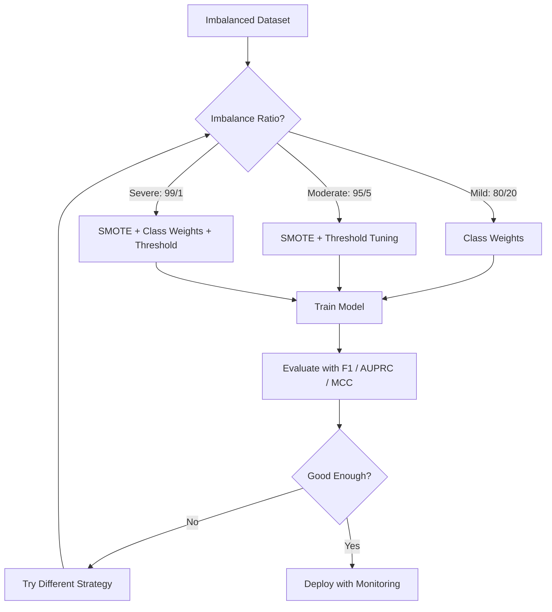
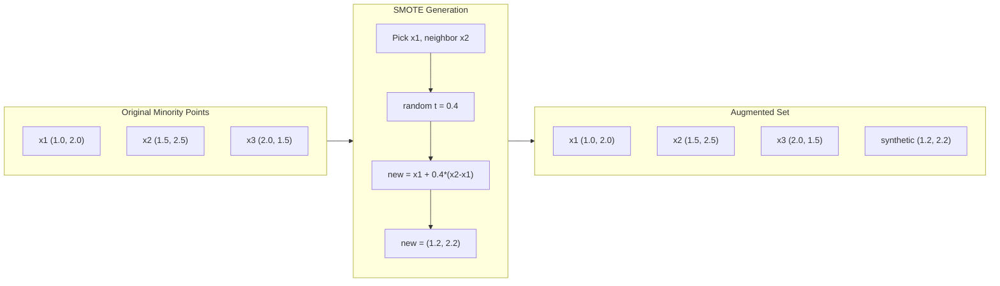
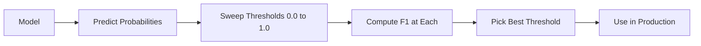
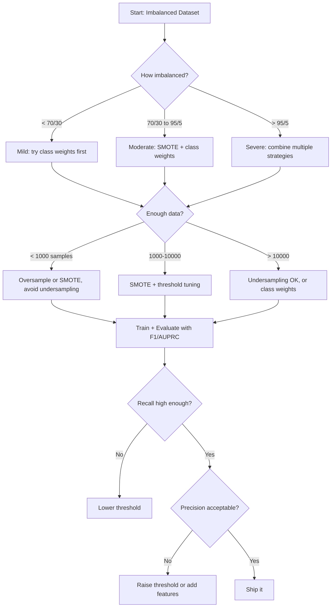

# 处理不平衡数据

> 当你的数据有 99% 都是“正常”时，accuracy 就是一个谎言。

**类型：** Build
**语言：** Python
**先修要求：** Phase 2, Lessons 01-09（尤其是评估指标）
**时间：** 约 90 分钟

## 学习目标

- 从零实现 SMOTE，并解释 synthetic oversampling 与随机复制有何不同
- 使用 F1、AUPRC 和 Matthews Correlation Coefficient 评估不平衡 classifier，而不是使用 accuracy
- 比较 class weighting、threshold tuning 和 resampling 策略，并为给定的不平衡比例选择合适方法
- 构建一个完整的不平衡数据 pipeline，结合 SMOTE、class weights 和 threshold optimization

## 问题

你构建了一个欺诈检测模型。它达到了 99.9% accuracy。你很高兴。然后你意识到它对每一笔交易都预测为“非欺诈”。

这不是 bug。当只有 0.1% 的交易是欺诈时，这正是理性的做法。模型学到的是：始终猜测 majority class 可以最小化总体错误。它在技术上是正确的，但完全没用。

凡是真正重要的 Classification 场景，都会遇到这种情况。疾病诊断：1% 阳性率。网络入侵：0.01% 攻击。制造缺陷：0.5% 缺陷率。垃圾邮件过滤：20% 垃圾邮件。流失预测：5% 流失用户。minority class 越重要，往往越稀少。

accuracy 会失败，因为它把所有正确预测都同等对待。正确标记一笔合法交易和正确抓住一次欺诈，都只算作 accuracy 的一分。但抓住欺诈才是模型存在的全部理由。我们需要能迫使模型关注稀有但重要类别的指标、技术和训练策略。

## 概念

### 为什么 Accuracy 会失败

考虑一个包含 1000 个样本的数据集：990 个 negative，10 个 positive。一个始终预测 negative 的模型：

|  | Predicted Positive | Predicted Negative |
|--|---|---|
| Actually Positive | 0 (TP) | 10 (FN) |
| Actually Negative | 0 (FP) | 990 (TN) |

Accuracy = (0 + 990) / 1000 = 99.0%

模型抓住了零次欺诈。零个疾病。零个缺陷。但 accuracy 显示 99%。这就是为什么 accuracy 对不平衡问题很危险。

### 更好的指标

**Precision** = TP / (TP + FP)。在所有被标记为 positive 的样本中，真正是 positive 的有多少？高 precision 意味着误报少。

**Recall** = TP / (TP + FN)。在所有真实 positive 的样本中，我们抓住了多少？高 recall 意味着漏掉的 positive 少。

**F1 Score** = 2 * precision * recall / (precision + recall)。调和平均数。相比算术平均数，它会更严厉地惩罚 precision 和 recall 之间的极端不平衡。

**F-beta Score** = (1 + beta^2) * precision * recall / (beta^2 * precision + recall)。当 beta > 1 时，recall 更重要。当 beta < 1 时，precision 更重要。F2 在欺诈检测中很常见（漏掉欺诈比误报更糟）。

**AUPRC**（Area Under Precision-Recall Curve）。类似 AUC-ROC，但对不平衡数据更有信息量。随机 classifier 的 AUPRC 等于 positive class 的比例（不像 ROC 那样是 0.5）。这让改进更容易被看见。

**Matthews Correlation Coefficient** = (TP * TN - FP * FN) / sqrt((TP+FP)(TP+FN)(TN+FP)(TN+FN))。范围从 -1 到 +1。只有当模型在两个类别上都表现良好时才会给出高分。即使类别规模差异很大，也保持平衡。

对于上面“始终预测 negative”的模型：precision = 0/0（未定义，通常设为 0），recall = 0/10 = 0，F1 = 0，MCC = 0。这些指标正确地识别出该模型毫无价值。

### 不平衡数据 Pipeline



### SMOTE: Synthetic Minority Oversampling Technique

随机 oversampling 会复制现有的 minority 样本。这能起作用，但有过拟合风险，因为模型会反复看到完全相同的点。

SMOTE 会创建新的 synthetic minority 样本，这些样本看起来合理，但不是副本。算法如下：

1. 对每个 minority 样本 x，在其他 minority 样本中找到它的 k 个最近邻
2. 随机选择一个邻居
3. 在 x 和该邻居之间的线段上创建一个新样本

公式：`new_sample = x + random(0, 1) * (neighbor - x)`

这会在真实 minority 点之间插值，在 feature space 的相同区域中创建样本，而不是仅仅复制已有数据。



### Sampling 策略对比

**Random Oversampling**：复制 minority 样本，使其数量匹配 majority。
- 优点：简单，没有信息损失
- 缺点：完全重复会导致过拟合，增加训练时间

**Random Undersampling**：移除 majority 样本，使其数量匹配 minority。
- 优点：训练快，简单
- 缺点：丢弃潜在有用的 majority 数据，方差更高

**SMOTE**：通过插值创建 synthetic minority 样本。
- 优点：生成新的数据点，相比 random oversampling 减少过拟合
- 缺点：可能在 decision boundary 附近创建噪声样本，不考虑 majority class 的分布

| Strategy | Data Changed | Risk | When to Use |
|----------|-------------|------|-------------|
| Oversample | 复制 minority | 过拟合 | 小数据集，中等不平衡 |
| Undersample | 移除 majority | 信息损失 | 大数据集，需要快速训练 |
| SMOTE | 添加 synthetic minority | 边界噪声 | 中等不平衡，有足够 minority 样本用于 k-NN |

### Class Weights

与其改变数据，不如改变模型对错误的处理方式。给 minority class 的误分类分配更高权重。

对于一个包含 950 个 negative 和 50 个 positive 样本的二元问题：
- negative class 的权重 = n_samples / (2 * n_negative) = 1000 / (2 * 950) = 0.526
- positive class 的权重 = n_samples / (2 * n_positive) = 1000 / (2 * 50) = 10.0

positive class 获得了 19 倍权重。误分类一个 positive 样本的代价，相当于误分类 19 个 negative 样本。模型被迫关注 minority class。

在 logistic regression 中，这会修改 Loss Function：

```
weighted_loss = -sum(w_i * [y_i * log(p_i) + (1-y_i) * log(1-p_i)])
```

其中 w_i 取决于样本 i 的类别。

Class weights 在期望意义上与 oversampling 在数学上等价，但不创建新的数据点。这让它们更快，并避免重复样本带来的过拟合风险。

### Threshold Tuning

大多数 classifier 会输出一个概率。默认阈值是 0.5：如果 P(positive) >= 0.5，就预测为 positive。但 0.5 是任意的。当类别不平衡时，最优阈值通常要低得多。

流程：
1. 训练一个模型
2. 在 validation set 上获取预测概率
3. 从 0.0 到 1.0 扫描阈值
4. 在每个阈值上计算 F1（或你选择的指标）
5. 选择使指标最大的阈值



一个模型可能对一笔欺诈交易输出 P(fraud) = 0.15。在阈值 0.5 下，它会被分类为非欺诈。在阈值 0.10 下，它会被正确抓住。概率校准的重要性低于排序：只要欺诈样本获得的概率高于非欺诈样本，就存在一个阈值可以将它们分开。

### Cost-Sensitive Learning

Class weights 的泛化形式。不是使用统一成本，而是分配特定的误分类成本：

| | Predict Positive | Predict Negative |
|--|---|---|
| Actually Positive | 0 (correct) | C_FN = 100 |
| Actually Negative | C_FP = 1 | 0 (correct) |

漏掉一笔欺诈交易（FN）的成本比一次误报（FP）高 100 倍。模型优化的是总成本，而不是总错误数。

当你能估计现实世界成本时，这是最有原则的方法。漏诊癌症和一次误报导致额外活检，其成本完全不同。显式写出这些成本，会迫使模型做出正确的权衡。

### 决策流程图



## 构建它

### 步骤 1：生成一个不平衡数据集

```python
import numpy as np


def make_imbalanced_data(n_majority=950, n_minority=50, seed=42):
    rng = np.random.RandomState(seed)

    X_maj = rng.randn(n_majority, 2) * 1.0 + np.array([0.0, 0.0])
    X_min = rng.randn(n_minority, 2) * 0.8 + np.array([2.5, 2.5])

    X = np.vstack([X_maj, X_min])
    y = np.concatenate([np.zeros(n_majority), np.ones(n_minority)])

    shuffle_idx = rng.permutation(len(y))
    return X[shuffle_idx], y[shuffle_idx]
```

### 步骤 2：从零实现 SMOTE

```python
def euclidean_distance(a, b):
    return np.sqrt(np.sum((a - b) ** 2))


def find_k_neighbors(X, idx, k):
    distances = []
    for i in range(len(X)):
        if i == idx:
            continue
        d = euclidean_distance(X[idx], X[i])
        distances.append((i, d))
    distances.sort(key=lambda x: x[1])
    return [d[0] for d in distances[:k]]


def smote(X_minority, k=5, n_synthetic=100, seed=42):
    rng = np.random.RandomState(seed)
    n_samples = len(X_minority)
    k = min(k, n_samples - 1)
    synthetic = []

    for _ in range(n_synthetic):
        idx = rng.randint(0, n_samples)
        neighbors = find_k_neighbors(X_minority, idx, k)
        neighbor_idx = neighbors[rng.randint(0, len(neighbors))]
        t = rng.random()
        new_point = X_minority[idx] + t * (X_minority[neighbor_idx] - X_minority[idx])
        synthetic.append(new_point)

    return np.array(synthetic)
```

### 步骤 3：Random oversampling 和 undersampling

```python
def random_oversample(X, y, seed=42):
    rng = np.random.RandomState(seed)
    classes, counts = np.unique(y, return_counts=True)
    max_count = counts.max()

    X_resampled = list(X)
    y_resampled = list(y)

    for cls, count in zip(classes, counts):
        if count < max_count:
            cls_indices = np.where(y == cls)[0]
            n_needed = max_count - count
            chosen = rng.choice(cls_indices, size=n_needed, replace=True)
            X_resampled.extend(X[chosen])
            y_resampled.extend(y[chosen])

    X_out = np.array(X_resampled)
    y_out = np.array(y_resampled)
    shuffle = rng.permutation(len(y_out))
    return X_out[shuffle], y_out[shuffle]


def random_undersample(X, y, seed=42):
    rng = np.random.RandomState(seed)
    classes, counts = np.unique(y, return_counts=True)
    min_count = counts.min()

    X_resampled = []
    y_resampled = []

    for cls in classes:
        cls_indices = np.where(y == cls)[0]
        chosen = rng.choice(cls_indices, size=min_count, replace=False)
        X_resampled.extend(X[chosen])
        y_resampled.extend(y[chosen])

    X_out = np.array(X_resampled)
    y_out = np.array(y_resampled)
    shuffle = rng.permutation(len(y_out))
    return X_out[shuffle], y_out[shuffle]
```

### 步骤 4：带 class weights 的 Logistic regression

```python
def sigmoid(z):
    return 1.0 / (1.0 + np.exp(-np.clip(z, -500, 500)))


def logistic_regression_weighted(X, y, weights, lr=0.01, epochs=200):
    n_samples, n_features = X.shape
    w = np.zeros(n_features)
    b = 0.0

    for _ in range(epochs):
        z = X @ w + b
        pred = sigmoid(z)
        error = pred - y
        weighted_error = error * weights

        gradient_w = (X.T @ weighted_error) / n_samples
        gradient_b = np.mean(weighted_error)

        w -= lr * gradient_w
        b -= lr * gradient_b

    return w, b


def compute_class_weights(y):
    classes, counts = np.unique(y, return_counts=True)
    n_samples = len(y)
    n_classes = len(classes)
    weight_map = {}
    for cls, count in zip(classes, counts):
        weight_map[cls] = n_samples / (n_classes * count)
    return np.array([weight_map[yi] for yi in y])
```

### 步骤 5：Threshold tuning

```python
def find_optimal_threshold(y_true, y_probs, metric="f1"):
    best_threshold = 0.5
    best_score = -1.0

    for threshold in np.arange(0.05, 0.96, 0.01):
        y_pred = (y_probs >= threshold).astype(int)
        tp = np.sum((y_pred == 1) & (y_true == 1))
        fp = np.sum((y_pred == 1) & (y_true == 0))
        fn = np.sum((y_pred == 0) & (y_true == 1))

        if metric == "f1":
            precision = tp / (tp + fp) if (tp + fp) > 0 else 0.0
            recall = tp / (tp + fn) if (tp + fn) > 0 else 0.0
            score = 2 * precision * recall / (precision + recall) if (precision + recall) > 0 else 0.0
        elif metric == "recall":
            score = tp / (tp + fn) if (tp + fn) > 0 else 0.0
        elif metric == "precision":
            score = tp / (tp + fp) if (tp + fp) > 0 else 0.0

        if score > best_score:
            best_score = score
            best_threshold = threshold

    return best_threshold, best_score
```

### 步骤 6：评估函数

```python
def confusion_matrix_values(y_true, y_pred):
    tp = np.sum((y_pred == 1) & (y_true == 1))
    tn = np.sum((y_pred == 0) & (y_true == 0))
    fp = np.sum((y_pred == 1) & (y_true == 0))
    fn = np.sum((y_pred == 0) & (y_true == 1))
    return tp, tn, fp, fn


def compute_metrics(y_true, y_pred):
    tp, tn, fp, fn = confusion_matrix_values(y_true, y_pred)
    accuracy = (tp + tn) / (tp + tn + fp + fn)
    precision = tp / (tp + fp) if (tp + fp) > 0 else 0.0
    recall = tp / (tp + fn) if (tp + fn) > 0 else 0.0
    f1 = 2 * precision * recall / (precision + recall) if (precision + recall) > 0 else 0.0

    denom = np.sqrt(float((tp + fp) * (tp + fn) * (tn + fp) * (tn + fn)))
    mcc = (tp * tn - fp * fn) / denom if denom > 0 else 0.0

    return {
        "accuracy": accuracy,
        "precision": precision,
        "recall": recall,
        "f1": f1,
        "mcc": mcc,
    }
```

### 步骤 7：比较所有方法

```python
X, y = make_imbalanced_data(950, 50, seed=42)
split = int(0.8 * len(y))
X_train, X_test = X[:split], X[split:]
y_train, y_test = y[:split], y[split:]

# Baseline: no treatment
w_base, b_base = logistic_regression_weighted(
    X_train, y_train, np.ones(len(y_train)), lr=0.1, epochs=300
)
probs_base = sigmoid(X_test @ w_base + b_base)
preds_base = (probs_base >= 0.5).astype(int)

# Oversampled
X_over, y_over = random_oversample(X_train, y_train)
w_over, b_over = logistic_regression_weighted(
    X_over, y_over, np.ones(len(y_over)), lr=0.1, epochs=300
)
preds_over = (sigmoid(X_test @ w_over + b_over) >= 0.5).astype(int)

# SMOTE
minority_mask = y_train == 1
X_minority = X_train[minority_mask]
synthetic = smote(X_minority, k=5, n_synthetic=len(y_train) - 2 * int(minority_mask.sum()))
X_smote = np.vstack([X_train, synthetic])
y_smote = np.concatenate([y_train, np.ones(len(synthetic))])
w_sm, b_sm = logistic_regression_weighted(
    X_smote, y_smote, np.ones(len(y_smote)), lr=0.1, epochs=300
)
preds_smote = (sigmoid(X_test @ w_sm + b_sm) >= 0.5).astype(int)

# Class weights
sample_weights = compute_class_weights(y_train)
w_cw, b_cw = logistic_regression_weighted(
    X_train, y_train, sample_weights, lr=0.1, epochs=300
)
probs_cw = sigmoid(X_test @ w_cw + b_cw)
preds_cw = (probs_cw >= 0.5).astype(int)

# Threshold tuning (tune on held-out validation set, not test set)
probs_val = sigmoid(X_val @ w_cw + b_cw)
best_thresh, best_f1 = find_optimal_threshold(y_val, probs_val, metric="f1")
preds_thresh = (probs_cw >= best_thresh).astype(int)
```

代码文件会在一个脚本中运行所有这些内容并打印结果。

## 使用它

借助 scikit-learn 和 imbalanced-learn，这些技术都只需一行：

```python
from sklearn.linear_model import LogisticRegression
from sklearn.metrics import classification_report, f1_score
from sklearn.model_selection import train_test_split
from imblearn.over_sampling import SMOTE
from imblearn.under_sampling import RandomUnderSampler
from imblearn.pipeline import Pipeline

X_train, X_test, y_train, y_test = train_test_split(X, y, stratify=y)

model_weighted = LogisticRegression(class_weight="balanced")
model_weighted.fit(X_train, y_train)
print(classification_report(y_test, model_weighted.predict(X_test)))

smote = SMOTE(random_state=42)
X_resampled, y_resampled = smote.fit_resample(X_train, y_train)
model_smote = LogisticRegression()
model_smote.fit(X_resampled, y_resampled)
print(classification_report(y_test, model_smote.predict(X_test)))

pipeline = Pipeline([
    ("smote", SMOTE()),
    ("model", LogisticRegression(class_weight="balanced")),
])
pipeline.fit(X_train, y_train)
print(classification_report(y_test, pipeline.predict(X_test)))
```

从零实现的版本会清楚展示每种技术具体做了什么。SMOTE 只是对 minority class 做 k-NN 插值。Class weights 会乘到 Loss 上。Threshold tuning 只是遍历 cutoff 的一个 for-loop。没有魔法。

## 交付它

本课会产出：
- `outputs/skill-imbalanced-data.md` -- 一份处理不平衡 Classification 问题的决策清单

## 练习

1. **Borderline-SMOTE**：修改 SMOTE 实现，只为靠近 decision boundary 的 minority 点生成 synthetic 样本（即那些 k-nearest neighbors 中包含 majority class 样本的点）。在类别重叠的数据集上与标准 SMOTE 比较结果。

2. **Cost matrix optimization**：实现 cost-sensitive learning，其中 cost matrix 是一个参数。创建一个函数，接收 cost matrix 并返回可最小化期望成本的最优预测。使用不同成本比例（1:10、1:100、1:1000）进行测试，并绘制 precision-recall 权衡如何变化。

3. **Threshold calibration**：实现 Platt scaling（在模型原始输出上拟合 logistic regression，以生成校准后的概率）。比较校准前后的 precision-recall curve。展示校准不会改变排序（AUC 保持不变），但会让概率更有意义。

4. **Ensemble with balanced bagging**：训练多个模型，每个模型都使用一个 balanced bootstrap 样本（所有 minority + majority 的随机子集）。对它们的预测取平均。将这种方法与单个使用 SMOTE 的模型进行比较。衡量性能以及多次运行之间的方差。

5. **Imbalance ratio experiment**：取一个平衡数据集，并逐步提高不平衡比例（50/50、70/30、90/10、95/5、99/1）。对每个比例，分别在使用和不使用 SMOTE 的情况下训练。绘制两种方法的 F1 vs imbalance ratio。在什么比例下，SMOTE 开始产生有意义的差异？

## 关键术语

| Term | What people say | What it actually means |
|------|----------------|----------------------|
| Class imbalance | “一个类别的样本多得多” | 数据集中类别分布显著偏斜，导致模型偏向 majority class |
| SMOTE | “Synthetic oversampling” | 通过在现有 minority 样本及其 k-nearest minority neighbors 之间插值，创建新的 minority 样本 |
| Class weights | “让 rare class 上的错误代价更高” | 用特定类别的权重乘以 Loss Function，使模型对 minority 误分类施加更重惩罚 |
| Threshold tuning | “移动 decision boundary” | 将 Classification 的概率 cutoff 从默认 0.5 改为能优化目标指标的值 |
| Precision-recall tradeoff | “你不能两者兼得” | 降低阈值会抓住更多 positive（更高 recall），但也会标记更多 false positive（更低 precision），反之亦然 |
| AUPRC | “PR curve 下的面积” | 将 precision-recall curve 汇总为一个数字；当类别严重不平衡时，比 AUC-ROC 信息量更大 |
| Matthews Correlation Coefficient | “平衡指标” | 预测标签与真实标签之间的相关性；只有模型在两个类别上都表现良好时才会产生高分 |
| Cost-sensitive learning | “不同错误的代价不同” | 将现实世界中的误分类成本纳入训练目标，使模型优化总成本，而不是错误数量 |
| Random oversampling | “复制 minority” | 重复 minority class 样本以平衡类别数量；简单，但有过拟合到重复点的风险 |

## 延伸阅读

- [SMOTE: Synthetic Minority Over-sampling Technique (Chawla et al., 2002)](https://arxiv.org/abs/1106.1813) -- 原始 SMOTE 论文，至今仍是不平衡学习中被引用最多的工作
- [Learning from Imbalanced Data (He & Garcia, 2009)](https://ieeexplore.ieee.org/document/5128907) -- 全面综述 sampling、cost-sensitive 和算法层面的方法
- [imbalanced-learn documentation](https://imbalanced-learn.org/stable/) -- Python 库，提供 SMOTE 变体、undersampling 策略和 pipeline 集成
- [The Precision-Recall Plot Is More Informative than the ROC Plot (Saito & Rehmsmeier, 2015)](https://journals.plos.org/plosone/article?id=10.1371/journal.pone.0118432) -- 何时以及为什么在不平衡问题中应优先使用 PR curves 而不是 ROC curves
