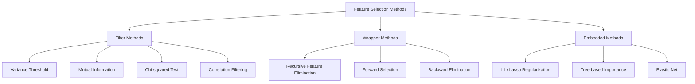
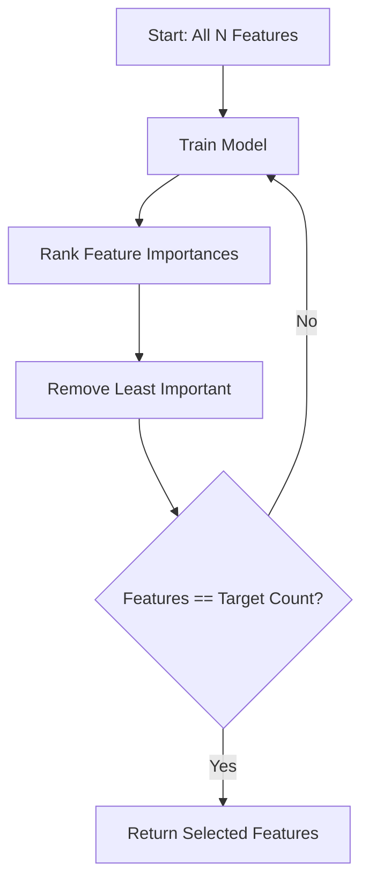
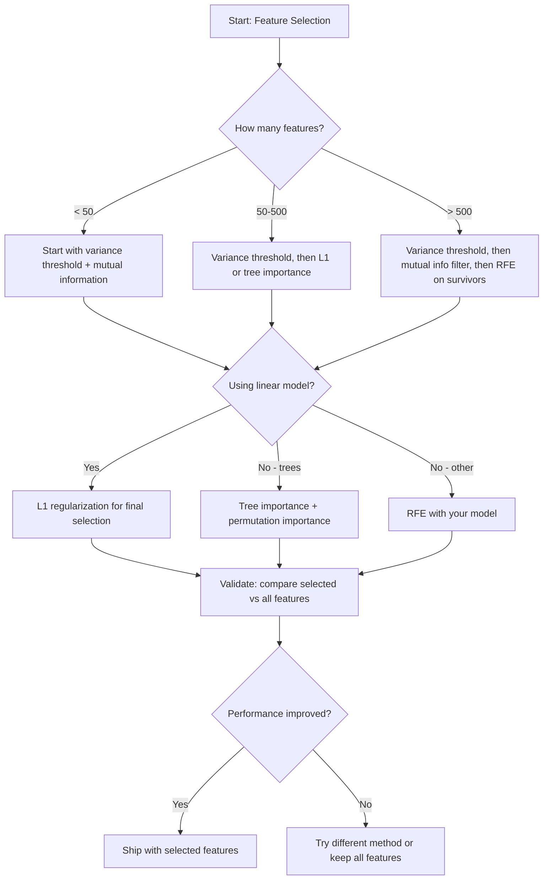

# Feature Selection

> 更多 features 并不更好。正确的 features 才更好。

**Type:** Build
**Language:** Python
**先修要求：** Phase 2, Lessons 01-09, 08（特征工程）
**Time:** ~75 分钟

## 学习目标
- 从零实现 filter methods（variance threshold、mutual information、chi-squared）和 wrapper methods（RFE、forward selection）
- 解释为什么 mutual information 能捕捉 correlation 会漏掉的非线性 feature-target 关系
- 比较 L1 regularization（embedded selection）与 RFE（wrapper selection），并评估它们的计算权衡
- 构建一个结合多种方法的 feature selection pipeline，并展示它在 held-out data 上改善 generalization 的效果

## 问题
你有 500 个 features。你的 model 训练很慢，经常 overfit，而且没人能解释它学到了什么。你不断添加更多 features，希望提升性能。结果变得更糟。

这就是 curse of dimensionality 的实际表现。随着 features 数量增长，feature space 的体积会爆炸式扩大。数据点变得稀疏。点之间的距离趋于收敛。model 需要指数级更多数据才能找到真实 patterns。noise features 会淹没 signal features。overfitting 变成默认状态。

Feature selection 是解药。剥离 noise。移除 redundancy。保留那些真正携带 target 信息的 features。结果是：训练更快、generalization 更好，并且 model 真的可以解释。

目标不是使用所有可用信息，而是使用正确的信息。

## 概念
### Feature Selection 的三类方法

每一种 feature selection 方法都属于以下三类之一：



**Filter methods** 使用统计度量独立地为每个 feature 打分。它们不使用 model。速度快，但会漏掉 feature interactions。

**Wrapper methods** 训练 model 来评估 feature subsets。它们使用 model performance 作为分数。结果更好，但成本更高，因为需要多次重新训练 model。

**Embedded methods** 在 model training 的过程中选择 features。L1 regularization 会把 weights 推向零。Decision trees 会基于最有用的 features 进行 split。Selection 发生在 fitting 期间，而不是作为单独步骤。

### Variance Threshold

最简单的 filter。如果一个 feature 在 samples 之间几乎不变化，它几乎不携带信息。

考虑一个 feature，在 1000 个 samples 中有 999 个都是 0.0。它的 variance 接近零。没有 model 能用它来区分类别。移除它。

```
variance(x) = mean((x - mean(x))^2)
```

设置一个 threshold（例如 0.01）。丢弃每个 variance 低于该 threshold 的 feature。这会在完全不查看 target variable 的情况下移除 constant 或 near-constant features。

使用场景：作为其他方法之前的 preprocessing step。它几乎零成本地捕捉明显无用的 features。

局限：一个 feature 可能有高 variance，但仍然是纯 noise。Variance threshold 是必要的，但不充分。

### Mutual Information

Mutual information 衡量知道 feature X 的值能在多大程度上减少对 target Y 的不确定性。

```
I(X; Y) = sum_x sum_y p(x, y) * log(p(x, y) / (p(x) * p(y)))
```

如果 X 和 Y 独立，则 p(x, y) = p(x) * p(y)，因此 log 项为零，I(X; Y) = 0。X 能告诉你越多关于 Y 的信息，mutual information 就越高。

相对于 correlation 的关键优势：mutual information 能捕捉非线性关系。某个 feature 可能与 target 的 correlation 为零，但 mutual information 很高，因为关系可能是 quadratic 或 periodic。

对于 continuous features，先 discretize 成 bins（基于 histogram 的估计）。bins 的数量会影响估计结果：bins 太少会丢失信息，bins 太多会增加 noise。常见选择：sqrt(n) bins 或 Sturges' rule（1 + log2(n)）。


### Recursive Feature Elimination (RFE)

RFE 是一种 wrapper method。它使用 model 自身的 feature importance 进行迭代式剪枝：

1. 使用所有 features 训练 model
2. 按 importance 对 features 排名（linear models 使用 coefficients，trees 使用 impurity reduction）
3. 移除最不重要的 feature(s)
4. 重复，直到剩下期望数量的 features



RFE 会考虑 feature interactions，因为 model 会同时看到所有剩余 features。移除一个 feature 会改变其他 features 的 importance。这让它比 filter methods 更彻底。

成本：你需要训练 model N - target 次。对于 500 个 features、target 为 10 的情况，就是 490 次训练。对于昂贵的 models，这会很慢。可以通过每步移除多个 features 来加速（例如每轮移除底部 10%）。

### L1 (Lasso) Regularization

L1 regularization 会把 weights 的绝对值加入 Loss Function：

```
loss = prediction_error + alpha * sum(|w_i|)
```

alpha 参数控制 features 被剪枝的激进程度。alpha 越高，越多 weights 会精确变成零。

为什么会精确为零？L1 penalty 在 weight space 中创建了一个菱形约束区域。最优解往往会落在这个菱形的角上，在那里一个或多个 weights 为零。L2 regularization（ridge）创建的是圆形约束，weights 会缩小，但很少正好变成零。

这就是 embedded feature selection：model 在训练期间学习哪些 features 应该忽略。weight 为零的 features 等价于被移除。

优势：只需一次训练，能处理 correlated features（选择其中一个并把其他置零），内置于大多数 linear model 实现中。

局限：只适用于 linear models。不能捕捉非线性 feature importance。

### Tree-Based Feature Importance

Decision trees 及其 ensembles（random forests、gradient boosting）会自然地对 features 排名。每个 split 都会减少 impurity（classification 使用 Gini 或 entropy，Regression 使用 variance）。产生更大 impurity reductions 的 features 更重要。

对于有 T 棵 trees 的 random forest：

```
importance(feature_j) = (1/T) * sum over all trees of
    sum over all nodes splitting on feature_j of
        (n_samples * impurity_decrease)
```

这会为每个 feature 给出 normalized importance score。它能自动处理非线性关系和 feature interactions。

注意：tree-based importance 会偏向具有许多 unique values 的 features（high cardinality）。随机 ID 列会显得重要，因为它能完美 split 每个 sample。使用 permutation importance 作为 sanity check。

### Permutation Importance

一种 model-agnostic 方法：

1. 训练 model，并在 validation data 上记录 baseline performance
2. 对每个 feature：随机 shuffle 它的 values，测量 performance 的下降
3. 下降越大，该 feature 越重要

如果 shuffle 某个 feature 不损害 performance，说明 model 不依赖它。如果 performance 崩溃，该 feature 就很关键。

Permutation importance 避免了 tree-based importance 的 cardinality bias。但它很慢：每个 feature 都需要一次完整 evaluation，并且要重复多次以获得稳定性。

### Comparison Table

| Method | Type | Speed | Nonlinear | Feature Interactions |
|--------|------|-------|-----------|---------------------|
| Variance threshold | Filter | 非常快 | 否 | 否 |
| Mutual information | Filter | 快 | 是 | 否 |
| Correlation filter | Filter | 快 | 否 | 否 |
| RFE | Wrapper | 慢 | 取决于 model | 是 |
| L1 / Lasso | Embedded | 快 | 否（linear） | 否 |
| Tree importance | Embedded | 中等 | 是 | 是 |
| Permutation importance | Model-agnostic | 慢 | 是 | 是 |

### Decision Flowchart



## 构建它
### 步骤 1： Generate synthetic data with known feature structure

```python
import numpy as np


def make_feature_selection_data(n_samples=500, seed=42):
    rng = np.random.RandomState(seed)

    x1 = rng.randn(n_samples)
    x2 = rng.randn(n_samples)
    x3 = rng.randn(n_samples)
    x4 = x1 + 0.1 * rng.randn(n_samples)
    x5 = x2 + 0.1 * rng.randn(n_samples)

    informative = np.column_stack([x1, x2, x3, x4, x5])

    correlated = np.column_stack([
        x1 * 0.9 + 0.1 * rng.randn(n_samples),
        x2 * 0.8 + 0.2 * rng.randn(n_samples),
        x3 * 0.7 + 0.3 * rng.randn(n_samples),
        x1 * 0.5 + x2 * 0.5 + 0.1 * rng.randn(n_samples),
        x2 * 0.6 + x3 * 0.4 + 0.1 * rng.randn(n_samples),
    ])

    noise = rng.randn(n_samples, 10) * 0.5

    X = np.hstack([informative, correlated, noise])
    y = (2 * x1 - 1.5 * x2 + x3 + 0.5 * rng.randn(n_samples) > 0).astype(int)

    feature_names = (
        [f"info_{i}" for i in range(5)]
        + [f"corr_{i}" for i in range(5)]
        + [f"noise_{i}" for i in range(10)]
    )

    return X, y, feature_names
```

我们知道 ground truth：features 0-4 是 informative（并且 3 和 4 是 0 和 1 的 correlated copies），features 5-9 与 informative features 相关，features 10-19 是纯 noise。好的 selection method 应该把 0-4 排得最高，把 10-19 排得最低。

### 步骤 2： Variance threshold

```python
def variance_threshold(X, threshold=0.01):
    variances = np.var(X, axis=0)
    mask = variances > threshold
    return mask, variances
```

### 步骤 3： Mutual information (discrete)

```python
def discretize(x, n_bins=10):
    min_val, max_val = x.min(), x.max()
    if max_val == min_val:
        return np.zeros_like(x, dtype=int)
    bin_edges = np.linspace(min_val, max_val, n_bins + 1)
    binned = np.digitize(x, bin_edges[1:-1])
    return binned


def mutual_information(X, y, n_bins=10):
    n_samples, n_features = X.shape
    mi_scores = np.zeros(n_features)

    y_vals, y_counts = np.unique(y, return_counts=True)
    p_y = y_counts / n_samples

    for f in range(n_features):
        x_binned = discretize(X[:, f], n_bins)
        x_vals, x_counts = np.unique(x_binned, return_counts=True)
        p_x = dict(zip(x_vals, x_counts / n_samples))

        mi = 0.0
        for xv in x_vals:
            for yi, yv in enumerate(y_vals):
                joint_mask = (x_binned == xv) & (y == yv)
                p_xy = np.sum(joint_mask) / n_samples
                if p_xy > 0:
                    mi += p_xy * np.log(p_xy / (p_x[xv] * p_y[yi]))
        mi_scores[f] = mi

    return mi_scores
```

### 步骤 4： Recursive Feature Elimination

```python
def simple_logistic_importance(X, y, lr=0.1, epochs=100):
    n_samples, n_features = X.shape
    w = np.zeros(n_features)
    b = 0.0

    for _ in range(epochs):
        z = X @ w + b
        pred = 1.0 / (1.0 + np.exp(-np.clip(z, -500, 500)))
        error = pred - y
        w -= lr * (X.T @ error) / n_samples
        b -= lr * np.mean(error)

    return w, b


def rfe(X, y, n_features_to_select=5, lr=0.1, epochs=100):
    n_total = X.shape[1]
    remaining = list(range(n_total))
    rankings = np.ones(n_total, dtype=int)
    rank = n_total

    while len(remaining) > n_features_to_select:
        X_subset = X[:, remaining]
        w, _ = simple_logistic_importance(X_subset, y, lr, epochs)
        importances = np.abs(w)

        least_idx = np.argmin(importances)
        original_idx = remaining[least_idx]
        rankings[original_idx] = rank
        rank -= 1
        remaining.pop(least_idx)

    for idx in remaining:
        rankings[idx] = 1

    selected_mask = rankings == 1
    return selected_mask, rankings
```

### 步骤 5： L1 feature selection

```python
def soft_threshold(w, alpha):
    return np.sign(w) * np.maximum(np.abs(w) - alpha, 0)


def l1_feature_selection(X, y, alpha=0.1, lr=0.01, epochs=500):
    n_samples, n_features = X.shape
    w = np.zeros(n_features)
    b = 0.0

    for _ in range(epochs):
        z = X @ w + b
        pred = 1.0 / (1.0 + np.exp(-np.clip(z, -500, 500)))
        error = pred - y

        gradient_w = (X.T @ error) / n_samples
        gradient_b = np.mean(error)

        w -= lr * gradient_w
        w = soft_threshold(w, lr * alpha)
        b -= lr * gradient_b

    selected_mask = np.abs(w) > 1e-6
    return selected_mask, w
```

### 步骤 6： Tree-based importance (simple decision tree)

```python
def gini_impurity(y):
    if len(y) == 0:
        return 0.0
    classes, counts = np.unique(y, return_counts=True)
    probs = counts / len(y)
    return 1.0 - np.sum(probs ** 2)


def best_split(X, y, feature_idx):
    values = np.unique(X[:, feature_idx])
    if len(values) <= 1:
        return None, -1.0

    best_threshold = None
    best_gain = -1.0
    parent_gini = gini_impurity(y)
    n = len(y)

    for i in range(len(values) - 1):
        threshold = (values[i] + values[i + 1]) / 2.0
        left_mask = X[:, feature_idx] <= threshold
        right_mask = ~left_mask

        n_left = np.sum(left_mask)
        n_right = np.sum(right_mask)

        if n_left == 0 or n_right == 0:
            continue

        gain = parent_gini - (n_left / n) * gini_impurity(y[left_mask]) - (n_right / n) * gini_impurity(y[right_mask])

        if gain > best_gain:
            best_gain = gain
            best_threshold = threshold

    return best_threshold, best_gain


def tree_importance(X, y, n_trees=50, max_depth=5, seed=42):
    rng = np.random.RandomState(seed)
    n_samples, n_features = X.shape
    importances = np.zeros(n_features)

    for _ in range(n_trees):
        sample_idx = rng.choice(n_samples, size=n_samples, replace=True)
        feature_subset = rng.choice(n_features, size=max(1, int(np.sqrt(n_features))), replace=False)

        X_boot = X[sample_idx]
        y_boot = y[sample_idx]

        tree_imp = _build_tree_importance(X_boot, y_boot, feature_subset, max_depth)
        importances += tree_imp

    total = importances.sum()
    if total > 0:
        importances /= total

    return importances


def _build_tree_importance(X, y, feature_subset, max_depth, depth=0):
    n_features = X.shape[1]
    importances = np.zeros(n_features)

    if depth >= max_depth or len(np.unique(y)) <= 1 or len(y) < 4:
        return importances

    best_feature = None
    best_threshold = None
    best_gain = -1.0

    for f in feature_subset:
        threshold, gain = best_split(X, y, f)
        if gain > best_gain:
            best_gain = gain
            best_feature = f
            best_threshold = threshold

    if best_feature is None or best_gain <= 0:
        return importances

    importances[best_feature] += best_gain * len(y)

    left_mask = X[:, best_feature] <= best_threshold
    right_mask = ~left_mask

    importances += _build_tree_importance(X[left_mask], y[left_mask], feature_subset, max_depth, depth + 1)
    importances += _build_tree_importance(X[right_mask], y[right_mask], feature_subset, max_depth, depth + 1)

    return importances
```

### 步骤 7： Run all methods and compare

代码文件会在同一个 synthetic dataset 上运行全部五种方法，并打印一个 comparison table，显示每种方法选择了哪些 features。

## 使用它
使用 scikit-learn 时，feature selection 已内置到 pipeline 中：

```python
from sklearn.feature_selection import (
    VarianceThreshold,
    mutual_info_classif,
    RFE,
    SelectFromModel,
)
from sklearn.linear_model import Lasso, LogisticRegression
from sklearn.ensemble import RandomForestClassifier

vt = VarianceThreshold(threshold=0.01)
X_filtered = vt.fit_transform(X)

mi_scores = mutual_info_classif(X, y)
top_k = np.argsort(mi_scores)[-10:]

rfe_selector = RFE(LogisticRegression(), n_features_to_select=10)
rfe_selector.fit(X, y)
X_rfe = rfe_selector.transform(X)

lasso_selector = SelectFromModel(Lasso(alpha=0.01))
lasso_selector.fit(X, y)
X_lasso = lasso_selector.transform(X)

rf = RandomForestClassifier(n_estimators=100)
rf.fit(X, y)
importances = rf.feature_importances_
```

这些 from-scratch 实现准确展示了每种方法内部发生的事情。Variance threshold 只是计算 `var(X, axis=0)` 并应用 mask。Mutual information 是在 contingency table 中统计 joint 和 marginal frequencies。RFE 是一个训练、排名、剪枝的 loop。L1 是带 soft-thresholding 步骤的 Gradient Descent。Tree importance 会在 splits 之间累积 impurity reductions。没有魔法，只是 statistics 和 loops。

sklearn 版本增加了 robustness（例如，mutual_info_classif 使用 k-NN density estimation 而不是 binning）、speed（C 实现）和 pipeline integration。

## 交付它
本课产出：
- `outputs/skill-feature-selector.md` -- 用于选择正确 feature selection method 的快速参考 decision tree

## 练习
1. **Forward selection**：实现 RFE 的反向过程。从零个 features 开始。每一步添加最能提升 model performance 的 feature。当添加 features 不再有帮助时停止。将选出的 features 与 RFE 结果比较。哪个更快？哪个结果更好？

2. **Stability selection**：运行 L1 feature selection 50 次，每次使用数据的随机 80% subsample，并使用略有不同的 alpha values。统计每个 feature 被选择的频率。在 > 80% runs 中被选中的 features 是“stable”的。将 stable features 与单次运行的 L1 selection 比较。哪个更可靠？

3. **Multicollinearity detection**：计算所有 features 的 correlation matrix。实现一个函数，给定 correlation threshold（例如 0.9），从每一对 highly-correlated features 中移除一个 feature（保留与 target 的 mutual information 更高的那个）。在 synthetic dataset 上测试，并验证它移除了 redundant correlated features。

4. **Feature selection pipeline**：把 variance threshold、mutual information filter 和 RFE 串成一个 pipeline。先移除 near-zero-variance features，然后按 mutual information 保留 top 50%，再在 survivors 上运行 RFE。将该 pipeline 与直接在所有 features 上运行 RFE 比较。pipeline 更快吗？准确性是否相同？

5. **Permutation importance from scratch**：实现 permutation importance。对每个 feature，shuffle 它的 values 10 次，测量 F1 score 的平均下降。将 ranking 与 tree-based importance 比较。找出它们不一致的情况并解释原因（提示：correlated features）。

## 关键术语
| Term | What people say | What it actually means |
|------|----------------|----------------------|
| Filter method | “独立为 features 打分” | 一种 feature selection 方法，不训练 model，而是使用统计度量对 features 排名，并孤立地评估每个 feature |
| Wrapper method | “用 model 挑 features” | 一种 feature selection 方法，通过训练 model 并使用其 performance 作为 selection criterion 来评估 feature subsets |
| Embedded method | “model 在训练期间选择 features” | 作为 model fitting 一部分发生的 feature selection，例如 L1 regularization 会把 weights 推向零 |
| Mutual information | “一个变量能告诉你关于另一个变量的多少信息” | 给定 X 的知识后，关于 Y 的不确定性减少量的度量，能够捕捉线性和非线性 dependencies |
| Recursive Feature Elimination | “训练、排名、剪枝、重复” | 一种迭代式 wrapper method，会训练 model、移除最不重要的 feature(s)，并重复直到达到 target count |
| L1 / Lasso regularization | “会消灭 features 的 penalty” | 将 weight 绝对值之和加入 Loss Function，这会把不重要 feature 的 weights 推到精确为零 |
| Variance threshold | “移除 constant features” | 丢弃在 samples 之间 variance 低于指定 threshold 的 features，过滤掉不携带信息的 features |
| Feature importance | “哪些 features 最重要” | 表示每个 feature 对 model predictions 贡献程度的分数，可由 split gains（trees）或 coefficient magnitudes（linear）计算 |
| Permutation importance | “shuffle 并测量损害” | 通过随机 shuffle 每个 feature 的 values，并测量由此导致的 model performance 下降来评估 feature importance |
| Curse of dimensionality | “features 太多，data 不够” | 添加 features 会使 feature space 的体积指数级增长，导致 data 稀疏且 distances 失去意义的现象 |

## 延伸阅读
- [An Introduction to Variable and Feature Selection (Guyon & Elisseeff, 2003)](https://jmlr.org/papers/v3/guyon03a.html) -- feature selection methods 的奠基性综述，至今仍被广泛引用
- [scikit-learn Feature Selection Guide](https://scikit-learn.org/stable/modules/feature_selection.html) -- 关于 filter、wrapper 和 embedded methods 的实用参考，包含代码示例
- [Stability Selection (Meinshausen & Buhlmann, 2010)](https://arxiv.org/abs/0809.2932) -- 将 subsampling 与 feature selection 结合，用于获得 robust、reproducible 的结果
- [Beware Default Random Forest Importances (Strobl et al., 2007)](https://bmcbioinformatics.biomedcentral.com/articles/10.1186/1471-2105-8-25) -- 展示 tree-based importance 中的 cardinality bias，并提出 conditional importance 作为替代方案
