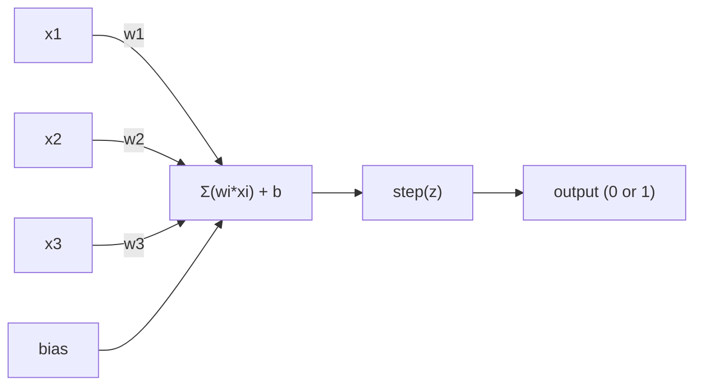
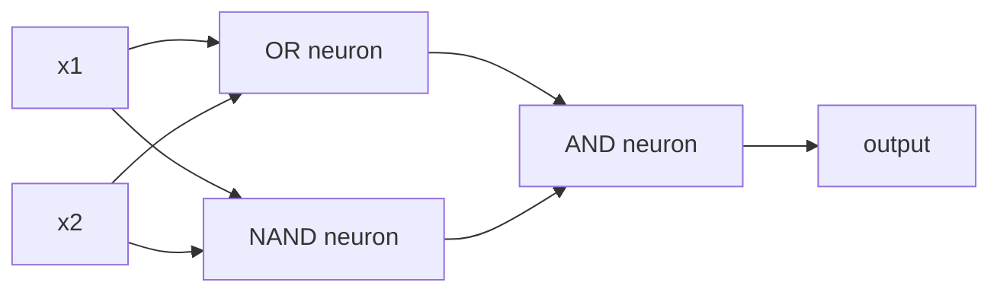

# Perceptron

> Perceptron 是 Neural Network 的原子。把它拆开，你会看到 weights、一个 bias，以及一次 decision。

**类型：** 构建
**语言：** Python
**先修要求：** Phase 1（Linear Algebra 直觉）
**时间：** ~60 分钟

## 学习目标
- 用 Python 从零实现一个 Perceptron，包括 weight update rule 和 step activation function
- 解释为什么单个 Perceptron 只能解决 linearly separable 问题，并演示 XOR failure case
- 通过组合 OR、NAND 和 AND gates 构建一个 multi-layer perceptron 来解决 XOR
- 使用 sigmoid activation 和 backpropagation 训练一个 two-layer network，使其自动学习 XOR

## 问题
你已经理解了 Vector 和 dot product。你知道 Matrix 会把 inputs 转换成 outputs。但机器到底如何 *learn* 应该使用哪种 transformation？

Perceptron 回答了这个问题。它是最简单的 learning machine：接收一些 inputs，乘以 weights，加上 bias，然后做出一个 binary decision。接着再调整。就是这样。历史上构建过的每一个 Neural Network，本质上都是把这个想法一层层堆叠起来。

理解 Perceptron，就意味着理解代码里的 “learning” 到底是什么：不断调整数字，直到 output 符合现实。

## 概念
### 一个 Neuron，一个 Decision

一个 Perceptron 接收 n 个 inputs，将每个 input 乘以一个 weight，求和，加上 bias，然后把结果传入一个 activation function。



step function 非常直接：如果 weighted sum 加 bias >= 0，则 output 为 1。否则，output 为 0。

```
step(z) = 1  if z >= 0
           0  if z < 0
```

这是一个 linear classifier。weights 和 bias 定义了一条线（或在更高维空间中定义一个 hyperplane），把 input space 分成两个区域。

### The Decision Boundary

对于两个 inputs，Perceptron 会在 2D space 中画出一条线：

```
  x2
  ┤
  │  Class 1        /
  │    (0)          /
  │                /
  │               / w1·x1 + w2·x2 + b = 0
  │              /
  │             /     Class 2
  │            /        (1)
  ┼───────────/──────────── x1
```

线一侧的所有点 output 为 0。另一侧的所有点 output 为 1。训练过程会移动这条线，直到它能正确分离这些 classes。

### The Learning Rule

Perceptron learning rule 很简单：

```
For each training example (x, y_true):
    y_pred = predict(x)
    error = y_true - y_pred

    For each weight:
        w_i = w_i + learning_rate * error * x_i
    bias = bias + learning_rate * error
```

如果 prediction 正确，error = 0，什么都不会改变。如果它预测为 0 但应该是 1，weights 会增大。如果它预测为 1 但应该是 0，weights 会减小。learning rate 控制每次 adjustment 的幅度。

### The XOR Problem

问题就出在这里。看看这些 logic gates：

```
AND gate:           OR gate:            XOR gate:
x1  x2  out         x1  x2  out         x1  x2  out
0   0   0           0   0   0           0   0   0
0   1   0           0   1   1           0   1   1
1   0   0           1   0   1           1   0   1
1   1   1           1   1   1           1   1   0
```

AND 和 OR 是 linearly separable 的：你可以画出一条线，把 0 和 1 分开。XOR 则不是。没有任何一条直线能把 [0,1] 和 [1,0] 与 [0,0] 和 [1,1] 分开。

```
AND (separable):        XOR (not separable):

  x2                      x2
  1 ┤  0     1            1 ┤  1     0
    │     /                 │
  0 ┤  0 / 0              0 ┤  0     1
    ┼──/──────── x1         ┼──────────── x1
       line works!          no single line works!
```

这是一个根本限制。单个 Perceptron 只能解决 linearly separable 问题。Minsky 和 Papert 在 1969 年证明了这一点，而这几乎让 Neural Network 研究停滞了十年。

解决办法：把 Perceptron 堆叠成 layers。multi-layer perceptron 可以通过把两个 linear decisions 组合成一个 nonlinear decision 来解决 XOR。

## 构建它
### 步骤 1：The Perceptron class

```python
class Perceptron:
    def __init__(self, n_inputs, learning_rate=0.1):
        self.weights = [0.0] * n_inputs
        self.bias = 0.0
        self.lr = learning_rate

    def predict(self, inputs):
        total = sum(w * x for w, x in zip(self.weights, inputs))
        total += self.bias
        return 1 if total >= 0 else 0

    def train(self, training_data, epochs=100):
        for epoch in range(epochs):
            errors = 0
            for inputs, target in training_data:
                prediction = self.predict(inputs)
                error = target - prediction
                if error != 0:
                    errors += 1
                    for i in range(len(self.weights)):
                        self.weights[i] += self.lr * error * inputs[i]
                    self.bias += self.lr * error
            if errors == 0:
                print(f"Converged at epoch {epoch + 1}")
                return
        print(f"Did not converge after {epochs} epochs")
```

### 步骤 2：在 logic gates 上训练

```python
and_data = [
    ([0, 0], 0),
    ([0, 1], 0),
    ([1, 0], 0),
    ([1, 1], 1),
]

or_data = [
    ([0, 0], 0),
    ([0, 1], 1),
    ([1, 0], 1),
    ([1, 1], 1),
]

not_data = [
    ([0], 1),
    ([1], 0),
]

print("=== AND Gate ===")
p_and = Perceptron(2)
p_and.train(and_data)
for inputs, _ in and_data:
    print(f"  {inputs} -> {p_and.predict(inputs)}")

print("\n=== OR Gate ===")
p_or = Perceptron(2)
p_or.train(or_data)
for inputs, _ in or_data:
    print(f"  {inputs} -> {p_or.predict(inputs)}")

print("\n=== NOT Gate ===")
p_not = Perceptron(1)
p_not.train(not_data)
for inputs, _ in not_data:
    print(f"  {inputs} -> {p_not.predict(inputs)}")
```

### 步骤 3：观察 XOR 失败

```python
xor_data = [
    ([0, 0], 0),
    ([0, 1], 1),
    ([1, 0], 1),
    ([1, 1], 0),
]

print("\n=== XOR Gate (single perceptron) ===")
p_xor = Perceptron(2)
p_xor.train(xor_data, epochs=1000)
for inputs, expected in xor_data:
    result = p_xor.predict(inputs)
    status = "OK" if result == expected else "WRONG"
    print(f"  {inputs} -> {result} (expected {expected}) {status}")
```

它永远不会 converge。这就是单个 Perceptron 无法学习 XOR 的硬证据。

### 步骤 4：用 two layers 解决 XOR

技巧是：XOR = (x1 OR x2) AND NOT (x1 AND x2)。组合三个 Perceptron：



```python
def xor_network(x1, x2):
    or_neuron = Perceptron(2)
    or_neuron.weights = [1.0, 1.0]
    or_neuron.bias = -0.5

    nand_neuron = Perceptron(2)
    nand_neuron.weights = [-1.0, -1.0]
    nand_neuron.bias = 1.5

    and_neuron = Perceptron(2)
    and_neuron.weights = [1.0, 1.0]
    and_neuron.bias = -1.5

    hidden1 = or_neuron.predict([x1, x2])
    hidden2 = nand_neuron.predict([x1, x2])
    output = and_neuron.predict([hidden1, hidden2])
    return output


print("\n=== XOR Gate (multi-layer network) ===")
for inputs, expected in xor_data:
    result = xor_network(inputs[0], inputs[1])
    print(f"  {inputs} -> {result} (expected {expected})")
```

四种情况全部正确。把 Perceptron 堆叠成 layers，可以创建单个 Perceptron 无法产生的 decision boundaries。

### 步骤 5：训练一个 Two-Layer Network

Step 4 手动连接了 weights。这对 XOR 有效，但对于你事先不知道正确 weights 的真实问题就不适用了。解决办法：把 step function 替换为 sigmoid，并通过 backpropagation 自动学习 weights。

```python
class TwoLayerNetwork:
    def __init__(self, learning_rate=0.5):
        import random
        random.seed(0)
        self.w_hidden = [[random.uniform(-1, 1), random.uniform(-1, 1)] for _ in range(2)]
        self.b_hidden = [random.uniform(-1, 1), random.uniform(-1, 1)]
        self.w_output = [random.uniform(-1, 1), random.uniform(-1, 1)]
        self.b_output = random.uniform(-1, 1)
        self.lr = learning_rate

    def sigmoid(self, x):
        import math
        x = max(-500, min(500, x))
        return 1.0 / (1.0 + math.exp(-x))

    def forward(self, inputs):
        self.inputs = inputs
        self.hidden_outputs = []
        for i in range(2):
            z = sum(w * x for w, x in zip(self.w_hidden[i], inputs)) + self.b_hidden[i]
            self.hidden_outputs.append(self.sigmoid(z))
        z_out = sum(w * h for w, h in zip(self.w_output, self.hidden_outputs)) + self.b_output
        self.output = self.sigmoid(z_out)
        return self.output

    def train(self, training_data, epochs=10000):
        for epoch in range(epochs):
            total_error = 0
            for inputs, target in training_data:
                output = self.forward(inputs)
                error = target - output
                total_error += error ** 2

                d_output = error * output * (1 - output)

                saved_w_output = self.w_output[:]
                hidden_deltas = []
                for i in range(2):
                    h = self.hidden_outputs[i]
                    hd = d_output * saved_w_output[i] * h * (1 - h)
                    hidden_deltas.append(hd)

                for i in range(2):
                    self.w_output[i] += self.lr * d_output * self.hidden_outputs[i]
                self.b_output += self.lr * d_output

                for i in range(2):
                    for j in range(len(inputs)):
                        self.w_hidden[i][j] += self.lr * hidden_deltas[i] * inputs[j]
                    self.b_hidden[i] += self.lr * hidden_deltas[i]
```

```python
net = TwoLayerNetwork(learning_rate=2.0)
net.train(xor_data, epochs=10000)
for inputs, expected in xor_data:
    result = net.forward(inputs)
    predicted = 1 if result >= 0.5 else 0
    print(f"  {inputs} -> {result:.4f} (rounded: {predicted}, expected {expected})")
```

它与 Step 4 有两个关键区别。第一，sigmoid 替代了 step function，因为它是平滑的，所以 Gradient 存在。第二，`train` 方法把 error 从 output Backpropagation到 hidden layer，并按每个 weight 对 error 的贡献比例调整它们。这就是 20 行代码里的 Backpropagation。

这是通向 Lesson 03 的桥梁。`d_output` 和 `hidden_deltas` 背后的数学，是把 chain rule 应用到 network graph 上。我们会在那里正式推导它。

## 使用它
你刚刚从零构建的所有内容，都存在于一个 import 中：

```python
from sklearn.linear_model import Perceptron as SkPerceptron
import numpy as np

X = np.array([[0,0],[0,1],[1,0],[1,1]])
y = np.array([0, 0, 0, 1])

clf = SkPerceptron(max_iter=100, tol=1e-3)
clf.fit(X, y)
print([clf.predict([x])[0] for x in X])
```

五行。你的 30 行 `Perceptron` class 做的是同一件事。sklearn 版本增加了 convergence checks、多种 Loss functions，以及 sparse input support，但核心循环完全相同：weighted sum、step function、在 error 上更新 weight。

真正的差距会在规模上显现。production networks 中会发生什么变化：

- step function 会变成 sigmoid、ReLU 或其他平滑 activation
- weights 会通过 backpropagation 自动学习（Lesson 03）
- layers 会变得更深：3、10、100+ layers
- 同一个原则仍然成立：每一层都从前一层的 outputs 中创建新的 features

单个 Perceptron 只能画直线。把它们堆叠起来，你就可以画出任意形状。

## 交付它
本课会产出：
- `outputs/skill-perceptron.md` - 一份 skill，说明什么时候需要 single-layer 与 multi-layer architectures

## 练习
1. 在 NAND gate（universal gate，任何 logic circuit 都可以由 NAND 构建）上训练一个 Perceptron。验证它的 weights 和 bias 构成一个有效的 decision boundary。
2. 修改 Perceptron class，使其在每个 epoch 跟踪 decision boundary（w1*x1 + w2*x2 + b = 0）。打印在 AND gate 训练期间这条线如何移动。
3. 构建一个 3-input Perceptron：只有当 3 个 inputs 中至少 2 个为 1 时才 output 1（majority vote function）。它是 linearly separable 的吗？为什么？

## 关键术语
| Term | What people say | What it actually means |
|------|----------------|----------------------|
| Perceptron | “一个假的 neuron” | 一个 linear classifier：inputs 与 weights 的 dot product，加上 bias，再通过 step function |
| Weight | “一个 input 有多重要” | 一个 multiplier，用来缩放每个 input 对 decision 的贡献 |
| Bias | “threshold” | 一个 constant，用来平移 decision boundary，让 Perceptron 即使在 inputs 为零时也能触发 |
| Activation function | “压缩数值的东西” | 一个在 weighted sum 之后应用的 function：Perceptron 使用 step function，现代 networks 使用 sigmoid/ReLU |
| Linearly separable | “你能在它们之间画一条线” | 一个 dataset，其中单个 hyperplane 可以完美分离 classes |
| XOR problem | “Perceptron 做不到的那件事” | single-layer networks 无法学习 non-linearly-separable functions 的证明 |
| Decision boundary | “classifier 发生切换的位置” | 将 input space 分成两个 classes 的 hyperplane w*x + b = 0 |
| Multi-layer perceptron | “一个真正的 Neural Network” | 按 layers 堆叠的 Perceptron，其中每一层的 output 会输入到下一层 |

## 延伸阅读
- Frank Rosenblatt, “The Perceptron: A Probabilistic Model for Information Storage and Organization in the Brain”（1958）-- 开创这一切的原始论文
- Minsky & Papert, “Perceptrons”（1969）-- 这本书证明了 XOR 无法由 single-layer networks 解决，并让 Perceptron 研究停滞了十年
- Michael Nielsen, “Neural Networks and Deep Learning”，Chapter 1（http://neuralnetworksanddeeplearning.com/）-- 免费在线资源，是关于 Perceptron 如何组合成 networks 的最佳可视化解释
