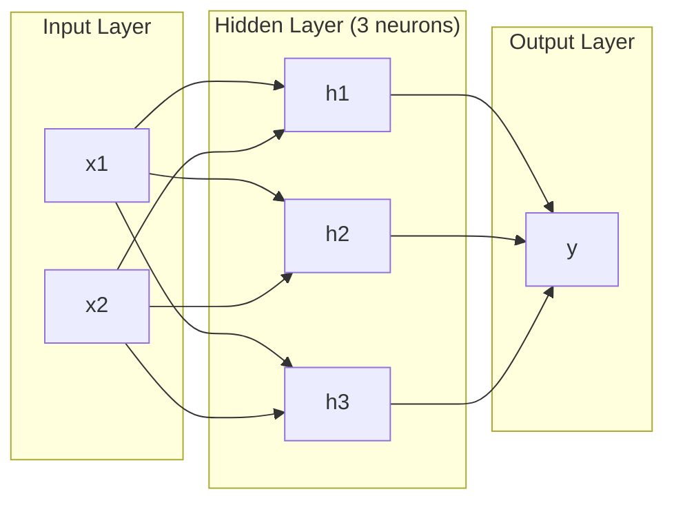
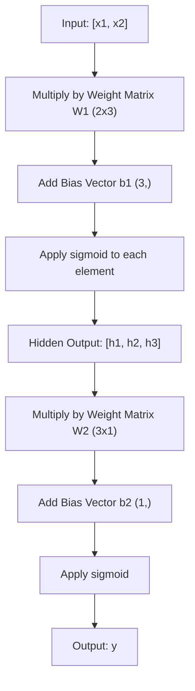
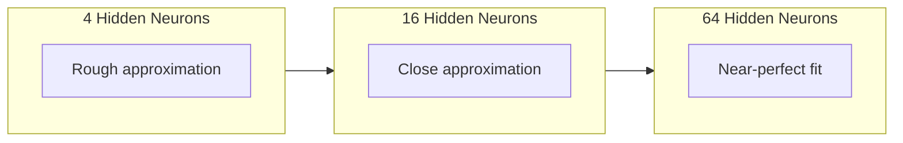

# 多层网络与 Forward Pass

> 一个神经元画出一条线。把它们堆叠起来，你就能画出任何东西。

**Type:** 构建
**Languages:** Python
**Prerequisites:** Phase 01（Math Foundations），Lesson 03.01（The Perceptron）
**Time:** 约 90 分钟

## 学习目标

- 使用 Layer 和 Network class 从零构建一个多层网络，完成完整的 Forward pass
- 追踪网络每一层中的 Matrix 维度，并识别 shape 不匹配
- 解释堆叠非线性激活如何让网络学习弯曲的决策边界
- 使用 2-2-1 架构和手工调好的 sigmoid 权重解决 XOR 问题

## 问题

单个神经元就是一个画线器。仅此而已。它只能在你的数据中画出一条直线。AI 中每个真实问题 -- 图像识别、语言理解、下围棋 -- 都需要曲线。把神经元堆叠成层，就是获得曲线的方法。

1969 年，Minsky 和 Papert 证明了这个限制是致命的：单层网络无法学习 XOR。不是“很难学习” -- 而是数学上做不到。XOR 真值表把 [0,1] 和 [1,0] 放在一侧，把 [0,0] 和 [1,1] 放在另一侧。没有一条直线能把它们分开。

这让 Neural Network 的经费支持停滞了十多年。事后看来，修复方法很明显：不要只用一层。把神经元堆叠成层。让第一层把输入空间切分成新的特征，再让第二层组合这些特征，做出单条直线无法做出的决策。

这个堆叠就是多层网络。它是今天生产环境中每一个 Deep Learning 模型的基础。Forward pass -- 数据从输入流经 hidden layer 到输出 -- 是你在其他任何东西能工作之前必须先构建的第一件事。

## 概念

### 层：输入、Hidden、输出

一个多层网络有三类层：

**输入层** -- 严格来说并不是一层。它保存原始数据。两个特征意味着两个输入节点。这里不发生计算。

**Hidden layer** -- 工作发生的地方。每个神经元接收上一层的每个输出，应用权重和一个 bias，然后把结果传入激活函数。称为“Hidden”，因为你不会在训练数据中直接看到这些值。

**输出层** -- 最终答案。对于二分类，使用一个带 sigmoid 的神经元。对于多分类，每个类别一个神经元。



这是一个 2-3-1 网络。两个输入，三个 hidden neuron，一个输出。每条连接都携带一个权重。每个神经元（输入除外）都携带一个 bias。

每一层都会产生一组数字组成的 Vector，称为 hidden state。对于文本，hidden state 会增加维度 -- 把一个词编码成 768 个数字以捕捉语义含义。对于图像，它们会降低维度 -- 把数百万像素压缩成可管理的表示。hidden state 是学习发生的地方。

### 神经元与激活

每个神经元做三件事：

1. 将每个输入乘以对应的权重
2. 将所有乘积求和并加上一个 bias
3. 将这个和传入激活函数

现在，激活函数是 sigmoid：

```
sigmoid(z) = 1 / (1 + e^(-z))
```

Sigmoid 会把任意数字压缩到 (0, 1) 范围内。较大的正输入会推向 1。较大的负输入会推向 0。零映射到 0.5。这个平滑曲线让学习成为可能 -- 不同于 perceptron 的硬阶跃，sigmoid 在每个位置都有 Gradient。

### Forward Pass：数据如何流动

Forward pass 会把输入数据逐层推过网络，直到到达输出。Forward pass 期间不会发生学习。它是纯计算：相乘、相加、激活、重复。



在每一层，三个操作会按顺序发生：

```
z = W * input + b       (linear transformation)
a = sigmoid(z)           (activation)
```

一层的输出会成为下一层的输入。这就是整个 Forward pass。

### Matrix 维度

追踪维度是 Deep Learning 中最重要的调试技能。这里是 2-3-1 网络：

| Step | Operation | Dimensions | Result Shape |
|------|-----------|------------|-------------|
| 输入 | x | -- | (2,) |
| Hidden 线性部分 | W1 * x + b1 | W1: (3, 2), b1: (3,) | (3,) |
| Hidden 激活 | sigmoid(z1) | -- | (3,) |
| 输出线性部分 | W2 * h + b2 | W2: (1, 3), b2: (1,) | (1,) |
| 输出激活 | sigmoid(z2) | -- | (1,) |

规则：第 k 层的权重 Matrix W 的 shape 是 (neurons_in_layer_k, neurons_in_layer_k_minus_1)。行对应当前层。列对应上一层。如果 shape 对不上，你就有 bug。

### Universal Approximation Theorem

1989 年，George Cybenko 证明了一件非凡的事：一个拥有单个 hidden layer 且神经元足够多的 Neural Network，可以以任意期望精度逼近任意连续函数。

这并不意味着一个 hidden layer 总是最佳选择。它意味着该架构在理论上具备能力。实践中，更深的网络（更多层、每层更少神经元）能用远少于浅而宽网络的总参数量学习同样的函数。这就是 Deep Learning 能工作的原因。

直觉是：hidden layer 中的每个神经元学习一个“凸起”或特征。只要有足够多的凸起，并把它们放在正确位置，就能逼近任意平滑曲线。神经元越多，凸起越多，逼近越好。



### 可组合性

Neural Network 是可组合的。你可以堆叠它们、串联它们、并行运行它们。Whisper model 使用一个 encoder network 处理音频，并使用一个独立的 decoder network 生成文本。现代 LLMs 是 decoder-only。BERT 是 encoder-only。T5 是 encoder-decoder。架构选择定义了模型能做什么。

## 构建它

纯 Python。不使用 numpy。每个 Matrix 操作都从零编写。

### 步骤 1： Sigmoid 激活

```python
import math

def sigmoid(x):
    x = max(-500.0, min(500.0, x))
    return 1.0 / (1.0 + math.exp(-x))
```

把值 clamp 到 [-500, 500] 可以防止溢出。`math.exp(500)` 很大但仍然有限。`math.exp(1000)` 是无穷大。

### 步骤 2： Layer Class

所有 Deep Learning 中最重要的操作是 Matrix 乘法。每一层、每个 Attention head、每次 Forward pass -- 底层都是 matmul。一个 linear layer 接收一个输入 Vector，将它乘以权重 Matrix，并加上 bias Vector：y = Wx + b。这个单一方程占据 Neural Network 中 90% 的计算量。

一层保存一个权重 Matrix 和一个 bias Vector。它的 forward method 接收一个输入 Vector，并返回激活后的输出。

```python
class Layer:
    def __init__(self, n_inputs, n_neurons, weights=None, biases=None):
        if weights is not None:
            self.weights = weights
        else:
            import random
            self.weights = [
                [random.uniform(-1, 1) for _ in range(n_inputs)]
                for _ in range(n_neurons)
            ]
        if biases is not None:
            self.biases = biases
        else:
            self.biases = [0.0] * n_neurons

    def forward(self, inputs):
        self.last_input = inputs
        self.last_output = []
        for neuron_idx in range(len(self.weights)):
            z = sum(
                w * x for w, x in zip(self.weights[neuron_idx], inputs)
            )
            z += self.biases[neuron_idx]
            self.last_output.append(sigmoid(z))
        return self.last_output
```

权重 Matrix 的 shape 是 (n_neurons, n_inputs)。每一行是一个神经元跨所有输入的权重。forward method 遍历神经元，计算加权和加 bias，应用 sigmoid，并收集结果。

### 步骤 3： Network Class

一个网络是层的列表。Forward pass 会把它们串起来：第 k 层的输出输入到第 k+1 层。

```python
class Network:
    def __init__(self, layers):
        self.layers = layers

    def forward(self, inputs):
        current = inputs
        for layer in self.layers:
            current = layer.forward(current)
        return current
```

这就是整个 Forward pass。四行逻辑。数据进入，流经每一层，从另一端出来。

### 步骤 4： 使用手工调好的权重解决 XOR

在 Lesson 01 中，我们通过组合 OR、NAND 和 AND perceptron 解决了 XOR。现在用我们的 Layer 和 Network class 做同样的事。2-2-1 架构：两个输入、两个 hidden neuron、一个输出。

```python
hidden = Layer(
    n_inputs=2,
    n_neurons=2,
    weights=[[20.0, 20.0], [-20.0, -20.0]],
    biases=[-10.0, 30.0],
)

output = Layer(
    n_inputs=2,
    n_neurons=1,
    weights=[[20.0, 20.0]],
    biases=[-30.0],
)

xor_net = Network([hidden, output])

xor_data = [
    ([0, 0], 0),
    ([0, 1], 1),
    ([1, 0], 1),
    ([1, 1], 0),
]

for inputs, expected in xor_data:
    result = xor_net.forward(inputs)
    predicted = 1 if result[0] >= 0.5 else 0
    print(f"  {inputs} -> {result[0]:.6f} (rounded: {predicted}, expected: {expected})")
```

较大的权重（20, -20）让 sigmoid 表现得像阶跃函数。第一个 hidden neuron 近似 OR。第二个近似 NAND。输出神经元把它们组合成 AND，也就是 XOR。

### 步骤 5： 圆形分类

一个更难的问题：将 2D 点分类为在以原点为中心、半径为 0.5 的圆内或圆外。这需要一条弯曲的决策边界 -- 对单个 perceptron 来说不可能。

```python
import random
import math

random.seed(42)

data = []
for _ in range(200):
    x = random.uniform(-1, 1)
    y = random.uniform(-1, 1)
    label = 1 if (x * x + y * y) < 0.25 else 0
    data.append(([x, y], label))

circle_net = Network([
    Layer(n_inputs=2, n_neurons=8),
    Layer(n_inputs=8, n_neurons=1),
])
```

使用随机权重时，网络分类效果不会好。但 Forward pass 仍然会运行。这就是重点 -- Forward pass 只是计算。学习正确的权重是 Backpropagation，将在 Lesson 03 中出现。

```python
correct = 0
for inputs, expected in data:
    result = circle_net.forward(inputs)
    predicted = 1 if result[0] >= 0.5 else 0
    if predicted == expected:
        correct += 1

print(f"Accuracy with random weights: {correct}/{len(data)} ({100*correct/len(data):.1f}%)")
```

随机权重会得到较差的准确率 -- 通常甚至比猜多数类还差。训练后（Lesson 03），这个拥有 8 个 hidden neuron 的同一架构会画出一条弯曲边界，把内部和外部分开。

## 使用它

PyTorch 用四行代码完成上面的全部内容：

```python
import torch
import torch.nn as nn

model = nn.Sequential(
    nn.Linear(2, 8),
    nn.Sigmoid(),
    nn.Linear(8, 1),
    nn.Sigmoid(),
)

x = torch.tensor([[0.0, 0.0], [0.0, 1.0], [1.0, 0.0], [1.0, 1.0]])
output = model(x)
print(output)
```

`nn.Linear(2, 8)` 就是你的 Layer class：shape 为 (8, 2) 的权重 Matrix，shape 为 (8,) 的 bias Vector。`nn.Sigmoid()` 是你的 sigmoid 函数，逐元素应用。`nn.Sequential` 是你的 Network class：按顺序串联各层。

区别在于速度和规模。PyTorch 在 GPUs 上运行，处理数百万样本的 batch，并自动计算用于 Backpropagation 的 Gradient。但 Forward pass 逻辑与你刚刚从零构建的内容完全相同。

## 交付它

本课会产出一个可复用 prompt，用于设计网络架构：

- `outputs/prompt-network-architect.md`

当你需要为给定问题决定使用多少层、每层多少神经元、以及使用哪些激活函数时，可以使用它。

## 练习

1. 构建一个 2-4-2-1 网络（两个 hidden layer），并在 XOR 数据上使用随机权重运行 Forward pass。打印中间 hidden layer 的输出，观察表示在每一层如何变换。

2. 将圆形分类器中的 hidden layer 大小从 8 改为 2，再改为 32。每次都使用随机权重运行 Forward pass。hidden neuron 的数量是否会改变输出范围或分布？为什么？

3. 在 Network class 上实现一个 `count_parameters` method，返回可训练权重和 bias 的总数。在一个 784-256-128-10 网络（经典 MNIST 架构）上测试它。它有多少个参数？

4. 为一个 3-4-4-2 网络构建 Forward pass。向它输入 RGB 颜色值（归一化到 0-1），并观察两个输出。这是一个两类简单颜色分类器的架构。

5. 用一个“leaky step”函数替换 sigmoid：如果 z < 0，则返回 0.01 * z，否则返回 1.0。使用 Step 4 中同样的手工调好权重，在 XOR 上运行 Forward pass。它仍然有效吗？为什么平滑的 sigmoid 比硬截断更受偏好？

## 关键术语

| Term | 人们会怎么说 | 它实际意味着什么 |
|------|----------------|----------------------|
| Forward pass | “运行模型” | 将输入推过每一层 -- 乘以权重、加上 bias、激活 -- 以产生输出 |
| Hidden layer | “中间部分” | 输入和输出之间的任意层，其值不会在数据中被直接观察到 |
| Multi-layer network | “一个深的 Neural Network” | 按顺序堆叠的神经元层，其中每一层的输出会输入到下一层 |
| Activation function | “非线性” | 在线性变换之后应用的函数，用来把曲线引入决策边界 |
| Sigmoid | “S 曲线” | sigma(z) = 1/(1+e^(-z))，将任意实数压缩到 (0,1)，平滑且处处可微 |
| Weight matrix | “参数” | 一个 shape 为 (current_layer_neurons, previous_layer_neurons) 的 Matrix W，包含可学习的连接强度 |
| Bias vector | “偏移量” | 在 Matrix 乘法之后添加的 Vector，使神经元即使在所有输入为零时也能激活 |
| Universal approximation | “Neural Network 可以学习任何东西” | 一个拥有足够多神经元的单 hidden layer 可以逼近任意连续函数 -- 但“足够多”可能意味着数十亿 |
| Linear transformation | “Matrix 乘法步骤” | z = W * x + b，激活前的计算，将输入映射到一个新空间 |
| Decision boundary | “分类器切换的地方” | 输入空间中的一个曲面，网络输出在这里跨过分类阈值 |

## 延伸阅读

- Michael Nielsen, "Neural Networks and Deep Learning", Chapter 1-2 (http://neuralnetworksanddeeplearning.com/) -- 关于 Forward pass 和网络结构最清晰的免费解释，包含交互式可视化
- Cybenko, "Approximation by Superpositions of a Sigmoidal Function" (1989) -- 最初的 universal approximation theorem 论文，出乎意料地易读
- 3Blue1Brown, "But what is a neural network?" (https://www.youtube.com/watch?v=aircAruvnKk) -- 20 分钟可视化讲解层、权重和 Forward pass，帮助建立正确的心智模型
- Goodfellow, Bengio, Courville, "Deep Learning", Chapter 6 (https://www.deeplearningbook.org/) -- 多层网络的标准参考，免费在线阅读
