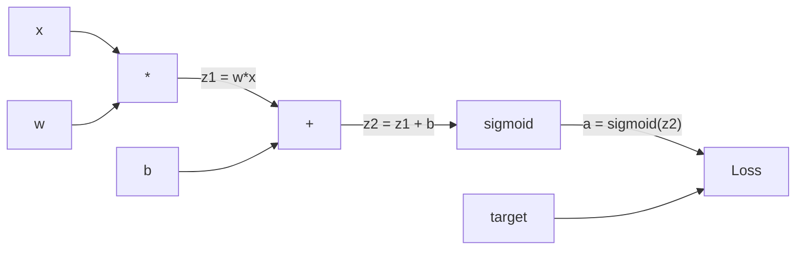
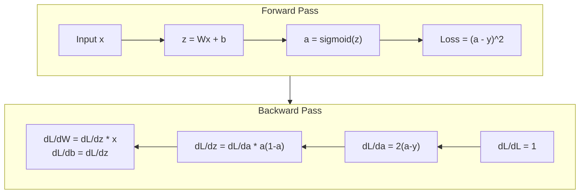
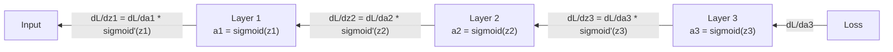

# 从零实现 Backpropagation

> Backpropagation 是让学习成为可能的算法。没有它，Neural Network 只是一台昂贵的随机数生成器。

**Type:** Build
**Languages:** Python
**Prerequisites:** Lesson 03.02 (Multi-Layer Networks)
**Time:** ~120 minutes

## 学习目标
- 实现一个基于 Value 的 autograd engine，它会构建 Computational Graph，并通过 topological sort 计算 Gradient
- 使用 chain rule 推导 addition、multiplication 和 sigmoid 的 Backward Pass
- 仅使用你从零实现的 Backpropagation engine，在 XOR 和 circle classification 上训练一个 multi-layer network
- 识别深层 sigmoid network 中的 vanishing gradient 问题，并解释为什么 Gradient 会指数级缩小

## 问题
你的 network 有一个 hidden layer，包含 768 个输入和 3072 个输出。这就是 2,359,296 个权重。它做出了错误预测。哪些权重导致了这个错误？逐个测试每个权重意味着要做 230 万次 Forward Pass。Backpropagation 可以在一次 Backward Pass 中计算全部 230 万个 Gradient。这不是优化。这是可训练和不可能训练之间的区别。

朴素做法是：取一个权重，把它轻微扰动一点，再运行一次 Forward Pass，测量 Loss 是上升还是下降。这会给出这个权重的 Gradient。然后对 network 中的每个权重都这样做。再乘以成千上万的训练 step 和数百万个数据点。你需要地质级别的时间才能训练出任何有用的东西。

Backpropagation 解决了这个问题。一次 Forward Pass，一次 Backward Pass，所有 Gradient 都计算出来。关键是 calculus 中的 chain rule，被系统地应用到 Computational Graph 上。正是这个算法让 Deep Learning 变得实用。没有它，我们仍然只能困在玩具问题上。

## 概念
### Chain Rule，应用到 Network 上

你在 Phase 01, Lesson 05 中见过 chain rule。快速回顾：如果 y = f(g(x))，那么 dy/dx = f'(g(x)) * g'(x)。你沿着链条相乘 derivative。

在 Neural Network 中，“链条”是从 input 到 Loss 的操作序列。每一层应用权重、加上偏置、再通过 activation。Loss Function 将最终 output 与 target 进行比较。Backpropagation 会沿着这条链反向追踪，计算每个操作对 error 的贡献。

### Computational Graphs

每一次 Forward Pass 都会构建一个 graph。每个 node 是一个 operation（multiply、add、sigmoid）。每条 edge 向前传递 value，向后传递 Gradient。



Forward Pass：value 从左向右流动。x 和 w 产生 z1 = w*x。加上 b 得到 z2。Sigmoid 给出 activation a。使用 Loss Function 将 a 与 target y 比较。

Backward Pass：Gradient 从右向左流动。从 dL/da 开始（Loss 如何随 activation 改变）。乘以 da/dz2（sigmoid derivative）。得到 dL/dz2。拆分成 dL/db（它等于 dL/dz2，因为 z2 = z1 + b）和 dL/dz1。然后 dL/dw = dL/dz1 * x，dL/dx = dL/dz1 * w。

Graph 中每个 node 在 Backward Pass 期间只有一个任务：接收来自上游的 Gradient，乘以它自己的 local derivative，然后向下游传递。

### Forward vs Backward



Forward Pass 会存储每个 intermediate value：z、a、每一层的 input。Backward Pass 需要这些已存储的 value 来计算 Gradient。这就是 Backpropagation 核心的内存-计算权衡。你用内存（存储 activation）换速度（一次 pass，而不是数百万次）。

### Gradient 在 Network 中的流动

对于一个 3-layer network，Gradient 会链式穿过每一层：



在每一层，Gradient 都会乘以 sigmoid derivative。sigmoid derivative 是 a * (1 - a)，最大值是 0.25（当 a = 0.5 时）。深入三层后，Gradient 至多已经乘以 0.25^3 = 0.0156。深入十层：0.25^10 = 0.000001。

### Vanishing Gradients

这就是 vanishing gradient 问题。Sigmoid 会把输出压缩到 0 和 1 之间。它的 derivative 永远小于 0.25。堆叠足够多的 sigmoid layer 后，Gradient 会缩小到接近于零。早期 layer 几乎无法学习，因为它们接收到的 Gradient 接近零。

```
sigmoid(z):     Output range [0, 1]
sigmoid'(z):    Max value 0.25 (at z = 0)

After 5 layers:   gradient * 0.25^5 = 0.001x original
After 10 layers:  gradient * 0.25^10 = 0.000001x original
```

这就是为什么深层 sigmoid network 几乎不可能训练。修复方法 -- ReLU 及其变体 -- 是 Lesson 04 的主题。现在，先理解 Backpropagation 本身运行得很完美。问题在于它穿过的是什么。

### 推导 2-Layer Network 的 Gradient

下面是一个具体数学例子：network 有 input x、带 sigmoid 的 hidden layer、带 sigmoid 的 output layer，以及 MSE Loss。

Forward Pass:
```
z1 = W1 * x + b1
a1 = sigmoid(z1)
z2 = W2 * a1 + b2
a2 = sigmoid(z2)
L = (a2 - y)^2
```

Backward Pass（逐步应用 chain rule）：
```
dL/da2 = 2(a2 - y)
da2/dz2 = a2 * (1 - a2)
dL/dz2 = dL/da2 * da2/dz2 = 2(a2 - y) * a2 * (1 - a2)

dL/dW2 = dL/dz2 * a1
dL/db2 = dL/dz2

dL/da1 = dL/dz2 * W2
da1/dz1 = a1 * (1 - a1)
dL/dz1 = dL/da1 * da1/dz1

dL/dW1 = dL/dz1 * x
dL/db1 = dL/dz1
```

每个 Gradient 都是从 Loss 往回追踪得到的 local derivative 乘积。这就是 Backpropagation 的全部。


```figure
backprop-vanishing
```

## 构建它
### 步骤 1： Value Node

我们计算中的每个数字都会变成一个 Value。它存储自己的 data、Gradient，以及它是如何被创建的（这样它就知道如何反向计算 Gradient）。

```python
class Value:
    def __init__(self, data, children=(), op=''):
        self.data = data
        self.grad = 0.0
        self._backward = lambda: None
        self._children = set(children)
        self._op = op

    def __repr__(self):
        return f"Value(data={self.data:.4f}, grad={self.grad:.4f})"
```

还没有 Gradient（0.0）。还没有 backward function（no-op）。`_children` 会跟踪产生这个 Value 的其他 Value，这样之后我们就可以对 graph 做 topological sort。

### 步骤 2： 带 Backward Function 的 Operation

每个 operation 都会创建一个新的 Value，并定义 Gradient 如何反向流经它。

```python
def __add__(self, other):
    other = other if isinstance(other, Value) else Value(other)
    out = Value(self.data + other.data, (self, other), '+')

    def _backward():
        self.grad += out.grad
        other.grad += out.grad

    out._backward = _backward
    return out

def __mul__(self, other):
    other = other if isinstance(other, Value) else Value(other)
    out = Value(self.data * other.data, (self, other), '*')

    def _backward():
        self.grad += other.data * out.grad
        other.grad += self.data * out.grad

    out._backward = _backward
    return out
```

对于 addition：d(a+b)/da = 1，d(a+b)/db = 1。因此两个 input 都会直接获得 output 的 Gradient。

对于 multiplication：d(a*b)/da = b，d(a*b)/db = a。每个 input 都会获得另一个 input 的 value 乘以 output Gradient。

`+=` 很关键。一个 Value 可能会被多个 operation 使用。它的 Gradient 是来自所有路径的 Gradient 之和。

### 步骤 3： Sigmoid and Loss

```python
import math

def sigmoid(self):
    x = self.data
    x = max(-500, min(500, x))
    s = 1.0 / (1.0 + math.exp(-x))
    out = Value(s, (self,), 'sigmoid')

    def _backward():
        self.grad += (s * (1 - s)) * out.grad

    out._backward = _backward
    return out
```

Sigmoid derivative：sigmoid(x) * (1 - sigmoid(x))。我们在 Forward Pass 中已经计算了 sigmoid(x) = s。复用它。不需要额外工作。

```python
def mse_loss(predicted, target):
    diff = predicted + Value(-target)
    return diff * diff
```

单个 output 的 MSE：(predicted - target)^2。我们把 subtraction 表达为加上一个取负的 Value。

### 步骤 4： Backward Pass

Topological sort 确保我们按正确顺序处理 node -- 某个 node 的 Gradient 会在通过它继续传播之前被完全累积。

```python
def backward(self):
    topo = []
    visited = set()

    def build_topo(v):
        if v not in visited:
            visited.add(v)
            for child in v._children:
                build_topo(child)
            topo.append(v)

    build_topo(self)
    self.grad = 1.0
    for v in reversed(topo):
        v._backward()
```

从 Loss 开始（Gradient = 1.0，因为 dL/dL = 1）。沿着排序后的 graph 反向遍历。每个 node 的 `_backward` 会把 Gradient 推送给它的 children。

### 步骤 5： Layer and Network

```python
import random

class Neuron:
    def __init__(self, n_inputs):
        scale = (2.0 / n_inputs) ** 0.5
        self.weights = [Value(random.uniform(-scale, scale)) for _ in range(n_inputs)]
        self.bias = Value(0.0)

    def __call__(self, x):
        act = sum((wi * xi for wi, xi in zip(self.weights, x)), self.bias)
        return act.sigmoid()

    def parameters(self):
        return self.weights + [self.bias]


class Layer:
    def __init__(self, n_inputs, n_outputs):
        self.neurons = [Neuron(n_inputs) for _ in range(n_outputs)]

    def __call__(self, x):
        out = [n(x) for n in self.neurons]
        return out[0] if len(out) == 1 else out

    def parameters(self):
        params = []
        for n in self.neurons:
            params.extend(n.parameters())
        return params


class Network:
    def __init__(self, sizes):
        self.layers = []
        for i in range(len(sizes) - 1):
            self.layers.append(Layer(sizes[i], sizes[i + 1]))

    def __call__(self, x):
        for layer in self.layers:
            x = layer(x)
            if not isinstance(x, list):
                x = [x]
        return x[0] if len(x) == 1 else x

    def parameters(self):
        params = []
        for layer in self.layers:
            params.extend(layer.parameters())
        return params

    def zero_grad(self):
        for p in self.parameters():
            p.grad = 0.0
```

一个 Neuron 接收 input，计算 weighted sum + bias，然后应用 sigmoid。权重初始化按 sqrt(2/n_inputs) 缩放，用于防止更深 network 中的 sigmoid saturation。一个 Layer 是 Neuron 的列表。一个 Network 是 Layer 的列表。`parameters()` method 会收集所有可学习的 Value，这样我们就可以更新它们。

### 步骤 6： 在 XOR 上训练

```python
random.seed(42)
net = Network([2, 4, 1])

xor_data = [
    ([0.0, 0.0], 0.0),
    ([0.0, 1.0], 1.0),
    ([1.0, 0.0], 1.0),
    ([1.0, 1.0], 0.0),
]

learning_rate = 1.0

for epoch in range(1000):
    total_loss = Value(0.0)
    for inputs, target in xor_data:
        x = [Value(i) for i in inputs]
        pred = net(x)
        loss = mse_loss(pred, target)
        total_loss = total_loss + loss

    net.zero_grad()
    total_loss.backward()

    for p in net.parameters():
        p.data -= learning_rate * p.grad

    if epoch % 100 == 0:
        print(f"Epoch {epoch:4d} | Loss: {total_loss.data:.6f}")

print("\nXOR Results:")
for inputs, target in xor_data:
    x = [Value(i) for i in inputs]
    pred = net(x)
    print(f"  {inputs} -> {pred.data:.4f} (expected {target})")
```

观察 Loss 下降。从随机预测到正确的 XOR output，完全由 Backpropagation 计算 Gradient 并向正确方向微调权重来驱动。

### 步骤 7： Circle Classification

在 Lesson 02 中，你为 circle classification 手动调过权重。现在让 network 自己学习它们。

```python
random.seed(7)

def generate_circle_data(n=100):
    data = []
    for _ in range(n):
        x1 = random.uniform(-1.5, 1.5)
        x2 = random.uniform(-1.5, 1.5)
        label = 1.0 if x1 * x1 + x2 * x2 < 1.0 else 0.0
        data.append(([x1, x2], label))
    return data

circle_data = generate_circle_data(80)

circle_net = Network([2, 8, 1])
learning_rate = 0.5

for epoch in range(2000):
    random.shuffle(circle_data)
    total_loss_val = 0.0
    for inputs, target in circle_data:
        x = [Value(i) for i in inputs]
        pred = circle_net(x)
        loss = mse_loss(pred, target)
        circle_net.zero_grad()
        loss.backward()
        for p in circle_net.parameters():
            p.data -= learning_rate * p.grad
        total_loss_val += loss.data

    if epoch % 200 == 0:
        correct = 0
        for inputs, target in circle_data:
            x = [Value(i) for i in inputs]
            pred = circle_net(x)
            predicted_class = 1.0 if pred.data > 0.5 else 0.0
            if predicted_class == target:
                correct += 1
        accuracy = correct / len(circle_data) * 100
        print(f"Epoch {epoch:4d} | Loss: {total_loss_val:.4f} | Accuracy: {accuracy:.1f}%")
```

这里我们使用 online SGD -- 每个 sample 之后就更新权重，而不是累积完整 batch。这会更快打破对称性，并避免在完整 Loss landscape 上出现 sigmoid saturation。每个 epoch 对数据进行 shuffle，可以防止 network 记住顺序。

没有手动调参。Network 会自己发现圆形 decision boundary。这就是 Backpropagation 的力量：你定义 architecture、Loss Function 和 data。算法会找出权重。

## 使用它
PyTorch 用几行代码完成上面的全部工作。核心思想完全相同 -- autograd 在 Forward Pass 期间构建 Computational Graph，并反向追踪它来计算 Gradient。

```python
import torch
import torch.nn as nn

model = nn.Sequential(
    nn.Linear(2, 4),
    nn.Sigmoid(),
    nn.Linear(4, 1),
    nn.Sigmoid(),
)
optimizer = torch.optim.SGD(model.parameters(), lr=1.0)
criterion = nn.MSELoss()

X = torch.tensor([[0,0],[0,1],[1,0],[1,1]], dtype=torch.float32)
y = torch.tensor([[0],[1],[1],[0]], dtype=torch.float32)

for epoch in range(1000):
    pred = model(X)
    loss = criterion(pred, y)
    optimizer.zero_grad()
    loss.backward()
    optimizer.step()

print("PyTorch XOR Results:")
with torch.no_grad():
    for i in range(4):
        pred = model(X[i])
        print(f"  {X[i].tolist()} -> {pred.item():.4f} (expected {y[i].item()})")
```

`loss.backward()` 就是你的 `total_loss.backward()`。`optimizer.step()` 就是你手动写的 `p.data -= lr * p.grad`。`optimizer.zero_grad()` 就是你的 `net.zero_grad()`。同一个算法，工业级实现。PyTorch 负责 GPU acceleration、mixed precision、gradient checkpointing，以及数百种 layer type。但 Backward Pass 仍然是同样的 chain rule，应用在同样的 Computational Graph 上。

训练会运行 Forward Pass，然后运行 Backward Pass，再更新权重。Inference 只运行 Forward Pass。没有 Gradient，没有更新。这个区别很重要，因为 inference 才是生产环境中发生的事情。当你调用 Claude 或 GPT 这样的 API 时，你运行的是 inference -- 你的 prompt 向前流经 network，Token 从另一端输出。没有权重发生改变。理解 Backpropagation 很重要，因为它塑造了那个 network 中的每一个权重。

## 交付它
本课会产出：
- `outputs/prompt-gradient-debugger.md` -- 一个可复用的 prompt，用于诊断任何 Neural Network 中的 Gradient 问题（vanishing、exploding、NaN）

## 练习
1. 给 Value class 添加一个 `__sub__` method（a - b = a + (-1 * b)）。然后实现一个 `__neg__` method。通过与简单表达式（如 (a - b)^2）的手动计算进行比较，验证 Gradient 是否正确。

2. 给 Value 添加一个 `relu` method（output 为 max(0, x)，derivative 在 x > 0 时为 1，否则为 0）。在 hidden layer 中用 relu 替换 sigmoid，并再次在 XOR 上训练。比较收敛速度。你应该会看到训练更快 -- 这是 Lesson 04 的预告。

3. 在 Value 上实现一个用于 integer powers 的 `__pow__` method。用它把 `mse_loss` 替换成真正的 `(predicted - target) ** 2` 表达式。验证 Gradient 与原始实现一致。

4. 给 training loop 添加 gradient clipping：调用 `backward()` 之后，把所有 Gradient clip 到 [-1, 1]。训练一个更深的 network（4+ layers with sigmoid），并比较有无 clipping 的 Loss curve。这是你对抗 exploding gradients 的第一道防线。

5. 构建一个 visualization：在 XOR 训练完成后，打印 network 中每个 parameter 的 Gradient。找出哪一层的 Gradient 最小。这会演示你在 Concept 部分读到的 vanishing gradient 问题。

## 关键术语
| Term | What people say | What it actually means |
|------|----------------|----------------------|
| Backpropagation | “Network 学会了” | 一种算法，通过沿 Computational Graph 反向应用 chain rule，为每个权重计算 dL/dw |
| Computational graph | “Network 结构” | 一个有向无环 graph，其中 node 是 operation，edge 承载 value（forward）和 Gradient（backward） |
| Chain rule | “把 derivative 相乘” | 如果 y = f(g(x))，那么 dy/dx = f'(g(x)) * g'(x) -- Backpropagation 的数学基础 |
| Gradient | “最陡上升方向” | Loss 相对于某个 parameter 的 partial derivative -- 告诉你如何改变该 parameter 来降低 Loss |
| Vanishing gradient | “深层 network 学不会” | 当 Gradient 通过带有 sigmoid 这类 saturating activation 的 layer 传播时，会指数级缩小 |
| Forward pass | “运行 network” | 通过顺序应用每一层的 operation，从 input 计算 output，并存储 intermediate value |
| Backward pass | “计算 Gradient” | 反向遍历 Computational Graph，在每个 node 使用 chain rule 累积 Gradient |
| Learning rate | “学习速度” | 一个控制权重更新步长的 scalar：w_new = w_old - lr * gradient |
| Topological sort | “正确顺序” | 一种 graph node 排序方式，使每个 node 都出现在其依赖的所有 node 之后 -- 确保 Gradient 在传播前已完全累积 |
| Autograd | “自动微分” | 一个在 forward computation 期间构建 Computational Graph，并自动计算 Gradient 的系统 -- PyTorch 的 engine 做的就是这个 |

## 延伸阅读
- Rumelhart, Hinton & Williams, "Learning representations by back-propagating errors" (1986) -- 这篇论文让 Backpropagation 成为主流，并解锁了 multi-layer network training
- 3Blue1Brown, "Neural Networks" series (https://www.youtube.com/playlist?list=PLZHQObOWTQDNU6R1_67000Dx_ZCJB-3pi) -- 关于 Backpropagation 以及 Gradient 如何流经 network 的最佳可视化解释
