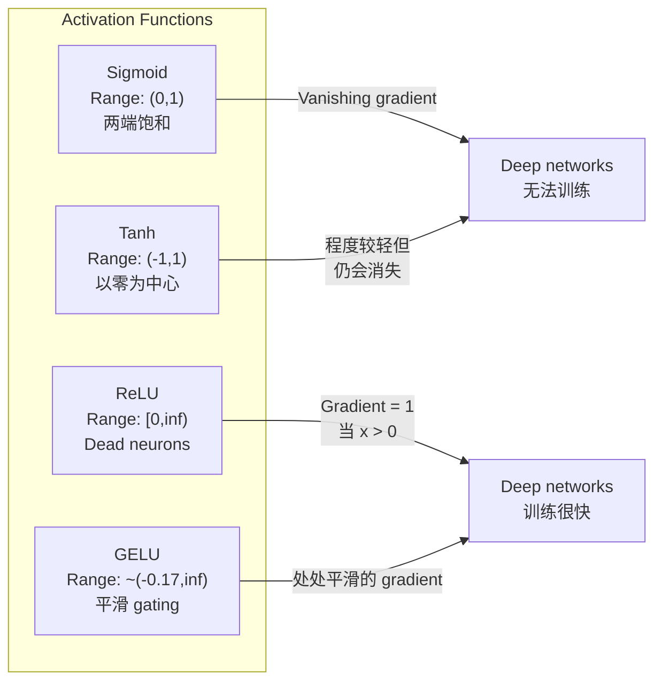
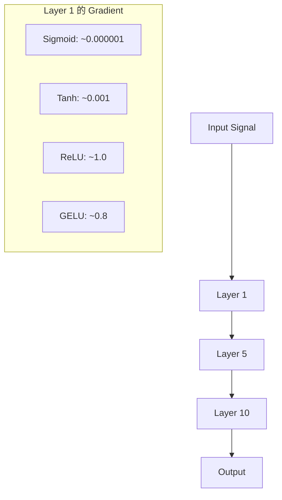
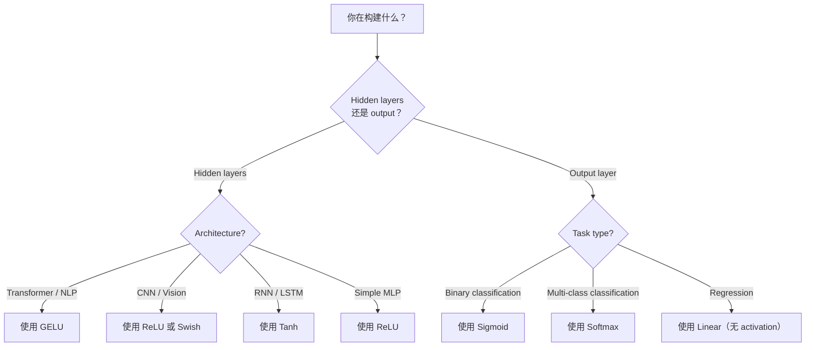

# 激活函数

> 没有非线性，你的 100-layer network 只是一次精致的 Matrix multiply。Activation 是让 Neural Network 能够用曲线思考的门。

**Type:** Build
**Languages:** Python
**Prerequisites:** Lesson 03.03 (Backpropagation)
**Time:** ~75 分钟

## 学习目标

- 从零实现 sigmoid、tanh、ReLU、Leaky ReLU、GELU、Swish 和 softmax 及其 derivatives
- 通过测量不同 activations 在 10+ 层中的 activation magnitudes，诊断 vanishing gradient problem
- 检测 ReLU network 中的 dead neurons，并解释为什么 GELU 能避免这种 failure mode
- 为给定 architecture（transformer、CNN、RNN、output layer）选择正确的 activation function

## 问题

堆叠两个 linear transformations：y = W2(W1x + b1) + b2。展开它：y = W2W1x + W2b1 + b2。这只是 y = Ax + c——一个 single linear transformation。无论你堆叠多少 linear layers，结果都会坍缩成一次 Matrix multiply。你的 100-layer network 与 single layer 具有相同的表示能力。

这不是理论上的猎奇。它意味着 deep linear network 字面上无法学习 XOR，无法分类 spiral dataset，无法识别人脸。没有 activation functions，深度只是一种幻觉。

Activation functions 打破线性。它们通过 nonlinear function 扭曲每一层的输出，让 network 能够弯曲 decision boundaries、近似任意函数，并真正学习。但如果选错 activation，你的 gradients 会消失到零（deep networks 中的 sigmoid）、爆炸到无穷大（没有谨慎 initialization 的 unbounded activations），或者你的 neurons 会永久死亡（带有较大 negative biases 的 ReLU）。activation function 的选择直接决定了你的 network 是否能学习。

## 概念

### 为什么非线性是必要的

Matrix multiplication 是可组合的。先用 Matrix A 乘以一个 Vector，再用 Matrix B 乘以结果，等价于直接乘以 AB。这意味着堆叠十个 linear layers 在数学上等价于一个带有大 Matrix 的 linear layer。所有这些 parameters，所有这些深度——都浪费了。你需要某种东西打断这条链。这就是 activation functions 的作用。

下面是证明。一个 linear layer 计算 f(x) = Wx + b。堆叠两个：

```
Layer 1: h = W1 * x + b1
Layer 2: y = W2 * h + b2
```

代入：

```
y = W2 * (W1 * x + b1) + b2
y = (W2 * W1) * x + (W2 * b1 + b2)
y = A * x + c
```

一层。在层之间插入 nonlinear activation g()：

```
h = g(W1 * x + b1)
y = W2 * h + b2
```

现在代入被打破了。W2 * g(W1 * x + b1) + b2 不能再简化为 single linear transformation。network 可以表示 nonlinear functions。每增加一层带 activation 的 layer，都会增加表示能力。

### Sigmoid

Neural Network 最早的 activation function。

```
sigmoid(x) = 1 / (1 + e^(-x))
```

输出范围：(0, 1)。平滑、可微，将任意实数映射到类似概率的值。

derivative：

```
sigmoid'(x) = sigmoid(x) * (1 - sigmoid(x))
```

这个 derivative 的最大值是 0.25，出现在 x = 0。在 backpropagation 中，gradients 会逐层相乘。十层 sigmoid 意味着 gradient 最多会被 0.25 连续乘十次：

```
0.25^10 = 0.000000953674
```

不到原始信号的百万分之一。这就是 vanishing gradient problem。早期 layers 中的 gradients 变得极小，weights 几乎不更新。network 看起来在学习——后面 layers 的 loss 在下降——但前面 layers 已经冻结。Deep sigmoid networks 根本训练不起来。

另一个问题：sigmoid 输出始终为正（0 到 1），这意味着 weights 上的 gradients 总是同号。这会导致 gradient descent 过程中出现之字形震荡。

### Tanh

sigmoid 的居中版本。

```
tanh(x) = (e^x - e^(-x)) / (e^x + e^(-x))
```

输出范围：(-1, 1)。以零为中心，可以消除之字形问题。

derivative：

```
tanh'(x) = 1 - tanh(x)^2
```

最大 derivative 在 x = 0 时为 1.0——比 sigmoid 好四倍。但 vanishing gradient problem 仍然存在。对于很大的正输入或负输入，derivative 会趋近于零。十层仍然会压碎 gradient，只是没那么激烈。

### ReLU：突破

Rectified Linear Unit。Nair 和 Hinton 在 2010 年将其推广到 deep learning（这个函数本身可追溯到 Fukushima 1969 年的工作），它改变了一切。

```
relu(x) = max(0, x)
```

输出范围：[0, infinity)。derivative 非常简单：

```
relu'(x) = 1  if x > 0
            0  if x <= 0
```

对于正输入，不存在 vanishing gradient。gradient 正好是 1，会直接传递过去。这就是 deep networks 变得可训练的原因——ReLU 能够跨层保留 gradient magnitude。

但它有一个 failure mode：dead neuron problem。如果某个 neuron 的 weighted input 始终为负（由于较大的 negative bias 或不幸的 weight initialization），它的输出永远为零，gradient 永远为零，因此永远不会更新。它永久死亡。在实践中，ReLU network 中 10-40% 的 neurons 可能会在训练过程中死亡。

### Leaky ReLU

dead neurons 最简单的修复方式。

```
leaky_relu(x) = x        if x > 0
                alpha * x if x <= 0
```

其中 alpha 是一个小常数，通常为 0.01。负半轴有一个小斜率而不是零，因此 dead neurons 仍然能获得 gradient signal，并有机会恢复。

### GELU：现代默认选择

Gaussian Error Linear Unit。由 Hendrycks 和 Gimpel 于 2016 年提出。是 BERT、GPT 以及大多数现代 transformers 中的默认 activation。

```
gelu(x) = x * Phi(x)
```

其中 Phi(x) 是 standard normal distribution 的 cumulative distribution function。实践中使用的近似形式：

```
gelu(x) ~= 0.5 * x * (1 + tanh(sqrt(2/pi) * (x + 0.044715 * x^3)))
```

GELU 处处平滑，允许较小的负值（不像 ReLU 那样硬截断为零），并且有一个概率解释：它根据每个输入在 Gaussian distribution 下为正的可能性对其加权。这种平滑 gating 在 transformer architectures 中优于 ReLU，因为它提供了更好的 gradient flow，并完全避免 dead neuron problem。

### Swish / SiLU

由 Ramachandran et al. 在 2017 年通过 automated search 发现的 self-gated activation。

```
swish(x) = x * sigmoid(x)
```

Swish 的形式是 x * sigmoid(x)。Google 通过在 activation function space 上进行 automated search 发现了它——一个 Neural Network 在设计 Neural Network 的一部分。

与 GELU 一样，它平滑、非单调，并允许较小的负值。差异很微妙：Swish 使用 sigmoid 作为 gating，而 GELU 使用 Gaussian CDF。实践中，性能几乎相同。Swish 用于 EfficientNet 和一些 vision models。GELU 则主导 language models。

### Softmax：输出 Activation

不用于 hidden layers。Softmax 将 raw scores（logits）的 Vector 转换为 probability distribution。

```
softmax(x_i) = e^(x_i) / sum(e^(x_j) for all j)
```

每个输出都在 0 到 1 之间。所有输出之和为 1。这使它成为 multi-class classification 的标准 final activation。最大的 logit 会得到最高概率，但与 argmax 不同，softmax 是可微的，并保留了相对置信度的信息。

### 形状对比



### Gradient Flow 对比



### 什么时候用哪种 Activation



## 动手构建

### 步骤 1：实现所有 Activation Functions 及其 Derivatives

每个函数接收一个 float 并返回一个 float。每个 derivative function 接收相同输入并返回 gradient。

```python
import math

def sigmoid(x):
    x = max(-500, min(500, x))
    return 1.0 / (1.0 + math.exp(-x))

def sigmoid_derivative(x):
    s = sigmoid(x)
    return s * (1 - s)

def tanh_act(x):
    return math.tanh(x)

def tanh_derivative(x):
    t = math.tanh(x)
    return 1 - t * t

def relu(x):
    return max(0.0, x)

def relu_derivative(x):
    return 1.0 if x > 0 else 0.0

def leaky_relu(x, alpha=0.01):
    return x if x > 0 else alpha * x

def leaky_relu_derivative(x, alpha=0.01):
    return 1.0 if x > 0 else alpha

def gelu(x):
    return 0.5 * x * (1 + math.tanh(math.sqrt(2 / math.pi) * (x + 0.044715 * x ** 3)))

def gelu_derivative(x):
    phi = 0.5 * (1 + math.erf(x / math.sqrt(2)))
    pdf = math.exp(-0.5 * x * x) / math.sqrt(2 * math.pi)
    return phi + x * pdf

def swish(x):
    return x * sigmoid(x)

def swish_derivative(x):
    s = sigmoid(x)
    return s + x * s * (1 - s)

def softmax(xs):
    max_x = max(xs)
    exps = [math.exp(x - max_x) for x in xs]
    total = sum(exps)
    return [e / total for e in exps]
```

### 步骤 2：可视化 Gradients 在哪里死亡

在从 -5 到 5 的 100 个均匀间隔点上计算 gradient。打印一个 text histogram，展示每个 activation 的 gradient 在哪里接近零。

```python
def gradient_scan(name, derivative_fn, start=-5, end=5, n=100):
    step = (end - start) / n
    near_zero = 0
    healthy = 0
    for i in range(n):
        x = start + i * step
        g = derivative_fn(x)
        if abs(g) < 0.01:
            near_zero += 1
        else:
            healthy += 1
    pct_dead = near_zero / n * 100
    print(f"{name:15s}: {healthy:3d} healthy, {near_zero:3d} near-zero ({pct_dead:.0f}% dead zone)")

gradient_scan("Sigmoid", sigmoid_derivative)
gradient_scan("Tanh", tanh_derivative)
gradient_scan("ReLU", relu_derivative)
gradient_scan("Leaky ReLU", leaky_relu_derivative)
gradient_scan("GELU", gelu_derivative)
gradient_scan("Swish", swish_derivative)
```

### 步骤 3：Vanishing Gradient 实验

使用 sigmoid 与 ReLU，让一个信号通过 N 层 forward-pass。测量 activation magnitude 如何变化。

```python
import random

def vanishing_gradient_experiment(activation_fn, name, n_layers=10, n_inputs=5):
    random.seed(42)
    values = [random.gauss(0, 1) for _ in range(n_inputs)]

    print(f"\n{name} through {n_layers} layers:")
    for layer in range(n_layers):
        weights = [random.gauss(0, 1) for _ in range(n_inputs)]
        z = sum(w * v for w, v in zip(weights, values))
        activated = activation_fn(z)
        magnitude = abs(activated)
        bar = "#" * int(magnitude * 20)
        print(f"  Layer {layer+1:2d}: magnitude = {magnitude:.6f} {bar}")
        values = [activated] * n_inputs

vanishing_gradient_experiment(sigmoid, "Sigmoid")
vanishing_gradient_experiment(relu, "ReLU")
vanishing_gradient_experiment(gelu, "GELU")
```

### 步骤 4：Dead Neuron 检测器

创建一个 ReLU network，将 random inputs 传入其中，统计有多少 neurons 从未激活。

```python
def dead_neuron_detector(n_inputs=5, hidden_size=20, n_samples=1000):
    random.seed(0)
    weights = [[random.gauss(0, 1) for _ in range(n_inputs)] for _ in range(hidden_size)]
    biases = [random.gauss(0, 1) for _ in range(hidden_size)]

    fire_counts = [0] * hidden_size

    for _ in range(n_samples):
        inputs = [random.gauss(0, 1) for _ in range(n_inputs)]
        for neuron_idx in range(hidden_size):
            z = sum(w * x for w, x in zip(weights[neuron_idx], inputs)) + biases[neuron_idx]
            if relu(z) > 0:
                fire_counts[neuron_idx] += 1

    dead = sum(1 for c in fire_counts if c == 0)
    rarely_fire = sum(1 for c in fire_counts if 0 < c < n_samples * 0.05)
    healthy = hidden_size - dead - rarely_fire

    print(f"\nDead Neuron Report ({hidden_size} neurons, {n_samples} samples):")
    print(f"  Dead (never fired):     {dead}")
    print(f"  Barely alive (<5%):     {rarely_fire}")
    print(f"  Healthy:                {healthy}")
    print(f"  Dead neuron rate:       {dead/hidden_size*100:.1f}%")

    for i, c in enumerate(fire_counts):
        status = "DEAD" if c == 0 else "WEAK" if c < n_samples * 0.05 else "OK"
        bar = "#" * (c * 40 // n_samples)
        print(f"  Neuron {i:2d}: {c:4d}/{n_samples} fires [{status:4s}] {bar}")

dead_neuron_detector()
```

### 步骤 5：训练对比——Sigmoid vs ReLU vs GELU

在 circle dataset（圆内的点 = class 1，圆外 = class 0）上，用三种不同 activations 训练同一个 two-layer network。比较收敛速度。

```python
def make_circle_data(n=200, seed=42):
    random.seed(seed)
    data = []
    for _ in range(n):
        x = random.uniform(-2, 2)
        y = random.uniform(-2, 2)
        label = 1.0 if x * x + y * y < 1.5 else 0.0
        data.append(([x, y], label))
    return data


class ActivationNetwork:
    def __init__(self, activation_fn, activation_deriv, hidden_size=8, lr=0.1):
        random.seed(0)
        self.act = activation_fn
        self.act_d = activation_deriv
        self.lr = lr
        self.hidden_size = hidden_size

        self.w1 = [[random.gauss(0, 0.5) for _ in range(2)] for _ in range(hidden_size)]
        self.b1 = [0.0] * hidden_size
        self.w2 = [random.gauss(0, 0.5) for _ in range(hidden_size)]
        self.b2 = 0.0

    def forward(self, x):
        self.x = x
        self.z1 = []
        self.h = []
        for i in range(self.hidden_size):
            z = self.w1[i][0] * x[0] + self.w1[i][1] * x[1] + self.b1[i]
            self.z1.append(z)
            self.h.append(self.act(z))

        self.z2 = sum(self.w2[i] * self.h[i] for i in range(self.hidden_size)) + self.b2
        self.out = sigmoid(self.z2)
        return self.out

    def backward(self, target):
        error = self.out - target
        d_out = error * self.out * (1 - self.out)

        for i in range(self.hidden_size):
            d_h = d_out * self.w2[i] * self.act_d(self.z1[i])
            self.w2[i] -= self.lr * d_out * self.h[i]
            for j in range(2):
                self.w1[i][j] -= self.lr * d_h * self.x[j]
            self.b1[i] -= self.lr * d_h
        self.b2 -= self.lr * d_out

    def train(self, data, epochs=200):
        losses = []
        for epoch in range(epochs):
            total_loss = 0
            correct = 0
            for x, y in data:
                pred = self.forward(x)
                self.backward(y)
                total_loss += (pred - y) ** 2
                if (pred >= 0.5) == (y >= 0.5):
                    correct += 1
            avg_loss = total_loss / len(data)
            accuracy = correct / len(data) * 100
            losses.append(avg_loss)
            if epoch % 50 == 0 or epoch == epochs - 1:
                print(f"    Epoch {epoch:3d}: loss={avg_loss:.4f}, accuracy={accuracy:.1f}%")
        return losses


data = make_circle_data()

configs = [
    ("Sigmoid", sigmoid, sigmoid_derivative),
    ("ReLU", relu, relu_derivative),
    ("GELU", gelu, gelu_derivative),
]

results = {}
for name, act_fn, act_d_fn in configs:
    print(f"\n=== Training with {name} ===")
    net = ActivationNetwork(act_fn, act_d_fn, hidden_size=8, lr=0.1)
    losses = net.train(data, epochs=200)
    results[name] = losses

print("\n=== Final Loss Comparison ===")
for name, losses in results.items():
    print(f"  {name:10s}: start={losses[0]:.4f} -> end={losses[-1]:.4f} (improvement: {(1 - losses[-1]/losses[0])*100:.1f}%)")
```

## 使用它

PyTorch 同时以 functional 和 module 两种形式提供了所有这些函数：

```python
import torch
import torch.nn as nn
import torch.nn.functional as F

x = torch.randn(4, 10)

relu_out = F.relu(x)
gelu_out = F.gelu(x)
sigmoid_out = torch.sigmoid(x)
swish_out = F.silu(x)

logits = torch.randn(4, 5)
probs = F.softmax(logits, dim=1)

model = nn.Sequential(
    nn.Linear(10, 64),
    nn.GELU(),
    nn.Linear(64, 32),
    nn.GELU(),
    nn.Linear(32, 5),
)
```

transformer 中的 hidden layers：GELU。CNN 中的 hidden layers：ReLU。classification 的 output layer：softmax。regression 的 output layer：无（linear）。概率的 output layer：sigmoid。就是这样。先从这些默认值开始。只有在你有证据时才改变它们。

RNNs 和 LSTMs 对 hidden state 使用 tanh，对 gates 使用 sigmoid，但如果你今天从零构建，你大概率不会使用 RNNs。如果你的 ReLU network 中 neurons 正在死亡，切换到 GELU。不要随手选择 Leaky ReLU，除非你有明确理由——GELU 能解决 dead neuron problem，并提供更好的 gradient flow。

## 交付成果

本课会产出：
- `outputs/prompt-activation-selector.md`——一个可复用 prompt，帮助你为任何 architecture 选择正确的 activation function

## 练习

1. 实现 Parametric ReLU (PReLU)，其中 negative slope alpha 是一个 learnable parameter。在 circle dataset 上训练它，并与固定 Leaky ReLU 对比。

2. 将 vanishing gradient experiment 从 10 层改为 50 层运行。绘制 sigmoid、tanh、ReLU 和 GELU 在每一层的 magnitude。每种 activation 的信号在哪一层实际上到达零？

3. 实现 ELU (Exponential Linear Unit)：elu(x) = x if x > 0, alpha * (e^x - 1) if x <= 0。在同一个 network 上将它的 dead neuron rate 与 ReLU 对比。

4. 构建一个“gradient health monitor”，在训练期间运行：每个 epoch 计算每一层的 average gradient magnitude。当任意 layer 的 gradient 低于 0.001 或超过 100 时打印 warning。

5. 修改训练对比，使用 Lesson 01 中的 XOR dataset，而不是 circles。哪种 activation 在 XOR 上收敛最快？为什么这与 circle results 不同？

## 关键术语

| Term | 人们怎么说 | 它实际是什么意思 |
|------|----------------|----------------------|
| Activation function | “非线性部分” | 应用于每个 neuron 输出的函数，用于打破线性，使 network 能够学习 nonlinear mappings |
| Vanishing gradient | “Gradients 在 deep networks 中消失” | 当 activation 的 derivative 小于 1 时，gradients 会通过 layers 指数级缩小，使早期 layers 无法训练 |
| Exploding gradient | “Gradients 爆炸” | 当有效乘数超过 1 时，gradients 会通过 layers 指数级增长，导致训练不稳定 |
| Dead neuron | “停止学习的 neuron” | 输入永久为负的 ReLU neuron，会产生零输出和零 gradient |
| Sigmoid | “把值压缩到 0-1” | logistic function 1/(1+e^-x)，历史上很重要，但会在 deep networks 中导致 vanishing gradients |
| ReLU | “把负数裁剪为零” | max(0, x)——通过保留 gradient magnitude 让 deep learning 变得实用的 activation |
| GELU | “transformer activation” | Gaussian Error Linear Unit，一种平滑 activation，会根据输入为正的概率对输入加权 |
| Swish/SiLU | “Self-gated ReLU” | x * sigmoid(x)，通过 automated search 发现，用于 EfficientNet |
| Softmax | “把分数变成概率” | 将 logits 的 Vector 归一化为 probability distribution，其中所有值都在 (0,1) 内且总和为 1 |
| Leaky ReLU | “不会死亡的 ReLU” | max(alpha*x, x)，其中 alpha 很小（0.01），通过允许较小的 negative gradients 来防止 dead neurons |
| Saturation | “sigmoid 的平坦部分” | activation 的 derivative 趋近于零的区域，会阻断 gradient flow |
| Logit | “softmax 之前的原始分数” | 应用 softmax 或 sigmoid 之前，final layer 的未归一化输出 |

## 延伸阅读

- Nair & Hinton, "Rectified Linear Units Improve Restricted Boltzmann Machines" (2010)——介绍 ReLU 并促成 deep networks 训练的论文
- Hendrycks & Gimpel, "Gaussian Error Linear Units (GELUs)" (2016)——提出后来成为 transformers 默认选择的 activation function
- Ramachandran et al., "Searching for Activation Functions" (2017)——使用 automated search 发现 Swish，展示 activation 设计可以自动化
- Glorot & Bengio, "Understanding the difficulty of training deep feedforward neural networks" (2010)——诊断 vanishing/exploding gradients 并提出 Xavier initialization 的论文
- Goodfellow, Bengio, Courville, "Deep Learning" Chapter 6.3 (https://www.deeplearningbook.org/)——对 hidden units 和 activation functions 的严谨论述
