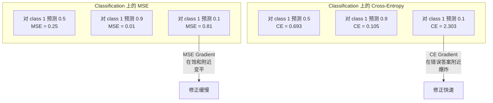
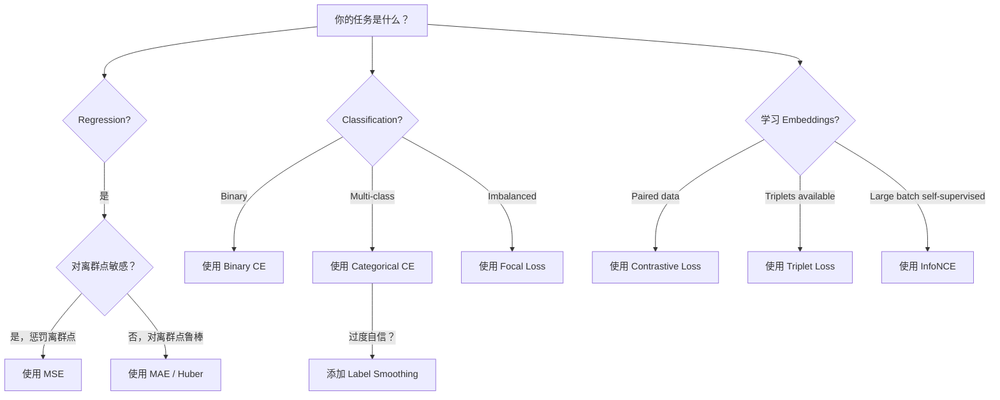
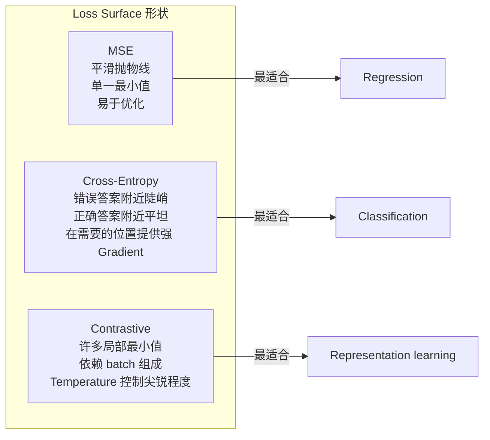

# Loss Functions

> 你的 Neural Network 做出一个预测。ground truth 却给出不同答案。它错得有多离谱？那个数字就是 Loss。选错 Loss Function，你的模型就会完全优化错误的目标。

**Type:** Build
**Languages:** Python
**Prerequisites:** Lesson 03.04 (Activation Functions)
**Time:** ~75 minutes

## 学习目标

- 从零实现 MSE、binary cross-entropy、categorical cross-entropy 和 contrastive loss (InfoNCE)，以及它们的 Gradient
- 通过演示“对所有样本都预测 0.5”的失败模式，解释为什么 MSE 不适合 Classification
- 将 label smoothing 应用于 cross-entropy，并描述它如何防止过度自信的预测
- 为 Regression、binary classification、multi-class classification 和 Embedding 学习任务选择正确的 Loss Function

## 问题

在 Classification 问题上最小化 MSE 的模型，会很自信地对所有东西预测 0.5。它确实在最小化 Loss。但它也完全没用。

Loss Function 是模型实际优化的唯一对象。不是 accuracy。不是 F1 score。也不是你汇报给经理的任何 metric。Optimizer 会取 Loss Function 的 Gradient，并调整权重来让这个数字变小。如果 Loss Function 没有捕捉到你真正关心的东西，模型就会找到数学上代价最低的方式来满足它，而那种方式几乎永远不是你想要的。

这里有一个具体例子。你有一个 binary classification 任务。两个类别，50/50 分布。你使用 MSE 作为 Loss。模型对每一个输入都预测 0.5。平均 MSE 是 0.25，这是在什么都没学到的情况下可能达到的最小值。这个模型没有任何判别能力，但从技术上说它已经最小化了你的 Loss Function。换成 cross-entropy 后，同一个模型会被迫把预测推向 0 或 1，因为 -log(0.5) = 0.693 是很糟糕的 Loss，而 -log(0.99) = 0.01 会奖励自信且正确的预测。Loss Function 的选择，就是能学习的模型和钻 metric 空子的模型之间的区别。

情况还会更糟。在 self-supervised learning 中，你甚至没有标签。Contrastive Loss 完全定义了学习信号：什么算相似，什么算不同，以及模型应该多用力把它们分开。Contrastive Loss 写错了，你的 Embeddings 会塌缩到一个点上 -- 每个输入都映射到同一个 Vector。技术上 Loss 为零。实际上毫无价值。

## 概念

### Mean Squared Error (MSE)

Regression 的默认选择。计算预测值和目标值之间差异的平方，并在所有样本上取平均。

```
MSE = (1/n) * sum((y_pred - y_true)^2)
```

为什么平方很重要：它会以二次方式惩罚大误差。误差为 2 的代价是误差为 1 的 4 倍。误差为 10 的代价是 100 倍。这使得 MSE 对离群点敏感 -- 一个极端错误的预测会主导 Loss。

真实数字：如果你的模型预测房价，对大多数房子偏差 $10,000，但对一栋豪宅偏差 $200,000，MSE 会强力尝试修复那一栋豪宅，可能损害另外 99 套房子的表现。

MSE 相对于预测值的 Gradient 是：

```
dMSE/dy_pred = (2/n) * (y_pred - y_true)
```

它与误差线性相关。更大的误差得到更大的 Gradient。这对 Regression 是特性（大误差需要大修正），对 Classification 是问题（你希望对自信但错误的答案进行指数级惩罚，而不是线性惩罚）。

### Cross-Entropy Loss

Classification 的 Loss Function。它源于信息论 -- 衡量预测概率分布和真实分布之间的差异。

**Binary Cross-Entropy (BCE):**

```
BCE = -(y * log(p) + (1 - y) * log(1 - p))
```

其中 y 是真实标签（0 或 1），p 是预测概率。

为什么 -log(p) 有效：当真实标签是 1 且你预测 p = 0.99 时，Loss 是 -log(0.99) = 0.01。当你预测 p = 0.01 时，Loss 是 -log(0.01) = 4.6。这个 460 倍的差异就是 cross-entropy 有效的原因。它会严厉惩罚自信但错误的预测，同时几乎不惩罚自信且正确的预测。

Gradient 讲述的是同一个故事：

```
dBCE/dp = -(y/p) + (1-y)/(1-p)
```

当 y = 1 且 p 接近零时，Gradient 是 -1/p，会趋向负无穷。模型会得到一个巨大的信号来修正错误。当 p 接近 1 时，Gradient 很小。已经正确了，不需要修正。

**Categorical Cross-Entropy:**

用于 one-hot 编码目标的 multi-class classification。

```
CCE = -sum(y_i * log(p_i))
```

只有真实类别会贡献 Loss（因为其他所有 y_i 都是零）。如果有 10 个类别，正确类别得到的概率是 0.1（随机猜测），Loss 是 -log(0.1) = 2.3。如果正确类别得到的概率是 0.9，Loss 是 -log(0.9) = 0.105。模型会学习把概率质量集中到正确答案上。

### 为什么 MSE 不适合 Classification



当预测接近 0 或 1 时，MSE Gradient 会变平（由于 sigmoid 饱和）。Cross-entropy Gradient 会补偿这一点 -- -log 抵消了 sigmoid 的平坦区域，在最需要的位置给出强 Gradient。

### Label Smoothing

标准 one-hot 标签会说“这是 100% class 3，其他所有类别都是 0%。”这是一个很强的断言。Label smoothing 会软化它：

```
smooth_label = (1 - alpha) * one_hot + alpha / num_classes
```

当 alpha = 0.1 且有 10 个类别时：目标不再是 [0, 0, 1, 0, ...]，而是 [0.01, 0.01, 0.91, 0.01, ...]。模型的目标是 0.91，而不是 1.0。

为什么这有效：一个试图通过 softmax 输出精确 1.0 的模型，需要把 logits 推向无穷。这会导致过度自信，损害泛化能力，并让模型对分布偏移变得脆弱。Label smoothing 会把目标限制在 0.9（当 alpha=0.1 时），让 logits 保持在合理范围内。GPT 和大多数现代模型都会使用 label smoothing 或其等价形式。

### Contrastive Loss

没有标签。没有类别。只有输入对和一个问题：它们相似还是不同？

**SimCLR-style contrastive loss (NT-Xent / InfoNCE):**

取一张图像。创建它的两个增强视图（crop、rotate、color jitter）。它们是“positive pair” -- 它们应该有相似的 Embeddings。batch 中的每张其他图像都会形成一个“negative pair” -- 它们应该有不同的 Embeddings。

```
L = -log(exp(sim(z_i, z_j) / tau) / sum(exp(sim(z_i, z_k) / tau)))
```

其中 sim() 是 cosine similarity，z_i 和 z_j 是 positive pair，求和覆盖所有 negatives，tau (temperature) 控制分布的尖锐程度。更低的 temperature = 更难的 negatives = 更激进的分离。

真实数字：batch size 256 意味着每个 positive pair 有 255 个 negatives。Temperature tau = 0.07（SimCLR 默认值）。这个 Loss 看起来像是对相似度做 softmax -- 它希望 positive pair 的相似度在全部 256 个选项中最高。

**Triplet Loss:**

接收三个输入：anchor、positive（同一类别）、negative（不同类别）。

```
L = max(0, d(anchor, positive) - d(anchor, negative) + margin)
```

margin（通常为 0.2-1.0）强制 positive 和 negative 距离之间存在最小间隔。如果 negative 已经足够远，Loss 就是零 -- 没有 Gradient，没有更新。这让训练更高效，但需要谨慎的 triplet mining（选择接近 anchor 的 hard negatives）。

### Focal Loss

用于不平衡数据集。标准 cross-entropy 会同等对待所有正确分类的样本。Focal loss 会降低 easy examples 的权重：

```
FL = -alpha * (1 - p_t)^gamma * log(p_t)
```

其中 p_t 是真实类别的预测概率，gamma 控制聚焦程度。当 gamma = 0 时，这就是标准 cross-entropy。当 gamma = 2（默认值）时：

- Easy example (p_t = 0.9): weight = (0.1)^2 = 0.01。基本被忽略。
- Hard example (p_t = 0.1): weight = (0.9)^2 = 0.81。完整的 Gradient 信号。

Focal loss 由 Lin et al. 提出，用于 object detection，其中 99% 的候选区域都是 background（easy negatives）。没有 focal loss 时，模型会淹没在 easy background examples 中，永远学不会检测物体。有了它，模型会把容量集中在真正重要的困难、模糊样本上。

### Loss Function 决策树



### Loss Landscape



## 构建它

### 步骤 1： MSE 及其 Gradient

```python
def mse(predictions, targets):
    n = len(predictions)
    total = 0.0
    for p, t in zip(predictions, targets):
        total += (p - t) ** 2
    return total / n

def mse_gradient(predictions, targets):
    n = len(predictions)
    grads = []
    for p, t in zip(predictions, targets):
        grads.append(2.0 * (p - t) / n)
    return grads
```

### 步骤 2：Binary Cross-Entropy

log(0) 问题是真实存在的。如果模型对一个 positive example 精确预测 0，log(0) = 负无穷。裁剪可以防止这一点。

```python
import math

def binary_cross_entropy(predictions, targets, eps=1e-15):
    n = len(predictions)
    total = 0.0
    for p, t in zip(predictions, targets):
        p_clipped = max(eps, min(1 - eps, p))
        total += -(t * math.log(p_clipped) + (1 - t) * math.log(1 - p_clipped))
    return total / n

def bce_gradient(predictions, targets, eps=1e-15):
    grads = []
    for p, t in zip(predictions, targets):
        p_clipped = max(eps, min(1 - eps, p))
        grads.append(-(t / p_clipped) + (1 - t) / (1 - p_clipped))
    return grads
```

### 步骤 3： 带 Softmax 的 Categorical Cross-Entropy

Softmax 将原始 logits 转换为概率。然后我们根据 one-hot targets 计算 cross-entropy。

```python
def softmax(logits):
    max_val = max(logits)
    exps = [math.exp(x - max_val) for x in logits]
    total = sum(exps)
    return [e / total for e in exps]

def categorical_cross_entropy(logits, target_index, eps=1e-15):
    probs = softmax(logits)
    p = max(eps, probs[target_index])
    return -math.log(p)

def cce_gradient(logits, target_index):
    probs = softmax(logits)
    grads = list(probs)
    grads[target_index] -= 1.0
    return grads
```

softmax + cross-entropy 的 Gradient 会优雅地化简：对真实类别来说，它只是（预测概率 - 1），对所有其他类别来说，它只是（预测概率）。这个优雅的化简不是巧合 -- 这正是 softmax 和 cross-entropy 被配对使用的原因。

### 步骤 4： Label Smoothing

```python
def label_smoothed_cce(logits, target_index, num_classes, alpha=0.1, eps=1e-15):
    probs = softmax(logits)
    loss = 0.0
    for i in range(num_classes):
        if i == target_index:
            smooth_target = 1.0 - alpha + alpha / num_classes
        else:
            smooth_target = alpha / num_classes
        p = max(eps, probs[i])
        loss += -smooth_target * math.log(p)
    return loss
```

### 步骤 5： Contrastive Loss（简化版 InfoNCE）

```python
def cosine_similarity(a, b):
    dot = sum(x * y for x, y in zip(a, b))
    norm_a = math.sqrt(sum(x * x for x in a))
    norm_b = math.sqrt(sum(x * x for x in b))
    if norm_a < 1e-10 or norm_b < 1e-10:
        return 0.0
    return dot / (norm_a * norm_b)

def contrastive_loss(anchor, positive, negatives, temperature=0.07):
    sim_pos = cosine_similarity(anchor, positive) / temperature
    sim_negs = [cosine_similarity(anchor, neg) / temperature for neg in negatives]

    max_sim = max(sim_pos, max(sim_negs)) if sim_negs else sim_pos
    exp_pos = math.exp(sim_pos - max_sim)
    exp_negs = [math.exp(s - max_sim) for s in sim_negs]
    total_exp = exp_pos + sum(exp_negs)

    return -math.log(max(1e-15, exp_pos / total_exp))
```

### 步骤 6： Classification 上的 MSE vs Cross-Entropy

使用两种 Loss Function 训练 lesson 04 中的同一个 Neural Network（circle dataset）。观察 cross-entropy 收敛得更快。

```python
import random

def sigmoid(x):
    x = max(-500, min(500, x))
    return 1.0 / (1.0 + math.exp(-x))

def make_circle_data(n=200, seed=42):
    random.seed(seed)
    data = []
    for _ in range(n):
        x = random.uniform(-2, 2)
        y = random.uniform(-2, 2)
        label = 1.0 if x * x + y * y < 1.5 else 0.0
        data.append(([x, y], label))
    return data


class LossComparisonNetwork:
    def __init__(self, loss_type="bce", hidden_size=8, lr=0.1):
        random.seed(0)
        self.loss_type = loss_type
        self.lr = lr
        self.hidden_size = hidden_size

        self.w1 = [[random.gauss(0, 0.5) for _ in range(2)] for _ in range(hidden_size)]
        self.b1 = [0.0] * hidden_size
        self.w2 = [random.gauss(0, 0.5) for _ in range(hidden_size)]
        self.b2 = 0.0

    def forward(self, x):
        self.x = x
        self.z1 = []
        self.h = []
        for i in range(self.hidden_size):
            z = self.w1[i][0] * x[0] + self.w1[i][1] * x[1] + self.b1[i]
            self.z1.append(z)
            self.h.append(max(0.0, z))

        self.z2 = sum(self.w2[i] * self.h[i] for i in range(self.hidden_size)) + self.b2
        self.out = sigmoid(self.z2)
        return self.out

    def backward(self, target):
        if self.loss_type == "mse":
            d_loss = 2.0 * (self.out - target)
        else:
            eps = 1e-15
            p = max(eps, min(1 - eps, self.out))
            d_loss = -(target / p) + (1 - target) / (1 - p)

        d_sigmoid = self.out * (1 - self.out)
        d_out = d_loss * d_sigmoid

        for i in range(self.hidden_size):
            d_relu = 1.0 if self.z1[i] > 0 else 0.0
            d_h = d_out * self.w2[i] * d_relu
            self.w2[i] -= self.lr * d_out * self.h[i]
            for j in range(2):
                self.w1[i][j] -= self.lr * d_h * self.x[j]
            self.b1[i] -= self.lr * d_h
        self.b2 -= self.lr * d_out

    def compute_loss(self, pred, target):
        if self.loss_type == "mse":
            return (pred - target) ** 2
        else:
            eps = 1e-15
            p = max(eps, min(1 - eps, pred))
            return -(target * math.log(p) + (1 - target) * math.log(1 - p))

    def train(self, data, epochs=200):
        losses = []
        for epoch in range(epochs):
            total_loss = 0.0
            correct = 0
            for x, y in data:
                pred = self.forward(x)
                self.backward(y)
                total_loss += self.compute_loss(pred, y)
                if (pred >= 0.5) == (y >= 0.5):
                    correct += 1
            avg_loss = total_loss / len(data)
            accuracy = correct / len(data) * 100
            losses.append((avg_loss, accuracy))
            if epoch % 50 == 0 or epoch == epochs - 1:
                print(f"    Epoch {epoch:3d}: loss={avg_loss:.4f}, accuracy={accuracy:.1f}%")
        return losses
```

## 使用它

PyTorch 提供了所有标准 Loss Function，并内置了数值稳定性：

```python
import torch
import torch.nn as nn
import torch.nn.functional as F

predictions = torch.tensor([0.9, 0.1, 0.7], requires_grad=True)
targets = torch.tensor([1.0, 0.0, 1.0])

mse_loss = F.mse_loss(predictions, targets)
bce_loss = F.binary_cross_entropy(predictions, targets)

logits = torch.randn(4, 10)
labels = torch.tensor([3, 7, 1, 9])
ce_loss = F.cross_entropy(logits, labels)
ce_smooth = F.cross_entropy(logits, labels, label_smoothing=0.1)
```

使用 `F.cross_entropy`（而不是 `F.nll_loss` 加手动 softmax）。它将 log-softmax 和 negative log-likelihood 合并为一个数值稳定的操作。先单独应用 softmax 再取 log 稳定性更差 -- 在大指数的相减中会丢失精度。

对于 contrastive learning，大多数团队会使用自定义实现，或使用 `lightly`、`pytorch-metric-learning` 这样的库。核心循环始终相同：计算成对相似度，基于 positives 和 negatives 创建 softmax，然后 Backpropagation。

## 交付它

本课会产出：
- `outputs/prompt-loss-function-selector.md` -- 一个可复用 prompt，用于选择正确的 Loss Function
- `outputs/prompt-loss-debugger.md` -- 一个诊断 prompt，用于处理 Loss 曲线看起来不对的情况

## 练习

1. 实现 Huber loss（smooth L1 loss），它对小误差使用 MSE，对大误差使用 MAE。训练一个 Regression Neural Network 来预测 y = sin(x)，并在 5% 训练目标被加入随机噪声（离群点）的情况下比较 MSE 与 Huber。比较最终测试误差。

2. 将 focal loss 添加到 binary classification 训练循环中。创建一个不平衡数据集（90% class 0，10% class 1）。比较标准 BCE 与 focal loss (gamma=2) 在 200 个 epochs 后对少数类的 recall。

3. 实现带 semi-hard negative mining 的 triplet loss。为 5 个类别生成 2D Embedding 数据。对每个 anchor，找到仍然比 positive 更远的 hardest negative（semi-hard）。将收敛情况与随机 triplet 选择进行比较。

4. 运行 MSE vs cross-entropy 对比，但在训练期间跟踪每一层的 Gradient magnitude。绘制每个 epoch 的平均 Gradient norm。验证在模型最不确定的早期 epochs 中，cross-entropy 会产生更大的 Gradient。

5. 实现 KL divergence loss，并验证当真实分布是 one-hot 时，最小化 KL(true || predicted) 会给出与 cross-entropy 相同的 Gradient。然后尝试 soft targets（如 knowledge distillation），其中“真实”分布来自 teacher model 的 softmax 输出。

## 关键术语

| Term | 人们常说的说法 | 它实际意味着什么 |
|------|----------------|----------------------|
| Loss function | “模型错得有多离谱” | 一个可微函数，将预测和目标映射到 Optimizer 要最小化的标量 |
| MSE | “平均平方误差” | 预测和目标之间平方差的均值；以二次方式惩罚大误差 |
| Cross-entropy | “Classification 的 Loss” | 使用 -log(p) 衡量预测概率分布和真实分布之间的差异 |
| Binary cross-entropy | “BCE” | 两个类别的 cross-entropy：-(y*log(p) + (1-y)*log(1-p)) |
| Label smoothing | “软化目标” | 用软值（例如 0.1/0.9）替换硬 0/1 目标，以防止过度自信并提升泛化能力 |
| Contrastive loss | “拉近，推远” | 一种通过让相似对在 Embedding 空间中更近、非相似对更远来学习表示的 Loss |
| InfoNCE | “CLIP/SimCLR Loss” | 对相似度分数进行 normalized temperature-scaled cross-entropy；将 contrastive learning 视为 Classification |
| Focal loss | “不平衡数据修复方案” | 用 (1-p_t)^gamma 加权的 cross-entropy，用于降低 easy examples 的权重并聚焦 hard examples |
| Triplet loss | “Anchor-positive-negative” | 在 Embedding 空间中，使 anchor 比 negative 至少按一个 margin 更接近 positive |
| Temperature | “尖锐度旋钮” | 作用在 logits/相似度上的标量除数，用于控制结果分布的峰值程度；越低越尖锐 |

## 延伸阅读

- Lin et al., "Focal Loss for Dense Object Detection" (2017) -- 引入 focal loss，用于处理 object detection 中的极端类别不平衡（RetinaNet）
- Chen et al., "A Simple Framework for Contrastive Learning of Visual Representations" (SimCLR, 2020) -- 使用 NT-Xent loss 定义了现代 contrastive learning 流程
- Szegedy et al., "Rethinking the Inception Architecture" (2016) -- 引入 label smoothing 作为正则化技术，如今已成为多数大模型的标准做法
- Hinton et al., "Distilling the Knowledge in a Neural Network" (2015) -- 使用 soft targets 和 KL divergence 的 knowledge distillation，是模型压缩的基础
