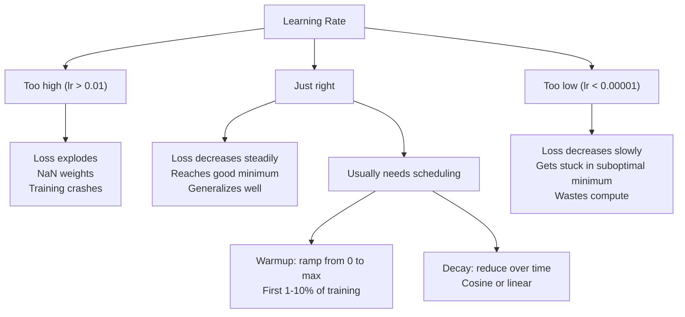
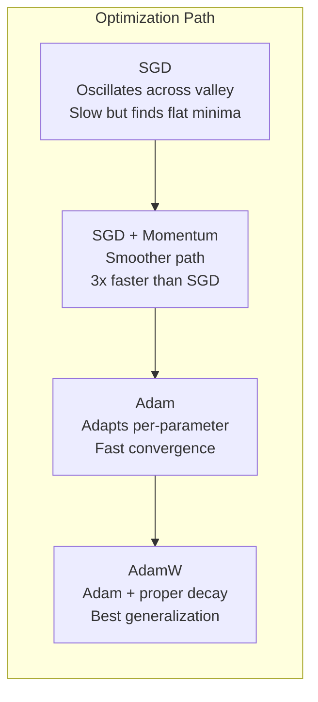
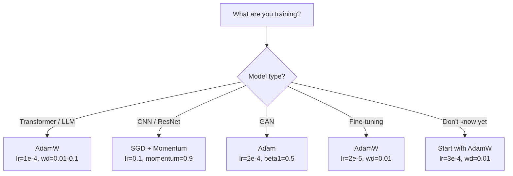

# Optimizers

> Gradient Descent 告诉你该往哪个方向移动。它没有说明要走多远，也没有说明要走多快。SGD 是指南针。Adam 是带交通数据的 GPS。

**Type:** Build
**Languages:** Python
**Prerequisites:** Lesson 03.05 (Loss Functions)
**Time:** ~75 minutes

## 学习目标

- 用 Python 从零实现 SGD、带 momentum 的 SGD、Adam 和 AdamW Optimizers
- 解释 Adam 的 bias correction 如何补偿训练早期步骤中以零初始化的 moment estimates
- 展示为什么在同一任务上，AdamW 比带 L2 regularization 的 Adam 具有更好的泛化能力
- 为 transformers、CNNs、GANs 和 fine-tuning 选择合适的 Optimizer 与默认 hyperparameters

## 问题

你已经计算出了 Gradient。你知道第 #4,721 个权重应该减少 0.003 才能降低 Loss。但 0.003 的单位是什么？按什么缩放？第 1 步和第 1,000 步应该移动同样的量吗？

Vanilla Gradient Descent 在每一步对每个 parameter 应用相同的 learning rate：w = w - lr * gradient。这会产生三个问题，让训练 Neural Network 在实践中变得很痛苦。

第一，振荡。Loss landscape 很少像一个平滑的碗。它更像一条又长又窄的山谷。Gradient 指向穿过山谷的方向（陡峭方向），而不是沿着山谷的方向（平缓方向）。Gradient Descent 会在狭窄维度上来回弹跳，而在真正有用的方向上进展很小。你已经见过这种现象：Loss 先快速下降，然后进入平台期，不是因为 model 已经收敛，而是因为它在振荡。

第二，对所有 parameters 使用同一个 learning rate 是错误的。有些 weights 需要大幅更新（它们还处在早期的 underfitting 阶段）。另一些 weights 只需要很小的更新（它们接近最优值）。适合前者的 learning rate 会破坏后者，反之亦然。

第三，saddle points。在高维空间中，Loss landscape 存在大片平坦区域，其中 Gradient 接近零。Vanilla SGD 会以 Gradient 的速度爬过这些区域，而这个速度实际上接近零。Model 看起来卡住了。它并没有卡住 -- 它处在一个平坦区域，另一侧还有有用的下降方向。但 SGD 没有推动它穿过这片区域的机制。

Adam 解决了这三个问题。它为每个 parameter 维护两个 running averages -- mean gradient（momentum，处理振荡）和 mean squared gradient（adaptive rate，处理不同尺度）。再结合前几步的 bias correction，它提供了一个使用默认 hyperparameters 就能处理 80% 问题的单一 Optimizer。本课会从零构建它，让你准确理解它在另外 20% 场景中何时以及为什么会失败。

## 概念

### Stochastic Gradient Descent (SGD)

最简单的 Optimizer。在 mini-batch 上计算 Gradient，并朝相反方向前进一步。

```
w = w - lr * gradient
```

“stochastic” 表示你使用数据的随机子集（mini-batch）来估计 Gradient，而不是使用完整 dataset。这种噪声实际上是有用的 -- 它有助于逃离尖锐的 local minima。但噪声也会导致振荡。

Learning rate 是唯一的旋钮。太高：Loss 发散。太低：训练会耗费极长时间。最优值取决于 architecture、data、batch size，以及当前训练阶段。对于现代 networks 上的 vanilla SGD，典型取值范围是 0.01 到 0.1。但即使在一次训练过程中，理想的 learning rate 也会变化。

### Momentum

小球滚下山坡的类比被用得太多，但它是准确的。你不是只按 Gradient 前进，而是维护一个 velocity，用来累积过去的 Gradients。

```
m_t = beta * m_{t-1} + gradient
w = w - lr * m_t
```

Beta（通常为 0.9）控制保留多少历史信息。当 beta = 0.9 时，momentum 大致等于最近 10 个 Gradients 的平均值（1 / (1 - 0.9) = 10）。

为什么这能修复振荡：指向相同方向的 Gradients 会累积。方向反复翻转的 Gradients 会相互抵消。在那条狭窄山谷中，“横穿”分量每一步都会变号并被削弱。“沿着”分量保持一致并被放大。结果是在有用方向上平滑加速。

真实数字：在条件很差的 Loss landscape 上，单独使用 SGD 可能需要 10,000 步。带 momentum 的 SGD（beta=0.9）在同一问题上通常需要 3,000-5,000 步。这个加速并不微小。

### RMSProp

第一个真正有效的 per-parameter adaptive learning rate 方法。由 Hinton 在 Coursera 课程中提出（从未正式发表）。

```
s_t = beta * s_{t-1} + (1 - beta) * gradient^2
w = w - lr * gradient / (sqrt(s_t) + epsilon)
```

s_t 跟踪 squared gradients 的 running average。持续拥有较大 Gradients 的 parameters 会除以一个较大的数（更小的有效 learning rate）。Gradients 较小的 parameters 会除以一个较小的数（更大的有效 learning rate）。

这解决了“所有 parameters 使用同一个 learning rate”的问题。一个已经持续获得大幅更新的 weight 很可能接近目标 -- 放慢它。一个一直只得到很小更新的 weight 可能训练不足 -- 加快它。

Epsilon（通常为 1e-8）会在某个 parameter 尚未更新时防止除以零。

### Adam: Momentum + RMSProp

Adam 结合了两种思想。它为每个 parameter 维护两个 exponential moving averages：

```
m_t = beta1 * m_{t-1} + (1 - beta1) * gradient        (first moment: mean)
v_t = beta2 * v_{t-1} + (1 - beta2) * gradient^2       (second moment: variance)
```

**Bias correction** 是大多数解释会跳过的关键细节。在第 1 步，m_1 = (1 - beta1) * gradient。当 beta1 = 0.9 时，它是 0.1 * gradient -- 小了十倍。moving average 还没有预热。Bias correction 会进行补偿：

```
m_hat = m_t / (1 - beta1^t)
v_hat = v_t / (1 - beta2^t)
```

第 1 步且 beta1 = 0.9 时：m_hat = m_1 / (1 - 0.9) = m_1 / 0.1 = 实际 Gradient。第 100 步时：(1 - 0.9^100) 约等于 1.0，因此 correction 消失。Bias correction 对前 ~10 步很重要，在 ~50 步之后基本无关紧要。

更新公式：

```
w = w - lr * m_hat / (sqrt(v_hat) + epsilon)
```

Adam 默认值：lr = 0.001，beta1 = 0.9，beta2 = 0.999，epsilon = 1e-8。这些默认值适用于 80% 的问题。当它们不适用时，先改 lr。然后改 beta2。几乎永远不要改 beta1 或 epsilon。

### AdamW: 正确处理 Weight Decay

L2 regularization 会向 Loss 中添加 lambda * w^2。在 vanilla SGD 中，这等价于 weight decay（每一步从 weight 中减去 lambda * w）。在 Adam 中，这种等价关系会失效。

Loshchilov & Hutter 的洞见是：当你把 L2 加到 Loss 中，然后让 Adam 处理 Gradient 时，adaptive learning rate 也会缩放 regularization term。Gradient variance 大的 parameters 得到更少 regularization。Variance 小的 parameters 得到更多。这不是你想要的 -- 你想要的是不依赖 Gradient statistics 的统一 regularization。

AdamW 通过在 Adam update 之后直接对 weights 应用 weight decay 来修复这个问题：

```
w = w - lr * m_hat / (sqrt(v_hat) + epsilon) - lr * lambda * w
```

Weight decay term（lr * lambda * w）不会被 Adam 的 adaptive factor 缩放。每个 parameter 都获得相同的比例收缩。

这看起来像一个小细节。并不是。AdamW 在几乎所有任务上都会比 Adam + L2 regularization 收敛到更好的解。它是 PyTorch 中用于训练 transformers、diffusion models 和多数现代 architectures 的默认 Optimizer。BERT、GPT、LLaMA、Stable Diffusion -- 都是用 AdamW 训练的。

### Learning Rate: 最重要的 Hyperparameter



如果你只调一个 hyperparameter，那就调 learning rate。Learning rate 发生 10 倍变化，比你会做出的任何 architecture 决策都更重要。常见默认值：

- SGD: lr = 0.01 to 0.1
- Adam/AdamW: lr = 1e-4 to 3e-4
- Fine-tuning pretrained models: lr = 1e-5 to 5e-5
- Learning rate warmup: 在前 1-10% 的 steps 中线性 ramp

### Optimizer 对比



### 每种 Optimizer 何时胜出




```figure
optimizer-trajectory
```

## 构建它

### 步骤 1： Vanilla SGD

```python
class SGD:
    def __init__(self, lr=0.01):
        self.lr = lr

    def step(self, params, grads):
        for i in range(len(params)):
            params[i] -= self.lr * grads[i]
```

### 步骤 2： 带 Momentum 的 SGD

```python
class SGDMomentum:
    def __init__(self, lr=0.01, beta=0.9):
        self.lr = lr
        self.beta = beta
        self.velocities = None

    def step(self, params, grads):
        if self.velocities is None:
            self.velocities = [0.0] * len(params)
        for i in range(len(params)):
            self.velocities[i] = self.beta * self.velocities[i] + grads[i]
            params[i] -= self.lr * self.velocities[i]
```

### 步骤 3： Adam

```python
import math

class Adam:
    def __init__(self, lr=0.001, beta1=0.9, beta2=0.999, epsilon=1e-8):
        self.lr = lr
        self.beta1 = beta1
        self.beta2 = beta2
        self.epsilon = epsilon
        self.m = None
        self.v = None
        self.t = 0

    def step(self, params, grads):
        if self.m is None:
            self.m = [0.0] * len(params)
            self.v = [0.0] * len(params)

        self.t += 1

        for i in range(len(params)):
            self.m[i] = self.beta1 * self.m[i] + (1 - self.beta1) * grads[i]
            self.v[i] = self.beta2 * self.v[i] + (1 - self.beta2) * grads[i] ** 2

            m_hat = self.m[i] / (1 - self.beta1 ** self.t)
            v_hat = self.v[i] / (1 - self.beta2 ** self.t)

            params[i] -= self.lr * m_hat / (math.sqrt(v_hat) + self.epsilon)
```

### 步骤 4： AdamW

```python
class AdamW:
    def __init__(self, lr=0.001, beta1=0.9, beta2=0.999, epsilon=1e-8, weight_decay=0.01):
        self.lr = lr
        self.beta1 = beta1
        self.beta2 = beta2
        self.epsilon = epsilon
        self.weight_decay = weight_decay
        self.m = None
        self.v = None
        self.t = 0

    def step(self, params, grads):
        if self.m is None:
            self.m = [0.0] * len(params)
            self.v = [0.0] * len(params)

        self.t += 1

        for i in range(len(params)):
            self.m[i] = self.beta1 * self.m[i] + (1 - self.beta1) * grads[i]
            self.v[i] = self.beta2 * self.v[i] + (1 - self.beta2) * grads[i] ** 2

            m_hat = self.m[i] / (1 - self.beta1 ** self.t)
            v_hat = self.v[i] / (1 - self.beta2 ** self.t)

            params[i] -= self.lr * m_hat / (math.sqrt(v_hat) + self.epsilon)
            params[i] -= self.lr * self.weight_decay * params[i]
```

### 步骤 5： 训练对比

在 lesson 05 的 circle dataset 上，用全部四种 Optimizers 训练同一个两层 network。比较收敛情况。

```python
import random

def sigmoid(x):
    x = max(-500, min(500, x))
    return 1.0 / (1.0 + math.exp(-x))

def make_circle_data(n=200, seed=42):
    random.seed(seed)
    data = []
    for _ in range(n):
        x = random.uniform(-2, 2)
        y = random.uniform(-2, 2)
        label = 1.0 if x * x + y * y < 1.5 else 0.0
        data.append(([x, y], label))
    return data


class OptimizerTestNetwork:
    def __init__(self, optimizer, hidden_size=8):
        random.seed(0)
        self.hidden_size = hidden_size
        self.optimizer = optimizer

        self.w1 = [[random.gauss(0, 0.5) for _ in range(2)] for _ in range(hidden_size)]
        self.b1 = [0.0] * hidden_size
        self.w2 = [random.gauss(0, 0.5) for _ in range(hidden_size)]
        self.b2 = 0.0

    def get_params(self):
        params = []
        for row in self.w1:
            params.extend(row)
        params.extend(self.b1)
        params.extend(self.w2)
        params.append(self.b2)
        return params

    def set_params(self, params):
        idx = 0
        for i in range(self.hidden_size):
            for j in range(2):
                self.w1[i][j] = params[idx]
                idx += 1
        for i in range(self.hidden_size):
            self.b1[i] = params[idx]
            idx += 1
        for i in range(self.hidden_size):
            self.w2[i] = params[idx]
            idx += 1
        self.b2 = params[idx]

    def forward(self, x):
        self.x = x
        self.z1 = []
        self.h = []
        for i in range(self.hidden_size):
            z = self.w1[i][0] * x[0] + self.w1[i][1] * x[1] + self.b1[i]
            self.z1.append(z)
            self.h.append(max(0.0, z))

        self.z2 = sum(self.w2[i] * self.h[i] for i in range(self.hidden_size)) + self.b2
        self.out = sigmoid(self.z2)
        return self.out

    def compute_grads(self, target):
        eps = 1e-15
        p = max(eps, min(1 - eps, self.out))
        d_loss = -(target / p) + (1 - target) / (1 - p)
        d_sigmoid = self.out * (1 - self.out)
        d_out = d_loss * d_sigmoid

        grads = [0.0] * (self.hidden_size * 2 + self.hidden_size + self.hidden_size + 1)
        idx = 0
        for i in range(self.hidden_size):
            d_relu = 1.0 if self.z1[i] > 0 else 0.0
            d_h = d_out * self.w2[i] * d_relu
            grads[idx] = d_h * self.x[0]
            grads[idx + 1] = d_h * self.x[1]
            idx += 2

        for i in range(self.hidden_size):
            d_relu = 1.0 if self.z1[i] > 0 else 0.0
            grads[idx] = d_out * self.w2[i] * d_relu
            idx += 1

        for i in range(self.hidden_size):
            grads[idx] = d_out * self.h[i]
            idx += 1

        grads[idx] = d_out
        return grads

    def train(self, data, epochs=300):
        losses = []
        for epoch in range(epochs):
            total_loss = 0.0
            correct = 0
            for x, y in data:
                pred = self.forward(x)
                grads = self.compute_grads(y)
                params = self.get_params()
                self.optimizer.step(params, grads)
                self.set_params(params)

                eps = 1e-15
                p = max(eps, min(1 - eps, pred))
                total_loss += -(y * math.log(p) + (1 - y) * math.log(1 - p))
                if (pred >= 0.5) == (y >= 0.5):
                    correct += 1
            avg_loss = total_loss / len(data)
            accuracy = correct / len(data) * 100
            losses.append((avg_loss, accuracy))
            if epoch % 75 == 0 or epoch == epochs - 1:
                print(f"    Epoch {epoch:3d}: loss={avg_loss:.4f}, accuracy={accuracy:.1f}%")
        return losses
```

## 使用它

PyTorch Optimizers 会处理 parameter groups、gradient clipping 和 learning rate scheduling：

```python
import torch
import torch.optim as optim

model = torch.nn.Sequential(
    torch.nn.Linear(784, 256),
    torch.nn.ReLU(),
    torch.nn.Linear(256, 10),
)

optimizer = optim.AdamW(model.parameters(), lr=3e-4, weight_decay=0.01)

scheduler = optim.lr_scheduler.CosineAnnealingLR(optimizer, T_max=100)

for epoch in range(100):
    optimizer.zero_grad()
    output = model(torch.randn(32, 784))
    loss = torch.nn.functional.cross_entropy(output, torch.randint(0, 10, (32,)))
    loss.backward()
    torch.nn.utils.clip_grad_norm_(model.parameters(), max_norm=1.0)
    optimizer.step()
    scheduler.step()
```

模式始终是：zero_grad、forward、loss、backward、(clip)、step、(schedule)。记住这个顺序。弄错它（例如在 optimizer.step() 之前调用 scheduler.step()）是细微 bug 的常见来源。

对于 CNNs，许多实践者仍然偏好使用带 momentum 的 SGD（lr=0.1，momentum=0.9，weight_decay=1e-4），并搭配 step 或 cosine schedule。SGD 会找到更平坦的 minima，而这通常有更好的泛化能力。对于 transformers 和 LLMs，带 warmup + cosine decay 的 AdamW 是通用默认选择。除非有经过测量的理由，否则不要和共识对抗。

## 交付它

本课产出：
- `outputs/prompt-optimizer-selector.md` -- 一个用于为任意 architecture 选择正确 Optimizer 和 learning rate 的决策 prompt

## 练习

1. 实现 Nesterov momentum，其中你在 “lookahead” 位置（w - lr * beta * v）而不是当前位置计算 Gradient。在 circle dataset 上比较它与标准 momentum 的收敛情况。

2. 实现一个 learning rate warmup schedule：在训练前 10% 的 steps 中从 0 线性 ramp 到 max_lr，然后 cosine decay 到 0。比较 Adam + warmup 与无 warmup 的 Adam。测量在 circle dataset 上达到 90% accuracy 需要多少 epochs。

3. 在 Adam 训练期间跟踪每个 parameter 的有效 learning rate。有效 rate 是 lr * m_hat / (sqrt(v_hat) + eps)。绘制第 10、50 和 200 步之后有效 rates 的分布。所有 parameters 都以相同速度更新吗？

4. 实现 gradient clipping（按 global norm clip）。将 max gradient norm 设置为 1.0。使用较高 learning rate（Adam 的 lr=0.01）分别在有 clipping 和无 clipping 的情况下训练。统计 10 个 random seeds 中，有多少次 run 会发散（Loss 变为 NaN）。

5. 在一个具有大 weights 的 network 上比较 Adam 与 AdamW。将所有 weights 初始化为 [-5, 5] 中的随机值（远大于正常值）。使用 weight_decay=0.1 训练 200 epochs。绘制两个 Optimizers 训练过程中 weights 的 L2 norm。AdamW 应该显示更快的 weight shrinkage。

## 关键术语

| Term | 人们通常怎么说 | 它实际意味着什么 |
|------|----------------|----------------------|
| Learning rate | “Step size” | Gradient update 上的标量乘数；训练中影响最大的单个 hyperparameter |
| SGD | “Basic gradient descent” | Stochastic Gradient Descent：通过减去 lr * gradient 来更新 weights，Gradient 在 mini-batch 上计算 |
| Momentum | “Rolling ball analogy” | 过去 Gradients 的 exponential moving average；削弱振荡，并加速一致方向 |
| RMSProp | “Adaptive learning rate” | 用近期 Gradients 的 running RMS 除以每个 parameter 的 Gradient；均衡 learning rates |
| Adam | “The default optimizer” | 将 momentum（first moment）和 RMSProp（second moment）结合起来，并对初始 steps 进行 bias correction |
| AdamW | “Adam done right” | 带 decoupled weight decay 的 Adam；直接对 weights 应用 regularization，而不是通过 Gradient |
| Bias correction | “Warmup for running averages” | 除以 (1 - beta^t)，用于补偿 Adam 的 moment estimates 的零初始化 |
| Weight decay | “Shrink the weights” | 每一步减去 weight 值的一部分；一种惩罚大 weights 的 regularizer |
| Learning rate schedule | “Changing lr over time” | 在训练期间调整 learning rate 的函数；warmup + cosine decay 是现代默认方案 |
| Gradient clipping | “Capping the gradient norm” | 当 Gradient Vector 的 norm 超过阈值时对其进行缩放；防止 exploding gradient updates |

## 延伸阅读

- Kingma & Ba, “Adam: A Method for Stochastic Optimization” (2014) -- 原始 Adam paper，包含 convergence analysis 和 bias correction 推导
- Loshchilov & Hutter, “Decoupled Weight Decay Regularization” (2017) -- 证明了在 Adam 中 L2 regularization 与 weight decay 不等价，并提出 AdamW
- Smith, “Cyclical Learning Rates for Training Neural Networks” (2017) -- 引入 LR range test 和 cyclical schedules，减少调固定 learning rate 的需求
- Ruder, “An Overview of Gradient Descent Optimization Algorithms” (2016) -- 关于所有 Optimizer 变体的最佳单篇综述，比较清晰，直觉解释也明确
