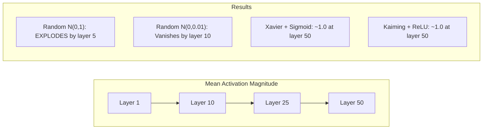
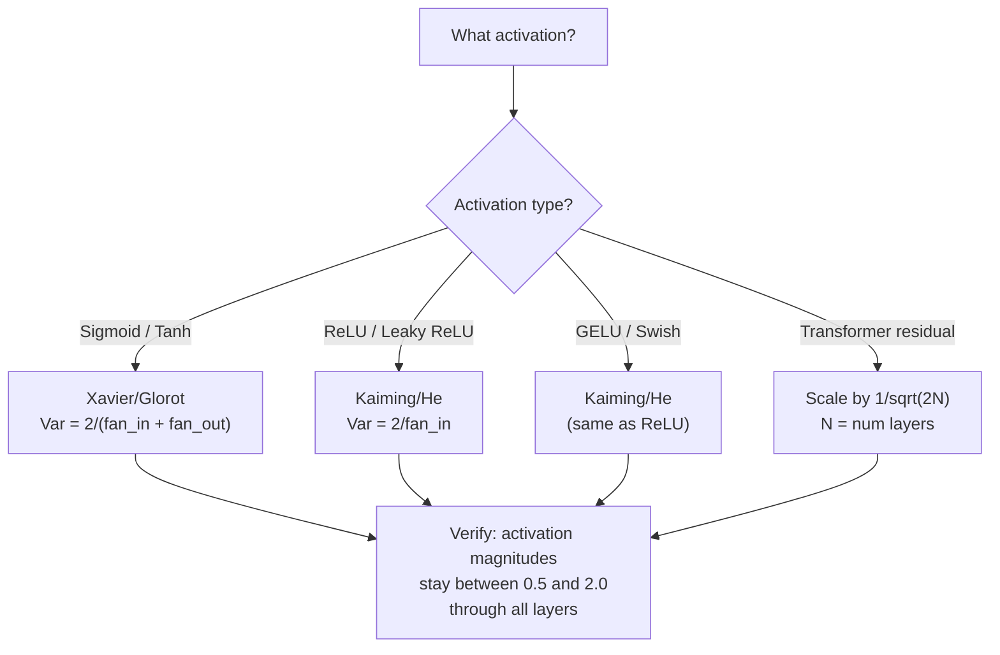

# Weight Initialization 与训练稳定性

> 初始化错了，训练根本无法开始。初始化对了，50 层也能像 3 层一样平稳训练。

**Type:** Build
**Languages:** Python
**Prerequisites:** Lesson 03.04 (Activation Functions), Lesson 03.07 (Regularization)
**Time:** ~90 minutes

## 学习目标
- 实现 zero、random、Xavier/Glorot 和 Kaiming/He initialization 策略，并测量它们对 50 层中 activation 幅度的影响
- 推导为什么 Xavier init 使用 Var(w) = 2/(fan_in + fan_out)，而 Kaiming 使用 Var(w) = 2/fan_in
- 演示 zero initialization 的 symmetry 问题，并解释为什么仅靠 random scale 还不够
- 将正确的 initialization 策略匹配到 activation function：sigmoid/tanh 使用 Xavier，ReLU/GELU 使用 Kaiming

## 问题
把所有 weights 都初始化为 zero。什么都学不到。每个 neuron 都计算相同的函数，接收相同的 Gradient，并以相同方式更新。经过 10,000 个 epochs 后，你的 512-neuron hidden layer 仍然只是同一个 neuron 的 512 个副本。你为 512 个 parameters 付出了成本，却只得到了 1 个。

把它们初始化得太大。Activations 会在整个 network 中爆炸。到 layer 10，数值达到 1e15。到 layer 20，它们 overflow 成 infinity。Gradients 会沿着反方向走同样的轨迹。

从 standard normal distribution 中 random 初始化。对 3 层有效。到了 50 层，signal 会坍缩为 zero，或者爆炸到 infinity，取决于 random scale 是略小还是略大。“能工作”和“崩掉”之间的边界极其狭窄。

Weight initialization 是 Deep Learning 中最被低估的决策。Architecture 会有论文。Optimizers 会有博客文章。Initialization 通常只得到一个脚注。但如果这里错了，其他一切都不重要 -- 你的 network 在训练开始前就已经死了。

## 概念
### The Symmetry Problem

一个 layer 中的每个 neuron 都有相同结构：用 weights 乘以 inputs，加上 bias，应用 activation。如果所有 weights 都从相同值开始（zero 是极端情况），每个 neuron 都会计算相同的 output。在 Backpropagation 期间，每个 neuron 都会接收相同的 Gradient。在 update step 期间，每个 neuron 都会改变相同的量。

你被卡住了。Network 有数百个 parameters，但它们都同步移动。这称为 symmetry，而 random initialization 是打破它的暴力方法。每个 neuron 都从 weight space 中的不同位置开始，因此每个 neuron 都会学习不同的 feature。

但“random”还不够。随机性的 *scale* 决定了 network 是否能训练。

### Variance Propagation Through Layers

考虑一个具有 fan_in 个 inputs 的单个 layer：

```
z = w1*x1 + w2*x2 + ... + w_n*x_n
```

如果每个 weight wi 都来自 variance 为 Var(w) 的 distribution，并且每个 input xi 的 variance 为 Var(x)，则 output variance 为：

```
Var(z) = fan_in * Var(w) * Var(x)
```

如果 Var(w) = 1 且 fan_in = 512，则 output variance 是 input variance 的 512 倍。经过 10 层：512^10 = 1.2e27。你的 signal 已经爆炸。

如果 Var(w) = 0.001，则 output variance 每层按 0.001 * 512 = 0.512 缩小。经过 10 层：0.512^10 = 0.00013。你的 signal 已经消失。

目标：选择 Var(w)，使得 Var(z) = Var(x)。Signal magnitude 在各层之间保持恒定。

### Xavier/Glorot Initialization

Glorot and Bengio (2010) 推导了适用于 sigmoid 和 tanh activations 的解。为了在 forward 和 backward pass 中都保持 variance 恒定：

```
Var(w) = 2 / (fan_in + fan_out)
```

实践中，weights 从以下 distribution 中采样：

```
w ~ Uniform(-limit, limit)  where limit = sqrt(6 / (fan_in + fan_out))
```

或：

```
w ~ Normal(0, sqrt(2 / (fan_in + fan_out)))
```

这之所以有效，是因为 sigmoid 和 tanh 在 zero 附近近似线性，而正确初始化后的 activations 正好位于这个区域。Variance 能够在几十层中保持稳定。

### Kaiming/He Initialization

ReLU 会杀死一半 outputs（所有 negative 都变成 zero）。有效 fan_in 减半，因为平均来看一半 inputs 被置零。Xavier init 没有考虑这一点 -- 它低估了所需的 variance。

He et al. (2015) 调整了公式：

```
Var(w) = 2 / fan_in
```

Weights 从以下 distribution 中采样：

```
w ~ Normal(0, sqrt(2 / fan_in))
```

系数 2 用来补偿 ReLU 将一半 activations 置零的影响。没有它，signal 每层会缩小约 0.5 倍。50 层后：0.5^50 = 8.8e-16。Kaiming init 可以防止这种情况。

### Transformer Initialization

GPT-2 引入了另一种模式。Residual connections 会把每个 sub-layer 的 output 加到它的 input 上：

```
x = x + sublayer(x)
```

每次相加都会增加 variance。对于 N 个 residual layers，variance 会按 N 成比例增长。GPT-2 会将 residual layers 的 weights 按 1/sqrt(2N) 缩放，其中 N 是层数。这能保持累积 signal magnitude 稳定。

Llama 3（405B parameters，126 layers）使用了类似方案。如果没有这种缩放，residual stream 会在 126 层 Attention 和 feedforward blocks 中无界增长。

```mermaid
flowchart TD
    subgraph "Zero Init"
        Z1["Layer 1<br/>All weights = 0"] --> Z2["Layer 2<br/>All neurons identical"]
        Z2 --> Z3["Layer 3<br/>Still identical"]
        Z3 --> ZR["Result: 1 effective neuron<br/>regardless of width"]
    end

    subgraph "Xavier Init"
        X1["Layer 1<br/>Var = 2/(fan_in+fan_out)"] --> X2["Layer 2<br/>Signal stable"]
        X2 --> X3["Layer 50<br/>Signal stable"]
        X3 --> XR["Result: Trains with<br/>sigmoid/tanh"]
    end

    subgraph "Kaiming Init"
        K1["Layer 1<br/>Var = 2/fan_in"] --> K2["Layer 2<br/>Signal stable"]
        K2 --> K3["Layer 50<br/>Signal stable"]
        K3 --> KR["Result: Trains with<br/>ReLU/GELU"]
    end
```



### 穿过 50 层时的 Activation Magnitude



### Choosing the Right Init



## 构建它
### 步骤 1： Initialization Strategies

初始化 weight matrix 的四种方式。每种方式都返回一个 list of lists（一个 2D matrix），其中有 fan_in 列和 fan_out 行。

```python
import math
import random


def zero_init(fan_in, fan_out):
    return [[0.0 for _ in range(fan_in)] for _ in range(fan_out)]


def random_init(fan_in, fan_out, scale=1.0):
    return [[random.gauss(0, scale) for _ in range(fan_in)] for _ in range(fan_out)]


def xavier_init(fan_in, fan_out):
    std = math.sqrt(2.0 / (fan_in + fan_out))
    return [[random.gauss(0, std) for _ in range(fan_in)] for _ in range(fan_out)]


def kaiming_init(fan_in, fan_out):
    std = math.sqrt(2.0 / fan_in)
    return [[random.gauss(0, std) for _ in range(fan_in)] for _ in range(fan_out)]
```

### 步骤 2： Activation Functions

我们需要 sigmoid、tanh 和 ReLU，以便用每种 init 策略及其预期的 activation 进行测试。

```python
def sigmoid(x):
    x = max(-500, min(500, x))
    return 1.0 / (1.0 + math.exp(-x))


def tanh_act(x):
    return math.tanh(x)


def relu(x):
    return max(0.0, x)
```

### 步骤 3： Forward Pass Through 50 Layers

让 random data 通过一个 deep network，并测量每一层的 mean activation magnitude。

```python
def forward_deep(init_fn, activation_fn, n_layers=50, width=64, n_samples=100):
    random.seed(42)
    layer_magnitudes = []

    inputs = [[random.gauss(0, 1) for _ in range(width)] for _ in range(n_samples)]

    for layer_idx in range(n_layers):
        weights = init_fn(width, width)
        biases = [0.0] * width

        new_inputs = []
        for sample in inputs:
            output = []
            for neuron_idx in range(width):
                z = sum(weights[neuron_idx][j] * sample[j] for j in range(width)) + biases[neuron_idx]
                output.append(activation_fn(z))
            new_inputs.append(output)
        inputs = new_inputs

        magnitudes = []
        for sample in inputs:
            magnitudes.append(sum(abs(v) for v in sample) / width)
        mean_mag = sum(magnitudes) / len(magnitudes)
        layer_magnitudes.append(mean_mag)

    return layer_magnitudes
```

### 步骤 4： The Experiment

运行所有组合：zero init、random N(0,1)、random N(0,0.01)、Xavier with sigmoid、Xavier with tanh、Kaiming with ReLU。打印关键层的 magnitude。

```python
def run_experiment():
    configs = [
        ("Zero init + Sigmoid", lambda fi, fo: zero_init(fi, fo), sigmoid),
        ("Random N(0,1) + ReLU", lambda fi, fo: random_init(fi, fo, 1.0), relu),
        ("Random N(0,0.01) + ReLU", lambda fi, fo: random_init(fi, fo, 0.01), relu),
        ("Xavier + Sigmoid", xavier_init, sigmoid),
        ("Xavier + Tanh", xavier_init, tanh_act),
        ("Kaiming + ReLU", kaiming_init, relu),
    ]

    print(f"{'Strategy':<30} {'L1':>10} {'L5':>10} {'L10':>10} {'L25':>10} {'L50':>10}")
    print("-" * 80)

    for name, init_fn, act_fn in configs:
        mags = forward_deep(init_fn, act_fn)
        row = f"{name:<30}"
        for idx in [0, 4, 9, 24, 49]:
            val = mags[idx]
            if val > 1e6:
                row += f" {'EXPLODED':>10}"
            elif val < 1e-6:
                row += f" {'VANISHED':>10}"
            else:
                row += f" {val:>10.4f}"
        print(row)
```

### 步骤 5： Symmetry Demonstration

展示 zero init 会产生完全相同的 neurons。

```python
def symmetry_demo():
    random.seed(42)
    weights = zero_init(2, 4)
    biases = [0.0] * 4

    inputs = [0.5, -0.3]
    outputs = []
    for neuron_idx in range(4):
        z = sum(weights[neuron_idx][j] * inputs[j] for j in range(2)) + biases[neuron_idx]
        outputs.append(sigmoid(z))

    print("\nSymmetry Demo (4 neurons, zero init):")
    for i, out in enumerate(outputs):
        print(f"  Neuron {i}: output = {out:.6f}")
    all_same = all(abs(outputs[i] - outputs[0]) < 1e-10 for i in range(len(outputs)))
    print(f"  All identical: {all_same}")
    print(f"  Effective parameters: 1 (not {len(weights) * len(weights[0])})")
```

### 步骤 6： Layer-by-Layer Magnitude Report

打印 activation magnitudes 在 50 层中的可视化条形图。

```python
def magnitude_report(name, magnitudes):
    print(f"\n{name}:")
    for i, mag in enumerate(magnitudes):
        if i % 5 == 0 or i == len(magnitudes) - 1:
            if mag > 1e6:
                bar = "X" * 50 + " EXPLODED"
            elif mag < 1e-6:
                bar = "." + " VANISHED"
            else:
                bar_len = min(50, max(1, int(mag * 10)))
                bar = "#" * bar_len
            print(f"  Layer {i+1:3d}: {bar} ({mag:.6f})")
```

## 使用它
PyTorch 将这些作为内置函数提供：

```python
import torch
import torch.nn as nn

layer = nn.Linear(512, 256)

nn.init.xavier_uniform_(layer.weight)
nn.init.xavier_normal_(layer.weight)

nn.init.kaiming_uniform_(layer.weight, nonlinearity='relu')
nn.init.kaiming_normal_(layer.weight, nonlinearity='relu')

nn.init.zeros_(layer.bias)
```

当你调用 `nn.Linear(512, 256)` 时，PyTorch 默认使用 Kaiming uniform initialization。这就是为什么大多数简单 networks “just work” -- PyTorch 已经做出了正确选择。但当你构建 custom architectures，或者深入到超过 20 层时，你需要理解正在发生什么，并且可能需要覆盖默认设置。

对于 transformers，HuggingFace models 通常会在它们的 `_init_weights` 方法中处理 initialization。GPT-2 的实现会按 1/sqrt(N) 缩放 residual projections。如果你从零开始构建 transformer，需要自己添加这一点。

## 交付它
本课会产出：
- `outputs/prompt-init-strategy.md` -- 一个用于诊断 weight initialization 问题并推荐正确策略的 prompt

## 练习
1. 添加 LeCun initialization（Var = 1/fan_in，为 SELU activation 设计）。运行 50-layer experiment，使用 LeCun init + tanh，并与 Xavier + tanh 对比。

2. 实现 GPT-2 residual scaling：在加入 residual stream 之前，将每一层的 output 乘以 1/sqrt(2*N)。分别在有 scaling 和无 scaling 的情况下运行 50 层，测量 residual magnitude 增长得有多快。

3. 创建一个 "init health check" 函数，接收 network 的 layer dimensions 和 activation type，然后推荐正确的 initialization，并在当前 init 会导致问题时给出警告。

4. 使用 fan_in = 16 与 fan_in = 1024 运行实验。Xavier 和 Kaiming 会适配 fan_in，但 random init 不会。展示随着 layer 变大，“works”和“breaks”之间的差距如何扩大。

5. 实现 orthogonal initialization（生成一个 random matrix，计算其 SVD，使用 orthogonal matrix U）。与 50 层 ReLU networks 中的 Kaiming 进行比较。

## 关键术语
| Term | What people say | What it actually means |
|------|----------------|----------------------|
| Weight initialization | “随机设置 starting weights” | 选择 initial weight values 的策略，它决定一个 network 是否有可能训练 |
| Symmetry breaking | “让 neurons 变得不同” | 使用 random initialization 确保 neurons 学习不同 features，而不是计算完全相同的函数 |
| Fan-in | “一个 neuron 的 inputs 数量” | incoming connections 的数量，它决定 input variance 如何在 weighted sum 中累积 |
| Fan-out | “一个 neuron 的 outputs 数量” | outgoing connections 的数量，与在 Backpropagation 期间维持 Gradient variance 有关 |
| Xavier/Glorot init | “sigmoid initialization” | Var(w) = 2/(fan_in + fan_out)，旨在通过 sigmoid 和 tanh activations 保持 variance |
| Kaiming/He init | “ReLU initialization” | Var(w) = 2/fan_in，考虑了 ReLU 会将一半 activations 置零 |
| Variance propagation | “signals 如何在 layers 中增长或缩小” | 基于 weight scale，逐层分析 activation variance 如何变化的数学分析 |
| Residual scaling | “GPT-2 的 init trick” | 将 residual connection weights 按 1/sqrt(2N) 缩放，以防止 variance 在 N 个 transformer layers 中增长 |
| Dead network | “什么都训练不了” | 一个因 initialization 不佳而导致所有 Gradients 为 zero 或所有 activations 饱和的 network |
| Exploding activations | “数值走向 infinity” | 当 weight variance 过高时，activation magnitudes 会在 layers 中指数级增长 |

## 延伸阅读
- Glorot & Bengio, "Understanding the difficulty of training deep feedforward neural networks" (2010) -- 原始 Xavier initialization 论文，包含 variance analysis
- He et al., "Delving Deep into Rectifiers" (2015) -- 引入了用于 ReLU networks 的 Kaiming initialization
- Radford et al., "Language Models are Unsupervised Multitask Learners" (2019) -- GPT-2 论文，其中包含 residual scaling initialization
- Mishkin & Matas, "All You Need is a Good Init" (2016) -- layer-sequential unit-variance initialization，一种相对于解析公式的经验替代方案
