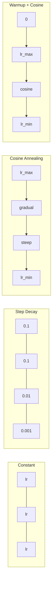
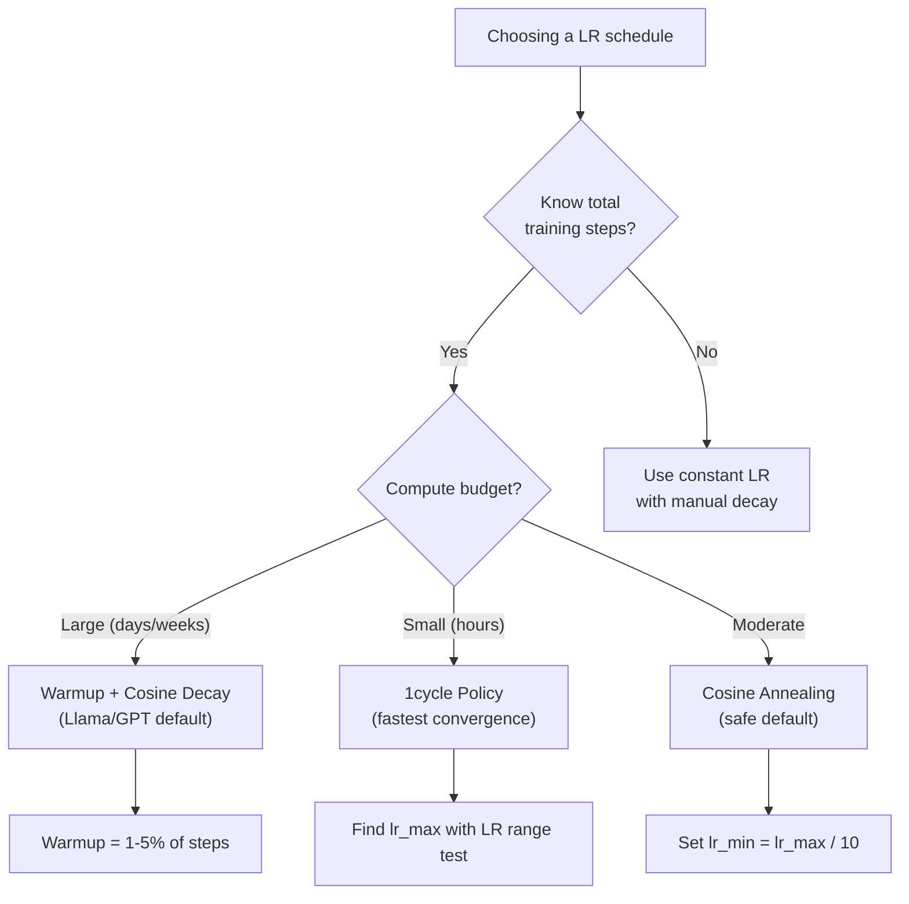
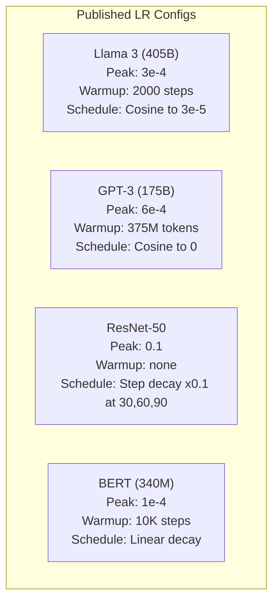

# Learning Rate Schedules 与 Warmup

> learning rate 是唯一最重要的 hyperparameter。不是 architecture。不是 dataset size。不是 activation function。是 learning rate。如果你什么都不调，就调它。

**类型：** 构建
**语言：** Python
**先修：** Lesson 03.06 (Optimizers), Lesson 03.08 (Weight Initialization)
**时间：** 约 90 分钟

## 学习目标

- 从零实现 constant、step decay、cosine annealing、warmup + cosine 和 1cycle learning rate schedules
- 演示 learning rate 选择的三种失败模式：divergence（过高）、stalling（过低）和 oscillation（没有 decay）
- 解释为什么基于 Adam 的 Optimizer 需要 warmup，以及它如何稳定早期训练
- 在同一任务上比较全部五种 schedule 的 convergence speed，并为给定 training budget 选择合适的 schedule

## 问题

把 learning rate 设为 0.1。训练会 diverge -- Loss 在 3 步内跳到无穷大。把它设为 0.0001。训练会慢得爬行 -- 100 个 epochs 后，model 几乎还停留在随机状态。把它设为 0.01。训练在前 50 个 epochs 有效，之后 Loss 会在一个永远到不了的 minimum 附近 oscillate，因为步子太大。

最优的 learning rate 不是常数。它会在训练过程中变化。早期，你希望用大步快速覆盖空间。训练后期，你希望用很小的步子收敛到一个 sharp minimum。一个 90% accuracy 的 model 和一个 95% accuracy 的 model 之间的差异，往往只是 schedule。

过去三年发表的每个主流 model 都使用了 learning rate schedule。Llama 3 使用 peak lr=3e-4，2000 个 warmup steps，并通过 cosine decay 衰减到 3e-5。GPT-3 使用 lr=6e-4，并在 375 million tokens 上进行 warmup。这些不是随意选择。它们是耗资数百万美元的大规模 hyperparameter sweeps 的结果。

你需要理解 schedules，因为默认值并不一定适用于你的问题。当你 fine-tune 一个 pretrained model 时，正确的 schedule 不同于从零训练。当你增加 batch size 时，warmup period 也需要改变。当训练在 step 10,000 崩掉时，你需要知道这是 schedule 问题，还是别的问题。

## 概念

### Constant Learning Rate

最简单的方法。选一个数，每一步都用它。

```
lr(t) = lr_0
```

很少是最优的。它要么对训练末期来说太高（在 minimum 附近 oscillation），要么对训练初期来说太低（在小步上浪费 compute）。对小 model 和 debugging 来说还可以。对任何需要训练超过一小时的任务来说都是糟糕选择。

### Step Decay

来自 ResNet 时代的老派方法。在固定 epochs 处按某个因子（通常是 10x）降低 learning rate。

```
lr(t) = lr_0 * gamma^(floor(epoch / step_size))
```

其中 gamma = 0.1 且 step_size = 30 表示：lr 每 30 个 epochs 降低 10x。ResNet-50 就用了这个 -- lr=0.1，在 epochs 30、60 和 90 时降低 10x。

问题是：最优 decay 点取决于 dataset 和 architecture。换到另一个问题，就需要重新调什么时候降低。转变也很突然 -- 当 rate 突然变化时，Loss 可能会 spike。

### Cosine Annealing

按照 cosine 曲线，从最大学习率平滑 decay 到最小值：

```
lr(t) = lr_min + 0.5 * (lr_max - lr_min) * (1 + cos(pi * t / T))
```

其中 t 是当前 step，T 是总 steps 数。

当 t=0 时，cosine 项为 1，所以 lr = lr_max。当 t=T 时，cosine 项为 -1，所以 lr = lr_min。decay 一开始很平缓，中间加速，接近末尾时再次变得平缓。

这是大多数现代训练运行的默认选择。除了 lr_max 和 lr_min 之外没有需要调的 hyperparameters。cosine 形状符合经验观察：大多数学习发生在训练中段 -- 在这个关键阶段，你希望 step size 合理。

### Warmup：为什么要从小开始

Adam 和其他 adaptive Optimizer 会维护 Gradient mean 和 variance 的 running estimates。在 step 0，这些 estimates 被初始化为零。最初几个 Gradient updates 基于很差的统计量。如果你的 learning rate 在这段时间很大，model 会迈出巨大且方向不佳的步子。

Warmup 可以修复这个问题。先从一个很小的 learning rate 开始（通常是 lr_max / warmup_steps，甚至为零），并在前 N steps 中 linearly ramp up 到 lr_max。当你达到完整 learning rate 时，Adam 的统计量已经稳定。

```
lr(t) = lr_max * (t / warmup_steps)     for t < warmup_steps
```

典型 warmup：总训练 steps 的 1-5%。Llama 3 训练了约 1.8 trillion tokens，并 warmup 了 2000 steps。GPT-3 在 375 million tokens 上进行了 warmup。

### Linear Warmup + Cosine Decay

现代默认方案。先 linear ramp up，然后用 cosine decay：

```
if t < warmup_steps:
    lr(t) = lr_max * (t / warmup_steps)
else:
    progress = (t - warmup_steps) / (total_steps - warmup_steps)
    lr(t) = lr_min + 0.5 * (lr_max - lr_min) * (1 + cos(pi * progress))
```

这就是 Llama、GPT、PaLM 和大多数现代 Transformers 使用的方案。warmup 防止早期不稳定。cosine decay 让 model 收敛到良好的 minimum。

### 1cycle Policy

Leslie Smith 的发现（2018）：在训练前半段把 learning rate 从低值 ramp up 到高值，再在后半段 ramp down。反直觉 -- 为什么要在训练中途 *增加* learning rate？

理论是：高 learning rate 会通过向 optimization trajectory 中加入噪声来起到 regularization 作用。model 在 ramp-up 阶段会探索更多 Loss landscape，从而找到更好的 basins。然后 ramp-down 阶段在找到的最佳 basin 中进行 refine。

```
Phase 1 (0 to T/2):    lr ramps from lr_max/25 to lr_max
Phase 2 (T/2 to T):    lr ramps from lr_max to lr_max/10000
```

在固定 compute budget 下，1cycle 通常比 cosine annealing 训练得更快。代价是：你必须提前知道总 steps 数。

### Schedule 形状



### 决策流程图



### 已发表 Models 中的真实数值



## 构建它

### 步骤 1：Schedule Functions

每个 function 接收当前 step，并返回该 step 的 learning rate。

```python
import math


def constant_schedule(step, lr=0.01, **kwargs):
    return lr


def step_decay_schedule(step, lr=0.1, step_size=100, gamma=0.1, **kwargs):
    return lr * (gamma ** (step // step_size))


def cosine_schedule(step, lr=0.01, total_steps=1000, lr_min=1e-5, **kwargs):
    if step >= total_steps:
        return lr_min
    return lr_min + 0.5 * (lr - lr_min) * (1 + math.cos(math.pi * step / total_steps))


def warmup_cosine_schedule(step, lr=0.01, total_steps=1000, warmup_steps=100, lr_min=1e-5, **kwargs):
    if total_steps <= warmup_steps:
        return lr * (step / max(warmup_steps, 1))
    if step < warmup_steps:
        return lr * step / warmup_steps
    progress = (step - warmup_steps) / (total_steps - warmup_steps)
    return lr_min + 0.5 * (lr - lr_min) * (1 + math.cos(math.pi * progress))


def one_cycle_schedule(step, lr=0.01, total_steps=1000, **kwargs):
    mid = max(total_steps // 2, 1)
    if step < mid:
        return (lr / 25) + (lr - lr / 25) * step / mid
    else:
        progress = (step - mid) / max(total_steps - mid, 1)
        return lr * (1 - progress) + (lr / 10000) * progress
```

### 步骤 2：可视化所有 Schedules

打印一个基于文本的 plot，展示每个 schedule 在训练过程中的变化。

```python
def visualize_schedule(name, schedule_fn, total_steps=500, **kwargs):
    steps = list(range(0, total_steps, total_steps // 20))
    if total_steps - 1 not in steps:
        steps.append(total_steps - 1)

    lrs = [schedule_fn(s, total_steps=total_steps, **kwargs) for s in steps]
    max_lr = max(lrs) if max(lrs) > 0 else 1.0

    print(f"\n{name}:")
    for s, lr_val in zip(steps, lrs):
        bar_len = int(lr_val / max_lr * 40)
        bar = "#" * bar_len
        print(f"  Step {s:4d}: lr={lr_val:.6f} {bar}")
```

### 步骤 3：训练 Network

在 circle dataset 上使用一个简单的 two-layer network，与前几课相同，但这次我们改变 schedule。

```python
import random


def sigmoid(x):
    x = max(-500, min(500, x))
    return 1.0 / (1.0 + math.exp(-x))


def relu(x):
    return max(0.0, x)


def relu_deriv(x):
    return 1.0 if x > 0 else 0.0


def make_circle_data(n=200, seed=42):
    random.seed(seed)
    data = []
    for _ in range(n):
        x = random.uniform(-2, 2)
        y = random.uniform(-2, 2)
        label = 1.0 if x * x + y * y < 1.5 else 0.0
        data.append(([x, y], label))
    return data


def train_with_schedule(schedule_fn, schedule_name, data, epochs=300, base_lr=0.05, **kwargs):
    random.seed(0)
    hidden_size = 8
    total_steps = epochs * len(data)

    std = math.sqrt(2.0 / 2)
    w1 = [[random.gauss(0, std) for _ in range(2)] for _ in range(hidden_size)]
    b1 = [0.0] * hidden_size
    w2 = [random.gauss(0, std) for _ in range(hidden_size)]
    b2 = 0.0

    step = 0
    epoch_losses = []

    for epoch in range(epochs):
        total_loss = 0
        correct = 0

        for x, target in data:
            lr = schedule_fn(step, lr=base_lr, total_steps=total_steps, **kwargs)

            z1 = []
            h = []
            for i in range(hidden_size):
                z = w1[i][0] * x[0] + w1[i][1] * x[1] + b1[i]
                z1.append(z)
                h.append(relu(z))

            z2 = sum(w2[i] * h[i] for i in range(hidden_size)) + b2
            out = sigmoid(z2)

            error = out - target
            d_out = error * out * (1 - out)

            for i in range(hidden_size):
                d_h = d_out * w2[i] * relu_deriv(z1[i])
                w2[i] -= lr * d_out * h[i]
                for j in range(2):
                    w1[i][j] -= lr * d_h * x[j]
                b1[i] -= lr * d_h
            b2 -= lr * d_out

            total_loss += (out - target) ** 2
            if (out >= 0.5) == (target >= 0.5):
                correct += 1
            step += 1

        avg_loss = total_loss / len(data)
        accuracy = correct / len(data) * 100
        epoch_losses.append(avg_loss)

    return epoch_losses
```

### 步骤 4：比较所有 Schedules

用每个 schedule 训练同一个 network，并比较最终 Loss 和 convergence 行为。

```python
def compare_schedules(data):
    configs = [
        ("Constant", constant_schedule, {}),
        ("Step Decay", step_decay_schedule, {"step_size": 15000, "gamma": 0.1}),
        ("Cosine", cosine_schedule, {"lr_min": 1e-5}),
        ("Warmup+Cosine", warmup_cosine_schedule, {"warmup_steps": 3000, "lr_min": 1e-5}),
        ("1cycle", one_cycle_schedule, {}),
    ]

    print(f"\n{'Schedule':<20} {'Start Loss':>12} {'Mid Loss':>12} {'End Loss':>12} {'Best Loss':>12}")
    print("-" * 70)

    for name, schedule_fn, extra_kwargs in configs:
        losses = train_with_schedule(schedule_fn, name, data, epochs=300, base_lr=0.05, **extra_kwargs)
        mid_idx = len(losses) // 2
        best = min(losses)
        print(f"{name:<20} {losses[0]:>12.6f} {losses[mid_idx]:>12.6f} {losses[-1]:>12.6f} {best:>12.6f}")
```

### 步骤 5：LR 过高 vs 过低

演示三种失败模式：过高（divergence）、过低（爬行）和刚刚好。

```python
def lr_sensitivity(data):
    learning_rates = [1.0, 0.1, 0.01, 0.001, 0.0001]

    print("\nLR Sensitivity (constant schedule, 100 epochs):")
    print(f"  {'LR':>10} {'Start Loss':>12} {'End Loss':>12} {'Status':>15}")
    print("  " + "-" * 52)

    for lr in learning_rates:
        losses = train_with_schedule(constant_schedule, f"lr={lr}", data, epochs=100, base_lr=lr)
        start = losses[0]
        end = losses[-1]

        if end > start or math.isnan(end) or end > 1.0:
            status = "DIVERGED"
        elif end > start * 0.9:
            status = "BARELY MOVED"
        elif end < 0.15:
            status = "CONVERGED"
        else:
            status = "LEARNING"

        end_str = f"{end:.6f}" if not math.isnan(end) else "NaN"
        print(f"  {lr:>10.4f} {start:>12.6f} {end_str:>12} {status:>15}")
```

## 使用它

PyTorch 在 `torch.optim.lr_scheduler` 中提供了 schedulers：

```python
import torch
import torch.optim as optim
from torch.optim.lr_scheduler import CosineAnnealingLR, OneCycleLR, StepLR

model = nn.Sequential(nn.Linear(10, 64), nn.ReLU(), nn.Linear(64, 1))
optimizer = optim.Adam(model.parameters(), lr=3e-4)

scheduler = CosineAnnealingLR(optimizer, T_max=1000, eta_min=1e-5)

for step in range(1000):
    loss = train_step(model, optimizer)
    scheduler.step()
```

对于 warmup + cosine，使用 lambda scheduler，或者使用 HuggingFace 的 `get_cosine_schedule_with_warmup`：

```python
from transformers import get_cosine_schedule_with_warmup

scheduler = get_cosine_schedule_with_warmup(
    optimizer,
    num_warmup_steps=2000,
    num_training_steps=100000,
)
```

HuggingFace function 是大多数 Llama 和 GPT fine-tuning scripts 使用的方案。拿不准时，使用 warmup + cosine，并将 warmup 设为总 steps 的 3-5%。它几乎适用于所有情况。

## 交付它

本课会产出：
- `outputs/prompt-lr-schedule-advisor.md` -- 一个 prompt，用于根据你的训练设置推荐合适的 learning rate schedule 和 hyperparameters

## 练习

1. 实现 exponential decay：lr(t) = lr_0 * gamma^t，其中 gamma = 0.999。在 circle dataset 上与 cosine annealing 比较。

2. 实现 learning rate range test（Leslie Smith）：训练几百步，同时将 LR 从 1e-7 指数增加到 1。绘制 Loss vs LR。最优 max LR 位于 Loss 开始增加之前。

3. 使用 warmup + cosine 训练，但改变 warmup 长度：总 steps 的 0%、1%、5%、10%、20%。找到训练最稳定的 sweet spot。

4. 实现带 warm restarts 的 cosine annealing（SGDR）：每 T steps 将 learning rate 重置为 lr_max，然后再次 decay。在更长的训练运行中与标准 cosine 比较。

5. 构建一个“schedule surgeon”，监控训练 Loss，并在 Loss 稳定时自动从 warmup 切换到 cosine；如果 Loss plateau 太久，则降低 lr。

## 关键术语

| Term | 人们通常怎么说 | 它真正的含义 |
|------|----------------|----------------------|
| Learning rate | “model 学得有多快” | 用来乘以 Gradient、决定参数更新大小的标量 |
| Schedule | “随时间改变 LR” | 将 training step 映射到 learning rate 的 function，旨在优化 convergence |
| Warmup | “从小 LR 开始” | 在最初 N steps 中，将 LR 从接近零 linearly ramp 到目标值，以稳定 Optimizer 统计量 |
| Cosine annealing | “平滑 LR decay” | 在训练过程中，让 LR 按 cosine 曲线从 lr_max 降低到 lr_min |
| Step decay | “在 milestones 降低 LR” | 在固定 epoch intervals，将 LR 乘以一个因子（通常是 0.1） |
| 1cycle policy | “先上后下” | Leslie Smith 的方法：在单个 cycle 中将 LR 先 ramp up 再 ramp down，以获得更快 convergence |
| LR range test | “找到最佳 learning rate” | 在短时间训练中逐步增加 LR，以找到 Loss 开始 diverge 的数值 |
| Cosine with warm restarts | “重置并重复” | 周期性地将 LR 重置为 lr_max，并再次 decay（SGDR） |
| Eta min | “LR 的下限” | schedule 最终 decay 到的最小 learning rate |
| Peak learning rate | “最大 LR” | 训练过程中达到的最高 LR，通常出现在 warmup 之后 |

## 延伸阅读

- Loshchilov & Hutter, "SGDR: Stochastic Gradient Descent with Warm Restarts" (2017) -- 引入了 cosine annealing 和 warm restarts
- Smith, "Super-Convergence: Very Fast Training of Neural Networks Using Large Learning Rates" (2018) -- 1cycle policy 论文
- Touvron et al., "Llama 2: Open Foundation and Fine-Tuned Chat Models" (2023) -- 记录了大规模使用的 warmup + cosine schedule
- Goyal et al., "Accurate, Large Minibatch SGD: Training ImageNet in 1 Hour" (2017) -- large batch training 的 linear scaling rule 和 warmup
