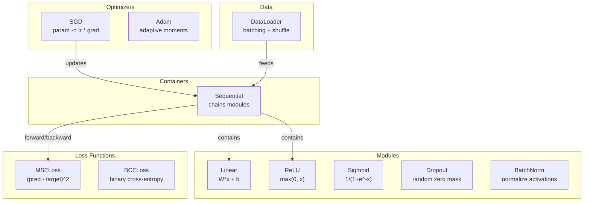
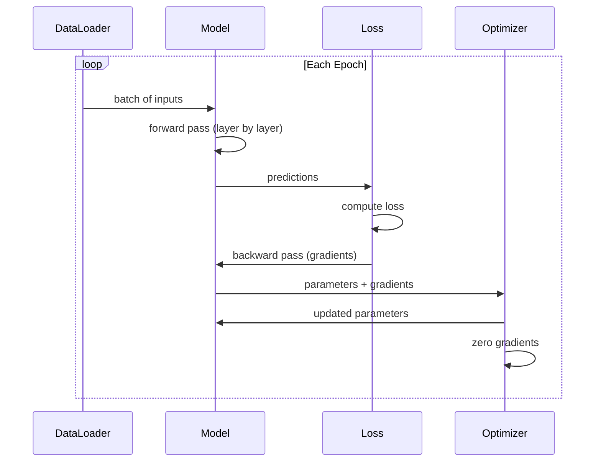
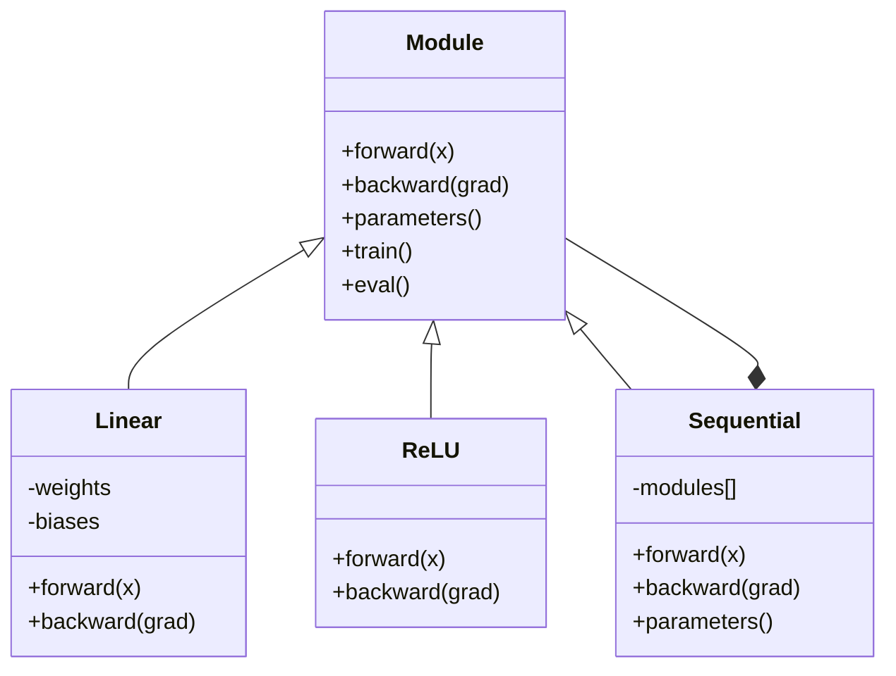

# 构建你自己的 Mini Framework

> 你已经构建过 neurons、layers、networks、backprop、activations、Loss Function、Optimizers、regularization、initialization 和 LR schedules。它们都是分散的独立部件。现在把它们连接成一个 framework。不是 PyTorch。不是 TensorFlow。是你自己的。

**类型:** 构建
**语言:** Python
**前置知识:** Phase 03 全部内容（Lessons 01-09）
**时间:** ~120 分钟

## 学习目标

- 构建一个完整的 Deep Learning framework（约 500 行），包含 Module、Linear、ReLU、Sigmoid、Dropout、BatchNorm、Sequential、Loss Functions、Optimizers 和 DataLoader
- 解释 Module abstraction（forward、backward、parameters），以及为什么必须切换 train/eval mode
- 将所有组件连接成一个可工作的 training loop，用于在 circle classification 上训练一个 4-layer network
- 将你的 framework 中的每个组件映射到对应的 PyTorch 等价物（nn.Module、nn.Sequential、optim.Adam、DataLoader）

## 问题

你已经在十节课里构建了分散在不同文件中的 building blocks。这里有一个 `Value` class，那里有一个 training loop，另一个文件里有 weight initialization，还有一个文件里有 learning rate schedules。为了训练一个 network，你需要从五节不同课程中复制粘贴代码，然后手动把它们连接起来。

这正是 frameworks 要解决的问题。PyTorch 提供 `nn.Module`、`nn.Sequential`、`optim.Adam`、`DataLoader`，以及把它们组合起来的 training loop pattern。TensorFlow 提供 `keras.Layer`、`keras.Sequential`、`keras.optimizers.Adam`。这些都不是魔法。它们是组织模式，使你能够定义、训练和评估 networks，而不用每次都重新发明底层连接逻辑。

你将用约 500 行 Python 构建同样的东西。不用 numpy。不用外部依赖。这个 framework 可以定义任意 feedforward network，用 SGD 或 Adam 训练，对 data 做 batching，应用 dropout 和 batch normalization，使用任意 activation，并调度 learning rate。

完成后，你会准确理解在 PyTorch 中写下 `model = nn.Sequential(...)` 时发生了什么。你会理解为什么存在 `model.train()` 和 `model.eval()`。你会理解为什么 `optimizer.zero_grad()` 是一个单独的调用。你会理解所有这些，因为它们都是你亲手构建的。

## 核心概念

### Module Abstraction

PyTorch 中的每个 layer 都继承自 `nn.Module`。一个 Module 有三个职责：

1. **forward()** -- 给定输入，计算输出
2. **parameters()** -- 返回所有可训练 weights
3. **backward()** -- 计算 gradients（在 PyTorch 中由 autograd 处理，在我们的 framework 中显式实现）

Linear layer 是一个 Module。ReLU activation 是一个 Module。dropout layer 是一个 Module。batch normalization layer 也是一个 Module。它们都有相同的 interface。

### Sequential Container

`nn.Sequential` 会串联 Modules。Forward pass：让 data 依次通过 Module 1、Module 2、Module 3。Backward pass：反向遍历这条链。container 本身也是一个 Module -- 它有 forward()、parameters() 和 backward()。这就是 composite pattern：一串 Modules 本身也是一个 Module。

### 训练 vs Evaluation 模式

Dropout 在训练时随机将 neurons 置零，但在 evaluation 时让所有值通过。Batch normalization 在训练时使用 batch statistics，但在 evaluation 时使用 running averages。`train()` 和 `eval()` methods 用来切换这种行为。每个 Module 都有一个 `training` flag。

### Optimizer

Optimizer 使用 parameters 的 gradients 来更新它们。SGD：`param -= lr * grad`。Adam：维护 momentum 和 variance estimates，然后进行更新。Optimizer 不需要知道 network architecture -- 它只看到一份扁平的 parameters 列表及其 gradients。

### DataLoader

Batching 很重要，有两个原因。第一，对于大型问题，你无法把整个 dataset 都放进内存。第二，mini-batch Gradient Descent 提供了噪声，有助于逃离 local minima。DataLoader 将 data 切分成 batches，并可选择在 epochs 之间 shuffle。

### Framework Architecture



### Training Loop



### Module Hierarchy




```figure
gradient-clipping
```

## 构建它

### 步骤 1： Module Base Class

每个 layer 都要实现的抽象 interface。

```python
class Module:
    def __init__(self):
        self.training = True

    def forward(self, x):
        raise NotImplementedError

    def backward(self, grad):
        raise NotImplementedError

    def parameters(self):
        return []

    def train(self):
        self.training = True

    def eval(self):
        self.training = False
```

### 步骤 2： Linear Layer

最基本的 building block。存储 weights 和 biases，forward 时计算 Wx + b，backward 时计算 weight/input gradients。

```python
import math
import random


class Linear(Module):
    def __init__(self, fan_in, fan_out):
        super().__init__()
        std = math.sqrt(2.0 / fan_in)
        self.weights = [[random.gauss(0, std) for _ in range(fan_in)] for _ in range(fan_out)]
        self.biases = [0.0] * fan_out
        self.weight_grads = [[0.0] * fan_in for _ in range(fan_out)]
        self.bias_grads = [0.0] * fan_out
        self.fan_in = fan_in
        self.fan_out = fan_out
        self.input = None

    def forward(self, x):
        self.input = x
        output = []
        for i in range(self.fan_out):
            val = self.biases[i]
            for j in range(self.fan_in):
                val += self.weights[i][j] * x[j]
            output.append(val)
        return output

    def backward(self, grad):
        input_grad = [0.0] * self.fan_in
        for i in range(self.fan_out):
            self.bias_grads[i] += grad[i]
            for j in range(self.fan_in):
                self.weight_grads[i][j] += grad[i] * self.input[j]
                input_grad[j] += grad[i] * self.weights[i][j]
        return input_grad

    def parameters(self):
        params = []
        for i in range(self.fan_out):
            for j in range(self.fan_in):
                params.append((self.weights, i, j, self.weight_grads))
            params.append((self.biases, i, None, self.bias_grads))
        return params
```

### 步骤 3：Activation Modules

将 ReLU、Sigmoid 和 Tanh 实现为 Modules。每个都会缓存 backward pass 所需的内容。

```python
class ReLU(Module):
    def __init__(self):
        super().__init__()
        self.mask = None

    def forward(self, x):
        self.mask = [1.0 if v > 0 else 0.0 for v in x]
        return [max(0.0, v) for v in x]

    def backward(self, grad):
        return [g * m for g, m in zip(grad, self.mask)]


class Sigmoid(Module):
    def __init__(self):
        super().__init__()
        self.output = None

    def forward(self, x):
        self.output = []
        for v in x:
            v = max(-500, min(500, v))
            self.output.append(1.0 / (1.0 + math.exp(-v)))
        return self.output

    def backward(self, grad):
        return [g * o * (1 - o) for g, o in zip(grad, self.output)]


class Tanh(Module):
    def __init__(self):
        super().__init__()
        self.output = None

    def forward(self, x):
        self.output = [math.tanh(v) for v in x]
        return self.output

    def backward(self, grad):
        return [g * (1 - o * o) for g, o in zip(grad, self.output)]
```

### 步骤 4： Dropout Module

训练时随机将元素置零。将保留下来的元素按 1/(1-p) 缩放，使期望值保持不变。在 eval 时不做任何处理。

```python
class Dropout(Module):
    def __init__(self, p=0.5):
        super().__init__()
        self.p = p
        self.mask = None

    def forward(self, x):
        if not self.training:
            return x
        self.mask = [0.0 if random.random() < self.p else 1.0 / (1 - self.p) for _ in x]
        return [v * m for v, m in zip(x, self.mask)]

    def backward(self, grad):
        if self.mask is None:
            return grad
        return [g * m for g, m in zip(grad, self.mask)]
```

### 步骤 5： BatchNorm Module

按 feature 在 batch 维度上将 activations 归一化为 zero mean 和 unit variance。为 eval mode 维护 running statistics。

```python
class BatchNorm(Module):
    def __init__(self, size, momentum=0.1, eps=1e-5):
        super().__init__()
        self.size = size
        self.gamma = [1.0] * size
        self.beta = [0.0] * size
        self.gamma_grads = [0.0] * size
        self.beta_grads = [0.0] * size
        self.running_mean = [0.0] * size
        self.running_var = [1.0] * size
        self.momentum = momentum
        self.eps = eps
        self.x_norm = None
        self.std_inv = None
        self.batch_input = None

    def forward_batch(self, batch):
        batch_size = len(batch)
        output_batch = []

        if self.training:
            mean = [0.0] * self.size
            for sample in batch:
                for j in range(self.size):
                    mean[j] += sample[j]
            mean = [m / batch_size for m in mean]

            var = [0.0] * self.size
            for sample in batch:
                for j in range(self.size):
                    var[j] += (sample[j] - mean[j]) ** 2
            var = [v / batch_size for v in var]

            self.std_inv = [1.0 / math.sqrt(v + self.eps) for v in var]

            self.x_norm = []
            self.batch_input = batch
            for sample in batch:
                normed = [(sample[j] - mean[j]) * self.std_inv[j] for j in range(self.size)]
                self.x_norm.append(normed)
                output = [self.gamma[j] * normed[j] + self.beta[j] for j in range(self.size)]
                output_batch.append(output)

            for j in range(self.size):
                self.running_mean[j] = (1 - self.momentum) * self.running_mean[j] + self.momentum * mean[j]
                self.running_var[j] = (1 - self.momentum) * self.running_var[j] + self.momentum * var[j]
        else:
            std_inv = [1.0 / math.sqrt(v + self.eps) for v in self.running_var]
            for sample in batch:
                normed = [(sample[j] - self.running_mean[j]) * std_inv[j] for j in range(self.size)]
                output = [self.gamma[j] * normed[j] + self.beta[j] for j in range(self.size)]
                output_batch.append(output)

        return output_batch

    def forward(self, x):
        result = self.forward_batch([x])
        return result[0]

    def backward(self, grad):
        if self.x_norm is None:
            return grad
        for j in range(self.size):
            self.gamma_grads[j] += self.x_norm[0][j] * grad[j]
            self.beta_grads[j] += grad[j]
        return [grad[j] * self.gamma[j] * self.std_inv[j] for j in range(self.size)]

    def parameters(self):
        params = []
        for j in range(self.size):
            params.append((self.gamma, j, None, self.gamma_grads))
            params.append((self.beta, j, None, self.beta_grads))
        return params
```

### 步骤 6：Sequential Container

串联 modules。Forward 从左到右，backward 从右到左。

```python
class Sequential(Module):
    def __init__(self, *modules):
        super().__init__()
        self.modules = list(modules)

    def forward(self, x):
        for module in self.modules:
            x = module.forward(x)
        return x

    def backward(self, grad):
        for module in reversed(self.modules):
            grad = module.backward(grad)
        return grad

    def parameters(self):
        params = []
        for module in self.modules:
            params.extend(module.parameters())
        return params

    def train(self):
        self.training = True
        for module in self.modules:
            module.train()

    def eval(self):
        self.training = False
        for module in self.modules:
            module.eval()
```

### 步骤 7： Loss Functions

MSE 和 Binary Cross-Entropy。每个都会返回 loss value，并提供一个 backward() 来返回 Gradient。

```python
class MSELoss:
    def __call__(self, predicted, target):
        self.predicted = predicted
        self.target = target
        n = len(predicted)
        self.loss = sum((p - t) ** 2 for p, t in zip(predicted, target)) / n
        return self.loss

    def backward(self):
        n = len(self.predicted)
        return [2 * (p - t) / n for p, t in zip(self.predicted, self.target)]


class BCELoss:
    def __call__(self, predicted, target):
        self.predicted = predicted
        self.target = target
        eps = 1e-7
        n = len(predicted)
        self.loss = 0
        for p, t in zip(predicted, target):
            p = max(eps, min(1 - eps, p))
            self.loss += -(t * math.log(p) + (1 - t) * math.log(1 - p))
        self.loss /= n
        return self.loss

    def backward(self):
        eps = 1e-7
        n = len(self.predicted)
        grads = []
        for p, t in zip(self.predicted, self.target):
            p = max(eps, min(1 - eps, p))
            grads.append((-t / p + (1 - t) / (1 - p)) / n)
        return grads
```

### 步骤 8: SGD 和 Adam Optimizers

两者都接收 parameter list，并使用 gradients 更新 weights。

```python
class SGD:
    def __init__(self, parameters, lr=0.01):
        self.params = parameters
        self.lr = lr

    def step(self):
        for container, i, j, grad_container in self.params:
            if j is not None:
                container[i][j] -= self.lr * grad_container[i][j]
            else:
                container[i] -= self.lr * grad_container[i]

    def zero_grad(self):
        for container, i, j, grad_container in self.params:
            if j is not None:
                grad_container[i][j] = 0.0
            else:
                grad_container[i] = 0.0


class Adam:
    def __init__(self, parameters, lr=0.001, beta1=0.9, beta2=0.999, eps=1e-8):
        self.params = parameters
        self.lr = lr
        self.beta1 = beta1
        self.beta2 = beta2
        self.eps = eps
        self.t = 0
        self.m = [0.0] * len(parameters)
        self.v = [0.0] * len(parameters)

    def step(self):
        self.t += 1
        for idx, (container, i, j, grad_container) in enumerate(self.params):
            if j is not None:
                g = grad_container[i][j]
            else:
                g = grad_container[i]

            self.m[idx] = self.beta1 * self.m[idx] + (1 - self.beta1) * g
            self.v[idx] = self.beta2 * self.v[idx] + (1 - self.beta2) * g * g

            m_hat = self.m[idx] / (1 - self.beta1 ** self.t)
            v_hat = self.v[idx] / (1 - self.beta2 ** self.t)

            update = self.lr * m_hat / (math.sqrt(v_hat) + self.eps)

            if j is not None:
                container[i][j] -= update
            else:
                container[i] -= update

    def zero_grad(self):
        for container, i, j, grad_container in self.params:
            if j is not None:
                grad_container[i][j] = 0.0
            else:
                grad_container[i] = 0.0
```

### 步骤 9： DataLoader

将 data 切分成 batches，并可选择在每个 epoch 中 shuffle。

```python
class DataLoader:
    def __init__(self, data, batch_size=32, shuffle=True):
        self.data = data
        self.batch_size = batch_size
        self.shuffle = shuffle

    def __iter__(self):
        indices = list(range(len(self.data)))
        if self.shuffle:
            random.shuffle(indices)
        for start in range(0, len(indices), self.batch_size):
            batch_indices = indices[start:start + self.batch_size]
            batch = [self.data[i] for i in batch_indices]
            inputs = [item[0] for item in batch]
            targets = [item[1] for item in batch]
            yield inputs, targets

    def __len__(self):
        return (len(self.data) + self.batch_size - 1) // self.batch_size
```

### 第 10 步：在 Circle Classification 上训练 4-Layer Network

把所有东西连接起来。定义 model，选择 Loss Function，选择 Optimizer，运行 training loop。

```python
def make_circle_data(n=500, seed=42):
    random.seed(seed)
    data = []
    for _ in range(n):
        x = random.uniform(-2, 2)
        y = random.uniform(-2, 2)
        label = 1.0 if x * x + y * y < 1.5 else 0.0
        data.append(([x, y], [label]))
    return data


def train():
    random.seed(42)

    model = Sequential(
        Linear(2, 16),
        ReLU(),
        Linear(16, 16),
        ReLU(),
        Linear(16, 8),
        ReLU(),
        Linear(8, 1),
        Sigmoid(),
    )

    criterion = BCELoss()
    optimizer = Adam(model.parameters(), lr=0.01)

    data = make_circle_data(500)
    split = int(len(data) * 0.8)
    train_data = data[:split]
    test_data = data[split:]

    loader = DataLoader(train_data, batch_size=16, shuffle=True)

    model.train()

    for epoch in range(100):
        total_loss = 0
        total_correct = 0
        total_samples = 0

        for batch_inputs, batch_targets in loader:
            batch_loss = 0
            for x, t in zip(batch_inputs, batch_targets):
                pred = model.forward(x)
                loss = criterion(pred, t)
                batch_loss += loss

                optimizer.zero_grad()
                grad = criterion.backward()
                model.backward(grad)
                optimizer.step()

                predicted_class = 1.0 if pred[0] >= 0.5 else 0.0
                if predicted_class == t[0]:
                    total_correct += 1
                total_samples += 1

            total_loss += batch_loss

        avg_loss = total_loss / total_samples
        accuracy = total_correct / total_samples * 100

        if epoch % 10 == 0 or epoch == 99:
            print(f"Epoch {epoch:3d} | Loss: {avg_loss:.6f} | Train Accuracy: {accuracy:.1f}%")

    model.eval()
    correct = 0
    for x, t in test_data:
        pred = model.forward(x)
        predicted_class = 1.0 if pred[0] >= 0.5 else 0.0
        if predicted_class == t[0]:
            correct += 1
    test_accuracy = correct / len(test_data) * 100
    print(f"\nTest Accuracy: {test_accuracy:.1f}% ({correct}/{len(test_data)})")

    return model, test_accuracy
```

## 使用它

下面是你刚刚构建内容的 PyTorch 等价版本：

```python
import torch
import torch.nn as nn
from torch.utils.data import DataLoader, TensorDataset

model = nn.Sequential(
    nn.Linear(2, 16),
    nn.ReLU(),
    nn.Linear(16, 16),
    nn.ReLU(),
    nn.Linear(16, 8),
    nn.ReLU(),
    nn.Linear(8, 1),
    nn.Sigmoid(),
)

criterion = nn.BCELoss()
optimizer = torch.optim.Adam(model.parameters(), lr=0.01)

for epoch in range(100):
    model.train()
    for inputs, targets in dataloader:
        optimizer.zero_grad()
        predictions = model(inputs)
        loss = criterion(predictions, targets)
        loss.backward()
        optimizer.step()

    model.eval()
    with torch.no_grad():
        test_predictions = model(test_inputs)
```

结构是完全一致的。`Sequential`、`Linear`、`ReLU`、`Sigmoid`、`BCELoss`、`Adam`、`zero_grad`、`backward`、`step`、`train`、`eval`。每个概念都是一一对应的。区别在于 PyTorch 会自动处理 autograd（不需要在每个 module 中实现 backward()），可以在 GPU 上运行，并且经过多年优化。但骨架是一样的。

现在，当你看到 PyTorch code 时，你确切知道每一行都在发生什么。这种理解就是本课的全部意义。

## 交付内容

本课会产出：
- `outputs/prompt-framework-architect.md` -- 一个用于基于 framework abstractions 设计 Neural Network architectures 的 prompt

## 练习

1. 为 multi-class classification 添加一个 `SoftmaxCrossEntropyLoss` class。对 predictions 做 softmax，计算 cross-entropy Loss，并处理组合后的 backward pass。在一个 3-class spiral dataset 上测试它。

2. 在 Optimizer 中实现 learning rate scheduling：添加一个 `set_lr()` method，并接入 Lesson 09 中的 cosine schedule。使用 warmup + cosine 训练 circle classifier，并与 constant LR 对比。

3. 为 Sequential 添加 `save()` 和 `load()` method，将所有 weights 序列化到 JSON 文件，并重新加载。验证加载后的 model 与原始 model 产生相同的 predictions。

4. 在 Adam Optimizer 中实现 weight decay（L2 regularization）。添加一个 `weight_decay` parameter，使 weights 在每一步都向零收缩。比较 decay=0 与 decay=0.01 的训练结果。

5. 用真正的 mini-batch Gradient accumulation 替换 per-sample training loop：在一个 batch 的所有 samples 上累积 gradients，然后除以 batch size，再执行一次 Optimizer step。测量这是否会改变收敛速度。

## 关键术语

| Term | 人们通常怎么说 | 它真正的含义 |
|------|----------------|----------------------|
| Module | “一个 layer” | framework 中的基础 abstraction -- 任何具有 forward()、backward() 和 parameters() 的东西 |
| Sequential | “按顺序堆叠 layers” | 一个串联 modules 的 container，在 forward 时按顺序应用，在 backward 时反向应用 |
| Forward pass | “运行 network” | 按顺序让 input 通过每个 module 来计算 output |
| Backward pass | “计算 gradients” | 将 Loss Gradient Backpropagation通过每个 module，以计算 parameter gradients |
| Parameters | “可训练 weights” | network 中 Optimizer 可以更新的所有值 -- weights 和 biases |
| Optimizer | “更新 weights 的东西” | 一种使用 gradients 更新 parameters 的算法，实现 SGD、Adam 或其他规则 |
| DataLoader | “喂 data 的东西” | 一个 iterator，将 dataset 切分为 batches，并可选择在 epochs 之间 shuffle |
| Training mode | “model.train()” | 一个启用 stochastic 行为的 flag，例如 dropout，以及使用 batch stats 的 batch normalization |
| Evaluation mode | “model.eval()” | 一个禁用 dropout 并让 batch normalization 使用 running statistics 的 flag |
| Zero grad | “清空 gradients” | 在计算下一个 batch 的 gradients 之前，将所有 parameter gradients 重置为零 |

## 延伸阅读

- Paszke et al., "PyTorch: An Imperative Style, High-Performance Deep Learning Library" (2019) -- 描述 PyTorch 设计决策的论文
- Chollet, "Deep Learning with Python, Second Edition" (2021) -- Chapter 3 介绍 Keras internals，使用相同的 module/layer abstraction
- Johnson, "Tiny-DNN" (https://github.com/tiny-dnn/tiny-dnn) -- 一个 header-only C++ Deep Learning framework，用于理解 framework internals
