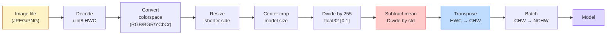
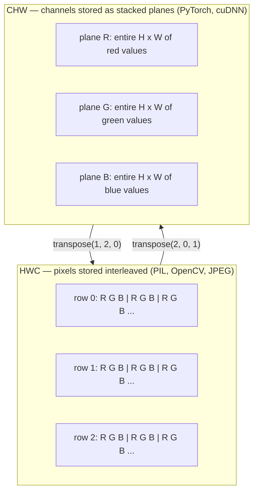

# 图像基础 — Pixel、Channel、Color Spaces

> 图像是光采样的 Tensor。你以后会使用的每一个 vision model，都从这个事实开始。

**类型：** Build
**语言：** Python
**前置要求：** Phase 1 Lesson 12 (Tensor Operations), Phase 3 Lesson 11 (Intro to PyTorch)
**时间：** 约 45 分钟

## 学习目标

- 解释连续场景如何被离散化为 Pixel，以及采样和量化决策为什么会决定每个下游模型的上限
- 将图像作为 NumPy array 读取、切片和检查，并熟练在 HWC 与 CHW layout 之间切换
- 在 RGB、grayscale、HSV 和 YCbCr 之间转换，并说明每种 color space 存在的原因
- 严格按照 torchvision 的预期应用 Pixel 级预处理（normalize、standardize、resize、channel-first）

## 问题

你会阅读的每篇论文、下载的每个 pretrained weight、调用的每个 vision API，都假定输入具有特定 encoding。把 `uint8` 图像传给期望 `float32` 的模型，它仍然会运行，并且悄悄产出无意义结果。把 BGR 喂给在 RGB 上训练的 network，accuracy 会下降十个百分点。当模型期望 channels-first，而你给它 channels-last input 时，第一个 conv layer 会把高度当作 feature channel。这些都不会抛出错误。它只会毁掉你的 metrics，然后你花一周去找一个其实藏在文件加载方式里的 bug。

一旦你知道 convolution 在什么上面滑动，它本身并不复杂。难点在于，“一张图像”对 camera、JPEG decoder、PIL、OpenCV、torchvision 和 CUDA kernel 来说含义不同。每个 stack 都有自己的 axis order、byte range 和 channel convention。无法把这些理清的 vision engineer 会交付坏掉的 pipeline。

本课会修正这个基础，让本阶段后续内容能建立在它之上。到最后，你会知道什么是 Pixel，为什么每个 Pixel 有三个数字而不是一个，“normalize with ImageNet stats” 实际在做什么，以及如何在本阶段其他每节课都会默认使用的两三种 layout 之间移动。

## 概念

### 完整预处理 pipeline 一览

每个生产级 vision system 都是同一串可逆 transform。任何一步出错，模型看到的输入就会不同于训练时的输入。



红色和蓝色两个框是 80% 静默失败发生的地方：缺少 standardization，以及 layout 错误。

### Pixel 是 sample，不是正方形

Camera sensor 会统计落在微小 detector 网格上的 photon。每个 detector 在一小段时间内积分光线，并输出一个与击中它的 photon 数量成比例的 voltage。然后 sensor 将该 voltage 离散化为一个整数。一个 detector 就成为一个 Pixel。

```
Continuous scene                 Sensor grid                     Digital image
(infinite detail)                (H x W detectors)               (H x W integers)

    ~~~~~                        +--+--+--+--+--+                 210 198 180 155 120
   ~   ~   ~                     |  |  |  |  |  |                 205 195 178 152 118
  ~ light ~      ---->           +--+--+--+--+--+     ---->       200 190 175 150 115
   ~~~~~                         |  |  |  |  |  |                 195 185 170 148 112
                                 +--+--+--+--+--+                 188 180 165 145 108
```

这一步会发生两个选择，它们决定了所有下游任务的上限：

- **Spatial sampling** 决定场景中每一度对应多少个 detector。太少，边缘会变成锯齿状（aliasing）。太多，storage 和 compute 会爆炸。
- **Intensity quantization** 决定 voltage 被分桶得多细。8 bits 提供 256 个 level，是 display 的标准。10、12、16 bits 提供更平滑的 Gradient，对 medical imaging、HDR 和 raw sensor pipeline 很重要。

Pixel 不是带面积的彩色小方块。它是一次单独测量。resize 或 rotate 时，你是在重新采样这个 measurement grid。

### 为什么有三个 Channel

一个 detector 会统计整个可见光谱范围内的 photon，那就是 grayscale。为了获得颜色，sensor 会用红、绿、蓝 filter mosaic 覆盖网格。经过 demosaicing 后，每个 spatial location 都有三个整数：附近红色 filter detector、绿色 filter detector 和蓝色 filter detector 的响应。这三个整数就是一个 Pixel 的 RGB triplet。

```
One pixel in memory:

    (R, G, B) = (210, 140, 30)   <- reddish-orange

An H x W RGB image:

    shape (H, W, 3)     stored as   H rows of W pixels of 3 values
                                    each in [0, 255] for uint8
```

三并不神奇。Depth camera 会添加 Z channel。Satellite 会添加 infrared 和 ultraviolet band。Medical scan 通常有一个 channel（X-ray、CT）或很多 channel（hyperspectral）。Channel 的数量是最后一个 axis；conv layer 会学习跨 channel 混合。

### 两种 layout convention：HWC 和 CHW

同一个 Tensor，两种排序。每个库都会选择其中一种。

```
HWC (height, width, channels)           CHW (channels, height, width)

   W ->                                    H ->
  +-----+-----+-----+                     +-----+-----+
H |R G B|R G B|R G B|                   C |R R R R R R|
| +-----+-----+-----+                   | +-----+-----+
v |R G B|R G B|R G B|                   v |G G G G G G|
  +-----+-----+-----+                     +-----+-----+
                                          |B B B B B B|
                                          +-----+-----+

   PIL, OpenCV, matplotlib,              PyTorch, most deep learning
   almost every image file on disk       frameworks, cuDNN kernels
```

CHW 存在的原因是 convolution kernel 会沿 H 和 W 滑动。把 channel axis 放在前面，意味着每个 kernel 都能看到每个 channel 上连续的 2D plane，从而干净地 Vector 化。Disk format 保持 HWC，因为这匹配 sensor 输出 scanline 的方式。

你会输入上千次的一行转换：

```
img_chw = img_hwc.transpose(2, 0, 1)      # NumPy
img_chw = img_hwc.permute(2, 0, 1)        # PyTorch tensor
```

Memory layout 可视化：



### Byte range 和 dtype

三种 convention 最常见：

| Convention | dtype | Range | 你会在哪里见到它 |
|------------|-------|-------|------------------|
| Raw | `uint8` | [0, 255] | Disk 上的文件、PIL、OpenCV output |
| Normalized | `float32` | [0.0, 1.0] | `img.astype('float32') / 255` 之后 |
| Standardized | `float32` | 大约 [-2, +2] | 减去 mean 并除以 std 之后 |

Convolutional network 是在 standardized input 上训练的。ImageNet stats `mean=[0.485, 0.456, 0.406]`、`std=[0.229, 0.224, 0.225]` 是在完整 ImageNet training set 上，对 [0, 1] normalized Pixel 计算得到的三个 channel 的 arithmetic mean 和 standard deviation。把 raw `uint8` 输入喂给期望 standardized float 的模型，是应用 vision 中最常见的静默失败。

### Color spaces 以及它们为什么存在

RGB 是 capture format，但它并不总是对模型最有用的表示。

```
 RGB               HSV                       YCbCr / YUV

 R red             H hue (angle 0-360)       Y luminance (brightness)
 G green           S saturation (0-1)        Cb chroma blue-yellow
 B blue            V value/brightness (0-1)  Cr chroma red-green

 Linear to         Separates color from      Separates brightness from
 sensor output     brightness. Useful for    color. JPEG and most video
                   color thresholding, UI    codecs compress the chroma
                   sliders, simple filters   channels harder because the
                                             human eye is less sensitive
                                             to chroma detail than to Y.
```

对大多数现代 CNN，你会喂入 RGB。你会在这些场景遇到其他 space：

- **HSV** — classical CV code、基于颜色的 segmentation、white-balancing。
- **YCbCr** — 读取 JPEG 内部、video pipeline、只在 Y 上操作的 super-resolution model。
- **Grayscale** — OCR、document model，以及任何 color 是 nuisance variable 而不是 signal 的情况。

从 RGB 转 grayscale 是加权和，不是平均值，因为人眼对绿色比对红色或蓝色更敏感：

```
Y = 0.299 R + 0.587 G + 0.114 B       (ITU-R BT.601, the classic weights)
```

### Aspect ratio、resizing 和 interpolation

每个模型都有固定 input size（大多数 ImageNet classifier 是 224x224，现代 detector 常用 384x384 或 512x512）。你的图像很少正好匹配。重要的 resize 选择有三种：

- **Resize shorter side, then center crop** — 标准 ImageNet recipe。保留 aspect ratio，丢弃一条边缘 Pixel。
- **Resize and pad** — 保留 aspect ratio 和每个 Pixel，添加黑边。Detection 和 OCR 的标准做法。
- **Resize directly to target** — 拉伸图像。便宜，会扭曲 geometry，但对许多 classification task 足够好。

当新网格与旧网格不对齐时，interpolation method 决定中间 Pixel 如何计算：

```
Nearest neighbour     fastest, blocky, only choice for masks/labels
Bilinear              fast, smooth, default for most image resizing
Bicubic               slower, sharper on upscaling
Lanczos               slowest, best quality, used for final display
```

经验法则：training 用 bilinear，你会亲眼看的 asset 用 bicubic 或 lanczos，任何包含整数 class ID 的东西用 nearest。


```figure
conv-output-size
```

## 构建它

### 步骤 1：加载图像并检查 shape

使用 Pillow 加载任意 JPEG 或 PNG，转换为 NumPy，并打印你得到的内容。为了提供一个可离线运行的确定性示例，这里合成一张图。

```python
import numpy as np
from PIL import Image

def synthetic_rgb(h=128, w=192, seed=0):
    rng = np.random.default_rng(seed)
    yy, xx = np.meshgrid(np.linspace(0, 1, h), np.linspace(0, 1, w), indexing="ij")
    r = (np.sin(xx * 6) * 0.5 + 0.5) * 255
    g = yy * 255
    b = (1 - yy) * xx * 255
    rgb = np.stack([r, g, b], axis=-1) + rng.normal(0, 6, (h, w, 3))
    return np.clip(rgb, 0, 255).astype(np.uint8)

arr = synthetic_rgb()
# 或从 disk 加载：
# arr = np.asarray(Image.open("your_image.jpg").convert("RGB"))

print(f"type:   {type(arr).__name__}")
print(f"dtype:  {arr.dtype}")
print(f"shape:  {arr.shape}     # (H, W, C)")
print(f"min:    {arr.min()}")
print(f"max:    {arr.max()}")
print(f"pixel at (0, 0): {arr[0, 0]}")
```

预期 output：`shape: (H, W, 3)`、`dtype: uint8`、range `[0, 255]`。无论 byte 来自 camera、JPEG decoder 还是 synthetic generator，这都是 canonical on-disk representation。

### 步骤 2：拆分 Channel 并重排 layout

分别取出 R、G、B，然后从 HWC 转为 PyTorch 使用的 CHW。

```python
R = arr[:, :, 0]
G = arr[:, :, 1]
B = arr[:, :, 2]
print(f"R shape: {R.shape}, mean: {R.mean():.1f}")
print(f"G shape: {G.shape}, mean: {G.mean():.1f}")
print(f"B shape: {B.shape}, mean: {B.mean():.1f}")

arr_chw = arr.transpose(2, 0, 1)
print(f"\nHWC shape: {arr.shape}")
print(f"CHW shape: {arr_chw.shape}")
```

三个 grayscale plane，每个 channel 一个。CHW 只是重排 axis；当 memory layout 允许时，严格来说不需要 data copy。

### 步骤 3：Grayscale 和 HSV conversion

加权和 grayscale，然后手动 RGB-to-HSV。

```python
def rgb_to_grayscale(rgb):
    weights = np.array([0.299, 0.587, 0.114], dtype=np.float32)
    return (rgb.astype(np.float32) @ weights).astype(np.uint8)

def rgb_to_hsv(rgb):
    rgb_f = rgb.astype(np.float32) / 255.0
    r, g, b = rgb_f[..., 0], rgb_f[..., 1], rgb_f[..., 2]
    cmax = np.max(rgb_f, axis=-1)
    cmin = np.min(rgb_f, axis=-1)
    delta = cmax - cmin

    h = np.zeros_like(cmax)
    mask = delta > 0
    rmax = mask & (cmax == r)
    gmax = mask & (cmax == g)
    bmax = mask & (cmax == b)
    h[rmax] = ((g[rmax] - b[rmax]) / delta[rmax]) % 6
    h[gmax] = ((b[gmax] - r[gmax]) / delta[gmax]) + 2
    h[bmax] = ((r[bmax] - g[bmax]) / delta[bmax]) + 4
    h = h * 60.0

    s = np.where(cmax > 0, delta / cmax, 0)
    v = cmax
    return np.stack([h, s, v], axis=-1)

gray = rgb_to_grayscale(arr)
hsv = rgb_to_hsv(arr)
print(f"gray shape: {gray.shape}, range: [{gray.min()}, {gray.max()}]")
print(f"hsv   shape: {hsv.shape}")
print(f"hue range: [{hsv[..., 0].min():.1f}, {hsv[..., 0].max():.1f}] degrees")
print(f"sat range: [{hsv[..., 1].min():.2f}, {hsv[..., 1].max():.2f}]")
print(f"val range: [{hsv[..., 2].min():.2f}, {hsv[..., 2].max():.2f}]")
```

Hue 的输出单位是 degree，saturation 和 value 在 [0, 1] 中。这与 OpenCV `hsv_full` convention 匹配。

### 步骤 4：Normalize、standardize 并反向还原

从 raw byte 转到 pretrained ImageNet model 期望的精确 Tensor，然后再转回来。

```python
mean = np.array([0.485, 0.456, 0.406], dtype=np.float32)
std = np.array([0.229, 0.224, 0.225], dtype=np.float32)

def preprocess_imagenet(rgb_uint8):
    x = rgb_uint8.astype(np.float32) / 255.0
    x = (x - mean) / std
    x = x.transpose(2, 0, 1)
    return x

def deprocess_imagenet(chw_float32):
    x = chw_float32.transpose(1, 2, 0)
    x = x * std + mean
    x = np.clip(x * 255.0, 0, 255).astype(np.uint8)
    return x

x = preprocess_imagenet(arr)
print(f"preprocessed shape: {x.shape}     # (C, H, W)")
print(f"preprocessed dtype: {x.dtype}")
print(f"preprocessed mean per channel:  {x.mean(axis=(1, 2)).round(3)}")
print(f"preprocessed std  per channel:  {x.std(axis=(1, 2)).round(3)}")

roundtrip = deprocess_imagenet(x)
max_diff = np.abs(roundtrip.astype(int) - arr.astype(int)).max()
print(f"roundtrip max pixel diff: {max_diff}    # 应该是 0 或 1")
```

Per-channel mean 应接近 0，std 接近 1。这个 preprocess/deprocess pair 正是每个 torchvision `transforms.Normalize` call 在底层做的事情。

### 步骤 5：用三种 interpolation method resize

在 upscale 上比较 nearest、bilinear 和 bicubic，这样差异会更明显。

```python
target = (arr.shape[0] * 3, arr.shape[1] * 3)

nearest = np.asarray(Image.fromarray(arr).resize(target[::-1], Image.NEAREST))
bilinear = np.asarray(Image.fromarray(arr).resize(target[::-1], Image.BILINEAR))
bicubic = np.asarray(Image.fromarray(arr).resize(target[::-1], Image.BICUBIC))

def local_roughness(x):
    gy = np.diff(x.astype(float), axis=0)
    gx = np.diff(x.astype(float), axis=1)
    return float(np.abs(gy).mean() + np.abs(gx).mean())

for name, out in [("nearest", nearest), ("bilinear", bilinear), ("bicubic", bicubic)]:
    print(f"{name:>8}  shape={out.shape}  roughness={local_roughness(out):6.2f}")
```

Nearest 的 roughness 分数最高，因为它保留硬边缘。Bilinear 最平滑。Bicubic 介于两者之间，在没有 stair-step artifact 的情况下保留感知 sharpness。

## 使用它

`torchvision.transforms` 会把上面的所有内容打包成一个 composable pipeline。下面的代码精确复现 `preprocess_imagenet` 做的事情，并额外加入 resize 和 crop。

```python
import torch
from torchvision import transforms
from PIL import Image

img = Image.fromarray(synthetic_rgb(256, 256))

pipeline = transforms.Compose([
    transforms.Resize(256),
    transforms.CenterCrop(224),
    transforms.ToTensor(),
    transforms.Normalize(mean=[0.485, 0.456, 0.406], std=[0.229, 0.224, 0.225]),
])

x = pipeline(img)
print(f"tensor type:  {type(x).__name__}")
print(f"tensor dtype: {x.dtype}")
print(f"tensor shape: {tuple(x.shape)}      # (C, H, W)")
print(f"per-channel mean: {x.mean(dim=(1, 2)).tolist()}")
print(f"per-channel std:  {x.std(dim=(1, 2)).tolist()}")

batch = x.unsqueeze(0)
print(f"\nbatched shape: {tuple(batch.shape)}   # (N, C, H, W) — ready for a model")
```

四个步骤，顺序必须如此：`Resize(256)` 把 shorter side 缩放到 256；`CenterCrop(224)` 从中间取一个 224x224 patch；`ToTensor()` 除以 255 并把 HWC 换成 CHW；`Normalize` 减去 ImageNet mean 并除以 std。颠倒这个顺序会悄悄改变到达模型的内容。

## 交付它

本课会产出：

- `outputs/prompt-vision-preprocessing-audit.md` — 一个 prompt，可把任意 model card 或 dataset card 转成一份清单，列出团队必须遵守的精确 preprocessing invariant。
- `outputs/skill-image-tensor-inspector.md` — 一个 skill，给定任意 image-shaped Tensor 或 array，报告 dtype、layout、range，以及它看起来是 raw、normalized 还是 standardized。

## 练习

1. **(Easy)** 分别用 OpenCV (`cv2.imread`) 和 Pillow 加载一张 JPEG。打印二者的 shape 和 `(0, 0)` 处的 Pixel。解释 channel-order 差异，然后写出一行转换，让 OpenCV array 与 Pillow array 完全一致。
2. **(Medium)** 编写 `standardize(img, mean, std)` 及其 inverse，使二者能在任意 uint8 image 上通过 `roundtrip_max_diff <= 1` 测试。你的函数必须能用同一个 call 同时处理 HWC 中的单张图像和 NCHW 中的 batch。
3. **(Hard)** 取一个 3-channel ImageNet-standardized Tensor，让它通过一个 1x1 conv，该 conv 学习 RGB 到单个 grayscale channel 的加权混合。将 weight 初始化为 `[0.299, 0.587, 0.114]`，冻结它们，并验证 output 与你的手动 `rgb_to_grayscale` 在 floating-point error 范围内匹配。还有哪些 classical color-space transform 可以写成 1x1 convolution？

## 关键术语

| Term | 人们的说法 | 它实际的意思 |
|------|----------------|----------------------|
| Pixel | “一个彩色方块” | 一个 grid location 上的一次光强采样；color 用三个数字，grayscale 用一个数字 |
| Channel | “颜色” | 堆叠成 image Tensor 的并行 spatial grid 之一；在 HWC 中是最后一个 axis，在 CHW 中是第一个 |
| HWC / CHW | “shape” | image Tensor 的 axis ordering；disk 和 PIL 使用 HWC，PyTorch 和 cuDNN 使用 CHW |
| Normalize | “缩放图像” | 除以 255，让 Pixel 落在 [0, 1] 中；这是必要的，但还不充分 |
| Standardize | “零中心化” | 按 channel 减去 mean 并除以 std，使 input distribution 匹配模型训练时看到的分布 |
| Grayscale conversion | “对 channel 求平均” | 使用系数 0.299/0.587/0.114 的加权和，匹配人类 luminance perception |
| Interpolation | “resize 如何选 Pixel” | 当新 grid 与旧 grid 不对齐时决定 output value 的规则；label 用 nearest，training 用 bilinear，display 用 bicubic |
| Aspect ratio | “宽高比” | 区分“resize and pad”和“resize and stretch”的 ratio |

## 延伸阅读

- [Charles Poynton — A Guided Tour of Color Space](https://poynton.ca/PDFs/Guided_tour.pdf) — 关于为什么有这么多 color space 以及每一种在何时重要，最清晰的技术讲解
- [PyTorch Vision Transforms Docs](https://pytorch.org/vision/stable/transforms.html) — 你在生产中实际会 compose 的完整 transforms pipeline
- [How JPEG Works (Colt McAnlis)](https://www.youtube.com/watch?v=F1kYBnY6mwg) — 对 chroma subsampling、DCT 以及为什么 JPEG 编码 YCbCr 而不是 RGB 的清晰可视化讲解
- [ImageNet Preprocessing Conventions (torchvision models)](https://pytorch.org/vision/stable/models.html) — `mean=[0.485, 0.456, 0.406]` 的权威来源，以及 model zoo 中每个模型为什么都期望它
