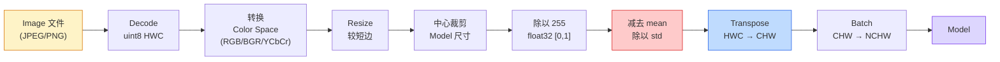
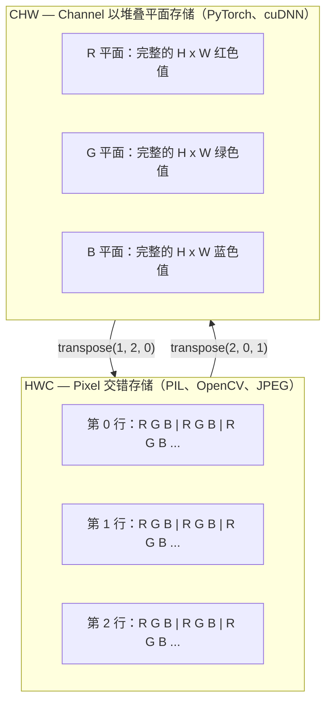

# Image 基础：Pixel、Channel 与 Color Space

> Image 是由光线采样组成的 Tensor。你以后使用的每一个视觉 Model，都从这一事实开始。

**Type:** Build
**Languages:** Python
**Prerequisites:** Phase 1 Lesson 12（Tensor 操作）、Phase 3 Lesson 11（PyTorch 入门）
**Time:** ~45 分钟

## 学习目标

- 解释连续场景如何被离散化为 Pixel，以及采样和量化决策为何会决定所有下游 Model 的能力上限
- 将 Image 作为 NumPy array 进行读取、切片和检查，并熟练切换 HWC 与 CHW 布局
- 在 RGB、grayscale、HSV 和 YCbCr 之间转换，并说明每种 Color Space 存在的理由
- 严格按照预训练 PyTorch 视觉 Model 的预期，执行 Pixel 级预处理（normalize、standardize、resize、channel-first）

## 问题

你将阅读的每篇论文、下载的每个预训练权重，以及调用的每个视觉 API，都假定输入采用某种特定编码。如果在 Model 需要 `float32` 时传入 `uint8` Image，它仍然可以运行，却会悄无声息地产生毫无意义的结果。向基于 RGB 训练的 Network 输入 BGR，准确率会骤降十个百分点。如果 Model 预期 channels-first 输入，你却传入 channels-last，第一层 conv 就会把高度当作 Feature Channel。这些问题都不会抛出错误，只会毁掉你的指标，让你花一周时间追查一个实际藏在文件加载方式里的 bug。

一旦知道 convolution 在什么数据上滑动，它本身并不复杂。真正困难的是，对于相机、JPEG decoder、PIL、OpenCV、torchvision 和 CUDA kernel 来说，“一张 Image”代表着不同的含义。每个技术栈都有自己的轴顺序、字节范围和 Channel 约定。无法理清这些差异的视觉工程师，交付的一定是有缺陷的 Pipeline。

本课将打牢基础，以便本阶段后续课程在此之上构建。学完后，你将理解 Pixel 是什么，为什么每个 Pixel 有三个数值而不是一个，“使用 ImageNet 统计数据进行 normalize”究竟做了什么，以及如何在本阶段其他课程默认使用的两三种布局之间切换。

## 概念

### 完整预处理 Pipeline 一览

每个生产级视觉系统都由相同的一系列可逆变换组成。任何一步出错，Model 看到的输入都会与 Training 时不同。



红色和蓝色的两个框是 80% 静默故障发生的地方：缺少 standardization，以及布局错误。

### Pixel 是一次采样，而不是一个方块

相机传感器会统计落在微型探测器网格上的光子。每个探测器在几分之一秒内对光线进行积分，并输出与撞击它的光子数量成正比的电压。随后，传感器将该电压离散化为整数。一个探测器就对应一个 Pixel。

```text
连续场景                         传感器网格                      数字 Image
（无限细节）                     （H x W 个探测器）              （H x W 个整数）

    ~~~~~                        +--+--+--+--+--+                 210 198 180 155 120
   ~   ~   ~                     |  |  |  |  |  |                 205 195 178 152 118
  ~ 光线  ~      ---->           +--+--+--+--+--+     ---->       200 190 175 150 115
   ~~~~~                         |  |  |  |  |  |                 195 185 170 148 112
                                 +--+--+--+--+--+                 188 180 165 145 108
```

这一步包含两项选择，它们决定了所有下游任务的能力上限：

- **空间采样**决定场景中每一度范围对应多少个探测器。数量太少，边缘会出现锯齿（aliasing）；数量太多，存储和计算成本会急剧增加。
- **强度量化**决定电压划分得有多细。8 bit 提供 256 个级别，是显示领域的标准。10、12、16 bit 能产生更平滑的 Gradient，对医学成像、HDR 和原始传感器 Pipeline 十分重要。

Pixel 不是一个具有面积的彩色方块，而是一次独立测量。执行 resize 或旋转时，你是在对测量网格重新采样。

### 为什么有三个 Channel

单个探测器会统计整个可见光谱范围内的光子，这就是 grayscale。为了获得颜色，传感器会在网格上覆盖由红、绿、蓝滤光片组成的马赛克。经过 demosaicing 后，每个空间位置都包含三个整数：附近红色滤光探测器、绿色滤光探测器和蓝色滤光探测器的响应。这三个整数构成一个 Pixel 的 RGB 三元组。

```text
内存中的一个 Pixel：

    (R, G, B) = (210, 140, 30)   <- 偏红的橙色

一张 H x W RGB Image：

    shape (H, W, 3)     存储为     H 行，每行包含 W 个 Pixel，每个 Pixel 有 3 个值
                                    对于 uint8，每个值都在 [0, 255] 范围内
```

三个 Channel 并不是什么神奇数字。深度相机会添加一个 Z Channel，卫星会添加红外和紫外波段。医学扫描通常只有一个 Channel（X-ray、CT），也可能有许多个（hyperspectral）。Channel 数量位于最后一个轴；conv 层会学习如何在不同 Channel 之间进行混合。

### 两种布局约定：HWC 和 CHW

同一个 Tensor，两种排列顺序。每个库都会选择其中一种。

```text
HWC（高度、宽度、Channel）              CHW（Channel、高度、宽度）

   W ->                                    H ->
  +-----+-----+-----+                     +-----+-----+
H |R G B|R G B|R G B|                   C |R R R R R R|
| +-----+-----+-----+                   | +-----+-----+
v |R G B|R G B|R G B|                   v |G G G G G G|
  +-----+-----+-----+                     +-----+-----+
                                          |B B B B B B|
                                          +-----+-----+

   PIL、OpenCV、matplotlib、              PyTorch、大多数 Deep Learning
   几乎所有磁盘 Image 文件                framework、cuDNN kernel
```

CHW 的存在是因为 convolution kernel 会沿 H 和 W 滑动。将 Channel 轴放在最前面，意味着每个 kernel 看到的都是每个 Channel 上连续的 2D 平面，便于进行 Vector 化。磁盘格式使用 HWC，是因为它与传感器输出扫描线的方式一致。

你以后会输入上千次的单行转换：

```text
img_chw = img_hwc.transpose(2, 0, 1)      # NumPy
img_chw = img_hwc.permute(2, 0, 1)        # PyTorch Tensor
```

内存布局的可视化：



### 字节范围与 dtype

以下三种约定最为常见：

| 约定 | dtype | 范围 | 常见位置 |
|------------|-------|-------|------------------|
| 原始数据 | `uint8` | [0, 255] | 磁盘文件、PIL、OpenCV 输出 |
| Normalized | `float32` | [0.0, 1.0] | 执行 `img.astype('float32') / 255` 后 |
| Standardized | `float32` | 大约 [-2, +2] | 减去 mean 并除以 std 后 |

Convolutional Network 使用 standardized 输入进行 Training。ImageNet 统计数据 `mean=[0.485, 0.456, 0.406]`、`std=[0.229, 0.224, 0.225]`，是在 [0, 1] normalized Pixel 上计算得到的完整 ImageNet Training set 三个 Channel 的算术平均值和标准差。将原始 `uint8` 输入期望 standardized float 的 Model，是应用视觉领域最常见的静默故障。

### Color Space 及其存在的理由

RGB 是采集格式，但对 Model 而言，它并不总是最有用的表示形式。

```text
 RGB               HSV                       YCbCr / YUV

 R 红色            H hue（角度 0-360）       Y luminance（亮度）
 G 绿色            S saturation（0-1）       Cb chroma 蓝-黄
 B 蓝色            V value/亮度（0-1）       Cr chroma 红-绿

 与传感器输出       将颜色与亮度分离。         将亮度与颜色分离。
 呈线性关系         适合颜色阈值处理、          JPEG 和大多数视频 codec
                   UI 滑块和简单 filter       会更强烈地压缩 chroma Channel，
                                             因为人眼对 chroma 细节的敏感度
                                             低于对 Y 的敏感度。
```

对于大多数现代 CNN，输入应使用 RGB。以下场景会遇到其他 Color Space：

- **HSV**：经典 CV 代码、基于颜色的 segmentation、white balancing。
- **YCbCr**：读取 JPEG 内部数据、视频 Pipeline，以及仅在 Y 上运行的 super-resolution Model。
- **Grayscale**：OCR、文档 Model，以及颜色属于干扰变量而非信号的任何场景。

从 RGB 转换 grayscale 时使用的是加权和，而不是平均值，因为人眼对绿色的敏感度高于红色或蓝色：

```text
Y = 0.299 R + 0.587 G + 0.114 B       （ITU-R BT.601，经典权重）
```

### 宽高比、resize 与 interpolation

每个 Model 都有固定的输入尺寸（大多数 ImageNet classifier 为 224x224，现代 detector 为 384x384 或 512x512）。你的 Image 很少与之完全匹配。需要关注三种 resize 方式：

- **先 resize 较短边，再进行中心裁剪**：标准 ImageNet 方案。它会保留宽高比，但丢弃边缘的一条 Pixel 区域。
- **Resize 并填充**：保留宽高比和所有 Pixel，但会添加黑边。是 detection 和 OCR 的标准方式。
- **直接 resize 到目标尺寸**：会拉伸 Image。成本低廉，会扭曲几何形状，但对许多 Classification 任务已经足够。

当新网格与旧网格不对齐时，interpolation 方法决定如何计算中间 Pixel：

```text
Nearest neighbour     速度最快，有块状感，是 mask/Label 的唯一选择
Bilinear              速度快且平滑，是大多数 Image resize 的默认选择
Bicubic               更慢，放大时更清晰
Lanczos               最慢，质量最佳，用于最终显示
```

经验法则：Training 使用 bilinear；需要查看的素材使用 bicubic 或 lanczos；包含整数 class ID 的任何内容都使用 nearest。

```figure
conv-output-size
```

## 构建它

### 第 1 步：构建 Image Tensor 并检查其 shape

首先使用确定性的合成 Image，让第一个实验只依赖 NumPy 即可离线运行。文件解码是一个独立边界：JPEG 或 PNG decoder 返回 RGB 字节后，下面的所有 Tensor 操作都完全相同。

```python
import numpy as np

def synthetic_rgb(h=128, w=192, seed=0):
    rng = np.random.default_rng(seed)
    yy, xx = np.meshgrid(np.linspace(0, 1, h), np.linspace(0, 1, w), indexing="ij")
    r = (np.sin(xx * 6) * 0.5 + 0.5) * 255
    g = yy * 255
    b = (1 - yy) * xx * 255
    rgb = np.stack([r, g, b], axis=-1) + rng.normal(0, 6, (h, w, 3))
    return np.clip(rgb, 0, 255).astype(np.uint8)

arr = synthetic_rgb()

print(f"type:   {type(arr).__name__}")
print(f"dtype:  {arr.dtype}")
print(f"shape:  {arr.shape}     # (H, W, C)")
print(f"min:    {arr.min()}")
print(f"max:    {arr.max()}")
print(f"pixel at (0, 0): {arr[0, 0]}")
```

预期输出：`shape: (H, W, 3)`、`dtype: uint8`，范围为 `[0, 255]`。无论字节来自相机、Image decoder 还是这个合成生成器，这都是规范的解码后表示形式。

### 第 2 步：拆分 Channel 并重新排列布局

分别取出 R、G、B，然后从 HWC 转换为 PyTorch 使用的 CHW。

```python
R = arr[:, :, 0]
G = arr[:, :, 1]
B = arr[:, :, 2]
print(f"R shape: {R.shape}, mean: {R.mean():.1f}")
print(f"G shape: {G.shape}, mean: {G.mean():.1f}")
print(f"B shape: {B.shape}, mean: {B.mean():.1f}")

arr_chw = arr.transpose(2, 0, 1)
print(f"\nHWC shape: {arr.shape}")
print(f"CHW shape: {arr_chw.shape}")
```

三个 grayscale 平面，每个 Channel 一个。CHW 只是重新排列轴；在内存布局允许的情况下，并不一定需要复制数据。

### 第 3 步：grayscale 与 HSV 转换

先实现加权和 grayscale，再手动实现 RGB 到 HSV 的转换。

```python
def rgb_to_grayscale(rgb):
    weights = np.array([0.299, 0.587, 0.114], dtype=np.float32)
    return (rgb.astype(np.float32) @ weights).astype(np.uint8)

def rgb_to_hsv(rgb):
    rgb_f = rgb.astype(np.float32) / 255.0
    r, g, b = rgb_f[..., 0], rgb_f[..., 1], rgb_f[..., 2]
    cmax = np.max(rgb_f, axis=-1)
    cmin = np.min(rgb_f, axis=-1)
    delta = cmax - cmin

    h = np.zeros_like(cmax)
    mask = delta > 0
    argmax = np.argmax(rgb_f, axis=-1)
    rmax = mask & (argmax == 0)
    gmax = mask & (argmax == 1)
    bmax = mask & (argmax == 2)
    h[rmax] = ((g[rmax] - b[rmax]) / delta[rmax]) % 6
    h[gmax] = ((b[gmax] - r[gmax]) / delta[gmax]) + 2
    h[bmax] = ((r[bmax] - g[bmax]) / delta[bmax]) + 4
    h = h * 60.0

    s = np.divide(delta, cmax, out=np.zeros_like(delta), where=cmax > 0)
    v = cmax
    return np.stack([h, s, v], axis=-1)

gray = rgb_to_grayscale(arr)
hsv = rgb_to_hsv(arr)
print(f"gray shape: {gray.shape}, range: [{gray.min()}, {gray.max()}]")
print(f"hsv   shape: {hsv.shape}")
print(f"hue range: [{hsv[..., 0].min():.1f}, {hsv[..., 0].max():.1f}] degrees")
print(f"sat range: [{hsv[..., 1].min():.2f}, {hsv[..., 1].max():.2f}]")
print(f"val range: [{hsv[..., 2].min():.2f}, {hsv[..., 2].max():.2f}]")
```

Hue 的输出单位是度，saturation 和 value 的范围是 [0, 1]。这与 OpenCV 的 `hsv_full` 约定一致。

### 第 4 步：normalize、standardize，并执行逆变换

将原始字节转换为预训练 ImageNet Model 所期望的精确 Tensor，然后再转换回来。

```python
mean = np.array([0.485, 0.456, 0.406], dtype=np.float32)
std = np.array([0.229, 0.224, 0.225], dtype=np.float32)

def preprocess_imagenet(rgb_uint8):
    x = rgb_uint8.astype(np.float32) / 255.0
    x = (x - mean) / std
    x = x.transpose(2, 0, 1)
    return x

def deprocess_imagenet(chw_float32):
    x = chw_float32.transpose(1, 2, 0)
    x = x * std + mean
    x = np.clip(x * 255.0, 0, 255).astype(np.uint8)
    return x

x = preprocess_imagenet(arr)
print(f"preprocessed shape: {x.shape}     # (C, H, W)")
print(f"preprocessed dtype: {x.dtype}")
print(f"preprocessed mean per channel:  {x.mean(axis=(1, 2)).round(3)}")
print(f"preprocessed std  per channel:  {x.std(axis=(1, 2)).round(3)}")

roundtrip = deprocess_imagenet(x)
max_diff = np.abs(roundtrip.astype(int) - arr.astype(int)).max()
print(f"roundtrip max pixel diff: {max_diff}    # should be 0 or 1")
```

每个 Channel 的 mean 应接近零，std 应接近一。这个 preprocess/deprocess 组合正是每次调用 torchvision `transforms.Normalize` 时在底层执行的操作。

### 第 5 步：从零实现 resize

Nearest neighbor 会将每个输出坐标舍入到某个源 Pixel。Bilinear interpolation 会找到周围四个 Pixel，并根据距离混合它们。下面两个实现都使用端点对齐坐标，因此第一个和最后一个源 Pixel 会保持固定。

```python
def resize_coordinates(source_length, target_length):
    if target_length == 1:
        return np.zeros(1, dtype=np.float32)
    return np.linspace(0, source_length - 1, target_length, dtype=np.float32)

def nearest_resize(image, target_height, target_width):
    y = np.rint(resize_coordinates(image.shape[0], target_height)).astype(int)
    x = np.rint(resize_coordinates(image.shape[1], target_width)).astype(int)
    return image[y[:, None], x[None, :]]

def bilinear_resize(image, target_height, target_width):
    y = resize_coordinates(image.shape[0], target_height)
    x = resize_coordinates(image.shape[1], target_width)
    y0 = np.floor(y).astype(int)
    x0 = np.floor(x).astype(int)
    y1 = np.minimum(y0 + 1, image.shape[0] - 1)
    x1 = np.minimum(x0 + 1, image.shape[1] - 1)
    wy = (y - y0)[:, None, None]
    wx = (x - x0)[None, :, None]

    source = image.astype(np.float32)
    top = source[y0[:, None], x0[None, :]] * (1 - wx)
    top += source[y0[:, None], x1[None, :]] * wx
    bottom = source[y1[:, None], x0[None, :]] * (1 - wx)
    bottom += source[y1[:, None], x1[None, :]] * wx
    result = top * (1 - wy) + bottom * wy
    return np.clip(np.rint(result), 0, 255).astype(image.dtype)

target_height = arr.shape[0] * 3
target_width = arr.shape[1] * 3
nearest = nearest_resize(arr, target_height, target_width)
bilinear = bilinear_resize(arr, target_height, target_width)

def local_roughness(x):
    gy = np.diff(x.astype(float), axis=0)
    gx = np.diff(x.astype(float), axis=1)
    return float(np.abs(gy).mean() + np.abs(gx).mean())

for name, out in [("nearest", nearest), ("bilinear", bilinear)]:
    print(f"{name:>8}  shape={out.shape}  roughness={local_roughness(out):6.2f}")
```

Nearest 的粗糙度得分最高，因为它保留了硬边缘。Bilinear 更平滑，因为每个新 Pixel 都会混合每个轴上的两个位置。可运行的配套代码使用 Catmull-Rom cubic kernel，将同样的可分离思想扩展到每个轴上的四个邻居，然后在不使用 Image 库的情况下打印全部三种结果。

## 使用它

PyTorch 会在支持 Batch 和设备感知的 Tensor 上执行相同操作。下面的代码会 resize 较短边、进行中心裁剪、standardize 每个 Channel，并生成预训练 Model 所期望的 NCHW Tensor。

```python
import torch
import torch.nn.functional as F

image_hwc = torch.from_numpy(synthetic_rgb(256, 320))
batch = image_hwc.permute(2, 0, 1).unsqueeze(0).float() / 255.0

height, width = batch.shape[-2:]
scale = 256 / min(height, width)
resized_height = round(height * scale)
resized_width = round(width * scale)
batch = F.interpolate(
    batch,
    size=(resized_height, resized_width),
    mode="bilinear",
    align_corners=False,
    antialias=True,
)

top = (resized_height - 224) // 2
left = (resized_width - 224) // 2
batch = batch[:, :, top:top + 224, left:left + 224]

mean = torch.tensor([0.485, 0.456, 0.406]).view(1, 3, 1, 1)
std = torch.tensor([0.229, 0.224, 0.225]).view(1, 3, 1, 1)
batch = (batch - mean) / std

print(f"tensor dtype: {batch.dtype}")
print(f"batched shape: {tuple(batch.shape)}")
print(f"per-channel mean: {batch.mean(dim=(0, 2, 3)).tolist()}")
print(f"per-channel std:  {batch.std(dim=(0, 2, 3)).tolist()}")
```

四个步骤，必须严格按此顺序执行：将字节转换为 float，并将 HWC 调整为 NCHW；将较短边 resize 到 256；进行 224x224 中心裁剪；最后减去 ImageNet mean 并除以其标准差。颠倒这个顺序会悄无声息地改变最终送入 Model 的内容。

## 交付它

本课会产出：

- `outputs/prompt-vision-preprocessing-audit.md`：一个 Prompt，可将任意 Model card 或 Dataset card 转换为清单，列出团队必须遵守的确切预处理不变量。
- `outputs/skill-image-tensor-inspector.md`：一个 Skill，在给定任意 Image 形状的 Tensor 或 array 后，报告 dtype、布局、范围，并判断它看起来属于原始数据、normalized 数据还是 standardized 数据。

## 练习

1. **（简单）** 创建一个包含四种不同颜色的 2x2 RGB `uint8` array。将 HWC 转换为 CHW，再转换回来；打印两种 shape，并证明往返转换保留了每个值。
2. **（中等）** 编写 `standardize(img, mean, std)` 及其逆函数，使二者能在任意 uint8 Image 上通过 `roundtrip_max_diff <= 1` 测试。你的函数必须通过相同调用方式，同时支持 HWC 格式的单张 Image 和 NCHW 格式的 Batch。
3. **（困难）** 取一个经过 ImageNet standardization 的 3-Channel Tensor，让它通过一个 1x1 conv，由该 conv 学习如何将 RGB 加权混合为单个 grayscale Channel。将权重初始化为 `[0.299, 0.587, 0.114]`，冻结权重，并验证输出与手动实现的 `rgb_to_grayscale` 之间仅存在浮点误差。还有哪些经典 Color Space 变换可以写成 1x1 convolution？

## 关键术语

| 术语 | 人们通常怎么说 | 它的实际含义 |
|------|----------------|----------------------|
| Pixel | “一个彩色方块” | 网格中某个位置的一次光强采样：颜色用三个数表示，grayscale 用一个数表示 |
| Channel | “颜色” | 堆叠成 Image Tensor 的多个并行空间网格之一；在 HWC 中位于最后一个轴，在 CHW 中位于第一个轴 |
| HWC / CHW | “shape” | Image Tensor 的轴排列顺序；磁盘文件和 PIL 使用 HWC，PyTorch 和 cuDNN 使用 CHW |
| Normalize | “缩放 Image” | 除以 255，使 Pixel 位于 [0, 1] 范围内；这是必要步骤，但还不够 |
| Standardize | “零中心化” | 每个 Channel 减去 mean 并除以 std，使输入分布与 Model Training 时的分布一致 |
| Grayscale conversion | “对 Channel 求平均” | 使用系数 0.299/0.587/0.114 计算加权和，以匹配人类对 luminance 的感知 |
| Interpolation | “Resize 如何选择 Pixel” | 当新网格与旧网格不对齐时决定输出值的规则：Label 使用 nearest，Training 使用 bilinear，显示使用 bicubic |
| Aspect ratio | “宽除以高” | 用于区分“resize 并填充”和“resize 并拉伸”的比例 |

## 延伸阅读

- [Charles Poynton — A Guided Tour of Color Space](https://poynton.ca/PDFs/Guided_tour.pdf)：对为什么存在如此多 Color Space，以及每种 Color Space 在何时重要的最清晰技术讲解
- [PyTorch Vision Transforms Docs](https://pytorch.org/vision/stable/transforms.html)：你在生产环境中实际组合使用的完整 transforms Pipeline
- [How JPEG Works (Colt McAnlis)](https://www.youtube.com/watch?v=F1kYBnY6mwg)：对 chroma subsampling、DCT，以及 JPEG 为何编码 YCbCr 而不是 RGB 的精彩视觉讲解
- [ImageNet Preprocessing Conventions (torchvision models)](https://pytorch.org/vision/stable/models.html)：`mean=[0.485, 0.456, 0.406]` 的权威来源，以及 Model zoo 中每个 Model 为何都期望该设置
