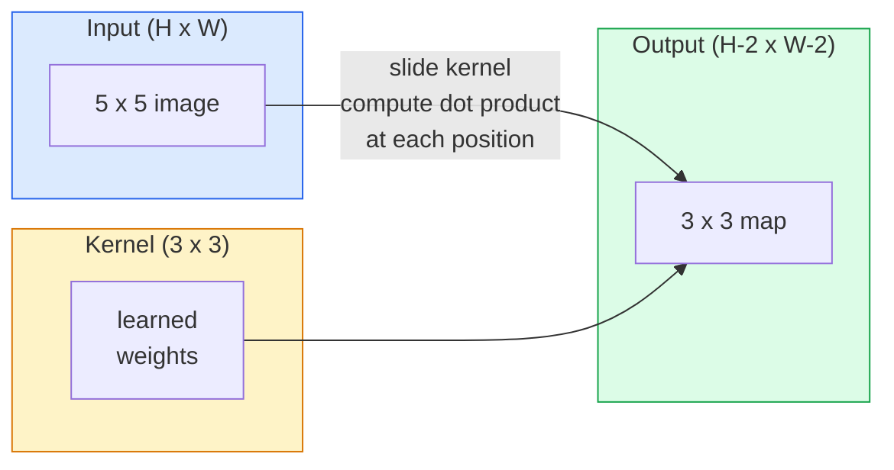
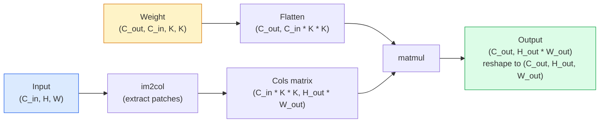

# Convolutions from Scratch

> convolution 是一个很小的 dense layer，你把它滑过一张图像，并在每个位置共享同一组权重。

**Type:** Build
**Languages:** Python
**Prerequisites:** Phase 3 (Deep Learning Core), Phase 4 Lesson 01 (Image Fundamentals)
**Time:** ~75 分钟

## 学习目标
- 只使用 NumPy 从零实现 2D convolution，包括 nested-loop 版本和 vectorised `im2col` 版本
- 针对 input size、kernel size、padding 和 stride 的任意组合，计算输出空间尺寸，并解释 `(H - K + 2P) / S + 1` 公式为什么成立
- 手工设计 kernels（edge、blur、sharpen、Sobel），并解释每一个为什么会产生对应的 activations 模式
- 将 convolutions 堆叠成一个 feature extractor，并把堆叠深度与 receptive field 的大小联系起来

## 问题
在一张 224x224 RGB 图像上使用 fully connected layer，每个 neuron 需要 224 * 224 * 3 = 150,528 个输入权重。一个只有 1,000 个单元的 hidden layer 就已经有 1.5 亿个参数了，而且这还是在你学到任何有用东西之前。更糟的是，这一层不知道左上角的一只狗和右下角的一只狗是同一种模式。它把每个像素位置都当作相互独立的对象，而这对图像来说恰恰是错误的：把一只猫平移三个像素，不应该迫使 network 重新学习这个概念。

图像模型需要两个性质：**translation equivariance**（输入移动时输出也随之移动）和 **parameter sharing**（同一个 feature detector 在所有位置运行）。Dense layers 两者都不给你。Convolution 两者都天然具备。

Convolution 并不是为 Deep Learning 发明的。它也是 JPEG compression、Photoshop 中的 Gaussian blur、工业视觉中的 edge detection，以及几乎所有音频 filter 背后的同一种操作。CNNs 从 2012 年到 2020 年主导 ImageNet 的原因在于，convolution 是一种适合这类数据的正确先验：相邻值彼此相关，同一种模式可以出现在任何位置。

## 概念
### One kernel, sliding

2D convolution 会取一个叫做 kernel（或 filter）的小型 weight matrix，将它滑过输入，并在每个位置计算逐元素乘积之和。这个和会成为一个输出像素。



一个具体的 3x3 示例，输入为 5x5（无 padding，stride 1）：

```
Input X (5 x 5):                Kernel W (3 x 3):

  1  2  0  1  2                   1  0 -1
  0  1  3  1  0                   2  0 -2
  2  1  0  2  1                   1  0 -1
  1  0  2  1  3
  2  1  1  0  1

The kernel slides across every valid 3 x 3 window. Output Y is 3 x 3:

 Y[0,0] = sum( W * X[0:3, 0:3] )
 Y[0,1] = sum( W * X[0:3, 1:4] )
 Y[0,2] = sum( W * X[0:3, 2:5] )
 Y[1,0] = sum( W * X[1:4, 0:3] )
 ... and so on
```

这一个公式，也就是 **shared weights、locality、sliding window**，就是完整思想。其他所有东西都是 bookkeeping。

### Output size formula

给定输入空间尺寸 `H`、kernel size `K`、padding `P`、stride `S`：

```
H_out = floor( (H - K + 2P) / S ) + 1
```

记住它。你会在每个 architecture 中计算它几十次。

| Scenario | H | K | P | S | H_out |
|----------|---|---|---|---|-------|
| Valid conv，无 padding | 32 | 3 | 0 | 1 | 30 |
| Same conv（保持尺寸） | 32 | 3 | 1 | 1 | 32 |
| 按 2 倍 downsample | 32 | 3 | 1 | 2 | 16 |
| Pool 2x2 | 32 | 2 | 0 | 2 | 16 |
| 大 receptive field | 32 | 7 | 3 | 2 | 16 |

"Same padding" 的意思是选择 P，使得当 S == 1 时 H_out == H。对于奇数 K，也就是 P = (K - 1) / 2。这就是为什么 3x3 kernels 占主导地位：它们是仍然拥有中心点的最小奇数 kernel。

### Padding

没有 padding 时，每次 convolution 都会缩小 feature map。堆叠 20 个之后，你的 224x224 图像会变成 184x184，这既浪费边界上的计算，也会让需要匹配形状的 residual connections 变复杂。

```
Zero padding (P = 1) on a 5 x 5 input:

  0  0  0  0  0  0  0
  0  1  2  0  1  2  0
  0  0  1  3  1  0  0
  0  2  1  0  2  1  0       Now the kernel can centre on pixel
  0  1  0  2  1  3  0       (0, 0) and still have three rows and
  0  2  1  1  0  1  0       three columns of values to multiply.
  0  0  0  0  0  0  0
```

实践中会遇到的模式：`zero`（最常见）、`reflect`（镜像边缘，在 generative models 中避免硬边界）、`replicate`（复制边缘）、`circular`（环绕，在 toroidal problems 中使用）。

### Stride

Stride 是滑动的步长。`stride=1` 是默认值。`stride=2` 会让空间维度减半，是在 CNN 内部不使用单独 pooling layer 而进行 downsample 的经典方式。每一种现代 architecture（ResNet、ConvNeXt、MobileNet）都会在某处用 strided convs 替代 max-pool。

```
Stride 1 on a 5 x 5 input, 3 x 3 kernel:

  starts: (0,0) (0,1) (0,2)        -> output row 0
          (1,0) (1,1) (1,2)        -> output row 1
          (2,0) (2,1) (2,2)        -> output row 2

  Output: 3 x 3

Stride 2 on the same input:

  starts: (0,0) (0,2)              -> output row 0
          (2,0) (2,2)              -> output row 1

  Output: 2 x 2
```

### Multiple input channels

真实图像有三个 channels。RGB 输入上的 3x3 convolution 实际上是一个 3x3x3 体积：每个输入 channel 有一个 3x3 切片。在每个空间位置上，你会对三个切片全部进行乘法和求和，并加上 bias。

```
Input:   (C_in,  H,  W)        3 x 5 x 5
Kernel:  (C_in,  K,  K)        3 x 3 x 3 (one kernel)
Output:  (1,     H', W')       2D map

For a layer that produces C_out output channels, you stack C_out kernels:

Weight:  (C_out, C_in, K, K)   e.g. 64 x 3 x 3 x 3
Output:  (C_out, H', W')       64 x 3 x 3

Parameter count: C_out * C_in * K * K + C_out   (the + C_out is biases)
```

最后一行是你规划模型时会计算的内容。一个作用在 3-channel 输入上的 64-channel 3x3 conv 有 `64 * 3 * 3 * 3 + 64 = 1,792` 个参数。很便宜。

### The im2col trick

Nested loops 很容易读，但很慢。GPUs 想要的是大型 matrix multiplies。技巧是：把输入中每个 receptive-field window 展平为一个大 matrix 的一列，把 kernel 展平为一行，于是整个 convolution 就变成了一次 matmul。



每个生产级 conv 实现都是这个思路加上 cache-tiling 技巧的某种变体（direct conv、Winograd、大 kernel 使用 FFT conv）。理解 im2col，你就理解了核心。

### Receptive field

单个 3x3 conv 会查看 9 个输入像素。堆叠两个 3x3 conv，第二层中的一个 neuron 会查看 5x5 输入像素。三个 3x3 conv 给出 7x7。一般来说：

```
RF after L stacked K x K convs (stride 1) = 1 + L * (K - 1)

With strides:   RF grows multiplicatively with stride along each layer.
```

"一路 3x3" 能够有效（VGG、ResNet、ConvNeXt）的根本原因是，两个 3x3 convs 看到的输入区域与一个 5x5 conv 相同，但参数更少，而且中间多了一个 non-linearity。

## 构建它
### 步骤 1： Pad an array

从最小的 primitive 开始：一个在 H x W array 周围补零的函数。

```python
import numpy as np

def pad2d(x, p):
    if p == 0:
        return x
    h, w = x.shape[-2:]
    out = np.zeros(x.shape[:-2] + (h + 2 * p, w + 2 * p), dtype=x.dtype)
    out[..., p:p + h, p:p + w] = x
    return out

x = np.arange(9).reshape(3, 3)
print(x)
print()
print(pad2d(x, 1))
```

trailing-axes 技巧 `x.shape[:-2]` 的意思是，同一个函数无需修改就可以作用于 `(H, W)`、`(C, H, W)` 或 `(N, C, H, W)`。

### 步骤 2： 使用嵌套循环实现 2D convolution

参考实现：慢，但毫不含糊。原则上，这就是 `torch.nn.functional.conv2d` 做的事。

```python
def conv2d_naive(x, w, b=None, stride=1, padding=0):
    c_in, h, w_in = x.shape
    c_out, c_in_w, kh, kw = w.shape
    assert c_in == c_in_w

    x_pad = pad2d(x, padding)
    h_out = (h + 2 * padding - kh) // stride + 1
    w_out = (w_in + 2 * padding - kw) // stride + 1

    out = np.zeros((c_out, h_out, w_out), dtype=np.float32)
    for oc in range(c_out):
        for i in range(h_out):
            for j in range(w_out):
                hs = i * stride
                ws = j * stride
                patch = x_pad[:, hs:hs + kh, ws:ws + kw]
                out[oc, i, j] = np.sum(patch * w[oc])
        if b is not None:
            out[oc] += b[oc]
    return out
```

四重 nested loops（output channel、row、column，再加上对 C_in、kh、kw 的隐式求和）。这是你用来校验每个更快实现的 ground truth。

### 步骤 3: 用手工设计的 kernel 验证

构建一个 vertical Sobel kernel，把它应用到一张合成 step image 上，然后观察 vertical edge 被点亮。

```python
def synthetic_step_image():
    img = np.zeros((1, 16, 16), dtype=np.float32)
    img[:, :, 8:] = 1.0
    return img

sobel_x = np.array([
    [[-1, 0, 1],
     [-2, 0, 2],
     [-1, 0, 1]]
], dtype=np.float32)[None]

x = synthetic_step_image()
y = conv2d_naive(x, sobel_x, padding=1)
print(y[0].round(1))
```

预期在第 7 列出现较大的正值（从左到右亮度增加），其他位置为零。这个 print 就是你确认数学正确性的 sanity check。

### 步骤 4： im2col

把输入中每个 kernel-sized window 转换为 matrix 的一列。对于 `C_in=3, K=3`，每一列是 27 个数字。

```python
def im2col(x, kh, kw, stride=1, padding=0):
    c_in, h, w = x.shape
    x_pad = pad2d(x, padding)
    h_out = (h + 2 * padding - kh) // stride + 1
    w_out = (w + 2 * padding - kw) // stride + 1

    cols = np.zeros((c_in * kh * kw, h_out * w_out), dtype=x.dtype)
    col = 0
    for i in range(h_out):
        for j in range(w_out):
            hs = i * stride
            ws = j * stride
            patch = x_pad[:, hs:hs + kh, ws:ws + kw]
            cols[:, col] = patch.reshape(-1)
            col += 1
    return cols, h_out, w_out
```

它仍然是 Python loop，但现在繁重的计算会变成一次 vectorised matmul。

### 步骤 5：通过 im2col + matmul 实现快速 conv

用一次 matrix multiplication 替换 quadruple loop。

```python
def conv2d_im2col(x, w, b=None, stride=1, padding=0):
    c_out, c_in, kh, kw = w.shape
    cols, h_out, w_out = im2col(x, kh, kw, stride, padding)
    w_flat = w.reshape(c_out, -1)
    out = w_flat @ cols
    if b is not None:
        out += b[:, None]
    return out.reshape(c_out, h_out, w_out)
```

正确性检查：运行两个实现并比较。

```python
rng = np.random.default_rng(0)
x = rng.normal(0, 1, (3, 16, 16)).astype(np.float32)
w = rng.normal(0, 1, (8, 3, 3, 3)).astype(np.float32)
b = rng.normal(0, 1, (8,)).astype(np.float32)

y_naive = conv2d_naive(x, w, b, padding=1)
y_im2col = conv2d_im2col(x, w, b, padding=1)

print(f"max abs diff: {np.max(np.abs(y_naive - y_im2col)):.2e}")
```

`max abs diff` 应该在 `1e-5` 左右。这种差异来自 floating-point 累加顺序，不是 bug。

### 步骤 6：一组手工设计的 kernels

五个 filters，展示单个 conv layer 在任何训练之前就能表达什么。

```python
KERNELS = {
    "identity": np.array([[0, 0, 0], [0, 1, 0], [0, 0, 0]], dtype=np.float32),
    "blur_3x3": np.ones((3, 3), dtype=np.float32) / 9.0,
    "sharpen": np.array([[0, -1, 0], [-1, 5, -1], [0, -1, 0]], dtype=np.float32),
    "sobel_x": np.array([[-1, 0, 1], [-2, 0, 2], [-1, 0, 1]], dtype=np.float32),
    "sobel_y": np.array([[-1, -2, -1], [0, 0, 0], [1, 2, 1]], dtype=np.float32),
}

def apply_kernel(img2d, kernel):
    x = img2d[None].astype(np.float32)
    w = kernel[None, None]
    return conv2d_im2col(x, w, padding=1)[0]
```

应用到任意 grayscale image 上时，blur 会柔化，sharpen 会让边缘更清晰，Sobel-x 会点亮 vertical edges，Sobel-y 会点亮 horizontal edges。这些正是 AlexNet 和 VGG 中第一个训练出的 conv layer 最终学到的模式，因为优秀的图像模型无论后续任务是什么，都需要 edge 和 blob detectors。

## 使用它
PyTorch 的 `nn.Conv2d` 用 autograd、CUDA kernels 和 cuDNN optimisation 包装了同一个操作。Shape semantics 完全相同。

```python
import torch
import torch.nn as nn

conv = nn.Conv2d(in_channels=3, out_channels=64, kernel_size=3, stride=1, padding=1)
print(conv)
print(f"weight shape: {tuple(conv.weight.shape)}   # (C_out, C_in, K, K)")
print(f"bias shape:   {tuple(conv.bias.shape)}")
print(f"param count:  {sum(p.numel() for p in conv.parameters())}")

x = torch.randn(8, 3, 224, 224)
y = conv(x)
print(f"\ninput  shape: {tuple(x.shape)}")
print(f"output shape: {tuple(y.shape)}")
```

把 `padding=1` 换成 `padding=0`，输出会降到 222x222。把 `stride=1` 换成 `stride=2`，输出会降到 112x112。就是你上面记住的同一个公式。

## 交付它
本课会产出：

- `outputs/prompt-cnn-architect.md`：一个 prompt，给定 input size、parameter budget 和目标 receptive field 后，设计一组 `Conv2d` layers，并在每一步使用正确的 K/S/P。
- `outputs/skill-conv-shape-calculator.md`：一个 skill，逐层遍历 network spec，并返回每个 block 的 output shape、receptive field 和 parameter count。

## 练习
1. **(Easy)** 给定一个 128x128 grayscale 输入，以及一组 `[Conv3x3(s=1,p=1), Conv3x3(s=2,p=1), Conv3x3(s=1,p=1), Conv3x3(s=2,p=1)]`，手工计算每一层的输出空间尺寸和 receptive field。用一个由 dummy convs 组成的 PyTorch `nn.Sequential` 进行验证。
2. **(Medium)** 扩展 `conv2d_naive` 和 `conv2d_im2col`，让它们接受 `groups` 参数。证明 `groups=C_in=C_out` 可以复现 depthwise convolution，并且它的 parameter count 是 `C * K * K`，而不是 `C * C * K * K`。
3. **(Hard)** 手工实现 `conv2d_im2col` 的 backward pass：给定输出的 Gradient，计算 `x` 和 `w` 的 Gradient。在相同输入和权重上与 `torch.autograd.grad` 验证。关键技巧是：im2col 的 Gradient 是 `col2im`，而且它必须累加重叠窗口。

## 关键术语
| Term | What people say | What it actually means |
|------|----------------|----------------------|
| Convolution | “滑动一个 filter” | 一个在每个空间位置用 shared weights 应用的可学习 dot product；数学上是 cross-correlation，但大家都叫它 convolution |
| Kernel / filter | “feature detector” | 一个形状为 (C_in, K, K) 的小型 weight tensor，它与输入窗口的 dot product 会产生一个输出像素 |
| Stride | “每次跳多远” | 连续 kernel placements 之间的步长；stride 2 会让每个空间维度减半 |
| Padding | “边缘上的零” | 在输入周围添加的额外值，使 kernel 可以以边界像素为中心；`same` padding 会让输出尺寸等于输入尺寸 |
| Receptive field | “neuron 能看到多少” | 某个输出 activation 所依赖的原始输入 patch，会随着深度和 stride 增长 |
| im2col | “GEMM trick” | 把每个 receptive window 重排成列，让 convolution 变成一次大型 matrix multiply，这是每个快速 conv kernel 的核心 |
| Depthwise conv | “每个 channel 一个 kernel” | 一个满足 `groups == C_in` 的 conv，每个输出 channel 只由匹配的输入 channel 计算得到；是 MobileNet 和 ConvNeXt 的 backbone |
| Translation equivariance | “输入平移，输出平移” | 输入平移 k 个像素时，输出也平移 k 个像素的性质；shared weights 天然带来这个性质 |

## 延伸阅读
- [A guide to convolution arithmetic for deep learning (Dumoulin & Visin, 2016)](https://arxiv.org/abs/1603.07285) — 每门课程都会悄悄借鉴的 padding/stride/dilation 权威图解
- [CS231n: Convolutional Neural Networks for Visual Recognition](https://cs231n.github.io/convolutional-networks/) — 经典 lecture notes，包括最初的 im2col 解释
- [The Annotated ConvNet (fast.ai)](https://nbviewer.org/github/fastai/fastbook/blob/master/13_convolutions.ipynb) — 一个从手写 convolution 走到训练 digit classifier 的 notebook
- [Receptive Field Arithmetic for CNNs (Dang Ha The Hien)](https://distill.pub/2019/computing-receptive-fields/) — 具备论文级质量的 receptive field 计算交互式讲解器
