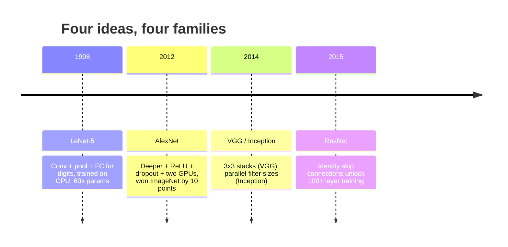
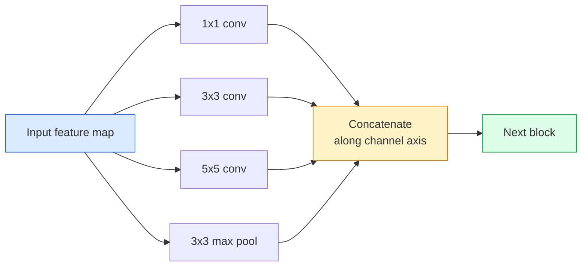
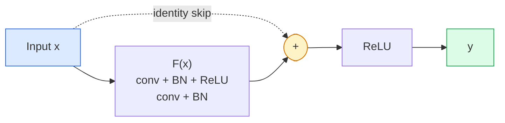

# CNNs — LeNet to ResNet

> 过去三十年里每个重要的 CNN，本质上都是同一个 conv–nonlinearity–downsample 配方，再加上一个新想法。按顺序学会这些想法。

**Type:** 学习 + 构建
**Languages:** Python
**先修要求：** Phase 3 Lesson 11 (PyTorch), Phase 4 Lesson 01 (Image Fundamentals), Phase 4 Lesson 02 (Convolutions from Scratch)
**Time:** ~75 分钟

## 学习目标
- 追踪 LeNet-5 -> AlexNet -> VGG -> Inception -> ResNet 的架构谱系，并说明每个家族贡献的单一新想法
- 在 PyTorch 中实现 LeNet-5、一个 VGG 风格 block，以及一个 ResNet BasicBlock，每个都控制在 40 行以内
- 解释为什么 residual connections 能把一个无法训练的 1,000-layer network 变成 state-of-the-art
- 阅读一个现代 backbone (ResNet-18, ResNet-50)，并在查看源码前预测它的 output shape、receptive field 和 parameter count

## 问题
2011 年，最好的 ImageNet classifier 的 top-5 accuracy 大约是 74%。2012 年 AlexNet 达到 85%。2015 年 ResNet 达到 96%。没有新数据。没有新一代 GPU。提升来自架构想法。一个能工作的 vision engineer 必须知道哪个想法来自哪篇论文，因为你在 2026 年发布的每个 production backbone，都是这些相同组件的重新组合；也因为这些想法会持续迁移：grouped convs 从 CNNs 迁移到 transformers，residual connections 从 ResNet 迁移到现存的每个 LLM，batch normalisation 存在于 diffusion models 中。

按顺序学习这些 networks 也能让你避免一个常见错误：在 LeNet-sized network 就能解决问题时，直接使用可用的最大模型。MNIST 不需要 ResNet。了解每个家族的 scaling curve，能告诉你应该落在曲线的哪个位置。

## 概念
### 改变 vision 的四个想法



在 classical vision 中，没有其他东西比这四次跃迁更重要。

### LeNet-5 (1998)

Yann LeCun 的 digit recogniser。60,000 个 parameters。两个 conv-pool blocks、两个 fully connected layers、tanh activations。它定义了每个 CNN 继承的模板：

```
input (1, 32, 32)
  conv 5x5 -> (6, 28, 28)
  avg pool 2x2 -> (6, 14, 14)
  conv 5x5 -> (16, 10, 10)
  avg pool 2x2 -> (16, 5, 5)
  flatten -> 400
  dense -> 120
  dense -> 84
  dense -> 10
```

现代世界所说的 CNN，即 alternating convolutions and downsampling 再接一个小型 classifier head，本质上就是层数更多、channels 更大、activations 更好的 LeNet。

### AlexNet (2012)

三个改动合在一起突破了 ImageNet：

1. 用 **ReLU** 替代 tanh。Gradients 不再消失。训练速度提升六倍。
2. 在 fully connected head 中使用 **Dropout**。Regularisation 变成了一个 layer，而不是一个技巧。
3. **Depth and width**。五个 conv layers，三个 dense layers，60M parameters，在两块 GPUs 上训练，并把模型拆分到两块卡上。

论文的 Figure 2 仍然展示了 GPU split，即两条 parallel streams。这种 parallelism 是硬件层面的 workaround，不是架构洞见；但上面三个想法仍然存在于你使用的每个模型中。

### VGG (2014)

VGG 问了一个问题：如果只使用 3x3 convolutions，并且不断加深，会发生什么？

```
stack:   conv 3x3 -> conv 3x3 -> pool 2x2
repeat:  16 or 19 conv layers
```

两个 3x3 convs 看到的 input area 与一个 5x5 conv 相同，但 parameters 更少 (2*9*C^2 = 18C^2 vs 25*C^2)，并且中间额外多了一个 ReLU。VGG 把这个观察变成了完整架构。它的简单性，即一种 block type 反复堆叠，让它成为后续所有架构的参照点。

代价：138M parameters，训练慢，inference 昂贵。

### Inception (2014，同年)

Google 对“我应该用什么 kernel size？”的回答是：全部并行使用。



每个 branch 都会专门化：1x1 用于 channel mixing，3x3 用于 local texture，5x5 用于更大的 patterns，pooling 用于 shift-invariant features；concat 让下一层选择任何有用的 branch。Inception v1 在每个 branch 内部使用 1x1 convolutions 作为 bottleneck，以保持 parameter counts 合理。

### Degradation problem

到 2015 年，VGG-19 能工作，而 VGG-32 不能。Depth 本应有帮助，但超过约 20 层后，training loss 和 test loss 都变差了。这不是 overfitting。这是 Optimizer 无法找到有用 weights，因为 Gradients 会穿过每一层时以乘法方式缩小。

```
Plain deep network:
  y = f_L( f_{L-1}( ... f_1(x) ... ) )

Gradient wrt early layer:
  dL/dW_1 = dL/dy * df_L/df_{L-1} * ... * df_2/df_1 * df_1/dW_1

Each multiplicative term has magnitude roughly (weight magnitude) * (activation gain).
Stack 100 of them with gains < 1 and the gradient is effectively zero.
```

VGG 能在 19 层工作，是因为 batch norm（几乎同时发表）让 activations 保持良好尺度。但即使是 batch norm，也无法拯救超过 30 层左右的 depth。

### ResNet (2015)

He, Zhang, Ren, Sun 提出了一个解决一切的改动：

```
standard block:   y = F(x)
residual block:   y = F(x) + x
```

`+ x` 表示 layer 总能通过把 `F(x)` 推到零来选择什么都不做。一个 1,000-layer ResNet 现在最差也不会比 1-layer network 差，因为每个额外 block 都有一个 trivial escape hatch。有了这个保证，Optimizer 愿意让每个 block 变得*稍微*有用；而稍微有用的 block 堆叠 100 次，就是 state-of-the-art。



这个 block 的两个变体随处可见：

- **BasicBlock** (ResNet-18, ResNet-34)：两个 3x3 convs，skip 跨过二者。
- **Bottleneck** (ResNet-50, -101, -152)：1x1 down，3x3 middle，1x1 up，skip 跨过三者。当 channel counts 很高时更便宜。

当 skip 必须跨过 downsample (stride=2) 时，identity path 会被替换为一个 1x1 stride=2 conv，以匹配 shapes。

### 为什么 residuals 的意义超越 vision

这个想法真正关注的并不是 image classification。它关注的是把 deep networks 从“祈祷 Gradients 能幸存下来”变成可靠、可扩展的工程工具。你在下一阶段会读到的每个 transformer，在每个 block 中都有完全相同的 skip connection。没有 ResNet，就没有 GPT。

## 构建它
### 步骤 1： LeNet-5

一个最小且忠实的 LeNet。Tanh activations，average pooling。唯一面向现代性的让步是，我们在下游使用 `nn.CrossEntropyLoss`，而不是原始的 Gaussian connections。

```python
import torch
import torch.nn as nn
import torch.nn.functional as F

class LeNet5(nn.Module):
    def __init__(self, num_classes=10):
        super().__init__()
        self.conv1 = nn.Conv2d(1, 6, kernel_size=5)
        self.conv2 = nn.Conv2d(6, 16, kernel_size=5)
        self.pool = nn.AvgPool2d(2)
        self.fc1 = nn.Linear(16 * 5 * 5, 120)
        self.fc2 = nn.Linear(120, 84)
        self.fc3 = nn.Linear(84, num_classes)

    def forward(self, x):
        x = self.pool(torch.tanh(self.conv1(x)))
        x = self.pool(torch.tanh(self.conv2(x)))
        x = torch.flatten(x, 1)
        x = torch.tanh(self.fc1(x))
        x = torch.tanh(self.fc2(x))
        return self.fc3(x)

net = LeNet5()
x = torch.randn(1, 1, 32, 32)
print(f"output: {net(x).shape}")
print(f"params: {sum(p.numel() for p in net.parameters()):,}")
```

Expected output: `output: torch.Size([1, 10])`, `params: 61,706`。这就是开启现代 vision 的完整 digit classifier。

### 步骤 2： 一个 VGG block

一个可复用 block：两个 3x3 convs，ReLU，batch norm，max pool。

```python
class VGGBlock(nn.Module):
    def __init__(self, in_c, out_c):
        super().__init__()
        self.conv1 = nn.Conv2d(in_c, out_c, kernel_size=3, padding=1)
        self.bn1 = nn.BatchNorm2d(out_c)
        self.conv2 = nn.Conv2d(out_c, out_c, kernel_size=3, padding=1)
        self.bn2 = nn.BatchNorm2d(out_c)
        self.pool = nn.MaxPool2d(2)

    def forward(self, x):
        x = F.relu(self.bn1(self.conv1(x)))
        x = F.relu(self.bn2(self.conv2(x)))
        return self.pool(x)

class MiniVGG(nn.Module):
    def __init__(self, num_classes=10):
        super().__init__()
        self.stack = nn.Sequential(
            VGGBlock(3, 32),
            VGGBlock(32, 64),
            VGGBlock(64, 128),
        )
        self.head = nn.Sequential(
            nn.AdaptiveAvgPool2d(1),
            nn.Flatten(),
            nn.Linear(128, num_classes),
        )

    def forward(self, x):
        return self.head(self.stack(x))

net = MiniVGG()
x = torch.randn(1, 3, 32, 32)
print(f"output: {net(x).shape}")
print(f"params: {sum(p.numel() for p in net.parameters()):,}")
```

在 CIFAR-sized input 上使用三个 VGG blocks，一个 adaptive pool，一个 linear layer。约 290k parameters。对 CIFAR-10 已经足够。

### 步骤 3： 一个 ResNet BasicBlock

ResNet-18 和 ResNet-34 的核心 building block。

```python
class BasicBlock(nn.Module):
    def __init__(self, in_c, out_c, stride=1):
        super().__init__()
        self.conv1 = nn.Conv2d(in_c, out_c, kernel_size=3, stride=stride, padding=1, bias=False)
        self.bn1 = nn.BatchNorm2d(out_c)
        self.conv2 = nn.Conv2d(out_c, out_c, kernel_size=3, stride=1, padding=1, bias=False)
        self.bn2 = nn.BatchNorm2d(out_c)
        if stride != 1 or in_c != out_c:
            self.shortcut = nn.Sequential(
                nn.Conv2d(in_c, out_c, kernel_size=1, stride=stride, bias=False),
                nn.BatchNorm2d(out_c),
            )
        else:
            self.shortcut = nn.Identity()

    def forward(self, x):
        out = F.relu(self.bn1(self.conv1(x)))
        out = self.bn2(self.conv2(out))
        out = out + self.shortcut(x)
        return F.relu(out)
```

conv layers 上的 `bias=False` 是一种 batch-norm 惯例，因为 BN 的 beta parameter 已经处理了 bias，所以同时携带 conv bias 是浪费。只有当 stride 或 channel count 改变时，`shortcut` 才需要真正的 conv；否则它就是一个 no-op identity。

### 步骤 4： 一个 tiny ResNet

堆叠四组 BasicBlocks，得到一个适用于 CIFAR-sized inputs 的可工作 ResNet。

```python
class TinyResNet(nn.Module):
    def __init__(self, num_classes=10):
        super().__init__()
        self.stem = nn.Sequential(
            nn.Conv2d(3, 32, kernel_size=3, stride=1, padding=1, bias=False),
            nn.BatchNorm2d(32),
            nn.ReLU(inplace=True),
        )
        self.layer1 = self._make_group(32, 32, num_blocks=2, stride=1)
        self.layer2 = self._make_group(32, 64, num_blocks=2, stride=2)
        self.layer3 = self._make_group(64, 128, num_blocks=2, stride=2)
        self.layer4 = self._make_group(128, 256, num_blocks=2, stride=2)
        self.head = nn.Sequential(
            nn.AdaptiveAvgPool2d(1),
            nn.Flatten(),
            nn.Linear(256, num_classes),
        )

    def _make_group(self, in_c, out_c, num_blocks, stride):
        blocks = [BasicBlock(in_c, out_c, stride=stride)]
        for _ in range(num_blocks - 1):
            blocks.append(BasicBlock(out_c, out_c, stride=1))
        return nn.Sequential(*blocks)

    def forward(self, x):
        x = self.stem(x)
        x = self.layer1(x)
        x = self.layer2(x)
        x = self.layer3(x)
        x = self.layer4(x)
        return self.head(x)

net = TinyResNet()
x = torch.randn(1, 3, 32, 32)
print(f"output: {net(x).shape}")
print(f"params: {sum(p.numel() for p in net.parameters()):,}")
```

四组 block，每组两个。第 2、3、4 组开头使用 stride 2。每次 downsample 时 channel count 翻倍。大约 2.8M parameters。这就是可以干净扩展到 ResNet-152 的标准配方。

### 步骤 5： 比较 parameter-to-feature efficiency

把相同 input 传过三个 networks，并比较 parameter counts。

```python
def summary(name, net, x):
    y = net(x)
    params = sum(p.numel() for p in net.parameters())
    print(f"{name:12s}  input {tuple(x.shape)} -> output {tuple(y.shape)}  params {params:>10,}")

x = torch.randn(1, 3, 32, 32)
summary("LeNet5",     LeNet5(),       torch.randn(1, 1, 32, 32))
summary("MiniVGG",    MiniVGG(),      x)
summary("TinyResNet", TinyResNet(),   x)
```

三个模型，三个时代，parameter count 相差三个数量级。对于 CIFAR-10 accuracy，训练几个 epochs 后大致需要：LeNet 60%，MiniVGG 89%，TinyResNet 93%。

## 使用它
`torchvision.models` 提供上面所有模型的 pretrained versions。不同家族的 call signature 完全一致，这正是 backbone abstraction 的意义。

```python
from torchvision.models import resnet18, ResNet18_Weights, vgg16, VGG16_Weights

r18 = resnet18(weights=ResNet18_Weights.IMAGENET1K_V1)
r18.eval()

print(f"ResNet-18 params: {sum(p.numel() for p in r18.parameters()):,}")
print(r18.layer1[0])
print()

v16 = vgg16(weights=VGG16_Weights.IMAGENET1K_V1)
v16.eval()
print(f"VGG-16   params: {sum(p.numel() for p in v16.parameters()):,}")
```

ResNet-18 有 11.7M parameters。VGG-16 有 138M。ImageNet top-1 accuracy 接近 (69.8% vs 71.6%)。Residual connections 给你带来 12x 的 parameter efficiency 收益。这就是为什么从 2016 年到 ViT 在 2021 年出现之前，ResNet variants 一直占据主导地位，并且在 compute 受限的真实部署中仍然占主导。

对于 transfer learning，配方始终相同：load pretrained，freeze backbone，replace classifier head。

```python
for p in r18.parameters():
    p.requires_grad = False
r18.fc = nn.Linear(r18.fc.in_features, 10)
```

三行。现在你拥有了一个 10-class CIFAR classifier，它继承了 ImageNet 训练出的 representations。

## 交付它
本课会产出：

- `outputs/prompt-backbone-selector.md`：一个 prompt，会根据 task、dataset size 和 compute budget 选择合适的 CNN family (LeNet/VGG/ResNet/MobileNet/ConvNeXt)。
- `outputs/skill-residual-block-reviewer.md`：一个 skill，会读取 PyTorch module 并标记 skip-connection 错误（stride change 时缺少 shortcut、shortcut activation order、BN 相对于 addition 的位置）。

## 练习
1. **(Easy)** 手动逐层计算 `TinyResNet` 的 parameters。与 `sum(p.numel() for p in net.parameters())` 对比。parameter budget 的主要部分去了哪里，是 convs、BN，还是 classifier head？
2. **(Medium)** 实现 Bottleneck block (1x1 -> 3x3 -> 1x1 with skip)，并用它构建一个面向 CIFAR 的 ResNet-50-style network。将 params 与 `TinyResNet` 对比。
3. **(Hard)** 从 `BasicBlock` 中移除 skip connection，在 CIFAR-10 上分别训练一个 34-block "plain" network 和一个 34-block ResNet，各训练 10 epochs。绘制二者的 training loss vs epoch。复现 He et al. Figure 1 的结果：plain deep network 收敛到比其更浅的 twin 更高的 loss。

## 关键术语
| Term | What people say | What it actually means |
|------|----------------|----------------------|
| Backbone | “模型” | 产生 feature map 并馈送给 task head 的 convolutional blocks 堆栈 |
| Residual connection | “Skip connection” | `y = F(x) + x`；通过将 F 设为零，让 Optimizer 学习 identity，从而让任意 depth 可训练 |
| BasicBlock | “两个带 skip 的 3x3 convs” | ResNet-18/34 的 building block：conv-BN-ReLU-conv-BN-add-ReLU |
| Bottleneck | “1x1 down，3x3，1x1 up” | ResNet-50/101/152 block；在高 channel counts 下成本低，因为 3x3 运行在缩减后的 width 上 |
| Degradation problem | “更深反而更差” | 超过约 20 个 plain conv layers 后，training error 和 test error 都会增加；由 residual connections 解决，而不是靠更多数据 |
| Stem | “第一层” | 将 3-channel input 转换为基础 feature width 的初始 conv；ImageNet 通常是 7x7 stride 2，CIFAR 通常是 3x3 stride 1 |
| Head | “分类器” | final backbone block 之后的 layers：adaptive pool、flatten、linear(s) |
| Transfer learning | “Pretrained weights” | 加载在 ImageNet 上训练过的 backbone，并且只在你的 task 上 fine-tune head |

## 延伸阅读
- [Deep Residual Learning for Image Recognition (He et al., 2015)](https://arxiv.org/abs/1512.03385) — ResNet 论文；每张图都值得研究
- [Very Deep Convolutional Networks (Simonyan & Zisserman, 2014)](https://arxiv.org/abs/1409.1556) — VGG 论文；仍然是理解“为什么是 3x3”的最佳参考
- [ImageNet Classification with Deep CNNs (Krizhevsky et al., 2012)](https://papers.nips.cc/paper_files/paper/2012/hash/c399862d3b9d6b76c8436e924a68c45b-Abstract.html) — AlexNet；终结 hand-crafted-feature 时代的论文
- [Going Deeper with Convolutions (Szegedy et al., 2014)](https://arxiv.org/abs/1409.4842) — Inception v1；仍然会出现在 vision transformers 中的 parallel-filter 想法
