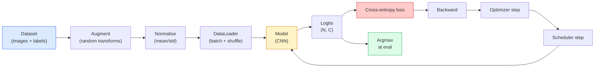

# Image Classification

> classifier 是一个从 pixels 到 classes 上的 probability distribution 的函数。其他一切都是管线工作。

**Type:** Build
**Languages:** Python
**Prerequisites:** Phase 2 Lesson 09 (Model Evaluation), Phase 3 Lesson 10 (Mini Framework), Phase 4 Lesson 03 (CNNs)
**Time:** ~75 minutes

## 学习目标

- 在 CIFAR-10 上构建端到端 image classification pipeline：dataset、augmentation、model、training loop、evaluation
- 解释每个组件的作用（dataloader、loss、optimizer、scheduler、augmentation），并预测其中任意一个出错会如何体现在 Loss 曲线上
- 从零实现 mixup、cutout 和 label smoothing，并说明什么时候值得加入它们
- 阅读 confusion matrix 和 per-class precision/recall table，用 aggregate accuracy 之外的信息诊断 dataset 与 model 的失败模式

## 问题

每一个最终上线的 vision task，在某种层面上都会归约为 image classification。Detection 会对 regions 做 classification。Segmentation 会对 pixels 做 classification。Retrieval 会按与 class centroids 的相似度排序。把 classification 做对，也就是把 dataset loop、augmentation policy、loss、evaluation 做对，是这一 Phase 中可以迁移到所有其他任务的核心能力。

大多数 classification bug 不在 model 里。它们藏在 pipeline 中：损坏的 normalisation、没有 shuffle 的 training set、会扭曲 labels 的 augmentation、被 training data 污染的 validation split、在 epoch 30 之后悄悄发散的 learning rate。一个在正确设置下能在 CIFAR-10 上达到 93% 的 CNN，在损坏的设置下通常只能得到 70-75%，而 Loss 曲线看起来全程都很合理。

本课会手工串起整个 pipeline，让每个部分都可以被检查。你不会使用 `torchvision.datasets` 中任何可能隐藏 bug 的东西。

## 核心概念

### Classification pipeline



这个循环中的每一条线都可能藏着 bug。Cross-entropy 接收 raw logits，而不是 softmax outputs，所以在 loss 之前做任何 `model(x).softmax()` 都会悄悄计算出错误的 Gradient。Augmentations 只应用于 inputs，不应用于 labels，除了 mixup，因为它会同时混合二者。`optimizer.zero_grad()` 必须每一步执行一次；跳过它会累积 Gradient，看起来就像 learning rate 极不稳定。这些 bug 中的每一个都会让 Learning 曲线变平，却不会抛出错误。

### Cross-entropy、logits 与 softmax

classifier 会为每张图像产生 `C` 个数字，称为 logits。应用 softmax 会把它们转换成 probability distribution：

```
softmax(z)_i = exp(z_i) / sum_j exp(z_j)
```

Cross-entropy 衡量正确 class 的 negative log probability：

```
CE(z, y) = -log( softmax(z)_y )
        = -z_y + log( sum_j exp(z_j) )
```

右侧形式是数值稳定的形式（log-sum-exp）。PyTorch 的 `nn.CrossEntropyLoss` 会在一个 op 中融合 softmax + NLL，并直接接收 raw logits。自己先应用 softmax 几乎总是 bug，因为你计算的是 log(softmax(softmax(z)))，这是一个没有意义的量。

### 为什么 augmentation 有效

CNN 对 translation 具有 inductive bias（来自 weight sharing），但对 crops、flips、colour jitter 或 occlusion 没有内建 invariance。教会它这些 invariances 的唯一方式，就是给它看能体现这些变化的 pixels。训练期间的每个 random transform 都是在表达：“这两张图像有相同的 label；学习那些能忽略差异的 features。”

```
Original crop:  "dog facing left"
Flip:           "dog facing right"       <- same label, different pixels
Rotate(+15):    "dog, slight tilt"
Colour jitter:  "dog in warmer light"
RandomErasing:  "dog with patch missing"
```

规则是：augmentation 必须保留 label。对 digit 做 cutout 和 rotation 可能会把 “6” 变成 “9”；对于这种 dataset，你要使用更小的 rotation ranges，并选择尊重 digit-specific invariances 的 augmentations。

### Mixup 与 cutmix

普通 augmentation 会转换 pixels，但保持 labels 为 one-hot。**Mixup** 和 **cutmix** 会通过同时插值二者来打破这一点。

```
Mixup:
  lambda ~ Beta(a, a)
  x = lambda * x_i + (1 - lambda) * x_j
  y = lambda * y_i + (1 - lambda) * y_j

Cutmix:
  paste a random rectangle of x_j into x_i
  y = area-weighted mix of y_i and y_j
```

它为什么有帮助：model 不再记忆尖锐的 one-hot targets，而是学习在 classes 之间插值。Training loss 会升高，test accuracy 会升高。它是任何 classifier 最便宜的 robustness upgrade。

### Label smoothing

mixup 的近亲。不要用 `[0, 0, 1, 0, 0]` 作为训练目标，而是用 `[eps/C, eps/C, 1-eps, eps/C, eps/C]`，其中 `eps` 是像 0.1 这样的小值。它阻止 model 产生任意尖锐的 logits，并且几乎零成本地改善 calibration。自 PyTorch 1.10 起，已内置于 `nn.CrossEntropyLoss(label_smoothing=0.1)`。

### Accuracy 之外的 evaluation

Aggregate accuracy 会掩盖 imbalance。一个 90-10 的 binary classifier 如果永远预测 majority class，也能得到 90%。真正告诉你发生了什么的工具是：

- **Per-class accuracy** — 每个 class 一个数字；会立即暴露表现不足的类别。
- **Confusion matrix** — C x C grid，其中 row i col j = true class i 被预测为 class j 的数量；diagonal 是正确预测，off-diagonals 才是 model 问题所在。
- **Top-1 / Top-5** — 正确 class 是否在 top 1 或 top 5 predictions 中；Top-5 对 ImageNet 很重要，因为像 “Norwich terrier” 和 “Norfolk terrier” 这样的 classes 确实存在歧义。
- **Calibration (ECE)** — 0.8 confidence 的预测是否真的有 80% 的时间是正确的？现代 networks 系统性地 over-confident；可以用 temperature scaling 或 label smoothing 修正。

## 构建它

### 步骤 1：确定性的 synthetic dataset

CIFAR-10 位于磁盘上。为了让本课可复现且快速，我们构建一个看起来像 CIFAR 的 synthetic dataset，也就是带有 class-specific structure、model 必须学习的 32x32 RGB images。完全相同的 pipeline 可以不加修改地用于真实 CIFAR-10。

```python
import numpy as np
import torch
from torch.utils.data import Dataset


def synthetic_cifar(num_per_class=1000, num_classes=10, seed=0):
    rng = np.random.default_rng(seed)
    X = []
    Y = []
    for c in range(num_classes):
        centre = rng.uniform(0, 1, (3,))
        freq = 2 + c
        for _ in range(num_per_class):
            yy, xx = np.meshgrid(np.linspace(0, 1, 32), np.linspace(0, 1, 32), indexing="ij")
            r = np.sin(xx * freq) * 0.5 + centre[0]
            g = np.cos(yy * freq) * 0.5 + centre[1]
            b = (xx + yy) * 0.5 * centre[2]
            img = np.stack([r, g, b], axis=-1)
            img += rng.normal(0, 0.08, img.shape)
            img = np.clip(img, 0, 1)
            X.append(img.astype(np.float32))
            Y.append(c)
    X = np.stack(X)
    Y = np.array(Y)
    idx = rng.permutation(len(X))
    return X[idx], Y[idx]


class ArrayDataset(Dataset):
    def __init__(self, X, Y, transform=None):
        self.X = X
        self.Y = Y
        self.transform = transform

    def __len__(self):
        return len(self.X)

    def __getitem__(self, i):
        img = self.X[i]
        if self.transform is not None:
            img = self.transform(img)
        img = torch.from_numpy(img).permute(2, 0, 1)
        return img, int(self.Y[i])
```

每个 class 都有自己的 colour palette 和 frequency pattern，再加上 Gaussian noise，迫使 model 学习 signal，而不是记忆 pixels。十个 classes，每类一千张 images，并进行 permutation。

### 步骤 2：Normalisation 与 augmentation

每个 vision pipeline 都有这两个 transforms。

```python
def standardize(mean, std):
    mean = np.array(mean, dtype=np.float32)
    std = np.array(std, dtype=np.float32)
    def _fn(img):
        return (img - mean) / std
    return _fn


def random_hflip(p=0.5):
    def _fn(img):
        if np.random.random() < p:
            return img[:, ::-1, :].copy()
        return img
    return _fn


def random_crop(pad=4):
    def _fn(img):
        h, w = img.shape[:2]
        padded = np.pad(img, ((pad, pad), (pad, pad), (0, 0)), mode="reflect")
        y = np.random.randint(0, 2 * pad)
        x = np.random.randint(0, 2 * pad)
        return padded[y:y + h, x:x + w, :]
    return _fn


def compose(*fns):
    def _fn(img):
        for fn in fns:
            img = fn(img)
        return img
    return _fn
```

在 crop 之前使用 reflect-pad，而不是 zero-pad，因为黑色边框是一种 signal，model 会学会以一种无用的方式忽略它。

### 步骤 3：Mixup

在 training step 内部混合两张 images 和两个 labels。它实现为 batch transform，因此它位于 forward pass 附近，而不是 dataset 内部。

```python
def mixup_batch(x, y, num_classes, alpha=0.2):
    if alpha <= 0:
        return x, torch.nn.functional.one_hot(y, num_classes).float()
    lam = float(np.random.beta(alpha, alpha))
    idx = torch.randperm(x.size(0), device=x.device)
    x_mixed = lam * x + (1 - lam) * x[idx]
    y_onehot = torch.nn.functional.one_hot(y, num_classes).float()
    y_mixed = lam * y_onehot + (1 - lam) * y_onehot[idx]
    return x_mixed, y_mixed


def soft_cross_entropy(logits, soft_targets):
    log_probs = torch.log_softmax(logits, dim=-1)
    return -(soft_targets * log_probs).sum(dim=-1).mean()
```

`soft_cross_entropy` 是针对 soft-label distribution 的 cross-entropy。当 target 恰好是 one-hot 时，它会退化为通常的 one-hot 情况。

### 步骤 4：Training loop

完整配方：遍历一次 data，每个 batch 计算一次 gradients，每个 epoch 执行一次 scheduler step。

```python
import torch
import torch.nn as nn
from torch.utils.data import DataLoader
from torch.optim import SGD
from torch.optim.lr_scheduler import CosineAnnealingLR

def train_one_epoch(model, loader, optimizer, device, num_classes, use_mixup=True):
    model.train()
    total, correct, loss_sum = 0, 0, 0.0
    for x, y in loader:
        x, y = x.to(device), y.to(device)
        if use_mixup:
            x_m, y_soft = mixup_batch(x, y, num_classes)
            logits = model(x_m)
            loss = soft_cross_entropy(logits, y_soft)
        else:
            logits = model(x)
            loss = nn.functional.cross_entropy(logits, y, label_smoothing=0.1)
        optimizer.zero_grad()
        loss.backward()
        optimizer.step()
        loss_sum += loss.item() * x.size(0)
        total += x.size(0)
        # Training accuracy vs the un-mixed labels `y` is only an approximation
        # when mixup is on (the model saw soft targets, not y). Treat it as a
        # rough progress signal; rely on val accuracy for real performance.
        with torch.no_grad():
            pred = logits.argmax(dim=-1)
            correct += (pred == y).sum().item()
    return loss_sum / total, correct / total


@torch.no_grad()
def evaluate(model, loader, device, num_classes):
    model.eval()
    total, correct = 0, 0
    loss_sum = 0.0
    cm = torch.zeros(num_classes, num_classes, dtype=torch.long)
    for x, y in loader:
        x, y = x.to(device), y.to(device)
        logits = model(x)
        loss = nn.functional.cross_entropy(logits, y)
        pred = logits.argmax(dim=-1)
        for t, p in zip(y.cpu(), pred.cpu()):
            cm[t, p] += 1
        loss_sum += loss.item() * x.size(0)
        total += x.size(0)
        correct += (pred == y).sum().item()
    return loss_sum / total, correct / total, cm
```

每次编写 training loop 时都要检查五个 invariants：

1. training 前调用 `model.train()`，evaluation 前调用 `model.eval()`，这会切换 dropout 和 batchnorm 行为。
2. 在 `.backward()` 前调用 `.zero_grad()`。
3. 累积 metrics 时使用 `.item()`，这样不会让 computation graph 一直存活。
4. evaluation 期间使用 `@torch.no_grad()`，节省内存和时间，防止细微事故。
5. 对 raw logits 做 argmax，而不是对 softmax 做 argmax，结果相同，少一个 op。

### 步骤 5：组装起来

使用上一课的 `TinyResNet`，训练几个 epochs，然后 evaluate。

```python
from main import synthetic_cifar, ArrayDataset
from main import standardize, random_hflip, random_crop, compose
from main import mixup_batch, soft_cross_entropy
from main import train_one_epoch, evaluate
# TinyResNet comes from the previous lesson (03-cnns-lenet-to-resnet).
# Adjust the import path to wherever you stored the previous lesson's code.
from cnns_lenet_to_resnet import TinyResNet  # example placeholder

X, Y = synthetic_cifar(num_per_class=500)
split = int(0.9 * len(X))
X_train, Y_train = X[:split], Y[:split]
X_val, Y_val = X[split:], Y[split:]

mean = [0.5, 0.5, 0.5]
std = [0.25, 0.25, 0.25]
train_tf = compose(random_hflip(), random_crop(pad=4), standardize(mean, std))
eval_tf = standardize(mean, std)

train_ds = ArrayDataset(X_train, Y_train, transform=train_tf)
val_ds = ArrayDataset(X_val, Y_val, transform=eval_tf)

train_loader = DataLoader(train_ds, batch_size=128, shuffle=True, num_workers=0)
val_loader = DataLoader(val_ds, batch_size=256, shuffle=False, num_workers=0)

device = "cuda" if torch.cuda.is_available() else "cpu"
model = TinyResNet(num_classes=10).to(device)
optimizer = SGD(model.parameters(), lr=0.1, momentum=0.9, weight_decay=5e-4, nesterov=True)
scheduler = CosineAnnealingLR(optimizer, T_max=10)

for epoch in range(10):
    tr_loss, tr_acc = train_one_epoch(model, train_loader, optimizer, device, 10, use_mixup=True)
    va_loss, va_acc, _ = evaluate(model, val_loader, device, 10)
    scheduler.step()
    print(f"epoch {epoch:2d}  lr {scheduler.get_last_lr()[0]:.4f}  "
          f"train {tr_loss:.3f}/{tr_acc:.3f}  val {va_loss:.3f}/{va_acc:.3f}")
```

在 synthetic dataset 上，它会在五个 epochs 内达到接近完美的 validation accuracy，这正是重点：pipeline 是正确的，model 能学会可学习的东西。把 dataset 替换为真实 CIFAR-10，同一个 loop 不做修改也能训练到 ~90%。

### 步骤 6：阅读 confusion matrix

单靠 accuracy 永远无法告诉你 model 在哪里失败。confusion matrix 可以。

```python
def print_confusion(cm, labels=None):
    c = cm.shape[0]
    labels = labels or [str(i) for i in range(c)]
    print(f"{'':>6}" + "".join(f"{l:>5}" for l in labels))
    for i in range(c):
        row = cm[i].tolist()
        print(f"{labels[i]:>6}" + "".join(f"{v:>5}" for v in row))
    print()
    tp = cm.diag().float()
    fp = cm.sum(dim=0).float() - tp
    fn = cm.sum(dim=1).float() - tp
    prec = tp / (tp + fp).clamp_min(1)
    rec = tp / (tp + fn).clamp_min(1)
    f1 = 2 * prec * rec / (prec + rec).clamp_min(1e-9)
    for i in range(c):
        print(f"{labels[i]:>6}  prec {prec[i]:.3f}  rec {rec[i]:.3f}  f1 {f1[i]:.3f}")

_, _, cm = evaluate(model, val_loader, device, 10)
print_confusion(cm)
```

行是真实 classes，列是 predictions。classes 3 和 5 之间出现一簇 off-diagonal counts，意味着 model 混淆了这两类，并为定向 data collection 或 class-specific augmentation 提供了起点。

## 使用它

`torchvision` 会把上面的所有内容包装成惯用组件。对于真实 CIFAR-10，完整 pipeline 只需要四行，再加一个 training loop。

```python
from torchvision.datasets import CIFAR10
from torchvision.transforms import Compose, RandomCrop, RandomHorizontalFlip, ToTensor, Normalize

mean = (0.4914, 0.4822, 0.4465)
std = (0.2470, 0.2435, 0.2616)
train_tf = Compose([
    RandomCrop(32, padding=4, padding_mode="reflect"),
    RandomHorizontalFlip(),
    ToTensor(),
    Normalize(mean, std),
])
eval_tf = Compose([ToTensor(), Normalize(mean, std)])

train_ds = CIFAR10(root="./data", train=True,  download=True, transform=train_tf)
val_ds   = CIFAR10(root="./data", train=False, download=True, transform=eval_tf)
```

有两点要注意：mean/std 是 **dataset-specific** 的，它们是在 CIFAR-10 training set 上计算出来的，而不是 ImageNet；reflect pad 是社区默认的 crop policy。在这里复制粘贴 ImageNet stats 会造成约 ~1% 的 accuracy leak，而这类问题通常要到有人 profile model 时才会被发现。

## 交付它

本课会产出：

- `outputs/prompt-classifier-pipeline-auditor.md` — 一个 prompt，用于审计 training script 是否满足上面的五个 invariants，并暴露第一个 violation。
- `outputs/skill-classification-diagnostics.md` — 一个 skill，给定 confusion matrix 和 class names 列表后，总结 per-class failures，并提出最有影响力的单个修复。

## 练习

1. **(Easy)** 在 synthetic dataset 上，用同一个 model 分别训练有 mixup 和无 mixup 的版本，各训练五个 epochs。绘制两者的 train loss 和 val loss。解释为什么带 mixup 的 train loss 更高，但 val accuracy 相近或更好。
2. **(Medium)** 实现 Cutout：在每张 training image 中随机把一个 8x8 方块置零，并运行 ablation，对比 no augmentation、hflip+crop、hflip+crop+cutout、hflip+crop+mixup。报告每种设置的 val accuracy。
3. **(Hard)** 构建 CIFAR-100 pipeline（100 classes，相同 input size），并复现一次 ResNet-34 training run，使结果与 published accuracy 的差距在 1% 以内。额外任务：sweep 三个 learning rates 和两个 weight decays，记录到本地 CSV，并生成最终的 confusion-matrix-top-confusions table。

## 关键术语

| Term | 人们通常怎么说 | 它实际是什么意思 |
|------|----------------|----------------------|
| Logits | “Raw outputs” | 每张图像对应的 pre-softmax C 维 Vector；cross-entropy 期望接收它们，而不是 softmaxed values |
| Cross-entropy | “The loss” | 正确 class 的 negative log-probability；在一个稳定 op 中结合 log-softmax 和 NLL |
| DataLoader | “The batcher” | 用 shuffling、batching 和（可选）multi-worker loading 包装 dataset；一半 training bugs 都会被怪到它头上 |
| Augmentation | “Random transforms” | training time 的任何 pixel-level transform，只要它保留 label；教会 CNN 它原生不具备的 invariances |
| Mixup / Cutmix | “Mix two images” | 同时混合 inputs 和 labels，让 classifier 学习平滑插值，而不是硬边界 |
| Label smoothing | “Softer targets” | 用 (1-eps, eps/(C-1), ...) 替换 one-hot；改善 calibration，并略微提升 accuracy |
| Top-k accuracy | “Top-5” | 正确 class 位于 k 个最高 probability predictions 之中；用于包含真实歧义 classes 的 datasets |
| Confusion matrix | “Where errors live” | C x C table，其中 entry (i, j) 统计 true class i 被预测为 j 的 images 数量；diagonal 是正确项，off-diagonal 告诉你该修什么 |

## 延伸阅读

- [CS231n: Training Neural Networks](https://cs231n.github.io/neural-networks-3/) — 仍然是对 training pipeline 最清晰的单页导览
- [Bag of Tricks for Image Classification (He et al., 2019)](https://arxiv.org/abs/1812.01187) — 所有小技巧合在一起，可以让 ImageNet 上的 ResNet accuracy 增加 3-4%
- [mixup: Beyond Empirical Risk Minimization (Zhang et al., 2017)](https://arxiv.org/abs/1710.09412) — 最初的 mixup paper；三页理论加上有说服力的实验
- [Why temperature scaling matters (Guo et al., 2017)](https://arxiv.org/abs/1706.04599) — 这篇 paper 证明了现代 networks 存在 miscalibration，并用一个 scalar parameter 修正了它
