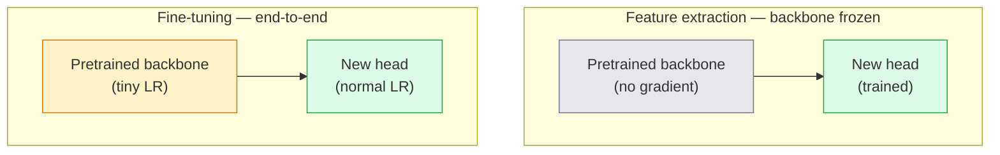

# Transfer Learning 与 Fine-Tuning

> 别人已经花了上百万 GPU 小时，教会一个 Neural Network 识别边缘、纹理和物体部件是什么样子。在训练你自己的模型之前，你应该借用这些 features。

**Type:** Build
**Languages:** Python
**Prerequisites:** Phase 4 Lesson 03 (CNNs), Phase 4 Lesson 04 (Image Classification)
**Time:** ~75 minutes

## 学习目标
- 区分 feature extraction 和 fine-tuning，并根据 dataset size、domain distance 和 compute budget 选择合适方法
- 加载 pretrained backbone，替换其 classifier head，并在 20 行以内只训练 head 得到可用 baseline
- 使用 discriminative learning rates 逐步解冻 layers，让早期 generic features 的更新幅度小于后期 task-specific features
- 诊断三类常见失败：unfrozen blocks 上 LR 过高导致的 feature drift、tiny datasets 上的 BN statistics collapse，以及 catastrophic forgetting

## 问题
在 ImageNet 上训练一个 ResNet-50 大约需要 2,000 GPU-hours。很少有团队能为每个要上线的任务承担这种预算。几乎所有团队真正上线的，都是一个 pretrained backbone 加上一个新 head，而这个 head 是在几百或几千张 task-specific images 上训练的。

这不是捷径。任何在 ImageNet 上训练过的 CNN，其第一个 conv block 都会学习 edges 和类似 Gabor 的 filters。接下来的几个 blocks 学习 textures 和简单 motifs。中间 blocks 学习 object parts。最后的 blocks 学习开始接近 1,000 个 ImageNet categories 的组合。这个层级结构的前 90% 几乎可以原样 transfer 到 medical imaging、industrial inspection、satellite data，以及其他每一种 vision task，因为自然界的 edges 和 textures 词汇量是有限的。最后 10% 才是你真正需要训练的部分。

做好 transfer 有三个 bug 在等着你：用过高 learning rate 破坏 pretrained features；冻结过多导致 model 信息不足；让 BatchNorm 的 running statistics 漂移到一个 tiny dataset 上，而 Neural Network 的其余部分从未从这个 dataset 学到过东西。本课会有意带你逐个走过这些问题。

## 概念
### 特征提取 vs fine-tuning

两种模式，取决于你有多信任 pretrained features，以及你有多少数据。



经验法则：

| Dataset size | Domain distance | Recipe |
|--------------|-----------------|--------|
| < 1k images | 接近 ImageNet | 冻结 backbone，只训练 head |
| 1k-10k | 接近 | 冻结前 2-3 个 stages，fine-tune 其余部分 |
| 10k-100k | 任意 | 使用 discriminative LR 进行 end-to-end fine-tune |
| 100k+ | 远 | Fine-tune 全部参数；如果 domain 足够远，考虑从零训练 |

“接近 ImageNet”大致意味着带有 object-like content 的自然 RGB photos。Medical CT scans、overhead satellite imagery 和 microscopy 属于 far domains，features 仍然有帮助，但你需要允许更多 layers 适应。

### Why freezing works at all

CNN 学到的 ImageNet features 并不是专门针对这 1,000 个 categories 的。它们专门适配的是自然图像的统计特性：特定方向的 edges、textures、contrast patterns、shape primitives。这些统计特性在人类能说出的几乎每个视觉 domain 中都很稳定。这就是为什么一个在 ImageNet 上训练的 model，在 CIFAR-10 上 zero-shot 评估时，只加一个新的 linear head（不 fine-tune backbone）就能达到 80%+ accuracy。head 学到的是：在这个任务中，应该如何给那些已经学到的 features 加权。

### Discriminative learning rates

当你确实解冻时，early layers 应该比 late layers 训练得更慢。Early layers 编码的是你想保留的 generic features；late layers 编码的是你需要大幅调整的 task-specific structure。

```
Typical recipe:

  stage 0 (stem + first group): lr = base_lr / 100    (mostly fixed)
  stage 1:                       lr = base_lr / 10
  stage 2:                       lr = base_lr / 3
  stage 3 (last backbone group): lr = base_lr
  head:                          lr = base_lr  (or slightly higher)
```

在 PyTorch 中，这只是传给 Optimizer 的 parameter groups 列表。一个 model，五个 learning rates，零额外代码。

### The BatchNorm problem

BN layers 持有在 ImageNet 上计算得到的 `running_mean` 和 `running_var` buffers。如果你的任务有不同的 pixel distribution，例如不同 lighting、不同 sensor、不同 colour space，那么这些 buffers 就是错的。按优先级有三个选项：

1. **在 train mode 下 fine-tune BN。** 让 BN 随其他部分一起更新 running statistics。当任务 dataset 中等大小（>= 5k examples）时，这是默认选择。
2. **在 eval mode 下冻结 BN。** 保留 ImageNet statistics，只训练 weights。当你的 dataset 小到 BN 的 moving average 会很嘈杂时，这是正确选择。
3. **用 GroupNorm 替换 BN。** 完全移除 moving-average 问题。用于 detection 和 segmentation backbones，因为每个 GPU 上的 batch size 很小。

这里做错会悄悄让 accuracy 下降 5-15%。

### Head design

classifier head 是 1-3 个 linear layers 加一个可选 dropout。每个 torchvision backbone 都自带一个默认 head，你需要替换它：

```
backbone.fc = nn.Linear(backbone.fc.in_features, num_classes)          # ResNet
backbone.classifier[1] = nn.Linear(..., num_classes)                    # EfficientNet, MobileNet
backbone.heads.head = nn.Linear(..., num_classes)                       # torchvision ViT
```

对于 small datasets，一个 single linear layer 通常就足够了。当 task distribution 和 backbone 的 training distribution 相距更远时，添加 hidden layer（Linear -> ReLU -> Dropout -> Linear）会有帮助。

### Layer-wise LR decay

这是现代 fine-tuning（BEiT、DINOv2、ViT-B fine-tunes）中使用的 discriminative LR 的更平滑版本。不是把 layers 分到 stages，而是让每一层的 LR 都比它上一层略小：

```
lr_layer_k = base_lr * decay^(L - k)
```

当 decay = 0.75 且 L = 12 transformer blocks 时，第一个 block 的训练 LR 是 head LR 的 `0.75^11 ≈ 0.04x`。这对 transformer fine-tunes 比对 CNNs 更重要；对于 CNNs，stage-grouped LRs 通常已经足够。

### What to evaluate

Transfer-learning runs 需要两个你在 scratch run 中不会跟踪的数字：

- **Pretrained-only accuracy** — backbone 冻结时 head 的 accuracy。这是你的 floor。
- **Fine-tuned accuracy** — end-to-end training 后同一个 model 的 accuracy。这是你的 ceiling。

如果 fine-tuned 低于 pretrained-only，你就有 learning-rate 或 BN bug。始终打印两者。

```figure
transfer-learning
```

## 构建它
### 步骤 1： Load a pretrained backbone and inspect it

```python
import torch
import torch.nn as nn
from torchvision.models import resnet18, ResNet18_Weights

backbone = resnet18(weights=ResNet18_Weights.IMAGENET1K_V1)
print(backbone)
print()
print("classifier head:", backbone.fc)
print("feature dim:", backbone.fc.in_features)
```

`ResNet18` 有四个 stages（`layer1..layer4`），外加一个 stem 和一个 `fc` head。每个 torchvision classification backbone 都有类似结构。

### 步骤 2： Feature extraction — freeze everything, replace the head

```python
def make_feature_extractor(num_classes=10):
    model = resnet18(weights=ResNet18_Weights.IMAGENET1K_V1)
    for p in model.parameters():
        p.requires_grad = False
    model.fc = nn.Linear(model.fc.in_features, num_classes)
    return model

model = make_feature_extractor(num_classes=10)
trainable = sum(p.numel() for p in model.parameters() if p.requires_grad)
frozen = sum(p.numel() for p in model.parameters() if not p.requires_grad)
print(f"trainable: {trainable:>10,}")
print(f"frozen:    {frozen:>10,}")
```

只有 `model.fc` 是 trainable。backbone 是一个 frozen feature extractor。

### 步骤 3： Discriminative fine-tuning

一个 utility，用于构建带有 stage-specific learning rates 的 parameter groups。

```python
def discriminative_param_groups(model, base_lr=1e-3, decay=0.3):
    stages = [
        ["conv1", "bn1"],
        ["layer1"],
        ["layer2"],
        ["layer3"],
        ["layer4"],
        ["fc"],
    ]
    groups = []
    for i, names in enumerate(stages):
        lr = base_lr * (decay ** (len(stages) - 1 - i))
        params = [p for n, p in model.named_parameters()
                  if any(n.startswith(k) for k in names)]
        if params:
            groups.append({"params": params, "lr": lr, "name": "_".join(names)})
    return groups

model = resnet18(weights=ResNet18_Weights.IMAGENET1K_V1)
model.fc = nn.Linear(model.fc.in_features, 10)
for p in model.parameters():
    p.requires_grad = True

groups = discriminative_param_groups(model)
for g in groups:
    print(f"{g['name']:>10s}  lr={g['lr']:.2e}  params={sum(p.numel() for p in g['params']):>8,}")
```

`decay=0.3` 表示每个 stage 的训练速率都是下一个 stage 的 30%。`fc` 得到 `base_lr`，`layer4` 得到 `0.3 * base_lr`，`conv1` 得到 `0.3^5 * base_lr ≈ 0.00243 * base_lr`。听起来很极端；经验上它确实有效。

### 步骤 4： BatchNorm handling

用于冻结 BN running statistics 而不冻结其 weights 的 helper。

```python
def freeze_bn_stats(model):
    for m in model.modules():
        if isinstance(m, (nn.BatchNorm1d, nn.BatchNorm2d, nn.BatchNorm3d)):
            m.eval()
            for p in m.parameters():
                p.requires_grad = False
    return model
```

在每个 epoch 开始时设置 `model.train()` 之后调用它。`model.train()` 会把所有内容切到 training mode；这个函数只会对 BN layers 反向切回去。

### 步骤 5： A minimal end-to-end fine-tuning loop

```python
from torch.optim import SGD
from torch.utils.data import DataLoader
from torch.optim.lr_scheduler import CosineAnnealingLR
import torch.nn.functional as F

def fine_tune(model, train_loader, val_loader, device, epochs=5, base_lr=1e-3, freeze_bn=False):
    model = model.to(device)
    groups = discriminative_param_groups(model, base_lr=base_lr)
    optimizer = SGD(groups, momentum=0.9, weight_decay=1e-4, nesterov=True)
    scheduler = CosineAnnealingLR(optimizer, T_max=epochs)

    for epoch in range(epochs):
        model.train()
        if freeze_bn:
            freeze_bn_stats(model)
        tr_loss, tr_correct, tr_total = 0.0, 0, 0
        for x, y in train_loader:
            x, y = x.to(device), y.to(device)
            logits = model(x)
            loss = F.cross_entropy(logits, y, label_smoothing=0.1)
            optimizer.zero_grad()
            loss.backward()
            optimizer.step()
            tr_loss += loss.item() * x.size(0)
            tr_total += x.size(0)
            tr_correct += (logits.argmax(-1) == y).sum().item()
        scheduler.step()

        model.eval()
        va_total, va_correct = 0, 0
        with torch.no_grad():
            for x, y in val_loader:
                x, y = x.to(device), y.to(device)
                pred = model(x).argmax(-1)
                va_total += x.size(0)
                va_correct += (pred == y).sum().item()
        print(f"epoch {epoch}  train {tr_loss/tr_total:.3f}/{tr_correct/tr_total:.3f}  "
              f"val {va_correct/va_total:.3f}")
    return model
```

使用上面的 recipe 在 CIFAR-10 上训练五个 epochs，可以把 `ResNet18-IMAGENET1K_V1` 从约 70% zero-shot linear-probe accuracy 提升到约 93% fine-tuned accuracy。如果只训练 head 而完全不动 backbone，accuracy 会在约 86% 进入 plateau。

### 步骤 6： Progressive unfreezing

一种从末端向前端每个 epoch 解冻一个 stage 的 schedule。它以额外 epochs 为代价缓解 feature drift。

```python
def progressive_unfreeze_schedule(model):
    stages = ["layer4", "layer3", "layer2", "layer1"]
    yielded = set()

    def start():
        for p in model.parameters():
            p.requires_grad = False
        for p in model.fc.parameters():
            p.requires_grad = True

    def unfreeze(epoch):
        if epoch < len(stages):
            name = stages[epoch]
            yielded.add(name)
            for n, p in model.named_parameters():
                if n.startswith(name):
                    p.requires_grad = True
            return name
        return None

    return start, unfreeze
```

在第一个 epoch 之前调用一次 `start()`。在每个 epoch 开始时调用 `unfreeze(epoch)`。每当 trainable parameters 集合发生变化时，都要重建 Optimizer，否则 frozen params 仍然持有 cached moments，会干扰它。

## 使用它
对于大多数真实任务，`torchvision.models` 加三行代码就足够了。上面更重的机制，只有在你遇到 library defaults 无法解决的问题时才重要。

```python
from torchvision.models import resnet50, ResNet50_Weights

model = resnet50(weights=ResNet50_Weights.IMAGENET1K_V2)
model.fc = nn.Linear(model.fc.in_features, num_classes)
optimizer = torch.optim.AdamW(model.parameters(), lr=1e-4, weight_decay=1e-4)
```

另外两个 production-grade defaults：

- `timm` 提供约 800 个 pretrained vision backbones，并带有一致的 API（`timm.create_model("resnet50", pretrained=True, num_classes=10)`）。对于 torchvision zoo 之外的任何 fine-tune，它都是标准选择。
- 对于 transformers，`transformers.AutoModelForImageClassification.from_pretrained(name, num_labels=N)` 会给你 ViT / BEiT / DeiT，并且 loading semantics 与 text models 相同。

## 交付它
本课会产出：

- `outputs/prompt-fine-tune-planner.md` — 一个 prompt，会根据 dataset size、domain distance 和 compute budget 选择 feature-extraction、progressive fine-tuning 或 end-to-end fine-tuning。
- `outputs/skill-freeze-inspector.md` — 一个 skill，给定 PyTorch model 后，会报告哪些 parameters 是 trainable，哪些 BatchNorm layers 处于 eval mode，以及 Optimizer 是否真的拿到了 trainable parameters。

## 练习
1. **(Easy)** 在同一个 synthetic-CIFAR dataset 上，将 `ResNet18` 分别作为 linear probe（backbone frozen）和 full fine-tune 进行训练。并排报告两者 accuracy。解释哪个 gap 说明 features transfer 效果好，哪个 gap 说明效果不好。
2. **(Medium)** 有意引入一个 bug：把 backbone stage 上的 `base_lr = 1e-1`，而不是 head 上。展示 training loss 爆炸，然后通过应用 `discriminative_param_groups` helper 恢复。记录每个 stage 开始发散时的 LR。
3. **(Hard)** 选取一个 medical imaging dataset（例如 CheXpert-small、PatchCamelyon 或 HAM10000），比较三种 regime：(a) ImageNet-pretrained frozen backbone + linear head；(b) ImageNet-pretrained end-to-end fine-tune；(c) scratch training。报告每种方法的 accuracy 和 compute cost。在什么 dataset size 下，scratch training 开始具备竞争力？

## 关键术语
| Term | What people say | What it actually means |
|------|----------------|----------------------|
| Feature extraction | “Freeze and train head” | Backbone parameters 冻结，只有新的 classifier head 接收 Gradient |
| Fine-tuning | “Retrain end-to-end” | 所有 parameters 都 trainable，通常使用比 scratch training 小得多的 LR |
| Discriminative LR | “Smaller LR for early layers” | Optimizer parameter groups，其中 early-stage LR 是 late-stage LR 的一部分 |
| Layer-wise LR decay | “Smooth LR gradient” | 每层 LR 乘以 decay^(L - k)；常见于 transformer fine-tunes |
| Catastrophic forgetting | “The model lost ImageNet” | 过高 LR 在新任务信号被学到之前覆盖了 pretrained features |
| BN statistics drift | “Running mean is wrong” | BatchNorm running_mean/var 是在不同于当前任务的 distribution 上计算的，会悄悄损害 accuracy |
| Linear probe | “Frozen backbone + linear head” | 对 pretrained features 的评估，即 frozen representation 之上最佳 linear classifier 的 accuracy |
| Catastrophic collapse | “Everything predicts one class” | 当 fine-tuning 的 LR 高到在 head 的 Gradient 能稳定之前就破坏 features 时发生 |

## 延伸阅读
- [How transferable are features in deep neural networks? (Yosinski et al., 2014)](https://arxiv.org/abs/1411.1792) — 这篇论文量化了 features 在不同 layers 之间的 transferability
- [Universal Language Model Fine-tuning (ULMFiT, Howard & Ruder, 2018)](https://arxiv.org/abs/1801.06146) — 最初的 discriminative LR / progressive unfreezing recipe；这些思想可以直接 transfer 到 vision
- [timm documentation](https://huggingface.co/docs/timm) — 现代 vision backbones 以及其训练时精确 fine-tune defaults 的参考
- [A Simple Framework for Linear-Probe Evaluation (Kornblith et al., 2019)](https://arxiv.org/abs/1805.08974) — 为什么 linear-probe accuracy 很重要，以及如何正确报告它
