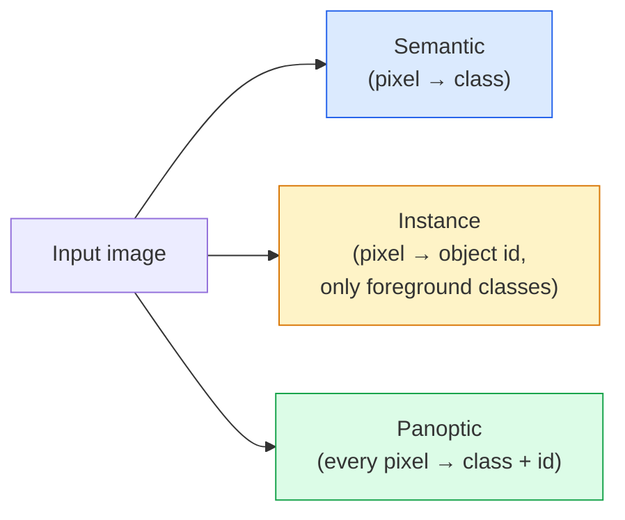
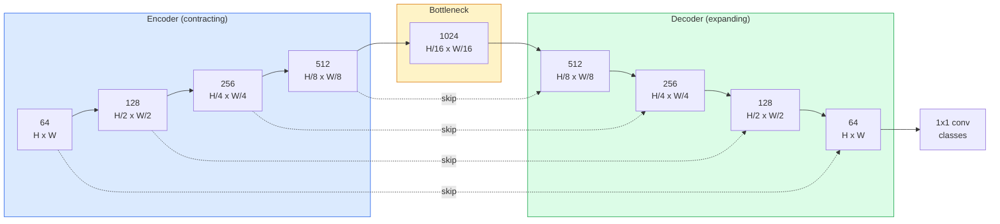

# Semantic Segmentation — U-Net

> Segmentation 是对每个 pixel 进行 Classification。U-Net 通过将下采样 encoder 与上采样 decoder 配对，并在二者之间连接 skip connections，使这件事变得可行。

**Type:** Build
**Languages:** Python
**Prerequisites:** Phase 4 Lesson 03 (CNNs), Phase 4 Lesson 04 (Image Classification)
**Time:** ~75 minutes

## 学习目标
- 区分 semantic、instance 和 panoptic segmentation，并为给定问题选择正确任务
- 在 PyTorch 中从零构建 U-Net，包含 encoder blocks、bottleneck、带 transposed convolutions 的 decoder，以及 skip connections
- 实现 pixel-wise cross-entropy、Dice loss，以及当前 medical 和 industrial segmentation 的默认 combined loss
- 按 class 解读 IoU 和 Dice metrics，并诊断低分是来自 small-object recall、boundary accuracy，还是 class imbalance

## 问题
Classification 对每张 image 输出一个 label。Detection 对每张 image 输出少量 boxes。Segmentation 对每个 pixel 输出一个 label。对于大小为 `H x W` 的 input，output 是形状为 `H x W`（semantic）或 `H x W x N_instances`（instance）的 tensor。这意味着每张 image 有数百万个 predictions，而不是一个。

Segmentation 的结构解释了为什么它支撑几乎所有 dense-prediction vision 产品：medical imaging（tumour masks）、autonomous driving（road、lane、obstacle）、satellite（building footprints、crop boundaries）、document parsing（layout zones）、robotics（graspable regions）。这些任务都无法通过给 object 画一个 box 来解决；它们需要精确的 silhouette。

架构问题说起来简单，但解决起来并不简单：你需要 network 同时看到 image 的 global context（这是什么类型的 scene）和 local pixel detail（究竟哪个 pixel 是 road，哪个是 pavement）。标准 CNN 会在 spatial 维度上压缩以获得 context，但这会丢失 detail。U-Net 是同时获得二者的设计。

## 概念
### 语义 vs 实例 vs 全景



- **Semantic** 表示“这个 pixel 是 road，那个 pixel 是 car。”相邻的两辆 car 会合并成一个 blob。
- **Instance** 表示“这个 pixel 是 car #3，那个 pixel 是 car #5。”忽略 background stuff（“stuff” = sky、road、grass）。
- **Panoptic** 将二者统一起来：每个 pixel 都得到一个 class label，每个 instance 都得到一个唯一 id，stuff 和 things 都被 segmented。

本课涵盖 semantic。下一课（Mask R-CNN）涵盖 instance。

### The U-Net shape



Encoder 将 spatial resolution 减半四次，并将 channels 翻倍。Decoder 反向执行：将 spatial resolution 翻倍四次，并将 channels 减半。Skip connections 会在每个 resolution 上把匹配的 encoder features 与 decoder features 进行 concatenate。最终的 1x1 conv 在 full resolution 下将 `64 -> num_classes`。

为什么 skip connections 是必要的：当 decoder 尝试输出 pixel-level predictions 时，它只见过很小的 feature maps。没有 skips，它无法准确 localise edges，因为这些信息已经在 encoder 中被压缩掉了。Skip connections 把 encoder 在下采样过程中计算出的 high-resolution feature maps 交给它。

### Transposed vs bilinear upsample

Decoder 必须扩展 spatial dimensions。有两种选择：

- **Transposed convolution** (`nn.ConvTranspose2d`) — 可学习的 upsample。历史上的 U-Net 默认方案。如果 stride 和 kernel size 不能整除，可能产生 checkerboard artifacts。
- **Bilinear upsample + 3x3 conv** — 平滑 upsample 后接一个 conv。Artifacts 更少，parameters 更少，现在是现代默认方案。

二者在实际项目中都能见到。对于第一个 U-Net，bilinear 更稳妥。

### pixel grid 上的 Cross-entropy

对于包含 C 个 classes 的 semantic segmentation，model output 是 `(N, C, H, W)`。Target 是 `(N, H, W)`，包含 integer class IDs。Cross-entropy 与 Classification 场景完全相同，只是应用在每个 spatial position 上：

```
Loss = mean over (n, h, w) of -log( softmax(logits[n, :, h, w])[target[n, h, w]] )
```

PyTorch 中的 `F.cross_entropy` 原生处理这种 shape。不需要 reshape。

### Dice loss 以及为什么需要它

Cross-entropy 平等对待每个 pixel。当一个 class 占据 frame 的绝大部分时，这是错误的（medical imaging：99% background，1% tumour）。Network 可以通过在所有位置预测 background 得到 99% accuracy，但仍然毫无用处。

Dice loss 通过直接优化 predicted mask 与 true mask 之间的 overlap 来解决这个问题：

```
Dice(p, y) = 2 * sum(p * y) / (sum(p) + sum(y) + epsilon)
Dice_loss = 1 - Dice
```

其中 `p` 是某个 class 的 sigmoid/softmax probability map，`y` 是 binary ground-truth mask。只有当 overlap 完美时，loss 才为零。因为它基于 ratio，class imbalance 不再相关。

实践中，使用 **combined loss**：

```
L = L_cross_entropy + lambda * L_dice       (lambda ~ 1)
```

Cross-entropy 在 training 早期提供稳定的 Gradient；Dice 将 training 后段聚焦在真正匹配 mask shape 上。这个组合是 medical-imaging 的默认方案，在任何 class-imbalanced dataset 上都很难被超越。

### Evaluation metrics

- **Pixel accuracy** — 预测正确的 pixels 百分比。计算便宜。与 Classification 中的 accuracy 一样，在 imbalanced data 上会失效。
- **IoU per class** — 每个 class mask 的 intersection over union；跨 classes 求平均 = mIoU。
- **Dice (F1 on pixels)** — 类似 IoU；`Dice = 2 * IoU / (1 + IoU)`。Medical imaging 更偏好 Dice，driving community 更偏好 IoU；二者单调相关。
- **Boundary F1** — 衡量 predicted boundaries 与 ground-truth boundaries 的接近程度，即使是小幅偏移也会被惩罚。对 semiconductor inspection 等 high-precision tasks 很重要。

报告 IoU per class，而不只是 mIoU。Mean IoU 会掩盖一个 class 只有 15%、而其他九个 class 都有 85% 的情况。

### Input resolution 权衡

U-Net 的 encoder 会将 resolution 减半四次，所以 input 必须能被 16 整除。Medical images 通常是 512x512 或 1024x1024。Autonomous-driving crops 是 2048x1024。U-Net 的 memory cost 随 `H * W * C_max` 缩放，在 1024x1024 且 bottleneck channels 为 1024 时，forward pass 已经会使用数 GB VRAM。

两个标准 workaround：
1. Tile the input — 处理带 overlap 的 256x256 tiles，然后 stitch。
2. 用 dilated convolutions 替换 bottleneck，在保持更高 spatial resolution 的同时扩大 receptive field（DeepLab family）。

对于第一个 model，使用 256x256 input 和 64-channel-base U-Net 可以在 8 GB VRAM 上舒适训练。

## 构建它
### 步骤 1： Encoder block

两个 3x3 convs，带 batch norm 和 ReLU。第一个 conv 改变 channel count；第二个保持不变。

```python
import torch
import torch.nn as nn
import torch.nn.functional as F

class DoubleConv(nn.Module):
    def __init__(self, in_c, out_c):
        super().__init__()
        self.net = nn.Sequential(
            nn.Conv2d(in_c, out_c, kernel_size=3, padding=1, bias=False),
            nn.BatchNorm2d(out_c),
            nn.ReLU(inplace=True),
            nn.Conv2d(out_c, out_c, kernel_size=3, padding=1, bias=False),
            nn.BatchNorm2d(out_c),
            nn.ReLU(inplace=True),
        )

    def forward(self, x):
        return self.net(x)
```

这个 block 会在全程复用。`bias=False` 是因为 BN 的 beta 已经处理了 bias。

### 步骤 2： Down and up blocks

```python
class Down(nn.Module):
    def __init__(self, in_c, out_c):
        super().__init__()
        self.net = nn.Sequential(
            nn.MaxPool2d(2),
            DoubleConv(in_c, out_c),
        )

    def forward(self, x):
        return self.net(x)


class Up(nn.Module):
    def __init__(self, in_c, out_c):
        super().__init__()
        self.up = nn.Upsample(scale_factor=2, mode="bilinear", align_corners=False)
        self.conv = DoubleConv(in_c, out_c)

    def forward(self, x, skip):
        x = self.up(x)
        if x.shape[-2:] != skip.shape[-2:]:
            x = F.interpolate(x, size=skip.shape[-2:], mode="bilinear", align_corners=False)
        x = torch.cat([skip, x], dim=1)
        return self.conv(x)
```

只检查 spatial shape（`shape[-2:]`）可以处理 dimensions 不能被 16 整除的 inputs；一个安全的 `F.interpolate` 会在 concat 前对齐 tensor。比较完整 shape 也会因 channel-count differences 触发，而这类差异应该是明确报错，不应该被静默 interpolate。

### 步骤 3： The U-Net

```python
class UNet(nn.Module):
    def __init__(self, in_channels=3, num_classes=2, base=64):
        super().__init__()
        self.inc = DoubleConv(in_channels, base)
        self.d1 = Down(base, base * 2)
        self.d2 = Down(base * 2, base * 4)
        self.d3 = Down(base * 4, base * 8)
        self.d4 = Down(base * 8, base * 16)
        self.u1 = Up(base * 16 + base * 8, base * 8)
        self.u2 = Up(base * 8 + base * 4, base * 4)
        self.u3 = Up(base * 4 + base * 2, base * 2)
        self.u4 = Up(base * 2 + base, base)
        self.outc = nn.Conv2d(base, num_classes, kernel_size=1)

    def forward(self, x):
        x1 = self.inc(x)
        x2 = self.d1(x1)
        x3 = self.d2(x2)
        x4 = self.d3(x3)
        x5 = self.d4(x4)
        x = self.u1(x5, x4)
        x = self.u2(x, x3)
        x = self.u3(x, x2)
        x = self.u4(x, x1)
        return self.outc(x)

net = UNet(in_channels=3, num_classes=2, base=32)
x = torch.randn(1, 3, 256, 256)
print(f"output: {net(x).shape}")
print(f"params: {sum(p.numel() for p in net.parameters()):,}")
```

Output shape `(1, 2, 256, 256)` — 与 input 的 spatial size 相同，包含 `num_classes` 个 channels。在 `base=32` 时约 7.7M parameters。

### 步骤 4： Losses

```python
def dice_loss(logits, targets, num_classes, eps=1e-6):
    probs = F.softmax(logits, dim=1)
    targets_one_hot = F.one_hot(targets, num_classes).permute(0, 3, 1, 2).float()
    dims = (0, 2, 3)
    intersection = (probs * targets_one_hot).sum(dim=dims)
    denom = probs.sum(dim=dims) + targets_one_hot.sum(dim=dims)
    dice = (2 * intersection + eps) / (denom + eps)
    return 1 - dice.mean()


def combined_loss(logits, targets, num_classes, lam=1.0):
    ce = F.cross_entropy(logits, targets)
    dc = dice_loss(logits, targets, num_classes)
    return ce + lam * dc, {"ce": ce.item(), "dice": dc.item()}
```

Dice 按 class 计算后再平均（macro Dice）。`eps` 防止 batch 中缺失某些 classes 时出现除零。

### 步骤 5： IoU metric

```python
@torch.no_grad()
def iou_per_class(logits, targets, num_classes):
    preds = logits.argmax(dim=1)
    ious = torch.zeros(num_classes)
    for c in range(num_classes):
        pred_c = (preds == c)
        true_c = (targets == c)
        inter = (pred_c & true_c).sum().float()
        union = (pred_c | true_c).sum().float()
        ious[c] = (inter / union) if union > 0 else torch.tensor(float("nan"))
    return ious
```

返回长度为 C 的 Vector。`nan` 标记 batch 中缺失的 classes — 计算 mIoU 时不要把这些值纳入平均。

### 步骤 6： Synthetic dataset for end-to-end verification

在彩色 backgrounds 上生成 shapes，使 network 必须学习 shape，而不是 pixel colour。

```python
import numpy as np
from torch.utils.data import Dataset, DataLoader

def synthetic_segmentation(num_samples=200, size=64, seed=0):
    rng = np.random.default_rng(seed)
    images = np.zeros((num_samples, size, size, 3), dtype=np.float32)
    masks = np.zeros((num_samples, size, size), dtype=np.int64)
    for i in range(num_samples):
        bg = rng.uniform(0, 1, (3,))
        images[i] = bg
        masks[i] = 0
        num_shapes = rng.integers(1, 4)
        for _ in range(num_shapes):
            cls = int(rng.integers(1, 3))
            color = rng.uniform(0, 1, (3,))
            cx, cy = rng.integers(10, size - 10, size=2)
            r = int(rng.integers(4, 12))
            yy, xx = np.meshgrid(np.arange(size), np.arange(size), indexing="ij")
            if cls == 1:
                mask = (xx - cx) ** 2 + (yy - cy) ** 2 < r ** 2
            else:
                mask = (np.abs(xx - cx) < r) & (np.abs(yy - cy) < r)
            images[i][mask] = color
            masks[i][mask] = cls
        images[i] += rng.normal(0, 0.02, images[i].shape)
        images[i] = np.clip(images[i], 0, 1)
    return images, masks


class SegDataset(Dataset):
    def __init__(self, images, masks):
        self.images = images
        self.masks = masks

    def __len__(self):
        return len(self.images)

    def __getitem__(self, i):
        img = torch.from_numpy(self.images[i]).permute(2, 0, 1).float()
        mask = torch.from_numpy(self.masks[i]).long()
        return img, mask
```

三个 classes：background (0)、circles (1)、squares (2)。Network 必须学会区分 shape。

### 步骤 7： Training loop

```python
def train_one_epoch(model, loader, optimizer, device, num_classes):
    model.train()
    loss_sum, total = 0.0, 0
    iou_sum = torch.zeros(num_classes)
    for x, y in loader:
        x, y = x.to(device), y.to(device)
        logits = model(x)
        loss, _ = combined_loss(logits, y, num_classes)
        optimizer.zero_grad()
        loss.backward()
        optimizer.step()
        loss_sum += loss.item() * x.size(0)
        total += x.size(0)
        iou_sum += iou_per_class(logits, y, num_classes).nan_to_num(0)
    return loss_sum / total, iou_sum / len(loader)
```

在 synthetic dataset 上运行 10-30 epochs，观察 shape classes 的 mIoU 爬升到 0.9 以上。注意，`nan_to_num(0)` 会把 batch 中缺失的 classes 当作零；为了获得准确的 per-class IoU，在 evaluation 阶段应按 presence 做 mask，并跨 batches 使用 `torch.nanmean`，而不是在这里直接平均。

## 使用它
对于 production，`segmentation_models_pytorch`（"smp"）用任意 torchvision 或 timm backbone 封装了所有标准 segmentation architecture。三行代码：

```python
import segmentation_models_pytorch as smp

model = smp.Unet(
    encoder_name="resnet34",
    encoder_weights="imagenet",
    in_channels=3,
    classes=3,
)
```

实际工作中还值得了解：
- **DeepLabV3+** 用 dilated convs 替代基于 max-pool 的 downsampling，使 bottleneck 保持 resolution；在 satellite 和 driving data 上边界更快。
- **SegFormer** 将 conv encoder 替换为 hierarchical transformer；在许多 benchmarks 上是当前 SOTA。
- **Mask2Former** / **OneFormer** 在单一 architecture 中统一 semantic、instance 和 panoptic segmentation。

这三者在 `smp` 或 `transformers` 中都可以作为 drop-in replacements，并使用相同的 data loader。

## 交付它
本课产出：

- `outputs/prompt-segmentation-task-picker.md` — 一个 prompt，用于在 semantic、instance 和 panoptic segmentation 之间进行选择，并为给定任务命名 architecture。
- `outputs/skill-segmentation-mask-inspector.md` — 一个 skill，用于报告 class distribution、predicted-mask statistics，以及 under-predicted 或 boundary-blurred 的 classes。

## 练习
1. **(Easy)** 为 binary segmentation task（foreground vs background）实现 `bce_dice_loss`。在 synthetic two-class dataset 上验证，当 foreground 只占 5% pixels 时，combined loss 比单独 BCE 收敛更快。
2. **(Medium)** 将 `nn.Upsample + conv` up-block 替换为 `nn.ConvTranspose2d` up-block。在 synthetic dataset 上训练二者并比较 mIoU。观察 transposed-conv 版本中 checkerboard artifacts 出现的位置。
3. **(Hard)** 选取一个真实 segmentation dataset（Oxford-IIIT Pets、Cityscapes mini split，或一个 medical subset），并将 U-Net 训练到距离 `smp.Unet` reference 不超过 2 个 IoU points。报告 per-class IoU，并识别哪些 classes 从向 loss 中加入 Dice 获益最多。

## 关键术语
| Term | What people say | What it actually means |
|------|----------------|----------------------|
| Semantic segmentation | “标注每个 pixel” | 对每个 pixel 进行 C classes 的 Classification；同一 class 的 instances 会合并 |
| Instance segmentation | “标注每个 object” | 分离同一 class 的不同 instances；仅 foreground |
| Panoptic segmentation | “Semantic + instance” | 每个 pixel 得到一个 class；每个 thing instance 还得到一个唯一 id |
| Skip connection | “U-Net bridge” | 将 encoder features concatenate 到匹配 resolution 的 decoder features 中；保留 high-frequency detail |
| Transposed conv | “Deconvolution” | 可学习的 upsampling；可能产生 checkerboard artifacts |
| Dice loss | “Overlap loss” | 1 - 2|A ∩ B| / (|A| + |B|)；直接优化 mask overlap，并且对 class imbalance 鲁棒 |
| mIoU | “Mean intersection over union” | 跨 classes 平均 IoU；segmentation 的 community-standard metric |
| Boundary F1 | “Boundary accuracy” | 只在 boundary pixels 上计算的 F1 score；对 precision-critical tasks 很重要 |

## 延伸阅读
- [U-Net: Convolutional Networks for Biomedical Image Segmentation (Ronneberger et al., 2015)](https://arxiv.org/abs/1505.04597) — 原始 paper；所有人都会复刻的 figure 在第 2 页
- [Fully Convolutional Networks (Long et al., 2015)](https://arxiv.org/abs/1411.4038) — 首个将 segmentation 变成 end-to-end conv problem 的 paper
- [segmentation_models_pytorch](https://github.com/qubvel/segmentation_models.pytorch) — production segmentation 的 reference；包含所有标准 architecture 和所有标准 loss
- [Lessons learned from training SOTA segmentation (kaggle.com competitions)](https://www.kaggle.com/code/iafoss/carvana-unet-pytorch) — 讲解为什么 TTA、pseudo-labeling 和 class weights 在真实数据上很重要
