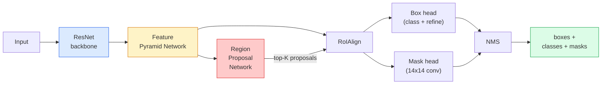

# Instance Segmentation — Mask R-CNN

> 给 Faster R-CNN detector 加上一个很小的 mask branch，就得到了 instance segmentation。难点在 RoIAlign，而且它比看起来更难。

**Type:** Build + Learn
**Languages:** Python
**Prerequisites:** Phase 4 Lesson 06 (YOLO), Phase 4 Lesson 07 (U-Net)
**Time:** ~75 minutes

## 学习目标
- 端到端追踪 Mask R-CNN 架构：backbone、FPN、RPN、RoIAlign、box head、mask head
- 从零实现 RoIAlign，并解释为什么 RoIPool 不再被使用
- 使用 torchvision 的 `maskrcnn_resnet50_fpn_v2` pretrained model 生成生产质量的 instance masks，并正确读取它的输出格式
- 通过替换 box 和 mask heads，并保持 backbone 冻结，在小型自定义数据集上 fine-tune Mask R-CNN

## 问题
Semantic segmentation 为每个 class 给出一个 mask。Instance segmentation 为每个 object 给出一个 mask，即使两个 objects 属于同一个 class。统计个体数量、跨帧追踪，以及测量对象（墙上每块砖的 bounding box、显微图像中的每个细胞）都需要 instance segmentation。

Mask R-CNN (He et al., 2017) 通过把 instance segmentation 重新表述为 detection-plus-a-mask 来解决这个问题。这个设计非常简洁，以至于接下来五年里，几乎每篇 instance segmentation 论文都是 Mask R-CNN 的变体，而 torchvision implementation 至今仍是中小型数据集的生产默认选择。

困难的工程问题是采样：如何从一个 proposal box 中裁剪出固定大小的 feature region，而这个 box 的角点并不与 pixel boundaries 对齐？这一步做错，会在各处损失零点几个 mAP。RoIAlign 就是答案。

## 概念
### The architecture



需要理解五个部分：

1. **Backbone** — 在 ImageNet 上训练的 ResNet-50 或 ResNet-101。生成 stride 为 4、8、16、32 的 feature maps 层级。
2. **FPN (Feature Pyramid Network)** — top-down + lateral connections，让每个 level 都有 C channels 的语义丰富 features。Detection 会查询与 object size 匹配的 FPN level。
3. **RPN (Region Proposal Network)** — 一个小型 conv head，在每个 anchor position 上预测“这里是否有 object？”以及“我该如何 refine box？”。每张图像生成约 1000 个 proposals。
4. **RoIAlign** — 从任意 FPN level 上的任意 box 中采样固定大小（例如 7x7）的 feature patch。使用 bilinear sampling，不做 quantisation。
5. **Heads** — 两层 box head，用于 refine box 并选择 class；再加一个小型 conv head，为每个 proposal 输出一个 `28x28` binary mask。

### Why RoIAlign, not RoIPool

最初的 Fast R-CNN 使用 RoIPool，它把 proposal box 拆成一个 grid，在每个 cell 中取最大 feature，并把所有坐标 round 到整数。这种 rounding 会让 feature map 与 input pixel coordinates 最多错位一个完整的 feature-map pixel —— 在 224x224 图像上影响较小，但当 feature map 的 stride 是 32 时会造成灾难性后果。

```
RoIPool:
  box (34.7, 51.3, 98.2, 142.9)
  round -> (34, 51, 98, 142)
  split grid -> round each cell boundary
  misalignment accumulates at every step

RoIAlign:
  box (34.7, 51.3, 98.2, 142.9)
  sample at exact float coordinates using bilinear interpolation
  no rounding anywhere
```

RoIAlign 能在 COCO 上免费提升 3-4 个点的 mask AP。现在每个重视 localisation 的 detector 都会使用它，包括 YOLOv7 seg、RT-DETR、Mask2Former。

### The RPN in one paragraph

在 feature map 的每个位置，放置 K 个不同尺寸和形状的 anchor boxes。为每个 anchor 预测一个 objectness score，以及一个 regression offset，用来把 anchor 变成更贴合 object 的 box。按 score 保留前约 1,000 个 boxes，在 IoU 0.7 下应用 NMS，然后把保留下来的 boxes 交给 heads。RPN 使用自己的 mini-loss 训练，其结构与 Lesson 6 的 YOLO loss 相同，只是只有两个 classes（object / no object）。

### The mask head

对每个 proposal（经过 RoIAlign 后），mask head 是一个很小的 FCN：四个 3x3 convs、一个 2x deconv、一个最终的 1x1 conv，在 `28x28` resolution 下生成 `num_classes` 个 output channels。只保留与 predicted class 对应的 channel；其他 channel 会被忽略。这将 mask prediction 与 classification 解耦。

把 28x28 mask upsample 到 proposal 原始 pixel size，得到最终的 binary mask。

### Losses

Mask R-CNN 有四类 losses 相加：

```
L = L_rpn_cls + L_rpn_box + L_box_cls + L_box_reg + L_mask
```

- `L_rpn_cls`, `L_rpn_box` — RPN proposals 的 objectness + box Regression。
- `L_box_cls` — head classifier 上针对 (C+1) classes（包含 background）的 cross-entropy。
- `L_box_reg` — head box refinement 上的 smooth L1。
- `L_mask` — 28x28 mask output 上的逐 pixel binary cross-entropy。

每个 loss 都有自己的默认权重；torchvision implementation 会将它们作为 constructor arguments 暴露出来。

### Output format

`torchvision.models.detection.maskrcnn_resnet50_fpn_v2` 返回一个 dict 列表，每张图像对应一个 dict：

```
{
    "boxes":  (N, 4) in (x1, y1, x2, y2) pixel coordinates,
    "labels": (N,) class IDs, 0 = background so indices are 1-based,
    "scores": (N,) confidence scores,
    "masks":  (N, 1, H, W) float masks in [0, 1] — threshold at 0.5 for binary,
}
```

mask 已经是 full image resolution。28x28 head output 已在内部完成 upsample。

```figure
cv3-roialign-sampling
```

## 构建它
### 步骤 1： RoIAlign from scratch

Mask R-CNN 的这个组件，用代码理解比用文字描述更简单。

```python
import torch
import torch.nn.functional as F

def roi_align_single(feature, box, output_size=7, spatial_scale=1 / 16.0):
    """
    feature: (C, H, W) single-image feature map
    box: (x1, y1, x2, y2) in original image pixel coordinates
    output_size: side of the output grid (7 for box head, 14 for mask head)
    spatial_scale: reciprocal of the feature map stride
    """
    C, H, W = feature.shape
    x1, y1, x2, y2 = [c * spatial_scale - 0.5 for c in box]
    bin_w = (x2 - x1) / output_size
    bin_h = (y2 - y1) / output_size

    grid_y = torch.linspace(y1 + bin_h / 2, y2 - bin_h / 2, output_size)
    grid_x = torch.linspace(x1 + bin_w / 2, x2 - bin_w / 2, output_size)
    yy, xx = torch.meshgrid(grid_y, grid_x, indexing="ij")

    gx = 2 * (xx + 0.5) / W - 1
    gy = 2 * (yy + 0.5) / H - 1
    grid = torch.stack([gx, gy], dim=-1).unsqueeze(0)
    sampled = F.grid_sample(feature.unsqueeze(0), grid, mode="bilinear",
                            align_corners=False)
    return sampled.squeeze(0)
```

每个数值都来自 bilinearly-sampled position。没有 rounding，没有 quantisation，也没有丢失 gradients。

### 步骤 2： Compare to torchvision's RoIAlign

```python
from torchvision.ops import roi_align

feature = torch.randn(1, 16, 50, 50)
boxes = torch.tensor([[0, 10, 20, 100, 90]], dtype=torch.float32)  # (batch_idx, x1, y1, x2, y2)

ours = roi_align_single(feature[0], boxes[0, 1:].tolist(), output_size=7, spatial_scale=1/4)
theirs = roi_align(feature, boxes, output_size=(7, 7), spatial_scale=1/4, sampling_ratio=1, aligned=True)[0]

print(f"shape ours:   {tuple(ours.shape)}")
print(f"shape theirs: {tuple(theirs.shape)}")
print(f"max|diff|:    {(ours - theirs).abs().max().item():.3e}")
```

在 `sampling_ratio=1` 且 `aligned=True` 时，两者能在 `1e-5` 以内匹配。

### 步骤 3： Load a pretrained Mask R-CNN

```python
import torch
from torchvision.models.detection import maskrcnn_resnet50_fpn_v2, MaskRCNN_ResNet50_FPN_V2_Weights

model = maskrcnn_resnet50_fpn_v2(weights=MaskRCNN_ResNet50_FPN_V2_Weights.DEFAULT)
model.eval()
print(f"params: {sum(p.numel() for p in model.parameters()):,}")
print(f"classes (including background): {len(model.roi_heads.box_predictor.cls_score.out_features * [0])}")
```

46M parameters，91 classes（COCO）。第一个 class（id 0）是 background；模型实际检测的所有内容都从 id 1 开始。

### 步骤 4： Run inference

```python
with torch.no_grad():
    x = torch.randn(3, 400, 600)
    predictions = model([x])
p = predictions[0]
print(f"boxes:  {tuple(p['boxes'].shape)}")
print(f"labels: {tuple(p['labels'].shape)}")
print(f"scores: {tuple(p['scores'].shape)}")
print(f"masks:  {tuple(p['masks'].shape)}")
```

mask tensor 的 shape 是 `(N, 1, H, W)`。以 0.5 为 threshold，为每个 object 得到 binary mask：

```python
binary_masks = (p['masks'] > 0.5).squeeze(1)  # (N, H, W) boolean
```

### 步骤 5： Swap the heads for a custom class count

常见的 fine-tuning recipe：复用 backbone、FPN 和 RPN；替换两个 classifier heads。

```python
from torchvision.models.detection.faster_rcnn import FastRCNNPredictor
from torchvision.models.detection.mask_rcnn import MaskRCNNPredictor

def build_custom_maskrcnn(num_classes):
    model = maskrcnn_resnet50_fpn_v2(weights=MaskRCNN_ResNet50_FPN_V2_Weights.DEFAULT)
    in_features = model.roi_heads.box_predictor.cls_score.in_features
    model.roi_heads.box_predictor = FastRCNNPredictor(in_features, num_classes)
    in_features_mask = model.roi_heads.mask_predictor.conv5_mask.in_channels
    hidden_layer = 256
    model.roi_heads.mask_predictor = MaskRCNNPredictor(in_features_mask, hidden_layer, num_classes)
    return model

custom = build_custom_maskrcnn(num_classes=5)
print(f"custom cls_score.out_features: {custom.roi_heads.box_predictor.cls_score.out_features}")
```

`num_classes` 必须包含 background class，因此一个有 4 个 object classes 的数据集应使用 `num_classes=5`。

### 步骤 6： Freeze what does not need training

在小型数据集上，冻结 backbone 和 FPN。只让 RPN objectness + regression 以及两个 heads 学习。

```python
def freeze_backbone_and_fpn(model):
    # torchvision Mask R-CNN packs the FPN inside `model.backbone` (as
    # `model.backbone.fpn`), so iterating `model.backbone.parameters()` covers
    # both the ResNet feature layers and the FPN lateral/output convs.
    for p in model.backbone.parameters():
        p.requires_grad = False
    return model

custom = freeze_backbone_and_fpn(custom)
trainable = sum(p.numel() for p in custom.parameters() if p.requires_grad)
print(f"trainable after freeze: {trainable:,}")
```

在 500-image 数据集上，这就是收敛与 overfitting 的区别。

## 使用它
torchvision 中 Mask R-CNN 的完整 training loop 只有 40 行，并且在不同任务之间基本不变：替换 datasets，然后开始训练。

```python
def train_step(model, images, targets, optimizer):
    model.train()
    loss_dict = model(images, targets)
    losses = sum(loss for loss in loss_dict.values())
    optimizer.zero_grad()
    losses.backward()
    optimizer.step()
    return {k: v.item() for k, v in loss_dict.items()}
```

`targets` 列表必须包含每张图像对应的 dict，其中有 `boxes`、`labels` 和 `masks`（作为 `(num_instances, H, W)` binary tensors）。模型在 training 时返回四个 losses 的 dict，在 eval 时返回 predictions 列表，这由 `model.training` 决定。

`pycocotools` evaluator 会同时为 boxes 和 masks 生成 mAP@IoU=0.5:0.95；你需要两个数字，才能判断瓶颈是在 box head 还是 mask head。

## 交付它
本课会产出：

- `outputs/prompt-instance-vs-semantic-router.md` — 一个 prompt，会提出三个问题，并选择 instance vs semantic vs panoptic，以及精确的起始 model。
- `outputs/skill-mask-rcnn-head-swapper.md` — 一个 skill，给定新的 `num_classes`，为任意 torchvision detection model 生成用于 swapping heads 的 10 行代码。

## 练习
1. **(Easy)** 在 100 个 random boxes 上用 `torchvision.ops.roi_align` 验证你的 RoIAlign。报告最大绝对差值。同时运行 RoIPool（pre-2017 behaviour），并展示它在靠近边界的 boxes 上会偏离约 1-2 个 feature-map pixels。
2. **(Medium)** 在一个 50-image custom dataset（任意两个 classes：balloons、fish、pothole、logos）上 fine-tune `maskrcnn_resnet50_fpn_v2`。冻结 backbone，训练 20 epochs，报告 mask AP@0.5。
3. **(Hard)** 将 Mask R-CNN 的 mask head 替换为预测 56x56 而不是 28x28 的版本。测量前后 mAP@IoU=0.75。解释为什么提升（或没有提升）符合预期的 boundary-precision / memory trade-off。

## 关键术语
| Term | What people say | What it actually means |
|------|----------------|----------------------|
| Mask R-CNN | “Detection plus masks” | Faster R-CNN + 一个小型 FCN head，为每个 proposal 的每个 class 预测一个 28x28 mask |
| FPN | “Feature pyramid” | top-down + lateral connections，让每个 stride level 都有 C channels 的语义丰富 features |
| RPN | “Region proposer” | 一个小型 conv head，每张图像生成约 1000 个 object/no-object proposals |
| RoIAlign | “No-rounding crop” | 从任意 float-coordinate box 中以 bilinear 方式采样固定大小的 feature grid |
| RoIPool | “Pre-2017 crop” | 与 RoIAlign 用途相同，但会 round box coordinates；已经过时 |
| Mask AP | “Instance mAP” | 使用 mask IoU 而不是 box IoU 计算的 average precision；COCO instance segmentation metric |
| Binary mask head | “Per-class mask” | 为每个 proposal 的每个 class 预测一个 binary mask；只保留 predicted class 的 channel |
| Background class | “Class 0” | 兜底的 “no object” class；真实 classes 的 indices 从 1 开始 |

## 延伸阅读
- [Mask R-CNN (He et al., 2017)](https://arxiv.org/abs/1703.06870) — 论文；关于 RoIAlign 的第 3 节是关键阅读
- [FPN: Feature Pyramid Networks (Lin et al., 2017)](https://arxiv.org/abs/1612.03144) — FPN 论文；每个现代 detector 都会使用它
- [torchvision Mask R-CNN tutorial](https://pytorch.org/tutorials/intermediate/torchvision_tutorial.html) — fine-tuning loop 的参考
- [Detectron2 model zoo](https://github.com/facebookresearch/detectron2/blob/main/MODEL_ZOO.md) — 生产级 implementations，提供几乎所有 detection 和 segmentation 变体的 trained weights
