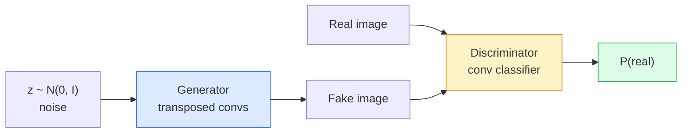
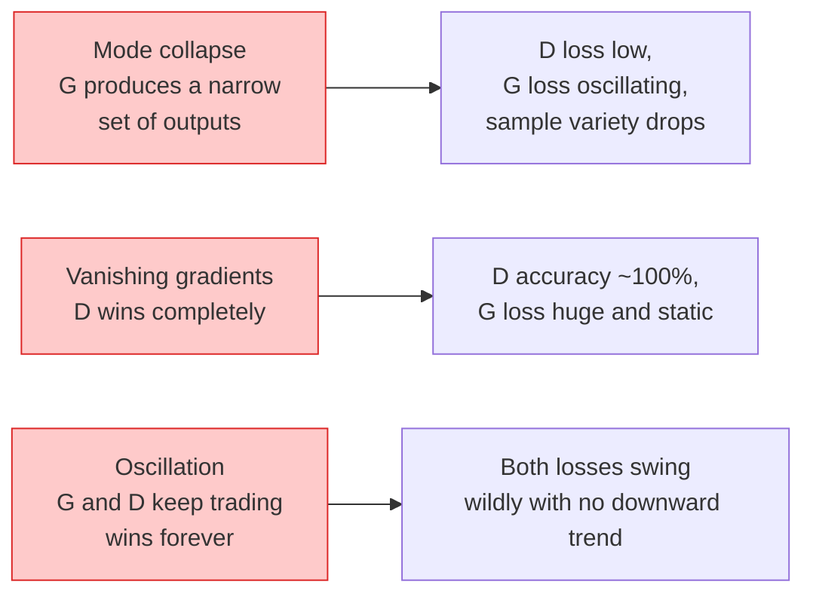

# Image Generation — GANs

> GAN 是两个 Neural Network 之间的固定博弈。一个负责绘制，一个负责评判。它们一起变得更好，直到绘制结果骗过评判者。

**Type:** Build
**Languages:** Python
**Prerequisites:** Phase 4 Lesson 03 (CNNs), Phase 3 Lesson 06 (Optimizers), Phase 3 Lesson 07 (Regularization)
**Time:** ~75 分钟

## 学习目标
- 解释 generator 与 discriminator 之间的 minimax 博弈，以及为什么均衡对应于 p_model = p_data
- 在 PyTorch 中实现 DCGAN，并在 60 行以内让它生成连贯的 32x32 合成图像
- 使用三种标准技巧稳定 GAN 训练：non-saturating loss、spectral norm、TTUR (two-timescale update rule)
- 读取训练曲线，区分健康收敛与 mode collapse、oscillation、discriminator-wins-completely

## 问题
Classification 教会网络将图像映射到标签。Generation 则反转了这个问题：采样出看起来像来自同一分布的新图像。这里没有可以用 diff 对比的“正确”输出；只有一个你想模仿的分布。

标准 Loss Function（MSE、cross-entropy）无法衡量“这个样本是否来自真实分布”。最小化逐像素误差会产生模糊的平均结果，而不是真实感样本。突破点在于学习 Loss：训练第二个网络，让它的任务是区分 real 与 fake，并用它的判断来推动 generator。

GANs (Goodfellow et al., 2014) 定义了这个框架。到 2018 年，StyleGAN 已经能生成与照片难以区分的 1024x1024 人脸。此后 Diffusion models 在质量和可控性上占据主导，但让 diffusion 变得实用的每个技巧——normalisation 选择、latent spaces、feature losses——最早都是在 GANs 上被理解的。

## 概念
### The two networks



**generator** G 接收一个 noise Vector `z` 并输出一张图像。**discriminator** D 接收一张图像并输出单个标量：该图像为 real 的概率。

### The game

G 希望 D 犯错。D 希望自己判断正确。形式化地说：

```
min_G max_D  E_x[log D(x)] + E_z[log(1 - D(G(z)))]
```

从右往左读：D 正在最大化它在 real（`log D(real)`）和 fake（`log (1 - D(fake))`）图像上的准确性。G 正在最小化 D 在 fake 上的准确性——它希望 `D(G(z))` 很高。

Goodfellow 证明了这个 minimax 存在一个全局均衡，其中 `p_G = p_data`，D 在所有位置都输出 0.5，并且生成分布与真实分布之间的 Jensen-Shannon divergence 为零。难点在于如何到达那里。

### Non-saturating loss

上面的形式在数值上不稳定。训练早期，`D(G(z))` 对每个 fake 都接近零，因此 `log(1 - D(G(z)))` 对 G 的 Gradient 会消失。修复方法：翻转 G 的 Loss。

```
L_D = -E_x[log D(x)] - E_z[log(1 - D(G(z)))]
L_G = -E_z[log D(G(z))]                          # non-saturating
```

现在当 `D(G(z))` 接近零时，G 的 Loss 很大，Gradient 也有信息量。每个现代 GAN 都使用这个变体进行训练。

### DCGAN architecture rules

Radford、Metz、Chintala (2015) 将多年失败实验提炼成五条规则，使 GAN 训练更加稳定：

1. 用 strided convs 替代 pooling（两个网络都如此）。
2. 在 generator 和 discriminator 中都使用 batch norm，但 G 的输出和 D 的输入除外。
3. 在更深的架构中移除 fully connected layers。
4. G 在除输出层外的所有层使用 ReLU（输出层用 tanh，将输出限制在 [-1, 1]）。
5. D 在所有层使用 LeakyReLU（negative_slope=0.2）。

每个现代 conv-based GAN（StyleGAN、BigGAN、GigaGAN）仍然从这些规则出发，并一次替换其中的一部分。

### Failure modes 及其特征



- **Mode collapse**：G 找到一张能骗过 D 的图像，然后只生成它。修复：加入 minibatch discrimination、spectral norm，或 label-conditioning。
- **Discriminator wins**：D 变强太快，G 的 Gradient 消失。修复：减小 D、降低 D learning rate，或对 real labels 应用 label smoothing。
- **Oscillation**：两个网络不断互相抢占优势，却从不接近均衡。修复：TTUR（D 比 G 快 2-4 倍学习），或切换到 Wasserstein loss。

### Evaluation

GANs 没有 ground truth，那么你怎么知道它们是否在工作？

- **Sample inspection**——每个 epoch 结束时直接查看 64 个样本。不可妥协。
- **FID (Fréchet Inception Distance)**——真实集合与生成集合的 Inception-v3 feature distributions 之间的距离。越低越好。社区标准。
- **Inception Score**——较旧，也更脆弱；优先使用 FID。
- **Precision/Recall for generative models**——分别衡量质量（precision）和覆盖度（recall）。比单独使用 FID 更有信息量。

对于小型 synthetic-data 运行，sample inspection 就足够了。

## 构建它
### 步骤 1： Generator

一个小型 DCGAN generator，接收 64 维 noise 并生成一张 32x32 图像。

```python
import torch
import torch.nn as nn

class Generator(nn.Module):
    def __init__(self, z_dim=64, img_channels=3, feat=64):
        super().__init__()
        self.net = nn.Sequential(
            nn.ConvTranspose2d(z_dim, feat * 4, kernel_size=4, stride=1, padding=0, bias=False),
            nn.BatchNorm2d(feat * 4),
            nn.ReLU(inplace=True),
            nn.ConvTranspose2d(feat * 4, feat * 2, kernel_size=4, stride=2, padding=1, bias=False),
            nn.BatchNorm2d(feat * 2),
            nn.ReLU(inplace=True),
            nn.ConvTranspose2d(feat * 2, feat, kernel_size=4, stride=2, padding=1, bias=False),
            nn.BatchNorm2d(feat),
            nn.ReLU(inplace=True),
            nn.ConvTranspose2d(feat, img_channels, kernel_size=4, stride=2, padding=1, bias=False),
            nn.Tanh(),
        )

    def forward(self, z):
        return self.net(z.view(z.size(0), -1, 1, 1))
```

四个 transposed convs，每个都使用 `kernel_size=4, stride=2, padding=1`，这样它们能干净地将空间尺寸翻倍。通过 tanh 将输出激活限制在 [-1, 1]。

### 步骤 2： Discriminator

generator 的镜像。LeakyReLU、strided convs，最后输出一个标量 logit。

```python
class Discriminator(nn.Module):
    def __init__(self, img_channels=3, feat=64):
        super().__init__()
        self.net = nn.Sequential(
            nn.Conv2d(img_channels, feat, kernel_size=4, stride=2, padding=1),
            nn.LeakyReLU(0.2, inplace=True),
            nn.Conv2d(feat, feat * 2, kernel_size=4, stride=2, padding=1, bias=False),
            nn.BatchNorm2d(feat * 2),
            nn.LeakyReLU(0.2, inplace=True),
            nn.Conv2d(feat * 2, feat * 4, kernel_size=4, stride=2, padding=1, bias=False),
            nn.BatchNorm2d(feat * 4),
            nn.LeakyReLU(0.2, inplace=True),
            nn.Conv2d(feat * 4, 1, kernel_size=4, stride=1, padding=0),
        )

    def forward(self, x):
        return self.net(x).view(-1)
```

最后一个 conv 将 `4x4` feature map 降到 `1x1`。输出是每张图像一个标量；只在 Loss 计算期间应用 sigmoid。

### 步骤 3： Training step

交替执行：每个 batch 先更新一次 D，再更新一次 G。

```python
import torch.nn.functional as F

def train_step(G, D, real, z, opt_g, opt_d, device):
    real = real.to(device)
    bs = real.size(0)

    # D step
    opt_d.zero_grad()
    d_real = D(real)
    d_fake = D(G(z).detach())
    loss_d = (F.binary_cross_entropy_with_logits(d_real, torch.ones_like(d_real))
              + F.binary_cross_entropy_with_logits(d_fake, torch.zeros_like(d_fake)))
    loss_d.backward()
    opt_d.step()

    # G step
    opt_g.zero_grad()
    d_fake = D(G(z))
    loss_g = F.binary_cross_entropy_with_logits(d_fake, torch.ones_like(d_fake))
    loss_g.backward()
    opt_g.step()

    return loss_d.item(), loss_g.item()
```

D step 中的 `G(z).detach()` 至关重要：我们不希望在更新 D 时 Gradient 流入 G。忘记这一点是经典的初学者 bug。

### 步骤 4：在 synthetic shapes 上运行完整 training loop

```python
from torch.utils.data import DataLoader, TensorDataset
import numpy as np

def synthetic_images(num=2000, size=32, seed=0):
    rng = np.random.default_rng(seed)
    imgs = np.zeros((num, 3, size, size), dtype=np.float32) - 1.0
    for i in range(num):
        r = rng.uniform(6, 12)
        cx, cy = rng.uniform(r, size - r, size=2)
        yy, xx = np.meshgrid(np.arange(size), np.arange(size), indexing="ij")
        mask = (xx - cx) ** 2 + (yy - cy) ** 2 < r ** 2
        color = rng.uniform(-0.5, 1.0, size=3)
        for c in range(3):
            imgs[i, c][mask] = color[c]
    return torch.from_numpy(imgs)

device = "cuda" if torch.cuda.is_available() else "cpu"
data = synthetic_images()
loader = DataLoader(TensorDataset(data), batch_size=64, shuffle=True)

G = Generator(z_dim=64, img_channels=3, feat=32).to(device)
D = Discriminator(img_channels=3, feat=32).to(device)
opt_g = torch.optim.Adam(G.parameters(), lr=2e-4, betas=(0.5, 0.999))
opt_d = torch.optim.Adam(D.parameters(), lr=2e-4, betas=(0.5, 0.999))

for epoch in range(10):
    for (batch,) in loader:
        z = torch.randn(batch.size(0), 64, device=device)
        ld, lg = train_step(G, D, batch, z, opt_g, opt_d, device)
    print(f"epoch {epoch}  D {ld:.3f}  G {lg:.3f}")
```

`Adam(lr=2e-4, betas=(0.5, 0.999))` 是 DCGAN 默认设置——较低的 beta1 会避免 momentum 项过度稳定 adversarial game。

### 步骤 5： Sampling

```python
@torch.no_grad()
def sample(G, n=16, z_dim=64, device="cpu"):
    G.eval()
    z = torch.randn(n, z_dim, device=device)
    imgs = G(z)
    imgs = (imgs + 1) / 2
    return imgs.clamp(0, 1)
```

采样前始终切换到 eval mode。对 DCGAN 来说这很重要，因为 batch norm 会使用 running stats，而不是当前 batch 的 stats。

### 步骤 6：Spectral normalisation

discriminator 中 BN 的即插即用替代方案，保证网络是 1-Lipschitz。能修复大多数“D wins too hard”失败。

```python
from torch.nn.utils import spectral_norm

def build_sn_discriminator(img_channels=3, feat=64):
    return nn.Sequential(
        spectral_norm(nn.Conv2d(img_channels, feat, 4, 2, 1)),
        nn.LeakyReLU(0.2, inplace=True),
        spectral_norm(nn.Conv2d(feat, feat * 2, 4, 2, 1)),
        nn.LeakyReLU(0.2, inplace=True),
        spectral_norm(nn.Conv2d(feat * 2, feat * 4, 4, 2, 1)),
        nn.LeakyReLU(0.2, inplace=True),
        spectral_norm(nn.Conv2d(feat * 4, 1, 4, 1, 0)),
    )
```

将 `Discriminator` 替换为 `build_sn_discriminator()` 后，你通常不再需要 TTUR 技巧。Spectral norm 是最容易应用的单项稳健性升级。

## 使用它
对于严肃的 generation，使用 pretrained weights 或切换到 diffusion。两个标准库：

- `torch_fidelity` 可以在你的 generator 上计算 FID / IS，而无需编写自定义 eval 代码。
- `pytorch-gan-zoo`（legacy）和 `StudioGAN` 提供经过测试的 DCGAN、WGAN-GP、SN-GAN、StyleGAN 和 BigGAN 实现。

到 2026 年，GANs 仍然是这些场景的最佳选择：实时图像生成（latency <10 ms）、style transfer、具有精确控制的 image-to-image translation（Pix2Pix、CycleGAN）。Diffusion 在 photorealism 和 text conditioning 上胜出。

## 交付它
本课产出：

- `outputs/prompt-gan-training-triage.md`——一个 prompt，用于读取训练曲线描述并选择 failure mode（mode collapse、D-wins、oscillation），以及单个推荐修复方案。
- `outputs/skill-dcgan-scaffold.md`——一个 skill，可根据 `z_dim`、目标 `image_size` 和 `num_channels` 编写 DCGAN scaffold，包括 training loop 和 sample saver。

## 练习
1. **(Easy)** 在 synthetic circle dataset 上训练上面的 DCGAN，并在每个 epoch 结束时保存 16 个样本的网格。到哪个 epoch 时，生成的圆会变得明显圆润？
2. **(Medium)** 用 spectral norm 替换 discriminator 的 batch norm。并排训练两个版本。哪一个收敛更快？哪一个在三个 seeds 上的方差更低？
3. **(Hard)** 实现 conditional DCGAN：将 class label 输入 G 和 D（在 G 中将 one-hot 拼接到 noise，在 D 中拼接一个 class embedding channel）。在 lesson 7 的 synthetic "circles vs squares" dataset 上训练，并通过使用指定 labels 采样来展示 class conditioning 有效。

## 关键术语
| Term | What people say | What it actually means |
|------|----------------|----------------------|
| Generator (G) | “负责画东西的网络” | 将 noise 映射到图像；训练目标是骗过 discriminator |
| Discriminator (D) | “评判者” | Binary classifier；训练目标是区分真实图像与生成图像 |
| Minimax | “这个博弈” | 在 adversarial loss 上对 G 取 min、对 D 取 max；均衡是 p_G = p_data |
| Non-saturating loss | “数值上合理的版本” | G 的 Loss 是 -log(D(G(z)))，而不是 log(1 - D(G(z)))，以避免训练早期 Gradient 消失 |
| Mode collapse | “Generator 只生成一种东西” | G 只生成数据分布中的一小部分；用 SN、minibatch discrimination 或更大的 batch 修复 |
| TTUR | “两个 learning rates” | D 比 G 学得更快，通常快 2-4 倍；稳定训练 |
| Spectral norm | “1-Lipschitz layer” | 一种 weight-normalisation，用来限制每层的 Lipschitz constant；防止 D 变得任意陡峭 |
| FID | “Fréchet Inception Distance” | 真实集合与生成集合的 Inception-v3 feature distributions 之间的距离；标准评估指标 |

## 延伸阅读
- [Generative Adversarial Networks (Goodfellow et al., 2014)](https://arxiv.org/abs/1406.2661)——开创这一方向的论文
- [DCGAN (Radford, Metz, Chintala, 2015)](https://arxiv.org/abs/1511.06434)——让 GANs 可训练的架构规则
- [Spectral Normalization for GANs (Miyato et al., 2018)](https://arxiv.org/abs/1802.05957)——最有用的单个稳定化技巧
- [StyleGAN3 (Karras et al., 2021)](https://arxiv.org/abs/2106.12423)——SOTA GAN；读起来像是过去十年所有技巧的精选合集
