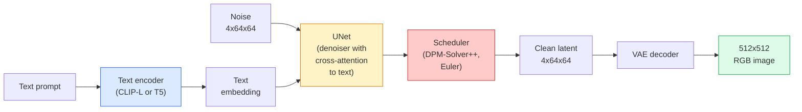

# Stable Diffusion — 架构与 Fine-Tuning

> Stable Diffusion 是一种 DDPM，它在预训练 VAE 的 latent space 中运行，通过 cross-attention 以文本为条件，使用快速确定性的 ODE solver 进行采样，并由 classifier-free guidance 引导。

**Type:** Learn + Use
**Languages:** Python
**Prerequisites:** Phase 4 Lesson 10 (Diffusion), Phase 7 Lesson 02 (Self-Attention)
**Time:** ~75 分钟

## 学习目标
- 追踪 Stable Diffusion pipeline 的五个组成部分：VAE、text encoder、U-Net、scheduler、safety checker，并理解它们各自实际做什么
- 解释 latent diffusion，以及为什么在 4x64x64 latent space 中训练（而不是在 3x512x512 图像上训练）可以在不损失质量的情况下将计算量降低 48x
- 使用 `diffusers` 生成图像，运行 image-to-image、inpainting 和 ControlNet 引导的生成
- 在小型自定义数据集上用 LoRA fine-tune Stable Diffusion，并在 inference 时加载 LoRA adapter

## 问题
直接在 512x512 RGB 图像上训练 DDPM 成本很高。每个训练步骤都要通过一个 U-Net 做 Backpropagation，而这个 U-Net 看到的是 3x512x512 = 786,432 个输入值；采样还需要通过同一个 U-Net 进行 50+ 次 forward pass。在 Stable Diffusion 1.5（2022 年发布）的质量水平上，pixel-space diffusion 大约需要 256 个 GPU-months 的训练，并且在消费级 GPU 上每张图像需要 10-30 秒。

让 open-weight text-to-image 变得实用的技巧是 **latent diffusion**（Rombach et al., CVPR 2022）。训练一个 VAE，将 3x512x512 图像映射到 4x64x64 latent tensor 再映射回来，然后在这个 latent space 中做 Diffusion。计算量下降 `(3*512*512)/(4*64*64) = 48x`。在同一块 GPU 上，采样时间从几十秒降到两秒以内。

几乎所有现代图像生成模型——SDXL、SD3、FLUX、HunyuanDiT、Wan-Video——都是 latent diffusion model，只是在 autoencoder、denoiser（U-Net 或 DiT）和文本条件化上有所变化。学会 Stable Diffusion，你就掌握了这个模板。

## 概念
### The pipeline



- **VAE** — 冻结的 autoencoder。Encoder 将图像转换为 latents（用于 img2img 和训练）。Decoder 将 latents 转回图像。
- **Text encoder** — CLIP text encoder（SD 1.x/2.x）、CLIP-L + CLIP-G（SDXL）或 T5-XXL（SD3/FLUX）。生成一串 token embeddings。
- **U-Net** — denoiser。包含 cross-attention 层，在每个分辨率层级从 latents attend 到 text embedding。
- **Scheduler** — 采样算法（DDIM、Euler、DPM-Solver++）。选择 sigmas，并将预测的 noise 混合回 latent。
- **Safety checker** — 可选的输出图像 NSFW / 非法内容过滤器。

### Classifier-free guidance (CFG)

普通文本条件化会针对每个 prompt `c` 学习 `epsilon_theta(x_t, t, c)`。CFG 训练同一个 network，但有 10% 的时间会丢弃 `c`（替换为空 embedding），从而得到一个能同时预测 conditional 和 unconditional noise 的单一模型。在 inference 时：

```
eps = eps_uncond + w * (eps_cond - eps_uncond)
```

`w` 是 guidance scale。`w=0` 是 unconditional，`w=1` 是普通 conditional，`w>1` 会把输出推向“更受 prompt 条件约束”，代价是多样性下降。SD 默认值是 `w=7.5`。

CFG 是 text-to-image 能达到生产质量的原因。没有它，prompt 对输出的偏置很弱；有了它，prompt 会占主导。

### Latent space geometry

VAE 的 4-channel latent 不只是压缩后的图像。它是一个 manifold，其中算术运算大致对应语义编辑（prompt engineering + interpolation 都发生在这里），也是 Diffusion U-Net 投入全部建模预算进行训练的空间。解码一个随机的 4x64x64 latent 不会产生看起来随机的图像，而会产生垃圾结果，因为只有特定的 latent submanifold 能解码为有效图像。

两个结果：

1. **Img2img** = 将图像 encode 为 latent，加入部分 noise，运行 denoiser，再 decode。由于 encoding 接近可逆，图像结构会保留下来；内容会基于 prompt 改变。
2. **Inpainting** = 与 img2img 相同，但 denoiser 只更新 mask 区域；非 mask 区域保留为已编码的 latent。

### The U-Net architecture

SD U-Net 是 Lesson 10 中 TinyUNet 的大型版本，并增加了三点：

- 每个空间分辨率上的 **Transformer blocks**，包含 self-attention + 对 text embedding 的 cross-attention。
- 通过 sinusoidal encoding 上的 MLP 得到 **Time embedding**。
- encoder 和 decoder 在匹配分辨率之间的 **Skip connections**。

SD 1.5 的总参数量：约 860M。SDXL：约 2.6B。FLUX：约 12B。参数量的增长主要来自 Attention 层。

### LoRA fine-tuning

对 Stable Diffusion 做完整 fine-tuning 需要 20+ GB VRAM，并更新 860M 个参数。LoRA（Low-Rank Adaptation）保持 base model 冻结，并向 Attention 层注入小型 rank-decomposition matrices。用于 SD 的 LoRA adapter 通常为 10-50 MB，在单块消费级 GPU 上训练 10-60 分钟，并在 inference 时作为 drop-in modification 加载。

```
Original: W_q : (d_in, d_out)   frozen
LoRA:     W_q + alpha * (A @ B)   where A : (d_in, r), B : (r, d_out)

r is typically 4-32.
```

LoRA 是几乎所有社区 fine-tune 的分发方式。CivitAI 和 Hugging Face 托管了数百万个 LoRA。

### Schedulers you will see

- **DDIM** — 确定性，约 50 steps，简单。
- **Euler ancestral** — 随机性，30-50 steps，样本略更有创意。
- **DPM-Solver++ 2M Karras** — 确定性，20-30 steps，生产默认选择。
- **LCM / TCD / Turbo** — consistency models 和 distilled variants；1-4 steps，但会牺牲部分质量。

在 `diffusers` 中切换 scheduler 只需要改一行，有时无需任何 retraining 就能修复采样问题。

## 构建它
本课端到端使用 `diffusers`，而不是从零重建 Stable Diffusion。你需要重建的部分（VAE、text encoder、U-Net、scheduler）本身都是各自课程的主题；这里的目标是熟悉生产级 API。

### 步骤 1： Text-to-image

```python
import torch
from diffusers import StableDiffusionPipeline

pipe = StableDiffusionPipeline.from_pretrained(
    "runwayml/stable-diffusion-v1-5",
    torch_dtype=torch.float16,
).to("cuda")

image = pipe(
    prompt="a dog riding a skateboard in tokyo, studio ghibli style",
    guidance_scale=7.5,
    num_inference_steps=25,
    generator=torch.Generator("cuda").manual_seed(42),
).images[0]
image.save("dog.png")
```

`float16` 在没有可见质量损失的情况下将 VRAM 减半。使用默认 DPM-Solver++ 时，`num_inference_steps=25` 的效果相当于使用 DDIM 时的 `num_inference_steps=50`。

### 步骤 2： Swap the scheduler

```python
from diffusers import DPMSolverMultistepScheduler, EulerAncestralDiscreteScheduler

pipe.scheduler = DPMSolverMultistepScheduler.from_config(pipe.scheduler.config)
pipe.scheduler = EulerAncestralDiscreteScheduler.from_config(pipe.scheduler.config)
```

Scheduler state 与 U-Net weights 解耦。你可以在 DDPM 上训练，然后用任意 scheduler 采样。

### 步骤 3： Image-to-image

```python
from diffusers import StableDiffusionImg2ImgPipeline
from PIL import Image

img2img = StableDiffusionImg2ImgPipeline.from_pretrained(
    "runwayml/stable-diffusion-v1-5",
    torch_dtype=torch.float16,
).to("cuda")

init_image = Image.open("dog.png").convert("RGB").resize((512, 512))
out = img2img(
    prompt="a dog riding a skateboard, oil painting",
    image=init_image,
    strength=0.6,
    guidance_scale=7.5,
).images[0]
```

`strength` 表示在 denoising 之前要加入多少 noise（0.0 = 不变，1.0 = 完全重新生成）。0.5-0.7 是 style transfer 的标准范围。

### 步骤 4： Inpainting

```python
from diffusers import StableDiffusionInpaintPipeline

inpaint = StableDiffusionInpaintPipeline.from_pretrained(
    "runwayml/stable-diffusion-inpainting",
    torch_dtype=torch.float16,
).to("cuda")

image = Image.open("dog.png").convert("RGB").resize((512, 512))
mask = Image.open("dog_mask.png").convert("L").resize((512, 512))

out = inpaint(
    prompt="a cat",
    image=image,
    mask_image=mask,
    guidance_scale=7.5,
).images[0]
```

mask 中的白色像素是要重新生成的区域。黑色像素会被保留。

### 步骤 5： LoRA loading

```python
pipe.load_lora_weights("sayakpaul/sd-lora-ghibli")
pipe.fuse_lora(lora_scale=0.8)

image = pipe(prompt="a village square in ghibli style").images[0]
```

`lora_scale` 控制强度；0.0 = 无效果，1.0 = 完整效果。`fuse_lora` 会将 adapter 原地烘焙到 weights 中以提升速度，但会阻止切换。在加载不同 adapter 前调用 `pipe.unfuse_lora()`。

### 步骤 6： LoRA training (sketch)

真实的 LoRA training 位于 `peft` 或 `diffusers.training` 中。大纲如下：

```python
# Pseudocode
for step, batch in enumerate(dataloader):
    images, prompts = batch
    latents = vae.encode(images).latent_dist.sample() * 0.18215

    t = torch.randint(0, num_train_timesteps, (batch_size,))
    noise = torch.randn_like(latents)
    noisy_latents = scheduler.add_noise(latents, noise, t)

    text_emb = text_encoder(tokenizer(prompts))

    pred_noise = unet(noisy_latents, t, text_emb)  # LoRA weights injected here

    loss = F.mse_loss(pred_noise, noise)
    loss.backward()
    optimizer.step()
```

只有 LoRA matrices 会接收 Gradient；base U-Net、VAE 和 text encoder 都被冻结。使用 batch size 为 1 和 gradient checkpointing 时，这可以适配 8 GB VRAM。

## 使用它
在生产中，你实际需要做的决策是：

- **Model family**：SD 1.5 用于 open-source 社区 fine-tunes，SDXL 用于更高 fidelity，SD3 / FLUX 用于 state of the art 和严格许可要求。
- **Scheduler**：20-30 steps 使用 DPM-Solver++ 2M Karras；当 latency 低于 1s 时使用 LCM-LoRA。
- **Precision**：4080/4090 上使用 `float16`，A100 及更新设备上使用 `bfloat16`，VRAM 紧张时使用 `int8`（通过 `bitsandbytes` 或 `compel`）。
- **Conditioning**：普通文本可用；若需要更强控制，在 base pipeline 之上加入 ControlNet（canny、depth、pose）。

对于批量生成，`AUTO1111` / `ComfyUI` 是社区工具；对于生产 API，使用 `diffusers` + `accelerate`，或使用带 TensorRT compilation 的 `optimum-nvidia`。

## 交付它
本课产出：

- `outputs/prompt-sd-pipeline-planner.md` — 一个 prompt，会根据 latency budget、fidelity target 和 licensing constraint 选择 SD 1.5 / SDXL / SD3 / FLUX，以及 scheduler 和 precision。
- `outputs/skill-lora-training-setup.md` — 一个 skill，用于为自定义数据集编写完整 LoRA training config，包括 captions、rank、batch size 和 learning rate。

## 练习
1. **(Easy)** 使用 `[1, 3, 5, 7.5, 10, 15]` 中的 `guidance_scale` 生成同一个 prompt。描述图像如何变化。在哪个 guidance 值开始出现 artefacts？
2. **(Medium)** 选取任意真实照片，在 `[0.2, 0.4, 0.6, 0.8, 1.0]` 的 `strength` 下通过 `StableDiffusionImg2ImgPipeline` 运行。哪个 strength 能在改变风格的同时保留构图？为什么 1.0 会完全忽略输入？
3. **(Hard)** 使用单个主体（宠物、logo、角色）的 10-20 张图像训练一个 LoRA，并生成包含该主体的新场景。报告在不过拟合输入图像的情况下产生最佳身份保持效果的 LoRA rank 和 training steps。

## 关键术语
| Term | What people say | What it actually means |
|------|----------------|----------------------|
| Latent diffusion | “在 latents 中 diffuse” | 在 VAE latent space（4x64x64）而不是 pixel space（3x512x512）中运行整个 DDPM；节省 48x 计算量 |
| VAE scale factor | “0.18215” | 将 VAE 的原始 latent 重新缩放到大致 unit variance 的常数；硬编码在每个 SD pipeline 中 |
| Classifier-free guidance | “CFG” | 混合 conditional 和 unconditional noise predictions；影响最大的 inference knob |
| Scheduler | “Sampler” | 将 noise + model predictions 转换为 denoised latent trajectory 的算法 |
| LoRA | “Low-rank adapter” | 小型 rank-decomposition matrices，可在不触碰 base weights 的情况下 fine-tune Attention 层 |
| Cross-attention | “Text-image attention” | 从 latent tokens 到 text tokens 的 Attention；在每个 U-Net 层级注入 prompt 信息 |
| ControlNet | “Structure conditioning” | 一个单独训练的 adapter，用额外输入（canny、depth、pose、segmentation）引导 SD |
| DPM-Solver++ | “默认 scheduler” | 二阶确定性 ODE solver；在低 step counts（20-30）下拥有最佳质量（2026 年） |

## 延伸阅读
- [High-Resolution Image Synthesis with Latent Diffusion (Rombach et al., 2022)](https://arxiv.org/abs/2112.10752) — Stable Diffusion 论文；包含证明该设计合理性的每个 ablation
- [Classifier-Free Diffusion Guidance (Ho & Salimans, 2022)](https://arxiv.org/abs/2207.12598) — CFG 论文
- [LoRA: Low-Rank Adaptation of Large Language Models (Hu et al., 2021)](https://arxiv.org/abs/2106.09685) — LoRA 最初用于 NLP；它几乎无需修改就迁移到了 SD
- [diffusers documentation](https://huggingface.co/docs/diffusers) — 每个 SD / SDXL / SD3 / FLUX pipeline 的参考文档
