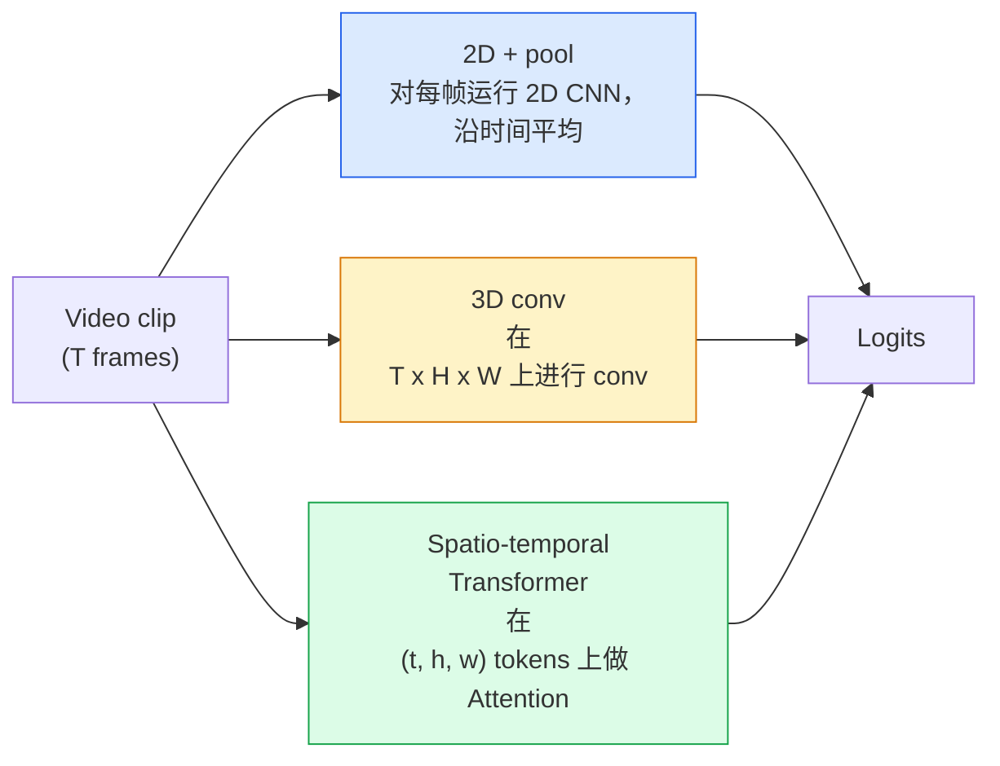

# Video Understanding — 时间建模

> 视频是一系列图像，加上将它们连接起来的物理规律。每个视频模型要么把时间视为额外的轴（3D conv），要么把它视为需要进行 Attention 的序列（Transformer），要么把它视为一次性提取并池化的特征（2D+pool）。

**类型：** 学习 + 构建
**语言：** Python
**先修要求：** Phase 4 Lesson 03（CNNs），Phase 4 Lesson 04（Image Classification）
**时间：** ~45 分钟

## 学习目标

- 区分三种主要的视频建模方法（2D+pool、3D conv、spatio-temporal Transformer），并预测它们在成本与准确率上的取舍
- 在 PyTorch 中实现 frame sampling、temporal pooling，以及一个 2D+pool baseline classifier
- 解释为什么 I3D 的“inflated”3D kernels 能很好地从 ImageNet weights 迁移，以及 factorised (2+1)D conv 的不同之处
- 理解标准 action-recognition datasets 与 metrics：Kinetics-400/600、UCF101、Something-Something V2；clip level 与 video level 的 top-1 accuracy

## 问题

一个 30 秒、30 fps 的视频包含 900 张图像。朴素地看，video classification 就是运行 900 次 image classification，然后做某种聚合。当动作几乎在每一帧中都可见时，这种方法有效（体育、烹饪、健身视频）；但当动作本身由运动定义时，它会严重失效：“pushing something from left to right”在每一帧里看起来都只是两个静止物体。

每个视频架构的核心问题是：temporal structure 在什么时候、以什么方式被建模？答案会决定其他所有事情，包括计算成本、pretraining 策略、是否可以复用 ImageNet weights，以及模型会在哪些数据集上训练。

本课刻意比静态图像课程更短。核心图像机制已经就位，而 video understanding 主要关注时间维度的故事：sampling、modeling 和 aggregating。

## 核心概念

### 三类架构家族



### 2D + pool

取一个 2D CNN（ResNet、EfficientNet、ViT）。在每个采样帧上独立运行它。对每帧的 embeddings 做平均（或 max-pool，或 attention-pool）。将 pooled vector 输入 classifier。

优点：
- ImageNet pretraining 可以直接迁移。
- 实现最简单。
- 便宜：T 帧 * 单张图像 inference cost。

缺点：
- 无法建模 motion。Action = appearances 的聚合。
- Temporal pooling 对顺序不敏感；“open door”和“close door”看起来相同。

适用场景：以 appearance 为主的任务、小视频数据集上的 transfer learning、初始 baselines。

### 3D convolutions

将 2D (H, W) kernels 替换为 3D (T, H, W) kernels。网络同时在空间和时间上进行 conv。早期家族包括：C3D、I3D、SlowFast。

I3D 技巧：取一个 pretrained 2D ImageNet model，将每个 2D kernel 沿新的时间轴复制，从而“inflate”。一个 3x3 2D conv 变成一个 3x3x3 3D conv。这让 3D model 拥有强大的 pretrained weights，而不是从零开始训练。

优点：
- 直接建模 motion。
- I3D inflation 提供免费的 transfer learning。

缺点：
- 比对应的 2D 模型多 T/8 的 FLOPs（针对 temporal kernel 为 3、堆叠 3 次的情况）。
- Temporal kernels 很小；长程 motion 需要 pyramid 或 dual-stream 方法。

适用场景：motion 是信号的 action recognition（Something-Something V2、包含大量 motion-heavy classes 的 Kinetics）。

### 时空 Transformers

将视频 Tokenize 成 space-time patches 网格，并在所有 patches 之间做 Attention。TimeSformer、ViViT、Video Swin、VideoMAE。

重要的 Attention patterns：
- **Joint** — 在 (t, h, w) 上做一次大的 Attention。对 `T*H*W` 呈二次复杂度；昂贵。
- **Divided** — 每个 block 做两次 Attention：一次沿时间，一次沿空间。近似线性扩展。
- **Factorised** — time attention 与 space attention 在 blocks 之间交替。

优点：
- 在所有主要 benchmarks 上达到 SOTA accuracy。
- 通过 patch inflation 从 image Transformers（ViT）迁移。
- 通过 sparse attention 支持 long-context video。

缺点：
- 计算需求高。
- 需要谨慎选择 Attention pattern，否则 runtime 会膨胀。

适用场景：大数据集、高保真 video understanding、multi-modal video+text tasks。

### Frame sampling

一个 10 秒、30 fps 的 clip 有 300 帧；把全部 300 帧输入任何模型都很浪费。标准策略包括：

- **Uniform sampling** — 在 clip 中均匀选取 T 帧。2D+pool 的默认选择。
- **Dense sampling** — 随机连续 T-frame window。3D convs 中常见，因为 motion 需要相邻帧。
- **Multi-clip** — 从同一个视频中采样多个 T-frame windows，分别分类，并在测试时平均 predictions。

T 通常为 8、16、32 或 64。更高的 T = 更多 temporal signal，也意味着更多计算。

### Evaluation

两个层级：
- **Clip-level accuracy** — 模型看到一个 T-frame clip，报告 top-k。
- **Video-level accuracy** — 对每个视频的多个 clips 的 clip-level predictions 取平均；更高且更稳定。

始终报告两者。一个得分为 78% clip / 82% video 的模型高度依赖 test-time averaging；一个得分为 80% / 81% 的模型在 per-clip 上更 robust。

### 你会遇到的数据集

- **Kinetics-400 / 600 / 700** — 通用 action dataset。400k clips；YouTube URLs（很多现在已失效）。
- **Something-Something V2** — 由 motion 定义的 actions（“moving X from left to right”）。无法用 2D+pool 解决。
- **UCF-101**、**HMDB-51** — 更老、更小，但仍被报告。
- **AVA** — 在空间和时间中的 action *localisation*；比 classification 更难。

## 构建它

### 步骤 1：Frame sampler

适用于 frames 列表（或 video tensor）的 uniform 和 dense samplers。

```python
import numpy as np

def sample_uniform(num_frames_total, T):
    if num_frames_total <= T:
        return list(range(num_frames_total)) + [num_frames_total - 1] * (T - num_frames_total)
    step = num_frames_total / T
    return [int(i * step) for i in range(T)]


def sample_dense(num_frames_total, T, rng=None):
    rng = rng or np.random.default_rng()
    if num_frames_total <= T:
        return list(range(num_frames_total)) + [num_frames_total - 1] * (T - num_frames_total)
    start = int(rng.integers(0, num_frames_total - T + 1))
    return list(range(start, start + T))
```

二者都返回 `T` 个 indices，用于切片 video tensor。

### 步骤 2：一个 2D+pool baseline

在每帧上运行 2D ResNet-18，average-pool features，然后分类。

```python
import torch
import torch.nn as nn
from torchvision.models import resnet18, ResNet18_Weights

class FramePool(nn.Module):
    def __init__(self, num_classes=400, pretrained=True):
        super().__init__()
        weights = ResNet18_Weights.IMAGENET1K_V1 if pretrained else None
        backbone = resnet18(weights=weights)
        self.features = nn.Sequential(*(list(backbone.children())[:-1]))  # global avg pool kept
        self.head = nn.Linear(512, num_classes)

    def forward(self, x):
        # x: (N, T, 3, H, W)
        N, T = x.shape[:2]
        x = x.view(N * T, *x.shape[2:])
        feats = self.features(x).view(N, T, -1)
        pooled = feats.mean(dim=1)
        return self.head(pooled)

model = FramePool(num_classes=10)
x = torch.randn(2, 8, 3, 224, 224)
print(f"output: {model(x).shape}")
print(f"params: {sum(p.numel() for p in model.parameters()):,}")
```

一千一百万参数，ImageNet pretrained，逐帧运行、平均、分类。在 appearance-heavy tasks 上，这个 baseline 通常只比真正的 3D models 低 5-10 个点，有时甚至更好，因为它复用了更强的 ImageNet backbone。

### 步骤 3：I3D-style inflated 3D conv

通过沿新的时间轴重复 weights，将单个 2D conv 转换为 3D conv。

```python
def inflate_2d_to_3d(conv2d, time_kernel=3):
    out_c, in_c, kh, kw = conv2d.weight.shape
    weight_3d = conv2d.weight.data.unsqueeze(2)  # (out, in, 1, kh, kw)
    weight_3d = weight_3d.repeat(1, 1, time_kernel, 1, 1) / time_kernel
    conv3d = nn.Conv3d(in_c, out_c, kernel_size=(time_kernel, kh, kw),
                        padding=(time_kernel // 2, conv2d.padding[0], conv2d.padding[1]),
                        stride=(1, conv2d.stride[0], conv2d.stride[1]),
                        bias=False)
    conv3d.weight.data = weight_3d
    return conv3d

conv2d = nn.Conv2d(3, 64, kernel_size=3, padding=1, bias=False)
conv3d = inflate_2d_to_3d(conv2d, time_kernel=3)
print(f"2D weight shape:  {tuple(conv2d.weight.shape)}")
print(f"3D weight shape:  {tuple(conv3d.weight.shape)}")
x = torch.randn(1, 3, 8, 56, 56)
print(f"3D output shape:  {tuple(conv3d(x).shape)}")
```

除以 `time_kernel` 会让 activation magnitudes 大致保持不变，这对于不破坏第一次前向传播中的 batch-norm statistics 很重要。

### 步骤 4：Factorised (2+1)D conv

将 3D conv 拆成一个 2D（spatial）conv 和一个 1D（temporal）conv。相同的 receptive field，更少的参数，在某些 benchmarks 上准确率更好。

```python
class Conv2Plus1D(nn.Module):
    def __init__(self, in_c, out_c, kernel_size=3):
        super().__init__()
        mid_c = (in_c * out_c * kernel_size * kernel_size * kernel_size) \
                // (in_c * kernel_size * kernel_size + out_c * kernel_size)
        self.spatial = nn.Conv3d(in_c, mid_c, kernel_size=(1, kernel_size, kernel_size),
                                 padding=(0, kernel_size // 2, kernel_size // 2), bias=False)
        self.bn = nn.BatchNorm3d(mid_c)
        self.act = nn.ReLU(inplace=True)
        self.temporal = nn.Conv3d(mid_c, out_c, kernel_size=(kernel_size, 1, 1),
                                  padding=(kernel_size // 2, 0, 0), bias=False)

    def forward(self, x):
        return self.temporal(self.act(self.bn(self.spatial(x))))

c = Conv2Plus1D(3, 64)
x = torch.randn(1, 3, 8, 56, 56)
print(f"(2+1)D output: {tuple(c(x).shape)}")
```

完整的 R(2+1)D network 等同于一个 ResNet-18，只是把每个 3x3 conv 都替换为 `Conv2Plus1D`。

## 使用它

两个库覆盖了生产级视频工作：

- `torchvision.models.video` — R(2+1)D、MViT、Swin3D，带有 pretrained Kinetics weights。API 与 image models 相同。
- `pytorchvideo`（Meta）— model zoo、用于 Kinetics / SSv2 / AVA 的 data loaders、标准 transforms。

对于 Vision-Language video models（video captioning、video QA），使用 `transformers`（`VideoMAE`、`VideoLLaMA`、`InternVideo`）。

## 交付它

本课会产出：

- `outputs/prompt-video-architecture-picker.md` — 一个 prompt，根据 appearance-vs-motion、dataset size 和 compute budget 选择 2D+pool / I3D / (2+1)D / Transformer。
- `outputs/skill-frame-sampler-auditor.md` — 一个 skill，用于检查 video pipeline 的 sampler，并标记常见错误：off-by-one index、`num_frames < T` 时 sampling 不均匀、缺少 aspect-preserving crop 等。

## 练习

1. **（简单）** 计算 FramePool 在 T=8 时的 FLOPs（近似值），并与 T=8 的 I3D-style 3D ResNet 对比。说明为什么 2D+pool 便宜 3-5 倍。
2. **（中等）** 生成一个 synthetic video dataset：随机小球朝随机方向移动，并按运动方向标注（“left-to-right”、“right-to-left”、“diagonal-up”）。在其上训练 FramePool。展示它的准确率接近随机水平，从而证明仅靠 appearance 不足以完成 motion tasks。
3. **（困难）** 通过将 ResNet-18 中的每个 Conv2d 替换为 `Conv2Plus1D`，构建一个 R(2+1)D-18。用 ImageNet-pretrained ResNet-18 inflate 第一个 conv 的 weights。在练习 2 的 motion dataset 上训练，并超过 FramePool。

## 关键术语

| Term | 人们常说 | 实际含义 |
|------|----------------|----------------------|
| 2D + pool | “Per-frame classifier” | 在每个采样帧上运行 2D CNN，跨时间 average-pool features，然后分类 |
| 3D convolution | “Spatio-temporal kernel” | 在 (T, H, W) 上进行 conv 的 kernel；可以原生建模 motion |
| Inflation | “Lift 2D weights to 3D” | 通过沿新的时间轴重复 2D conv 的 weights 来初始化 3D conv weights，然后除以 kernel_T 以保持 activation scale |
| (2+1)D | “Factorised conv” | 将 3D 拆成 2D spatial + 1D temporal；参数更少，中间多一个非线性 |
| Divided attention | “Time then space” | 每层有两次 Attention 的 Transformer block：一次在同一帧的 tokens 上，一次在同一位置的 tokens 上 |
| Clip | “T-frame window” | T 帧的采样子序列；video model 消费的单位 |
| Clip vs video accuracy | “Two eval settings” | Clip = 每个视频一个 sample，video = 对多个 sampled clips 取平均 |
| Kinetics | “The ImageNet of video” | 400-700 个 action classes，300k+ YouTube clips，标准 video pretraining corpus |

## 延伸阅读

- [I3D: Quo Vadis, Action Recognition (Carreira & Zisserman, 2017)](https://arxiv.org/abs/1705.07750) — 提出了 inflation 和 Kinetics dataset
- [R(2+1)D: A Closer Look at Spatiotemporal Convolutions (Tran et al., 2018)](https://arxiv.org/abs/1711.11248) — factorised conv，至今仍是强 baseline
- [TimeSformer: Is Space-Time Attention All You Need? (Bertasius et al., 2021)](https://arxiv.org/abs/2102.05095) — 第一个强大的 video Transformer
- [VideoMAE (Tong et al., 2022)](https://arxiv.org/abs/2203.12602) — 用于视频的 masked autoencoder pretraining；当前主流的 pretraining recipe
