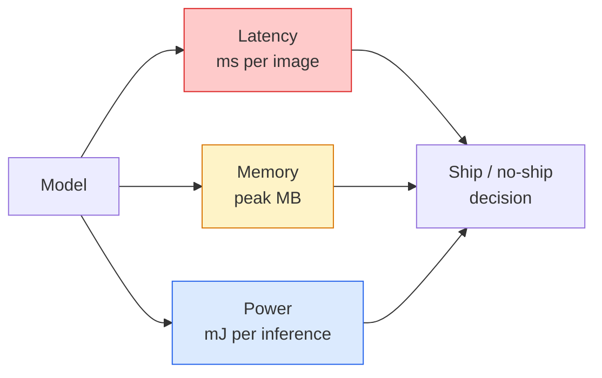

# Real-Time Vision — 边缘部署

> Edge inference 是让一个 90-accuracy model 在仅有 2 GB RAM 的设备上以 30 fps 运行的工程学科。每一个百分点的 accuracy 都要与毫秒级 latency 做交换。

**Type:** Learn + Build
**Languages:** Python
**Prerequisites:** Phase 4 Lesson 04 (Image Classification), Phase 10 Lesson 11 (Quantization)
**Time:** ~75 minutes

## 学习目标
- 测量任意 PyTorch model 的 inference latency、peak memory 和 throughput，并读懂 FLOPs / params / latency 之间的权衡
- 使用 PyTorch 的 post-training quantisation 将 vision model 量化为 INT8，并验证 accuracy loss < 1%
- 导出到 ONNX，并用 ONNX Runtime 或 TensorRT 编译；说出三种最常见的导出失败原因及其修复方式
- 解释在 edge 约束下何时选择 MobileNetV3、EfficientNet-Lite、ConvNeXt-Tiny 或 MobileViT

## 问题
训练阶段的 vision model 通常是一个 floating-point 巨兽。100M parameters、每次 forward pass 10 GFLOPs、2 GB VRAM。这些都无法装进手机、车载 infotainment unit、工业相机或 drone。交付一个 vision system，意味着要把同样的预测能力塞进小 100 倍的预算里。

大部分工作由三个旋钮完成：model choice（使用同样 recipe 的更小 architecture）、quantisation（用 INT8 替代 FP32）和 inference runtime（ONNX Runtime、TensorRT、Core ML、TFLite）。把它们调对，决定了你做出来的是一个只能在 workstation 上跑的 demo，还是一个能部署到 $30 camera module 的产品。

本课先建立 measurement discipline（无法测量就无法优化），然后讲解这三个旋钮。目标不是学完每一种 edge runtime，而是知道有哪些 lever，以及如何验证每一个 lever 确实做到了你以为它在做的事。

## 概念
### 三个预算



- **Latency**：p50、p95、p99。只看 p50 平均值会掩盖对 real-time systems 很重要的尾部行为。
- **Peak memory**：设备曾经看到的最大值，而不是 steady-state average。重要原因是 embedded targets 上的 OOM 是致命的。
- **Power / energy**：电池供电设备上每次 inference 的 millijoules。通常用 CPU/GPU utilisation * time 近似。

edge 决策依赖的是一张 (model, latency, memory, accuracy) 表。每个单元格都必须在 target device 上测量，而不是在 workstation 上。

### Measurement discipline

每一次 edge profile 都应该遵守三条规则：

1. 在测量前用 5-10 次 dummy forward pass **Warm up** model。冷缓存和 JIT compilation 会产生不具代表性的首次数值。
2. 在 timed block 前后用 `torch.cuda.synchronize()` **Synchronise** GPU workloads。否则你测到的是 kernel dispatch，而不是 kernel execution。
3. 将 input sizes **Fix** 到 production resolution。224x224 上的 latency 不是 512x512 上的 latency。

### FLOPs 作为 proxy

FLOPs（每次 inference 的 floating-point operations）是一种廉价、与设备无关的 latency proxy。它适合 architecture comparison，但作为绝对 wall-clock 会产生误导。一个 FLOPs 多 10% 的 model，实践中可能快 2x，因为它使用了更适合硬件的 ops（depthwise convs 编译效果好，大的 7x7 convs 则不一定）。

规则：用 FLOPs 做 architecture search，用 on-device latency 做 deployment decisions。

### Quantisation 一段话说明

用 INT8 替换 FP32 weights 和 activations。Model size 降低 4x，memory bandwidth 降低 4x，在具备 INT8 kernels 的硬件上 compute 降低 2-4x（所有现代 mobile SoC、所有带 Tensor Cores 的 NVIDIA GPU）。vision tasks 上的 accuracy loss 通常是 0.1-1 个百分点，使用 post-training static quantisation 即可达到。

类型：

- **Dynamic** — 将 weights 量化为 INT8，activations 以 FP 计算。简单，速度提升较小。
- **Static (post-training)** — 量化 weights，并在小型 calibration set 上校准 activation ranges。比 dynamic 快得多。
- **Quantisation-aware training (QAT)** — 在训练期间模拟 quantisation，让 model 学会适应它。accuracy 最好，但需要 labelled data。

对 vision 来说，post-training static quantisation 用 5% 的工作量获得 95% 的收益。只有当 PTQ 带来的 accuracy loss 不可接受时才使用 QAT。

### Pruning 和 distillation

- **Pruning** — 移除不重要的 weights（magnitude-based）或 channels（structured）。对 overparameterised models 很有效；对已经很 compact 的 architectures 用处较小。
- **Distillation** — 训练一个小 student 去模仿大 teacher 的 logits。通常能恢复缩小 model 后损失的大部分 accuracy。production edge models 的标准做法。

### Inference runtimes

- **PyTorch eager** — 慢，不适合 deployment。仅用于 development。
- **TorchScript** — legacy。已被 `torch.compile` 和 ONNX export 取代。
- **ONNX Runtime** — 中立 runtime。CPU、CUDA、CoreML、TensorRT、OpenVINO 都有 ONNX providers。从这里开始。
- **TensorRT** — NVIDIA 的 compiler。在 NVIDIA GPUs（workstation 和 Jetson）上 latency 最佳。可与 ONNX Runtime 集成，也可 standalone 使用。
- **Core ML** — Apple 的 iOS/macOS runtime。需要 `.mlmodel` 或 `.mlpackage`。
- **TFLite** — Google 的 Android/ARM runtime。需要 `.tflite`。
- **OpenVINO** — Intel 的 CPU/VPU runtime。需要 `.xml` + `.bin`。

实践中：export PyTorch -> ONNX -> 为 target 选择 runtime。ONNX 是 lingua franca。

### Edge architecture picker

| Budget | Model | Why |
|--------|-------|-----|
| < 3M params | MobileNetV3-Small | 到处都能编译，是很好的 baseline |
| 3-10M | EfficientNet-Lite-B0 | TFLite 上每 param 的 accuracy 最好 |
| 10-20M | ConvNeXt-Tiny | accuracy-per-param 最好，且 CPU-friendly |
| 20-30M | MobileViT-S or EfficientViT | 具备 ImageNet accuracy 的 Transformer |
| 30-80M | Swin-V2-Tiny | 如果 stack 支持 window attention |

除非有明确理由不这样做，否则把这些全部量化为 INT8。

## 构建它
### 步骤 1： 正确测量 latency

```python
import time
import torch

def measure_latency(model, input_shape, device="cpu", warmup=10, iters=50):
    model = model.to(device).eval()
    x = torch.randn(input_shape, device=device)
    with torch.no_grad():
        for _ in range(warmup):
            model(x)
        if device == "cuda":
            torch.cuda.synchronize()
        times = []
        for _ in range(iters):
            if device == "cuda":
                torch.cuda.synchronize()
            t0 = time.perf_counter()
            model(x)
            if device == "cuda":
                torch.cuda.synchronize()
            times.append((time.perf_counter() - t0) * 1000)
    times.sort()
    return {
        "p50_ms": times[len(times) // 2],
        "p95_ms": times[int(len(times) * 0.95)],
        "p99_ms": times[int(len(times) * 0.99)],
        "mean_ms": sum(times) / len(times),
    }
```

Warm up，synchronise，使用 `time.perf_counter()`。报告 percentiles，而不只是 mean。

### 步骤 2： Parameter 和 FLOP counts

```python
def parameter_count(model):
    return sum(p.numel() for p in model.parameters())

def flops_estimate(model, input_shape):
    """
    Rough FLOP count for a conv/linear-only model. For production use `fvcore` or `ptflops`.
    """
    total = 0
    def conv_hook(m, inp, out):
        nonlocal total
        c_out, c_in, kh, kw = m.weight.shape
        h, w = out.shape[-2:]
        total += 2 * c_in * c_out * kh * kw * h * w
    def linear_hook(m, inp, out):
        nonlocal total
        total += 2 * m.in_features * m.out_features
    hooks = []
    for m in model.modules():
        if isinstance(m, torch.nn.Conv2d):
            hooks.append(m.register_forward_hook(conv_hook))
        elif isinstance(m, torch.nn.Linear):
            hooks.append(m.register_forward_hook(linear_hook))
    model.eval()
    with torch.no_grad():
        model(torch.randn(input_shape))
    for h in hooks:
        h.remove()
    return total
```

真实项目中使用 `fvcore.nn.FlopCountAnalysis` 或 `ptflops`；它们能正确处理每一种 module type。

### 步骤 3: Post-training static quantisation

```python
def quantise_ptq(model, calibration_loader, backend="x86"):
    import torch.ao.quantization as tq
    model = model.eval().cpu()
    model.qconfig = tq.get_default_qconfig(backend)
    tq.prepare(model, inplace=True)
    with torch.no_grad():
        for x, _ in calibration_loader:
            model(x)
    tq.convert(model, inplace=True)
    return model
```

三个步骤：configure、prepare（插入 observers）、用真实数据 calibrate、convert（fuse + quantise）。这要求 model 已经 fuse（`Conv -> BN -> ReLU` -> `ConvBnReLU`），可由 `torch.ao.quantization.fuse_modules` 处理。

### 步骤 4： 导出到 ONNX

```python
def export_onnx(model, sample_input, path="model.onnx"):
    model = model.eval()
    torch.onnx.export(
        model,
        sample_input,
        path,
        input_names=["input"],
        output_names=["output"],
        dynamic_axes={"input": {0: "batch"}, "output": {0: "batch"}},
        opset_version=17,
    )
    return path
```

`opset_version=17` 是 2026 年的安全默认值。`dynamic_axes` 让你可以用任意 batch size 运行 ONNX model。

### 步骤 5： Benchmark 并比较不同 regimes

```python
import torch.nn as nn
from torchvision.models import mobilenet_v3_small

def compare_regimes():
    model = mobilenet_v3_small(weights=None, num_classes=10)
    params = parameter_count(model)
    flops = flops_estimate(model, (1, 3, 224, 224))
    lat_fp32 = measure_latency(model, (1, 3, 224, 224), device="cpu")
    print(f"FP32 MobileNetV3-Small: {params:,} params  {flops/1e9:.2f} GFLOPs  "
          f"p50={lat_fp32['p50_ms']:.2f}ms  p95={lat_fp32['p95_ms']:.2f}ms")
```

对 `resnet50`、`efficientnet_v2_s` 和 `convnext_tiny` 运行同一个函数，你就能得到部署决策所需的 comparison table。

## 使用它
Production stacks 通常收敛到三条路径之一：

- **Web / serverless**：PyTorch -> ONNX -> ONNX Runtime（CPU 或 CUDA provider）。最简单，对大多数场景足够好。
- **NVIDIA edge (Jetson, GPU server)**：PyTorch -> ONNX -> TensorRT。latency 最佳，engineering effort 最大。
- **Mobile**：PyTorch -> ONNX -> Core ML (iOS) 或 TFLite (Android)。导出前先量化。

测量方面，`torch-tb-profiler`、`nvprof` / `nsys`，以及 macOS 上的 Instruments 可以给出 layer-by-layer breakdown。`benchmark_app` (OpenVINO) 和 `trtexec` (TensorRT) 可以给出 standalone CLI 数字。

## 交付它
本课会产出：

- `outputs/prompt-edge-deployment-planner.md` — 一个 prompt，会根据 target device 和 latency SLA 选择 backbone、quantisation strategy 和 runtime。
- `outputs/skill-latency-profiler.md` — 一个 skill，用于编写完整的 latency-benchmarking script，包含 warmup、synchronisation、percentiles 和 memory tracking。

## 练习
1. **(Easy)** 在 CPU 上以 224x224 测量 `resnet18`、`mobilenet_v3_small`、`efficientnet_v2_s` 和 `convnext_tiny` 的 p50 latency。报告表格，并指出哪个 architecture 的 accuracy-per-ms 最好。
2. **(Medium)** 对 `mobilenet_v3_small` 应用 post-training static quantisation。报告 CIFAR-10 或类似数据集 held-out subset 上的 FP32 vs INT8 latency 和 accuracy loss。
3. **(Hard)** 将 `convnext_tiny` 导出到 ONNX，用 `CPUExecutionProvider` 通过 `onnxruntime` 运行，并将 latency 与 PyTorch eager baseline 比较。找出 ONNX Runtime 第一个更快的 layer，并解释原因。

## 关键术语
| Term | What people say | What it actually means |
|------|----------------|----------------------|
| Latency | “有多快” | 从 input 到 output 的时间；看 p50/p95/p99 percentiles，而不是 mean |
| FLOPs | “Model size” | 每次 forward pass 的 floating-point ops；compute cost 的粗略 proxy |
| INT8 quantisation | “8-bit” | 用 8-bit integers 替代 FP32 weights/activations；体积约小 4x，速度快 2-4x |
| PTQ | “Post-training quantisation” | 在不 retraining 的情况下量化 trained model；简单，通常足够 |
| QAT | “Quantisation-aware training” | 训练期间模拟 quantisation；accuracy 最好，需要 labelled data |
| ONNX | “中立格式” | 每个主流 inference runtime 都支持的 model exchange format |
| TensorRT | “NVIDIA compiler” | 将 ONNX 编译为面向 NVIDIA GPUs 的 optimised engine |
| Distillation | “Teacher -> student” | 训练 small model 去模仿 big model 的 logits；恢复大部分损失的 accuracy |

## 延伸阅读
- [EfficientNet (Tan & Le, 2019)](https://arxiv.org/abs/1905.11946) — 高效架构的 compound scaling
- [MobileNetV3 (Howard et al., 2019)](https://arxiv.org/abs/1905.02244) — mobile-first architecture，包含 h-swish 和 squeeze-excite
- [A Practical Guide to TensorRT Optimization (NVIDIA)](https://developer.nvidia.com/blog/accelerating-model-inference-with-tensorrt-tips-and-best-practices-for-pytorch-users/) — 如何真正拿到论文里的 throughput numbers
- [ONNX Runtime docs](https://onnxruntime.ai/docs/) — quantisation、graph optimisation、provider selection
