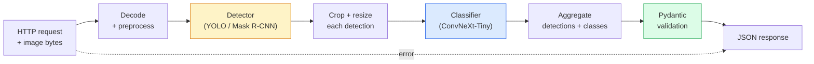

# 构建完整 Vision Pipeline — Capstone

> 生产级 vision system 是由模型和规则组成的链条，并通过 data contract 串联起来。本阶段的组件已经齐备；这个 capstone 会把它们端到端连接起来。

**Type:** Build
**Languages:** Python
**Prerequisites:** Phase 4 Lessons 01-15
**Time:** ~120 minutes

## 学习目标
- 设计一个生产级 vision pipeline，用于检测对象、对其分类，并输出结构化 JSON，同时处理所有失败路径
- 将 detector（Mask R-CNN 或 YOLO）、classifier（ConvNeXt-Tiny）和 data contract（Pydantic）接入同一个 service
- 对端到端 pipeline 进行 benchmark，并识别第一个 bottleneck（通常先是 preprocessing，然后是 detector）
- 发布一个最小 FastAPI service，接受 image upload，运行 pipeline，并返回带有 classification 的 detection 结果

## 问题
单个 vision model 很有用；vision product 是由它们组成的链条。零售货架审计是 detector 加 product classifier 再加 price-OCR pipeline。自动驾驶是 2D detector 加 3D detector 加 segmenter 加 tracker 加 planner。医疗预筛查是 segmenter 加 region classifier 加 clinician UI。

把这些链条接起来，正是区分 ML prototype 和 product 的关键部分。模型之间的每个 interface 都是新的 bug 来源。每一次 coordinate transform、每一次 normalisation、每一次 mask resize，都可能成为静默失败点。一个 pipeline 的强度取决于它最薄弱的 interface。

这个 capstone 搭建最小可用 pipeline：detection + classification + structured output + serving layer。Phase 4 中的其他内容都可以插入这个骨架：把 Mask R-CNN 换成 YOLOv8，添加 OCR head，添加 segmentation branch，添加 tracker。架构是稳定的；组件是可插拔的。

## 概念
### The pipeline



七个阶段。两个 model stage 开销很大；另外五个阶段则是 bug 最常出现的地方。

### 使用 Pydantic 定义 Data contract

每个 model boundary 都变成一个类型化对象。这会把静默失败变成显式失败。

```
Detection(
    box: tuple[float, float, float, float],   # (x1, y1, x2, y2), absolute pixels
    score: float,                              # [0, 1]
    class_id: int,                             # from detector's label map
    mask: Optional[list[list[int]]],           # RLE-encoded if present
)

PipelineResult(
    image_id: str,
    detections: list[Detection],
    classifications: list[Classification],
    inference_ms: float,
)
```

当 detector 返回的是 `(cx, cy, w, h)` 而不是 `(x1, y1, x2, y2)` 时，Pydantic 的 validation 会在边界处失败，你会立刻发现问题，而不是去调试一个下游 crop，它只是静默返回空区域。

### 延迟花在哪里

几乎每个 vision pipeline 都满足三条事实：

1. **Preprocessing 通常是最大的单个模块。** 解码 JPEG、转换颜色空间、resize，这些都是 CPU-bound，而且很容易被忽略。
2. **Detector 主导 GPU 时间。** 70-90% 的 GPU 时间花在 detection forward pass 上。
3. **Postprocessing（NMS、RLE encode/decode）在 GPU 上便宜，在 CPU 上昂贵。** 一定要用真实目标环境做 profile。

理解分布，才能把 optimisation 变成有优先级的清单。

### Failure modes

- **Empty detections** — 返回空列表，不要崩溃。记录 log。
- **Out-of-bounds boxes** — cropping 前 clamp 到 image size。
- **Tiny crops** — 对小于 classifier 最小输入尺寸的 box 跳过 classification。
- **Corrupt upload** — 返回带有具体 error code 的 400 response，而不是 500。
- **Model load failure** — 在 service startup 失败，而不是在第一个 request 时失败。

生产级 pipeline 会处理每一种情况，而不是写一个泛化的 `try/except` 把失败隐藏起来。每个失败都有命名 code 和 response。

### Batching

生产级 service 会服务多个 client。跨 request 对 detection 和 classification 进行 batching 可以成倍提升 throughput。代价是：等待 batch 填满会带来额外 latency。典型设置：最多收集 20ms 的 request，合并成 batch，处理，再分发 response。`torchserve` 和 `triton` 原生支持这一点；负载可预测的小型 service 通常会自己实现 micro-batcher。

## 构建它
### 步骤 1： Data contracts

```python
from pydantic import BaseModel, Field
from typing import List, Optional, Tuple

class Detection(BaseModel):
    box: Tuple[float, float, float, float]
    score: float = Field(ge=0, le=1)
    class_id: int = Field(ge=0)
    mask_rle: Optional[str] = None


class Classification(BaseModel):
    detection_index: int
    class_id: int
    class_name: str
    score: float = Field(ge=0, le=1)


class PipelineResult(BaseModel):
    image_id: str
    detections: List[Detection]
    classifications: List[Classification]
    inference_ms: float
```

五秒钟的代码，可以为任何严肃的 pipeline 节省一小时调试时间。

### 步骤 2: 一个最小 Pipeline 类

```python
import time
import numpy as np
import torch
from PIL import Image

class VisionPipeline:
    def __init__(self, detector, classifier, class_names,
                 device="cpu", min_crop=32):
        self.detector = detector.to(device).eval()
        self.classifier = classifier.to(device).eval()
        self.class_names = class_names
        self.device = device
        self.min_crop = min_crop

    def preprocess(self, image):
        """
        image: PIL.Image or np.ndarray (H, W, 3) uint8
        returns: CHW float tensor on device
        """
        if isinstance(image, Image.Image):
            image = np.asarray(image.convert("RGB"))
        tensor = torch.from_numpy(image).permute(2, 0, 1).float() / 255.0
        return tensor.to(self.device)

    @torch.no_grad()
    def detect(self, image_tensor):
        return self.detector([image_tensor])[0]

    @torch.no_grad()
    def classify(self, crops):
        if len(crops) == 0:
            return []
        batch = torch.stack(crops).to(self.device)
        logits = self.classifier(batch)
        probs = logits.softmax(-1)
        scores, cls = probs.max(-1)
        return list(zip(cls.tolist(), scores.tolist()))

    def run(self, image, image_id="anonymous"):
        t0 = time.perf_counter()
        tensor = self.preprocess(image)
        det = self.detect(tensor)

        crops = []
        detections = []
        valid_indices = []
        for i, (box, score, cls) in enumerate(zip(det["boxes"], det["scores"], det["labels"])):
            x1, y1, x2, y2 = [max(0, int(b)) for b in box.tolist()]
            x2 = min(x2, tensor.shape[-1])
            y2 = min(y2, tensor.shape[-2])
            detections.append(Detection(
                box=(x1, y1, x2, y2),
                score=float(score),
                class_id=int(cls),
            ))
            if (x2 - x1) < self.min_crop or (y2 - y1) < self.min_crop:
                continue
            crop = tensor[:, y1:y2, x1:x2]
            crop = torch.nn.functional.interpolate(
                crop.unsqueeze(0),
                size=(224, 224),
                mode="bilinear",
                align_corners=False,
            )[0]
            crops.append(crop)
            valid_indices.append(i)

        class_preds = self.classify(crops)

        classifications = []
        for valid_idx, (cls_id, cls_score) in zip(valid_indices, class_preds):
            classifications.append(Classification(
                detection_index=valid_idx,
                class_id=int(cls_id),
                class_name=self.class_names[cls_id],
                score=float(cls_score),
            ))

        return PipelineResult(
            image_id=image_id,
            detections=detections,
            classifications=classifications,
            inference_ms=(time.perf_counter() - t0) * 1000,
        )
```

每个 interface 都是类型化的。每条失败路径都有明确的处理决策。

### 步骤 3：连接一个 detector 和一个 classifier

```python
from torchvision.models.detection import maskrcnn_resnet50_fpn_v2
from torchvision.models import convnext_tiny

# Use ImageNet-pretrained weights for a realistic pipeline without training
detector = maskrcnn_resnet50_fpn_v2(weights="DEFAULT")
classifier = convnext_tiny(weights="DEFAULT")
class_names = [f"imagenet_class_{i}" for i in range(1000)]

pipe = VisionPipeline(detector, classifier, class_names)

# Smoke test with a synthetic image
test_image = (np.random.rand(400, 600, 3) * 255).astype(np.uint8)
result = pipe.run(test_image, image_id="demo")
print(result.model_dump_json(indent=2)[:500])
```

### 步骤 4： FastAPI service

```python
from fastapi import FastAPI, UploadFile, HTTPException
from io import BytesIO

app = FastAPI()
pipe = None  # initialised on startup

@app.on_event("startup")
def load():
    global pipe
    detector = maskrcnn_resnet50_fpn_v2(weights="DEFAULT").eval()
    classifier = convnext_tiny(weights="DEFAULT").eval()
    pipe = VisionPipeline(detector, classifier, class_names=[f"c{i}" for i in range(1000)])

@app.post("/detect")
async def detect_endpoint(file: UploadFile):
    if file.content_type not in {"image/jpeg", "image/png", "image/webp"}:
        raise HTTPException(status_code=400, detail="unsupported image type")
    data = await file.read()
    try:
        img = Image.open(BytesIO(data)).convert("RGB")
    except Exception:
        raise HTTPException(status_code=400, detail="cannot decode image")
    result = pipe.run(img, image_id=file.filename or "upload")
    return result.model_dump()
```

使用 `uvicorn main:app --host 0.0.0.0 --port 8000` 运行。使用 `curl -F 'file=@dog.jpg' http://localhost:8000/detect` 测试。

### 步骤 5：Benchmark 这个 pipeline

```python
import time

def benchmark(pipe, num_runs=20, image_size=(400, 600)):
    img = (np.random.rand(*image_size, 3) * 255).astype(np.uint8)
    pipe.run(img)  # warm up

    stages = {"preprocess": [], "detect": [], "classify": [], "total": []}
    for _ in range(num_runs):
        t0 = time.perf_counter()
        tensor = pipe.preprocess(img)
        t1 = time.perf_counter()
        det = pipe.detect(tensor)
        t2 = time.perf_counter()
        crops = []
        for box in det["boxes"]:
            x1, y1, x2, y2 = [max(0, int(b)) for b in box.tolist()]
            x2 = min(x2, tensor.shape[-1])
            y2 = min(y2, tensor.shape[-2])
            if (x2 - x1) >= pipe.min_crop and (y2 - y1) >= pipe.min_crop:
                crop = tensor[:, y1:y2, x1:x2]
                crop = torch.nn.functional.interpolate(
                    crop.unsqueeze(0), size=(224, 224), mode="bilinear", align_corners=False
                )[0]
                crops.append(crop)
        pipe.classify(crops)
        t3 = time.perf_counter()
        stages["preprocess"].append((t1 - t0) * 1000)
        stages["detect"].append((t2 - t1) * 1000)
        stages["classify"].append((t3 - t2) * 1000)
        stages["total"].append((t3 - t0) * 1000)

    for stage, times in stages.items():
        times.sort()
        print(f"{stage:12s}  p50={times[len(times)//2]:7.1f} ms  p95={times[int(len(times)*0.95)]:7.1f} ms")
```

CPU 上的典型输出：preprocess ~3 ms，detect 300-500 ms，classify 20-40 ms，total 350-550 ms。在 GPU 上，detect 是 20-40 ms，此时 preprocess + classify 在相对占比上开始更重要。

## 使用它
生产模板最终会收敛到相同结构，外加：

- **Model versioning** — 始终在 response 中记录 model name 和 weights hash。
- **Per-request trace IDs** — 记录每个 request 的每个 stage timing，这样可以把 slow response 和 stage 关联起来。
- **Fallback path** — 如果 classifier timeout，返回不带 classification 的 detection，而不是让整个 request 失败。
- **Safety filters** — NSFW / PII filter 在 classification 之后、response 离开 service 之前运行。
- **Batch endpoint** — 一个 `/detect_batch`，接受 image URL 列表用于 bulk processing。

对于生产 serving，`torchserve`、`Triton Inference Server` 和 `BentoML` 开箱即可处理 batching、versioning、metrics 和 health check。直接运行 `FastAPI` 适合 prototype 和小规模 product。

## 交付它
本课会产出：

- `outputs/prompt-vision-service-shape-reviewer.md` — 一个 prompt，用于检查 vision service 代码中的 contract/response shape 违规，并指出第一个 breaking bug。
- `outputs/skill-pipeline-budget-planner.md` — 一个 skill，给定目标 latency 和 throughput，为每个 pipeline stage 分配 time budget，并标记哪个 stage 会最先超出 budget。

## 练习
1. **(Easy)** 在任意开放 dataset 的 10 张 image 上运行 pipeline。报告每个 stage 的平均时间，以及每张 image 的 detection count 分布。
2. **(Medium)** 给 `Detection` 添加 mask output field，并将其编码为 RLE。验证即使是 10-object image，JSON 也保持在 1MB 以下。
3. **(Hard)** 在 classifier 前添加一个 micro-batcher：最多收集 10 ms 的 crop，用一次 GPU call 对它们全部 classify，然后按 request 返回结果。测量在每秒 5 个 concurrent request 下的 throughput gain 和增加的 latency。

## 关键术语
| Term | What people say | What it actually means |
|------|----------------|----------------------|
| Pipeline | “系统” | 由 preprocessing、inference 和 postprocessing step 组成的有序链条，每一对 step 之间都有类型化 interface |
| Data contract | “schema” | 每个 stage 的 input 和 output 都必须符合的 Pydantic / dataclass 定义；在边界处捕获 integration bug |
| Preprocessing | “model 之前” | 解码、颜色转换、resizing、normalising；通常是最大的 CPU 时间消耗点 |
| Postprocessing | “model 之后” | NMS、mask resize、threshold、RLE encode；在 GPU 上便宜，在 CPU 上昂贵 |
| Microbatcher | “先收集再 forward” | 在固定窗口内等待多个 request，然后运行一次 batched forward pass 的 aggregator |
| Trace ID | “Request id” | 每个 request 的标识符，会在每个 stage 记录，因此 slow request 可以端到端追踪 |
| Failure code | “命名错误” | 每类 failure 都有具体 error code，而不是泛化的 500；支持 client retry logic |
| Health check | “Readiness probe” | 一个低成本 endpoint，用于报告 service 是否可以响应；loadbalancer 依赖它 |

## 延伸阅读
- [Full Stack Deep Learning — Deploying Models](https://fullstackdeeplearning.com/course/2022/lecture-5-deployment/) — 生产级 ML deployment 的经典概览
- [BentoML docs](https://docs.bentoml.com) — 支持 batching、versioning 和 metrics 的 serving framework
- [torchserve docs](https://pytorch.org/serve/) — PyTorch 官方 serving library
- [NVIDIA Triton Inference Server](https://developer.nvidia.com/triton-inference-server) — 支持 batching 和 multi-model 的高 throughput serving
