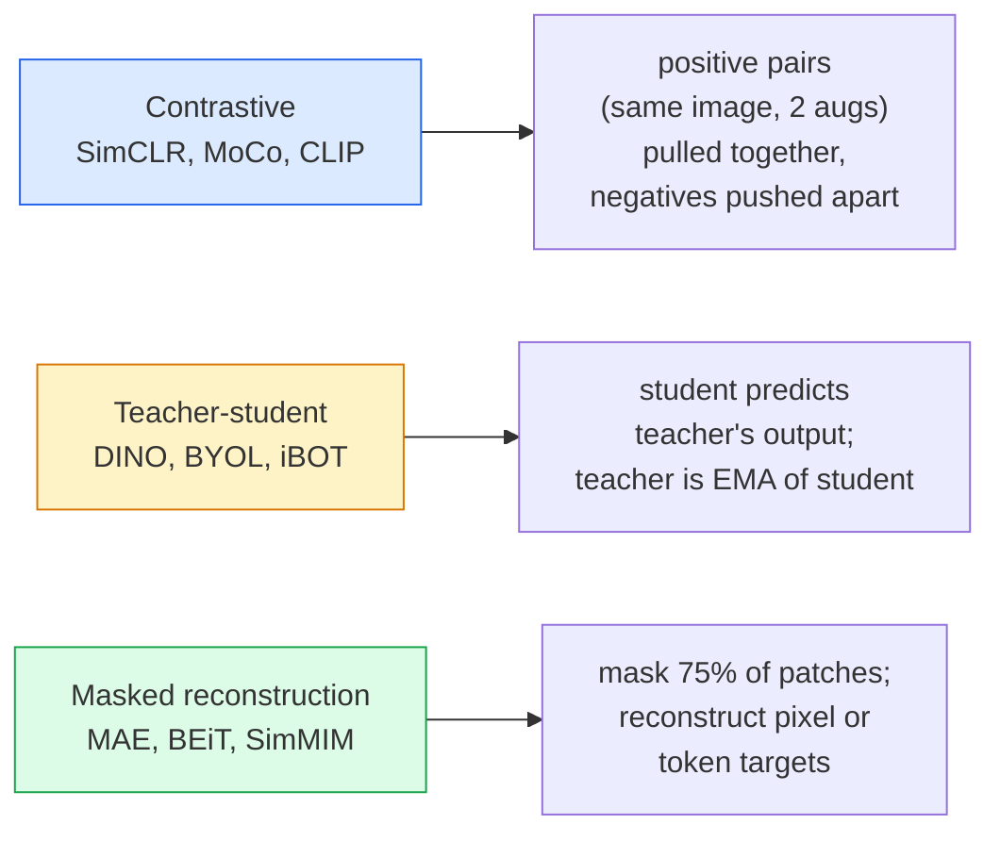

# Self-Supervised Vision — SimCLR, DINO, MAE

> Labels 是 supervised vision 的瓶颈。Self-supervised pretraining 移除了它们：从 100M 张无标注图像中学习视觉特征，再在 10k 张有标注图像上 fine-tune。

**类型：** 学习 + 构建
**语言：** Python
**先修要求：** Phase 4 Lesson 04（Image Classification），Phase 4 Lesson 14（ViT）
**时间：** 约 75 分钟

## 学习目标

- 梳理三大 self-supervised 家族 — contrastive（SimCLR）、teacher-student（DINO）、masked reconstruction（MAE）— 并说明每一种在优化什么
- 从零实现 InfoNCE loss，并解释为什么 batch size 为 512 可行，而 batch size 为 32 会失败
- 解释为什么 MAE 的 75% masking ratio 不是随意设定的，以及它与 BERT 文本中的 15% 有何不同
- 使用 DINOv2 或 MAE ImageNet checkpoints 进行 linear probing 和 zero-shot retrieval

## 问题

Supervised ImageNet 有 1.3M 张有标注图像，据估算标注成本为 10M 美元。Medical 和 industrial 数据集更小，标注成本也更高。每个 vision 团队都会问：我们能否先在廉价的无标注数据上 pretrain — YouTube 帧、web crawls、webcam footage、satellite sweeps — 然后在小规模有标注集合上 fine-tune？

Self-supervised learning 就是答案。一个在 LAION 或 JFT 上训练的现代 self-supervised ViT，在 fine-tune 后可以达到或超过 supervised ImageNet 准确率。它也比 supervised pretraining 更好地迁移到下游任务（detection、segmentation、depth）。DINOv2（Meta，2023）和 MAE（Meta，2022）是当前用于可迁移视觉特征的生产默认选择。

概念上的转变是：pretext task — 模型被训练去完成的任务 — 不必是 downstream task。关键在于它是否迫使模型学习有用特征。预测 grayscale 图像的颜色、旋转图像并让模型分类旋转角度、mask patches 并重建它们 — 这些方法都奏效过。能够规模化的三种方法是 contrastive learning、teacher-student distillation 和 masked reconstruction。

## 概念

### 三个家族



### Contrastive learning（SimCLR）

取一张图像，应用两次随机 augmentations，得到两个 views。将二者送入同一个 encoder 加 projection head。最小化一个 loss，含义是“这两个 Embeddings 应该接近”，并且“这个 Embedding 应该远离 batch 中所有其他图像的 Embeddings”。

```
Loss for positive pair (z_i, z_j) among 2N views per batch:

   L_ij = -log( exp(sim(z_i, z_j) / tau) / sum_k in batch \ {i} exp(sim(z_i, z_k) / tau) )

sim = cosine similarity
tau = temperature (0.1 standard)
```

这就是 InfoNCE loss。它要求每个 positive 有许多 negatives，因此 batch size 很重要 — SimCLR 需要 512-8192。MoCo 引入了一个由过去 batches 构成的 momentum queue，将 negative 数量与 batch size 解耦。

### Teacher-student（DINO）

两个架构相同的 networks：student 和 teacher。teacher 是 student 权重的 exponential moving average（EMA）。二者都看到同一图像的 augmented views。student 的输出被训练为匹配 teacher 的输出 — 没有显式 negatives。

```
loss = CE( student_output(view_1),  teacher_output(view_2) )
     + CE( student_output(view_2),  teacher_output(view_1) )

teacher_weights = m * teacher_weights + (1 - m) * student_weights   (m ≈ 0.996)
```

为什么它不会 collapse 成“预测一个常量”：teacher 的输出会被 centered（减去每个维度的均值）并 sharpened（除以较小 temperature）。Centering 防止某一个维度占主导；sharpening 防止输出 collapse 为 uniform。

DINO 是 DINOv2 规模化的基础，DINOv2 在 142M 张 curated images 上训练。所得特征是当前 zero-shot visual retrieval 和 dense prediction 的 SOTA。

### Masked reconstruction（MAE）

Mask 一个 ViT 输入中 75% 的 patches。只将可见的 25% 送入 encoder。一个小 decoder 接收 encoder 输出以及位于 masked positions 的 mask tokens，并被训练来重建 masked patches 的 pixels。

```
Encoder:  visible 25% of patches -> features
Decoder:  features + mask tokens at masked positions -> reconstructed pixels
Loss:     MSE between reconstructed and original pixels on masked patches only
```

让 MAE 有效的关键设计选择：

- **75% mask ratio** — 很高。迫使 encoder 学习语义特征；重建 25% 会接近 trivial（相邻 pixels 的相关性太强，以至于 CNN 都能轻松完成）。
- **Asymmetric encoder/decoder** — 大型 ViT encoder 只看到可见 patches；小 decoder（8-layer，512-dim）处理重建。比朴素 BEiT pretraining 快 3 倍。
- **Pixel-space reconstruction target** — 比 BEiT 的 tokenised target 更简单，并且在 ViT 上效果更好。

Pretraining 之后，丢弃 decoder。encoder 就是 feature extractor。

### 为什么是 75% 而不是 15%

BERT mask 15% 的 tokens。MAE mask 75%。差异在于信息密度。

- Natural language 每个 token 的熵很高。预测 15% 的 tokens 仍然很难，因为每个 masked position 都有许多 plausible completions。
- Image patches 的熵很低 — 一个未被 mask 的邻域通常几乎可以精确决定 masked patch 的 pixels。要让预测需要语义理解，就必须激进地 mask。

75% 足够高，使得简单的空间外推无法解决任务；encoder 必须表示图像内容。

### Linear-probe evaluation

Self-supervised pretraining 之后，标准评估是 **linear probe**：冻结 encoder，在其上基于 ImageNet labels 训练一个单层 linear classifier。报告 top-1 accuracy。

- SimCLR ResNet-50：约 71%（2020）
- DINO ViT-S/16：约 77%（2021）
- MAE ViT-L/16：约 76%（2022）
- DINOv2 ViT-g/14：约 86%（2023）

Linear probe 是对特征质量的纯粹衡量；fine-tuning 通常会增加 2-5 个点，但也会混入 head retraining 的影响。

```figure
data-augmentation
```

## 构建它

### 步骤 1：Two-view augmentation pipeline

```python
import torch
import torchvision.transforms as T

two_view_train = lambda: T.Compose([
    T.RandomResizedCrop(96, scale=(0.2, 1.0)),
    T.RandomHorizontalFlip(),
    T.ColorJitter(0.4, 0.4, 0.4, 0.1),
    T.RandomGrayscale(p=0.2),
    T.ToTensor(),
])


class TwoViewDataset(torch.utils.data.Dataset):
    def __init__(self, base):
        self.base = base
        self.aug = two_view_train()

    def __len__(self):
        return len(self.base)

    def __getitem__(self, i):
        img, _ = self.base[i]
        v1 = self.aug(img)
        v2 = self.aug(img)
        return v1, v2
```

每个 __getitem__ 返回同一图像的两个 augmented views；不需要 labels。

### 步骤 2：InfoNCE loss

```python
import torch.nn.functional as F

def info_nce(z1, z2, tau=0.1):
    """
    z1, z2: (N, D) L2-normalised embeddings of paired views
    """
    N, D = z1.shape
    z = torch.cat([z1, z2], dim=0)  # (2N, D)
    sim = z @ z.T / tau              # (2N, 2N)

    mask = torch.eye(2 * N, dtype=torch.bool, device=z.device)
    sim = sim.masked_fill(mask, float("-inf"))

    targets = torch.cat([torch.arange(N, 2 * N), torch.arange(0, N)]).to(z.device)
    return F.cross_entropy(sim, targets)
```

调用前先对 Embeddings 进行 L2-normalise。`tau=0.1` 是 SimCLR 默认值；更低的值会让 loss 更尖锐，并需要更多 negatives。

### 步骤 3：Sanity check InfoNCE

```python
z1 = F.normalize(torch.randn(16, 32), dim=-1)
z2 = z1.clone()
loss_same = info_nce(z1, z2, tau=0.1).item()
z2_random = F.normalize(torch.randn(16, 32), dim=-1)
loss_random = info_nce(z1, z2_random, tau=0.1).item()
print(f"InfoNCE with identical pairs:  {loss_same:.3f}")
print(f"InfoNCE with random pairs:     {loss_random:.3f}")
```

相同 pairs 应该得到较低 loss（在大 batch 和低 temperature 下接近 0）。随机 pairs 应该得到 log(2N-1) = ~log(31) = ~3.4，针对 16-pair batch。

### 步骤 4：MAE-style masking

```python
def random_mask_indices(num_patches, mask_ratio=0.75, seed=0):
    g = torch.Generator().manual_seed(seed)
    n_keep = int(num_patches * (1 - mask_ratio))
    perm = torch.randperm(num_patches, generator=g)
    visible = perm[:n_keep]
    masked = perm[n_keep:]
    return visible.sort().values, masked.sort().values


num_patches = 196
visible, masked = random_mask_indices(num_patches, mask_ratio=0.75)
print(f"visible: {len(visible)} / {num_patches}")
print(f"masked:  {len(masked)} / {num_patches}")
```

简单、快速，并且对于给定 seed 是 deterministic 的。真实 MAE 实现会对其进行 batching，并保留每个 sample 的 masks。

## 使用它

DINOv2 是 2026 年的生产标准：

```python
import torch
from transformers import AutoImageProcessor, AutoModel

processor = AutoImageProcessor.from_pretrained("facebook/dinov2-base")
model = AutoModel.from_pretrained("facebook/dinov2-base")
model.eval()

# Per-image embeddings for zero-shot retrieval
with torch.no_grad():
    inputs = processor(images=[pil_image], return_tensors="pt")
    outputs = model(**inputs)
    embedding = outputs.last_hidden_state[:, 0]  # CLS token
```

所得 768-dim Embedding 是现代 image retrieval、dense correspondence 和 zero-shot transfer pipelines 的骨干。对下游任务进行 fine-tuning 时，通常只需要一个 linear head。

对于 image-text Embeddings，SigLIP 或 OpenCLIP 是对应方案；对于 MAE-style fine-tuning，`timm` repo 提供了所有 MAE checkpoint。

## 交付它

本课会产出：

- `outputs/prompt-ssl-pretraining-picker.md` — 一个 prompt，根据 dataset size、compute 和 downstream task 选择 SimCLR / MAE / DINOv2。
- `outputs/skill-linear-probe-runner.md` — 一个 skill，为任意 frozen encoder + labelled dataset 编写 linear-probe evaluation。

## 练习

1. **（Easy）** 验证：对于对齐良好的 Embeddings，降低 temperature 会使 InfoNCE loss 下降；对于随机 Embeddings，降低 temperature 会使 loss 上升。生成一张 `tau in [0.05, 0.1, 0.2, 0.5]` vs loss 的图。
2. **（Medium）** 实现一个 DINO-style centre buffer。展示如果没有 centring，student 会在几个 epochs 内 collapse 为常量 Vector。
3. **（Hard）** 使用 Lesson 10 中的 TinyUNet 作为 backbone，在 CIFAR-100 上训练 MAE。报告 10、50 和 200 epochs 时的 linear-probe accuracy。展示在同一个 1,000-image subset 上，MAE-pretrained linear probe 优于 from-scratch supervised linear probe。

## 关键术语

| Term | 人们的说法 | 实际含义 |
|------|----------------|----------------------|
| Self-supervised | “Label-free” | 一种 pretext task，用于从无标注数据中产生有用 representations |
| Pretext task | “假任务” | SSL 期间使用的 objective（reconstruct patches、match views）；pretraining 后会被丢弃 |
| Linear probe | “Frozen encoder + linear head” | 标准 SSL 评估：只在 frozen features 之上训练一个 linear classifier |
| InfoNCE | “Contrastive loss” | 对 cosine similarities 做 softmax；positive pair 是目标类别，所有其他项都是 negatives |
| EMA teacher | “Moving-average teacher” | 权重是 student 的 exponential moving average 的 teacher；BYOL、MoCo、DINO 使用它 |
| Mask ratio | “隐藏的 patches 百分比” | MAE 期间被 mask 的 patches 比例；vision 为 75%，text 为 15% |
| Representation collapse | “Constant output” | SSL 失败模式：encoder 对所有输入输出一个常量 Vector；通过 centring、sharpening 或 negatives 防止 |
| DINOv2 | “生产级 SSL backbone” | Meta 2023 年的 self-supervised ViT；2026 年最强的通用 image features |

## 延伸阅读

- [SimCLR (Chen et al., 2020)](https://arxiv.org/abs/2002.05709) — contrastive learning 参考
- [DINO (Caron et al., 2021)](https://arxiv.org/abs/2104.14294) — 带 momentum、centring、sharpening 的 teacher-student
- [MAE (He et al., 2022)](https://arxiv.org/abs/2111.06377) — 面向 ViT 的 masked autoencoder pretraining
- [DINOv2 (Oquab et al., 2023)](https://arxiv.org/abs/2304.07193) — 将 self-supervised ViT 扩展到生产级特征
