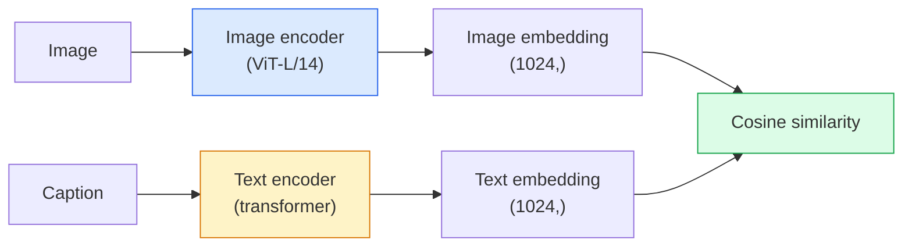

# Open-Vocabulary Vision — CLIP

> 将一个 image encoder 和一个 text encoder 一起训练，让匹配的 (image, caption) 对落在共享空间中的同一个点。这就是整个技巧。

**Type:** Build + Use
**Languages:** Python
**Prerequisites:** Phase 4 Lesson 14 (ViT), Phase 4 Lesson 17 (Self-Supervised)
**Time:** ~45 分钟

## 学习目标

- 解释 CLIP 的 two-tower architecture 和 contrastive training objective
- 使用 pretrained CLIP（或 SigLIP）进行 zero-shot classification，无需任何 task-specific training
- 从零实现 zero-shot classification：encode class prompts、计算 cosine similarity、取 argmax
- 区分 CLIP、SigLIP、OpenCLIP 和 LLaVA/LLaMA-vision models——它们各自在 2026 年用于什么

## 问题

传统 classifiers 是 closed-vocabulary：一个 1000-class ImageNet model 只能预测 1000 个 labels。每个新 category 都需要 labelled data 和重新训练的 head。

CLIP（Radford et al., OpenAI 2021）表明，在从 web 抓取的 400M 个 (image, caption) pairs 上训练，可以得到一个 model，它能在 inference 时分类到任何类别集合中，而这些类别只需用自然语言描述。你通过写一句话来给它一个新的 class。

这种能力——zero-shot transfer——就是每个现代 vision system 都从 CLIP-family checkpoint 开始的原因。Detection（Grounding DINO、OWL-ViT）、segmentation（CLIPSeg、SAM）、retrieval、content moderation、VLMs 和 text-to-image generation 都建立在 CLIP-style joint embeddings 之上。

## 概念

### Two towers



两个 encoders 最后都会通过 linear projection 投影到相同的 embedding dimension（CLIP-B/32 为 512，CLIP-L/14 为 1024）。进行 L2-normalise 并计算 cosine similarity。

### 目标

给定一个包含 N 个 (image, caption) pairs 的 batch，构建一个 NxN similarity matrix。训练两个 encoders，使 diagonal（matching pairs）具有高 similarity，而 off-diagonals（non-matching）具有低 similarity。

```
sim_matrix = image_embeddings @ text_embeddings.T / tau

loss_i2t = cross_entropy(sim_matrix,       targets=arange(N))
loss_t2i = cross_entropy(sim_matrix.T,     targets=arange(N))
loss = (loss_i2t + loss_t2i) / 2
```

这是 symmetric 的，因为 image-to-text 和 text-to-image retrieval 都应该可用。`tau`（temperature）通常作为 scalar parameter 学习，初始化为 0.07。

### SigLIP：更好的 Loss

SigLIP（Zhai et al., 2023）用 per-pair sigmoid 替换了 softmax：

```
loss = mean over pairs of log(1 + exp(-y_ij * sim_ij))
y_ij = +1 if matching, -1 otherwise
```

Per-pair Loss 移除了 CLIP 所需的 batch-level normalisation。SigLIP 在小 batch sizes 下训练更好，并且在相同数据量下匹配或超过 CLIP。

### Zero-shot classification

给定一个训练好的 CLIP：

1. 对每个 class，组合一个 prompt："a photo of a {class}"。
2. 用 text encoder encode 所有 class prompts -> `T` shape (C, d)。
3. Encode test image -> `I` shape (1, d)。
4. Similarity = `I @ T.T` shape (1, C)。
5. Argmax -> predicted class。

Prompt engineering 很重要。OpenAI 为 ImageNet 发布了 80 个 prompt templates（"a photo of a {}"、"a blurry photo of a {}"、"a sketch of a {}"、...）。对每个 class 的所有 templates 的 embeddings 取平均，可以额外提升 1-3% top-1 accuracy。

### 2026 年 CLIP-style models 的使用场景

- **Zero-shot classification**——直接使用。
- **Image retrieval**——一次性 encode 所有 images，在 inference 时 embed query。
- **Text-conditioned detection**——Grounding DINO、OWL-ViT 将 CLIP text tower 包装在 detector 周围。
- **Text-conditioned segmentation**——CLIPSeg；SAM 通过 CLIP 使用 text-prompt inputs。
- **VLMs**——LLaVA、Qwen-VL、InternVL 将 CLIP-family vision encoder 接入 LLM。
- **Text-to-image gen**——Stable Diffusion、DALL-E 3 以 CLIP text embeddings 为条件。

一旦你有了共享 embedding space，每个 vision+language task 都会变成距离计算。

## 构建它

### 步骤 1：一个极小的 two-tower model

真正的 CLIP 是 ViT + transformer。本课中，towers 是基于预提取 features 的小型 MLPs，因此训练信号在 CPU 上也能看见。

```python
import torch
import torch.nn as nn
import torch.nn.functional as F


class TwoTower(nn.Module):
    def __init__(self, img_in=128, txt_in=64, emb=64):
        super().__init__()
        self.image_proj = nn.Sequential(nn.Linear(img_in, 128), nn.ReLU(), nn.Linear(128, emb))
        self.text_proj = nn.Sequential(nn.Linear(txt_in, 128), nn.ReLU(), nn.Linear(128, emb))
        self.logit_scale = nn.Parameter(torch.ones([]) * 2.6592)  # ln(1/0.07)

    def forward(self, img_feats, txt_feats):
        i = F.normalize(self.image_proj(img_feats), dim=-1)
        t = F.normalize(self.text_proj(txt_feats), dim=-1)
        return i, t, self.logit_scale.exp()
```

两个 projections、shared-dim output、learned temperature。shape 与真实 CLIP API 相同。

### 步骤 2：Contrastive Loss

```python
def clip_loss(image_emb, text_emb, logit_scale):
    N = image_emb.size(0)
    sim = logit_scale * image_emb @ text_emb.T
    targets = torch.arange(N, device=sim.device)
    l_i = F.cross_entropy(sim, targets)
    l_t = F.cross_entropy(sim.T, targets)
    return (l_i + l_t) / 2
```

Symmetric。更高的 logit_scale = 更尖锐的 softmax = 更自信，但有不稳定风险。

### 步骤 3：Zero-shot classifier

```python
@torch.no_grad()
def zero_shot_classify(model, image_feats, class_text_feats, class_names):
    """
    image_feats:      (N, img_in)
    class_text_feats: (C, txt_in)   one averaged embedding per class
    """
    i = F.normalize(model.image_proj(image_feats), dim=-1)
    t = F.normalize(model.text_proj(class_text_feats), dim=-1)
    sim = i @ t.T
    pred = sim.argmax(dim=-1)
    return [class_names[p] for p in pred.tolist()]
```

每个步骤一行。这就是在 production CLIP checkpoint 中使用的精确 zero-shot procedure。

### 步骤 4：Sanity check

```python
torch.manual_seed(0)
model = TwoTower()

img = torch.randn(8, 128)
txt = torch.randn(8, 64)
i, t, scale = model(img, txt)
loss = clip_loss(i, t, scale)
print(f"batch size: {i.size(0)}   loss: {loss.item():.3f}")
```

对于随机初始化的 model，Loss 应该接近 `log(N) = log(8) = 2.08`——这是还没有学到结构时的 symmetric cross-entropy target。

## 使用它

OpenCLIP 是 2026 年的社区默认选择：

```python
import open_clip
import torch
from PIL import Image

model, _, preprocess = open_clip.create_model_and_transforms("ViT-B-32", pretrained="laion2b_s34b_b79k")
tokenizer = open_clip.get_tokenizer("ViT-B-32")

image = preprocess(Image.open("dog.jpg")).unsqueeze(0)
text = tokenizer(["a photo of a dog", "a photo of a cat", "a photo of a car"])

with torch.no_grad():
    image_features = model.encode_image(image)
    text_features = model.encode_text(text)
    image_features = image_features / image_features.norm(dim=-1, keepdim=True)
    text_features = text_features / text_features.norm(dim=-1, keepdim=True)
    probs = (100.0 * image_features @ text_features.T).softmax(dim=-1)

print(probs)
```

SigLIP 更新，在小规模下训练更好，并且更适合新工作：`google/siglip-base-patch16-224`。Hugging Face 同时提供两者。

## 交付它

本课会产出：

- `outputs/prompt-zero-shot-class-picker.md`——一个 prompt，用于在给定 classes 列表和 domain 时，为 zero-shot CLIP 设计 class templates。
- `outputs/skill-image-text-retriever.md`——一个 skill，用任何 CLIP checkpoint 构建 image embedding index，支持 query-by-text 和 query-by-image。

## 练习

1. **（Easy）** 使用 pretrained OpenCLIP ViT-B/32，并在 CIFAR-10 上用 80-template prompt set 做 zero-shot classification。报告 top-1 accuracy；它应该大约在 85-90%。
2. **（Medium）** 在同一个 CIFAR-10 task 上比较 single-template（"a photo of a {}"）与 80-template averaged embeddings。量化差距并解释为什么 templates 有帮助。
3. **（Hard）** 构建一个 zero-shot image retrieval index：用 CLIP embed 1,000 张 images，构建 FAISS index，用自然语言描述进行 query。对你手写的 20 个 held-out queries 报告 retrieval recall@5。

## 关键术语

| Term | 人们怎么说 | 它实际意味着什么 |
|------|----------------|----------------------|
| Two-tower | "Dual encoder" | 独立的 image 和 text encoders，末端是 shared-dim projection head |
| Zero-shot | "No task-specific training" | 在 inference 时分类到仅由文本描述的 classes；不接触 labels |
| Temperature / logit_scale | "tau" | 在 softmax 前缩放 similarity matrix 的 learned scalar |
| Prompt template | "A photo of a {}" | 包裹 class names 的自然语言包装器；平均多个 templates 会提升 zero-shot accuracy |
| CLIP | "Image+text model" | 2021 年的 OpenAI model；2026 年该领域的通用语汇 |
| SigLIP | "Sigmoid CLIP" | 将 softmax 替换为 per-pair sigmoid；在小 batch 下训练更好 |
| OpenCLIP | "Open reproduction" | 社区在 LAION 上训练的 CLIP variants；open-source pipelines 的 production default |
| VLM | "Vision-language model" | CLIP-family encoder 加上 LLM，训练用来回答关于 images 的问题 |

## 延伸阅读

- [CLIP：从自然语言监督中学习可迁移视觉模型（Radford et al., 2021）](https://arxiv.org/abs/2103.00020)
- [SigLIP：用于 Language-Image Pre-Training 的 Sigmoid Loss（Zhai et al., 2023）](https://arxiv.org/abs/2303.15343)
- [OpenCLIP](https://github.com/mlfoundations/open_clip)——社区 codebase
- [DINOv2 vs CLIP vs MAE：features comparison](https://huggingface.co/blog/dinov2)——包含并排 use cases 的 HF guide
