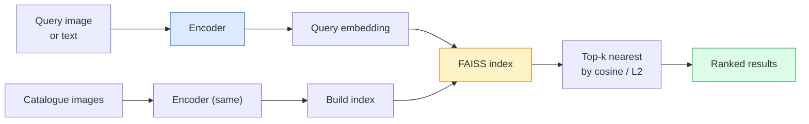

# Image Retrieval 与 Metric Learning

> Retrieval system 会按 Embedding space 中的距离对候选项排序。Metric learning 是塑造这个空间的学科，使距离表达你想要的含义。

**Type:** Build
**Languages:** Python
**Prerequisites:** Phase 4 Lesson 14 (ViT), Phase 4 Lesson 18 (CLIP)
**Time:** ~45 minutes

## 学习目标
- 解释 triplet、contrastive 和 proxy-based metric learning losses，并为给定数据集选择合适的方法
- 正确实现 L2-normalisation 和 cosine similarity，并审计 "same item" 与 "same class" retrieval 的区别
- 构建 FAISS index，用文本和图像查询它，并为 held-out query set 报告 recall@K
- 将 DINOv2、CLIP 和 SigLIP 用作 off-the-shelf Embedding backbones，并知道各自何时胜出

## 问题
Retrieval 在生产视觉系统中无处不在：duplicate detection、reverse image search、visual search（"find similar products"）、face re-identification、用于监控的 person re-ID、用于电商的 instance-level matching。产品问题始终相同："给定这张 query image，对我的 catalogue 排序。"

两个设计决策决定整个系统。Embedding，也就是由什么模型产生 Vector。Index，也就是如何在规模化场景中找到最近邻。到 2026 年，两者都已商品化（DINOv2 用于 Embedding，FAISS 用于 index），这提高了门槛：难点在于定义你的应用中*什么算相似*，然后塑造 Embedding space，让距离与这个定义匹配。

这种塑造就是 metric learning。它是一个小而高杠杆的学科。

## 概念
### Retrieval at a glance



### The four loss families

| Loss | Requires | Pros | Cons |
|------|----------|------|------|
| **Contrastive** | (anchor, positive) + negatives | 简单，可用于任何 pair label | 没有大量 negatives 时收敛较慢 |
| **Triplet** | (anchor, positive, negative) | 直观；可直接控制 margin | Hard-triplet mining 成本高 |
| **NT-Xent / InfoNCE** | Pairs + batch-mined negatives | 可扩展到大 batch | 需要大 batch 或 momentum queue |
| **Proxy-based (ProxyNCA)** | 仅 class labels | 快速、稳定、无需 mining | 在小数据集上可能 overfit 到 proxies |

对大多数生产用例，先从 pretrained backbone 开始；只有当 off-the-shelf Embeddings 在你的测试集上表现不足时，再加入 metric-learning fine-tune。

### Triplet loss formally

```
L = max(0, ||f(a) - f(p)||^2 - ||f(a) - f(n)||^2 + margin)
```

把 anchor `a` 拉近 positive `p`，把它推离 negative `n`，并使用 `margin` 确保间隔。三图结构可以泛化到任何相似度排序。

Mining 很重要：easy triplets（`n` 已经离 `a` 很远）贡献零 Loss；只有 hard triplets 才能教会模型。Semi-hard mining（`n` 比 `p` 更远但仍在 margin 内）是 2016 年 FaceNet 的方案，并且至今仍占主导。

### Cosine similarity vs L2

两种 metrics，两套约定：

- **Cosine**：Vector 之间的夹角。需要 L2-normalised Embeddings。
- **L2**：Euclidean distance。可用于 raw 或 normalised Embeddings，但通常与 L2-normalised + squared L2 搭配。

对大多数现代 nets 来说，两者是等价的：当 `||a|| = ||b|| = 1` 时，`||a - b||^2 = 2 - 2 cos(a, b)`。选择与你的 Embedding 训练一致的约定；混用会悄悄改变 "nearest" 的含义。

### Recall@K

标准 retrieval metric：

```
recall@K = fraction of queries where at least one correct match is in the top K results
```

并排报告 recall@1、@5、@10。若 recall@10 高于 0.95 而 recall@1 低于 0.5，说明 Embedding space 结构正确，但排序有噪声；可以尝试更长的 fine-tunes 或 re-ranking 步骤。

对于 duplicate detection，precision@K 更重要，因为每个 false positive 都是用户可见的错误。对于 visual search，recall@K 是产品信号。

### FAISS in one paragraph

Facebook AI Similarity Search。事实标准的 nearest-neighbour search 库。三种 index 选择：

- `IndexFlatIP` / `IndexFlatL2` — brute force、精确、无需训练。可用到约 1M vectors。
- `IndexIVFFlat` — 划分为 K 个 cells，只搜索最近的少数 cells。近似、快速、需要训练数据。
- `IndexHNSW` — graph-based，对大量查询最快，index size 较大。

对于 100k vectors，你可能想在 cosine similarity 上使用 `IndexFlatIP`。对于 10M，使用 `IndexIVFFlat`。对于 100M+，结合 product quantisation（`IndexIVFPQ`）。

### instance-level vs category-level retrieval

两个名称相同但非常不同的问题：

- **Category-level** — "在我的 catalogue 中找 cats。" Class-conditional similarity；off-the-shelf CLIP / DINOv2 Embeddings 效果很好。
- **Instance-level** — "在我的 catalogue 中找*这个确切产品*。" 需要在同一类别内视觉相似对象之间做细粒度区分；off-the-shelf Embeddings 表现不足；使用 metric learning fine-tuning 很重要。

在选择模型之前，始终先问清楚你解决的是哪一个。

## 构建它
### 步骤 1： Triplet loss

```python
import torch
import torch.nn.functional as F

def triplet_loss(anchor, positive, negative, margin=0.2):
    d_ap = F.pairwise_distance(anchor, positive, p=2)
    d_an = F.pairwise_distance(anchor, negative, p=2)
    return F.relu(d_ap - d_an + margin).mean()
```

一行。适用于 L2-normalised 或 raw Embeddings。

### 步骤 2： Semi-hard mining

给定一批 Embeddings 和 labels，为每个 anchor 找到最难的 semi-hard negative。

```python
def semi_hard_negatives(emb, labels, margin=0.2):
    dist = torch.cdist(emb, emb)
    same_class = labels[:, None] == labels[None, :]
    diff_class = ~same_class
    N = emb.size(0)

    positives = dist.clone()
    positives[~same_class] = float("-inf")
    positives.fill_diagonal_(float("-inf"))
    pos_idx = positives.argmax(dim=1)

    semi_hard = dist.clone()
    semi_hard[same_class] = float("inf")
    d_ap = dist[torch.arange(N), pos_idx].unsqueeze(1)
    semi_hard[dist <= d_ap] = float("inf")
    neg_idx = semi_hard.argmin(dim=1)

    fallback_mask = semi_hard[torch.arange(N), neg_idx] == float("inf")
    if fallback_mask.any():
        hardest = dist.clone()
        hardest[same_class] = float("inf")
        neg_idx = torch.where(fallback_mask, hardest.argmin(dim=1), neg_idx)
    return pos_idx, neg_idx
```

每个 anchor 都会得到 class 内最难的 positive，以及一个比 positive 更远但在 margin 内的 semi-hard negative。

### 步骤 3： Recall@K

```python
def recall_at_k(query_emb, gallery_emb, query_labels, gallery_labels, k=1):
    sim = query_emb @ gallery_emb.T
    _, top_k = sim.topk(k, dim=-1)
    matches = (gallery_labels[top_k] == query_labels[:, None]).any(dim=-1)
    return matches.float().mean().item()
```

在 L2-normalised Embeddings 上按 inner product 取 top-k，等同于按 cosine 取 top-k。报告至少有一个正确 neighbour 的查询平均比例。

### 步骤 4： Putting it together

```python
import torch
import torch.nn as nn
from torch.optim import Adam

class Encoder(nn.Module):
    def __init__(self, in_dim=128, emb_dim=64):
        super().__init__()
        self.net = nn.Sequential(
            nn.Linear(in_dim, 128), nn.ReLU(),
            nn.Linear(128, emb_dim),
        )

    def forward(self, x):
        return F.normalize(self.net(x), dim=-1)

torch.manual_seed(0)
num_classes = 6
protos = F.normalize(torch.randn(num_classes, 128), dim=-1)

def sample_batch(bs=32):
    labels = torch.randint(0, num_classes, (bs,))
    x = protos[labels] + 0.15 * torch.randn(bs, 128)
    return x, labels

enc = Encoder()
opt = Adam(enc.parameters(), lr=3e-3)

for step in range(200):
    x, y = sample_batch(32)
    emb = enc(x)
    pos_idx, neg_idx = semi_hard_negatives(emb, y)
    loss = triplet_loss(emb, emb[pos_idx], emb[neg_idx])
    opt.zero_grad(); loss.backward(); opt.step()
```

几百步之后，Embedding clusters 会形成每个 class 一个 cluster。

## 使用它
2026 年的生产栈：

- **DINOv2 + FAISS** — 通用 visual retrieval。可 off-the-shelf 使用。
- **CLIP + FAISS** — 当查询是文本时。
- **Fine-tuned DINOv2 + FAISS** — instance-level retrieval、face re-ID、fashion、e-commerce。
- **Milvus / Weaviate / Qdrant** — 围绕 FAISS 或 HNSW 的 managed vector DB wrappers。

对于 SOTA instance retrieval，配方是：DINOv2 backbone，添加 Embedding head，在 instance-labelled pairs 上用 triplet 或 InfoNCE Loss fine-tune，并在 FAISS 中建立 index。

## 交付它
本课产出：

- `outputs/prompt-retrieval-loss-picker.md` — 一个 prompt，用于为给定 retrieval 问题选择 triplet / InfoNCE / ProxyNCA。
- `outputs/skill-recall-at-k-runner.md` — 一个 skill，用于编写干净的 recall@K evaluation harness，包含 train/val/gallery splits 和正确的数据契约。

## 练习
1. **(Easy)** 运行上面的 toy example。用 PCA 绘制训练前后的 Embeddings，观察六个 clusters 如何形成。
2. **(Medium)** 添加 ProxyNCA Loss 实现：每个 class 一个 learned "proxy"，在 cosine similarity 上做标准 cross-entropy。比较它与 triplet loss 在 toy data 上的收敛速度。
3. **(Hard)** 取 1,000 张 ImageNet validation images，通过 HuggingFace 用 DINOv2 生成 Embeddings，构建 FAISS flat index，并报告以同一批图像为 queries 时的 recall@{1, 5, 10}（应为 1.0），以及以 held-out split 和 ImageNet labels 作为 ground truth 时的结果。

## 关键术语
| Term | What people say | What it actually means |
|------|----------------|----------------------|
| Metric learning | "Shape the space" | 训练一个 encoder，使其输出空间中的距离反映目标相似度 |
| Triplet loss | "Pull and push" | L = max(0, d(a, p) - d(a, n) + margin)；经典的 metric-learning Loss |
| Semi-hard mining | "Useful negatives" | 比 positive 更远但仍在 margin 内的 negatives；经验上信息量最大 |
| Proxy-based loss | "Class prototypes" | 每个 class 一个 learned proxy；对 similarity-to-proxies 做 cross-entropy；无需 pair mining |
| Recall@K | "Top-K hit rate" | top K 中至少有一个正确结果的查询比例 |
| Instance retrieval | "Find this exact thing" | 细粒度匹配；off-the-shelf features 通常表现不足 |
| FAISS | "The NN library" | Facebook 的 nearest-neighbour 库；支持精确和近似 indexes |
| HNSW | "Graph index" | Hierarchical navigable small world；内存开销小的快速近似 NN |

## 延伸阅读
- [FaceNet: A Unified Embedding for Face Recognition (Schroff et al., 2015)](https://arxiv.org/abs/1503.03832) — triplet loss / semi-hard mining 论文
- [In Defense of the Triplet Loss for Person Re-Identification (Hermans et al., 2017)](https://arxiv.org/abs/1703.07737) — triplet fine-tuning 实践指南
- [FAISS documentation](https://github.com/facebookresearch/faiss/wiki) — 每种 index、每种 trade-off
- [SMoT: Metric Learning Taxonomy (Kim et al., 2021)](https://arxiv.org/abs/2010.06927) — 现代 losses 及其联系的综述
