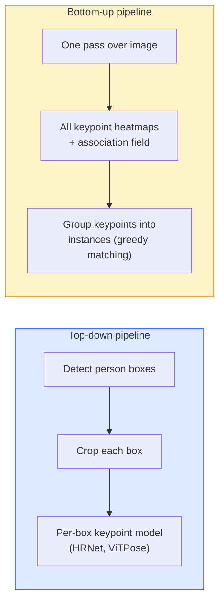

# Keypoint Detection 与 Pose Estimation

> 一个 pose 是一组有序 keypoints。一个 keypoint detector 是一个 heatmap regressor。其他一切都是 bookkeeping。

**Type:** Build
**Languages:** Python
**Prerequisites:** Phase 4 Lesson 06 (Detection), Phase 4 Lesson 07 (U-Net)
**Time:** ~45 分钟

## 学习目标
- 区分 top-down 和 bottom-up pose estimation，并说明各自何时使用
- 使用 Gaussian-per-keypoint target 为 K 个 keypoints Regression heatmaps，并在 inference 时提取 keypoint coordinates
- 解释 Part Affinity Fields (PAFs)，以及 bottom-up pipelines 如何把 keypoints 关联成 instances
- 使用 MediaPipe Pose 或 MMPose 做生产级 keypoint estimation，并理解它们的输出格式

## 问题
Keypoint tasks 有许多名称：human pose（17 个 body joints）、face landmarks（68 或 478 个点）、hand（21 个点）、animal pose、robotic object pose、medical anatomy landmarks。它们都共享同一个结构：在一个 object 上检测 K 个离散点，并输出它们的 (x, y) coordinates。

Pose estimation 是 motion capture、fitness apps、sports analytics、gesture control、animation、AR try-on 和 robotic grasping 的基础。2D 场景已经成熟；3D pose（从单个 camera 估计 world coordinates 中的 joint positions）是当前研究前沿。

工程问题在于 scale。单图、单人 pose 是一个 20ms 问题。人群中的 multi-person pose 要在 30 fps 下运行，则是一个架构完全不同的问题。

## 概念
### Top-down vs bottom-up



- **Top-down** — 先检测 people，再对每个 crop 运行 per-person keypoint model。准确率最高；随人数线性扩展。
- **Bottom-up** — 一次 forward pass 预测所有 keypoints 加一个 association field；再把它们分组。无论 crowd size 如何，耗时恒定。

Top-down（HRNet, ViTPose）是准确率领先方案；bottom-up（OpenPose, HigherHRNet）是 crowded scenes 中的吞吐量领先方案。

### Heatmap regression

不要直接 Regression `(x, y)`，而是为每个 keypoint 预测一个 `H x W` heatmap，其中在真实位置中心有一个 Gaussian blob。

```
target[k, y, x] = exp(-((x - cx_k)^2 + (y - cy_k)^2) / (2 sigma^2))
```

在 inference 时，每个 heatmap 的 argmax 就是预测的 keypoint location。

为什么 heatmaps 比 direct regression 更好：network 的空间结构（conv feature map）天然对齐空间输出。Gaussian targets 也起到 regularise 的作用 — 小的 localisation error 会产生小的 Loss，而不是零。

### Sub-pixel localisation

Argmax 给出整数坐标。为了获得 sub-pixel precision，可以对 argmax 及其邻域拟合 parabola，或者使用常见的 offset `(dx, dy) = 0.25 * (heatmap[y, x+1] - heatmap[y, x-1], ...)` 方向。

### Part Affinity Fields (PAFs)

OpenPose 用于 bottom-up association 的技巧。对于每一对连接的 keypoints（例如 left shoulder 到 left elbow），预测一个 2-channel field，编码从一个点指向另一个点的 unit vector。要把 shoulder 与其 elbow 关联起来，就沿连接候选 pairs 的线积分 PAF；积分最高的 pair 被匹配。

```
For each connection (limb):
  PAF channels: 2 (unit vector x, y)
  Line integral: sum over sample points of (PAF . line_direction)
  Higher integral = stronger match
```

这个方法优雅，并且无需 per-person crops 就能扩展到任意 crowd size。

### COCO keypoints

标准的 body-pose dataset：每个人 17 个 keypoints，使用 PCK（Percentage of Correct Keypoints）和 OKS（Object Keypoint Similarity）作为 metrics。OKS 是 IoU 的 keypoint analogue，也是 COCO mAP@OKS 报告的指标。

### 2D vs 3D

- **2D pose** — image coordinates；已经达到生产质量（MediaPipe, HRNet, ViTPose）。
- **3D pose** — world / camera coordinates；仍是活跃研究方向。常见方法：
  - 用一个小 MLP 将 2D predictions lift 到 3D（VideoPose3D）。
  - 直接从 image 做 3D regression（PyMAF, MHFormer）。
  - Multi-view setups（CMU Panoptic）用于 ground truth。

```figure
cv3-pose-heatmap
```

## 构建它
### 步骤 1： Gaussian heatmap target

```python
import numpy as np
import torch

def gaussian_heatmap(size, cx, cy, sigma=2.0):
    yy, xx = np.meshgrid(np.arange(size), np.arange(size), indexing="ij")
    return np.exp(-((xx - cx) ** 2 + (yy - cy) ** 2) / (2 * sigma ** 2)).astype(np.float32)

hm = gaussian_heatmap(64, 32, 32, sigma=2.0)
print(f"peak: {hm.max():.3f} at ({hm.argmax() % 64}, {hm.argmax() // 64})")
```

沿 channel axis 堆叠 per-keypoint heatmaps，就得到完整的 target tensor。

### 步骤 2： Tiny keypoint head

一个 U-Net-style model，输出 K 个 heatmap channels。

```python
import torch.nn as nn
import torch.nn.functional as F

class TinyKeypointNet(nn.Module):
    def __init__(self, num_keypoints=4, base=16):
        super().__init__()
        self.down1 = nn.Sequential(nn.Conv2d(3, base, 3, 2, 1), nn.ReLU(inplace=True))
        self.down2 = nn.Sequential(nn.Conv2d(base, base * 2, 3, 2, 1), nn.ReLU(inplace=True))
        self.mid = nn.Sequential(nn.Conv2d(base * 2, base * 2, 3, 1, 1), nn.ReLU(inplace=True))
        self.up1 = nn.ConvTranspose2d(base * 2, base, 2, 2)
        self.up2 = nn.ConvTranspose2d(base, num_keypoints, 2, 2)

    def forward(self, x):
        h1 = self.down1(x)
        h2 = self.down2(h1)
        h3 = self.mid(h2)
        u1 = self.up1(h3)
        return self.up2(u1)
```

输入 `(N, 3, H, W)`，输出 `(N, K, H, W)`。Loss 是针对 Gaussian targets 的 per-pixel MSE。

### 步骤 3： Inference — extract keypoint coordinates

```python
def heatmap_to_coords(heatmaps):
    """
    heatmaps: (N, K, H, W)
    returns:  (N, K, 2) float coordinates in image pixels
    """
    N, K, H, W = heatmaps.shape
    hm = heatmaps.reshape(N, K, -1)
    idx = hm.argmax(dim=-1)
    ys = (idx // W).float()
    xs = (idx % W).float()
    return torch.stack([xs, ys], dim=-1)

coords = heatmap_to_coords(torch.randn(2, 4, 32, 32))
print(f"coords: {coords.shape}")  # (2, 4, 2)
```

Inference 时只需一行。对于 sub-pixel refinement，在 argmax 周围插值。

### 步骤 4： Synthetic keypoint dataset

很简单：在白色 canvas 上画四个点，并学习预测它们。

```python
def make_synthetic_sample(size=64):
    img = np.ones((3, size, size), dtype=np.float32)
    rng = np.random.default_rng()
    kps = rng.integers(8, size - 8, size=(4, 2))
    for cx, cy in kps:
        img[:, cy - 2:cy + 2, cx - 2:cx + 2] = 0.0
    hms = np.stack([gaussian_heatmap(size, cx, cy) for cx, cy in kps])
    return img, hms, kps
```

这个任务足够简单，tiny model 一分钟内就能学会。

### 步骤 5： Training

```python
model = TinyKeypointNet(num_keypoints=4)
opt = torch.optim.Adam(model.parameters(), lr=3e-3)

for step in range(200):
    batch = [make_synthetic_sample() for _ in range(16)]
    imgs = torch.from_numpy(np.stack([b[0] for b in batch]))
    hms = torch.from_numpy(np.stack([b[1] for b in batch]))
    pred = model(imgs)
    # Upsample pred to full resolution
    pred = F.interpolate(pred, size=hms.shape[-2:], mode="bilinear", align_corners=False)
    loss = F.mse_loss(pred, hms)
    opt.zero_grad(); loss.backward(); opt.step()
```

## 使用它
- **MediaPipe Pose** — Google 的生产级 pose estimator；提供 WebGL + mobile runtimes，延迟低于 10ms。
- **MMPose** (OpenMMLab) — 全面的研究 codebase；包含每种 SOTA architecture 及 pretrained weights。
- **YOLOv8-pose** — 最快的 real-time multi-person pose，使用单次 forward pass。
- **transformers HumanDPT / PoseAnything** — 用于 open-vocabulary pose（任意 object、任意 keypoint set）的较新 vision-language approaches。

## 交付它
本课产出：

- `outputs/prompt-pose-stack-picker.md` — 一个 prompt，可根据 latency、crowd size，以及 2D vs 3D 需求选择 MediaPipe / YOLOv8-pose / HRNet / ViTPose。
- `outputs/skill-heatmap-to-coords.md` — 一个 skill，用于编写每个生产 pose model 都会用到的 sub-pixel heatmap-to-coordinate routine。

## 练习
1. **(Easy)** 在 synthetic 4-point dataset 上训练 tiny keypoint model。报告 200 steps 后 predicted 与 true keypoints 之间的 mean L2 error。
2. **(Medium)** 添加 sub-pixel refinement：给定 argmax position，沿 x 和 y 方向使用邻近 pixels 拟合 1D parabola。报告相对于 integer argmax 的 accuracy gain。
3. **(Hard)** 构建一个 2-person synthetic dataset，其中每张 image 显示两个 4-keypoint pattern instances。训练一个带 PAFs 的 bottom-up pipeline，预测哪个 keypoint 属于哪个 instance，并评估 OKS。

## 关键术语
| Term | 人们怎么说 | 它实际是什么意思 |
|------|----------------|----------------------|
| Keypoint | "一个 landmark" | object 上的一个特定有序点（joint、corner、feature） |
| Pose | "skeleton" | 属于一个 instance 的一组有序 keypoints |
| Top-down | "先 detect，再 pose" | Two-stage pipeline：person detector + per-crop keypoint model；准确率最高 |
| Bottom-up | "先 pose，后 group" | Single-pass all-keypoint prediction + grouping；在 crowd size 上耗时恒定 |
| Heatmap | "Gaussian target" | 每个 keypoint 一个 H x W tensor，峰值位于真实位置；首选的 Regression target |
| PAF | "Part Affinity Field" | 编码 limb directions 的 2-channel unit vector field；用于把 keypoints 分组为 instances |
| OKS | "Keypoint IoU" | Object Keypoint Similarity；COCO 的 pose metric |
| HRNet | "High-Resolution Net" | 主流 top-down keypoint architecture；全程保留 high-res features |

## 延伸阅读
- [OpenPose (Cao et al., 2017)](https://arxiv.org/abs/1812.08008) — 使用 PAFs 的 bottom-up；仍是该方法最好的说明材料
- [HRNet (Sun et al., 2019)](https://arxiv.org/abs/1902.09212) — top-down 参考架构
- [ViTPose (Xu et al., 2022)](https://arxiv.org/abs/2204.12484) — 使用 plain ViT 作为 pose backbone；在许多 benchmarks 上是当前 SOTA
- [MediaPipe Pose](https://developers.google.com/mediapipe/solutions/vision/pose_landmarker) — 生产级 real-time pose；2026 年部署最快的 stack
