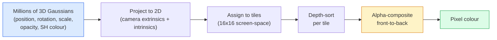

# 从零实现 3D Gaussian Splatting

> 一个场景是一团由数百万个 3D Gaussians 组成的云。每个 Gaussian 都有 position、orientation、scale、opacity，以及一个依赖 viewing direction 的 colour。对它们进行 rasterise，通过 rasterisation 做 backprop，就完成了。

**类型：** 构建
**语言：** Python
**先修要求：** Phase 4 Lesson 13 (3D Vision & NeRF)、Phase 1 Lesson 12 (Tensor Operations)、Phase 4 Lesson 10 (Diffusion basics optional)
**时间：** 约 90 分钟

## 学习目标

- 解释为什么到 2026 年，3D Gaussian Splatting 已取代 NeRF，成为 photorealistic 3D reconstruction 的生产默认方案
- 说出每个 Gaussian 的六类参数（position、rotation quaternion、scale、opacity、spherical harmonics colour、optional feature），以及每类贡献多少个 float
- 从零实现一个使用 `alpha` compositing 的 2D Gaussian splatting rasterizer，然后说明 3D 情况如何投影到同一个循环
- 使用 `nerfstudio`、`gsplat` 或 `SuperSplat` 从 20-50 张照片重建一个场景，并导出为 `KHR_gaussian_splatting` glTF extension 或 OpenUSD 26.03 `UsdVolParticleField3DGaussianSplat` schema

## 问题

NeRF 将场景存储为一个 MLP 的 weights。每个渲染出来的 pixel 都需要沿着一条 ray 进行数百次 MLP query。训练需要数小时，渲染需要数秒，而且 weights 无法编辑。如果你想移动场景里的一把椅子，就必须重新训练。

3D Gaussian Splatting（Kerbl、Kopanas、Leimkühler、Drettakis，SIGGRAPH 2023）替代了这一切。一个场景是一个显式的 3D Gaussians 集合。渲染是在 GPU 上以 100+ fps 进行的 rasterisation。训练只需要几分钟。编辑是直接的：平移一部分 Gaussians，你就移动了椅子。到 2026 年，Khronos Group 已经批准了用于 Gaussian splats 的 glTF extension，OpenUSD 26.03 已内置 Gaussian splat schema，Zillow 和 Apartments.com 使用它们渲染房地产内容，而大多数关于 3D reconstruction 的新研究论文都是核心 3DGS 思路的变体。

心智模型很简单，但数学上有足够多的活动部件，以至于大多数介绍会从 rasterisation 开始，然后跳过 projection 和 spherical harmonics。本课会构建完整内容：先做 2D 版本，再扩展到 3D。

## 核心概念

### 一个 Gaussian 携带什么

一个 3D Gaussian 是空间中的一个参数化 blob，带有这些属性：

```
position         mu         (3,)    centre in world coordinates
rotation         q          (4,)    unit quaternion encoding orientation
scale            s          (3,)    log-scales per axis (exponentiated at render time)
opacity          alpha      (1,)    post-sigmoid opacity [0, 1]
SH coefficients  c_lm       (3 * (L+1)^2,)   view-dependent colour
```

Rotation + scale 会构建一个 3x3 covariance：`Sigma = R S S^T R^T`。这就是 Gaussian 在 3D 中的形状。Spherical harmonics 让 colour 能随 viewing direction 改变：specular highlights、细微 sheen、view-dependent glow，而不需要存储 per-view textures。使用 SH degree 3 时，每个 colour channel 有 16 个 coefficient，也就是每个 Gaussian 仅 colour 就需要 48 个 float。

一个场景通常有 1-5 million 个 Gaussians。每个大约存储 60 个 float（3 + 4 + 3 + 1 + 48 + misc）。一个五百万 Gaussian 的场景大约是 240 MB，远小于带 per-point texture 的等价 point cloud，也比以高分辨率重新渲染的 NeRF MLP weights 小一个数量级。

### 是 rasterisation，不是 ray marching



五个步骤，全都对 GPU 友好。没有每个 pixel 的 MLP query。一张 RTX 3080 Ti 可以以 147 fps 渲染 600 万个 splats。

### projection 步骤

位于 world position `mu`、具有 3D covariance `Sigma` 的 3D Gaussian，会投影为 screen position `mu'`、具有 2D covariance `Sigma'` 的 2D Gaussian：

```
mu' = project(mu)
Sigma' = J W Sigma W^T J^T          (2 x 2)

W = viewing transform (rotation + translation of camera)
J = Jacobian of the perspective projection at mu'
```

2D Gaussian 的 footprint 是一个 ellipse，其轴是 `Sigma'` 的 eigenvectors。该 ellipse 内的每个 pixel 都会接收这个 Gaussian 的贡献，权重为 `exp(-0.5 * (p - mu')^T Sigma'^-1 (p - mu'))`。

### alpha-compositing 规则

对于一个 pixel，覆盖它的 Gaussians 会按 back-to-front 排序（或等价地，用反向公式按 front-to-back 排序）。Colour 使用自 1980 年代以来所有 semi-transparent rasteriser 都在使用的同一个方程进行 compositing：

```
C_pixel = sum_i alpha_i * T_i * c_i

T_i = prod_{j < i} (1 - alpha_j)       transmittance up to i
alpha_i = opacity_i * exp(-0.5 * d^T Sigma'^-1 d)   local contribution
c_i = eval_SH(SH_i, view_direction)    view-dependent colour
```

这与 **NeRF 的 volumetric render 是同一个方程**，只不过这里是在一个显式的稀疏 Gaussians 集合上计算，而不是在 ray 上的 dense samples 上计算。这个等价性就是渲染质量能匹配 NeRF 的原因：二者都在积分同一个 radiance-field 方程。

### 为什么它是 differentiable 的

每一步：projection、tile assignment、alpha compositing、SH evaluation，都相对于 Gaussian 参数是 differentiable 的。给定一张 ground-truth image，计算 rendered pixel Loss，通过 rasteriser 进行 backprop，用 Gradient Descent 更新所有 `(mu, q, s, alpha, c_lm)`。经过约 30,000 次 iteration，Gaussians 会找到正确的位置、尺度和颜色。

### Densification 与 pruning

固定数量的 Gaussians 无法覆盖复杂场景。训练包含两个自适应机制：

- **Clone**：当某个 Gaussian 的 Gradient magnitude 很高但 scale 很小时，在其当前位置克隆一个 Gaussian。这说明重建在这里需要更多细节。
- **Split**：当某个大 scale Gaussian 的 Gradient 很高时，将它拆成两个更小的 Gaussian。这说明一个大的 Gaussian 对该区域来说太平滑，无法拟合。
- **Prune**：删除 opacity 低于阈值的 Gaussians。它们没有贡献。

Densification 每 N 次 iteration 运行一次。一个场景通常会从约 100k 个初始 Gaussians（由 SfM points 初始化）增长到训练结束时的 1-5M。

### 用一段话理解 spherical harmonics

View-dependent colour 是单位球面上的函数 `c(direction)`。Spherical harmonics 是球面上的 Fourier basis。截断到 degree `L`，每个 channel 会得到 `(L+1)^2` 个 basis functions。为一个新视角评估 colour，就是将学到的 SH coefficients 与在 viewing direction 上求值的 basis 做 dot product。Degree 0 = 一个 coefficient = constant colour。Degree 3 = 16 个 coefficients = 足以捕捉 Lambertian shading、specular 和轻微 reflection。3D Gaussian Splatting 论文默认使用 degree 3。

### 2026 年的生产技术栈

```
1. Capture         smartphone / DJI drone / handheld scanner
2. SfM / MVS       COLMAP or GLOMAP derives camera poses + sparse points
3. Train 3DGS      nerfstudio / gsplat / inria official / PostShot (~10-30 min on RTX 4090)
4. Edit            SuperSplat / SplatForge (clean floaters, segment)
5. Export          .ply -> glTF KHR_gaussian_splatting or .usd (OpenUSD 26.03)
6. View            Cesium / Unreal / Babylon.js / Three.js / Vision Pro
```

### 4D 与 generative 变体

- **4D Gaussian Splatting**：Gaussians 是时间的函数；用于 volumetric video（Superman 2026，A$AP Rocky 的 "Helicopter"）。
- **Generative splats**：text-to-splat models（World Labs 的 Marble），可以 hallucinate 出完整场景。
- **3D Gaussian Unscented Transform**：NVIDIA NuRec 用于 autonomous driving simulation 的变体。

```figure
cv3-gaussian-splat
```

## 构建它

### 步骤 1：一个 2D Gaussian

我们先构建一个 2D rasteriser。3D 情况在 projection 之后会归约到它。

```python
import torch
import torch.nn as nn
import torch.nn.functional as F


def eval_2d_gaussian(means, covs, points):
    """
    means:  (G, 2)      centres
    covs:   (G, 2, 2)   covariance matrices
    points: (H, W, 2)   pixel coordinates
    returns: (G, H, W)  density at every pixel for every Gaussian
    """
    G = means.size(0)
    H, W, _ = points.shape
    flat = points.view(-1, 2)
    inv = torch.linalg.inv(covs)
    diff = flat[None, :, :] - means[:, None, :]
    d = torch.einsum("gpi,gij,gpj->gp", diff, inv, diff)
    density = torch.exp(-0.5 * d)
    return density.view(G, H, W)
```

`einsum` 会对每个 (Gaussian, pixel) pair 计算 quadratic form `diff^T Sigma^-1 diff`。

### 步骤 2：2D splatting rasteriser

Front-to-back alpha-compositing。在 2D 中 depth 没有意义，所以我们使用一个 learned per-Gaussian scalar 来表示顺序。

```python
def rasterise_2d(means, covs, colours, opacities, depths, image_size):
    """
    means:     (G, 2)
    covs:      (G, 2, 2)
    colours:   (G, 3)
    opacities: (G,)     in [0, 1]
    depths:    (G,)     per-Gaussian scalar used for ordering
    image_size: (H, W)
    returns:   (H, W, 3) rendered image
    """
    H, W = image_size
    yy, xx = torch.meshgrid(
        torch.arange(H, dtype=torch.float32, device=means.device),
        torch.arange(W, dtype=torch.float32, device=means.device),
        indexing="ij",
    )
    points = torch.stack([xx, yy], dim=-1)

    densities = eval_2d_gaussian(means, covs, points)
    alphas = opacities[:, None, None] * densities
    alphas = alphas.clamp(0.0, 0.99)

    order = torch.argsort(depths)
    alphas = alphas[order]
    colours_sorted = colours[order]

    T = torch.ones(H, W, device=means.device)
    out = torch.zeros(H, W, 3, device=means.device)
    for i in range(means.size(0)):
        a = alphas[i]
        out += (T * a)[..., None] * colours_sorted[i][None, None, :]
        T = T * (1.0 - a)
    return out
```

它并不快，真正的实现会使用 tile-based CUDA kernels，但数学完全正确，而且 fully differentiable。

### 步骤 3：一个可训练的 2D splat scene

```python
class Splats2D(nn.Module):
    def __init__(self, num_splats=128, image_size=64, seed=0):
        super().__init__()
        g = torch.Generator().manual_seed(seed)
        H, W = image_size, image_size
        self.means = nn.Parameter(torch.rand(num_splats, 2, generator=g) * torch.tensor([W, H]))
        self.log_scale = nn.Parameter(torch.ones(num_splats, 2) * math.log(2.0))
        self.rot = nn.Parameter(torch.zeros(num_splats))  # single angle in 2D
        self.colour_logits = nn.Parameter(torch.randn(num_splats, 3, generator=g) * 0.5)
        self.opacity_logit = nn.Parameter(torch.zeros(num_splats))
        self.depth = nn.Parameter(torch.rand(num_splats, generator=g))

    def covs(self):
        s = torch.exp(self.log_scale)
        c, si = torch.cos(self.rot), torch.sin(self.rot)
        R = torch.stack([
            torch.stack([c, -si], dim=-1),
            torch.stack([si, c], dim=-1),
        ], dim=-2)
        S = torch.diag_embed(s ** 2)
        return R @ S @ R.transpose(-1, -2)

    def forward(self, image_size):
        covs = self.covs()
        colours = torch.sigmoid(self.colour_logits)
        opacities = torch.sigmoid(self.opacity_logit)
        return rasterise_2d(self.means, covs, colours, opacities, self.depth, image_size)
```

`log_scale`、`opacity_logit` 和 `colour_logits` 都是 unconstrained parameters，在 render time 通过合适的 activation 映射。这是每个 3DGS 实现的标准模式。

### 步骤 4：将 2D Gaussians 拟合到目标图像

```python
import math
import numpy as np

def make_target(size=64):
    yy, xx = np.meshgrid(np.arange(size), np.arange(size), indexing="ij")
    img = np.zeros((size, size, 3), dtype=np.float32)
    # Red circle
    mask = (xx - 20) ** 2 + (yy - 20) ** 2 < 10 ** 2
    img[mask] = [1.0, 0.2, 0.2]
    # Blue square
    mask = (np.abs(xx - 45) < 8) & (np.abs(yy - 40) < 8)
    img[mask] = [0.2, 0.3, 1.0]
    return torch.from_numpy(img)


target = make_target(64)
model = Splats2D(num_splats=64, image_size=64)
opt = torch.optim.Adam(model.parameters(), lr=0.05)

for step in range(200):
    pred = model((64, 64))
    loss = F.mse_loss(pred, target)
    opt.zero_grad(); loss.backward(); opt.step()
    if step % 40 == 0:
        print(f"step {step:3d}  mse {loss.item():.4f}")
```

经过 200 步，64 个 Gaussians 会收敛到这两个形状中。这就是整个思路：在显式几何 primitives 上做 Gradient Descent。

### 步骤 5：从 2D 到 3D

3D 扩展保留同一个循环。新增部分包括：

1. 每个 Gaussian 的 rotation 是 quaternion，而不是单个 angle。
2. Covariance 是 `R S S^T R^T`，其中 `R` 由 quaternion 构建，`S = diag(exp(log_scale))`。
3. Projection `(mu, Sigma) -> (mu', Sigma')` 使用 camera extrinsics，以及在 `mu` 处的 perspective projection Jacobian。
4. Colour 变成 spherical-harmonics expansion；在 viewing direction 上评估它。
5. Depth-sort 来自真实的 camera-space z，而不是 learned scalar。

每个生产实现（`gsplat`、`inria/gaussian-splatting`、`nerfstudio`）都在 GPU 上用 tile-based CUDA kernels 做的正是这些。

### 步骤 6：Spherical harmonics evaluation

最高到 degree 3 的 SH basis 每个 channel 有 16 项。Evaluation：

```python
def eval_sh_degree_3(sh_coeffs, dirs):
    """
    sh_coeffs: (..., 16, 3)   last dim is RGB channels
    dirs:      (..., 3)       unit vectors
    returns:   (..., 3)
    """
    C0 = 0.282094791773878
    C1 = 0.488602511902920
    C2 = [1.092548430592079, 1.092548430592079,
          0.315391565252520, 1.092548430592079,
          0.546274215296039]
    x, y, z = dirs[..., 0], dirs[..., 1], dirs[..., 2]
    x2, y2, z2 = x * x, y * y, z * z
    xy, yz, xz = x * y, y * z, x * z

    result = C0 * sh_coeffs[..., 0, :]
    result = result - C1 * y[..., None] * sh_coeffs[..., 1, :]
    result = result + C1 * z[..., None] * sh_coeffs[..., 2, :]
    result = result - C1 * x[..., None] * sh_coeffs[..., 3, :]

    result = result + C2[0] * xy[..., None] * sh_coeffs[..., 4, :]
    result = result + C2[1] * yz[..., None] * sh_coeffs[..., 5, :]
    result = result + C2[2] * (2.0 * z2 - x2 - y2)[..., None] * sh_coeffs[..., 6, :]
    result = result + C2[3] * xz[..., None] * sh_coeffs[..., 7, :]
    result = result + C2[4] * (x2 - y2)[..., None] * sh_coeffs[..., 8, :]

    # degree 3 terms omitted here for brevity; full 16-coefficient version in the code file
    return result
```

学到的 `sh_coeffs` 存储该 Gaussian 在“每个方向上的 colour”。在 render time，将其与当前 view direction 求值，就得到一个 3-vector RGB。

## 使用它

真实的 3DGS 工作请使用 `gsplat`（Meta）或 `nerfstudio`：

```bash
pip install nerfstudio gsplat
ns-download-data example
ns-train splatfacto --data path/to/data
```

`splatfacto` 是 nerfstudio 的 3DGS trainer。对于典型场景，在 RTX 4090 上一次运行需要 10-30 分钟。

2026 年值得关注的导出选项：

- `.ply`：原始 Gaussian cloud（可移植，文件最大）。
- `.splat`：PlayCanvas / SuperSplat quantised 格式。
- glTF `KHR_gaussian_splatting`：Khronos 标准，可在 viewer 间移植（2026 年 2 月 RC）。
- OpenUSD `UsdVolParticleField3DGaussianSplat`：USD-native，用于 NVIDIA Omniverse 和 Vision Pro pipelines。

对于 4D / dynamic scenes，`4DGS` 和 `Deformable-3DGS` 使用 time-varying means 与 opacities 扩展同一套机制。

## 交付它

本课会产出：

- `outputs/prompt-3dgs-capture-planner.md`：一个 prompt，用于为给定场景类型规划 capture session（照片数量、camera path、lighting）。
- `outputs/skill-3dgs-export-router.md`：一个 skill，用于根据下游 viewer 或 engine 选择合适的 export format（`.ply` / `.splat` / glTF / USD）。

## 练习

1. **（简单）** 在另一个 synthetic image 上运行上面的 2D splat trainer。将 `num_splats` 在 `[16, 64, 256]` 中变化，并绘制每种情况下 MSE vs step 的曲线。找出收益递减点。
2. **（中等）** 扩展 2D rasteriser，使其支持 per-Gaussian RGB colours，这些 colours 通过 degree-2 harmonic 依赖一个标量 “view angle”。在一组目标图像对上训练，并验证模型能重建二者。
3. **（困难）** Clone `nerfstudio`，用你自己任意场景的 20 张照片 capture（桌子、植物、人脸、房间）训练 `splatfacto`。导出到 glTF `KHR_gaussian_splatting`，并在 viewer（Three.js `GaussianSplats3D`、SuperSplat、Babylon.js V9）中打开。报告训练时间、Gaussians 数量和渲染 fps。

## 关键术语

| Term | 人们通常怎么说 | 它实际意味着什么 |
|------|----------------|----------------------|
| 3DGS | "Gaussian splats" | 将场景显式表示为数百万个 3D Gaussians，每个 Gaussian 带有 position、rotation、scale、opacity、SH colour |
| Covariance | "Shape of the Gaussian" | `Sigma = R S S^T R^T`；一个 Gaussian 的 orientation 与 anisotropic scale |
| Alpha compositing | "Back-to-front blend" | 与 NeRF 的 volumetric render 相同的方程，但现在作用在显式稀疏集合上 |
| Densification | "Clone and split" | 在 reconstruction under-fit 的位置自适应添加新 Gaussians |
| Pruning | "Delete low-opacity" | 移除训练过程中 opacity 已塌缩到接近零的 Gaussians |
| Spherical harmonics | "View-dependent colour" | 球面上的 Fourier basis；将 colour 存储为 viewing direction 的函数 |
| Splatfacto | "nerfstudio's 3DGS" | 2026 年训练 3DGS 最简单的路径 |
| `KHR_gaussian_splatting` | "glTF standard" | Khronos 2026 extension，使 3DGS 能在 viewers 和 engines 之间移植 |

## 延伸阅读

- [3D Gaussian Splatting for Real-Time Radiance Field Rendering (Kerbl et al., SIGGRAPH 2023)](https://repo-sam.inria.fr/fungraph/3d-gaussian-splatting/) — 原始论文
- [gsplat (Meta/nerfstudio)](https://github.com/nerfstudio-project/gsplat) — 生产级 CUDA rasteriser
- [nerfstudio Splatfacto](https://docs.nerf.studio/nerfology/methods/splat.html) — 参考训练方案
- [Khronos KHR_gaussian_splatting extension](https://github.com/KhronosGroup/glTF/blob/main/extensions/2.0/Khronos/KHR_gaussian_splatting/README.md) — 2026 年的可移植格式
- [OpenUSD 26.03 release notes](https://openusd.org/release/) — `UsdVolParticleField3DGaussianSplat` schema
- [THE FUTURE 3D State of Gaussian Splatting 2026](https://www.thefuture3d.com/blog-0/2026/4/4/state-of-gaussian-splatting-2026) — 行业概览
