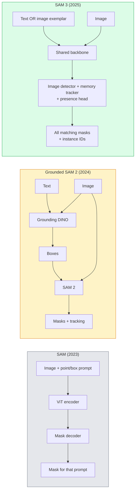

# SAM 3 与 Open-Vocabulary Segmentation

> 给模型一个 text prompt 和一张 image，即可获得每个匹配 object 的 masks。SAM 3 让这变成了一次单独的 forward pass。

**类型：** 使用 + 构建
**语言：** Python
**先修要求：** Phase 4 Lesson 07 (U-Net), Phase 4 Lesson 08 (Mask R-CNN), Phase 4 Lesson 18 (CLIP)
**时间：** ~60 分钟

## 学习目标

- 区分 SAM（仅 visual prompts）、Grounded SAM / SAM 2（detector + SAM）和 SAM 3（通过 Promptable Concept Segmentation 原生支持 text prompts）
- 解释 SAM 3 架构：shared backbone + image detector + memory-based video tracker + presence head + decoupled detector-tracker design
- 使用 Hugging Face `transformers` 的 SAM 3 集成进行 text-prompted detection、segmentation 和 video tracking
- 根据 latency、concept complexity 和 deployment target，在 SAM 3、Grounded SAM 2、YOLO-World 和 SAM-MI 之间做选择

## 问题

2023 年的 SAM 是一个仅支持 visual prompt 的模型：你点击一个点或画一个框，它返回一个 mask。对于“把这张照片里的所有橙子找出来”，你需要一个 detector（Grounding DINO）先生成 boxes，然后用 SAM 对每个 box 做 segmentation。Grounded SAM 把它变成了一个 pipeline，但它是两个冻结模型的级联，错误累积不可避免。

SAM 3（Meta，2025 年 11 月，ICLR 2026）压缩了这个级联。它接受一个简短的名词短语或一个 image exemplar 作为 prompt，并在一次 forward pass 中返回所有匹配的 masks 和 instance IDs。这就是 **Promptable Concept Segmentation (PCS)**。结合 2026 年 3 月的 Object Multiplex 更新（SAM 3.1），它可以高效地在 video 中跟踪同一 concept 的多个 instances。

本课关注的是它所代表的结构性转变。2D seg、detection 和 text-image grounding 已经合并到一个模型里。生产问题不再是“我要把哪些 pipeline 串起来”，而是“哪个 promptable model 可以端到端处理我的 use case”。

## 概念

### 三代模型



### 可 Prompt 的 Concept Segmentation

“concept prompt” 是一个简短的名词短语（`"yellow school bus"`、`"striped red umbrella"`、`"hand holding a mug"`）或一个 image exemplar。模型会为 image 中每个匹配该 concept 的 instance 返回 segmentation masks，并为每个匹配项返回唯一的 instance ID。

这与经典 visual-prompt SAM 有三点不同：

1. 不需要逐个 instance 提供 prompt：一个 text prompt 返回所有匹配项。
2. Open-vocabulary：concept 可以是任何能用自然语言描述的内容。
3. 一次返回多个 instances，而不是每个 prompt 返回一个 mask。

### 关键架构组件

- **Shared backbone**：一个 ViT 处理 image。detector head 和 memory-based tracker 都从中读取信息。
- **Presence head**：预测 concept 是否存在于 image 中。将“这里有没有？”和“它在哪里？”解耦。减少 concept 不存在时的 false positives。
- **Decoupled detector-tracker**：image-level detection 和 video-level tracking 使用独立 heads，避免相互干扰。
- **Memory bank**：跨 frames 存储每个 instance 的 features，用于 video tracking（与 SAM 2 使用的机制相同）。

### 大规模训练

SAM 3 在 **400 万个 unique concepts** 上训练，这些 concepts 由一个 data engine 生成，该 engine 通过 AI + 人工审核迭代标注并修正。新的 **SA-CO benchmark** 包含 270K 个 unique concepts，比以往 benchmarks 大 50 倍。SAM 3 在 SA-CO 上达到人类表现的 75-80%，并在 image + video PCS 上把现有 systems 的表现提升到两倍。

### SAM 3.1 Object Multiplex

2026 年 3 月更新：**Object Multiplex** 引入了一种 shared-memory 机制，用于同时联合跟踪同一 concept 的多个 instances。此前，跟踪 N 个 instances 意味着需要 N 个独立 memory banks。Multiplex 将其压缩为一个 shared memory，并使用 per-instance queries。结果是在不牺牲 accuracy 的前提下，显著加速 multi-object tracking。

### 2026 年 Grounded SAM 仍然重要的场景

- 当你需要替换特定的 open-vocabulary detector（DINO-X、Florence-2）时。
- 当 SAM 3 license（HF 上 gated）成为阻碍时。
- 当你需要比 SAM 3 暴露的参数更多地控制 detector threshold 时。
- 用于 detector component 的研究 / ablation work。

Modular pipelines 仍有价值。对大多数生产工作而言，SAM 3 是更简单的答案。

### YOLO-World vs SAM 3

- **YOLO-World**：仅 open-vocabulary detector（无 masks）。Real-time。当你需要高 fps boxes 时最合适。
- **SAM 3**：完整 segmentation + tracking。更慢，但输出更丰富。

生产场景划分：YOLO-World 适合快速 detection-only pipelines（robotics navigation、fast dashboards），SAM 3 适合任何需要 masks 或 tracking 的场景。

### SAM-MI 效率

SAM-MI（2025-2026）解决 SAM 的 decoder bottleneck。关键思想：

- **Sparse point prompting**：使用少量精心选择的 points，而不是 dense prompts；将 decoder calls 减少 96%。
- **Shallow mask aggregation**：将粗略 mask predictions 合并成一个更清晰的 mask。
- **Decoupled mask injection**：decoder 接收预计算的 mask features，而不是重新运行。

结果：在 open-vocabulary benchmarks 上相较 Grounded-SAM 约有 1.6× speedup。

### 三个模型的输出格式

它们都返回相同的一般结构（boxes + labels + scores + masks + IDs），这很有帮助：你的下游 pipeline 不需要根据运行的是哪个模型来分支。

```figure
cv3-open-vocab
```

## 构建

### 步骤 1：Prompt 构造

构建一个 helper，将用户句子转换为 SAM 3 concept prompts 列表。这是“用户输入的内容”和“模型消费的内容”之间的边界。

```python
def split_concepts(sentence):
    """
    Heuristic splitter for multi-concept prompts.
    Returns list of short noun phrases.
    """
    for sep in [",", ";", "and", "or", "&"]:
        if sep in sentence:
            parts = [p.strip() for p in sentence.replace("and ", ",").split(",")]
            return [p for p in parts if p]
    return [sentence.strip()]

print(split_concepts("cats, dogs and balloons"))
```

SAM 3 每次 forward pass 接受一个 concept；对于 multi-concept queries，循环或批处理它们。

### 步骤 2：Post-processing helpers

将 SAM 3 的 raw outputs 转换为干净的 detections 列表，以匹配我们 Phase 4 Lesson 16 的 pipeline contract。

```python
from dataclasses import dataclass
from typing import List

@dataclass
class ConceptDetection:
    concept: str
    instance_id: int
    box: tuple          # (x1, y1, x2, y2)
    score: float
    mask_rle: str       # run-length encoded


def rle_encode(binary_mask):
    flat = binary_mask.flatten().astype("uint8")
    runs = []
    prev, count = flat[0], 0
    for v in flat:
        if v == prev:
            count += 1
        else:
            runs.append((int(prev), count))
            prev, count = v, 1
    runs.append((int(prev), count))
    return ";".join(f"{v}x{c}" for v, c in runs)
```

即使有许多高分辨率 masks，RLE 也能让 response payloads 保持较小。同一格式适用于 SAM 2、SAM 3、Grounded SAM 2。

### 步骤 3：统一的 open-vocab segmentation interface

将你拥有的任意 backend（SAM 3、Grounded SAM 2、YOLO-World + SAM 2）封装在一个统一方法之后。当 backend 改变时，下游代码不需要改变。

```python
from abc import ABC, abstractmethod
import numpy as np

class OpenVocabSeg(ABC):
    @abstractmethod
    def detect(self, image: np.ndarray, concept: str) -> List[ConceptDetection]:
        ...


class StubOpenVocabSeg(OpenVocabSeg):
    """
    Deterministic stub used for pipeline testing when real models are not loaded.
    """
    def detect(self, image, concept):
        h, w = image.shape[:2]
        return [
            ConceptDetection(
                concept=concept,
                instance_id=0,
                box=(w * 0.2, h * 0.3, w * 0.5, h * 0.8),
                score=0.89,
                mask_rle="0x100;1x50;0x200",
            ),
            ConceptDetection(
                concept=concept,
                instance_id=1,
                box=(w * 0.55, h * 0.25, w * 0.85, h * 0.75),
                score=0.74,
                mask_rle="0x80;1x40;0x220",
            ),
        ]
```

真实的 `SAM3OpenVocabSeg` subclass 会封装 `transformers.Sam3Model` 和 `Sam3Processor`。

### 步骤 4：Hugging Face SAM 3 用法（参考）

实际模型的 `transformers` 集成：

```python
from transformers import Sam3Processor, Sam3Model
import torch

processor = Sam3Processor.from_pretrained("facebook/sam3")
model = Sam3Model.from_pretrained("facebook/sam3").eval()

inputs = processor(images=pil_image, return_tensors="pt")
inputs = processor.set_text_prompt(inputs, "yellow school bus")

with torch.no_grad():
    outputs = model(**inputs)

masks = processor.post_process_masks(
    outputs.masks, inputs.original_sizes, inputs.reshaped_input_sizes
)
boxes = outputs.boxes
scores = outputs.scores
```

一个 prompt，一次调用返回所有匹配项。

### 步骤 5：衡量 Grounded SAM 2 免费提供了什么

一个诚实的 benchmark：在真实 pipeline 中用 SAM 3 替换 Grounded SAM 2 会发生什么？

- Latency：SAM 3 省掉一次 forward pass（没有独立 detector），但模型本身更重；通常总体持平或略有 speedup。
- Accuracy：SAM 3 在 rare 或 compositional concepts（如 `"striped red umbrella"`）上明显更好。在常见单词 concepts 上相近。
- Flexibility：Grounded SAM 2 允许你替换 detectors（DINO-X、Florence-2、Grounding DINO 1.5）；SAM 3 是 monolithic。

结论：SAM 3 是 2026 年 open-vocab seg 的默认选择。当你需要 detector flexibility 或不同 license terms 时，Grounded SAM 2 仍然是正确答案。

## 使用

生产部署模式：

- **Real-time annotation**：SAM 3 + CVAT 的 label-as-text-prompt feature。标注员选择一个 label name；SAM 3 预标注每个匹配的 instance。再进行审核和修正。
- **Video analytics**：SAM 3.1 Object Multiplex 用于 multi-object tracking；将 frames 输入 memory-based tracker。
- **Robotics**：SAM 3 用于 open-vocab manipulation（“pick up the red cup”）；作为 planning primitive 运行。
- **Medical imaging**：在 medical concepts 上 fine-tuned 的 SAM 3；需要在 HF 上申请 access。

Ultralytics 在其 Python package 中封装了 SAM 3：

```python
from ultralytics import SAM

model = SAM("sam3.pt")
results = model(image_path, prompts="yellow school bus")
```

与 YOLO 和 SAM 2 使用相同 interface。

## 交付

本课会产出：

- `outputs/prompt-open-vocab-stack-picker.md`：一个根据 latency、concept complexity 和 licensing 选择 SAM 3 / Grounded SAM 2 / YOLO-World / SAM-MI 的 prompt。
- `outputs/skill-concept-prompt-designer.md`：一个将用户话语转换为格式良好的 SAM 3 concept prompts 的 skill（splitting、disambiguation、fallbacks）。

## 练习

1. **（Easy）** 在 10 张 images 上运行 SAM 3，并使用你自己选择的 concept prompts。与同一批 images 上的 SAM 2 + Grounding DINO 1.5 对比。报告每个模型漏掉了哪些 concepts。
2. **（Medium）** 在 SAM 3 之上构建一个 “click-to-include / click-to-exclude” UI：text prompt 返回 candidate instances；用户点击保留哪些算作 positive。将最终 concept set 输出为 JSON。
3. **（Hard）** 在自定义 concept set（例如 5 种 electronic components）上 fine-tune SAM 3，每种各 20 张 labelled images。与同一 test set 上的 zero-shot SAM 3 对比；衡量 mask IoU improvement。

## 关键术语

| Term | 人们通常怎么说 | 实际含义 |
|------|----------------|----------------------|
| Open-vocabulary segmentation | “Segment by text” | 为自然语言描述的 objects 生成 masks，而不是使用固定 label set |
| PCS | “Promptable Concept Segmentation” | SAM 3 的核心任务：给定一个 noun-phrase 或 image exemplar，segment 所有匹配 instances |
| Concept prompt | “The text input” | 简短名词短语或 image exemplar；不是完整句子 |
| Presence head | “Is it here?” | SAM 3 中的模块，用于在 localisation 之前判断 concept 是否存在于 image 中 |
| SA-CO | “SAM 3 benchmark” | 包含 270K concepts 的 open-vocabulary segmentation benchmark；比以往 open-vocab benchmarks 大 50 倍 |
| Object Multiplex | “SAM 3.1 update” | Shared-memory multi-object tracking；快速联合跟踪多个 instances |
| Grounded SAM 2 | “Modular pipeline” | Detector + SAM 2 级联；当 detector 替换很重要时仍然相关 |
| SAM-MI | “Efficient SAM variant” | Mask Injection，相比 Grounded-SAM 实现 1.6x speedup |

## 延伸阅读

- [SAM 3: Segment Anything with Concepts (arXiv 2511.16719)](https://arxiv.org/abs/2511.16719)
- [SAM 3.1 Object Multiplex (Meta AI, March 2026)](https://ai.meta.com/blog/segment-anything-model-3/)
- [SAM 3 model page on Hugging Face](https://huggingface.co/facebook/sam3)
- [Grounded SAM 2 tutorial (PyImageSearch)](https://pyimagesearch.com/2026/01/19/grounded-sam-2-from-open-set-detection-to-segmentation-and-tracking/)
- [Ultralytics SAM 3 docs](https://docs.ultralytics.com/models/sam-3/)
- [SAM3-I: Instruction-aware SAM (arXiv 2512.04585)](https://arxiv.org/abs/2512.04585)
