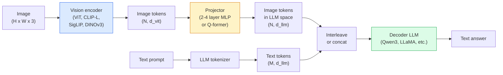

# Vision-Language Models — ViT-MLP-LLM 模式

> Vision encoder 将图像转换为 tokens。MLP projector 将这些 tokens 映射到 LLM 的 embedding space。language model 完成剩下的工作。这个模式 — ViT-MLP-LLM — 就是 2026 年所有生产级 VLM 的共同结构。

**类型：** 学习 + 使用
**语言：** Python
**前置要求：** Phase 4 Lesson 14 (ViT), Phase 4 Lesson 18 (CLIP), Phase 7 Lesson 02 (Self-Attention)
**时间：** ~75 分钟

## 学习目标

- 说清 ViT-MLP-LLM 架构，并解释三个组件各自贡献什么
- 从参数量、context length 和 benchmark performance 角度比较 Qwen3-VL、InternVL3.5、LLaVA-Next 和 GLM-4.6V
- 解释 DeepStack：为什么多层级 ViT features 比单一最后一层 feature 更能收紧 vision-language alignment
- 在生产环境中用 Cross-Modal Error Rate (CMER) 衡量 VLM hallucination，并基于该信号采取行动

## 问题

CLIP (Phase 4 Lesson 18) 为图像和文本提供共享 embedding space，这足以支持 zero-shot classification 和 retrieval。它无法回答“这张图里有多少辆红色汽车？”因为 CLIP 不生成文本，它只给相似度打分。

Vision-Language Models (VLMs) — Qwen3-VL、InternVL3.5、LLaVA-Next、GLM-4.6V — 将 CLIP-family image encoder 接到一个完整 language model 上。模型看到一张图像加一个问题，然后生成答案。到 2026 年，open-source VLMs 在 Multimodal benchmarks (MMMU, MMBench, DocVQA, ChartQA, MathVista, OSWorld) 上已经可以比肩甚至超过 GPT-5 和 Gemini-2.5-Pro。

这组三件套（ViT、projector、LLM）就是标准结构。模型之间的差异在于使用哪个 ViT、哪个 projector、哪个 LLM、训练数据以及 alignment recipe。一旦理解了这个模式，替换任意组件都是机械性的工作。

## 概念

### ViT-MLP-LLM 架构



1. **Vision encoder** — 预训练 ViT（CLIP-L/14、SigLIP、DINOv3，或 fine-tuned variant）。产出 patch tokens。
2. **Projector** — 一个小模块（2-4 层 MLP，或 Q-former），将 vision tokens 映射到 LLM 的 embedding dimension。大多数 fine-tuning 发生在这里。
3. **LLM** — decoder-only language model（Qwen3、Llama、Mistral、GLM、InternLM）。按序读取 vision + text tokens，并生成文本。

原则上三个部分都可以训练。实践中，vision encoder 和 LLM 大多保持 frozen，只训练 projector，这样可以用低成本承接几十亿参数规模的信号。

### DeepStack

普通 projection 只使用最后一层 ViT layer。DeepStack（Qwen3-VL）会从多个 ViT 深度采样 features 并将它们 stack 起来。更深层携带高层语义；更浅层携带细粒度的空间和纹理信息。把两者都送入 LLM，可以弥合“图像包含什么”（语义）和“具体在哪里”（spatial grounding）之间的差距。

### 三个训练阶段

现代 VLMs 分阶段训练：

1. **Alignment** — freeze ViT 和 LLM。只在 image-caption pairs 上训练 projector。教会 projector 将 vision space 映射到 language space。
2. **Pre-training** — 解冻所有部分。在大规模交错 image-text data（500M+ pairs）上训练。构建模型的视觉知识。
3. **Instruction tuning** — 在精选的（image, question, answer）三元组上 fine-tune。教会 conversational behaviour 和任务格式。这一步把“vision-aware LM”变成可用的 assistant。

大多数 LoRA fine-tunes 会用小规模标注数据集针对第 3 阶段进行。

### 模型家族比较（2026 年初）

| Model | Params | Vision encoder | LLM | Context | Strengths |
|-------|--------|----------------|-----|---------|-----------|
| Qwen3-VL-235B-A22B (MoE) | 235B (22B active) | custom ViT + DeepStack | Qwen3 | 256K | 综合 SOTA，GUI agent |
| Qwen3-VL-30B-A3B (MoE) | 30B (3B active) | custom ViT + DeepStack | Qwen3 | 256K | 更小的 MoE 替代方案 |
| Qwen3-VL-8B (dense) | 8B | custom ViT | Qwen3 | 128K | 生产环境 dense 默认选择 |
| InternVL3.5-38B | 38B | InternViT-6B | Qwen3 + GPT-OSS | 128K | MMBench / MMVet 表现强 |
| InternVL3.5-241B-A28B | 241B (28B active) | InternViT-6B | Qwen3 | 128K | 可与 GPT-4o 竞争 |
| LLaVA-Next 72B | 72B | SigLIP | Llama-3 | 32K | 开放，易于 fine-tune |
| GLM-4.6V | ~70B | custom | GLM | 64K | Open-source，OCR 强 |
| MiniCPM-V-2.6 | 8B | SigLIP | MiniCPM | 32K | 适合边缘部署 |

### Visual agents

Qwen3-VL-235B 在 OSWorld 上达到全球顶尖表现，OSWorld 是面向**visual agents** 的 benchmark，用于评估可操作 GUI（桌面、移动、Web）的模型。模型看到 screenshot，理解 UI，并输出 actions（click、type、scroll）。结合 tools 后，它可以闭环完成常见桌面任务。这就是大多数 2026 年“AI PC”演示在底层运行的东西。

### Agentic 能力 + RoPE 变体

VLMs 需要知道视频中的某一帧发生在**什么时候**。Qwen3-VL 从 T-RoPE（temporal rotary position embeddings）演进到**基于文本的时间 alignment**，也就是将显式 timestamp text tokens 与 video frames 交错。模型看到“`<timestamp 00:32>` frame, prompt”，就能推理时间关系。

### Alignment 问题

爬取数据集中的 12% image-text pairs 包含并未完全由图像支撑的描述。用这种数据训练的 VLM 会悄悄学会 hallucinate，也就是编造物体、误读数字、虚构关系。在生产环境中，这是最主要的失败模式。

Skywork.ai 引入了 **Cross-Modal Error Rate (CMER)** 来追踪它：

```
CMER = fraction of outputs where the text confidence is high but the image-text similarity (via a CLIP-family checker) is low
```

高 CMER 意味着模型正在自信地说出没有被图像支撑的内容。监控 CMER，并把它作为 production KPI，在他们的部署中将 hallucination rate 降低了约 35%。关键不是“修复模型”，而是“把高 CMER 输出路由到人工审核”。

### 使用 LoRA / QLoRA 进行 fine-tuning

对 70B VLM 做 full fine-tuning 超出了大多数团队的能力范围。在 attention + projector layers 上使用 LoRA（rank 16-64），或使用 4-bit base weights 的 QLoRA，可以装进单张 A100 / H100。成本：5,000-50,000 个样本，$100-$5,000 计算成本，2-10 小时训练时间。

### Spatial reasoning 仍然薄弱

当前 VLMs 在 spatial reasoning benchmarks（above-below、left-right、counting、distance）上得分为 50-60%。如果你的 use case 依赖“哪个物体在另一个物体上方”，要大量验证，generic VLM performance 低于人类。对于纯空间任务，比 VLM 更好的替代方案包括：专用 keypoint / pose estimator、depth model，或 detection model 加 box geometry 后处理。

```figure
v4-vlm-projector
```

## 构建它

### 步骤 1： Projector

这是你最常训练的部分。带 GELU 的 2-4 层 MLP。

```python
import torch
import torch.nn as nn


class Projector(nn.Module):
    def __init__(self, vit_dim=768, llm_dim=4096, hidden=4096):
        super().__init__()
        self.net = nn.Sequential(
            nn.Linear(vit_dim, hidden),
            nn.GELU(),
            nn.Linear(hidden, llm_dim),
        )

    def forward(self, x):
        return self.net(x)
```

输入是一个 `(N_patches, d_vit)` token tensor。输出是 `(N_patches, d_llm)`。LLM 会把每一行输出都当作另一个 token。

### 步骤 2： 端到端组装 ViT-MLP-LLM

下面是 minimal VLM 的 forward pass 骨架。真实代码会使用 `transformers`；这里展示的是概念布局。

```python
class MinimalVLM(nn.Module):
    def __init__(self, vit, projector, llm, image_token_id):
        super().__init__()
        self.vit = vit
        self.projector = projector
        self.llm = llm
        self.image_token_id = image_token_id  # placeholder token in text prompt

    def forward(self, image, input_ids, attention_mask):
        # 1. vision features
        vision_tokens = self.vit(image)                     # (B, N_patches, d_vit)
        vision_embeds = self.projector(vision_tokens)       # (B, N_patches, d_llm)

        # 2. text embeddings
        text_embeds = self.llm.get_input_embeddings()(input_ids)  # (B, M, d_llm)

        # 3. replace image placeholder tokens with vision embeds
        merged = self._merge(text_embeds, vision_embeds, input_ids)

        # 4. run LLM
        return self.llm(inputs_embeds=merged, attention_mask=attention_mask)

    def _merge(self, text_embeds, vision_embeds, input_ids):
        out = text_embeds.clone()
        expected = vision_embeds.size(1)
        for b in range(input_ids.size(0)):
            positions = (input_ids[b] == self.image_token_id).nonzero(as_tuple=True)[0]
            if len(positions) != expected:
                raise ValueError(
                    f"batch item {b} has {len(positions)} image tokens but vision_embeds has {expected} patches."
                    " Every sample in the batch must be pre-padded to the same number of image placeholder tokens.")
            out[b, positions] = vision_embeds[b]
        return out
```

文本中的 `<image>` placeholder token 会被替换成真实 image embeddings，LLaVA、Qwen-VL 和 InternVL 使用的都是同一模式。

### 步骤 3： CMER 计算

一个轻量的运行时检查。

```python
import torch.nn.functional as F


def cross_modal_error_rate(image_emb, text_emb, text_confidence, sim_threshold=0.25, conf_threshold=0.8):
    """
    image_emb, text_emb: embeddings of image and generated text (normalised internally)
    text_confidence:     mean per-token probability in [0, 1]
    Returns:             fraction of high-confidence outputs with low image-text alignment
    """
    image_emb = F.normalize(image_emb, dim=-1)
    text_emb = F.normalize(text_emb, dim=-1)
    sim = (image_emb * text_emb).sum(dim=-1)        # cosine similarity
    high_conf_low_sim = (text_confidence > conf_threshold) & (sim < sim_threshold)
    return high_conf_low_sim.float().mean().item()
```

将 CMER 作为 production KPI。按 endpoint、prompt type、customer 分别监控它。CMER 上升表示模型开始在某些输入分布上 hallucinate。

### 步骤 4： Toy VLM classifier（可运行）

演示 projector 是可以训练的。伪造的“ViT features”输入；一个 tiny LLM-style token 预测类别。

```python
class ToyVLM(nn.Module):
    def __init__(self, vit_dim=32, llm_dim=64, num_classes=5):
        super().__init__()
        self.projector = Projector(vit_dim, llm_dim, hidden=64)
        self.head = nn.Linear(llm_dim, num_classes)

    def forward(self, vision_tokens):
        projected = self.projector(vision_tokens)
        pooled = projected.mean(dim=1)
        return self.head(pooled)
```

你可以在 synthetic（feature, class）pairs 上用不到 200 steps 拟合它，这足以说明 projector pattern 是有效的。

## 使用它

2026 年生产团队使用 VLMs 的三种方式：

- **Hosted API** — OpenAI Vision、Anthropic Claude Vision、Google Gemini Vision。零基础设施，存在 vendor risk。
- **Open-source self-host** — 通过 `transformers` 和 `vllm` 使用 Qwen3-VL 或 InternVL3.5。完全控制，前期投入更高。
- **在领域数据上 fine-tune** — 加载 Qwen2.5-VL-7B 或 LLaVA-1.6-7B，在 5k-50k 自定义样本上做 LoRA，用 `vllm` 或 `TGI` 服务。

```python
from transformers import AutoProcessor, AutoModelForVision2Seq
import torch
from PIL import Image

model_id = "Qwen/Qwen3-VL-8B-Instruct"
processor = AutoProcessor.from_pretrained(model_id)
model = AutoModelForVision2Seq.from_pretrained(model_id, torch_dtype=torch.bfloat16, device_map="auto")

messages = [{
    "role": "user",
    "content": [
        {"type": "image", "image": Image.open("plot.png")},
        {"type": "text", "text": "What does this chart show?"},
    ],
}]
inputs = processor.apply_chat_template(messages, add_generation_prompt=True, tokenize=True, return_dict=True, return_tensors="pt").to("cuda")
generated = model.generate(**inputs, max_new_tokens=256)
answer = processor.decode(generated[0][inputs["input_ids"].shape[1]:], skip_special_tokens=True)
```

`apply_chat_template` 隐藏了 `<image>` placeholder tokenisation；模型会在内部处理 merge。

## 交付它

本课会产出：

- `outputs/prompt-vlm-selector.md` — 在给定 accuracy、latency、context length 和 budget 的情况下选择 Qwen3-VL / InternVL3.5 / LLaVA-Next / API。
- `outputs/skill-cmer-monitor.md` — 生成代码，用 cross-modal error rate 为生产级 VLM endpoint 加上 instrumentation、按 endpoint 的 dashboards，以及 alerting thresholds。

## 练习

1. **（简单）** 在五张图像上，用任意 open VLM 跑三个 prompts（“what is this?”、“count the objects”、“describe the scene”）。手动将每个答案评为 correct / partially correct / hallucinated。计算一个 first-pass CMER-like rate。
2. **（中等）** 在目标领域的 500 张带 captions 图像上，用 LoRA（rank 16）fine-tune Qwen2.5-VL-3B 或 LLaVA-1.6-7B。比较 zero-shot 和 fine-tuned 的 MMBench-style accuracy。
3. **（困难）** 将 VLM 的 image encoder 从默认 SigLIP/CLIP 替换为 DINOv3。只重新训练 projector（frozen LLM + frozen DINOv3）。衡量 dense-prediction tasks（counting、spatial reasoning）是否提升。

## 关键术语

| Term | 人们常说 | 实际含义 |
|------|----------------|----------------------|
| ViT-MLP-LLM | “VLM pattern” | Vision encoder + projector + language model；每个 2026 年 VLM 都如此 |
| Projector | “桥梁” | 2-4 层 MLP（或 Q-former），将 vision tokens 映射到 LLM embedding space |
| DeepStack | “Qwen3-VL feature trick” | stack 多层级 ViT features，而不是只使用最后一层 |
| Image token | “<image> placeholder” | text stream 中的 special token，会被 projected vision embeddings 替换 |
| CMER | “Hallucination KPI” | Cross-Modal Error Rate；当 text confidence 高但 image-text similarity 低时，该值较高 |
| Visual agent | “会点击的 VLM” | 通过 tool calls 操作 GUI（OSWorld、mobile、web）的 VLM |
| Q-former | “固定数量的 token bridge” | BLIP-2 风格的 projector，产出固定数量的 visual query tokens |
| Alignment / pre-training / instruction tuning | “三个阶段” | 标准 VLM 训练 pipeline |

## 延伸阅读

- [Qwen3-VL Technical Report (arXiv 2511.21631)](https://arxiv.org/abs/2511.21631)
- [InternVL3.5 Advancing Open-Source Multimodal Models (arXiv 2508.18265)](https://arxiv.org/html/2508.18265v1)
- [LLaVA-Next series](https://llava-vl.github.io/blog/2024-05-10-llava-next-stronger-llms/)
- [BentoML: Best Open-Source VLMs 2026](https://www.bentoml.com/blog/multimodal-ai-a-guide-to-open-source-vision-language-models)
- [MMMU: Multi-discipline Multimodal Understanding benchmark](https://mmmu-benchmark.github.io/)
- [VLMs in manufacturing (Robotics Tomorrow, March 2026)](https://www.roboticstomorrow.com/story/2026/03/when-machines-learn-to-see-like-experts-the-rise-of-vision-language-models-in-manufacturing/26335/)
